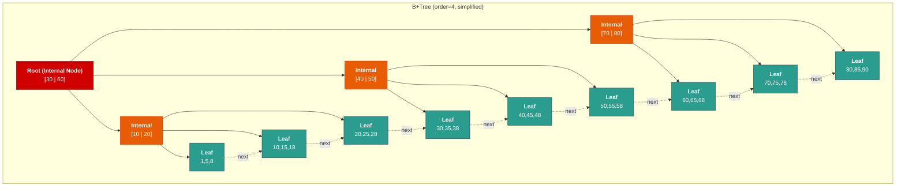
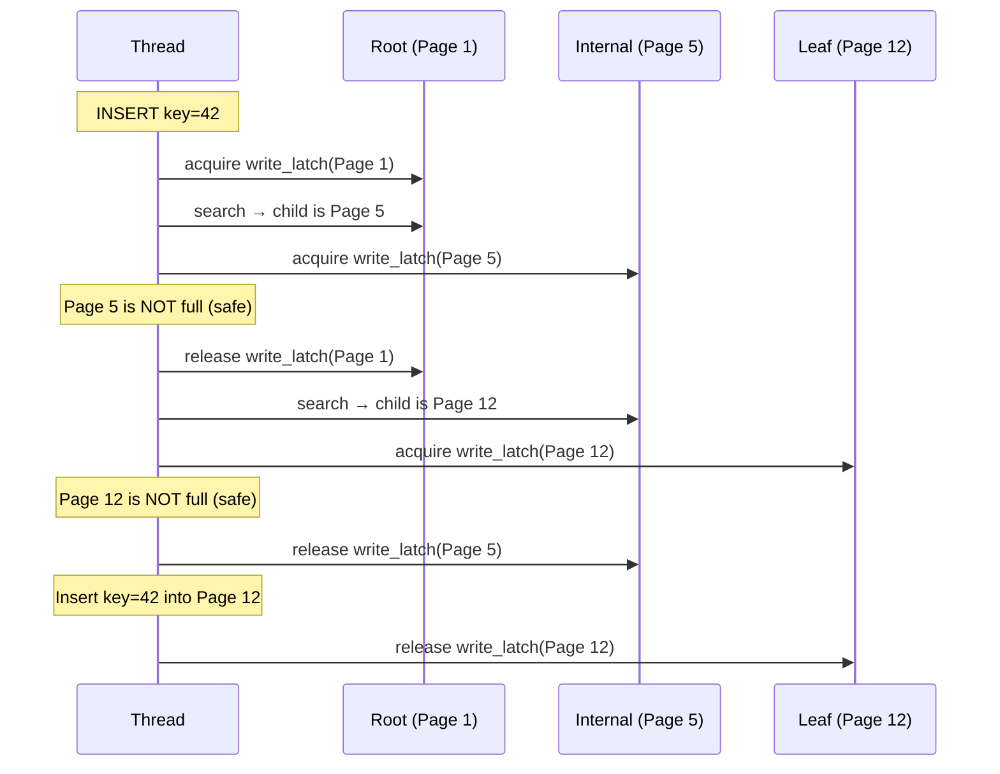

# 2. B+Trees and Indexing 🟢

> **What you'll learn:**
> - Why B+Trees are the dominant index structure for read-heavy OLTP workloads.
> - The anatomy of a B+Tree: internal nodes, leaf nodes, and the linked leaf chain.
> - How node splitting works and why it keeps the tree balanced.
> - Latching protocols (crab/coupling) that make B+Trees safe for concurrent access.

---

## From First Principles: Why Trees?

In Chapter 1, we established that disk I/O is the bottleneck. Finding a specific row among millions requires a strategy. Let's compare the options:

| Strategy | Disk I/Os to find 1 row (1M rows) | Disk I/Os to find 1 row (1B rows) |
|---|---|---|
| Sequential Scan | ~125,000 pages (8 KB pages, 100-byte rows) | ~125,000,000 pages |
| Hash Index | 1–2 (hash + bucket) | 1–2 |
| Binary Search (sorted file) | ~17 (log₂ 125,000) | ~27 |
| **B+Tree (fanout ~500)** | **~3 (log₅₀₀ 1,000,000)** | **~4** |

A B+Tree with a fanout of 500 can index **one billion rows** with only **4 disk reads**. And since the root and first 1–2 levels typically fit in the buffer pool, most lookups require just **1 physical disk I/O** — reading the target leaf page.

This is why B+Trees are the undisputed king of database indexing.

### Why B+Tree, Not Binary Tree?

A binary search tree has fanout 2, giving tree height of `log₂(N)`. For 1 million keys, that's ~20 levels = ~20 disk I/Os per lookup. Each node holds a single key and fits in a few bytes — catastrophically wasteful when each disk I/O reads 8 KB.

The insight: **match the node size to the page size**. A B+Tree node IS a page (8 KB). Each internal node packs hundreds of keys and child pointers, giving a fanout of 200–500+. This collapses the tree height to 3–4 levels for billions of rows.

```
Height vs. Fanout (1 billion keys):
  Binary tree:  log₂(1,000,000,000)  ≈ 30 levels  → 30 disk I/Os
  B+Tree (100): log₁₀₀(1,000,000,000) ≈  5 levels  →  5 disk I/Os
  B+Tree (500): log₅₀₀(1,000,000,000) ≈  4 levels  →  4 disk I/Os
```

---

## B+Tree Anatomy



### Key Properties

1. **Internal nodes** contain only keys and child pointers — NO data. They act as a "routing table" directing searches to the correct leaf.
2. **Leaf nodes** contain keys AND data (or pointers to heap tuples). ALL data lives at the leaf level.
3. **Leaf chain:** Leaf nodes are linked in a doubly-linked list, enabling efficient range scans (`WHERE price BETWEEN 10 AND 50`). After finding the starting leaf via tree traversal, the engine just follows the `next` pointer — no more tree traversal needed.
4. **Balanced:** Every root-to-leaf path has the same length. Insertions maintain balance through **splitting**.
5. **Sorted:** Keys within each node and across sibling leaves are sorted, enabling binary search within each page.

### Internal Node Layout (Simplified)

```
┌──────────────────────────────────────────────────┐
│  Page Header (same as slotted page)              │
├──────────────────────────────────────────────────┤
│  P0 | K1 | P1 | K2 | P2 | K3 | P3 | ... | Kn | Pn │
│                                                  │
│  P0 = pointer to child with keys < K1            │
│  P1 = pointer to child with K1 ≤ keys < K2       │
│  ...                                             │
│  Pn = pointer to child with keys ≥ Kn            │
└──────────────────────────────────────────────────┘
```

Each "pointer" is a `page_id` (4 bytes). Each key might be 8–16 bytes. For an 8 KB page with 16-byte keys:

```
Fanout ≈ PAGE_SIZE / (key_size + pointer_size)
       ≈ 8192 / (16 + 4)
       ≈ 409 children per internal node
```

For 100 million rows: `log₄₀₉(100,000,000) ≈ 3 levels`. The root and one level of internal nodes (~410 pages) easily fit in the buffer pool. **Every point lookup touches exactly 1 disk page** (the target leaf).

---

## Node Splitting

When an insertion causes a leaf node to overflow (exceed its capacity), the node **splits** into two:

```
BEFORE insertion of key 25 into full leaf:
┌──────────────────────┐
│ Leaf: [10, 15, 20, 30] │  ← Full (max 4 keys)
└──────────────────────┘

STEP 1: Insert 25 into sorted position (conceptually):
  [10, 15, 20, 25, 30]  ← 5 keys, exceeds capacity

STEP 2: Split at the midpoint:
┌──────────────┐  ┌──────────────┐
│ Leaf A:       │  │ Leaf B:       │
│ [10, 15]      │  │ [20, 25, 30]  │
└──────────────┘  └──────────────┘

STEP 3: Push the split key (20) up to the parent internal node:
            Parent: [... | 20 | ...]
           /                      \
  Leaf A: [10, 15]        Leaf B: [20, 25, 30]
```

If the parent node is also full, it splits recursively — potentially all the way to the root, increasing the tree height by 1. This is the **only** way a B+Tree grows taller.

### The Naive Way vs. The ACID Way

```rust
// 💥 THE NAIVE WAY: Splitting without WAL protection
fn naive_split_leaf(leaf: &mut Page, parent: &mut Page, new_key: Key) {
    let mid = leaf.num_keys() / 2;

    // Create new sibling page
    let mut sibling = allocate_new_page();

    // Move upper half of keys to sibling
    for i in mid..leaf.num_keys() {
        sibling.insert(leaf.key_at(i), leaf.value_at(i));
    }
    leaf.truncate(mid);

    // 💥 DATA CORRUPTION: Power loss RIGHT HERE means:
    //   - The sibling has the upper keys
    //   - The original leaf still has them too (not yet truncated in WAL)
    //   - The parent doesn't point to the sibling
    // Result: Keys are duplicated or lost. Index is permanently broken.

    parent.insert_child(sibling.key_at(0), sibling.page_id());
    // 💥 If we crash between the parent update and the leaf truncation,
    // the tree is in an inconsistent state.
}
```

```rust
// ✅ THE ACID WAY: WAL-protected split with proper ordering
fn safe_split_leaf(
    leaf: &mut Page,
    parent: &mut Page,
    new_key: Key,
    wal: &mut WriteAheadLog,
) {
    let mid = leaf.num_keys() / 2;
    let sibling = allocate_new_page();

    // ✅ Step 1: Write the ENTIRE split operation to the WAL FIRST
    wal.append(SplitRecord {
        original_page: leaf.page_id(),
        new_page: sibling.page_id(),
        split_key: leaf.key_at(mid),
        parent_page: parent.page_id(),
    });
    wal.flush(); // ✅ fsync the WAL — now the split is recoverable

    // Step 2: Perform the split in memory (buffer pool pages)
    for i in mid..leaf.num_keys() {
        sibling.insert(leaf.key_at(i), leaf.value_at(i));
    }
    leaf.truncate(mid);
    parent.insert_child(sibling.key_at(0), sibling.page_id());

    // Step 3: Mark all three pages dirty in the buffer pool.
    // They'll be flushed to disk later (checkpoint or eviction).
    // If we crash before the flush, the WAL replay will redo the split.
}
```

---

## Concurrency: Latch Crabbing (Latch Coupling)

In a production database, dozens of threads traverse and modify the B+Tree simultaneously. We need **latches** (lightweight mutexes) to protect individual pages from concurrent modification, but we must avoid holding latches on the entire tree — that would serialize all operations.

**Latch Crabbing** (also called Latch Coupling) is the standard protocol:

### Search (Read) Protocol

1. Acquire **read latch** on root.
2. Traverse to the appropriate child.
3. Acquire **read latch** on child.
4. **Release** read latch on parent (the parent is no longer needed).
5. Repeat until reaching the target leaf.

At any point during the search, you hold at most **two latches** (parent + child). This allows massive concurrency for read operations.

### Insert/Delete (Write) Protocol — Pessimistic

1. Acquire **write latch** on root.
2. Traverse to child, acquiring **write latch** on child.
3. If the child is **safe** (won't split/merge on this operation — i.e., not full for inserts, not at minimum for deletes): **release all ancestor latches**.
4. Repeat until reaching the target leaf.
5. Perform the modification.
6. Release all held latches.

A node is "safe" if the current operation cannot cause it to split or merge. Once we reach a safe node, we know the insert/delete won't propagate upward, so all ancestor latches can be released.



### Pessimistic vs. Optimistic Latching

| Approach | Strategy | Pros | Cons |
|---|---|---|---|
| **Pessimistic** | Always acquire write latches on the path down | Simple, always correct | Bottleneck on root — serializes all writes |
| **Optimistic** | Acquire read latches top-down, then write-latch only the leaf. If the leaf needs to split, restart with pessimistic | Root isn't write-latched — much better concurrency | Wastes work on restarts (rare in practice) |

Most production B+Trees use the **optimistic** approach: since the vast majority of inserts don't cause splits (nodes are typically <70% full), acquiring write latches all the way from the root is wasteful.

---

## B+Tree vs. B-Tree: What's the Difference?

These terms are often confused. The critical distinction:

| Property | B-Tree | B+Tree |
|---|---|---|
| Data location | Keys AND data in ALL nodes (internal + leaf) | Data ONLY in leaf nodes |
| Internal nodes | Hold keys + data + child pointers | Hold keys + child pointers only |
| Leaf linked list | No | Yes — leaves linked for range scans |
| Fanout | Lower (data in internal nodes = fewer keys per page) | Higher (no data in internal nodes = more keys per page) |
| Range queries | Must traverse tree for each key | Find start leaf, then follow linked list |
| Used by | Rarely in modern databases | PostgreSQL, MySQL/InnoDB, SQLite, SQL Server |

By removing data from internal nodes, B+Trees pack more keys per page → higher fanout → shorter trees → fewer disk I/Os. The linked leaf list makes range scans trivially efficient. This is why every major relational database uses B+Trees, not B-Trees.

---

## Prefix Compression and Suffix Truncation

Real-world B+Trees use additional optimizations to increase fanout:

**Prefix Compression:** Adjacent keys in a node often share a common prefix (e.g., `"user_000001"`, `"user_000002"`). Store the common prefix once and only the differing suffixes per key. This can double effective fanout for string keys.

**Suffix Truncation (Separator Keys):** Internal nodes don't need the full key — they only need enough of the key to route searches correctly. If two adjacent leaves contain keys ending with `"APPLE"` and `"BANANA"`, the separator key only needs to store `"B"` (or even just the first byte that distinguishes them). This dramatically reduces internal node size.

---

<details>
<summary><strong>🏋️ Exercise: Calculate B+Tree Height and I/O Cost</strong> (click to expand)</summary>

**Scenario:** You have a table with **500 million rows**. Each row has a primary key of 8 bytes (i64). The B+Tree index uses 8 KB pages. Internal node entries consist of a key (8 bytes) and a child page pointer (4 bytes). Leaf node entries consist of a key (8 bytes) and a heap tuple pointer (6 bytes). Assume page headers consume 100 bytes.

**Questions:**
1. What is the fanout of internal nodes?
2. What is the maximum number of entries per leaf node?
3. What is the height of the B+Tree?
4. For a single point query, how many disk I/Os are needed in the worst case?
5. If the top 2 levels are cached in the buffer pool, how many physical disk I/Os are needed?

<details>
<summary>🔑 Solution</summary>

```
Given:
  Page size     = 8192 bytes
  Header        = 100 bytes
  Usable space  = 8192 - 100 = 8092 bytes
  Key size      = 8 bytes
  Child pointer = 4 bytes  (for internal nodes)
  Heap pointer  = 6 bytes  (for leaf nodes)
  Total rows    = 500,000,000

1. Internal Node Fanout:
   Entry size = key + pointer = 8 + 4 = 12 bytes
   Fanout = floor(8092 / 12) = 674 children per internal node
   (Plus one extra child pointer for the leftmost child = 674 keys, 675 children)

2. Leaf Node Capacity:
   Entry size = key + heap_pointer = 8 + 6 = 14 bytes
   Entries per leaf = floor(8092 / 14) = 578 entries per leaf
   (Minus ~8 bytes for sibling pointers, so ~577)

3. Tree Height:
   Number of leaf pages = ceil(500,000,000 / 577) ≈ 866,551 leaves

   Height = ceil(log₆₇₅(866,551))
   - Level 0 (root): 1 node         → routes to 675 children
   - Level 1: 675 nodes              → routes to 675² = 455,625 children
   - Level 2: ~866,551 leaf nodes    → 675² = 455,625 < 866,551 < 675³

   Actually: 675¹ = 675, 675² = 455,625, so we need level 2 internals:
   - Level 0 (root):  1 node
   - Level 1:         ceil(866,551 / 675) = 1,284 nodes
   - Level 2:         866,551 leaf nodes

   Wait — let's recalculate properly:
   - Root has up to 675 children (level 1 nodes)
   - Each level 1 node has up to 675 children (leaf nodes)
   - Max leaves with height 3 = 675 × 675 = 455,625
   - 455,625 < 866,551, so height 3 is NOT enough
   - Max leaves with height 4 = 675³ = 307,546,875
   - 866,551 < 307,546,875, so height 4 is sufficient

   **Tree height = 4** (root + 2 internal levels + leaf level)

4. Worst-case disk I/Os for point query:
   **4 I/Os** (one per level: root → internal → internal → leaf)

5. With top 2 levels cached:
   Root (level 0) and level 1 are in the buffer pool.
   Physical I/Os = 4 - 2 = **2 physical disk I/Os**
   (level 2 internal node + leaf node)

   If the buffer pool is large enough to also cache level 2 
   (~1,284 pages × 8 KB ≈ 10 MB), then only **1 physical I/O** 
   for the leaf page.
```

**Key insight:** For 500 million rows with 8-byte keys, a B+Tree is only 4 levels deep. Caching just 10 MB of internal nodes reduces every point query to a single disk I/O. This is why B+Trees dominate OLTP indexing — the overhead is almost entirely eliminated by the buffer pool.

</details>
</details>

---

> **Key Takeaways**
> - B+Trees minimize disk I/O by matching node size to page size, achieving fanouts of 200–500+ and tree heights of 3–4 for billions of rows.
> - **ALL data lives in leaf nodes**, which are linked for efficient range scans. Internal nodes are pure routing structures.
> - **Node splitting** keeps the tree balanced — it's the only operation that increases tree height, and it propagates upward only when nodes overflow.
> - **Latch crabbing** enables concurrent B+Tree access: hold at most parent + child latches, releasing ancestors as soon as a "safe" node is reached.
> - Optimistic latching (read latches down, write latch only at leaf, restart on split) provides the best throughput for write-heavy workloads.

> **See also:**
> - [Chapter 1: Pages, Slotted Pages, and the Buffer Pool](ch01-pages-buffer-pool.md) — The page layout that B+Tree nodes are built on.
> - [Chapter 3: LSM-Trees and Write Amplification](ch03-lsm-trees.md) — The alternative index structure that outperforms B+Trees on write-heavy workloads.
> - [Chapter 7: Query Parsing and the Optimizer](ch07-query-optimizer.md) — How the optimizer decides between index scan and sequential scan.
