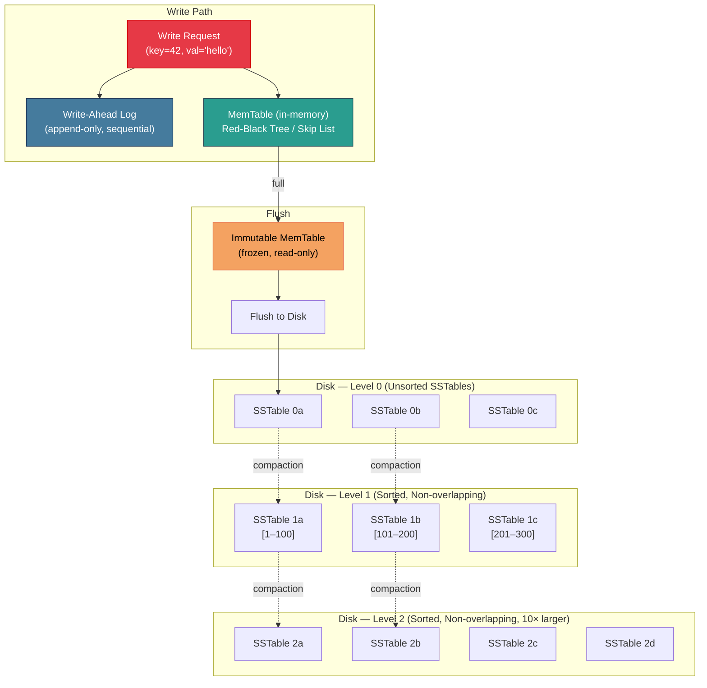

# 3. LSM-Trees and Write Amplification 🟡

> **What you'll learn:**
> - Why B+Trees bottleneck on random writes and how LSM-Trees solve this by converting random I/O to sequential I/O.
> - The full LSM-Tree architecture: MemTable, Write-Ahead Log, SSTables, and the compaction process.
> - Write amplification, read amplification, and space amplification — the three costs you're always trading between.
> - Compaction strategies (Size-Tiered vs. Leveled) and how RocksDB, Cassandra, and LevelDB make different choices.

---

## The B+Tree Write Problem

B+Trees excel at reads because traversal from root to leaf requires only 3–4 I/Os. But writes tell a different story.

To insert a key into a B+Tree:
1. Traverse from root to the correct leaf page (read I/O).
2. Insert the key into the leaf (modify the page in the buffer pool).
3. Mark the page dirty — it must eventually be written back to disk.

The problem is **random write I/O**. Keys are distributed across the tree's leaf pages. Inserting 1 million rows touches ~1 million random leaf pages scattered across the disk. On an HDD, each random write costs ~4 ms. On an SSD, random writes trigger wear leveling and garbage collection, reducing sustained throughput to a fraction of sequential write bandwidth.

| Operation | HDD Throughput | SSD Throughput |
|---|---|---|
| Sequential Write | ~150 MB/s | ~2,000 MB/s |
| Random Write (4 KB) | ~1 MB/s | ~200 MB/s |
| **Throughput ratio** | **150×** | **10×** |

The insight behind LSM-Trees: **convert random writes into sequential writes** by buffering writes in memory and periodically flushing them as large, sorted, sequential batches.

---

## LSM-Tree Architecture



### The Write Path

1. **Write-Ahead Log (WAL):** Every write is first appended to a sequential, append-only log file on disk. This ensures durability — if the process crashes, the WAL can recover all writes that were acknowledged.

2. **MemTable:** The write is simultaneously inserted into an in-memory sorted data structure (typically a **skip list** in RocksDB, or a red-black tree). This buffer absorbs random writes at memory speed.

3. **Freeze and Flush:** When the MemTable reaches a size threshold (e.g., 64 MB in RocksDB), it's frozen — made immutable — and a new, empty MemTable takes its place. A background thread flushes the frozen MemTable to disk as a **Sorted String Table (SSTable)**.

### SSTables (Sorted String Tables)

An SSTable is an immutable, on-disk file containing sorted key-value pairs:

```
┌──────────────────────────────────────────────────┐
│                  SSTable File                     │
├──────────────────────────────────────────────────┤
│  Data Block 0:  [(k1,v1), (k2,v2), ...]         │
│  Data Block 1:  [(k50,v50), (k51,v51), ...]     │
│  Data Block 2:  [(k100,v100), ...]               │
│  ...                                             │
├──────────────────────────────────────────────────┤
│  Index Block:   [k1→Block0, k50→Block1, ...]    │
├──────────────────────────────────────────────────┤
│  Bloom Filter:  (probabilistic membership test)  │
├──────────────────────────────────────────────────┤
│  Footer:        (offsets to index and filter)    │
└──────────────────────────────────────────────────┘
```

Key properties:
- **Immutable:** Once written, an SSTable is never modified. Updates and deletes are handled by writing new entries (with higher sequence numbers) or tombstones.
- **Sorted:** Keys within an SSTable are in sorted order, enabling binary search via the index block.
- **Bloom Filter:** A probabilistic filter that tells you "definitely NOT in this SSTable" or "MAYBE in this SSTable." This avoids reading SSTables that don't contain the target key, dramatically reducing read amplification.

### The Read Path

Reading from an LSM-Tree is more complex than from a B+Tree because the target key could be in any of several locations:

1. **MemTable** (current, in-memory) — check first.
2. **Immutable MemTable** (frozen, being flushed) — check second.
3. **Level 0 SSTables** — check each one (they may overlap).
4. **Level 1+ SSTables** — binary search using the index; check bloom filter first.

The search stops at the **first match** (most recent version of the key). This is correct because newer entries always live in higher levels (closer to memory).

```rust
// Read path pseudocode
fn get(key: &[u8]) -> Option<Value> {
    // 1. Check active MemTable
    if let Some(v) = memtable.get(key) {
        return if v.is_tombstone() { None } else { Some(v) };
    }

    // 2. Check immutable MemTable (if flush in progress)
    if let Some(v) = immutable_memtable.get(key) {
        return if v.is_tombstone() { None } else { Some(v) };
    }

    // 3. Check Level 0 SSTables (newest first, may overlap)
    for sstable in level0.iter().rev() {
        if !sstable.bloom_filter.may_contain(key) {
            continue; // ✅ Bloom filter says definitely NOT here — skip
        }
        if let Some(v) = sstable.get(key) {
            return if v.is_tombstone() { None } else { Some(v) };
        }
    }

    // 4. Check Level 1+ SSTables (non-overlapping — binary search on key ranges)
    for level in &levels[1..] {
        let sstable = level.find_sstable_for_key(key); // Binary search on ranges
        if let Some(sst) = sstable {
            if !sst.bloom_filter.may_contain(key) {
                continue;
            }
            if let Some(v) = sst.get(key) {
                return if v.is_tombstone() { None } else { Some(v) };
            }
        }
    }

    None // Key not found anywhere
}
```

---

## The Three Amplification Costs

Every storage engine lives on a triangle of tradeoffs:

| Amplification Type | Definition | B+Tree | LSM-Tree |
|---|---|---|---|
| **Write Amplification** | Bytes written to storage / bytes written by user | Low-Moderate (in-place update) | High (compaction rewrites data multiple times) |
| **Read Amplification** | I/Os needed per read | Excellent (1–4 I/Os) | Moderate-Poor (may check multiple levels) |
| **Space Amplification** | Disk space used / logical data size | ~1× (in-place updates) | 1.1–2× (old versions until compacted) |

The fundamental tradeoff: **LSM-Trees sacrifice read and space amplification to get dramatically better write throughput.**

### Write Amplification Deep Dive

In a leveled compaction LSM-Tree (like LevelDB), each level is 10× larger than the previous. When compacting from Level L to Level L+1, you merge one SSTable from Level L with the ~10 overlapping SSTables from Level L+1, producing ~11 new SSTables at Level L+1.

This means each key-value pair is rewritten once per level. With 6 levels:
- **Write Amplification ≈ 10 × number_of_levels ≈ 60×**

For every 1 byte the application writes, the storage engine writes ~60 bytes to disk. For SSDs, this is significant because write amplification directly reduces the device's lifespan (NAND cells have limited program/erase cycles).

---

## Compaction Strategies

Compaction is the background process that merges SSTables to:
1. Remove duplicate keys (keeping only the newest version).
2. Remove tombstones (marking deletes).
3. Maintain the sorted invariant at each level.

### Size-Tiered Compaction (STCS)

Used by: **Cassandra** (default), **HBase**

Strategy: When there are N SSTables of similar size at a level, merge them into one larger SSTable.

```
Level 0:  [SST_1] [SST_2] [SST_3] [SST_4]  ← 4 SSTables of ~64MB
                    ↓ merge all 4
Level 1:  [SST_merged_256MB]
```

| Property | Size-Tiered |
|---|---|
| Write Amplification | Low (~4–8×) |
| Read Amplification | Higher (overlapping key ranges at same level) |
| Space Amplification | High (up to 2× during compaction — old + new SSTables coexist) |
| Best for | Write-heavy, time-series, append-only workloads |

### Leveled Compaction (LCS)

Used by: **LevelDB**, **RocksDB** (default)

Strategy: Each level has a strict size limit (Level L = 10^L × base_size). SSTables within a level have **non-overlapping key ranges**. Compaction picks one SSTable from Level L and merges it with overlapping SSTables from Level L+1.

```
Level 0: [SST_0a] [SST_0b]
            ↓ compact SST_0a with overlapping Level 1 SSTables
Level 1: [SST_1a: keys 1-100] [SST_1b: keys 101-200] [SST_1c: keys 201-300]
            ↓ compact SST_1b with overlapping Level 2 SSTables
Level 2: [SST_2a: 1-50] [SST_2b: 51-100] ... [SST_2f: 251-300] ...
```

| Property | Leveled |
|---|---|
| Write Amplification | Higher (~10–30×) |
| Read Amplification | Lower (1 SSTable per level per key range) |
| Space Amplification | Low (~1.1×) |
| Best for | Read-heavy workloads, low space overhead requirements |

### Comparison Table

| Property | Size-Tiered (STCS) | Leveled (LCS) |
|---|---|---|
| Write Amplification | Low | High |
| Read Amplification | High | Low |
| Space Amplification | High | Low |
| Compaction I/O pattern | Large, infrequent bursts | Smaller, more frequent |
| Latency spikes | More severe (large compactions) | Less severe |
| Used by default | Cassandra | RocksDB, LevelDB |

---

## Bloom Filters: The Read Path Savior

Without Bloom filters, a point query on an LSM-Tree might need to read from every SSTable at every level — catastrophic for read performance. Bloom filters fix this.

A **Bloom filter** is a space-efficient probabilistic data structure that answers the question: "Is this key in this SSTable?"

- **"No"** → The key is **definitely not** in this SSTable. Skip it. (Zero false negatives.)
- **"Yes"** → The key **might** be in this SSTable. Read it to check. (Possible false positive.)

With a false-positive rate of 1%, a Bloom filter uses only ~10 bits per key. For an SSTable with 1 million keys, that's only ~1.2 MB — easily kept in memory.

```rust
// Simplified Bloom filter structure
struct BloomFilter {
    bits: Vec<u64>,       // Bit array
    num_hash_fns: usize,  // Number of hash functions (typically 6–10)
}

impl BloomFilter {
    /// Add a key to the filter during SSTable creation
    fn insert(&mut self, key: &[u8]) {
        for i in 0..self.num_hash_fns {
            let hash = self.hash(key, i);
            let bit_pos = hash % (self.bits.len() * 64);
            self.bits[bit_pos / 64] |= 1 << (bit_pos % 64);
        }
    }

    /// Check if a key MIGHT be in this SSTable
    /// Returns false → definitely not present (skip this SSTable)
    /// Returns true  → possibly present (must read to confirm)
    fn may_contain(&self, key: &[u8]) -> bool {
        for i in 0..self.num_hash_fns {
            let hash = self.hash(key, i);
            let bit_pos = hash % (self.bits.len() * 64);
            if self.bits[bit_pos / 64] & (1 << (bit_pos % 64)) == 0 {
                return false; // ✅ Any zero bit → definitely not present
            }
        }
        true // All bits set → possibly present (could be false positive)
    }

    fn hash(&self, key: &[u8], seed: usize) -> usize {
        // Real implementation uses double hashing (hash1 + i*hash2)
        todo!()
    }
}
```

---

## B+Trees vs. LSM-Trees: When to Choose What

| Criteria | B+Tree | LSM-Tree |
|---|---|---|
| Read latency (point query) | Excellent (1–4 I/Os) | Good (MemTable) to Moderate (disk levels) |
| Write throughput | Moderate (random I/O) | Excellent (sequential I/O) |
| Range scan | Excellent (leaf chain) | Good (merge-sort across levels) |
| Space efficiency | Good (~1×) | Moderate (1.1–2×) |
| Write amplification | Low | High (10–60×) |
| Latency predictability | Very predictable | Spiky (compaction pauses) |
| Optimal workload | OLTP: read-heavy, transaction-heavy | Write-heavy, time-series, logging |
| Used by | PostgreSQL, MySQL, SQLite, SQL Server | RocksDB, Cassandra, LevelDB, ScyllaDB |

**The industry trend:** Many modern databases use **both** — a B+Tree for primary indexes and an LSM-Tree for write-heavy secondary storage. Cockroach DB and TiDB use RocksDB (LSM) as their underlying storage engine but present a SQL (B+Tree-like) interface.

---

<details>
<summary><strong>🏋️ Exercise: Calculate Write Amplification</strong> (click to expand)</summary>

**Scenario:** You have a RocksDB instance with leveled compaction configured as follows:
- MemTable size: 64 MB
- Level 0: up to 4 SSTables (each ~64 MB)
- Level 1: 256 MB total
- Level multiplier: 10 (each subsequent level is 10× the previous)
- Total data: 2.5 TB

**Questions:**
1. How many levels does this LSM-Tree have?
2. What is the worst-case write amplification for a single key-value pair?
3. If the application writes at 100 MB/s, what is the actual disk write bandwidth consumed by compaction?
4. If using an SSD rated for 1 PB total writes (TBW), how long before the SSD is worn out at this write rate?

<details>
<summary>🔑 Solution</summary>

```
Given:
  Level 0:   4 × 64 MB = 256 MB
  Level 1:   256 MB
  Level 2:   256 MB × 10 = 2.56 GB
  Level 3:   2.56 GB × 10 = 25.6 GB
  Level 4:   25.6 GB × 10 = 256 GB
  Level 5:   256 GB × 10 = 2.56 TB  ← This covers 2.5 TB of data
  Total data: 2.5 TB

1. Number of levels:
   We need enough levels to hold 2.5 TB.
   Level 5 capacity = 2.56 TB ≥ 2.5 TB ✓
   **Answer: 6 levels** (Level 0 through Level 5)

2. Worst-case write amplification:
   In leveled compaction, compacting one SSTable from Level L
   into Level L+1 requires merging with up to 10 overlapping
   SSTables (because Level L+1 is 10× the size of Level L).

   At each level, the data is read and rewritten:
   - Level 0 → Level 1: factor of ~4 (merging 4 L0 SSTables)
   - Level 1 → Level 2: factor of ~10
   - Level 2 → Level 3: factor of ~10
   - Level 3 → Level 4: factor of ~10
   - Level 4 → Level 5: factor of ~10

   Total write amplification ≈ 4 + 10 + 10 + 10 + 10 = 44×
   
   (Typically cited as 10 × (num_levels - 1) for leveled compaction)
   **Answer: ~44× worst case**

3. Disk write bandwidth:
   Application write rate: 100 MB/s
   Write amplification: 44×
   Actual disk writes: 100 MB/s × 44 = 4,400 MB/s ≈ 4.4 GB/s

   **This exceeds most SSDs' sustained write bandwidth!**
   In practice, RocksDB throttles writes (write stalls) 
   when compaction can't keep up.

4. SSD lifespan:
   SSD TBW (Total Bytes Written): 1 PB = 1,000,000 GB
   Write rate: 4.4 GB/s = 380 TB/day

   Lifespan = 1,000 TB / 380 TB/day ≈ 2.63 days

   **The SSD would be worn out in under 3 days!**
   
   This is why write amplification matters for SSDs.
   Real deployments use:
   - Write throttling
   - Rate limiting on compaction
   - Enterprise SSDs with higher endurance (10+ PBW)
   - Careful tuning of compaction parameters
```

</details>
</details>

---

> **Key Takeaways**
> - LSM-Trees convert **random writes to sequential writes** by buffering in memory (MemTable) and flushing sorted runs (SSTables) to disk.
> - The write path is: **WAL (durability) → MemTable (speed) → SSTable (persistence)**.
> - **Compaction** is the background process that merges SSTables, removes old versions and tombstones, and maintains sorted order at each level.
> - **Write amplification** is the hidden cost of LSM-Trees — each key may be rewritten 10–60× across compaction levels. This has real consequences for SSD lifespan.
> - **Bloom filters** are critical for read performance, eliminating unnecessary SSTable reads with a probabilistic "definitely not here" check.
> - Choose B+Trees for read-heavy OLTP; choose LSM-Trees for write-heavy, append-heavy, or time-series workloads.

> **See also:**
> - [Chapter 2: B+Trees and Indexing](ch02-btrees-indexing.md) — The read-optimized alternative to LSM-Trees.
> - [Chapter 4: Durability and the Write-Ahead Log](ch04-wal-durability.md) — WAL is the first step in the LSM write path.
> - [Hardcore Hardware Sympathy](../hardware-sympathy-book/src/SUMMARY.md) — SSD internals, wear leveling, and why sequential I/O matters.
