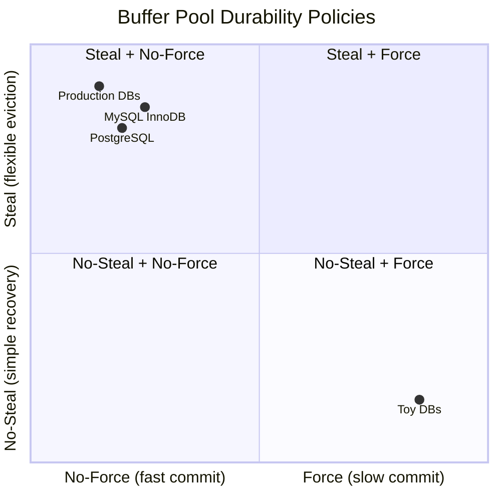
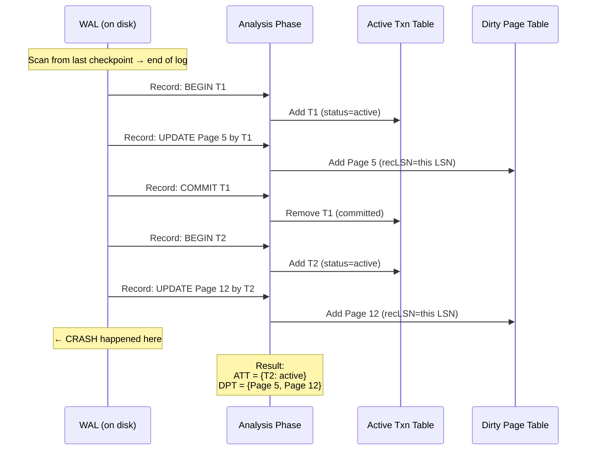

# 4. Durability and the Write-Ahead Log (WAL) 🟡

> **What you'll learn:**
> - Why the WAL is the backbone of crash recovery and why every durable database uses one.
> - The ARIES recovery algorithm: Analysis, Redo, Undo — how databases recover from crashes without losing committed data.
> - Buffer pool policies (Steal/No-Steal, Force/No-Force) and how they interact with the WAL.
> - `fsync()`, group commit, and the real-world performance cost of durability.

---

## The Durability Problem

Consider this sequence of events:

1. Application calls `INSERT INTO accounts VALUES (1, 'Alice', 10000.00)`.
2. The database writes the new row into a page in the buffer pool (in memory).
3. The database tells the application: **"Transaction committed. Your data is safe."**
4. **The power goes out.**

The page was in memory. It was never written to disk. The data is gone — despite the database promising it was committed.

This is the **durability problem**: the buffer pool is volatile memory. Any data that exists only in the buffer pool is lost on crash. The database must not lie about commits.

The solution: **Write-Ahead Logging (WAL)**. Before modifying any data page in the buffer pool, write a log record describing the change to a sequential, append-only log file on disk. On commit, ensure the log is `fsync`'d. If the system crashes, replay the log to reconstruct any changes that were committed but not yet written to data pages.

### The WAL Rule (Write-Ahead Logging Protocol)

> **The WAL Rule:** A data page must NOT be flushed to disk until ALL log records describing changes to that page have been flushed to the WAL first.

This single rule is what makes crash recovery possible. The log is the **source of truth**. Data pages are a performance optimization (a cache of the log's effects).

---

## Log Record Anatomy

Each WAL record contains enough information to either **redo** the change (if committed but not written) or **undo** the change (if not committed but the dirty page was written).

```
┌──────────────────────────────────────────────────────┐
│                    WAL Log Record                     │
├──────────────────────────────────────────────────────┤
│  LSN: 000042          (Log Sequence Number — unique,  │
│                        monotonically increasing)      │
│  Transaction ID: T5                                   │
│  Type: UPDATE                                         │
│  Page ID: 17                                          │
│  Offset: 320                                          │
│  Before Image: [old bytes]  (for UNDO)                │
│  After Image:  [new bytes]  (for REDO)                │
│  Prev LSN: 000039      (previous record for T5)       │
└──────────────────────────────────────────────────────┘
```

**LSN (Log Sequence Number):** Every log record gets a unique, monotonically increasing identifier. Every data page stores the LSN of the last log record that modified it (`page_lsn`). This is how recovery knows whether a page is up-to-date.

---

## Buffer Pool Policies

The relationship between the buffer pool and durability is captured by two orthogonal policy choices:

### Steal Policy: Can an uncommitted dirty page be evicted?

| Policy | Description | Implication |
|---|---|---|
| **Steal** | Yes — the buffer pool CAN flush a dirty page to disk even if the transaction that modified it hasn't committed yet. | Need UNDO during recovery (must undo changes from uncommitted transactions). |
| **No-Steal** | No — dirty pages from uncommitted transactions are pinned and cannot be evicted. | No UNDO needed, but the buffer pool may run out of frames if long transactions hold many pages. |

### Force Policy: Must all dirty pages be flushed at commit time?

| Policy | Description | Implication |
|---|---|---|
| **Force** | Yes — all pages modified by a transaction are forced to disk before commit returns. | No REDO needed during recovery, but commit is extremely slow (random I/O for every dirty page). |
| **No-Force** | No — dirty pages can remain in the buffer pool after commit. They'll be flushed later. | Need REDO during recovery (must redo changes from committed transactions whose pages weren't flushed). |

### The Four Combinations

| Policy | UNDO? | REDO? | Performance | Used By |
|---|---|---|---|---|
| No-Steal + Force | No | No | Terrible (large buffer pool + slow commits) | Almost no one |
| No-Steal + No-Force | No | Yes | Moderate | — |
| Steal + Force | Yes | No | Moderate | — |
| **Steal + No-Force** | **Yes** | **Yes** | **Best** | **PostgreSQL, MySQL, SQL Server** |

Every major database uses **Steal + No-Force** because:
- **Steal** prevents buffer pool exhaustion — any page can be evicted when memory is tight.
- **No-Force** makes commits fast — just flush the WAL (sequential I/O), not every dirty data page (random I/O).
- The cost: recovery requires both UNDO and REDO. This is what the ARIES algorithm handles.



---

## The ARIES Recovery Algorithm

**ARIES** (Algorithm for Recovery and Isolation Exploiting Semantics) is the standard crash recovery algorithm used by virtually all major database systems. It was developed at IBM Research in the early 1990s and remains the gold standard.

ARIES has three phases, executed in order after a crash:

### Phase 1: Analysis

**Goal:** Determine which transactions were active at crash time and which pages might be dirty.

1. Scan the WAL from the last **checkpoint** (a periodic snapshot of the database state) to the end of the log.
2. Build two tables:
   - **Active Transaction Table (ATT):** Transactions that were in progress at crash time (need UNDO).
   - **Dirty Page Table (DPT):** Pages that were probably dirty in the buffer pool at crash time (need REDO).



### Phase 2: Redo (Repeating History)

**Goal:** Restore the database to the exact state it was in at the moment of the crash — including changes from uncommitted transactions.

1. Scan the WAL forward from the **smallest recLSN** in the Dirty Page Table.
2. For each REDO log record:
   - If the page is in the DPT AND the page's on-disk `page_lsn < record_lsn`: apply the redo (the change wasn't persisted yet).
   - Otherwise: skip (the change was already flushed to disk before the crash).

**Why redo uncommitted transaction changes?** Because under the **Steal** policy, some of these changes may have been flushed to data pages on disk. We need to restore the exact crash-time state before we can safely undo them.

### Phase 3: Undo (Rolling Back Losers)

**Goal:** Undo all changes made by transactions that were active (not committed) at crash time.

1. For each transaction in the ATT (the "losers"):
   - Walk backward through its log records (using the `prev_lsn` chain).
   - For each record, apply the **before image** to the page (restoring the old value).
   - Write a **Compensation Log Record (CLR)** for each undo action — this ensures that if we crash during recovery, we don't undo the same action twice.

```rust
// ARIES Recovery pseudocode
fn recover(wal: &WAL, data_files: &mut DataFiles) {
    // Phase 1: Analysis
    let checkpoint = wal.find_last_checkpoint();
    let (mut att, mut dpt) = (HashMap::new(), HashMap::new());

    for record in wal.scan_from(checkpoint) {
        match record.record_type {
            Begin => { att.insert(record.txn_id, Active); }
            Update => {
                dpt.entry(record.page_id)
                   .or_insert(record.lsn); // recLSN = first dirty LSN
            }
            Commit => { att.remove(&record.txn_id); }
            Abort  => { att.insert(record.txn_id, Aborting); }
            _ => {}
        }
    }

    // Phase 2: Redo — replay ALL changes (committed AND uncommitted)
    let min_rec_lsn = dpt.values().min().copied().unwrap_or(checkpoint);
    for record in wal.scan_from(min_rec_lsn) {
        if record.is_update_or_clr() {
            if let Some(&rec_lsn) = dpt.get(&record.page_id) {
                if record.lsn >= rec_lsn {
                    let page = data_files.read_page(record.page_id);
                    if page.lsn < record.lsn {
                        // ✅ Page on disk is stale — apply the redo
                        page.apply_after_image(&record);
                        page.lsn = record.lsn;
                        data_files.write_page(page);
                    }
                }
            }
        }
    }

    // Phase 3: Undo — rollback uncommitted ("loser") transactions
    let losers: Vec<TxnId> = att.keys().cloned().collect();
    for txn_id in losers {
        let mut lsn = att[&txn_id].last_lsn;
        while let Some(record) = wal.read(lsn) {
            if record.is_update() {
                let page = data_files.read_page(record.page_id);
                page.apply_before_image(&record); // ✅ Undo the change
                data_files.write_page(page);

                // ✅ Write CLR so we don't re-undo on repeated crash
                wal.append(CompensationLogRecord {
                    txn_id,
                    undo_next_lsn: record.prev_lsn,
                    page_id: record.page_id,
                });
            }
            lsn = record.prev_lsn; // Walk backward through this txn's records
        }
    }
}
```

---

## fsync() and the Durability Guarantee

The final piece of the durability puzzle: calling `write()` doesn't guarantee data hits the disk. The OS can buffer writes in the kernel's page cache. Only `fsync()` (or `fdatasync()`) forces the data all the way through the OS page cache, the disk controller's write-back cache, and onto the physical storage medium.

### The Naive Way vs. The ACID Way

```rust
use std::fs::File;
use std::io::Write;

// 💥 THE NAIVE WAY: Writing without fsync
fn naive_commit(wal_file: &mut File, log_record: &[u8]) {
    wal_file.write_all(log_record).unwrap();
    // 💥 DATA LOSS: We told the user "committed" but the data is only in
    // the OS page cache. Power loss here = lost transaction.
    // The kernel might not flush this to disk for 30+ seconds.
}
```

```rust
// ✅ THE ACID WAY: fsync on commit
fn durable_commit(wal_file: &mut File, log_record: &[u8]) {
    wal_file.write_all(log_record).unwrap();
    wal_file.sync_all().unwrap(); // ✅ fsync — data is now on persistent storage
    // Only NOW do we tell the user "committed."
    // Survives power loss, OS crash, kernel panic.
}
```

### Group Commit: Making fsync() Not Suck

`fsync()` is expensive — it can take 1–10 ms, depending on the storage device. If every transaction requires its own `fsync`, throughput is limited to ~100–1,000 transactions per second.

**Group commit** batches multiple transactions' WAL records into a single `fsync`:

1. Transaction T1 writes its COMMIT record to the WAL buffer (in memory).
2. Transaction T2 writes its COMMIT record to the same WAL buffer.
3. Transaction T3 writes its COMMIT record.
4. A single `fsync()` flushes all three records to disk simultaneously.
5. All three transactions are acknowledged as committed.

```
Without group commit:  T1 → fsync → T2 → fsync → T3 → fsync
                       1ms + 1ms + 1ms + 1ms + 1ms + 1ms = 6ms for 3 txns

With group commit:     T1, T2, T3 → single fsync
                       ~1ms for 3 txns (amortized: 0.33ms per txn)
```

PostgreSQL's `commit_delay` parameter controls how long to wait for more transactions to join the batch before calling `fsync`. This can increase throughput by 10× or more under concurrent workloads.

---

## Checkpointing

Without checkpoints, recovery would need to replay the **entire** WAL from the beginning of time — impossibly slow for a database that's been running for months. **Checkpoints** create a known-good starting point for recovery.

### Fuzzy Checkpointing (Postgres-style)

A **fuzzy checkpoint** does NOT require stopping all transactions. It:

1. Records the current LSN as the checkpoint LSN.
2. Writes the Active Transaction Table and Dirty Page Table to the WAL.
3. Begins flushing all dirty pages in the buffer pool to disk (in the background).
4. When all dirty pages from before the checkpoint are flushed, records a checkpoint-complete marker.

Recovery starts from the last completed checkpoint, not from the start of the WAL. Old WAL segments before the checkpoint can be recycled (deleted or overwritten).

```
WAL Timeline:
  [...old records...][CHECKPOINT @ LSN 5000][...new records...][CRASH]
                      ↑
                      Recovery starts here (not from the beginning)
```

---

<details>
<summary><strong>🏋️ Exercise: Trace an ARIES Recovery</strong> (click to expand)</summary>

**Scenario:** The following WAL records exist when the system crashes. The last checkpoint was at LSN 1. Page LSNs on disk: Page 1 = 0, Page 2 = 0, Page 3 = 0.

| LSN | Txn | Type | Page | Before | After |
|-----|-----|------|------|--------|-------|
| 1 | — | CHECKPOINT | — | — | — |
| 2 | T1 | BEGIN | — | — | — |
| 3 | T1 | UPDATE | Page 1 | "old_A" | "new_A" |
| 4 | T2 | BEGIN | — | — | — |
| 5 | T2 | UPDATE | Page 2 | "old_B" | "new_B" |
| 6 | T1 | UPDATE | Page 3 | "old_C" | "new_C" |
| 7 | T1 | COMMIT | — | — | — |
| 8 | T2 | UPDATE | Page 1 | "new_A" | "newer_A" |
| **CRASH** |

**Questions:**
1. After the Analysis phase, what are the contents of the ATT and DPT?
2. During the Redo phase, which records are replayed?
3. During the Undo phase, which records are undone?
4. After recovery, what are the final values on Pages 1, 2, and 3?

<details>
<summary>🔑 Solution</summary>

```
Phase 1: Analysis (scan LSN 1 → LSN 8)
━━━━━━━━━━━━━━━━━━━━━━━━━━━━━━━━━━━━━━━
LSN 1: CHECKPOINT — starting point
LSN 2: T1 BEGIN   → ATT: {T1: active}
LSN 3: T1 UPDATE Page 1 → DPT: {Page 1: recLSN=3}
LSN 4: T2 BEGIN   → ATT: {T1: active, T2: active}
LSN 5: T2 UPDATE Page 2 → DPT: {Page 1: 3, Page 2: 5}
LSN 6: T1 UPDATE Page 3 → DPT: {Page 1: 3, Page 2: 5, Page 3: 6}
LSN 7: T1 COMMIT  → ATT: {T2: active}  (T1 removed — it committed)
LSN 8: T2 UPDATE Page 1 → DPT unchanged (Page 1 already in DPT)

Final ATT: {T2: active, lastLSN=8}   ← T2 is a "loser"
Final DPT: {Page 1: recLSN=3, Page 2: recLSN=5, Page 3: recLSN=6}

Phase 2: Redo (scan from min(recLSN) = LSN 3 forward)
━━━━━━━━━━━━━━━━━━━━━━━━━━━━━━━━━━━━━━━
LSN 3: UPDATE Page 1, "old_A" → "new_A"
  Page 1 disk LSN = 0 < 3 → REDO ✅ (apply "new_A")

LSN 5: UPDATE Page 2, "old_B" → "new_B"
  Page 2 disk LSN = 0 < 5 → REDO ✅ (apply "new_B")

LSN 6: UPDATE Page 3, "old_C" → "new_C"
  Page 3 disk LSN = 0 < 6 → REDO ✅ (apply "new_C")

LSN 8: UPDATE Page 1, "new_A" → "newer_A"
  Page 1 now has LSN=3 < 8 → REDO ✅ (apply "newer_A")

After Redo:
  Page 1 = "newer_A" (LSN=8)  — includes T2's uncommitted change!
  Page 2 = "new_B"   (LSN=5)  — T2's uncommitted change
  Page 3 = "new_C"   (LSN=6)  — T1's committed change ✓

Phase 3: Undo (rollback loser T2)
━━━━━━━━━━━━━━━━━━━━━━━━━━━━━━━━━━━━━━━
T2's records (backward): LSN 8, LSN 5

LSN 8: UNDO — restore Page 1 to "new_A" (before image)
  Write CLR: "Page 1 restored to new_A, undo_next=LSN 5"

LSN 5: UNDO — restore Page 2 to "old_B" (before image)
  Write CLR: "Page 2 restored to old_B, undo_next=null"

After Recovery — Final State:
━━━━━━━━━━━━━━━━━━━━━━━━━━━━━━━━━━━━━━━
  Page 1 = "new_A"   ← T1's committed update preserved ✓
  Page 2 = "old_B"   ← T2's uncommitted update undone ✓
  Page 3 = "new_C"   ← T1's committed update preserved ✓

Key insight: T1's commit is honored. T2's changes are rolled back.
The database state is exactly as if T2 never happened.
This is the Atomicity guarantee: all-or-nothing.
```

</details>
</details>

---

> **Key Takeaways**
> - The **WAL rule** is non-negotiable: log records must be flushed before their corresponding dirty data pages. This enables crash recovery.
> - Production databases use **Steal + No-Force** buffer pool policies for the best performance, accepting the complexity of needing both REDO and UNDO during recovery.
> - **ARIES recovery** has three phases: **Analysis** (find losers and dirty pages), **Redo** (restore crash-time state, including uncommitted changes), **Undo** (rollback loser transactions using before images).
> - **Compensation Log Records (CLRs)** make recovery idempotent — safe even if the system crashes during recovery itself.
> - `fsync()` is the only way to guarantee data reaches persistent storage. **Group commit** amortizes `fsync` cost across multiple concurrent transactions.
> - **Checkpoints** limit recovery time by creating periodic starting points, allowing old WAL segments to be reclaimed.

> **See also:**
> - [Chapter 1: Pages, Slotted Pages, and the Buffer Pool](ch01-pages-buffer-pool.md) — The buffer pool whose dirty pages the WAL governs.
> - [Chapter 5: Isolation Levels and Anomalies](ch05-isolation-levels.md) — How the WAL interacts with transaction isolation.
> - [Chapter 3: LSM-Trees and Write Amplification](ch03-lsm-trees.md) — LSM-Trees also use a WAL, but the recovery model differs.
