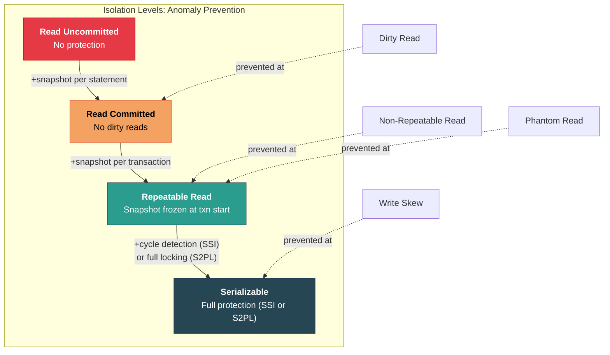

# 5. Isolation Levels and Anomalies 🟡

> **What you'll learn:**
> - The five concurrency anomalies that plague multi-user databases: Dirty Read, Non-Repeatable Read, Phantom Read, Lost Update, and Write Skew.
> - How the four SQL standard isolation levels (Read Uncommitted, Read Committed, Repeatable Read, Serializable) prevent or allow each anomaly.
> - The gap between the SQL standard's definitions and how real databases (PostgreSQL, MySQL) actually implement isolation.
> - Why Snapshot Isolation (used by Postgres's Repeatable Read) allows Write Skew — and why this matters in production.

---

## Why Isolation Matters

If a database served one user at a time, ACID would be trivial. The entire challenge of database concurrency is that **multiple transactions execute simultaneously**, reading and writing overlapping data. Without isolation, these concurrent transactions produce results that would be impossible under serial execution.

The **Isolation** in ACID guarantees that each transaction appears to execute in isolation from all other transactions. The strength of this guarantee varies by isolation level — stronger isolation = fewer anomalies but lower throughput.

---

## The Five Concurrency Anomalies

### 1. Dirty Read

A transaction reads data written by another transaction **that has not yet committed**. If the other transaction rolls back, the first transaction has read data that never existed.

```
T1: UPDATE accounts SET balance = 0 WHERE id = 1;     -- Alice's balance: 1000 → 0
    -- T1 has NOT committed yet

T2: SELECT balance FROM accounts WHERE id = 1;         -- Reads 0 (DIRTY!)

T1: ROLLBACK;                                           -- Alice's balance reverts to 1000

-- T2 made a decision based on balance=0, which never actually existed.
-- If T2 then transferred money based on this, money is created from nothing.
```

### 2. Non-Repeatable Read (Fuzzy Read)

A transaction reads the same row twice and gets different results because another committed transaction modified it in between.

```
T1: SELECT balance FROM accounts WHERE id = 1;         -- Reads 1000
T2: UPDATE accounts SET balance = 500 WHERE id = 1;
T2: COMMIT;
T1: SELECT balance FROM accounts WHERE id = 1;         -- Reads 500 (DIFFERENT!)

-- T1 sees Alice's balance change mid-transaction.
-- Problematic for reports, audits, or multi-step business logic.
```

### 3. Phantom Read

A transaction re-executes a query that returns a set of rows and finds that the set has changed because another committed transaction inserted or deleted rows matching the query predicate.

```
T1: SELECT COUNT(*) FROM orders WHERE status = 'pending';   -- Returns 5
T2: INSERT INTO orders (status) VALUES ('pending');
T2: COMMIT;
T1: SELECT COUNT(*) FROM orders WHERE status = 'pending';   -- Returns 6 (PHANTOM!)

-- T1's view of the world changed. A new "phantom" row appeared.
-- Differs from Non-Repeatable Read: the existing rows didn't change —
-- a NEW row appeared in the result set.
```

### 4. Lost Update

Two transactions read the same row, compute a new value based on the old one, and both write back. One of the updates is silently lost.

```
T1: SELECT balance FROM accounts WHERE id = 1;         -- Reads 1000
T2: SELECT balance FROM accounts WHERE id = 1;         -- Reads 1000
T1: UPDATE accounts SET balance = 1000 + 200 WHERE id = 1;  -- Sets 1200
T2: UPDATE accounts SET balance = 1000 - 300 WHERE id = 1;  -- Sets 700 (T1's +200 is LOST!)
T1: COMMIT;
T2: COMMIT;

-- Expected: 1000 + 200 - 300 = 900. Actual: 700. T1's update is lost.
```

### 5. Write Skew

Two transactions read overlapping data, make independent decisions based on what they read, and both commit — producing a state that violates a constraint that neither transaction individually violated.

```
-- Constraint: At least one doctor must be on call at all times.
-- Currently: Dr. Alice (on_call=true), Dr. Bob (on_call=true)

T1: SELECT COUNT(*) FROM doctors WHERE on_call = true;  -- Returns 2
    -- "Two doctors on call, I can safely take Alice off call"
    UPDATE doctors SET on_call = false WHERE name = 'Alice';

T2: SELECT COUNT(*) FROM doctors WHERE on_call = true;  -- Returns 2
    -- "Two doctors on call, I can safely take Bob off call"
    UPDATE doctors SET on_call = false WHERE name = 'Bob';

T1: COMMIT;
T2: COMMIT;

-- Result: ZERO doctors on call! Constraint violated.
-- Neither transaction individually violated the constraint.
-- This is Write Skew — the most insidious anomaly.
```

---

## SQL Standard Isolation Levels

The SQL standard defines four isolation levels in terms of which anomalies they prevent:

| Isolation Level | Dirty Read | Non-Repeatable Read | Phantom Read | Lost Update | Write Skew |
|---|---|---|---|---|---|
| **Read Uncommitted** | Possible | Possible | Possible | Possible | Possible |
| **Read Committed** | Prevented | Possible | Possible | Possible | Possible |
| **Repeatable Read** | Prevented | Prevented | Possible | Prevented | Possible |
| **Serializable** | Prevented | Prevented | Prevented | Prevented | Prevented |

### What the Standard Doesn't Tell You

The SQL standard was written in 1992 and describes isolation levels in terms of **lock-based** concurrency control. Modern databases (PostgreSQL, CockroachDB) use **Snapshot Isolation (SI)** and **Serializable Snapshot Isolation (SSI)**, which don't map cleanly to the standard's lock-based definitions.

---

## How Real Databases Implement Each Level

### Read Committed (PostgreSQL default)

Each SQL **statement** within the transaction sees a new snapshot of committed data. Between statements, committed changes from other transactions become visible.

```
-- PostgreSQL Read Committed behavior
T1: BEGIN;
T1: SELECT balance FROM accounts WHERE id = 1;  -- Sees 1000

T2: BEGIN;
T2: UPDATE accounts SET balance = 500 WHERE id = 1;
T2: COMMIT;

T1: SELECT balance FROM accounts WHERE id = 1;  -- Sees 500 (T2 committed!)
-- Each SELECT gets a FRESH snapshot of committed data.
-- Non-Repeatable Read is possible and expected.
```

**Implementation:** Before each statement, the engine takes a new snapshot (current committed state). The MVCC visibility check only shows tuples committed before the statement's snapshot.

### Repeatable Read (PostgreSQL = Snapshot Isolation)

The transaction sees a **single snapshot** taken at the start of the first query. All subsequent reads see the same snapshot, regardless of what other transactions commit.

```
-- PostgreSQL Repeatable Read (Snapshot Isolation)
T1: BEGIN ISOLATION LEVEL REPEATABLE READ;
T1: SELECT balance FROM accounts WHERE id = 1;  -- Snapshot taken. Sees 1000.

T2: UPDATE accounts SET balance = 500 WHERE id = 1;
T2: COMMIT;

T1: SELECT balance FROM accounts WHERE id = 1;  -- Still sees 1000!
-- T1's snapshot is frozen at transaction start.
-- Prevents Non-Repeatable Reads and Phantoms.
```

**But PostgreSQL's Repeatable Read allows Write Skew!** Snapshot Isolation is not true Serializable. The doctor on-call example above can still happen.

### Repeatable Read (MySQL/InnoDB)

MySQL implements Repeatable Read differently — using a combination of **Snapshot Isolation** for reads and **Next-Key Locking** for writes. The next-key locks prevent phantoms in many (but not all) cases.

| Behavior | PostgreSQL RR | MySQL/InnoDB RR |
|---|---|---|
| Read mechanism | Snapshot Isolation | Snapshot Isolation |
| Write conflict | First-updater-wins (abort T2) | Row-level locks (block T2) |
| Phantom prevention | Yes (snapshot) | Mostly (next-key locks) |
| Write Skew | **Allowed** | **Allowed** (some cases) |

### Serializable (PostgreSQL = SSI)

PostgreSQL's Serializable uses **Serializable Snapshot Isolation (SSI)** — an extension of snapshot isolation that detects dangerous patterns (read-write dependencies that form a cycle) and aborts one of the transactions.

```
-- PostgreSQL Serializable prevents Write Skew
T1: BEGIN ISOLATION LEVEL SERIALIZABLE;
T1: SELECT COUNT(*) FROM doctors WHERE on_call = true;  -- 2

T2: BEGIN ISOLATION LEVEL SERIALIZABLE;
T2: SELECT COUNT(*) FROM doctors WHERE on_call = true;  -- 2
T2: UPDATE doctors SET on_call = false WHERE name = 'Bob';
T2: COMMIT;  -- OK

T1: UPDATE doctors SET on_call = false WHERE name = 'Alice';
T1: COMMIT;  -- ERROR: could not serialize access
             -- Transaction T1 is ABORTED to prevent Write Skew.
```

**SSI detects the dangerous pattern:** T1 read data that T2 later wrote, AND T2 read data that T1 later wrote. This forms a **read-write dependency cycle** → one transaction must be aborted.

### Serializable (MySQL/InnoDB)

MySQL achieves Serializable through **strict two-phase locking (S2PL)**: all reads acquire shared locks, all writes acquire exclusive locks, and all locks are held until transaction end. This provides true serializability but with significantly lower concurrency.



---

## Practical Guidance: Choosing an Isolation Level

| Workload | Recommended Level | Why |
|---|---|---|
| Web app CRUD (low conflict) | Read Committed | Good balance of performance and correctness. Acceptable for most OLTP. |
| Financial transactions, inventory | Serializable | Must prevent Lost Updates and Write Skew. Correctness > throughput. |
| Report generation, analytics | Repeatable Read (Snapshot) | Needs consistent point-in-time view. No concurrent writes. |
| Append-only logging, time-series | Read Committed | No update conflicts. Mostly inserts. |

**The trap:** Many developers think Read Committed is "safe enough." It prevents dirty reads, yes. But it allows **Lost Updates** (`SELECT balance; UPDATE balance = balance + amount;` is not atomic across two statements). The fix is either:
1. Use Repeatable Read or Serializable.
2. Use `SELECT ... FOR UPDATE` to acquire a row-level lock.
3. Use atomic SQL: `UPDATE accounts SET balance = balance + 200 WHERE id = 1` (no separate SELECT).

---

<details>
<summary><strong>🏋️ Exercise: Anomaly Identification</strong> (click to expand)</summary>

**For each scenario below, identify which concurrency anomaly occurs and the minimum isolation level that prevents it.**

**Scenario A:**
```sql
-- T1 and T2 execute concurrently
T1: SELECT seat_count FROM flights WHERE id = 7;        -- Returns 1
T2: SELECT seat_count FROM flights WHERE id = 7;        -- Returns 1
T1: UPDATE flights SET seat_count = seat_count - 1 WHERE id = 7;
T1: COMMIT;
T2: UPDATE flights SET seat_count = seat_count - 1 WHERE id = 7;
T2: COMMIT;
-- seat_count is now -1 (double-booked!)
```

**Scenario B:**
```sql
T1: BEGIN;
T1: SELECT SUM(balance) FROM accounts WHERE owner = 'Alice';  -- Returns 3000
T2: BEGIN;
T2: INSERT INTO accounts (owner, balance) VALUES ('Alice', 500);
T2: COMMIT;
T1: SELECT SUM(balance) FROM accounts WHERE owner = 'Alice';  -- Returns 3500
T1: COMMIT;
```

**Scenario C:**
```sql
-- Constraint: total balance across checking + savings must be >= 0
-- Checking = 500, Savings = 500
T1: SELECT balance FROM accounts WHERE type='savings';  -- 500
    -- "Savings has 500, I can withdraw 800 from checking"
    UPDATE accounts SET balance = balance - 800 WHERE type='checking';

T2: SELECT balance FROM accounts WHERE type='checking';  -- 500
    -- "Checking has 500, I can withdraw 800 from savings"
    UPDATE accounts SET balance = balance - 800 WHERE type='savings';

T1: COMMIT;
T2: COMMIT;
-- Checking = -300, Savings = -300. Total = -600. Constraint violated!
```

<details>
<summary>🔑 Solution</summary>

**Scenario A: Lost Update**
- T1 and T2 both read `seat_count = 1`, then both decrement it. T1's decrement is lost.
- **Minimum isolation level:** Repeatable Read (in Postgres, the first-updater-wins rule aborts T2). Alternatively, at Read Committed, use `SELECT ... FOR UPDATE` or atomic `UPDATE ... SET seat_count = seat_count - 1 WHERE seat_count > 0`.

**Scenario B: Phantom Read**
- T1 runs the same aggregate query twice and gets different results because T2 inserted a new row matching the predicate.
- **Minimum isolation level:** Repeatable Read (Snapshot Isolation). T1's snapshot is frozen at the first query, so T2's insert is invisible to T1.

**Scenario C: Write Skew**
- T1 reads savings, writes checking. T2 reads checking, writes savings. Each transaction independently satisfies the constraint, but together they violate it.
- **Minimum isolation level:** Serializable (SSI in Postgres or S2PL in MySQL). Only Serializable detects the read-write dependency cycle.
- At Repeatable Read (Snapshot Isolation), this anomaly is **still possible** because each transaction reads from its snapshot and writes to different rows — there's no write-write conflict to trigger first-updater-wins.

**Key insight for Scenario C:** Write Skew is uniquely dangerous because the transactions write to **different rows**. Standard row-level locking only detects conflicts on the **same row**. Detecting Write Skew requires tracking which rows were read (rw-dependency) and detecting cycles — this is what SSI does.

</details>
</details>

---

> **Key Takeaways**
> - **Five anomalies** to know: Dirty Read, Non-Repeatable Read, Phantom Read, Lost Update, and Write Skew. Each has different consequences and requires different isolation levels to prevent.
> - **Read Committed** (Postgres default) prevents only dirty reads. It is NOT safe for read-then-write patterns without explicit locking.
> - **Repeatable Read** in PostgreSQL is actually **Snapshot Isolation** — it prevents phantoms and non-repeatable reads but **allows Write Skew**.
> - Only **Serializable** (SSI in Postgres, S2PL in MySQL) prevents all anomalies, including Write Skew.
> - When in doubt, use **atomic SQL operations** (`UPDATE ... SET x = x + 1`) or explicit locking (`SELECT ... FOR UPDATE`) rather than relying on isolation levels alone.
> - The SQL standard's isolation level definitions are based on 1992 lock-based thinking. Real implementations (MVCC, SSI) behave differently in subtle ways.

> **See also:**
> - [Chapter 6: Two-Phase Locking (2PL) vs. MVCC](ch06-2pl-mvcc.md) — The mechanisms that implement these isolation levels.
> - [Chapter 4: Durability and the Write-Ahead Log](ch04-wal-durability.md) — How the WAL ensures committed transactions survive crashes.
> - [The SQL Rosetta Stone](../sql-rosetta-book/src/SUMMARY.md) — Cross-dialect SQL differences in transaction isolation behavior.
