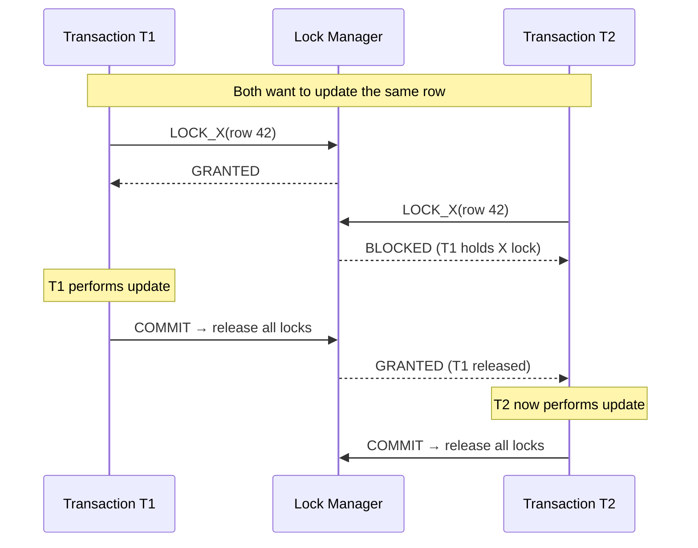
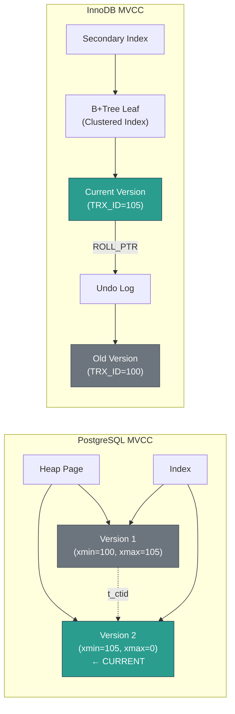

# 6. Two-Phase Locking (2PL) vs. MVCC 🔴

> **What you'll learn:**
> - How Two-Phase Locking (2PL) provides serializability through shared and exclusive locks, and why it causes deadlocks and throughput bottlenecks.
> - The mechanics of Multi-Version Concurrency Control (MVCC): storing multiple versions of a row, transaction IDs, and visibility rules.
> - How PostgreSQL and MySQL/InnoDB each implement MVCC differently (heap-based vs. undo-log-based).
> - Why garbage collection (VACUUM in Postgres, purge in InnoDB) is an essential and unavoidable cost of MVCC.

---

## Two-Phase Locking (2PL)

2PL is the classical approach to concurrency control. The idea is simple: use locks to prevent conflicting operations.

### Lock Types

| Lock Type | Held For | Conflicts With |
|---|---|---|
| **Shared (S)** | Reading a row | Exclusive locks |
| **Exclusive (X)** | Writing a row | Shared AND Exclusive locks |

**Compatibility Matrix:**

|  | S (held) | X (held) |
|---|---|---|
| **S (requested)** | ✅ Compatible | ❌ Blocked |
| **X (requested)** | ❌ Blocked | ❌ Blocked |

Multiple readers can hold shared locks simultaneously (readers don't block readers). But any writer blocks all other readers and writers on the same row.

### The Two Phases

**The key rule of 2PL:** A transaction's life is divided into two phases:

1. **Growing Phase:** The transaction may acquire locks but must NOT release any.
2. **Shrinking Phase:** The transaction may release locks but must NOT acquire any new ones.

In practice, **Strict 2PL (S2PL)** is used: all locks are held until the transaction commits or aborts. This prevents cascading aborts and ensures recoverability.



### The Problem with 2PL: Deadlocks

When two transactions each hold a lock the other needs, neither can proceed:

```
T1: LOCK_X(row A)     -- Granted
T2: LOCK_X(row B)     -- Granted
T1: LOCK_X(row B)     -- BLOCKED (T2 holds it)
T2: LOCK_X(row A)     -- BLOCKED (T1 holds it)
-- DEADLOCK! Neither can proceed.
```

Databases detect deadlocks using a **waits-for graph** (a directed graph of "T1 waits for T2"). If a cycle is detected, one transaction is chosen as the **victim** and aborted to break the cycle.

### The Real Problem: Readers Block Writers, Writers Block Readers

Under 2PL, a long-running `SELECT` (analytical query) holding shared locks blocks all concurrent `UPDATE` operations on the same rows. In a mixed OLTP/OLAP workload, this is devastating — a 10-minute report query can stall all writes.

**This is the fundamental motivation for MVCC:** decouple readers from writers entirely.

---

## Multi-Version Concurrency Control (MVCC)

MVCC solves the reader-writer problem with a powerful insight:

> **Readers never block writers. Writers never block readers.**

Instead of locking rows, the database keeps **multiple versions** of each row. Readers see a consistent snapshot of the database from a point in time; writers create new versions. Conflict detection happens at commit time, not during execution.

### The Core Idea

Each row version is tagged with:
- **xmin:** The transaction ID that **created** this version.
- **xmax:** The transaction ID that **deleted** (or updated, creating a new version) this version. `0` or `null` means the version is still live.

When a transaction reads a row, it checks the visibility rules to determine which version it can see based on its own snapshot.

### Visibility Rules (Simplified)

A row version is **visible** to transaction T (with snapshot S) if:

```
visible = (xmin is committed AND xmin < S)   -- Created before our snapshot
      AND (xmax is NOT set                    -- Not deleted
           OR xmax is not committed           -- Deleter hasn't committed
           OR xmax >= S)                      -- Deleted after our snapshot
```

In English: "I can see this version if it was created by a committed transaction that started before my snapshot, AND it hasn't been deleted by a committed transaction that started before my snapshot."

---

## PostgreSQL's MVCC: Heap-Based Versioning

PostgreSQL stores **all versions of a row in the main heap table** (the data file). An UPDATE creates a brand-new tuple with the updated values — the old tuple remains in the heap with its `xmax` set to the updating transaction's ID.

```
┌─────────────────────────────────────────────────────┐
│              Heap Page (PostgreSQL)                   │
├─────────────────────────────────────────────────────┤
│ Slot 0: (xmin=100, xmax=105) name='Alice', bal=1000 │  ← OLD version
│ Slot 1: (xmin=105, xmax=0)   name='Alice', bal=1200 │  ← CURRENT version
│ Slot 2: (xmin=102, xmax=0)   name='Bob',   bal=500  │  ← CURRENT (no update)
│ Slot 3: (xmin=103, xmax=108) name='Carol', bal=300  │  ← OLD (deleted by T108)
└─────────────────────────────────────────────────────┘
```

**The version chain:** When a row is updated, the old tuple's `t_ctid` (tuple ID) field points to the new tuple. This creates a linked list of versions:

```
Old version (xmin=100, xmax=105) → New version (xmin=105, xmax=0)
   ↑ t_ctid points to new version
```

For a `SELECT` in transaction T110 (snapshot at txn 110):
- Slot 0: xmin=100 (committed, <110 ✓), xmax=105 (committed, <110 ✓ → **deleted**). Not visible.
- Slot 1: xmin=105 (committed, <110 ✓), xmax=0 (not deleted). **Visible.** ✅
- Slot 2: xmin=102 (committed, <110 ✓), xmax=0. **Visible.** ✅
- Slot 3: xmin=103 (committed, <110 ✓), xmax=108 (committed, <110 ✓ → **deleted**). Not visible.

### PostgreSQL MVCC: Pros and Cons

| Aspect | PostgreSQL (Heap-Based) |
|---|---|
| UPDATE cost | Creates full new tuple (expensive for wide rows) |
| Heap bloat | Old versions accumulate in the heap → table grows |
| Index impact | Index entries point to specific heap tuples. When a row is updated, a new index entry is needed too (HOT — Heap-Only Tuple optimization mitigates this for non-indexed columns) |
| VACUUM required | Yes — must reclaim dead tuples to prevent unbounded heap growth |
| Read performance | May need to follow version chain through multiple heap pages |

---

## MySQL/InnoDB's MVCC: Undo-Log-Based Versioning

InnoDB takes a different approach: the **primary (clustered) index always contains the latest version** of the row. Old versions are stored in the **undo log** (a separate storage area).

```
┌──────────────────────────────────────────┐
│    Clustered Index (B+Tree Leaf Page)     │
│                                           │
│  Row: (pk=1, name='Alice', bal=1200,      │
│        DB_TRX_ID=105, DB_ROLL_PTR→undo)  │
│                                           │
│  ← DB_ROLL_PTR points to undo log →      │
└──────────────────────────────────────────┘
          │
          ▼
┌──────────────────────────────────────────┐
│            Undo Log                       │
│                                           │
│  Undo Record: (pk=1, name='Alice',        │
│    bal=1000, DB_TRX_ID=100, prev→null)    │
│                                           │
│  ← Previous version (before T105 update)  │
└──────────────────────────────────────────┘
```

When a transaction needs to read an old version:
1. Read the current version from the B+Tree leaf page.
2. Check `DB_TRX_ID` against the transaction's snapshot.
3. If not visible, follow `DB_ROLL_PTR` to the undo log and check that version.
4. Repeat until a visible version is found.

### InnoDB MVCC: Pros and Cons

| Aspect | InnoDB (Undo-Log-Based) |
|---|---|
| UPDATE cost | Modifies row in-place, pushes old version to undo log |
| Heap bloat | No heap bloat — only undo log grows |
| Index impact | Clustered index always points to latest version. Secondary indexes use a "change buffer" optimization |
| Purge required | Yes — undo log must be purged when no transaction needs old versions |
| Read performance | For current version: excellent (directly in B+Tree). For old versions: undo chain traversal |

---

## Comparison: PostgreSQL vs. InnoDB MVCC

| Feature | PostgreSQL (Heap) | InnoDB (Undo Log) |
|---|---|---|
| Version storage location | Main heap table | Undo log (separate) |
| Current version location | Anywhere in heap (follow chain) | Always in clustered index |
| UPDATE mechanism | Copy entire row to new location | Modify in-place, push old to undo |
| Garbage collection | VACUUM (external process) | Background purge thread |
| Index overhead on UPDATE | New index entry needed (unless HOT) | Clustered index updated in-place |
| Long-running read impact | Prevents VACUUM from reclaiming dead tuples | Prevents undo log purge |
| Table bloat risk | High (without aggressive VACUUM) | Low |



---

## Garbage Collection: The Hidden Cost of MVCC

MVCC's greatest strength — keeping old versions for snapshot reads — is also its greatest operational burden. Old versions that are no longer visible to any active transaction must be reclaimed, or the database grows without bound.

### PostgreSQL: VACUUM

PostgreSQL's `VACUUM` process scans heap pages and marks dead tuples (versions not visible to any running transaction) as reclaimable. `VACUUM FULL` additionally compacts the table, returning space to the OS.

**The autovacuum trap:** If autovacuum falls behind (due to heavy write load, long-running transactions, or misconfigured thresholds), the heap bloats. A 10 GB table can grow to 100 GB with dead tuples. Transaction ID wraparound can also force emergency vacuuming (the xid wraparound problem — transaction IDs are 32-bit in Postgres).

```rust
// ✅ PostgreSQL VACUUM pseudocode
fn vacuum(table: &Table, oldest_active_snapshot: TxnId) {
    for page in table.heap_pages() {
        let mut buffer = buffer_pool.fetch_page(page.id);
        let mut freed_any = false;

        for slot in buffer.slots() {
            let tuple = buffer.read_tuple(slot);

            // A tuple is "dead" if:
            // 1. Its xmax is committed AND
            // 2. No active transaction could possibly need this version
            if tuple.xmax != 0
                && is_committed(tuple.xmax)
                && tuple.xmax < oldest_active_snapshot
            {
                buffer.mark_slot_dead(slot);  // ✅ Reclaim space
                freed_any = true;
            }
        }

        if freed_any {
            buffer.compact();    // Defragment the page
            buffer.mark_dirty(); // Will be flushed to disk
        }
        buffer_pool.unpin(page.id);
    }
}
```

### InnoDB: Purge Thread

InnoDB's background purge thread removes undo log records that are no longer needed. Since the current version is always in the clustered index, purge only needs to clean the undo log — no heap compaction needed.

---

## 2PL vs. MVCC: The Complete Picture

| Dimension | 2PL (Strict) | MVCC |
|---|---|---|
| Reader-writer conflict | Readers block writers, writers block readers | **No blocking** — readers see snapshot |
| Deadlocks | Possible (must detect cycles) | Write-write only (no read-lock deadlocks) |
| Throughput (mixed workload) | Lower (lock contention) | Higher (snapshot reads are lock-free) |
| Correctness guarantee | Serializable (by definition) | Snapshot Isolation (needs SSI for Serializable) |
| Storage overhead | None (no versioning) | Significant (old versions + GC) |
| Long read query impact | Blocks concurrent writes | Prevents GC of old versions |
| Implementation complexity | Moderate (lock manager) | High (version chains, visibility, GC) |
| Used by | MySQL Serializable mode, early databases | PostgreSQL, MySQL RR/RC, Oracle, CockroachDB |

---

<details>
<summary><strong>🏋️ Exercise: Trace MVCC Visibility</strong> (click to expand)</summary>

**Scenario:** A PostgreSQL table `accounts` has one row with `id=1`. The following transactions execute concurrently. All use Repeatable Read (Snapshot Isolation). Transaction IDs are assigned sequentially.

| Time | T100 | T101 | T102 |
|------|------|------|------|
| t1 | BEGIN | | |
| t2 | SELECT balance WHERE id=1 → snapshot taken | BEGIN | |
| t3 | | UPDATE balance=500 WHERE id=1 | BEGIN |
| t4 | | COMMIT | |
| t5 | SELECT balance WHERE id=1 → ? | | SELECT balance WHERE id=1 → snapshot taken, ? |
| t6 | | | UPDATE balance=700 WHERE id=1 → ? |
| t7 | COMMIT | | |
| t8 | | | COMMIT → ? |

**Initial state:** `accounts` row: `(xmin=90, xmax=0, balance=1000)`. Transaction 90 committed long ago.

**Questions:**
1. What does T100 see at t2? At t5?
2. What does T102 see at t5?
3. What happens when T102 tries to UPDATE at t6?
4. Show the heap state after all transactions complete (before VACUUM).

<details>
<summary>🔑 Solution</summary>

```
Initial heap state:
  Slot 0: (xmin=90, xmax=0) balance=1000

t1: T100 begins (txn_id=100)
t2: T100's snapshot: {committed txns up to now, excludes T100 itself}
    T100 sees: Slot 0 (xmin=90 committed, <100 ✓; xmax=0 → live) → balance=1000 ✅

t3: T101 begins (txn_id=101)
    T101 updates row: creates new version, sets xmax on old version:
    Slot 0: (xmin=90, xmax=101) balance=1000  ← old version
    Slot 1: (xmin=101, xmax=0)  balance=500   ← new version

t4: T101 COMMITS.

t5: T100 reads again (Repeatable Read — uses SAME snapshot from t2)
    T100's snapshot was taken at t2, before T101 started.
    - Slot 0: xmin=90 (committed, <100 ✓), xmax=101 (committed, but 101 > snapshot) → VISIBLE
      Why? T100's snapshot only sees txns committed before t2. T101 committed after.
    - Slot 1: xmin=101 (committed, but 101 is NOT in T100's snapshot) → NOT VISIBLE
    T100 sees: balance=1000 ✅ (repeatable read — same as before!)

    T102 begins (txn_id=102) and reads:
    T102's snapshot taken at t5: includes T101 as committed.
    - Slot 0: xmin=90 ✓, xmax=101 (committed, in snapshot ✓ → DELETED) → NOT VISIBLE
    - Slot 1: xmin=101 (committed, in snapshot ✓), xmax=0 → VISIBLE
    T102 sees: balance=500 ✅ (sees T101's committed update)

t6: T102 tries to UPDATE the row (balance=700)
    Under Snapshot Isolation, T102 checks: has this row been modified
    by any transaction that committed AFTER my snapshot?
    T101 committed at t4, which is BEFORE T102's snapshot at t5.
    → No first-updater-wins conflict.
    T102 creates new version:
    Slot 1: (xmin=101, xmax=102) balance=500   ← old version
    Slot 2: (xmin=102, xmax=0)   balance=700   ← new version

    (If T101 had committed AFTER T102's snapshot, T102 would be ABORTED
     with "could not serialize access" error)

t7: T100 COMMITS. (T100 only did SELECTs, no data changes)

t8: T102 COMMITS. ✅

Final heap state (before VACUUM):
━━━━━━━━━━━━━━━━━━━━━━━━━━━━━━━━━━━━━━
  Slot 0: (xmin=90,  xmax=101) balance=1000  ← DEAD (no txn needs this)
  Slot 1: (xmin=101, xmax=102) balance=500   ← DEAD (no txn needs this)  
  Slot 2: (xmin=102, xmax=0)   balance=700   ← LIVE (current version)

After VACUUM:
  Slot 0: (xmin=102, xmax=0) balance=700     ← Only live version remains
  (Slots 0 and 1 reclaimed, page compacted)
```

**Key insights:**
1. T100 always sees balance=1000 despite T101 committing — that's Repeatable Read.
2. T102 sees balance=500 because its snapshot includes T101.
3. T102's UPDATE succeeds because T101 committed **before** T102's snapshot — no conflict.
4. Three versions of the same row exist simultaneously in the heap — VACUUM is essential.

</details>
</details>

---

> **Key Takeaways**
> - **2PL** uses shared/exclusive locks held until commit. It provides serializability but causes **readers to block writers** — devastating for mixed workloads.
> - **MVCC** keeps multiple versions of each row, letting readers see a consistent snapshot without acquiring locks. **Readers never block writers and vice versa.**
> - PostgreSQL stores versions in the **heap** (table bloat risk, VACUUM required). InnoDB stores the current version in the **clustered index** and old versions in the **undo log** (purge required).
> - **Visibility rules** determine which version a transaction sees: check `xmin`/`xmax` against the transaction's snapshot.
> - **Garbage collection** (VACUUM/purge) is the operational cost of MVCC. Long-running transactions prevent GC and cause bloat or undo log growth.
> - MVCC alone provides only Snapshot Isolation. For full Serializability, databases add **SSI** (Postgres) or fall back to **locking** (MySQL Serializable mode).

> **See also:**
> - [Chapter 5: Isolation Levels and Anomalies](ch05-isolation-levels.md) — The anomalies that MVCC and 2PL are designed to prevent.
> - [Chapter 1: Pages, Slotted Pages, and the Buffer Pool](ch01-pages-buffer-pool.md) — The heap pages where MVCC versions live.
> - [Chapter 4: Durability and the Write-Ahead Log](ch04-wal-durability.md) — WAL records for version creation and deletion.
