# 7. Query Parsing and the Optimizer 🔴

> **What you'll learn:**
> - The full lifecycle of a SQL query: parsing → binding → optimization → execution plan.
> - How a SQL string is transformed into an Abstract Syntax Tree (AST) and then a logical query plan.
> - Rule-Based vs. Cost-Based Optimization: why modern databases estimate costs and how they use statistics (histograms, NDV) to make decisions.
> - Join ordering, join algorithm selection (Nested Loop, Hash Join, Merge Join), and how bad optimizer decisions cause queries to run 1000× slower.

---

## The Query Lifecycle

When you execute `SELECT * FROM orders WHERE total > 100 ORDER BY created_at`, the database doesn't just "run" it. The query passes through a sophisticated pipeline:

```mermaid
graph LR
    SQL["SQL String"] --> P["<b>Parser</b><br/>Lexer + Grammar"]
    P --> AST["Abstract<br/>Syntax Tree"]
    AST --> B["<b>Binder/Analyzer</b><br/>Resolve names, types"]
    B --> LP["Logical Plan<br/>(relational algebra)"]
    LP --> O["<b>Optimizer</b><br/>Rule-based + Cost-based"]
    O --> PP["Physical Plan<br/>(concrete algorithms)"]
    PP --> E["<b>Executor</b><br/>Volcano / Vectorized"]
    E --> R["Result Set"]

    style SQL fill:#e63946,stroke:#d00000,color:#fff
    style P fill:#457b9d,stroke:#1d3557,color:#fff
    style O fill:#f4a261,stroke:#e76f51,color:#000
    style E fill:#2a9d8f,stroke:#264653,color:#fff
```



### Stage 1: Parsing

The **parser** (lexer + grammar) converts the SQL string into a structured **Abstract Syntax Tree (AST)**. This is purely syntactic — the parser doesn't know if the table exists or if the column types are valid.

```sql
SELECT name, total FROM orders WHERE total > 100 ORDER BY created_at;
```

Becomes:

```
SelectStatement
├── projections: [Column("name"), Column("total")]
├── from: Table("orders")
├── where: BinaryOp(
│     op: GreaterThan,
│     left: Column("total"),
│     right: Literal(100)
│   )
└── order_by: [Column("created_at"), ASC]
```

### Stage 2: Binding (Semantic Analysis)

The **binder** resolves names against the catalog (system tables):
- Does the table `orders` exist?
- Does it have columns `name`, `total`, `created_at`?
- Is `total > 100` type-valid? (comparing integer to integer ✓)
- Resolve aliases, subqueries, and CTEs.

After binding, we have a **logical plan** expressed in relational algebra:

```
π(name, total)             -- Project
  σ(total > 100)           -- Select (filter)
    Sort(created_at ASC)   -- Sort
      Scan(orders)         -- Table access
```

### Stage 3: Optimization

This is the brain of the database. The optimizer transforms the logical plan into the most efficient **physical plan** — choosing specific algorithms, access methods, and ordering.

---

## Rule-Based vs. Cost-Based Optimization

### Rule-Based Optimization (RBO)

RBO applies a fixed set of transformation rules regardless of the data. Rules have priorities, and the optimizer applies the highest-priority applicable rule.

**Common rules:**
- Push predicates down (filter before join, not after).
- Eliminate redundant projections.
- Convert subqueries to joins where possible.
- Use an index if one exists on the filtered column.

```
BEFORE predicate pushdown:               AFTER predicate pushdown:
                                          
  π(name)                                  π(name)
    ⋈(orders.id = items.order_id)           ⋈(orders.id = items.order_id)
      Scan(orders)                            σ(total > 100)
      Scan(items)                               Scan(orders)
    σ(total > 100)                            Scan(items)

-- Filter moved BELOW the join: processes fewer rows during join
```

**Problem with RBO:** It ignores data distribution. Rule says "use the index on `status`" — but if 95% of rows have `status='active'`, the index scan reads almost the entire table plus the index overhead. A sequential scan would be faster.

### Cost-Based Optimization (CBO)

CBO estimates the **cost** (in terms of I/O and CPU) of multiple candidate plans and picks the cheapest one. It uses **statistics** collected about the data:

| Statistic | What It Measures | Used For |
|---|---|---|
| **Row count** (N) | Total rows in the table | Estimating scan cost |
| **Number of Distinct Values (NDV)** | Unique values per column | Estimating selectivity |
| **Histograms** | Value distribution (frequency, equi-depth) | Estimating range selectivity |
| **Null fraction** | % of NULLs per column | Adjusting selectivity for IS NULL |
| **Average row width** | Bytes per row | Estimating I/O cost |
| **Correlation** | Physical ordering vs. logical ordering | Index scan cost (clustered vs. unclustered) |

#### Selectivity Estimation

The **selectivity** of a predicate is the fraction of rows that satisfy it. For `WHERE total > 100`:

```
selectivity = (max_value - 100) / (max_value - min_value)

If total ranges from 0 to 1000:
  selectivity = (1000 - 100) / (1000 - 0) = 0.9 → 90% of rows match

For equality: WHERE status = 'shipped'
  selectivity ≈ 1 / NDV(status) 
  If NDV = 5: selectivity ≈ 0.2 → 20% of rows match
  (Uniform distribution assumption — histograms improve this)
```

#### Cost Model

A simplified cost model:

```
Sequential Scan cost = N_pages × seq_page_cost
Index Scan cost     = selectivity × N_pages × random_page_cost + index_traversal_cost
```

Where `random_page_cost >> seq_page_cost` (4× in PostgreSQL's default settings).

**Decision point:** An index scan is cheaper than a sequential scan only when selectivity is low (few rows match). The crossover is typically around 5–15% selectivity.

```
Example: 1,000,000 rows, 125,000 pages (8 KB each)

Sequential Scan: 125,000 × 1.0 = 125,000 cost units

Index Scan (selectivity = 1%): 
  0.01 × 125,000 × 4.0 + 3 (tree height) = 5,003 cost units → USE INDEX ✅

Index Scan (selectivity = 50%):
  0.50 × 125,000 × 4.0 + 3 = 250,003 cost units → USE SEQ SCAN ✅
  (Index scan at 50% selectivity is WORSE than seq scan due to random I/O)
```

---

## Join Algorithms

When a query joins two tables, the optimizer must choose a join algorithm. Each has different performance characteristics:

### Nested Loop Join

```
for each row r in outer_table:
    for each row s in inner_table:
        if r.join_key == s.join_key:
            emit (r, s)
```

| Property | Value |
|---|---|
| Cost | O(N × M) — scans inner table once per outer row |
| Best when | Outer table is small, inner table has an index on the join key |
| With index | O(N × log M) — index lookup instead of full inner scan |
| Memory | O(1) — no hash table or sorting needed |

### Hash Join

```
// Build phase: hash the smaller table
hash_table = {}
for each row r in build_table:
    hash_table[hash(r.join_key)].append(r)

// Probe phase: scan the larger table, look up matches
for each row s in probe_table:
    for each row r in hash_table[hash(s.join_key)]:
        if r.join_key == s.join_key:
            emit (r, s)
```

| Property | Value |
|---|---|
| Cost | O(N + M) — each table scanned exactly once |
| Best when | No useful index, both tables are large, equi-join |
| Memory | O(min(N, M)) — build table must fit in memory (or spill to disk) |
| Limitation | Only works for equi-joins (= operator) |

### Sort-Merge Join

```
sort outer_table by join_key
sort inner_table by join_key

// Merge (like merge step of merge sort)
while both cursors valid:
    if outer.key == inner.key: emit match, advance both
    elif outer.key < inner.key: advance outer
    else: advance inner
```

| Property | Value |
|---|---|
| Cost | O(N log N + M log M) for sorting, O(N + M) for merge |
| Best when | Both inputs are already sorted (e.g., from index scan) |
| Memory | O(N + M) for sorting (can be external sort) |
| Handles | Non-equi-joins (>, <, BETWEEN) |

### Join Algorithm Comparison

| Algorithm | Best Case | Worst Case | Memory | Equi-Join Only? |
|---|---|---|---|---|
| Nested Loop (no index) | O(N × M) | O(N × M) | O(1) | No |
| Nested Loop (with index) | O(N × log M) | O(N × M) | O(1) | No |
| Hash Join | O(N + M) | O(N × M) (hash collisions) | O(min(N,M)) | Yes |
| Sort-Merge Join | O(N log N + M log M) | Same | O(N + M) | No |

---

## Join Ordering: The Combinatorial Explosion

For a query joining `k` tables, the number of possible join orderings is:

$$\text{Join orderings} = \frac{(2(k-1))!}{(k-1)!}$$

| Tables | Possible orderings |
|---|---|
| 2 | 2 |
| 3 | 12 |
| 5 | 1,680 |
| 10 | 17,643,225,600 |

For 10+ tables, exhaustive enumeration is impossible. Optimizers use **dynamic programming** (for ≤ ~12 tables) or **heuristic/randomized search** (genetic algorithm in PostgreSQL's GEQO for > ~12 tables).

The join order matters enormously because it determines the size of intermediate results:

```
-- 3 tables: orders (1M rows), customers (100K rows), items (10M rows)
-- Join: orders ⋈ customers ⋈ items

Plan A: (orders ⋈ customers) ⋈ items
  Step 1: 1M × 100K (but with WHERE clause, intermediate = 50K rows)
  Step 2: 50K ⋈ 10M (fast if items has index on order_id)

Plan B: (orders ⋈ items) ⋈ customers
  Step 1: 1M × 10M = potentially billions of intermediate rows
  Step 2: Billions ⋈ 100K (enormous intermediate result)

Plan A might run in 100ms. Plan B might run for hours.
```

---

## EXPLAIN ANALYZE: Reading Execution Plans

The most important debugging tool for query performance is `EXPLAIN ANALYZE`. Here's how to read PostgreSQL output:

```sql
EXPLAIN ANALYZE
SELECT c.name, SUM(o.total)
FROM customers c
JOIN orders o ON c.id = o.customer_id
WHERE c.country = 'US'
GROUP BY c.name;
```

```
HashAggregate  (cost=1250.00..1260.00 rows=100 width=36)
                (actual time=45.2..45.8 rows=98 loops=1)
  Group Key: c.name
  ->  Hash Join  (cost=30.00..1200.00 rows=5000 width=36)
                  (actual time=1.2..40.1 rows=4872 loops=1)
        Hash Cond: (o.customer_id = c.id)
        ->  Seq Scan on orders o  (cost=0.00..800.00 rows=50000 width=12)
                                   (actual time=0.01..15.3 rows=50000 loops=1)
        ->  Hash  (cost=25.00..25.00 rows=500 width=28)
                   (actual time=0.8..0.8 rows=487 loops=1)
              ->  Seq Scan on customers c  (cost=0.00..25.00 rows=500 width=28)
                                            (actual time=0.01..0.5 rows=487 loops=1)
                    Filter: (country = 'US')
                    Rows Removed by Filter: 513
Planning Time: 0.2 ms
Execution Time: 46.1 ms
```

**How to read it:**
- **Indentation = tree structure.** Innermost (most-indented) nodes execute first.
- **cost=startup..total:** Optimizer's estimated cost in arbitrary units.
- **rows=N:** Estimated number of rows produced by this node.
- **actual time=start..end:** Real wall-clock time in milliseconds.
- **rows=N (actual):** Actual number of rows. **Compare with estimate!** When `estimated rows` ≉ `actual rows`, the optimizer made a bad decision because of stale or inaccurate statistics.
- **Rows Removed by Filter:** Rows the filter discarded. High numbers suggest a missing index or unselective filter.

### The Naive Way vs. The ACID Way

```sql
-- 💥 THE NAIVE WAY: Not running ANALYZE after bulk load
-- Optimizer has no statistics → uses default estimates → terrible plan

COPY orders FROM '/data/orders.csv';  -- Load 10M rows
-- No ANALYZE!

SELECT * FROM orders WHERE status = 'returned';
-- Optimizer assumes 50% selectivity (no stats) → Seq Scan
-- In reality, only 0.1% of orders are returned → Index Scan is 500× faster
```

```sql
-- ✅ THE ACID WAY: Always update statistics after bulk operations

COPY orders FROM '/data/orders.csv';
ANALYZE orders;  -- ✅ Update table statistics and histograms

SELECT * FROM orders WHERE status = 'returned';
-- Optimizer now knows selectivity ≈ 0.001 → chooses Index Scan ✅
```

---

## PostgreSQL's Optimizer Architecture

PostgreSQL's optimizer uses a multi-stage approach:

1. **Preprocessing:** Flatten subqueries, expand views, simplify expressions.
2. **Scan path generation:** For each table, enumerate possible access methods (Seq Scan, Index Scan, Bitmap Index Scan, Index-Only Scan).
3. **Join path generation:** For each pair of relations, consider all join algorithms (Nested Loop, Hash Join, Merge Join) in all possible orderings. Use dynamic programming for small numbers of tables; GEQO (Genetic Query Optimizer) for large joins.
4. **Plan selection:** Choose the overall cheapest physical plan.

```
PostgreSQL cost parameters (postgresql.conf):
  seq_page_cost     = 1.0    -- Cost of reading one page sequentially
  random_page_cost  = 4.0    -- Cost of reading one page randomly
  cpu_tuple_cost    = 0.01   -- Cost of processing one row
  cpu_index_tuple_cost = 0.005  -- Cost of processing one index entry
  cpu_operator_cost = 0.0025    -- Cost of evaluating one operator

These are relative weights. Tuning them changes optimizer decisions.
If your data is on fast NVMe SSDs, reduce random_page_cost to ~1.1
(random reads are nearly as fast as sequential on NVMe).
```

---

<details>
<summary><strong>🏋️ Exercise: Optimizer Decision Analysis</strong> (click to expand)</summary>

**Scenario:** You have the following tables and statistics:

```
Table: customers  (10,000 rows, 200 pages)
  Columns: id (PK, B+Tree index), name, country
  NDV(country) = 50

Table: orders  (1,000,000 rows, 50,000 pages)
  Columns: id (PK), customer_id (B+Tree index), total, status
  NDV(status) = 5, NDV(customer_id) = 10,000

PostgreSQL cost parameters: seq_page_cost=1.0, random_page_cost=4.0
```

**Query:**
```sql
SELECT c.name, o.total
FROM customers c
JOIN orders o ON c.id = o.customer_id
WHERE c.country = 'US';
```

**Questions:**
1. Estimate the selectivity of `country = 'US'`.
2. Estimate the number of matching customers.
3. Estimate the number of matching order rows after the join.
4. Compare the cost of these two plans:
   - **Plan A:** Seq Scan customers → filter → Hash Join with Seq Scan orders
   - **Plan B:** Seq Scan customers → filter → Nested Loop with Index Scan on orders.customer_id
5. Which plan would the optimizer choose?

<details>
<summary>🔑 Solution</summary>

```
1. Selectivity of country = 'US':
   sel = 1 / NDV(country) = 1/50 = 0.02 (2%)
   (Assuming uniform distribution; histograms would refine this)

2. Matching customers:
   10,000 × 0.02 = 200 customers match country='US'

3. Matching orders after join:
   Each customer has, on average, 1,000,000 / 10,000 = 100 orders.
   200 customers × 100 orders each = 20,000 matching order rows.

4. Plan A: Seq Scan + Hash Join
   - Scan customers: 200 pages × 1.0 = 200
   - Filter to 200 rows (CPU: 10,000 × 0.01 = 100)
   - Build hash table on 200 customer rows: negligible
   - Scan orders (probe): 50,000 pages × 1.0 = 50,000
   - CPU for probe: 1,000,000 × 0.01 = 10,000
   Total cost ≈ 200 + 100 + 50,000 + 10,000 = 60,300

   Plan B: Seq Scan + Nested Loop + Index Scan
   - Scan customers: 200 pages × 1.0 = 200
   - Filter to 200 rows (CPU: 100)
   - For each of 200 customers, index scan on orders.customer_id:
     - Index traversal: 3 levels × 4.0 = 12 per lookup
     - Read ~100 matching rows across ~100 pages (worst case random):
       100 × 4.0 = 400 per customer
     - But many rows will share pages. Estimate ~10 distinct pages per customer:
       10 × 4.0 = 40 per customer
   - Total index scan cost: 200 × (12 + 40) = 10,400
   - CPU: 200 × 100 × 0.01 = 200
   Total cost ≈ 200 + 100 + 10,400 + 200 = 10,900

5. Optimizer choice:
   Plan B (Nested Loop + Index Scan) costs ~10,900 vs Plan A's ~60,300.
   The optimizer would choose Plan B (Nested Loop with Index Scan). ✅

   Key insight: The filter on customers is highly selective (200 rows).
   This makes Nested Loop ideal — it only probes the index 200 times.
   Hash Join must scan ALL 1M orders regardless of how selective the 
   customer filter is.

   If the filter were less selective (e.g., country with NDV=3, 
   ~3,333 matching customers), Hash Join would win because the 
   Nested Loop would perform 3,333 index lookups.
```

</details>
</details>

---

> **Key Takeaways**
> - A SQL query passes through **Parser → Binder → Optimizer → Executor**. The optimizer is the most complex and impactful stage.
> - **Cost-Based Optimization** uses table statistics (row counts, NDV, histograms) to estimate the cost of candidate plans and pick the cheapest. **Stale statistics → bad plans → slow queries.**
> - **Join algorithm choice** depends on table sizes, selectivity, and available indexes: Nested Loop (small outer + index), Hash Join (large tables, equi-join), Sort-Merge (pre-sorted data). 
> - **Join ordering** is combinatorially explosive. Optimizers use dynamic programming for small join counts and heuristics for large ones.
> - Always run `ANALYZE` after bulk data loads. Use `EXPLAIN ANALYZE` to compare estimated vs. actual row counts — large discrepancies point to stale statistics or bad estimates.

> **See also:**
> - [Chapter 8: Execution Models: Volcano vs. Vectorized](ch08-execution-models.md) — How the chosen physical plan is actually executed.
> - [Chapter 2: B+Trees and Indexing](ch02-btrees-indexing.md) — The index structures the optimizer chooses between.
> - [The SQL Rosetta Stone](../sql-rosetta-book/src/SUMMARY.md) — EXPLAIN syntax differences across PostgreSQL, MySQL, and SQLite.
