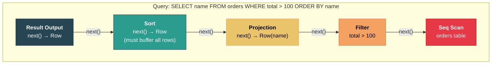

# 8. Execution Models: Volcano vs. Vectorized 🔴

> **What you'll learn:**
> - The Volcano (Iterator) model: the universal execution framework used by PostgreSQL, MySQL, SQLite, and most OLTP databases.
> - Why Volcano's row-at-a-time processing is CPU-inefficient for analytical (OLAP) workloads.
> - Columnar storage: why storing data by column instead of by row transforms analytical performance.
> - Vectorized execution: processing batches of column values using tight loops and SIMD instructions for 10–100× speedups on analytics.

---

## The Volcano Iterator Model

The **Volcano model** (also called the Iterator model or Pull-based model), designed by Goetz Graefe in 1994, is the dominant execution framework in database engines. Every operator in the query plan implements a simple interface:

```rust
trait Operator {
    fn open(&mut self);          // Initialize (open files, acquire resources)
    fn next(&mut self) -> Option<Row>;  // Return the next row, or None if done
    fn close(&mut self);         // Release resources
}
```

Operators are composed into a tree. The root operator calls `next()` on its child, which calls `next()` on its child, and so on, recursively. Rows flow **one at a time** from the leaves (table scans) up to the root (result output).



### Execution Flow

```
Root.next()
  → Sort.next()        // Sort must consume ALL rows first, then emit sorted
      → Projection.next()
          → Filter.next()
              → SeqScan.next()   → returns Row(id=1, name="Alice", total=150)
              Filter checks: 150 > 100? → YES → passes row up
          Projection: extracts name="Alice" → returns Row(name="Alice")
      Sort: buffers Row(name="Alice")
      → Projection.next()
          → Filter.next()
              → SeqScan.next()   → returns Row(id=2, name="Bob", total=50)
              Filter checks: 50 > 100? → NO → calls SeqScan.next() again
              → SeqScan.next()   → returns Row(id=3, name="Carol", total=200)
              Filter checks: 200 > 100? → YES → passes row up
          Projection: returns Row(name="Carol")
      Sort: buffers Row(name="Carol")
      ... (continues until SeqScan returns None)
      Sort: sorts all buffered rows, begins emitting them one at a time
  Sort.next() → Row(name="Alice")
Root emits "Alice"
  Sort.next() → Row(name="Carol")
Root emits "Carol"
```

### Volcano Model Implementation

```rust
// Volcano-style operators
struct SeqScan {
    table: Table,
    cursor: usize,
}

impl Operator for SeqScan {
    fn open(&mut self) {
        self.cursor = 0;
    }

    fn next(&mut self) -> Option<Row> {
        if self.cursor < self.table.num_rows() {
            let row = self.table.read_row(self.cursor);
            self.cursor += 1;
            Some(row)
        } else {
            None
        }
    }

    fn close(&mut self) {}
}

struct Filter {
    child: Box<dyn Operator>,
    predicate: Box<dyn Fn(&Row) -> bool>,
}

impl Operator for Filter {
    fn open(&mut self) { self.child.open(); }

    fn next(&mut self) -> Option<Row> {
        // Keep pulling rows until one passes the predicate (or child is exhausted)
        while let Some(row) = self.child.next() {
            if (self.predicate)(&row) {
                return Some(row);
            }
            // Row filtered out — pull another
        }
        None
    }

    fn close(&mut self) { self.child.close(); }
}

struct HashJoin {
    left: Box<dyn Operator>,   // Build side
    right: Box<dyn Operator>,  // Probe side
    hash_table: HashMap<JoinKey, Vec<Row>>,
    right_buffer: Option<(JoinKey, Vec<Row>, usize)>, // Current probe state
}

impl Operator for HashJoin {
    fn open(&mut self) {
        self.left.open();
        self.right.open();

        // Build phase: consume entire left (build) side into hash table
        while let Some(row) = self.left.next() {
            let key = row.get_join_key();
            self.hash_table.entry(key).or_default().push(row);
        }
    }

    fn next(&mut self) -> Option<Row> {
        // Probe phase: for each right row, look up matching left rows
        loop {
            // If we have buffered matches from the current probe row, emit them
            if let Some((_, ref matches, ref mut idx)) = self.right_buffer {
                if *idx < matches.len() {
                    let combined = combine(&matches[*idx], /* current right row */);
                    *idx += 1;
                    return Some(combined);
                }
                self.right_buffer = None;
            }

            // Pull next probe row
            let right_row = self.right.next()?;
            let key = right_row.get_join_key();
            if let Some(matches) = self.hash_table.get(&key) {
                self.right_buffer = Some((key, matches.clone(), 0));
            }
        }
    }

    fn close(&mut self) {
        self.left.close();
        self.right.close();
    }
}
```

### Volcano: Strengths and Weaknesses

| Strength | Weakness |
|---|---|
| **Simple, composable:** Any operator tree can be built | **Virtual function call per row:** `next()` is a method call through a trait/vtable for every single row |
| **Lazy (pipelined):** Rows flow one at a time — low memory for non-blocking operators (Filter, Project) | **Poor CPU utilization:** Row-at-a-time processing defeats the CPU cache, branch predictor, and SIMD units |
| **Universal:** Works for any query shape | **Interpretation overhead:** Each row crosses multiple operator boundaries with dynamic dispatch |
| **Easy to implement** | **Not SIMD-friendly:** Processing one row at a time can't use 256/512-bit vector instructions |

For **OLTP** workloads (point queries, small result sets), Volcano is fine — the bottleneck is disk I/O, not CPU. But for **OLAP** workloads (scanning millions of rows, aggregations, joins), Volcano's per-row overhead becomes the dominant cost.

---

## Row-Oriented vs. Column-Oriented Storage

Before discussing vectorized execution, we need to understand why OLAP databases store data differently.

### Row-Oriented (N-ary Storage Model, NSM)

Traditional databases (PostgreSQL, MySQL, SQLite) store data **row by row**:

```
Page contents: [Row1: id|name|age|salary] [Row2: id|name|age|salary] [Row3: ...]

Row 1: | 1 | "Alice"  | 32 | 95000 |
Row 2: | 2 | "Bob"    | 45 | 82000 |
Row 3: | 3 | "Carol"  | 28 | 110000|
```

**Good for OLTP:** `SELECT * FROM employees WHERE id = 42` reads one row — all columns are on the same page. One I/O gets everything.

**Bad for OLAP:** `SELECT AVG(salary) FROM employees` needs only the `salary` column. But every page read includes `id`, `name`, `age` — wasting I/O bandwidth loading irrelevant data.

### Column-Oriented (Decomposition Storage Model, DSM)

OLAP databases (DuckDB, ClickHouse, Parquet, Apache Arrow) store data **column by column**:

```
id column:     [1, 2, 3, 4, 5, 6, 7, 8, ...]
name column:   ["Alice", "Bob", "Carol", ...]
age column:    [32, 45, 28, 38, 51, ...]
salary column: [95000, 82000, 110000, 78000, ...]
```

**Good for OLAP:**
- `SELECT AVG(salary)` reads ONLY the salary column from disk. No wasted I/O.
- Same-type values packed together compress dramatically (run-length, dictionary, delta encoding).
- Columnar data is perfectly aligned for SIMD vectorized processing.

**Bad for OLTP:**
- `SELECT * FROM employees WHERE id = 42` must read from EVERY column file and reconstruct the row. Many I/Os for one row.

### Comparison

| Property | Row Store (NSM) | Column Store (DSM) |
|---|---|---|
| Point queries (SELECT * WHERE pk=X) | Excellent (1 I/O) | Poor (1 I/O per column) |
| Full table scan (SELECT col1, col2) | Poor (reads all columns) | Excellent (reads only needed columns) |
| Compression ratio | Low (mixed types per page) | High (same type per page: 5-10× smaller) |
| Insert throughput | Good (append one row) | Complex (must update multiple column files) |
| SIMD friendliness | None (heterogeneous row layout) | Excellent (homogeneous arrays) |
| Typical workload | OLTP (transactions, web apps) | OLAP (analytics, data warehouses) |
| Used by | PostgreSQL, MySQL, SQLite | DuckDB, ClickHouse, Redshift, BigQuery |

---

## Vectorized Execution

Vectorized execution is the modern alternative to Volcano for OLAP workloads. Instead of processing **one row** at a time, operators process **batches of column values** (vectors, typically 1024–4096 values).

```rust
// Volcano: one row at a time
trait VolcanoOperator {
    fn next(&mut self) -> Option<Row>;  // Returns 1 row
}

// Vectorized: batch of column values at a time
trait VectorizedOperator {
    fn next_batch(&mut self) -> Option<RecordBatch>;  // Returns 1024+ rows
}

struct RecordBatch {
    num_rows: usize,
    columns: Vec<ColumnVector>,  // One vector per column
}

struct ColumnVector {
    data: Vec<u8>,           // Tightly packed column values
    validity: Vec<bool>,      // NULL bitmap
    data_type: DataType,
}
```

### Why Vectorized is Faster

**1. Amortized function call overhead:**
- Volcano: 1 virtual function call per row × 1,000,000 rows = 1,000,000 calls.
- Vectorized: 1 function call per batch × 1,000 batches = 1,000 calls. **1000× fewer.**

**2. CPU cache efficiency:**
- Volcano: Each `next()` call touches a row object, then the operator's state, then the next operator's state — cache lines are evicted constantly.
- Vectorized: `next_batch()` processes a tight array of same-type values. The entire batch fits in L1/L2 cache — excellent temporal and spatial locality.

**3. SIMD vectorization:**
- A filter like `WHERE salary > 100000` on a column of `i64` values:

```rust
// Volcano (scalar): Process one value at a time
fn filter_scalar(salaries: &[i64], threshold: i64) -> Vec<bool> {
    salaries.iter().map(|&s| s > threshold).collect()
}

// Vectorized: Process 4 values at a time with AVX2 (256-bit SIMD)
// The compiler can auto-vectorize the tight loop, or we can use intrinsics:
fn filter_vectorized(salaries: &[i64], threshold: i64) -> Vec<bool> {
    // With SIMD, this compares 4 × i64 values per CPU instruction
    // instead of 1. On AVX-512: 8 × i64 per instruction.
    salaries.iter().map(|&s| s > threshold).collect()
    // ✅ The compiler auto-vectorizes this loop when:
    //    - Values are contiguous in memory (columnar layout ✓)
    //    - No data dependencies between iterations ✓
    //    - Loop body is simple arithmetic ✓
}
```

**4. Branch prediction:**
- Volcano: Each row goes through `if (predicate)` — branch misprediction for ~50% selective predicates.
- Vectorized: Filter produces a **selection vector** (bitmask of qualifying positions). Subsequent operators skip non-qualifying rows without branching.

### Vectorized Filter Example

```rust
/// Vectorized filter: produces a selection vector (bitmask)
fn vectorized_filter_gt(
    column: &[i64],
    threshold: i64,
    selection: &mut [bool],
) -> usize {
    let mut count = 0;
    // This tight loop is auto-vectorized by the compiler (SIMD)
    for (i, &val) in column.iter().enumerate() {
        let pass = val > threshold;
        selection[i] = pass;
        count += pass as usize;
    }
    count
}

/// Vectorized aggregation: SUM with selection vector
fn vectorized_sum(column: &[i64], selection: &[bool]) -> i64 {
    let mut sum: i64 = 0;
    for (i, &val) in column.iter().enumerate() {
        if selection[i] {
            sum += val;  // ✅ Branchless: compiler converts to conditional move
        }
    }
    sum
}

/// Full vectorized pipeline for: SELECT SUM(salary) WHERE age > 30
fn execute_query(ages: &[i64], salaries: &[i64]) -> i64 {
    let mut selection = vec![false; ages.len()];

    // Step 1: Filter — produces selection vector
    let _matching = vectorized_filter_gt(ages, 30, &mut selection);

    // Step 2: Aggregate — uses selection vector, skips non-matching rows
    vectorized_sum(salaries, &selection)
}
```

---

## Volcano vs. Vectorized: Complete Comparison

| Dimension | Volcano (Row-at-a-time) | Vectorized (Batch) |
|---|---|---|
| Processing unit | 1 row | 1,024 – 4,096 rows |
| Function calls | 1 per row per operator | 1 per batch per operator |
| Cache behavior | Poor (jumps between operator states) | Excellent (tight loops on arrays) |
| SIMD utilization | None | Full (compiler auto-vectorization) |
| Branch prediction | Poor (per-row predicate checks) | Excellent (selection vectors, branchless) |
| Memory model | Row objects (one Row struct per tuple) | Column vectors (arrays of primitive values) |
| Implementation complexity | Low | Moderate (batch lifecycle, null handling) |
| Best for | OLTP (small result sets, point queries) | OLAP (full scans, aggregations, joins) |
| Throughput (analytical) | ~100M values/sec | ~1-10B values/sec |
| Used by | PostgreSQL, MySQL, SQLite | DuckDB, ClickHouse, Velox, DataFusion |

### The Hybrid Approach

Some modern systems combine both:
- **PostgreSQL 14+** added `JIT compilation` (via LLVM) to reduce interpretation overhead, but it's still fundamentally row-oriented.
- **DuckDB** uses vectorized execution on a column-oriented storage engine — achieving OLAP performance in an embedded (SQLite-like) package.
- **Apache DataFusion** (Rust-based) uses vectorized execution with Apache Arrow's columnar format and is increasingly used as the query engine for data lake systems.

---

## Late Materialization

A powerful optimization in columnar/vectorized systems: **delay converting column data back into rows** for as long as possible.

```
Query: SELECT name FROM employees WHERE age > 30 AND salary > 100000

Early Materialization (row-at-a-time):
  Scan → construct full Row(id, name, age, salary) → filter → project

Late Materialization (columnar):
  Step 1: Filter age column:    [32, 45, 28, 38, 51] → selection = [T, T, F, T, T]
  Step 2: Filter salary column:  [95K, 82K, 110K, 78K, 120K] → refine selection = [F, F, F, F, T]
  Step 3: Use selection vector to fetch ONLY the matching name values
  Result: ["Eve"]  — only 1 row materialized instead of 5
```

Only the final qualifying rows are materialized into full tuples. Intermediate operations work entirely on compressed, cache-friendly column vectors.

---

<details>
<summary><strong>🏋️ Exercise: Estimate Vectorized Speedup</strong> (click to expand)</summary>

**Scenario:** You're running an OLAP query on a table with 100 million rows:
```sql
SELECT department, SUM(salary) FROM employees WHERE age > 30 GROUP BY department;
```

The table has columns: `id (i64)`, `name (varchar)`, `age (i32)`, `salary (i64)`, `department (varchar)`.

**Assumptions:**
- Volcano processes ~100 million virtual function calls (one per row per operator in the pipeline of ~3 operators = 300M function calls).
- Each virtual function call costs ~5 ns (branch misprediction + icache miss).
- Vectorized processes batches of 1,024 rows. Each batch primitive operation (filter, aggregate) takes ~200 ns per batch (tight SIMD loop).
- Only `age`, `salary`, and `department` columns are read (columnar: 4+8+avg8 = 20 bytes/row).
- Row store reads all columns (8+avg32+4+8+avg16 = avg 68 bytes/row).

**Questions:**
1. What is the CPU time for virtual function call overhead in Volcano?
2. What is the CPU time for batch processing in Vectorized?
3. How much data does the row store read vs. the column store?
4. What is the overall estimated speedup of Vectorized + Columnar?

<details>
<summary>🔑 Solution</summary>

```
Given: 100,000,000 rows

1. Volcano CPU overhead (function calls only):
   3 operators × 100M rows × 5 ns/call = 1.5 seconds
   (This is JUST the overhead — actual computation is on top of this)

2. Vectorized CPU time (batch processing):
   Number of batches = 100M / 1024 ≈ 97,656 batches
   3 operators × 97,656 batches × 200 ns/batch = 58.6 ms

   Speedup from reduced function calls: 1500 ms / 58.6 ms ≈ 25×

3. Data read comparison:
   Row store (all 5 columns):    100M × 68 bytes = 6.8 GB
   Column store (3 columns):     100M × 20 bytes = 2.0 GB

   I/O reduction: 6.8 GB / 2.0 GB = 3.4×
   With columnar compression (typically 3-5×): 2.0 GB / 4 = 500 MB
   Effective I/O reduction: 6.8 GB / 500 MB ≈ 13.6×

4. Overall estimated speedup:
   
   Volcano + Row Store:
     Function call overhead:  1,500 ms
     Computation:             ~500 ms  (scalar processing)
     I/O (assuming 1 GB/s):   6,800 ms
     Total: ~8,800 ms

   Vectorized + Column Store:
     Batch processing:         58.6 ms
     Computation (SIMD 4×):    ~125 ms
     I/O (compressed):         500 ms
     Total: ~684 ms

   Overall speedup: 8,800 / 684 ≈ 12.8×

   In practice, DuckDB and ClickHouse achieve 10-100× speedups over
   PostgreSQL for analytical queries, depending on:
   - Compression effectiveness (high-cardinality columns compress less)
   - Memory bandwidth (bottleneck for large scans)
   - Query complexity (joins benefit even more from vectorization)
```

</details>
</details>

---

> **Key Takeaways**
> - The **Volcano (Iterator) model** processes one row at a time through a tree of `next()` calls. It's simple, composable, and universal — but CPU-wasteful for analytical workloads due to per-row virtual function calls and poor cache utilization.
> - **Columnar storage** reads only the columns needed by the query, compresses same-type data effectively, and aligns data for SIMD processing. It's transformative for OLAP but poor for OLTP point queries.
> - **Vectorized execution** processes batches of 1,024+ column values per operator call, enabling compiler auto-vectorization (SIMD), excellent cache locality, and minimal function call overhead. It achieves 10–100× speedups over Volcano for analytical queries.
> - **Late materialization** keeps data in compressed columnar format as long as possible, constructing full rows only for the final result.
> - Modern trend: OLTP databases stay with row-oriented Volcano; OLAP databases use columnar + vectorized; **HTAP** (Hybrid Transactional/Analytical) systems like TiDB use both.

> **See also:**
> - [Chapter 7: Query Parsing and the Optimizer](ch07-query-optimizer.md) — The optimizer that produces the execution plan these models run.
> - [Chapter 1: Pages, Slotted Pages, and the Buffer Pool](ch01-pages-buffer-pool.md) — The row-oriented page layout used by Volcano-based engines.
> - [Rust at the Limit: Compiler Optimizations, SIMD, and Assembly](../compiler-optimizations-book/src/SUMMARY.md) — Deep dive into SIMD intrinsics and auto-vectorization in Rust.
