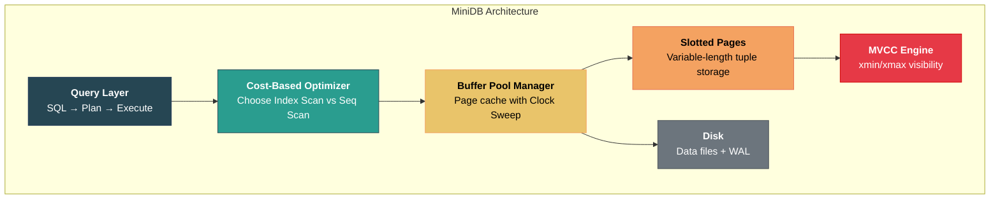

# 9. Capstone Project: Build a Mini Relational Database 🔴

> **What you'll learn:**
> - How to design and implement the four core subsystems of an embedded relational database from scratch.
> - Slotted page layout for variable-length tuples — real byte-level implementation.
> - A complete Buffer Pool Manager with clock sweep eviction, pin tracking, and dirty page management.
> - An MVCC tuple format with `xmin`/`xmax` transaction IDs and visibility rules.
> - A basic Cost-Based Optimizer that chooses between Sequential Scan and Index Scan using mock table statistics.

---

## Project Overview

In this capstone, you will design the core architecture of **MiniDB** — a simplified embedded relational database inspired by SQLite. This is a Staff/Principal-level design exercise that ties together every concept from the previous eight chapters.

MiniDB has four subsystems, each corresponding to a chapter section:



---

## Part 1: Slotted Page Layout

Implement a slotted page that stores variable-length tuples on an 8 KB page. This is the physical foundation of MiniDB — every row lives in a slotted page.

### Requirements

1. **Page size:** 8192 bytes (fixed).
2. **Page header:** Page ID, number of slots, free space pointers, LSN.
3. **Slot array:** Grows from the front of the page (after header).
4. **Tuple data:** Grows from the back of the page.
5. **Insert:** Add a variable-length tuple. Return `(page_id, slot_id)` as the tuple's stable address.
6. **Delete:** Mark a slot as dead (tombstone). Don't physically remove the tuple.
7. **Compact:** Defragment the page — move all live tuples to the back, reclaim gaps.

### Implementation

```rust
const PAGE_SIZE: usize = 8192;
const PAGE_HEADER_SIZE: usize = 24;
const SLOT_SIZE: usize = 4; // offset: u16 + length: u16

/// A TupleId uniquely identifies a tuple across the entire database.
#[derive(Debug, Clone, Copy, PartialEq, Eq, Hash)]
struct TupleId {
    page_id: u32,
    slot_id: u16,
}

/// Page header stored at the beginning of every page.
#[derive(Debug, Clone, Copy)]
struct PageHeader {
    page_id: u32,
    num_slots: u16,
    free_space_begin: u16, // End of slot array (beginning of free space)
    free_space_end: u16,   // Start of tuple data (end of free space)
    lsn: u64,              // Log Sequence Number for WAL recovery
}

/// A single slot in the slot array.
#[derive(Debug, Clone, Copy)]
struct SlotEntry {
    offset: u16, // Byte offset of tuple within page (0 = tombstone/deleted)
    length: u16, // Byte length of tuple
}

/// The slotted page: variable-length tuple storage on a fixed-size page.
struct SlottedPage {
    data: [u8; PAGE_SIZE],
}

impl SlottedPage {
    /// Create a new empty page with the given page_id.
    fn new(page_id: u32) -> Self {
        let mut page = SlottedPage {
            data: [0u8; PAGE_SIZE],
        };
        let header = PageHeader {
            page_id,
            num_slots: 0,
            free_space_begin: PAGE_HEADER_SIZE as u16,
            free_space_end: PAGE_SIZE as u16,
            lsn: 0,
        };
        page.write_header(&header);
        page
    }

    /// Insert a variable-length tuple into the page.
    /// Returns the slot index, or None if the page doesn't have enough space.
    fn insert(&mut self, tuple_data: &[u8]) -> Option<u16> {
        let header = self.read_header();
        let tuple_len = tuple_data.len() as u16;

        // Space needed: tuple data + one new slot entry
        let space_needed = tuple_len as usize + SLOT_SIZE;
        let free_space = (header.free_space_end - header.free_space_begin) as usize;

        if space_needed > free_space {
            return None; // Page full
        }

        // Allocate tuple space from the end (growing toward front)
        let tuple_offset = header.free_space_end - tuple_len;
        self.data[tuple_offset as usize..(tuple_offset + tuple_len) as usize]
            .copy_from_slice(tuple_data);

        // Write new slot entry
        let slot_id = header.num_slots;
        self.write_slot(slot_id, &SlotEntry {
            offset: tuple_offset,
            length: tuple_len,
        });

        // Update header
        self.write_header(&PageHeader {
            num_slots: header.num_slots + 1,
            free_space_begin: header.free_space_begin + SLOT_SIZE as u16,
            free_space_end: tuple_offset,
            ..header
        });

        Some(slot_id)
    }

    /// Read the tuple data for a given slot.
    /// Returns None if the slot is a tombstone (deleted).
    fn read(&self, slot_id: u16) -> Option<&[u8]> {
        let header = self.read_header();
        if slot_id >= header.num_slots {
            return None;
        }

        let slot = self.read_slot(slot_id);
        if slot.offset == 0 {
            return None; // Tombstone — tuple was deleted
        }

        Some(&self.data[slot.offset as usize..(slot.offset + slot.length) as usize])
    }

    /// Delete a tuple by zeroing its slot entry (tombstone).
    /// The space is not reclaimed until compact() is called.
    fn delete(&mut self, slot_id: u16) -> bool {
        let header = self.read_header();
        if slot_id >= header.num_slots {
            return false;
        }

        let slot = self.read_slot(slot_id);
        if slot.offset == 0 {
            return false; // Already deleted
        }

        // Tombstone: set offset to 0 (marker for deleted)
        self.write_slot(slot_id, &SlotEntry { offset: 0, length: 0 });
        true
    }

    /// Compact the page: move all live tuples to the back, reclaiming gaps.
    /// Slot IDs remain stable — only the offsets in the slot array change.
    fn compact(&mut self) {
        let header = self.read_header();

        // Collect all live tuples with their slot IDs
        let mut live_tuples: Vec<(u16, Vec<u8>)> = Vec::new();
        for i in 0..header.num_slots {
            let slot = self.read_slot(i);
            if slot.offset != 0 {
                let data = self.data[slot.offset as usize..(slot.offset + slot.length) as usize]
                    .to_vec();
                live_tuples.push((i, data));
            }
        }

        // Rewrite tuples from the back of the page
        let mut write_offset = PAGE_SIZE as u16;
        for (slot_id, tuple_data) in &live_tuples {
            write_offset -= tuple_data.len() as u16;
            self.data[write_offset as usize..write_offset as usize + tuple_data.len()]
                .copy_from_slice(tuple_data);

            // Update the slot to point to the new location
            self.write_slot(*slot_id, &SlotEntry {
                offset: write_offset,
                length: tuple_data.len() as u16,
            });
        }

        // Update header with new free space boundary
        self.write_header(&PageHeader {
            free_space_end: write_offset,
            ..header
        });
    }

    /// Returns the amount of free space available for new tuples.
    fn free_space(&self) -> usize {
        let header = self.read_header();
        (header.free_space_end - header.free_space_begin) as usize
    }

    // --- Serialization helpers (encode/decode from raw bytes) ---

    fn read_header(&self) -> PageHeader {
        PageHeader {
            page_id: u32::from_le_bytes(self.data[0..4].try_into().unwrap()),
            num_slots: u16::from_le_bytes(self.data[4..6].try_into().unwrap()),
            free_space_begin: u16::from_le_bytes(self.data[6..8].try_into().unwrap()),
            free_space_end: u16::from_le_bytes(self.data[8..10].try_into().unwrap()),
            lsn: u64::from_le_bytes(self.data[16..24].try_into().unwrap()),
        }
    }

    fn write_header(&mut self, h: &PageHeader) {
        self.data[0..4].copy_from_slice(&h.page_id.to_le_bytes());
        self.data[4..6].copy_from_slice(&h.num_slots.to_le_bytes());
        self.data[6..8].copy_from_slice(&h.free_space_begin.to_le_bytes());
        self.data[8..10].copy_from_slice(&h.free_space_end.to_le_bytes());
        self.data[16..24].copy_from_slice(&h.lsn.to_le_bytes());
    }

    fn read_slot(&self, slot_id: u16) -> SlotEntry {
        let base = PAGE_HEADER_SIZE + (slot_id as usize) * SLOT_SIZE;
        SlotEntry {
            offset: u16::from_le_bytes(self.data[base..base + 2].try_into().unwrap()),
            length: u16::from_le_bytes(self.data[base + 2..base + 4].try_into().unwrap()),
        }
    }

    fn write_slot(&mut self, slot_id: u16, slot: &SlotEntry) {
        let base = PAGE_HEADER_SIZE + (slot_id as usize) * SLOT_SIZE;
        self.data[base..base + 2].copy_from_slice(&slot.offset.to_le_bytes());
        self.data[base + 2..base + 4].copy_from_slice(&slot.length.to_le_bytes());
    }
}
```

---

## Part 2: Buffer Pool Manager

Build a Buffer Pool Manager that caches pages in memory, handles page faults (disk reads), and uses Clock Sweep for eviction.

### Requirements

1. **Fixed-size frame array** (configurable, e.g., 1024 frames).
2. **Page table:** `HashMap<PageId, FrameId>` for O(1) lookup.
3. **Pin/Unpin:** Reference counting to prevent eviction of in-use pages.
4. **Dirty tracking:** Mark modified pages for writeback.
5. **Clock Sweep eviction:** Find a victim frame when the pool is full.
6. **Disk I/O abstraction:** `DiskManager` trait for reading/writing pages.

### Implementation

```rust
use std::collections::HashMap;
use std::io::{Read, Write, Seek, SeekFrom};
use std::fs::File;

type PageId = u32;
type FrameId = usize;

/// Abstraction over disk I/O for page reads and writes.
struct DiskManager {
    file: File,
}

impl DiskManager {
    fn read_page(&mut self, page_id: PageId, buf: &mut [u8; PAGE_SIZE]) {
        let offset = page_id as u64 * PAGE_SIZE as u64;
        self.file.seek(SeekFrom::Start(offset)).unwrap();
        self.file.read_exact(buf).unwrap();
    }

    fn write_page(&mut self, page_id: PageId, buf: &[u8; PAGE_SIZE]) {
        let offset = page_id as u64 * PAGE_SIZE as u64;
        self.file.seek(SeekFrom::Start(offset)).unwrap();
        self.file.write_all(buf).unwrap();
        // ✅ In production: fsync() here or during checkpoint
    }
}

/// Per-frame metadata in the buffer pool.
struct FrameMeta {
    page_id: Option<PageId>,
    pin_count: u32,
    dirty: bool,
    ref_bit: bool,
}

/// The Buffer Pool Manager: mediates ALL access to database pages.
struct BufferPoolManager {
    frames: Vec<SlottedPage>,
    meta: Vec<FrameMeta>,
    page_table: HashMap<PageId, FrameId>,
    clock_hand: usize,
    disk: DiskManager,
    num_frames: usize,
}

impl BufferPoolManager {
    fn new(num_frames: usize, disk: DiskManager) -> Self {
        let frames = (0..num_frames)
            .map(|_| SlottedPage { data: [0u8; PAGE_SIZE] })
            .collect();
        let meta = (0..num_frames)
            .map(|_| FrameMeta {
                page_id: None,
                pin_count: 0,
                dirty: false,
                ref_bit: false,
            })
            .collect();

        BufferPoolManager {
            frames,
            meta,
            page_table: HashMap::new(),
            clock_hand: 0,
            disk,
            num_frames,
        }
    }

    /// Fetch a page from the buffer pool. If not cached, read from disk.
    /// Returns a mutable reference to the page (pinned).
    fn fetch_page(&mut self, page_id: PageId) -> Option<&mut SlottedPage> {
        // Fast path: already in the pool
        if let Some(&frame_id) = self.page_table.get(&page_id) {
            self.meta[frame_id].pin_count += 1;
            self.meta[frame_id].ref_bit = true;
            return Some(&mut self.frames[frame_id]);
        }

        // Slow path: evict a victim and load from disk
        let victim = self.find_victim()?;

        // Flush dirty victim to disk
        if self.meta[victim].dirty {
            let old_pid = self.meta[victim].page_id.unwrap();
            self.disk.write_page(old_pid, &self.frames[victim].data);
        }

        // Remove old mapping
        if let Some(old_pid) = self.meta[victim].page_id {
            self.page_table.remove(&old_pid);
        }

        // Read new page from disk
        self.disk.read_page(page_id, &mut self.frames[victim].data);

        // Update metadata
        self.meta[victim] = FrameMeta {
            page_id: Some(page_id),
            pin_count: 1,
            dirty: false,
            ref_bit: true,
        };
        self.page_table.insert(page_id, victim);

        Some(&mut self.frames[victim])
    }

    /// Unpin a page. The caller is done with it.
    fn unpin_page(&mut self, page_id: PageId, dirty: bool) {
        if let Some(&frame_id) = self.page_table.get(&page_id) {
            assert!(self.meta[frame_id].pin_count > 0);
            self.meta[frame_id].pin_count -= 1;
            if dirty {
                self.meta[frame_id].dirty = true;
            }
        }
    }

    /// Allocate a new page on disk, load it into the buffer pool.
    fn new_page(&mut self, page_id: PageId) -> Option<&mut SlottedPage> {
        let victim = self.find_victim()?;

        if self.meta[victim].dirty {
            let old_pid = self.meta[victim].page_id.unwrap();
            self.disk.write_page(old_pid, &self.frames[victim].data);
        }
        if let Some(old_pid) = self.meta[victim].page_id {
            self.page_table.remove(&old_pid);
        }

        // Initialize as empty slotted page
        self.frames[victim] = SlottedPage::new(page_id);
        self.meta[victim] = FrameMeta {
            page_id: Some(page_id),
            pin_count: 1,
            dirty: true, // New page — needs to be written to disk
            ref_bit: true,
        };
        self.page_table.insert(page_id, victim);

        Some(&mut self.frames[victim])
    }

    /// Flush all dirty pages to disk.
    fn flush_all(&mut self) {
        for i in 0..self.num_frames {
            if self.meta[i].dirty {
                if let Some(pid) = self.meta[i].page_id {
                    self.disk.write_page(pid, &self.frames[i].data);
                    self.meta[i].dirty = false;
                }
            }
        }
    }

    /// Clock Sweep eviction: find an unpinned frame with ref_bit=0.
    fn find_victim(&mut self) -> Option<FrameId> {
        let n = self.num_frames;
        for _ in 0..2 * n {
            let idx = self.clock_hand;
            self.clock_hand = (self.clock_hand + 1) % n;

            if self.meta[idx].pin_count > 0 {
                continue; // Can't evict a pinned page
            }

            if self.meta[idx].page_id.is_none() {
                return Some(idx); // Empty frame — immediate win
            }

            if self.meta[idx].ref_bit {
                self.meta[idx].ref_bit = false; // Second chance
            } else {
                return Some(idx); // Victim found
            }
        }
        None // All frames pinned
    }
}
```

---

## Part 3: MVCC Tuple Format

Design an MVCC-aware tuple format that supports concurrent transactions. Each tuple version carries metadata for visibility checking.

### Requirements

1. Each tuple has `xmin` (creating transaction) and `xmax` (deleting transaction).
2. Visibility function: given a transaction's snapshot, determine if a tuple version is visible.
3. INSERT creates a new tuple with `xmin = current_txn_id, xmax = 0`.
4. DELETE sets `xmax = current_txn_id` on the existing tuple.
5. UPDATE = DELETE old version + INSERT new version (new tuple with new xmin).

### Implementation

```rust
type TxnId = u64;

/// Transaction status — tracked in a global transaction table.
#[derive(Debug, Clone, Copy, PartialEq)]
enum TxnStatus {
    Active,
    Committed,
    Aborted,
}

/// A snapshot represents the set of committed transactions visible to a reader.
#[derive(Debug, Clone)]
struct Snapshot {
    /// Transaction ID of the reader.
    txn_id: TxnId,
    /// The smallest active transaction ID at snapshot time.
    /// All txns with ID < xmin are guaranteed committed or aborted.
    xmin: TxnId,
    /// The next transaction ID that will be assigned.
    /// All txns with ID >= xmax are invisible (started after snapshot).
    xmax: TxnId,
    /// Set of transaction IDs that were active (in-progress) at snapshot time.
    /// These are between xmin and xmax but NOT yet committed.
    active_txns: Vec<TxnId>,
}

/// MVCC tuple header prepended to every tuple's data.
#[derive(Debug, Clone, Copy)]
struct MvccHeader {
    xmin: TxnId,  // Transaction that created this tuple version
    xmax: TxnId,  // Transaction that deleted/updated this version (0 = live)
}

/// Global transaction manager — tracks status of all transactions.
struct TransactionManager {
    statuses: HashMap<TxnId, TxnStatus>,
    next_txn_id: TxnId,
    active_txns: Vec<TxnId>,
}

impl TransactionManager {
    fn new() -> Self {
        TransactionManager {
            statuses: HashMap::new(),
            next_txn_id: 1,
            active_txns: Vec::new(),
        }
    }

    fn begin(&mut self) -> (TxnId, Snapshot) {
        let txn_id = self.next_txn_id;
        self.next_txn_id += 1;
        self.statuses.insert(txn_id, TxnStatus::Active);
        self.active_txns.push(txn_id);

        let snapshot = Snapshot {
            txn_id,
            xmin: *self.active_txns.iter().min().unwrap_or(&txn_id),
            xmax: self.next_txn_id,
            active_txns: self.active_txns.clone(),
        };

        (txn_id, snapshot)
    }

    fn commit(&mut self, txn_id: TxnId) {
        self.statuses.insert(txn_id, TxnStatus::Committed);
        self.active_txns.retain(|&id| id != txn_id);
    }

    fn abort(&mut self, txn_id: TxnId) {
        self.statuses.insert(txn_id, TxnStatus::Aborted);
        self.active_txns.retain(|&id| id != txn_id);
    }

    fn status(&self, txn_id: TxnId) -> TxnStatus {
        // Very old transactions (before our tracking window) are assumed committed
        *self.statuses.get(&txn_id).unwrap_or(&TxnStatus::Committed)
    }
}

/// MVCC visibility check: is this tuple version visible to the given snapshot?
///
/// A tuple is visible if:
///   1. xmin is committed AND visible in the snapshot
///   2. xmax is either unset (0), or the deleting txn is not committed,
///      or the deleting txn is not visible in the snapshot
fn is_visible(header: &MvccHeader, snapshot: &Snapshot, txn_mgr: &TransactionManager) -> bool {
    // Check 1: Was the creating transaction committed and visible?
    let xmin_visible = if header.xmin == snapshot.txn_id {
        true // We created this tuple ourselves — always visible
    } else if snapshot.active_txns.contains(&header.xmin) {
        false // Creator was still active when we took our snapshot
    } else if header.xmin >= snapshot.xmax {
        false // Creator started after our snapshot
    } else {
        txn_mgr.status(header.xmin) == TxnStatus::Committed
    };

    if !xmin_visible {
        return false;
    }

    // Check 2: Has this tuple been deleted (xmax set)?
    if header.xmax == 0 {
        return true; // Not deleted — visible ✅
    }

    // If WE deleted it, it's not visible to us
    if header.xmax == snapshot.txn_id {
        return false;
    }

    // If the deleter was active in our snapshot, the delete isn't visible to us
    if snapshot.active_txns.contains(&header.xmax) {
        return true; // Deleter hadn't committed in our snapshot — tuple still visible
    }

    // If the deleter started after our snapshot, not visible to us
    if header.xmax >= snapshot.xmax {
        return true; // Tuple still visible in our snapshot
    }

    // Deleter committed before our snapshot — tuple is deleted
    txn_mgr.status(header.xmax) != TxnStatus::Committed
}

/// MVCC operations on the heap (conceptual — uses buffer pool in practice)
struct MvccHeap {
    txn_mgr: TransactionManager,
    // In practice, this uses the BufferPoolManager and SlottedPages
}

impl MvccHeap {
    /// INSERT: create a new tuple version
    fn insert(&mut self, txn_id: TxnId, tuple_data: &[u8]) -> TupleId {
        let header = MvccHeader { xmin: txn_id, xmax: 0 };
        // Serialize header + tuple_data into the slotted page
        let mut full_tuple = Vec::with_capacity(16 + tuple_data.len());
        full_tuple.extend_from_slice(&header.xmin.to_le_bytes());
        full_tuple.extend_from_slice(&header.xmax.to_le_bytes());
        full_tuple.extend_from_slice(tuple_data);

        // Write to a page via the buffer pool (simplified)
        // In practice: find a page with enough free space, or allocate a new one
        todo!("Write full_tuple to a slotted page via buffer pool")
    }

    /// DELETE: set xmax on the existing tuple
    fn delete(&mut self, txn_id: TxnId, tuple_id: TupleId) {
        // Read the tuple's MVCC header from the page
        // Set xmax = txn_id
        // Mark the page dirty in the buffer pool
        todo!("Update xmax field in the tuple's MVCC header")
    }

    /// UPDATE: delete old version + insert new version
    fn update(&mut self, txn_id: TxnId, old_tuple_id: TupleId, new_data: &[u8]) -> TupleId {
        self.delete(txn_id, old_tuple_id);
        self.insert(txn_id, new_data)
    }

    /// SCAN: read all visible tuples for a given snapshot
    fn scan(&self, snapshot: &Snapshot) -> Vec<Vec<u8>> {
        let mut results = Vec::new();
        // For each page in the table's page list:
        //   For each tuple on the page:
        //     Deserialize MvccHeader
        //     If is_visible(&header, snapshot, &self.txn_mgr):
        //       Add tuple data (after header) to results
        todo!("Scan all pages and filter by visibility")
    }
}
```

---

## Part 4: Cost-Based Optimizer

Build a minimal optimizer that, given a `SELECT ... WHERE column = value` query and table statistics, chooses between a Sequential Scan and an Index Scan.

### Requirements

1. Maintain mock table statistics: row count, number of pages, and NDV (number of distinct values) per column.
2. For a given predicate, estimate **selectivity**.
3. Compute the cost of Sequential Scan vs. Index Scan.
4. Choose the cheaper plan.

### Implementation

```rust
/// Table statistics used by the optimizer.
struct TableStats {
    table_name: String,
    num_rows: u64,
    num_pages: u64,
    columns: Vec<ColumnStats>,
}

struct ColumnStats {
    name: String,
    num_distinct: u64,      // NDV (Number of Distinct Values)
    has_index: bool,         // Is there a B+Tree index on this column?
    index_height: u32,       // B+Tree height (only relevant if has_index)
}

/// Cost model parameters (matching PostgreSQL defaults).
struct CostParams {
    seq_page_cost: f64,      // Cost of reading one page sequentially (1.0)
    random_page_cost: f64,   // Cost of reading one page randomly (4.0)
    cpu_tuple_cost: f64,     // Cost of processing one tuple (0.01)
    cpu_index_tuple_cost: f64, // Cost of processing one index entry (0.005)
}

impl Default for CostParams {
    fn default() -> Self {
        CostParams {
            seq_page_cost: 1.0,
            random_page_cost: 4.0,
            cpu_tuple_cost: 0.01,
            cpu_index_tuple_cost: 0.005,
        }
    }
}

/// Represents a query predicate: WHERE column = value
struct EqualityPredicate {
    column_name: String,
}

/// The two scan strategies we consider.
#[derive(Debug)]
enum ScanPlan {
    SeqScan {
        table: String,
        estimated_cost: f64,
        estimated_rows: u64,
    },
    IndexScan {
        table: String,
        index_column: String,
        estimated_cost: f64,
        estimated_rows: u64,
    },
}

/// The Cost-Based Optimizer: chooses between Seq Scan and Index Scan.
struct Optimizer {
    params: CostParams,
}

impl Optimizer {
    fn new() -> Self {
        Optimizer {
            params: CostParams::default(),
        }
    }

    /// Estimate selectivity for an equality predicate.
    /// Assumes uniform distribution: selectivity = 1 / NDV
    fn estimate_selectivity(&self, stats: &TableStats, pred: &EqualityPredicate) -> f64 {
        for col in &stats.columns {
            if col.name == pred.column_name {
                if col.num_distinct == 0 {
                    return 1.0; // No stats — assume everything matches
                }
                return 1.0 / col.num_distinct as f64;
            }
        }
        0.5 // Column not found in stats — default 50% selectivity
    }

    /// Compute the cost of a Sequential Scan.
    fn cost_seq_scan(&self, stats: &TableStats) -> f64 {
        // I/O cost: read all pages sequentially
        let io_cost = stats.num_pages as f64 * self.params.seq_page_cost;
        // CPU cost: process every tuple
        let cpu_cost = stats.num_rows as f64 * self.params.cpu_tuple_cost;
        io_cost + cpu_cost
    }

    /// Compute the cost of an Index Scan for an equality predicate.
    fn cost_index_scan(&self, stats: &TableStats, selectivity: f64, col: &ColumnStats) -> f64 {
        let matching_rows = (stats.num_rows as f64 * selectivity).max(1.0);

        // I/O cost: traverse B+Tree + read matching leaf pages + read heap pages
        let index_io = col.index_height as f64 * self.params.random_page_cost;
        let heap_pages = (matching_rows / (stats.num_rows as f64 / stats.num_pages as f64)).max(1.0);
        let heap_io = heap_pages * self.params.random_page_cost;

        // CPU cost: process index entries + matching tuples
        let cpu_cost = matching_rows * self.params.cpu_index_tuple_cost
            + matching_rows * self.params.cpu_tuple_cost;

        index_io + heap_io + cpu_cost
    }

    /// Choose the best scan plan for a query with an equality predicate.
    fn optimize(
        &self,
        stats: &TableStats,
        predicate: &EqualityPredicate,
    ) -> ScanPlan {
        let selectivity = self.estimate_selectivity(stats, predicate);
        let estimated_rows = (stats.num_rows as f64 * selectivity) as u64;

        let seq_cost = self.cost_seq_scan(stats);

        // Check if an index exists on the predicate column
        let index_col = stats.columns.iter().find(|c| {
            c.name == predicate.column_name && c.has_index
        });

        if let Some(col) = index_col {
            let idx_cost = self.cost_index_scan(stats, selectivity, col);

            if idx_cost < seq_cost {
                return ScanPlan::IndexScan {
                    table: stats.table_name.clone(),
                    index_column: predicate.column_name.clone(),
                    estimated_cost: idx_cost,
                    estimated_rows,
                };
            }
        }

        ScanPlan::SeqScan {
            table: stats.table_name.clone(),
            estimated_cost: seq_cost,
            estimated_rows,
        }
    }
}

// --- Example usage ---

fn demo_optimizer() {
    let stats = TableStats {
        table_name: "orders".to_string(),
        num_rows: 1_000_000,
        num_pages: 50_000,
        columns: vec![
            ColumnStats {
                name: "id".to_string(),
                num_distinct: 1_000_000,
                has_index: true,
                index_height: 3,
            },
            ColumnStats {
                name: "status".to_string(),
                num_distinct: 5,
                has_index: true,
                index_height: 3,
            },
            ColumnStats {
                name: "customer_id".to_string(),
                num_distinct: 100_000,
                has_index: true,
                index_height: 3,
            },
        ],
    };

    let optimizer = Optimizer::new();

    // High selectivity: WHERE id = 42 → selectivity = 1/1,000,000
    let plan1 = optimizer.optimize(&stats, &EqualityPredicate {
        column_name: "id".to_string(),
    });
    println!("Plan for WHERE id=42: {:?}", plan1);
    // Expected: IndexScan (very selective → few rows → index is much cheaper)

    // Low selectivity: WHERE status = 'active' → selectivity = 1/5 = 20%
    let plan2 = optimizer.optimize(&stats, &EqualityPredicate {
        column_name: "status".to_string(),
    });
    println!("Plan for WHERE status='active': {:?}", plan2);
    // Expected: SeqScan (20% of 1M rows = 200K rows → seq scan cheaper)

    // Medium selectivity: WHERE customer_id = 42 → selectivity = 1/100,000
    let plan3 = optimizer.optimize(&stats, &EqualityPredicate {
        column_name: "customer_id".to_string(),
    });
    println!("Plan for WHERE customer_id=42: {:?}", plan3);
    // Expected: IndexScan (10 matching rows on average → index is much cheaper)
}
```

---

## Putting It All Together

The four subsystems form a complete (simplified) database engine:

```mermaid
sequenceDiagram
    participant App as Application
    participant OPT as Optimizer
    participant BPM as Buffer Pool Manager
    participant SP as Slotted Pages
    participant MVCC as MVCC Engine
    participant TXN as Transaction Manager

    App->>TXN: BEGIN
    TXN-->>App: txn_id=50, snapshot

    App->>OPT: SELECT * FROM orders WHERE id=42
    OPT->>OPT: selectivity(id=42) = 1/1M → IndexScan

    Note over OPT: Chosen plan: IndexScan on orders.id

    OPT->>BPM: fetch_page(index_root_page)
    BPM-->>OPT: page (from cache or disk)
    OPT->>BPM: fetch_page(index_leaf_page)
    BPM-->>OPT: leaf page → tuple_id = (page=17, slot=3)

    OPT->>BPM: fetch_page(17)
    BPM-->>OPT: data page
    OPT->>SP: read_slot(17, 3)
    SP-->>OPT: raw tuple bytes (MVCC header + data)

    OPT->>MVCC: is_visible(header, snapshot)
    MVCC-->>OPT: true ✅

    OPT-->>App: Row(id=42, status='shipped', total=99.50)

    App->>TXN: COMMIT
    App->>BPM: unpin all pages
```

---

<details>
<summary><strong>🏋️ Exercise: Extend MiniDB</strong> (click to expand)</summary>

**Challenge:** Extend the MiniDB implementation with the following features. For each, explain the design decisions and show the key code.

1. **Write-Ahead Log:** Add a WAL that logs every INSERT, DELETE, and UPDATE before the buffer pool page is modified. Implement a `recover()` function that replays the log after a simulated crash.

2. **First-Updater-Wins:** For the MVCC engine, implement the "first-updater-wins" conflict detection used by PostgreSQL's Repeatable Read. When a transaction tries to UPDATE a row whose `xmax` has been set by another committed transaction since the snapshot, abort with a serialization error.

3. **Range Predicate Optimization:** Extend the optimizer to handle `WHERE column > value` and `WHERE column BETWEEN low AND high` predicates. Estimate selectivity assuming uniform distribution over `[min, max]`.

<details>
<summary>🔑 Solution</summary>

### 1. Write-Ahead Log

```rust
/// WAL record types
#[derive(Debug, Clone)]
enum WalRecord {
    Insert {
        txn_id: TxnId,
        table_page: PageId,
        slot_id: u16,
        tuple_data: Vec<u8>,
    },
    Delete {
        txn_id: TxnId,
        table_page: PageId,
        slot_id: u16,
        old_xmax: TxnId, // Before image for UNDO
    },
    Commit { txn_id: TxnId },
    Abort { txn_id: TxnId },
}

struct WriteAheadLog {
    records: Vec<WalRecord>,      // In-memory buffer
    flushed_lsn: u64,             // Last LSN flushed to disk
    log_file: File,
}

impl WriteAheadLog {
    /// Append a record to the WAL. Returns the LSN.
    fn append(&mut self, record: WalRecord) -> u64 {
        let lsn = self.records.len() as u64;
        // Serialize and write to log file
        // In production: write to a memory-mapped buffer, then fsync
        self.records.push(record);
        lsn
    }

    /// Flush WAL to disk (fsync). Called at commit time.
    fn flush(&mut self) {
        self.log_file.sync_all().unwrap();
        self.flushed_lsn = self.records.len() as u64;
        // ✅ After this returns, all appended records are durable
    }

    /// Recovery: replay log after crash
    fn recover(
        &self,
        bpm: &mut BufferPoolManager,
        txn_mgr: &mut TransactionManager,
    ) {
        let mut committed_txns = std::collections::HashSet::new();

        // Phase 1: Find committed transactions
        for record in &self.records {
            if let WalRecord::Commit { txn_id } = record {
                committed_txns.insert(*txn_id);
            }
        }

        // Phase 2: Redo committed transactions
        for record in &self.records {
            match record {
                WalRecord::Insert { txn_id, table_page, slot_id, tuple_data }
                    if committed_txns.contains(txn_id) =>
                {
                    // Redo: write tuple to the page
                    let page = bpm.fetch_page(*table_page).unwrap();
                    // Re-insert at the same slot (idempotent if already present)
                    // Mark page dirty
                    bpm.unpin_page(*table_page, true);
                }
                WalRecord::Delete { txn_id, table_page, slot_id, .. }
                    if committed_txns.contains(txn_id) =>
                {
                    // Redo: set xmax on the tuple
                    let page = bpm.fetch_page(*table_page).unwrap();
                    // Set xmax = txn_id on the specified slot
                    bpm.unpin_page(*table_page, true);
                }
                _ => {} // Skip uncommitted transaction records
            }
        }

        // Phase 3: Undo uncommitted transactions (find their records, apply before images)
        for record in self.records.iter().rev() {
            match record {
                WalRecord::Insert { txn_id, table_page, slot_id, .. }
                    if !committed_txns.contains(txn_id) =>
                {
                    // Undo: delete the tuple (set slot to tombstone)
                    let page = bpm.fetch_page(*table_page).unwrap();
                    page.delete(*slot_id);
                    bpm.unpin_page(*table_page, true);
                }
                WalRecord::Delete { txn_id, table_page, slot_id, old_xmax }
                    if !committed_txns.contains(txn_id) =>
                {
                    // Undo: restore old xmax value
                    let page = bpm.fetch_page(*table_page).unwrap();
                    // Restore xmax to old_xmax (before image)
                    bpm.unpin_page(*table_page, true);
                }
                _ => {}
            }
        }

        bpm.flush_all();
    }
}
```

### 2. First-Updater-Wins

```rust
/// Check for write-write conflicts under Snapshot Isolation.
/// If another transaction modified the row after our snapshot, abort.
fn check_write_conflict(
    header: &MvccHeader,
    snapshot: &Snapshot,
    txn_mgr: &TransactionManager,
) -> Result<(), &'static str> {
    if header.xmax == 0 {
        return Ok(()); // No one has modified/deleted this row
    }

    if header.xmax == snapshot.txn_id {
        return Ok(()); // We deleted it ourselves — not a conflict
    }

    // If xmax was set by a transaction that committed AFTER our snapshot,
    // this is a write-write conflict → first-updater-wins.
    let xmax_status = txn_mgr.status(header.xmax);

    if xmax_status == TxnStatus::Committed
        && !snapshot.active_txns.contains(&header.xmax)
        && header.xmax < snapshot.xmax
    {
        // The modifier committed and is visible in our snapshot.
        // This means it committed BEFORE our snapshot — no conflict.
        // (We shouldn't have seen this version as the "latest" anyway.)
        Ok(())
    } else if xmax_status == TxnStatus::Committed {
        // The modifier committed AFTER our snapshot → CONFLICT
        Err("ERROR: could not serialize access due to concurrent update")
        // ✅ Abort this transaction — first-updater-wins
    } else if xmax_status == TxnStatus::Active {
        // Another active transaction is modifying this row.
        // In real Postgres, we'd WAIT for it to commit/abort.
        // For simplicity, we block or abort.
        Err("ERROR: concurrent modification in progress")
    } else {
        Ok(()) // Aborted transaction — ignore its xmax
    }
}
```

### 3. Range Predicate Optimization

```rust
/// Extended selectivity estimation for range predicates.
fn estimate_range_selectivity(
    min_val: f64,
    max_val: f64,
    predicate_low: Option<f64>,
    predicate_high: Option<f64>,
) -> f64 {
    let range = max_val - min_val;
    if range <= 0.0 {
        return 1.0; // Degenerate case
    }

    match (predicate_low, predicate_high) {
        // WHERE col > value
        (Some(low), None) => {
            ((max_val - low) / range).clamp(0.0, 1.0)
        }
        // WHERE col < value
        (None, Some(high)) => {
            ((high - min_val) / range).clamp(0.0, 1.0)
        }
        // WHERE col BETWEEN low AND high
        (Some(low), Some(high)) => {
            ((high - low) / range).clamp(0.0, 1.0)
        }
        // No predicate — full scan
        (None, None) => 1.0,
    }
}

// Example: column ranges from 0 to 1000
// WHERE col > 900  → selectivity = (1000-900)/1000 = 0.1  → 10% → likely IndexScan
// WHERE col > 100  → selectivity = (1000-100)/1000 = 0.9  → 90% → SeqScan
// WHERE col BETWEEN 400 AND 600 → (600-400)/1000 = 0.2   → 20% → borderline
```

</details>
</details>

---

> **Key Takeaways**
> - A relational database is composed of four tightly integrated subsystems: **page management** (slotted pages), **memory management** (buffer pool), **concurrency control** (MVCC), and **query optimization** (cost-based).
> - The **slotted page** is the physical foundation — understanding byte-level tuple layout is essential for anyone building or debugging storage engines.
> - The **Buffer Pool Manager** is the central gatekeeper: all page access flows through it. Pin/unpin discipline prevents use-after-eviction; dirty tracking ensures durability.
> - **MVCC visibility** reduces to a simple function of `xmin`, `xmax`, and the reader's snapshot — but implementing it correctly requires careful handling of transaction states and edge cases.
> - A **Cost-Based Optimizer**, even a minimal one, makes dramatically better decisions than always choosing sequential scan — but it's only as good as its statistics.

> **See also:**
> - [Chapter 1: Pages, Slotted Pages, and the Buffer Pool](ch01-pages-buffer-pool.md) — Deep theory behind this capstone's page implementation.
> - [Chapter 6: Two-Phase Locking (2PL) vs. MVCC](ch06-2pl-mvcc.md) — Full MVCC theory and PostgreSQL/InnoDB comparison.
> - [Chapter 7: Query Parsing and the Optimizer](ch07-query-optimizer.md) — Advanced optimizer concepts beyond this capstone's scope.
> - [Chapter 4: Durability and the Write-Ahead Log](ch04-wal-durability.md) — The ARIES algorithm that the exercise's WAL is based on.
