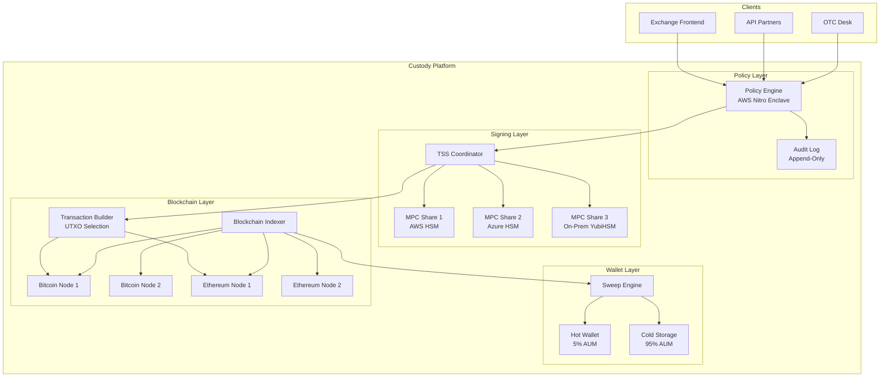

# System Design: Institutional Digital Asset Custody

## Speaker Intro

This handbook is written from the perspective of a **Principal Cryptography Architect** who has designed and operated institutional-grade digital asset custody platforms safeguarding billions of dollars in cryptocurrency. The content draws from first-hand experience building cold-storage vaults, MPC signing clusters, blockchain indexing pipelines, and policy enforcement engines at the intersection of applied cryptography, distributed systems, and financial regulation.

## Who This Is For

- **Security engineers** building custody infrastructure who need to understand how private keys are generated, split, stored, and used without ever existing in a single location.
- **Backend engineers at exchanges or fintech companies** responsible for the hot wallet, sweep system, or withdrawal pipeline and who need to understand the full lifecycle of a custodial transaction.
- **Blockchain engineers** building node infrastructure who need to handle chain re-organizations, confirmation tracking, and multi-chain indexing at institutional scale.
- **Architects evaluating Rust** for security-critical financial infrastructure and who need proof that the language's memory safety guarantees translate into tangible security benefits for key management and cryptographic operations.
- **Anyone who has *used* a custodial exchange** (Coinbase, Kraken, BitGo) and been curious about how they keep billions of dollars safe from hackers, insider threats, and operational failures.

## Prerequisites

| Concept | Where to Learn |
|---|---|
| Intermediate Rust (ownership, traits, `async`) | [Async Rust](../async-book/src/SUMMARY.md) |
| Basic cryptography (public/private keys, digital signatures) | [Enterprise Rust — Cryptography](../enterprise-rust-book/src/SUMMARY.md) |
| Bitcoin/Ethereum fundamentals (UTXO vs. account model) | Bitcoin Developer Documentation |
| Familiarity with `tokio` and async networking | [Tokio Internals](../tokio-internals-book/src/SUMMARY.md) |
| Hardware security concepts (HSMs, enclaves) | AWS Nitro Enclaves documentation |

## How to Use This Book

| Emoji | Meaning |
|---|---|
| 🟢 | **Architecture** — foundational wallet design, sweeping systems, fund flow |
| 🟡 | **Blockchain/Node** — UTXO management, indexing, confirmation tracking |
| 🔴 | **Cryptography/Security** — MPC, threshold signatures, HSMs, policy engines |

Each chapter solves **one critical component** of an institutional custody platform. Read them in order — the wallet architecture (Ch 1) provides the context for signing (Ch 2), which feeds into transaction construction (Ch 3), which requires confirmation tracking (Ch 4), all governed by the policy engine (Ch 5).

## The Problem We Are Solving

> Design an **institutional digital asset custody platform** capable of safeguarding **$10B+ in cryptocurrency** across multiple blockchains, with **no single point of compromise**, **sub-minute withdrawal latency** for approved transactions, and **cryptographically verifiable audit trails** for every key operation.

The system we will build has these non-negotiable requirements:

| Requirement | Target |
|---|---|
| Cold storage ratio | ≥ 95% of AUM in air-gapped cold storage |
| Key compromise resilience | No single device, person, or cloud provider can sign |
| Withdrawal latency (approved) | < 60 seconds from policy approval to broadcast |
| Confirmation accuracy | Zero false-positive "deposit confirmed" events |
| Audit completeness | 100% of signing operations cryptographically logged |
| Regulatory compliance | SOC 2 Type II, ISO 27001, state money transmitter |

## Pacing Guide

| Chapter | Topic | Time | Checkpoint |
|---|---|---|---|
| Ch 0 | Introduction & Problem Statement | 30 min | Understand the threat model and design canvas |
| Ch 1 | Hot vs. Cold Wallet Architecture | 6–8 hours | Working sweep engine with threshold-based rebalancing |
| Ch 2 | MPC and Threshold Signature Schemes | 8–10 hours | 2-of-3 TSS signing across distributed key shares |
| Ch 3 | UTXO Management & Fee Optimization | 5–7 hours | Coin selection algorithm with dust prevention |
| Ch 4 | Blockchain Indexing & Confirmation Tracking | 6–8 hours | Multi-node indexer with reorg handling and webhooks |
| Ch 5 | Policy Engine & HSMs | 7–9 hours | Enclave-based policy engine with m-of-n approval |

**Total: ~33–43 hours** of focused study.

## Table of Contents

### Part I: Wallet Architecture
- **Chapter 1 — The Hot vs. Cold Wallet Architecture 🟢** — Minimizing the attack surface. Architecting an automated sweeping system that keeps 95% of funds in offline, air-gapped Cold Storage, while maintaining a dynamic Hot Wallet buffer for daily withdrawals. Designing the fund flow state machine that governs every satoshi.

### Part II: Cryptographic Signing
- **Chapter 2 — Multi-Party Computation (MPC) and Threshold Signature Schemes 🔴** — Why standard private keys and Multi-Sig are obsolete for institutional custody. Implementing Threshold Signature Schemes (TSS) using MPC. Cryptographically splitting a private key into 3 shares stored on different cloud providers and hardware enclaves so the full key never exists in memory at any point in time.

### Part III: Transaction Engineering
- **Chapter 3 — UTXO Management and Transaction Fee Optimization 🟡** — Building a Bitcoin transaction engine. Managing Unspent Transaction Outputs (UTXOs). Designing a coin-selection algorithm that selects the optimal UTXOs to minimize blockchain network fees and prevent dust accumulation.
- **Chapter 4 — Blockchain Indexing and Confirmation Tracking 🟡** — You cannot trust a single node. Architecting a highly available Rust indexer that connects to multiple Ethereum/Bitcoin nodes, parses raw block data, handles chain re-organizations (orphaned blocks), and triggers the "Deposit Confirmed" webhook only after $N$ confirmations.

### Part IV: Governance & Enforcement
- **Chapter 5 — The Policy Engine and Hardware Security Modules (HSMs) 🔴** — Preventing insider threats. Building an immutable Policy Engine inside an AWS Nitro Enclave. Enforcing rules like "Any transfer over \$1M requires m-of-n human approvals via YubiKey," backed by cryptographically verifiable audit logs.

## Architecture Overview

## Companion Guides

| Book | Relevance |
|---|---|
| [Enterprise Rust](../enterprise-rust-book/src/SUMMARY.md) | Zero-trust cryptography, SBOM, supply chain security |
| [Distributed Systems](../distributed-systems-book/src/SUMMARY.md) | Consensus, replication, consistency models |
| [Blockchain Validator](../blockchain-validator-book/src/SUMMARY.md) | P2P gossip, Merkle tries, BFT consensus |
| [Tokio Internals](../tokio-internals-book/src/SUMMARY.md) | Async runtime for node connections |
| [Hardware Sympathy](../hardware-sympathy-book/src/SUMMARY.md) | Cache-line awareness for cryptographic operations |
