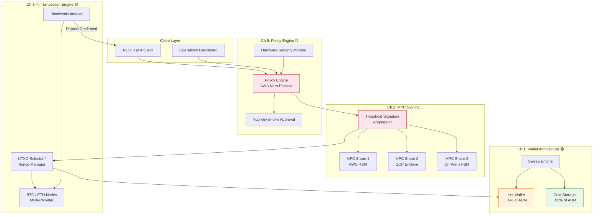

# System Design: Institutional Digital Asset Custody

## Speaker Intro

I am a Principal Cryptography Architect who has spent the last decade building custody infrastructure for digital assets at institutional scale. My work spans threshold cryptography implementations, hardware security module integrations, and the design of air-gapped signing ceremonies that secure billions of dollars in client funds. Before entering the digital asset space, I led secure enclave and key management system development at a major cloud provider. I hold a background in applied cryptography and distributed systems, and I have contributed to open-source MPC libraries and IETF drafts on threshold signature standardization.

---

## Who This Is For

- **Infrastructure engineers** building custody platforms who need to understand the full stack—from UTXO selection to HSM policy enforcement
- **Security architects** designing defense-in-depth strategies for digital asset storage where a single compromised key means irreversible loss
- **Backend engineers** working on blockchain indexers, transaction engines, or wallet services who want to understand the broader custodial context
- **Engineering managers and CTOs** evaluating build-vs-buy decisions for custody infrastructure and need to understand the engineering tradeoffs
- **Compliance and risk engineers** who need to understand the technical mechanisms behind policy enforcement, audit logs, and approval workflows

---

## Prerequisites

| Concept | Where to Learn |
|---|---|
| Rust ownership, lifetimes, and `async`/`await` | [The Rust Programming Language Book](https://doc.rust-lang.org/book/) |
| Basic cryptography (symmetric/asymmetric, hashing, digital signatures) | *Serious Cryptography* by Jean-Philippe Aumasson |
| Bitcoin/Ethereum fundamentals (blocks, transactions, addresses) | *Mastering Bitcoin* by Andreas Antonopoulos |
| TCP/IP networking and HTTP/gRPC | [Async Rust Book](../async-book/src/SUMMARY.md) |
| Basic understanding of cloud infrastructure (AWS, GCP) | Cloud provider documentation |

---

## How to Use This Book

| Emoji | Meaning |
|---|---|
| 🟢 | **Architecture** — System-level design, data flow, and deployment topology |
| 🟡 | **Blockchain / Node** — On-chain mechanics, indexing, transaction construction |
| 🔴 | **Cryptography / Security** — Threshold signing, enclaves, HSMs, policy enforcement |

Each chapter follows a consistent structure:

1. **The Problem** — A concrete scenario that motivates the design
2. **Comparative analysis** — Why simpler approaches fail at institutional scale
3. **Architecture deep dive** — Mermaid diagrams, data-flow walkthrough, component breakdown
4. **Rust implementation** — Production-quality code with line-by-line explanation
5. **Key Takeaways** — The critical lessons to carry forward

---

## Pacing Guide

| Chapters | Topic | Time | Checkpoint |
|---|---|---|---|
| Ch 1 | Hot vs. Cold Wallet Architecture | 4–6 hours | Can diagram the sweep cycle and explain fund segregation |
| Ch 2 | MPC and Threshold Signature Schemes | 6–8 hours | Can explain why the full key never exists in memory |
| Ch 3 | UTXO Management and Fee Optimization | 4–6 hours | Can implement a coin-selection algorithm |
| Ch 4 | Blockchain Indexing and Confirmation Tracking | 5–7 hours | Can handle chain reorganizations in an indexer |
| Ch 5 | Policy Engine and HSMs | 5–7 hours | Can design an enclave-backed approval workflow |
| **Total** | | **24–34 hours** | |

---

## What You Will Build

By the end of this book, you will understand the complete architecture of an institutional-grade digital asset custody platform. This is not a toy wallet—it is the kind of system that custodians like Coinbase Custody, BitGo, Fireblocks, and Anchorage build to secure tens of billions of dollars.

---

## Table of Contents

### Part I: Wallet Architecture
- **[Chapter 1: The Hot vs. Cold Wallet Architecture 🟢](ch01-hot-cold-wallet.md)** — Minimizing the attack surface by keeping 95% of funds in air-gapped cold storage while maintaining a dynamic hot wallet buffer for daily operations. Designing the automated sweep engine.

### Part II: Cryptographic Signing
- **[Chapter 2: Multi-Party Computation (MPC) and Threshold Signature Schemes 🔴](ch02-mpc-tss.md)** — Eliminating single points of failure in key management. Implementing TSS using MPC so the full private key never exists in memory on any single machine, with shares distributed across cloud providers and hardware enclaves.

### Part III: Transaction Engineering
- **[Chapter 3: UTXO Management and Transaction Fee Optimization 🟡](ch03-utxo-management.md)** — Building a Bitcoin transaction engine with intelligent coin selection. Designing algorithms that minimize network fees and prevent dust accumulation.
- **[Chapter 4: Blockchain Indexing and Confirmation Tracking 🟡](ch04-blockchain-indexing.md)** — Architecting a Rust-based indexer that connects to multiple blockchain nodes, handles chain reorganizations, and provides reliable deposit confirmation.

### Part IV: Governance & Enforcement
- **[Chapter 5: The Policy Engine and Hardware Security Modules (HSMs) 🔴](ch05-policy-engine-hsm.md)** — Preventing insider threats with immutable policy enforcement inside secure enclaves. Building m-of-n approval workflows with YubiKeys and cryptographic audit logs.

---

## Companion Guides

| Guide | Description |
|---|---|
| [Blockchain Validator Book](../blockchain-validator-book/src/SUMMARY.md) | Deep dive into P2P networks, consensus, and block production |
| [Distributed Systems Book](../distributed-systems-book/src/SUMMARY.md) | Foundations of distributed coordination and consensus |
| [Async Rust Book](../async-book/src/SUMMARY.md) | Tokio runtime, async networking, and concurrency patterns |
| [Error Handling Book](../error-handling-book/src/SUMMARY.md) | Production error handling strategies for critical systems |
| [Observability Platform Book](../observability-platform-book/src/SUMMARY.md) | Metrics, tracing, and alerting for production infrastructure |
