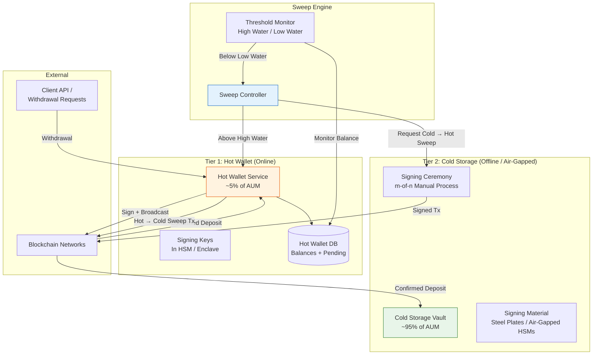
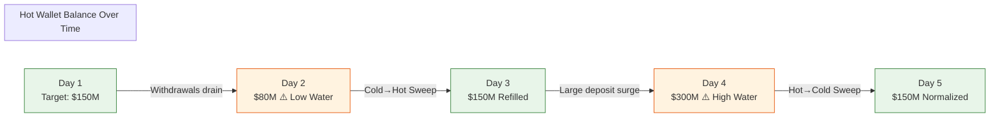
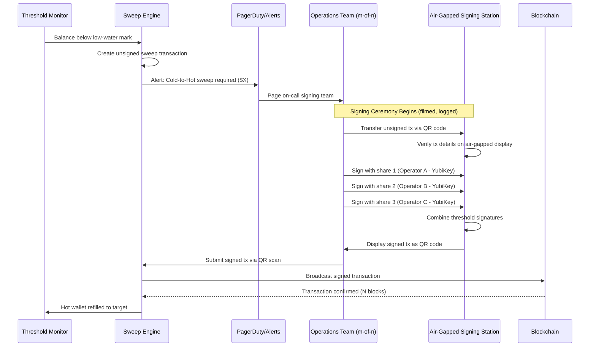
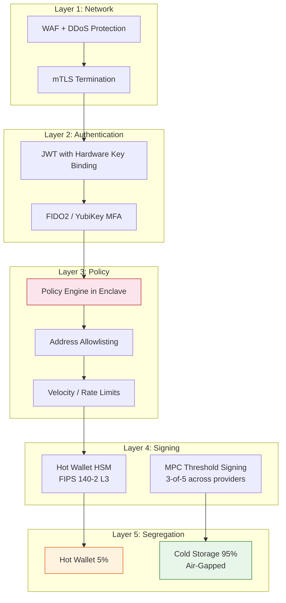
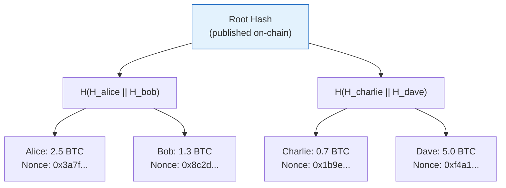

# 1. The Hot vs. Cold Wallet Architecture 🟢

> **The Problem:** An institutional custodian holds $10 billion in digital assets across 50,000 client accounts. Every day, clients request withdrawals totaling $50–200 million. If you keep all funds in a hot wallet (online, signing keys accessible), a single compromised server means total loss—irreversible, uninsurable, career-ending. If you keep everything in cold storage (offline, air-gapped), you cannot process withdrawals within the 4-hour SLA your enterprise clients demand. You need an architecture that keeps **95% of assets under management (AUM) in air-gapped cold storage** while maintaining a dynamic hot wallet buffer sized to handle daily operational volume—with an automated sweep engine that rebalances between the two without human intervention.

---

## 1.1 Why "Just Use a Wallet" Doesn't Work

A retail wallet (MetaMask, Electrum, hardware wallets like Ledger) is designed for a single user managing a single key. Institutional custody is a fundamentally different problem:

| Dimension | Retail Wallet | Institutional Custody |
|---|---|---|
| Assets under management | $100 – $1M | $1B – $100B |
| Number of accounts | 1 | 10,000 – 1,000,000 |
| Withdrawal SLA | "Whenever I feel like it" | < 4 hours, 24/7/365 |
| Regulatory requirements | None | SOC 2 Type II, state trust charters, SEC/FINRA |
| Key compromise impact | One user loses funds | Total platform insolvency |
| Insurance requirements | None | $500M+ crime/specie policies |
| Audit trail | Optional | Every action cryptographically logged |

The core insight: **custody is not a wallet problem. It is a distributed systems problem with cryptographic constraints.**

---

## 1.2 The Two-Tier Architecture

The industry has converged on a simple but powerful pattern: split all funds into two tiers with fundamentally different security properties.



### Tier 1: The Hot Wallet

The hot wallet is an **online system** with signing keys loaded in Hardware Security Modules (HSMs) or secure enclaves. It can sign and broadcast transactions automatically, without human intervention.

**Properties:**
- Holds only enough funds to cover expected withdrawals (typically 3–5% of AUM)
- Signing keys live in FIPS 140-2 Level 3 HSMs (e.g., AWS CloudHSM, Thales Luna)
- Transactions are subject to automated policy checks (rate limits, velocity controls, allowlists)
- Full audit trail of every operation
- Can be fully compromised without existential loss to the platform

### Tier 2: Cold Storage

Cold storage is an **offline system** where signing material is physically isolated from any network-connected device.

**Properties:**
- Holds the vast majority of funds (95%+)
- Signing keys stored on air-gapped hardware (steel plates, Cryptosteel, dedicated HSMs in Faraday cages)
- Transactions require a **signing ceremony**: m-of-n authorized personnel must physically gather, construct the transaction on an air-gapped machine, sign it, and transfer the signed blob via QR code or USB
- Ceremony is recorded on video, with each step logged cryptographically
- A complete compromise of the hot wallet + all online infrastructure still cannot touch cold storage

---

## 1.3 Sizing the Hot Wallet: The Buffer Problem

The hot wallet buffer size is a risk-optimization problem. Too small: withdrawal requests queue up and breach SLAs. Too large: more funds are at risk if the hot wallet is compromised.

### The High-Water / Low-Water Model

We use a model borrowed from operating-system page caches:

| Parameter | Description | Typical Value |
|---|---|---|
| **Low-water mark** | If balance drops below this, trigger a cold-to-hot sweep | 1× average daily withdrawal volume |
| **Target level** | Ideal balance after a sweep | 3× average daily withdrawal volume |
| **High-water mark** | If balance exceeds this, trigger a hot-to-cold sweep | 5× average daily withdrawal volume |



### Implementing the Threshold Monitor

```rust
use rust_decimal::Decimal;
use serde::Deserialize;
use std::time::Duration;

#[derive(Debug, Clone, Deserialize)]
pub struct WalletThresholds {
    /// Below this, we must sweep from cold storage
    pub low_water: Decimal,
    /// Ideal resting balance after a sweep
    pub target: Decimal,
    /// Above this, sweep excess to cold storage
    pub high_water: Decimal,
    /// How often we check (e.g., every 60 seconds)
    pub check_interval: Duration,
}

#[derive(Debug)]
pub enum SweepAction {
    /// Sweep funds from cold storage into the hot wallet
    ColdToHot { amount: Decimal },
    /// Sweep excess funds from hot wallet into cold storage
    HotToCold { amount: Decimal },
    /// Balance is within acceptable range—no action needed
    NoAction,
}

pub fn evaluate_sweep(balance: Decimal, thresholds: &WalletThresholds) -> SweepAction {
    if balance < thresholds.low_water {
        // Sweep enough to reach target, not just above low water.
        // This prevents oscillation (sweeping tiny amounts repeatedly).
        let deficit = thresholds.target - balance;
        SweepAction::ColdToHot { amount: deficit }
    } else if balance > thresholds.high_water {
        let excess = balance - thresholds.target;
        SweepAction::HotToCold { amount: excess }
    } else {
        SweepAction::NoAction
    }
}
```

**Why sweep to target, not to low-water + ε?** If we only topped up to just above the low-water mark, the next withdrawal would immediately retrigger a sweep. Cold-to-hot sweeps require signing ceremonies (hours). Sweeping to the target level provides a buffer of normal operating volume.

---

## 1.4 The Sweep Engine

The sweep engine is the automated system that monitors balances and initiates fund transfers between tiers.

### Cold-to-Hot Sweep (the hard one)

This is operationally complex because it requires human involvement:



### Hot-to-Cold Sweep (the easy one)

Since the hot wallet signing keys are online (in HSMs), this sweep can be fully automated:

```rust
use rust_decimal::Decimal;

pub struct SweepEngine {
    hot_wallet: HotWalletClient,
    cold_addresses: ColdAddressBook,
    policy_engine: PolicyClient,
    blockchain: BlockchainClient,
}

impl SweepEngine {
    /// Automatically sweep excess funds to cold storage.
    /// This does NOT require a signing ceremony—hot wallet keys are online.
    pub async fn execute_hot_to_cold_sweep(
        &self,
        amount: Decimal,
        asset: &str,
    ) -> Result<SweepReceipt, SweepError> {
        // 1. Get the next unused cold storage deposit address
        //    (HD derivation, never reuse addresses)
        let cold_addr = self.cold_addresses.next_deposit_address(asset).await?;

        // 2. Submit to the policy engine for approval
        //    (even automated sweeps must pass policy checks)
        let approval = self.policy_engine.request_approval(
            PolicyRequest::Sweep {
                from: WalletTier::Hot,
                to: WalletTier::Cold,
                amount,
                asset: asset.to_string(),
                destination: cold_addr.clone(),
            }
        ).await?;

        if !approval.approved {
            return Err(SweepError::PolicyDenied(approval.reason));
        }

        // 3. Construct and sign the transaction (HSM handles signing)
        let signed_tx = self.hot_wallet
            .create_and_sign(cold_addr, amount, asset)
            .await?;

        // 4. Broadcast and wait for confirmation
        let tx_hash = self.blockchain.broadcast(signed_tx).await?;
        let receipt = self.blockchain
            .wait_for_confirmations(tx_hash, required_confirmations(asset))
            .await?;

        Ok(SweepReceipt {
            tx_hash: receipt.tx_hash,
            amount,
            asset: asset.to_string(),
            destination: cold_addr,
            confirmations: receipt.confirmations,
            timestamp: chrono::Utc::now(),
        })
    }
}

/// Different assets require different confirmation depths
/// based on their finality guarantees and block times.
fn required_confirmations(asset: &str) -> u64 {
    match asset {
        "BTC" => 6,       // ~60 minutes — reorg protection
        "ETH" => 35,      // ~7 minutes — post-merge finality
        "LTC" => 12,      // ~30 minutes
        _ => 20,           // Conservative default
    }
}

// Placeholder types for illustration
# struct HotWalletClient;
# struct ColdAddressBook;
# struct PolicyClient;
# struct BlockchainClient;
# struct SweepReceipt { tx_hash: String, amount: Decimal, asset: String, destination: String, confirmations: u64, timestamp: chrono::DateTime<chrono::Utc> }
# struct PolicyRequest;
# enum WalletTier { Hot, Cold }
# #[derive(Debug)] enum SweepError { PolicyDenied(String) }
```

---

## 1.5 Address Management and Fund Segregation

A critical architectural decision: **do you commingle client funds in omnibus wallets, or segregate them into per-client addresses?**

| Approach | Omnibus Wallet | Segregated Addresses |
|---|---|---|
| Number of addresses | 1 per asset | 1+ per client per asset |
| Balance tracking | Off-chain ledger | On-chain verifiable |
| UTXO count (Bitcoin) | Low (efficient) | Very high (fee overhead) |
| Proof of reserves | Requires Merkle proof of liabilities | Clients verify on-chain |
| Regulatory preference | Varies by jurisdiction | Generally preferred (MiCA, NY trust charter) |
| Privacy | Harder for clients to audit | Clients see their own deposits |

Most institutional custodians use a **hybrid model**:

- **Deposit addresses**: Segregated (one unique address per client per deposit). This allows clients to verify their deposits on-chain.
- **Operational wallets**: Omnibus. After confirming deposits, funds are consolidated into pooled hot/cold wallets for operational efficiency.
- **Accounting**: An internal double-entry ledger tracks per-client balances regardless of on-chain consolidation.

### HD Derivation for Address Generation

We use BIP-32/BIP-44 Hierarchical Deterministic (HD) derivation to generate fresh deposit addresses from a single seed:

```rust
/// BIP-44 derivation path: m/44'/coin_type'/account'/change/address_index
/// For Bitcoin:  m/44'/0'/client_id'/0/deposit_index
/// For Ethereum: m/44'/60'/client_id'/0/deposit_index
pub struct AddressDerivation {
    /// The HD extended public key (xpub). The private counterpart
    /// is ONLY in cold storage / HSM.
    xpub: ExtendedPubKey,
    /// Coin type per BIP-44 (0 = BTC, 60 = ETH)
    coin_type: u32,
}

impl AddressDerivation {
    /// Derive a fresh deposit address for a client.
    /// This only requires the xpub—no private key material is needed.
    pub fn derive_deposit_address(
        &self,
        client_id: u32,
        deposit_index: u32,
    ) -> Result<String, DerivationError> {
        // BIP-44 path: m/44'/coin_type'/client_id'/0/deposit_index
        let path = DerivationPath::from_str(
            &format!("m/44'/{}'/{}'/0/{}", self.coin_type, client_id, deposit_index)
        )?;
        let child_key = self.xpub.derive_pub(&Secp256k1::new(), &path)?;
        Ok(encode_address(child_key, self.coin_type))
    }
}

# struct ExtendedPubKey;
# struct DerivationPath;
# struct DerivationError;
# struct Secp256k1;
# fn encode_address(_: ExtendedPubKey, _: u32) -> String { String::new() }
```

**Security property**: The hot wallet server derives deposit addresses using only the **extended public key** (xpub). The corresponding private key material exists exclusively in cold storage. Even if the hot wallet server is fully compromised, the attacker cannot derive private keys—they can only generate addresses.

---

## 1.6 Attack Surface Analysis

Let's map the components and their exposure:

| Component | Attack Vector | Impact | Mitigation |
|---|---|---|---|
| Hot wallet signing keys | HSM firmware exploit, cloud provider insider | Loss of hot wallet balance (~5% AUM) | FIPS 140-2 L3 HSM, multi-vendor, insurance |
| Cold storage signing material | Physical theft, social engineering | Loss of cold balance (~95% AUM) | Geographic distribution, m-of-n ceremonies, steel plates in bank vaults |
| Sweep engine | Compromised sweep logic drains hot wallet to attacker address | Hot wallet balance | Policy engine verifies all destinations against allowlist |
| Deposit address derivation | Supply xpub → attacker derives same addresses → intercept deposits | Deposit theft | xpub integrity verified via HSM-signed attestation |
| Internal ledger | Database tampering to inflate balances | Unauthorized withdrawals | Append-only ledger with Merkle root published on-chain (proof of reserves) |
| API layer | Authentication bypass, injection | Unauthorized withdrawal requests | mTLS, JWT with hardware-bound keys, rate limiting |

### Defense in Depth

The architecture is designed so that **no single compromise results in total loss**:



An attacker must breach **all five layers** to touch cold storage funds. Breaching layers 1–3 lets them submit withdrawal requests, but those requests are capped at hot wallet balance. Breaching layer 4 (HSM) gives access to hot wallet funds only. Cold storage requires physical access to distributed signing material—an entirely different attack class.

---

## 1.7 Proof of Reserves: Trustless Verification

Clients should not need to trust the custodian's word that their funds exist. We implement cryptographic proof of reserves:

### The Merkle Liability Tree



1. Each client receives a unique nonce (so they can find their leaf without revealing other clients' data).
2. The custodian publishes the Merkle root on-chain (e.g., in an OP_RETURN output on Bitcoin).
3. Any client can request their **inclusion proof** (the sibling hashes along the path to the root) and verify their balance is included.
4. The total liabilities (sum of all leaves) is compared against on-chain addresses controlled by the custodian.

```rust
use sha2::{Sha256, Digest};

#[derive(Debug, Clone)]
pub struct LiabilityLeaf {
    pub client_id: String,
    pub nonce: [u8; 32],
    pub balance_satoshis: u64,
}

impl LiabilityLeaf {
    /// Hash a single liability entry.
    /// The nonce ensures clients can identify their leaf
    /// without the custodian revealing all client balances.
    pub fn hash(&self) -> [u8; 32] {
        let mut hasher = Sha256::new();
        hasher.update(&self.nonce);
        hasher.update(self.client_id.as_bytes());
        hasher.update(&self.balance_satoshis.to_le_bytes());
        hasher.finalize().into()
    }
}

/// Build the Merkle tree from liability leaves.
/// Returns the root hash and the full tree (for proof generation).
pub fn build_merkle_tree(leaves: &[LiabilityLeaf]) -> Vec<Vec<[u8; 32]>> {
    let mut levels: Vec<Vec<[u8; 32]>> = Vec::new();

    // Level 0: hash all leaves
    let leaf_hashes: Vec<[u8; 32]> = leaves.iter().map(|l| l.hash()).collect();
    levels.push(leaf_hashes);

    // Build up the tree until we reach the root
    while levels.last().unwrap().len() > 1 {
        let prev = levels.last().unwrap();
        let mut next = Vec::new();
        for pair in prev.chunks(2) {
            let mut hasher = Sha256::new();
            hasher.update(pair[0]);
            if pair.len() > 1 {
                hasher.update(pair[1]);
            } else {
                // Odd number of nodes: hash with itself
                hasher.update(pair[0]);
            }
            next.push(hasher.finalize().into());
        }
        levels.push(next);
    }

    levels
}
```

---

## 1.8 Operational Considerations

### Key Rotation

Cold storage keys should be rotated on a regular schedule (e.g., annually) or immediately after any security incident. Key rotation for cold storage is a major operational event:

1. Generate new key material in a signing ceremony
2. Create sweep transactions moving all funds from old cold addresses to new cold addresses
3. Verify the sweep completes and old addresses are empty
4. Securely destroy old key material

### Disaster Recovery

What happens if a data center burns down?

| Scenario | Recovery Path |
|---|---|
| Hot wallet server destroyed | Redeploy from infrastructure-as-code. HSM keys survive (replicated across AZs). |
| HSM failure | Restore from HSM backup (encrypted, stored in separate physical location). |
| Cold storage site compromised | Activate backup shares from geographically distributed vaults (m-of-n ensures no single site is critical). |
| All online infrastructure compromised | Cold storage is unaffected. Rebuild online infrastructure, sweep cold-to-hot. |

### Insurance Mapping

| Tier | Coverage | Typical Limit |
|---|---|---|
| Hot wallet | Commercial crime / cyber insurance ("hot wallet rider") | $100M – $500M |
| Cold storage | Specie insurance (physical theft of signing material) | $1B+ |
| Operational errors | Errors & omissions (E&O) | $50M – $200M |

> **Key Takeaways**
>
> 1. **Institutional custody is a two-tier architecture**: a thin hot wallet for liquidity and deep cold storage for safety. The hot wallet is designed to be *expendable*—its loss is survivable.
> 2. **The sweep engine is the bridge**: High-water/low-water thresholds automate rebalancing. Cold-to-hot sweeps require human signing ceremonies; hot-to-cold sweeps are fully automated.
> 3. **Address derivation is separated from signing**: The hot wallet only holds the xpub for address generation. Private key material for cold storage never touches an online machine.
> 4. **Proof of reserves makes custody auditable**: Merkle liability trees let clients cryptographically verify their balance is included without revealing other clients' data.
> 5. **Defense in depth means no single compromise is fatal**: Five layers (network, auth, policy, signing, segregation) ensure an attacker must breach the entire stack to access cold funds.
