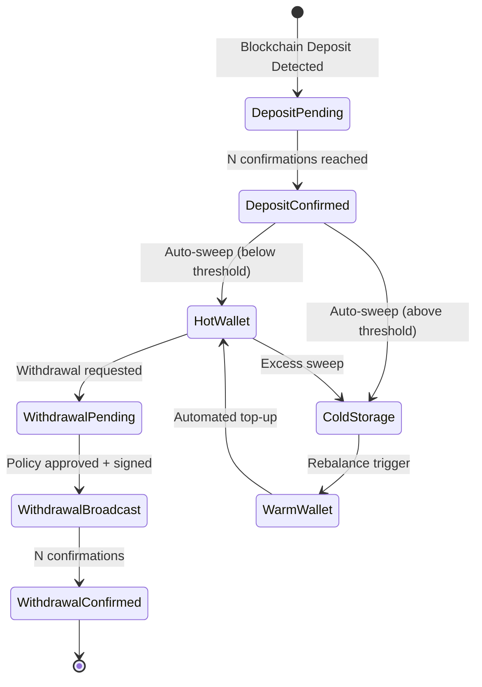
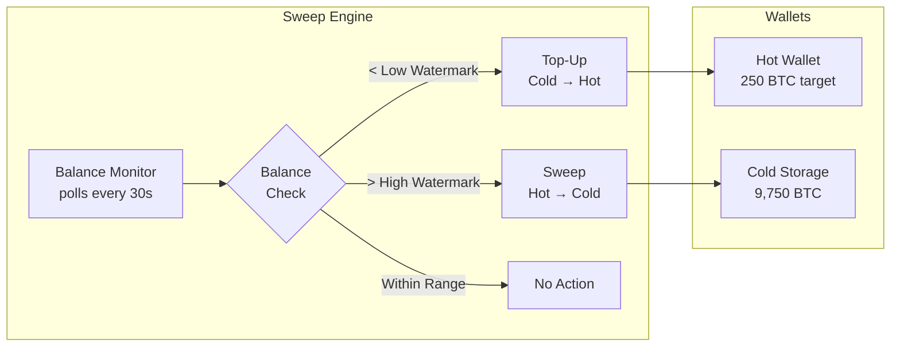
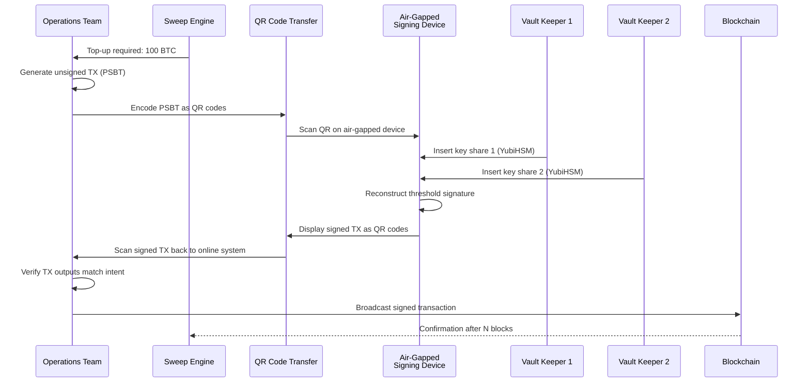

# 1. The Hot vs. Cold Wallet Architecture 🟢

> **The Problem:** A cryptocurrency exchange holding \$10 billion in customer deposits faces an existential threat: if its private keys are compromised, every dollar is gone in minutes with no chargebacks, no reversals, and no FDIC insurance. Yet the exchange must process thousands of withdrawals per hour without customers waiting days for manual cold-storage ceremonies. The architecture must keep 95% of funds in offline, air-gapped cold storage while maintaining a dynamically-sized hot wallet buffer that can serve daily withdrawal volume — and the transition between these two states must be automated, auditable, and resistant to insider threats.

---

## The Spectrum of Wallet Security

Not all wallets are created equal. Institutional custody uses a **tiered architecture** where each tier trades accessibility for security:

| Property | Hot Wallet | Warm Wallet | Cold Storage |
|---|---|---|---|
| Network connectivity | Always online | Air-gapped; connects for signing only | Permanently air-gapped |
| Key storage | Encrypted in HSM, in-datacenter | Encrypted in HSM, separate facility | Paper/steel seed + hardware signing device |
| Signing latency | < 1 second | 5–30 minutes (human ceremony) | 1–24 hours (multi-person ceremony) |
| Typical fund allocation | 2–5% of AUM | 5–10% of AUM | 85–95% of AUM |
| Compromise blast radius | Lose 2–5% of AUM | Lose 5–10% of AUM | Requires physical break-in |
| Automation level | Fully automated | Semi-automated | Manual, multi-person |
| Use case | Customer withdrawals | Large withdrawals, rebalancing | Long-term storage |

The goal: **minimize the amount of money at risk at any point in time** while maintaining enough liquidity for normal operations.

---

## The Fund Flow State Machine

Every satoshi in the custody platform exists in exactly one state. The transitions between states are the most security-critical operations in the entire system.



### State Definitions

```rust,ignore
use chrono::{DateTime, Utc};

/// Every fund movement in the custody platform is tracked as a `FundState`.
/// The state machine is append-only: transitions create new records, never mutate existing ones.
#[derive(Debug, Clone, PartialEq, Eq)]
enum FundState {
    /// Deposit detected on-chain but not yet confirmed.
    DepositPending {
        txid: [u8; 32],
        amount_satoshis: u64,
        confirmations: u32,
        detected_at: DateTime<Utc>,
    },
    /// Deposit has reached the required confirmation threshold.
    DepositConfirmed {
        txid: [u8; 32],
        amount_satoshis: u64,
        confirmed_at: DateTime<Utc>,
    },
    /// Funds reside in the hot wallet, available for immediate withdrawal.
    InHotWallet {
        wallet_id: WalletId,
        amount_satoshis: u64,
    },
    /// Funds reside in cold storage, requiring a signing ceremony to move.
    InColdStorage {
        vault_id: VaultId,
        amount_satoshis: u64,
    },
    /// A withdrawal has been requested and is awaiting policy approval.
    WithdrawalPending {
        request_id: RequestId,
        destination: Address,
        amount_satoshis: u64,
        requested_at: DateTime<Utc>,
    },
    /// The withdrawal transaction has been signed and broadcast.
    WithdrawalBroadcast {
        txid: [u8; 32],
        amount_satoshis: u64,
        broadcast_at: DateTime<Utc>,
    },
}

/// Newtype wrappers for type safety — prevent mixing up IDs.
#[derive(Debug, Clone, PartialEq, Eq, Hash)]
struct WalletId(String);

#[derive(Debug, Clone, PartialEq, Eq, Hash)]
struct VaultId(String);

#[derive(Debug, Clone, PartialEq, Eq, Hash)]
struct RequestId(uuid::Uuid);

#[derive(Debug, Clone, PartialEq, Eq)]
struct Address(String);
```

---

## The Sweep Engine

The sweep engine is the heartbeat of the custody platform. It runs continuously, monitoring hot wallet balances and triggering automated fund movements.

### Threshold-Based Rebalancing

The engine maintains three thresholds:

| Threshold | Value (example) | Action |
|---|---|---|
| **Low watermark** | 100 BTC | Trigger warm → hot top-up |
| **Target balance** | 250 BTC | Ideal hot wallet balance |
| **High watermark** | 400 BTC | Trigger hot → cold sweep |



### Sweep Engine Implementation

```rust,ignore
use std::time::Duration;
use tokio::time::interval;

/// Configuration for the sweep engine's threshold-based rebalancing.
struct SweepConfig {
    /// Below this, trigger a top-up from cold/warm storage.
    low_watermark_satoshis: u64,
    /// The ideal hot wallet balance after a rebalance.
    target_balance_satoshis: u64,
    /// Above this, sweep excess to cold storage.
    high_watermark_satoshis: u64,
    /// How often the sweep engine checks balances.
    poll_interval: Duration,
    /// Maximum single sweep amount (limits blast radius).
    max_sweep_amount_satoshis: u64,
}

impl Default for SweepConfig {
    fn default() -> Self {
        Self {
            low_watermark_satoshis:  10_000_000_000,  // 100 BTC
            target_balance_satoshis: 25_000_000_000,  // 250 BTC
            high_watermark_satoshis: 40_000_000_000,  // 400 BTC
            poll_interval: Duration::from_secs(30),
            max_sweep_amount_satoshis: 10_000_000_000, // 100 BTC per sweep
        }
    }
}

enum SweepDecision {
    /// No action needed — balance is within acceptable range.
    Hold,
    /// Move funds from cold/warm storage to hot wallet.
    TopUp { amount_satoshis: u64 },
    /// Move excess funds from hot wallet to cold storage.
    Sweep { amount_satoshis: u64 },
}

fn evaluate_sweep(config: &SweepConfig, hot_balance: u64) -> SweepDecision {
    if hot_balance < config.low_watermark_satoshis {
        // Top up to target, but never exceed max sweep amount.
        let deficit = config.target_balance_satoshis.saturating_sub(hot_balance);
        let amount = deficit.min(config.max_sweep_amount_satoshis);
        SweepDecision::TopUp { amount_satoshis: amount }
    } else if hot_balance > config.high_watermark_satoshis {
        // Sweep excess down to target, capped at max.
        let excess = hot_balance.saturating_sub(config.target_balance_satoshis);
        let amount = excess.min(config.max_sweep_amount_satoshis);
        SweepDecision::Sweep { amount_satoshis: amount }
    } else {
        SweepDecision::Hold
    }
}
```

### The Sweep Loop

```rust,ignore
/// The main sweep loop. Runs as a long-lived tokio task.
async fn run_sweep_engine(
    config: SweepConfig,
    hot_wallet: HotWalletClient,
    cold_vault: ColdVaultClient,
    policy_engine: PolicyEngineClient,
    audit_log: AuditLogClient,
) {
    let mut ticker = interval(config.poll_interval);

    loop {
        ticker.tick().await;

        // 1. Read current hot wallet balance from the blockchain indexer.
        let hot_balance = match hot_wallet.confirmed_balance().await {
            Ok(b) => b,
            Err(e) => {
                tracing::error!(error = %e, "Failed to read hot wallet balance");
                continue; // Retry on next tick; never sweep blind.
            }
        };

        // 2. Evaluate what to do.
        let decision = evaluate_sweep(&config, hot_balance);

        match decision {
            SweepDecision::Hold => {
                tracing::debug!(hot_balance, "Balance within range, no action");
            }
            SweepDecision::TopUp { amount_satoshis } => {
                tracing::info!(amount_satoshis, hot_balance, "Initiating top-up");

                // 3a. Request policy approval for the top-up.
                //     Even automated sweeps go through the policy engine.
                let approval = policy_engine
                    .request_approval(SweepRequest::TopUp { amount_satoshis })
                    .await;

                if let Ok(approved) = approval {
                    if approved.granted {
                        cold_vault.initiate_transfer(amount_satoshis, &hot_wallet.address()).await.ok();
                        audit_log.record(AuditEvent::TopUpInitiated {
                            amount_satoshis,
                            approval_id: approved.id,
                        }).await.ok();
                    }
                }
            }
            SweepDecision::Sweep { amount_satoshis } => {
                tracing::info!(amount_satoshis, hot_balance, "Initiating sweep to cold");

                let approval = policy_engine
                    .request_approval(SweepRequest::Sweep { amount_satoshis })
                    .await;

                if let Ok(approved) = approval {
                    if approved.granted {
                        hot_wallet.send_to(amount_satoshis, &cold_vault.deposit_address()).await.ok();
                        audit_log.record(AuditEvent::SweepInitiated {
                            amount_satoshis,
                            approval_id: approved.id,
                        }).await.ok();
                    }
                }
            }
        }
    }
}
```

---

## Address Generation and Derivation

A custody platform never reuses addresses. Every deposit gets a unique address derived from a master public key using **BIP-32 hierarchical deterministic derivation**.

### Why HD Derivation Matters

| Approach | Security | Privacy | Backup Complexity |
|---|---|---|---|
| Random key per address | High | High | Must back up every key individually |
| Single address reuse | N/A (never do this) | None | Single key, but violates fungibility |
| **HD derivation (BIP-32/44)** | **High** | **High** | **Single seed backs up infinite addresses** |

### Derivation Path Structure

```
m / purpose' / coin_type' / account' / change / address_index
m / 84'      / 0'         / 0'       / 0      / 0        ← First receive address
m / 84'      / 0'         / 0'       / 0      / 1        ← Second receive address
m / 84'      / 0'         / 0'       / 1      / 0        ← First change address
```

```rust,ignore
/// BIP-32 derivation path component.
/// Hardened derivation (indicated by ') prevents child key leakage.
#[derive(Debug, Clone, Copy)]
struct DerivationIndex {
    index: u32,
    hardened: bool,
}

impl DerivationIndex {
    fn normal(index: u32) -> Self {
        Self { index, hardened: false }
    }

    fn hardened(index: u32) -> Self {
        Self { index, hardened: true }
    }

    /// BIP-32 encoding: hardened indices have bit 31 set.
    fn to_u32(self) -> u32 {
        if self.hardened {
            self.index | 0x8000_0000
        } else {
            self.index
        }
    }
}

/// A full BIP-44 derivation path for address generation.
struct Bip44Path {
    purpose: DerivationIndex,    // 84' for native SegWit
    coin_type: DerivationIndex,  // 0' for Bitcoin, 60' for Ethereum
    account: DerivationIndex,    // Account index (hardened)
    change: DerivationIndex,     // 0 = receive, 1 = change
    address_index: DerivationIndex, // Sequential counter
}

impl Bip44Path {
    /// Generate the next receive address path for a Bitcoin account.
    fn next_btc_receive(account: u32, index: u32) -> Self {
        Self {
            purpose: DerivationIndex::hardened(84),
            coin_type: DerivationIndex::hardened(0),
            account: DerivationIndex::hardened(account),
            change: DerivationIndex::normal(0),
            address_index: DerivationIndex::normal(index),
        }
    }
}
```

---

## Air-Gapped Cold Storage Ceremony

The cold storage signing ceremony is the most security-critical human procedure in the entire custody operation. It involves multiple people, multiple locations, and zero network connectivity.

### The Ceremony Protocol



### Partially Signed Bitcoin Transaction (PSBT) Builder

```rust,ignore
/// A simplified Partially Signed Bitcoin Transaction.
/// In production, use the `bitcoin` crate's full PSBT implementation.
struct PartiallySignedTx {
    /// The unsigned transaction.
    unsigned_tx: UnsignedTransaction,
    /// Per-input signing metadata.
    inputs: Vec<PsbtInput>,
    /// Per-output metadata (e.g., change address derivation path).
    outputs: Vec<PsbtOutput>,
}

struct PsbtInput {
    /// The UTXO being spent.
    previous_output: OutPoint,
    /// The witness UTXO (for SegWit verification).
    witness_utxo: Option<TxOut>,
    /// BIP-32 derivation paths for each required signer.
    bip32_derivations: Vec<(PublicKey, Bip44Path)>,
    /// Partial signatures collected so far.
    partial_sigs: Vec<(PublicKey, Signature)>,
}

struct PsbtOutput {
    /// If this is a change output, the derivation path.
    bip32_derivation: Option<(PublicKey, Bip44Path)>,
}

impl PartiallySignedTx {
    /// Create a new PSBT from an unsigned transaction and input metadata.
    fn new(unsigned_tx: UnsignedTransaction, inputs: Vec<PsbtInput>) -> Self {
        let outputs = unsigned_tx
            .outputs
            .iter()
            .map(|_| PsbtOutput { bip32_derivation: None })
            .collect();

        Self { unsigned_tx, inputs, outputs }
    }

    /// Check if all inputs have sufficient signatures.
    fn is_fully_signed(&self, threshold: usize) -> bool {
        self.inputs.iter().all(|input| input.partial_sigs.len() >= threshold)
    }

    /// Finalize the PSBT into a fully signed transaction ready for broadcast.
    fn finalize(self) -> Result<SignedTransaction, PsbtError> {
        if !self.is_fully_signed(2) {
            return Err(PsbtError::InsufficientSignatures);
        }
        // Combine partial signatures into witness data.
        // In production, this assembles the SegWit witness stack.
        Ok(SignedTransaction {
            txid: compute_txid(&self.unsigned_tx),
            raw_bytes: serialize_with_witness(&self.unsigned_tx, &self.inputs),
        })
    }
}
```

---

## Disaster Recovery and Key Ceremony

### Shamir's Secret Sharing for Seed Backup

The master seed (from which all keys are derived) is split using **Shamir's Secret Sharing** into $n$ shares, of which any $k$ can reconstruct the seed:

| Parameter | Production Value | Rationale |
|---|---|---|
| Total shares ($n$) | 5 | Distributed across 5 geographic locations |
| Threshold ($k$) | 3 | Survives loss of any 2 shares |
| Share storage | Steel plates in bank vaults | Fire-resistant, EMP-resistant |
| Share holders | C-suite + Head of Security | Minimizes collusion risk |

```rust,ignore
use rand::RngCore;

/// Evaluate a polynomial at a given point in GF(256).
/// Used internally by Shamir's Secret Sharing.
fn gf256_eval(coeffs: &[u8], x: u8) -> u8 {
    // Horner's method in GF(256).
    let mut result = 0u8;
    for &coeff in coeffs.iter().rev() {
        result = gf256_mul(result, x) ^ coeff;
    }
    result
}

/// Multiply two elements in GF(256) using the AES irreducible polynomial.
fn gf256_mul(mut a: u8, mut b: u8) -> u8 {
    let mut result = 0u8;
    while b > 0 {
        if b & 1 != 0 {
            result ^= a;
        }
        let carry = a & 0x80;
        a <<= 1;
        if carry != 0 {
            a ^= 0x1b; // AES irreducible polynomial: x^8 + x^4 + x^3 + x + 1
        }
        b >>= 1;
    }
    result
}

/// Split a secret byte into `n` shares with threshold `k`.
/// Returns pairs of (x, y) where x is the share index (1..=n).
fn shamir_split_byte(secret: u8, k: usize, n: usize, rng: &mut impl RngCore) -> Vec<(u8, u8)> {
    assert!(k <= n, "threshold must be <= total shares");
    assert!(k >= 2, "threshold must be >= 2");
    assert!(n <= 255, "max 255 shares in GF(256)");

    // Build a random polynomial of degree k-1 with secret as the constant term.
    let mut coeffs = vec![0u8; k];
    coeffs[0] = secret;
    rng.fill_bytes(&mut coeffs[1..]);

    // Evaluate the polynomial at x = 1, 2, ..., n.
    (1..=n as u8)
        .map(|x| (x, gf256_eval(&coeffs, x)))
        .collect()
}
```

---

## Hot Wallet Rate Limiting

Even if the hot wallet is compromised, rate limiting bounds the damage:

```rust,ignore
use std::collections::VecDeque;
use std::time::{Duration, Instant};

/// A sliding-window rate limiter for withdrawal amounts.
/// Limits both the number of withdrawals and the total value
/// within a configurable time window.
struct WithdrawalRateLimiter {
    /// Maximum total value (in satoshis) per window.
    max_value_per_window: u64,
    /// Maximum number of transactions per window.
    max_count_per_window: u32,
    /// The sliding window duration.
    window: Duration,
    /// Recent withdrawal records: (timestamp, amount).
    history: VecDeque<(Instant, u64)>,
}

impl WithdrawalRateLimiter {
    fn new(max_value: u64, max_count: u32, window: Duration) -> Self {
        Self {
            max_value_per_window: max_value,
            max_count_per_window: max_count,
            window,
            history: VecDeque::new(),
        }
    }

    /// Attempt to record a withdrawal. Returns `false` if the rate limit is exceeded.
    fn try_record(&mut self, amount_satoshis: u64) -> bool {
        let now = Instant::now();
        let cutoff = now - self.window;

        // Evict expired entries.
        while self.history.front().is_some_and(|(t, _)| *t < cutoff) {
            self.history.pop_front();
        }

        // Check count limit.
        if self.history.len() as u32 >= self.max_count_per_window {
            return false;
        }

        // Check value limit.
        let current_total: u64 = self.history.iter().map(|(_, v)| v).sum();
        if current_total.saturating_add(amount_satoshis) > self.max_value_per_window {
            return false;
        }

        self.history.push_back((now, amount_satoshis));
        true
    }
}
```

---

## Monitoring and Alerting

The custody platform's monitoring system must detect anomalies before they become breaches:

| Alert | Condition | Action |
|---|---|---|
| **Hot wallet drain** | Balance drops > 30% in 10 minutes | Freeze all withdrawals, page on-call |
| **Unusual withdrawal pattern** | > 3σ from 30-day rolling average | Flag for manual review |
| **Sweep failure** | Sweep transaction not confirmed within 1 hour | Retry with higher fee, alert ops |
| **Node divergence** | Two full nodes disagree on chain tip by > 2 blocks | Halt deposit confirmations |
| **Cold storage access** | Any cold storage signing ceremony initiated | Notify all key holders |

---

> **Key Takeaways**
>
> 1. **Tiered architecture is non-negotiable.** The hot wallet should hold the absolute minimum needed for daily operations. Every satoshi above the high watermark gets swept to cold storage automatically.
> 2. **The sweep engine is a state machine, not a cron job.** It must be fully auditable, policy-governed, and resistant to partial failures. A failed sweep should never leave funds in an ambiguous state.
> 3. **Address reuse is a custody anti-pattern.** HD derivation (BIP-32/44) gives you infinite unique addresses from a single seed, with manageable backup complexity.
> 4. **Rate limiting is your last line of defense.** Even if an attacker compromises the hot wallet signing key, sliding-window rate limits cap the damage to a bounded amount per time period.
> 5. **Cold storage ceremonies are theater by design.** The multi-person, multi-location, air-gapped process is intentionally slow and visible — that's the point.
