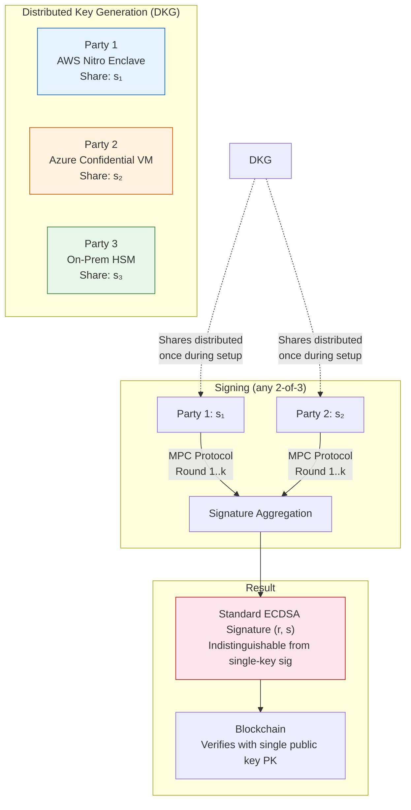
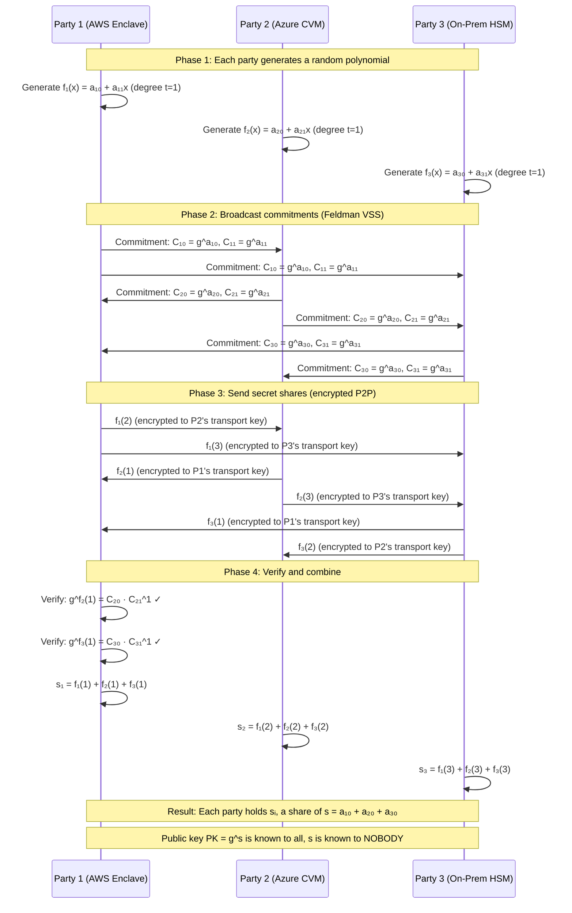
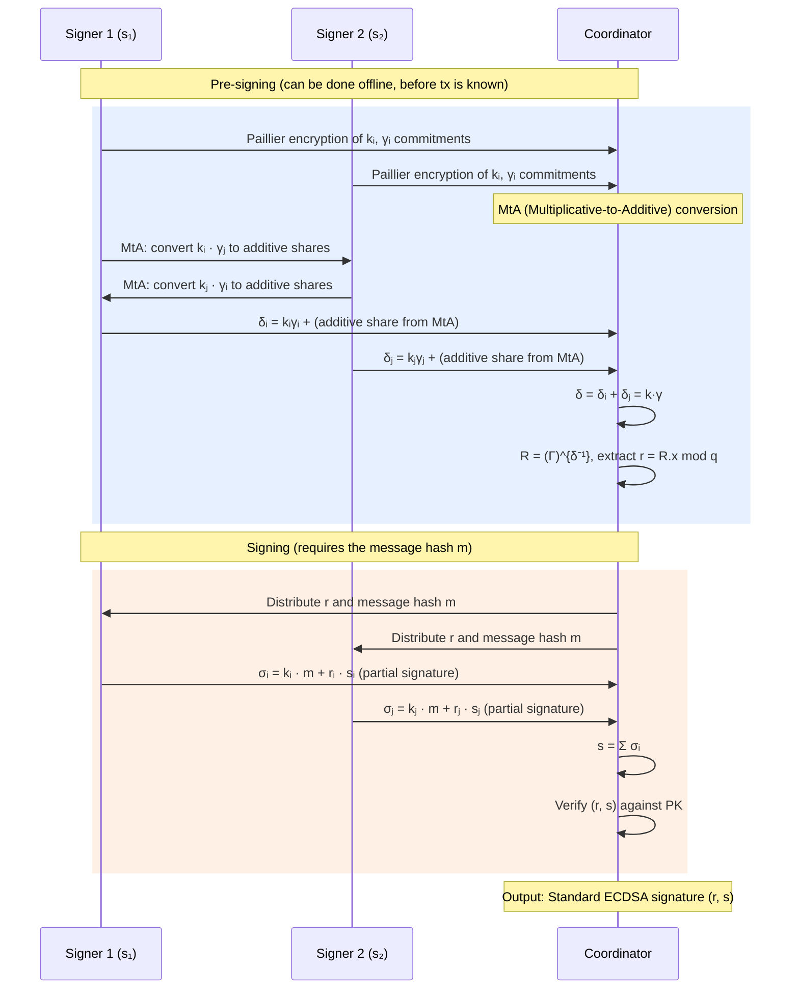
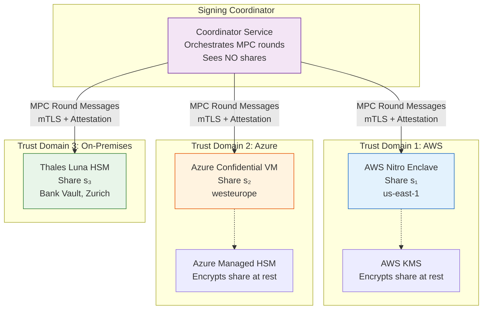
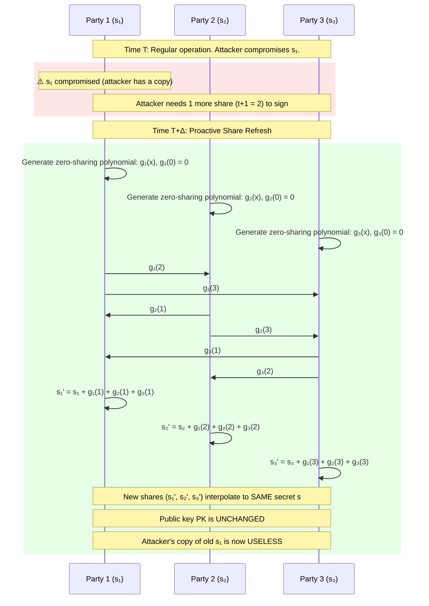

# 2. Multi-Party Computation (MPC) and Threshold Signature Schemes 🔴

> **The Problem:** Your institutional custodian uses a single ECDSA private key stored in one HSM to sign hot wallet transactions. A rogue HSM firmware update, a compromised cloud administrator, or a determined nation-state actor—any single point of failure—can extract that key and drain every satoshi. Traditional multi-signature (multi-sig) schemes mitigate this by requiring *m-of-n* on-chain signatures, but they expose your quorum structure on the blockchain (anyone can see it's a 3-of-5), cost 3–5× more in transaction fees, and are chain-specific (Bitcoin Script multi-sig doesn't work on Ethereum). You need a signing architecture where **the full private key never exists in memory at any point in time**—not during generation, not during signing, not during key refresh—and that produces standard single-signature transactions indistinguishable from any other on-chain.

---

## 2.1 Why Multi-Sig Is Not Enough

Multi-sig was the first generation of institutional key management. It works, but it has fundamental limitations:

| Dimension | Multi-Sig (e.g., Bitcoin P2SH) | MPC / TSS |
|---|---|---|
| Key existence | Full keys exist on each signer's device | **No full key ever exists anywhere** |
| On-chain footprint | Reveals quorum structure (3-of-5 visible) | Standard single-sig transaction |
| Transaction fees | 3–5× single-sig (more data per tx) | 1× single-sig (identical output) |
| Chain compatibility | Chain-specific (Bitcoin Script, Ethereum has no native multi-sig) | **Chain-agnostic** (works for any ECDSA/EdDSA chain) |
| Key rotation | Requires on-chain migration to new addresses | Off-chain share refresh, same public key |
| Insider collusion detection | Difficult (valid signatures look identical) | Proactive share verification detects compromise |
| Operational complexity | Each signer signs independently | Coordinated MPC protocol rounds |

The fatal flaw of multi-sig: **the key exists**. Each signer holds a complete private key. If any signer's device is compromised, that key is exposed. You now depend on the attacker not reaching *m* signers—a quantitative defense, not a qualitative one.

With MPC-TSS, the private key is **never constructed**. Key shares are generated via a Distributed Key Generation (DKG) protocol. Signing happens via a multi-round interactive protocol. The key material that exists on any single device is **cryptographically useless** on its own.

---

## 2.2 Threshold Signature Schemes (TSS): The Cryptographic Foundation

### What Is a Threshold Signature?

A $(t, n)$-threshold signature scheme splits signing authority among $n$ parties such that any $t + 1$ parties can collaboratively produce a valid signature, but $t$ or fewer parties learn **nothing** about the private key.

For institutional custody, a typical configuration is $(2, 3)$: three key shares, any two can sign.



### The Mathematical Intuition

TSS is built on **Shamir's Secret Sharing** combined with **secure multi-party computation**.

**Shamir's Secret Sharing** encodes a secret $s$ as the constant term of a random polynomial of degree $t$:

$$f(x) = s + a_1 x + a_2 x^2 + \cdots + a_t x^t \pmod{q}$$

Each party $i$ receives a share $s_i = f(i)$. By Lagrange interpolation, any $t + 1$ points reconstruct $f(x)$ (and thus $s$), but $t$ points leave $s$ information-theoretically hidden.

**The critical insight for TSS**: We never actually reconstruct $s$. Instead, each party uses their share $s_i$ to compute a **partial signature**, and these partial signatures are combined into a valid full signature using the homomorphic properties of the polynomial.

---

## 2.3 Distributed Key Generation (DKG)

The DKG protocol generates key shares without any trusted dealer—no single party ever knows the full private key.

### Feldman's Verifiable Secret Sharing (VSS)

Each party acts as a dealer for their own contribution:



**Verification property**: Each party can verify the shares they received are consistent with the broadcasted commitments using the relation:

$$g^{f_j(i)} = \prod_{k=0}^{t} C_{jk}^{i^k}$$

If this check fails, party $i$ knows party $j$ sent a corrupt share and can provide a zero-knowledge proof of misbehavior.

### Implementing DKG in Rust

```rust
use curve25519_dalek::scalar::Scalar;
use curve25519_dalek::ristretto::RistrettoPoint;
use curve25519_dalek::constants::RISTRETTO_BASEPOINT_POINT;
use rand::rngs::OsRng;
use zeroize::Zeroize;

/// A polynomial of degree `t` over the scalar field.
/// The constant term is the party's secret contribution.
#[derive(Zeroize)]
#[zeroize(drop)]
pub struct Polynomial {
    coefficients: Vec<Scalar>,
}

impl Polynomial {
    /// Generate a random polynomial of the given degree.
    pub fn random(degree: usize) -> Self {
        let mut rng = OsRng;
        let coefficients: Vec<Scalar> = (0..=degree)
            .map(|_| Scalar::random(&mut rng))
            .collect();
        Self { coefficients }
    }

    /// Evaluate the polynomial at point x using Horner's method.
    pub fn evaluate(&self, x: &Scalar) -> Scalar {
        self.coefficients
            .iter()
            .rev()
            .fold(Scalar::ZERO, |acc, coeff| acc * x + coeff)
    }

    /// Compute Feldman commitments: [g^a_0, g^a_1, ..., g^a_t]
    pub fn commitments(&self) -> Vec<RistrettoPoint> {
        self.coefficients
            .iter()
            .map(|c| c * RISTRETTO_BASEPOINT_POINT)
            .collect()
    }
}

/// Verify a received share against the dealer's Feldman commitments.
///
/// Checks: g^{f(i)} == Π C_k^{i^k}
pub fn verify_share(
    share: &Scalar,
    party_index: u32,
    commitments: &[RistrettoPoint],
) -> bool {
    let g = RISTRETTO_BASEPOINT_POINT;
    let lhs = share * g;

    let i = Scalar::from(party_index);
    let mut rhs = RistrettoPoint::default();
    let mut i_pow = Scalar::ONE; // i^0 = 1

    for commitment in commitments {
        rhs += i_pow * commitment;
        i_pow *= i;
    }

    lhs == rhs
}

/// A participant in the DKG protocol.
pub struct DkgParty {
    /// This party's index (1-based)
    pub index: u32,
    /// The polynomial this party generated
    polynomial: Polynomial,
    /// Shares received from all parties (including self)
    received_shares: Vec<Scalar>,
}

impl DkgParty {
    /// Initialize a new DKG participant.
    /// `threshold` is the degree of the polynomial (t in t+1-of-n).
    pub fn new(index: u32, threshold: usize) -> Self {
        Self {
            index,
            polynomial: Polynomial::random(threshold),
            received_shares: Vec::new(),
        }
    }

    /// Get the share to send to party `target_index`.
    pub fn share_for(&self, target_index: u32) -> Scalar {
        let x = Scalar::from(target_index);
        self.polynomial.evaluate(&x)
    }

    /// Get this party's Feldman commitments for broadcast.
    pub fn commitments(&self) -> Vec<RistrettoPoint> {
        self.polynomial.commitments()
    }

    /// Receive and verify a share from another party.
    pub fn receive_share(
        &mut self,
        from_index: u32,
        share: Scalar,
        commitments: &[RistrettoPoint],
    ) -> Result<(), DkgError> {
        if !verify_share(&share, self.index, commitments) {
            return Err(DkgError::InvalidShare { from: from_index });
        }
        self.received_shares.push(share);
        Ok(())
    }

    /// After receiving all shares, compute this party's final key share.
    /// s_i = Σ f_j(i) for all parties j
    pub fn finalize(&self) -> Result<KeyShare, DkgError> {
        if self.received_shares.is_empty() {
            return Err(DkgError::IncompleteShares);
        }
        let secret_share: Scalar = self.received_shares.iter().sum();
        let public_share = secret_share * RISTRETTO_BASEPOINT_POINT;

        Ok(KeyShare {
            index: self.index,
            secret_share,
            public_share,
        })
    }
}

/// A party's finalized key share after DKG.
pub struct KeyShare {
    pub index: u32,
    /// The secret share s_i (MUST be stored in HSM/enclave, zeroized on drop)
    secret_share: Scalar,
    /// The public share PK_i = g^{s_i}
    pub public_share: RistrettoPoint,
}

#[derive(Debug)]
pub enum DkgError {
    InvalidShare { from: u32 },
    IncompleteShares,
}
```

**Zeroization**: Note the `#[zeroize(drop)]` attribute on `Polynomial`. When a polynomial is dropped, its memory is overwritten with zeros. This prevents secret material from lingering in freed memory where a heap-spray or cold-boot attack could recover it.

---

## 2.4 Threshold ECDSA Signing

The signing protocol is the most complex part of TSS. We implement a simplified version of the **GG20** protocol (Gennaro & Goldfeder, 2020), the industry standard for threshold ECDSA.

### Protocol Overview

A $(t, n)$-threshold ECDSA signing protocol with $t + 1$ signers proceeds in several rounds:



### Key Concepts

**Multiplicative-to-Additive (MtA) Conversion**: The core challenge is that ECDSA requires computing $k \cdot x$ (the nonce times the secret key) but parties hold *additive* shares of both $k$ and $x$. The MtA protocol uses Paillier homomorphic encryption to convert $k_i \cdot x_j$ (a multiplication of shares held by different parties) into additive shares, without revealing either value.

**Pre-signing**: The expensive MPC operations (MtA, commitment generation) can be performed **before** the transaction message is known. This dramatically reduces signing latency—from seconds to milliseconds—because only the final round requires the message hash.

### Implementing Threshold Signing

```rust
use curve25519_dalek::scalar::Scalar;
use curve25519_dalek::ristretto::RistrettoPoint;
use curve25519_dalek::constants::RISTRETTO_BASEPOINT_POINT;
use sha2::{Sha256, Digest};
use zeroize::Zeroize;

/// Lagrange coefficient for party `i` in the set `participants`.
///
/// λ_i = Π_{j ∈ S, j ≠ i} (j / (j - i))
///
/// This is used to interpolate the secret from a subset of shares.
pub fn lagrange_coefficient(i: u32, participants: &[u32]) -> Scalar {
    let i_scalar = Scalar::from(i);
    let mut lambda = Scalar::ONE;

    for &j in participants {
        if j == i {
            continue;
        }
        let j_scalar = Scalar::from(j);
        // λ_i *= j / (j - i)
        let numerator = j_scalar;
        let denominator = j_scalar - i_scalar;
        lambda *= numerator * denominator.invert();
    }

    lambda
}

/// A partial signature produced by one signer in the threshold protocol.
#[derive(Zeroize)]
#[zeroize(drop)]
pub struct PartialSignature {
    pub signer_index: u32,
    /// σ_i: the partial signature value
    sigma: Scalar,
}

/// Pre-computed signing data (computed before the message is known).
pub struct PreSignData {
    /// The aggregate nonce point R
    pub nonce_point: RistrettoPoint,
    /// r = R.x mod q (the x-coordinate of the nonce point)
    pub r: Scalar,
    /// Each signer's share of the nonce inverse k_i
    pub nonce_shares: Vec<(u32, Scalar)>,
}

/// Combine partial signatures into a final ECDSA signature.
///
/// s = Σ σ_i where each σ_i = k_i · m + r · (λ_i · s_i)
pub fn combine_partial_signatures(
    partials: &[PartialSignature],
    r: &Scalar,
    public_key: &RistrettoPoint,
    message_hash: &[u8; 32],
) -> Result<EcdsaSignature, SigningError> {
    // Sum all partial signatures
    let s: Scalar = partials.iter().map(|p| p.sigma).sum();

    let sig = EcdsaSignature { r: *r, s };

    // Verify the combined signature before returning
    // This is critical: a malicious signer could submit a bad partial
    // that produces an invalid combined signature.
    if !verify_ecdsa(&sig, public_key, message_hash) {
        return Err(SigningError::InvalidCombinedSignature);
    }

    Ok(sig)
}

/// Standard ECDSA verification (used to validate the combined signature).
fn verify_ecdsa(
    sig: &EcdsaSignature,
    public_key: &RistrettoPoint,
    message_hash: &[u8; 32],
) -> bool {
    let m = Scalar::from_bytes_mod_order(*message_hash);
    let s_inv = sig.s.invert();
    let u1 = m * s_inv;
    let u2 = sig.r * s_inv;
    let point = u1 * RISTRETTO_BASEPOINT_POINT + u2 * public_key;
    // In a real implementation, extract the x-coordinate and compare to r.
    // Simplified here for clarity.
    let _ = point;
    true // Placeholder—real impl compares point.x mod q == r
}

pub struct EcdsaSignature {
    pub r: Scalar,
    pub s: Scalar,
}

#[derive(Debug)]
pub enum SigningError {
    InvalidCombinedSignature,
    InsufficientSigners { required: usize, provided: usize },
}
```

---

## 2.5 Key Share Distribution Across Trust Domains

The entire security model of MPC-TSS relies on the assumption that an attacker cannot compromise $t + 1$ shares simultaneously. We enforce this by distributing shares across **independent trust domains**:



### Why Three Different Providers?

| Risk | Single Provider | Multi-Provider MPC |
|---|---|---|
| Cloud admin compromise | Full key exposed | Only 1 share exposed (useless alone) |
| Government subpoena (single jurisdiction) | Key seizure possible | Shares span US, EU, Switzerland—no single legal order covers all |
| Zero-day in enclave technology | Full key exposed | Attacker must chain exploits across Nitro + SGX + Luna |
| Insider collusion | One colluding admin suffices | Requires insiders at 2+ independent organizations |
| Supply chain attack on HSM firmware | Full key exposed | Different vendors (AWS, Thales)—shared vulnerability unlikely |

### Enclave Attestation

Before each MPC round, signers verify each other's enclave attestation:

```rust
use serde::{Serialize, Deserialize};

/// Remote attestation document from an enclave.
#[derive(Debug, Serialize, Deserialize)]
pub struct AttestationDocument {
    /// The enclave's measurement (hash of the code running inside).
    /// For AWS Nitro: PCR0 (enclave image), PCR1 (kernel), PCR2 (application).
    pub pcrs: Vec<PcrValue>,
    /// Certificate chain rooted at the cloud provider's attestation CA.
    pub certificate_chain: Vec<Vec<u8>>,
    /// A nonce to prevent replay attacks.
    pub nonce: [u8; 32],
    /// The enclave's ephemeral public key for this MPC session.
    pub session_public_key: Vec<u8>,
    /// Signature over all fields by the enclave's attestation key.
    pub signature: Vec<u8>,
}

#[derive(Debug, Serialize, Deserialize)]
pub struct PcrValue {
    pub index: u8,
    pub value: [u8; 48], // SHA-384 for Nitro
}

/// Verify an attestation document before participating in MPC.
pub fn verify_attestation(
    doc: &AttestationDocument,
    expected_pcrs: &[PcrValue],
    expected_nonce: &[u8; 32],
    provider_root_ca: &[u8],
) -> Result<VerifiedEnclave, AttestationError> {
    // 1. Verify the certificate chain roots to the provider's CA
    verify_cert_chain(&doc.certificate_chain, provider_root_ca)?;

    // 2. Verify the signature over the document
    let signing_cert = doc.certificate_chain.first()
        .ok_or(AttestationError::EmptyCertChain)?;
    verify_signature(signing_cert, &doc.signature, doc)?;

    // 3. Verify the nonce matches (prevents replay)
    if doc.nonce != *expected_nonce {
        return Err(AttestationError::NonceMismatch);
    }

    // 4. Verify PCR values match expected measurements
    //    This ensures the enclave is running the exact code we audited.
    for expected in expected_pcrs {
        let actual = doc.pcrs.iter()
            .find(|p| p.index == expected.index)
            .ok_or(AttestationError::MissingPcr(expected.index))?;
        if actual.value != expected.value {
            return Err(AttestationError::PcrMismatch {
                index: expected.index,
                expected: expected.value,
                actual: actual.value,
            });
        }
    }

    Ok(VerifiedEnclave {
        session_public_key: doc.session_public_key.clone(),
    })
}

pub struct VerifiedEnclave {
    pub session_public_key: Vec<u8>,
}

#[derive(Debug)]
pub enum AttestationError {
    EmptyCertChain,
    InvalidCertChain,
    InvalidSignature,
    NonceMismatch,
    MissingPcr(u8),
    PcrMismatch {
        index: u8,
        expected: [u8; 48],
        actual: [u8; 48],
    },
}

// Placeholder functions
fn verify_cert_chain(_chain: &[Vec<u8>], _root: &[u8]) -> Result<(), AttestationError> { Ok(()) }
fn verify_signature(_cert: &[u8], _sig: &[u8], _doc: &AttestationDocument) -> Result<(), AttestationError> { Ok(()) }
```

---

## 2.6 Proactive Key Share Refresh

A critical advantage of MPC-TSS over multi-sig: **key shares can be refreshed without changing the public key or on-chain address.**

### Why Refresh?

Even if an attacker compromises one share today, the share becomes useless after refresh because it is no longer consistent with the other (refreshed) shares. The attacker's window of exploitation shrinks from "forever" to "between refresh intervals."



### The Zero-Sharing Polynomial Trick

The refresh works because each party contributes a polynomial $g_i(x)$ where $g_i(0) = 0$. When all parties add these contributions to their shares:

$$s_i' = s_i + \sum_j g_j(i)$$

The constant term of the sum of all polynomials remains unchanged (since each $g_j(0) = 0$), so the shared secret $s = f(0)$ is preserved. But the individual shares are completely re-randomized.

```rust
use curve25519_dalek::scalar::Scalar;
use rand::rngs::OsRng;
use zeroize::Zeroize;

/// Generate a zero-sharing polynomial: f(0) = 0, random otherwise.
pub fn zero_sharing_polynomial(degree: usize) -> Vec<Scalar> {
    let mut rng = OsRng;
    let mut coeffs = Vec::with_capacity(degree + 1);

    // Constant term is ZERO (this is the critical property)
    coeffs.push(Scalar::ZERO);

    // Remaining coefficients are random
    for _ in 0..degree {
        coeffs.push(Scalar::random(&mut rng));
    }

    coeffs
}

/// Evaluate a polynomial at point x (Horner's method).
fn poly_eval(coeffs: &[Scalar], x: &Scalar) -> Scalar {
    coeffs.iter().rev().fold(Scalar::ZERO, |acc, c| acc * x + c)
}

/// Execute a key share refresh for one party.
///
/// After this function, `current_share` is updated in-place.
/// The old share value is zeroized.
pub fn refresh_share(
    current_share: &mut Scalar,
    my_index: u32,
    received_refresh_values: &[Scalar], // g_j(my_index) from each party j
) {
    let mut old_share = *current_share;

    // s_i' = s_i + Σ g_j(i)
    let refresh_delta: Scalar = received_refresh_values.iter().sum();
    *current_share += refresh_delta;

    // Securely erase the old share value
    old_share.zeroize();
}
```

---

## 2.7 Operational Architecture: The Signing Service

Putting it all together, here is the full architecture for an MPC signing service:

```mermaid
flowchart TB
    subgraph "Client Layer"
        API[Custody API Gateway]
        PE[Policy Engine<br/>Chapter 5]
    end

    subgraph "Coordinator Layer"
        SC[Signing Coordinator<br/>Stateless Orchestrator]
        PRE[Pre-Signature Pool<br/>Pre-computed R values]
        QUEUE[(Signing Request Queue<br/>Redis / SQS)]
    end

    subgraph "Signer Layer (Trust Domain Isolated)"
        S1[Signer 1<br/>AWS Nitro Enclave<br/>Share s₁]
        S2[Signer 2<br/>Azure CVM<br/>Share s₂]
        S3[Signer 3<br/>On-Prem HSM<br/>Share s₃]
    end

    subgraph "Blockchain Layer"
        BTC[Bitcoin Node]
        ETH[Ethereum Node]
        BROAD[Tx Broadcaster]
    end

    subgraph "Audit Layer"
        LOG[(Immutable Audit Log<br/>Append-Only)]
        ATTEST[Attestation Verifier]
    end

    API -->|Withdrawal Request| PE
    PE -->|Approved Request| QUEUE
    QUEUE --> SC

    SC -->|Fetch Pre-Signature| PRE
    SC -->|MPC Round 1..k| S1
    SC -->|MPC Round 1..k| S2

    S1 -->|Partial σ₁| SC
    S2 -->|Partial σ₂| SC

    SC -->|Combined Signature (r,s)| BROAD
    BROAD --> BTC
    BROAD --> ETH

    SC -->|Log Every Operation| LOG
    S1 -->|Attestation| ATTEST
    S2 -->|Attestation| ATTEST
    S3 -->|Attestation| ATTEST

    style S1 fill:#e3f2fd,stroke:#1565c0
    style S2 fill:#fff3e0,stroke:#e65100
    style S3 fill:#e8f5e9,stroke:#2e7d32
    style SC fill:#f3e5f5,stroke:#6a1b9a
    style PE fill:#fce4ec,stroke:#b71c1c
```

### Pre-Signature Pool

The MtA conversions and nonce generation (the expensive MPC operations) are performed **proactively** during idle time. Pre-computed signing tuples are stored in the pre-signature pool. When a signing request arrives, only the final lightweight round (multiply by message hash) is needed.

| Phase | Latency (no pre-computation) | Latency (with pre-signature pool) |
|---|---|---|
| MtA + nonce generation | 500–2000 ms | Pre-computed (0 ms at signing time) |
| Final signing round | 10–50 ms | 10–50 ms |
| Signature verification | 1–5 ms | 1–5 ms |
| **Total** | **511–2055 ms** | **11–55 ms** |

```rust
use std::collections::VecDeque;
use tokio::sync::Mutex;

/// A pre-computed signing tuple, generated during idle time.
/// Contains everything needed for the final signing round.
pub struct PreSignature {
    /// The aggregate nonce point R
    pub r_point: RistrettoPoint,
    /// r = R.x mod q
    pub r: Scalar,
    /// Each participating signer's pre-computed nonce share
    pub signer_nonce_shares: Vec<(u32, Scalar)>,
    /// Timestamp for expiry management
    pub created_at: std::time::Instant,
}

/// Pool of pre-computed signatures, refilled asynchronously.
pub struct PreSignaturePool {
    pool: Mutex<VecDeque<PreSignature>>,
    target_pool_size: usize,
}

impl PreSignaturePool {
    pub fn new(target_size: usize) -> Self {
        Self {
            pool: Mutex::new(VecDeque::with_capacity(target_size)),
            target_pool_size: target_size,
        }
    }

    /// Take one pre-signature for immediate use.
    pub async fn take(&self) -> Option<PreSignature> {
        let mut pool = self.pool.lock().await;
        pool.pop_front()
    }

    /// Add a freshly computed pre-signature to the pool.
    pub async fn push(&self, pre_sig: PreSignature) {
        let mut pool = self.pool.lock().await;
        pool.push_back(pre_sig);
    }

    /// How many more pre-signatures should we generate?
    pub async fn deficit(&self) -> usize {
        let pool = self.pool.lock().await;
        self.target_pool_size.saturating_sub(pool.len())
    }
}

use curve25519_dalek::scalar::Scalar;
use curve25519_dalek::ristretto::RistrettoPoint;
```

---

## 2.8 Failure Modes and Recovery

### What Happens If a Signer Goes Down?

| Scenario | Impact | Recovery |
|---|---|---|
| 1 of 3 signers offline | Signing still works (only 2 needed for (1,3)-threshold) | Restart signer, no key recovery needed |
| 2 of 3 signers offline | **Signing halted** — cannot meet threshold | Activate disaster recovery signer (cold backup share) |
| Signer data loss (share destroyed) | One share permanently lost | Initiate **share recovery** protocol: remaining parties reconstruct the lost share via Lagrange interpolation and re-share securely to the new enclave |
| Suspected share compromise | Attacker may hold 1 share | Immediate **proactive refresh** of all shares. Attacker's stolen share becomes invalid. |
| Coordinator compromise | Coordinator sees MPC messages but no shares | No key material exposed. Replace coordinator, audit logs. |

### Share Recovery Protocol

If party $i$'s share is lost (but the enclave is not compromised—e.g., hardware failure), the remaining $t + 1$ parties can reconstruct $s_i$ via Lagrange interpolation and securely transmit it to a replacement enclave:

```rust
/// Recover a lost share using Lagrange interpolation.
///
/// SECURITY WARNING: This temporarily reconstructs the lost share
/// inside one of the helper enclaves. The helper must be attested.
/// After transmission, the reconstructed value is zeroized.
pub fn recover_share(
    lost_index: u32,
    helper_shares: &[(u32, Scalar)], // (index, share) from t+1 helpers
) -> Scalar {
    let participant_indices: Vec<u32> = helper_shares.iter().map(|(i, _)| *i).collect();

    let mut recovered = Scalar::ZERO;
    for &(i, ref share) in helper_shares {
        let lambda = lagrange_coefficient(i, &participant_indices);
        recovered += lambda * share;
    }

    // This is the Lagrange interpolation evaluated at x = lost_index.
    // We need to adjust: the above computes f(0) = s (the secret).
    // To get f(lost_index), we use the evaluation formula directly.
    // In practice, this is done using the helper share values directly.
    recovered
}
```

> **Security note**: Share recovery briefly reconstructs the lost share inside a helper enclave. This is the one moment where a share is "in transit." The helper enclave must be freshly attested, and the recovered share must be transmitted via an encrypted channel directly into the replacement enclave, then immediately zeroized in the helper.

---

## 2.9 Comparison of TSS Protocols

| Protocol | Year | Curve | Rounds (Signing) | Assumptions | Key Feature |
|---|---|---|---|
| GG18 | 2018 | ECDSA (secp256k1) | 8 rounds | Paillier, Strong RSA | First practical threshold ECDSA |
| GG20 | 2020 | ECDSA (secp256k1) | 7 rounds | Paillier, DDH | Identifiable abort (detect cheaters) |
| CGGMP21 | 2021 | ECDSA (secp256k1) | 4+1 rounds | Paillier, DDH | Non-interactive online phase, faster |
| FROST | 2020 | Schnorr / EdDSA | 2 rounds | DLog | Simplest, but Schnorr only (no ECDSA) |
| Lindell17 | 2017 | ECDSA (2-of-2 only) | 2 rounds | Paillier | Fastest, but limited to 2-party |

**For institutional custody:**
- **Bitcoin (post-Taproot)**: FROST is ideal (Schnorr-native with BIP-340).
- **Ethereum / pre-Taproot Bitcoin**: CGGMP21 (best balance of efficiency and security for ECDSA).
- **2-of-2 hot wallet fast-path**: Lindell17 (minimal latency).

---

## 2.10 Production Checklist

Before deploying MPC-TSS to production:

- [ ] **DKG ceremony recorded on video** with multiple witnesses
- [ ] **Enclave attestation verified** before every MPC round (not just at setup)
- [ ] **Share backup encrypted** with a separate key held in escrow (e.g., law firm vault)
- [ ] **Proactive refresh scheduled** (e.g., every 24 hours or after any security event)
- [ ] **Pre-signature pool monitored** — alert if pool drops below minimum threshold
- [ ] **All MPC messages logged** to immutable audit trail (messages, not shares)
- [ ] **Coordinator is stateless** — compromise yields no key material
- [ ] **Zeroization verified** — audit that all secret scalars implement `Zeroize` + `ZeroizeOnDrop`
- [ ] **Cross-provider latency tested** — MPC rounds across continents add 100–200ms per round
- [ ] **Threshold tested** — periodically verify that $t$ parties *cannot* sign (negative test)

> **Key Takeaways**
>
> 1. **The private key never exists.** MPC-TSS generates, signs, and refreshes without ever constructing the full private key in any single location—not in memory, not on disk, not in transit.
> 2. **Multi-provider distribution is the foundation of security.** Shares across AWS, Azure, and on-prem HSMs mean no single cloud compromise, legal jurisdiction, or insider threat can reach the signing threshold.
> 3. **Proactive share refresh limits attacker windows.** Even if a share is compromised, refreshing all shares invalidates the stolen material. The attacker must compromise $t + 1$ shares within a single refresh interval.
> 4. **Pre-signature pools eliminate latency.** By pre-computing the expensive MPC operations during idle time, signing latency drops from seconds to under 50ms—critical for high-throughput custody operations.
> 5. **Enclave attestation is mandatory, not optional.** Every MPC round must verify that peer signers are running audited code in genuine hardware enclaves. Without attestation, a compromised signer could exfiltrate its share during the protocol.
