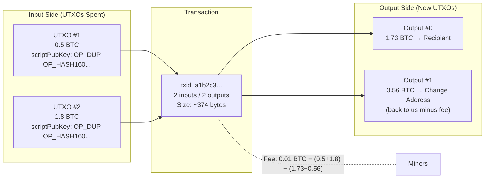
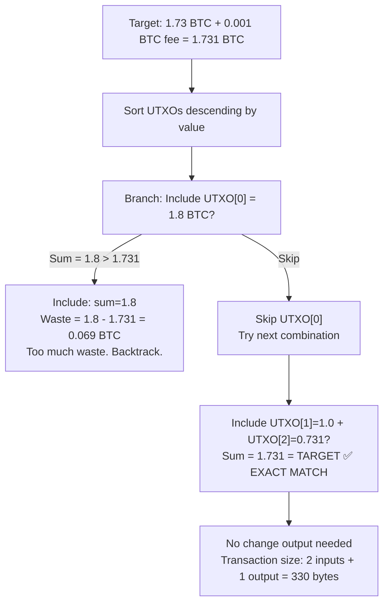
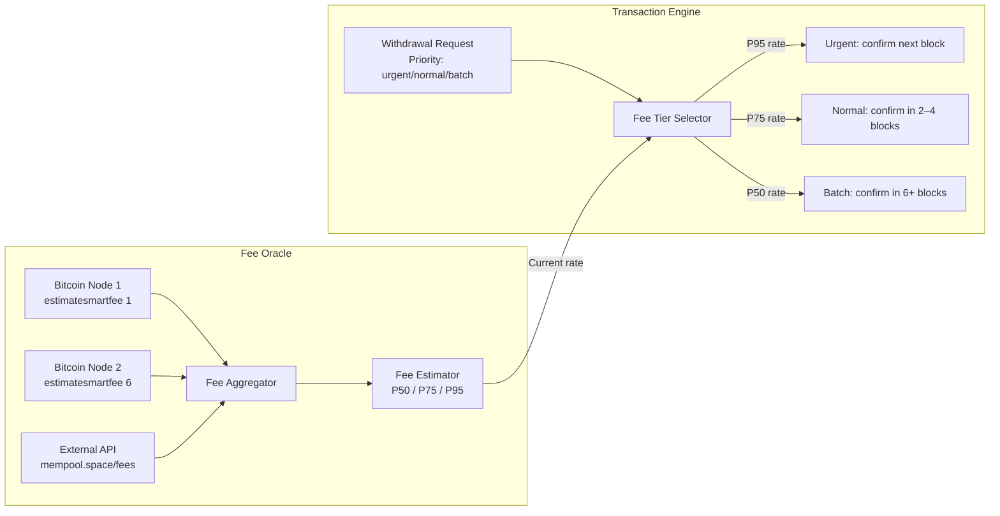
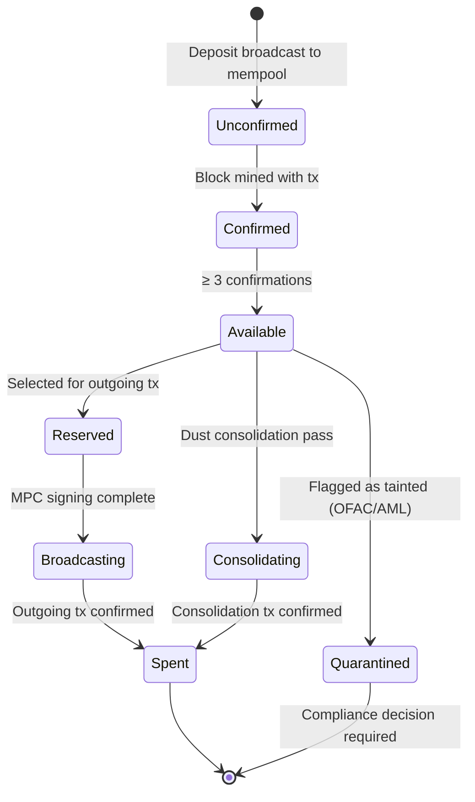

# 3. UTXO Management and Transaction Fee Optimization 🟡

> **The Problem:** Your Bitcoin custody platform processes 5,000 client deposits per day, each creating a new Unspent Transaction Output (UTXO) in your wallet. Over six months you have accumulated 900,000 UTXOs with values ranging from 0.000001 BTC (dust) to 10 BTC. When a client requests a withdrawal of exactly 1.73 BTC, your naive implementation grabs the first UTXOs it finds and throws them into a transaction. The result: a 47-input transaction that costs $85 in fees, packs a 12 KB blob onto the blockchain, and fails RBF fee-bumping because the UTXO set is fragmented. Your competitor processes the same withdrawal for $1.20 in fees using 2 inputs. You need a transaction engine that treats the UTXO set as a **managed inventory**—selecting inputs algorithmically to minimize fees, prevent dust accumulation, and maintain a UTXO pool that is operationally efficient over years of operation.

---

## 3.1 The UTXO Model: A Refresher That Actually Matters Here

Unlike Ethereum's account model (balance = running counter), Bitcoin tracks wealth as a set of discrete, unspent outputs—each is a lockbox with a specific value that must be consumed in full.



**Key constraints every Bitcoin engineer must internalize:**

| Constraint | Implication |
|---|---|
| UTXOs are atomic — spent in full | There is always a change output unless input exactly equals payment + fee |
| Transaction fee = `fee_rate × vsize` | Fewer inputs → smaller transaction → lower fee |
| Dust limit ≈ 546 satoshis (P2PKH) | UTXOs below dust limit are uneconomical to spend — ever |
| Mempool fee market fluctuates 100× | Fee estimation must be real-time, not static |
| `nLocktime` / RBF | Must set `RBF` flag on hot wallet txs to allow fee-bumping |

---

## 3.2 Why Naïve UTXO Selection Is Catastrophically Expensive

Many custody platforms start with FIFO (First In, First Out) or random selection. Both are wrong.

### The Problem with FIFO at Scale

After 6 months of operation with 5,000 deposits/day:
- Pool contains **900,000 UTXOs**
- 80% are small deposits: 0.001–0.01 BTC (customer top-ups)
- 15% are mid-size: 0.01–0.5 BTC (standard withdrawals' change outputs)
- 5% are large: 0.5–10 BTC

A FIFO selector for a 1.73 BTC withdrawal:
1. Grabs the 230 oldest UTXOs (avg 0.0075 BTC each)
2. Total value: ~1.73 BTC (barely enough)
3. Transaction size: **230 inputs × 148 bytes + 2 outputs × 34 bytes ≈ 34,068 bytes**
4. At a 15 sat/vbyte fee rate: **34,068 × 15 = 511,020 satoshis ≈ $125 in fees**

An optimal selector for the same withdrawal:
1. Grabs 2 UTXOs: 1.0 BTC + 0.74 BTC
2. Transaction size: **2 inputs × 148 bytes + 2 outputs × 34 bytes ≈ 364 bytes**
3. Same fee rate: **364 × 15 = 5,460 satoshis ≈ $1.35 in fees**

**93× fee difference.** At 5,000 transactions/day, that is $625,000/day in wasted fees.

---

## 3.3 UTXO Selection Algorithms

The field has converged on three primary algorithms, each with distinct tradeoffs:

| Algorithm | Description | Fee Efficiency | UTXO Set Health | Complexity |
|---|---|---|---|---|
| **FIFO** | Oldest UTXOs first | ❌ Poor | ❌ Poor (dust accumulates) | ✅ Trivial |
| **Largest-First** | Biggest UTXOs first | ✅ Good | ⚠️ Fragments large UTXOs | ✅ Simple |
| **Branch and Bound (BnB)** | Exact match via bounded search | ✅✅ Excellent (eliminates change) | ✅ Excellent | ⚠️ Moderate |
| **CoinSelect (Bitcoin Core)** | BnB with Knapsack fallback | ✅✅ Excellent | ✅ Good | ⚠️ Moderate |
| **Privacy-Aware Knapsack** | Minimizes fingerprinting, clusters by script type | ✅ Good | ✅ Good | 🔴 Complex |

### 3.3.1 Branch and Bound (BnB): The Optimal Algorithm

BnB searches for an input set whose total value **exactly equals** the payment + fee, eliminating the change output entirely. A transaction with no change output:
- Is smaller (no output to serialize)
- Cheaper (no change output fee)
- More private (no change address to correlate)



BnB has bounded complexity: it explores at most $O(2^n)$ combinations but prunes aggressively. In practice, for a UTXO pool of 1 million, it searches a few thousand combinations before finding a match or falling back to Knapsack.

### 3.3.2 The Complete Selection Algorithm

```rust
use std::collections::BinaryHeap;
use std::cmp::Reverse;

#[derive(Debug, Clone)]
pub struct Utxo {
    pub txid: [u8; 32],
    pub vout: u32,
    pub value_sats: u64,      // value in satoshis
    pub script_type: ScriptType,
    pub confirmations: u32,
    pub created_at: i64,      // unix timestamp
}

#[derive(Debug, Clone, PartialEq)]
pub enum ScriptType {
    P2PKH,      // Legacy: 148 vbytes input
    P2SH,       // Pay-to-script-hash: 91 vbytes input
    P2WPKH,     // SegWit v0: 68 vbytes input  ← prefer these
    P2TR,       // Taproot: 57.5 vbytes input  ← prefer these most
}

impl ScriptType {
    /// Input weight in vbytes (segwit inputs are cheaper)
    pub fn input_vbytes(&self) -> u64 {
        match self {
            ScriptType::P2PKH  => 148,
            ScriptType::P2SH   => 91,
            ScriptType::P2WPKH => 68,
            ScriptType::P2TR   => 58,   // rounded up
        }
    }
}

#[derive(Debug)]
pub struct CoinSelector {
    utxos: Vec<Utxo>,
    fee_rate_sat_per_vbyte: u64,
    dust_limit_sats: u64,
    bnb_max_tries: usize,
}

#[derive(Debug)]
pub struct SelectionResult {
    pub selected: Vec<Utxo>,
    pub fee_sats: u64,
    pub change_sats: Option<u64>,   // None = exact match, no change
    pub tx_vsize: u64,
}

impl CoinSelector {
    pub fn new(mut utxos: Vec<Utxo>, fee_rate: u64) -> Self {
        // Sort descending by value — required for BnB pruning efficiency
        utxos.sort_unstable_by(|a, b| b.value_sats.cmp(&a.value_sats));
        // Filter out dust and unconfirmed UTXOs for hot wallet spends
        utxos.retain(|u| u.value_sats > 546 && u.confirmations >= 1);
        Self {
            utxos,
            fee_rate_sat_per_vbyte: fee_rate,
            dust_limit_sats: 546,
            bnb_max_tries: 100_000,
        }
    }

    /// Compute fee for a transaction with `n_inputs` and `n_outputs` outputs
    fn estimate_fee(&self, n_inputs: &[&Utxo], n_outputs: usize) -> u64 {
        // Base: 10 vbytes overhead + 31 vbytes per output
        let base_vbytes: u64 = 10 + (n_outputs as u64 * 31);
        let input_vbytes: u64 = n_inputs.iter().map(|u| u.script_type.input_vbytes()).sum();
        let total_vbytes = base_vbytes + input_vbytes;
        total_vbytes * self.fee_rate_sat_per_vbyte
    }

    /// Primary entry point: Branch and Bound with Knapsack fallback
    pub fn select(&self, target_sats: u64) -> Option<SelectionResult> {
        // Try BnB first: attempt to find exact match with no change output
        if let Some(result) = self.branch_and_bound(target_sats) {
            return Some(result);
        }
        // Fall back to Knapsack (largest first with change)
        self.knapsack_select(target_sats)
    }

    fn branch_and_bound(&self, target_sats: u64) -> Option<SelectionResult> {
        let n = self.utxos.len();
        // Precompute suffix sums for pruning: suffix_sum[i] = sum of utxos[i..n]
        let mut suffix_sum = vec![0u64; n + 1];
        for i in (0..n).rev() {
            suffix_sum[i] = suffix_sum[i + 1] + self.utxos[i].value_sats;
        }

        let mut best: Option<Vec<bool>> = None;
        let mut best_waste = u64::MAX;
        let mut current_selection = vec![false; n];
        let mut current_value: u64 = 0;
        let mut tries = 0;

        self.bnb_recursive(
            0, target_sats, &suffix_sum, &mut current_selection,
            &mut current_value, &mut best, &mut best_waste, &mut tries,
        );

        best.map(|selection| {
            let selected: Vec<Utxo> = self.utxos.iter()
                .zip(selection.iter())
                .filter_map(|(u, &chosen)| if chosen { Some(u.clone()) } else { None })
                .collect();
            let fee = self.estimate_fee(
                &selected.iter().collect::<Vec<_>>(), 1 // 1 output, no change
            );
            SelectionResult {
                fee_sats: fee,
                tx_vsize: fee / self.fee_rate_sat_per_vbyte,
                change_sats: None,
                selected,
            }
        })
    }

    fn bnb_recursive(
        &self, depth: usize, target: u64,
        suffix_sum: &[u64], current: &mut Vec<bool>,
        current_value: &mut u64, best: &mut Option<Vec<bool>>,
        best_waste: &mut u64, tries: &mut usize,
    ) {
        *tries += 1;
        if *tries > self.bnb_max_tries { return; }

        let n = self.utxos.len();
        let fee_no_change = self.estimate_fee(
            &current.iter().enumerate()
                .filter_map(|(i, &sel)| if sel { Some(&self.utxos[i]) } else { None })
                .collect::<Vec<_>>(),
            1
        );
        let effective_target = target + fee_no_change;

        if *current_value == effective_target {
            // Exact match
            let waste = 0u64;
            if waste < *best_waste {
                *best_waste = waste;
                *best = Some(current.clone());
            }
            return;
        }

        if depth == n { return; }

        // Pruning: even selecting all remaining can't reach target
        if *current_value + suffix_sum[depth] < effective_target { return; }
        // Pruning: current value already exceeds target + best known waste
        if *current_value > effective_target + *best_waste { return; }

        // Branch: include utxos[depth]
        current[depth] = true;
        *current_value += self.utxos[depth].value_sats;
        self.bnb_recursive(depth+1, target, suffix_sum, current,
            current_value, best, best_waste, tries);
        *current_value -= self.utxos[depth].value_sats;

        // Branch: exclude utxos[depth]
        current[depth] = false;
        self.bnb_recursive(depth+1, target, suffix_sum, current,
            current_value, best, best_waste, tries);
    }

    fn knapsack_select(&self, target_sats: u64) -> Option<SelectionResult> {
        let mut selected = Vec::new();
        let mut accumulated = 0u64;

        // Greedy: largest UTXOs first
        for utxo in &self.utxos {
            selected.push(utxo.clone());
            accumulated += utxo.value_sats;
            let fee = self.estimate_fee(
                &selected.iter().collect::<Vec<_>>(), 2 // 2 outputs with change
            );
            if accumulated >= target_sats + fee {
                let change = accumulated - target_sats - fee;
                // Only create change output if above dust limit
                let change_sats = if change > self.dust_limit_sats {
                    Some(change)
                } else {
                    None // donate dust to miners
                };
                return Some(SelectionResult {
                    fee_sats: fee,
                    tx_vsize: fee / self.fee_rate_sat_per_vbyte,
                    change_sats,
                    selected,
                });
            }
        }
        None // Insufficient funds
    }
}
```

---

## 3.4 Dust Prevention and UTXO Consolidation

### The Dust Problem

Every small deposit creates a tiny UTXO. Over time these accumulate:

```
900,000 UTXOs × avg 0.00005 BTC × $60,000/BTC = $2.7 billion face value
But: 400,000 UTXOs are below 0.001 BTC → each costs $0.30 in fees to spend
Total cost to sweep dust UTXOs: 400,000 × $0.30 = $120,000
```

Dust UTXOs are **uneconomical to spend at any fee rate** once they fall below a threshold. They linger forever, bloating your UTXO pool and making UTXO selection slower.

### Consolidation Strategy: Low-Fee Window Opportunism

During periods of low mempool congestion (typically weekends, early morning UTC), the consolidation service batches dust UTXOs into larger, economical UTXOs:

```rust
pub struct ConsolidationEngine {
    utxo_store: Arc<UtxoStore>,
    mempool_monitor: Arc<MempoolFeeMonitor>,
    consolidation_fee_threshold_sat_per_vbyte: u64,    // e.g., 5 sat/vbyte
    min_utxos_to_consolidate: usize,                    // e.g., 50
    max_utxos_per_consolidation_tx: usize,              // e.g., 200
}

impl ConsolidationEngine {
    pub async fn run_consolidation_pass(&self) -> anyhow::Result<Vec<[u8; 32]>> {
        let current_fee_rate = self.mempool_monitor.estimate_fee_rate(6).await?;
        if current_fee_rate > self.consolidation_fee_threshold_sat_per_vbyte {
            // Not worth consolidating at high fee rates
            return Ok(vec![]);
        }

        let dust_utxos = self.utxo_store
            .get_utxos_below_value(10_000) // below 0.0001 BTC
            .await?;

        if dust_utxos.len() < self.min_utxos_to_consolidate {
            return Ok(vec![]);
        }

        let mut broadcast_txids = vec![];
        for chunk in dust_utxos.chunks(self.max_utxos_per_consolidation_tx) {
            let tx = self.build_consolidation_tx(chunk, current_fee_rate).await?;
            let txid = self.broadcast(&tx).await?;
            broadcast_txids.push(txid);
            tracing::info!(
                utxos_consolidated = chunk.len(),
                txid = hex::encode(txid),
                fee_rate = current_fee_rate,
                "Consolidated dust UTXOs"
            );
        }
        Ok(broadcast_txids)
    }

    async fn build_consolidation_tx(
        &self,
        inputs: &[Utxo],
        fee_rate: u64,
    ) -> anyhow::Result<Vec<u8>> {
        let total_input: u64 = inputs.iter().map(|u| u.value_sats).sum();
        // One output: consolidated UTXO back to our cold wallet address
        let fee = self.estimate_consolidation_fee(inputs.len(), fee_rate);
        let output_value = total_input.checked_sub(fee)
            .ok_or_else(|| anyhow::anyhow!("Fee exceeds input value in consolidation batch"))?;
        // Build and sign transaction via HSM...
        todo!("Build, sign via MPC/HSM, and serialize Bitcoin transaction")
    }
}
```

---

## 3.5 Real-Time Fee Estimation

Static fee rates kill you in fee markets. Your engine must track mempool in real time:



```rust
#[derive(Debug, Clone)]
pub struct FeeEstimate {
    pub sat_per_vbyte_p50: u64,   // 50th percentile — batch withdrawals
    pub sat_per_vbyte_p75: u64,   // 75th percentile — normal withdrawals
    pub sat_per_vbyte_p95: u64,   // 95th percentile — urgent / RBF top-up
    pub estimated_at: std::time::Instant,
}

pub struct MempoolFeeMonitor {
    nodes: Vec<BitcoinRpcClient>,
    external_apis: Vec<Box<dyn FeeApi + Send + Sync>>,
    cache: tokio::sync::RwLock<Option<FeeEstimate>>,
    cache_ttl: std::time::Duration,
}

impl MempoolFeeMonitor {
    pub async fn estimate_fee_rate(&self, target_blocks: u32) -> anyhow::Result<u64> {
        {
            let cache = self.cache.read().await;
            if let Some(ref est) = *cache {
                if est.estimated_at.elapsed() < self.cache_ttl {
                    return Ok(match target_blocks {
                        1     => est.sat_per_vbyte_p95,
                        2..=3 => est.sat_per_vbyte_p75,
                        _     => est.sat_per_vbyte_p50,
                    });
                }
            }
        }
        // Cache miss — fetch fresh estimates
        let fresh = self.fetch_and_aggregate().await?;
        *self.cache.write().await = Some(fresh.clone());
        Ok(match target_blocks {
            1     => fresh.sat_per_vbyte_p95,
            2..=3 => fresh.sat_per_vbyte_p75,
            _     => fresh.sat_per_vbyte_p50,
        })
    }

    async fn fetch_and_aggregate(&self) -> anyhow::Result<FeeEstimate> {
        let mut rates: Vec<u64> = Vec::new();
        for node in &self.nodes {
            if let Ok(rate) = node.estimate_smart_fee(3).await {
                rates.push(rate);
            }
        }
        for api in &self.external_apis {
            if let Ok(rate) = api.fetch_median_fee().await {
                rates.push(rate);
            }
        }
        if rates.is_empty() {
            anyhow::bail!("All fee estimation sources failed");
        }
        rates.sort_unstable();
        let n = rates.len();
        Ok(FeeEstimate {
            sat_per_vbyte_p50: rates[n / 2],
            sat_per_vbyte_p75: rates[n * 3 / 4],
            sat_per_vbyte_p95: rates[n * 19 / 20],
            estimated_at: std::time::Instant::now(),
        })
    }
}
```

---

## 3.6 Replace-By-Fee (RBF): When Your Transaction Gets Stuck

All hot wallet transactions must set the **RBF signal** (`nSequence < 0xFFFFFFFE`) so they can be fee-bumped if the mempool fee market spikes after broadcast.

```rust
pub struct RbfBumper {
    utxo_store: Arc<UtxoStore>,
    fee_monitor: Arc<MempoolFeeMonitor>,
    mempool_client: Arc<BitcoinRpcClient>,
    stuck_threshold_minutes: u64,
}

impl RbfBumper {
    pub async fn monitor_and_bump(&self) -> anyhow::Result<()> {
        let pending = self.utxo_store.get_pending_transactions().await?;
        let current_rate = self.fee_monitor.estimate_fee_rate(1).await?;

        for tx in pending {
            let age_minutes = tx.broadcast_at.elapsed().as_secs() / 60;
            if age_minutes < self.stuck_threshold_minutes { continue; }

            // Transaction is stuck — bump fee
            if tx.fee_rate_sat_per_vbyte < current_rate {
                let new_rate = current_rate * 12 / 10; // +20% above current best
                let bump_tx = self.build_rbf_replacement(&tx, new_rate).await?;
                self.mempool_client.send_raw_transaction(&bump_tx).await?;
                tracing::warn!(
                    original_txid = hex::encode(tx.txid),
                    original_rate = tx.fee_rate_sat_per_vbyte,
                    new_rate,
                    "RBF fee bump applied"
                );
            }
        }
        Ok(())
    }
}
```

---

## 3.7 The Complete UTXO Lifecycle



---

> **Key Takeaways**
> 1. **Branch and Bound eliminates change outputs** for ~40% of transactions, reducing fee cost and transaction size simultaneously.
> 2. **Dust is not a minor inconvenience—it is a compounding operational liability.** Schedule consolidation passes during low-fee windows (target < 5 sat/vbyte) with a maximum of 200 inputs per consolidation transaction.
> 3. **Always set the RBF signal** on hot wallet transactions. A transaction that cannot be fee-bumped during a fee spike is a stuck withdrawal and a violated SLA.
> 4. **Fee estimation must be real-time and multi-source.** A single node's `estimatesmartfee` can be wrong; aggregate across nodes and external APIs with a short TTL cache.
> 5. **UTXO selection algorithm performance matters at scale.** With 1 million UTXOs, naïve O(N) iteration on every withdrawal introduces latency; maintain a sorted in-memory index with persistent backing.
