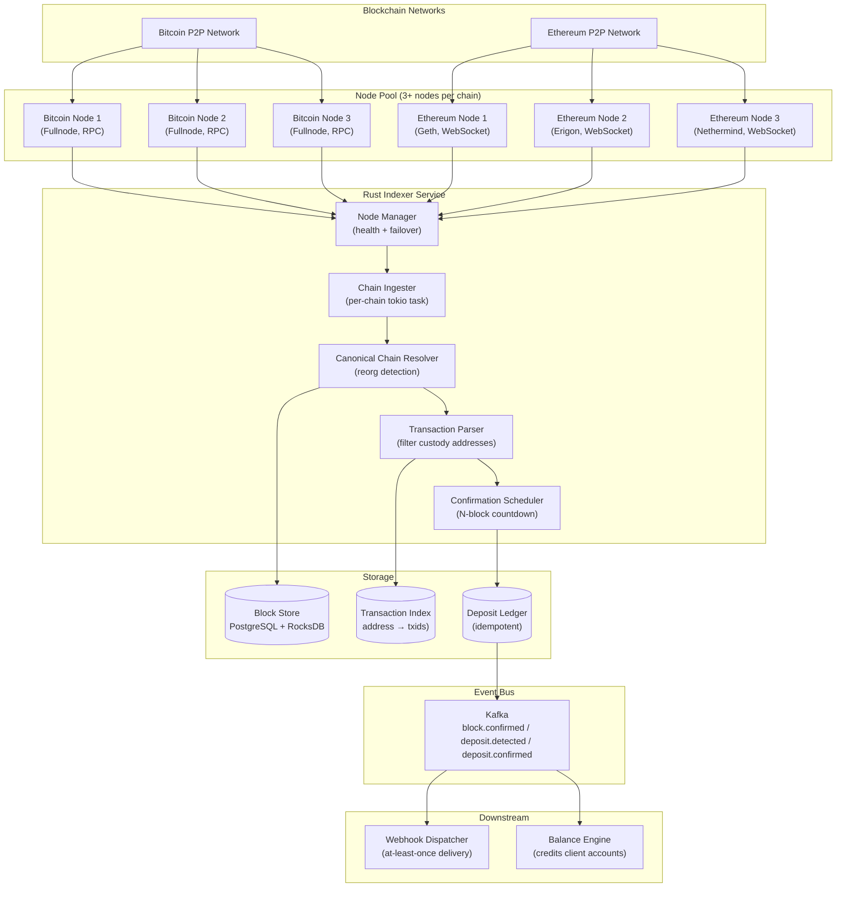
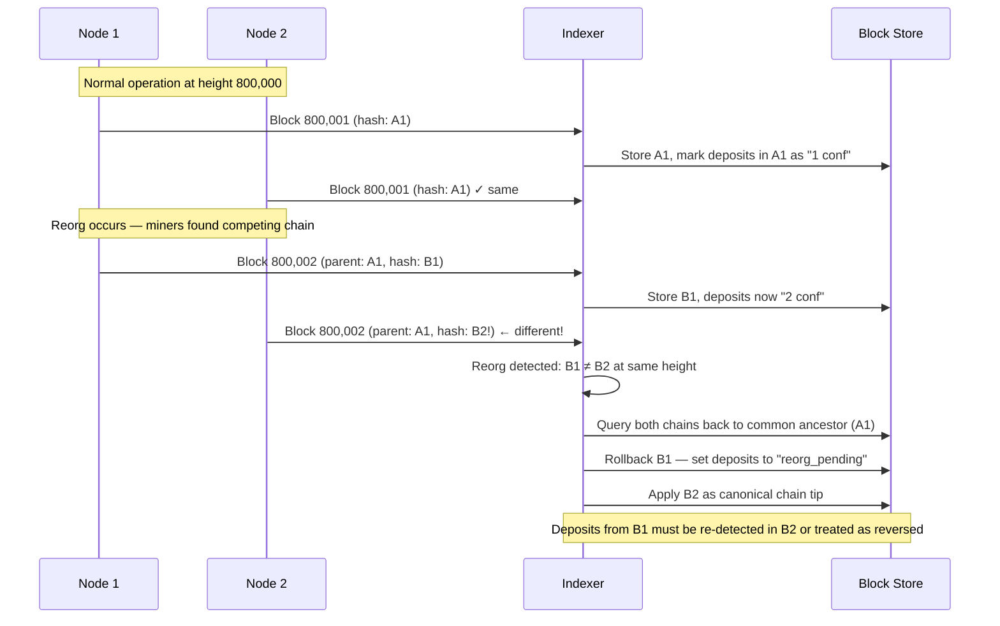
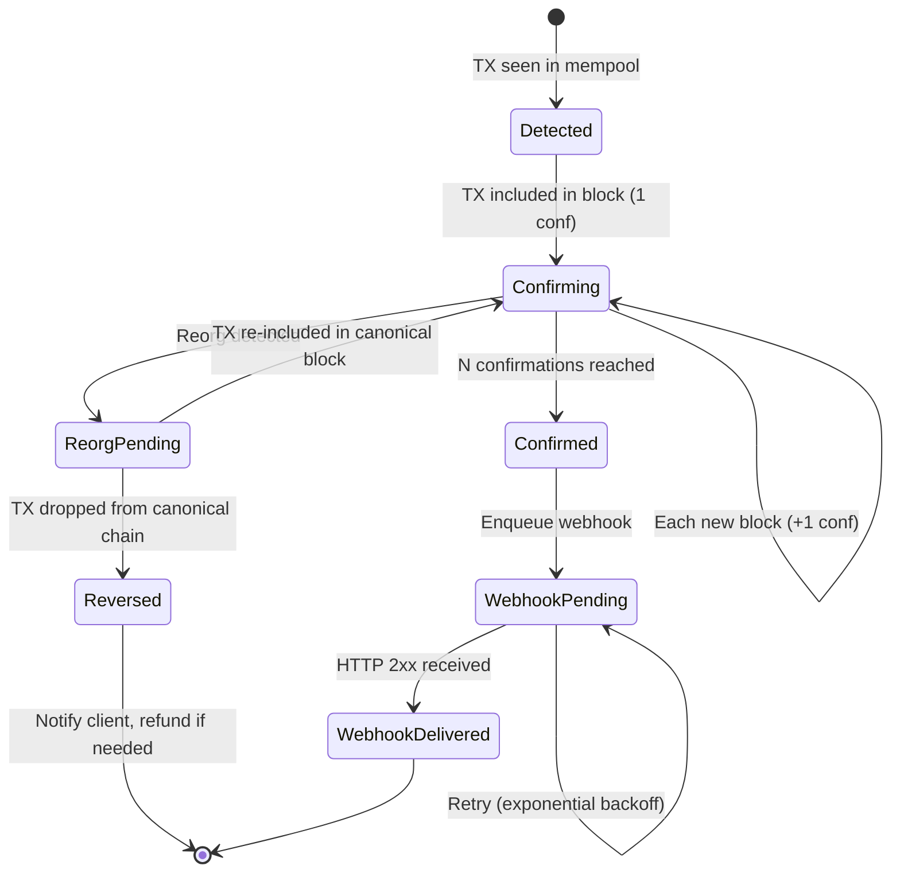

# 4. Blockchain Indexing and Confirmation Tracking 🟡

> **The Problem:** Your custody platform needs to detect when a client deposits Bitcoin or ETH, credit their account, and trigger a "Deposit Confirmed" webhook to their application—reliably, exactly once, even if your indexer crashes mid-block, even if the Bitcoin network produces a chain reorganization (orphan block) that reverses 2 confirmations, and even if one of your connected nodes lies to you or falls behind. A naïve approach—polling a single Ethereum node's `eth_getBalance`—gives you eventual accuracy on a good day, but silently fails during node downtime, gives you wrong data during reorgs, and scales to exactly one chain before your architecture collapses. You need a **multi-node, reorg-aware blockchain indexer** that parses raw block data, maintains a canonical chain view, and fires idempotent confirmation webhooks only after $N$ block confirmations with cryptographic certainty.

---

## 4.1 Why You Cannot Trust a Single Node

The central insight of institutional blockchain indexing: **a blockchain node is not a database. It is an eventually consistent, adversarially replicating system that can lie.**

| Failure Mode | Single Node | Multi-Node Quorum |
|---|---|---|
| Node crashes mid-sync | ❌ Silent gap in data | ✅ Failover to another node |
| Node reports wrong chain tip | ❌ Undetectable | ✅ Quorum disagrees → alert |
| Chain reorganization | ❌ May not notify you consistently | ✅ Cross-node reorg detection |
| Slow/stuck node (stale tip) | ❌ Missed deposits until caught up | ✅ Fastest node determines tip |
| Corrupted mempool state | ❌ Wrong pending balance | ✅ Majority rules |
| Node software bug (real: Ethereum consensus bug 2021) | ❌ Accept bogus data | ✅ Minority node is quarantined |

### The Confirmation Safety Numbers

Institutional custody requires conservatively high confirmation counts. A block can be orphaned up to these depths in practice:

| Chain | Network | Required Confirmations | Rationale |
|---|---|---|---|
| Bitcoin | Mainnet | **6** | Classic Satoshi recommendation; >51% attack infeasible past depth 6 |
| Ethereum | Mainnet | **32** (2 epochs) | Post-merge finality via Casper; 32 slots ≈ finalized |
| Ethereum | High-value | **64** | Extra buffer; two consecutive finalized epochs |
| ERC-20 Token | Mainnet | **32** | Same as ETH; token transfer shares block finality |
| Bitcoin | Large deposit | **12** | Institutional standard for deposits > $1M |

---

## 4.2 System Architecture



---

## 4.3 The Chain Ingester: Parsing Raw Blocks

### 4.3.1 Block Ingestion Loop

```rust
use tokio::sync::mpsc;
use std::sync::Arc;

#[derive(Debug, Clone)]
pub struct RawBlock {
    pub chain: Chain,
    pub height: u64,
    pub hash: [u8; 32],
    pub parent_hash: [u8; 32],
    pub timestamp: i64,
    pub transactions: Vec<RawTransaction>,
}

#[derive(Debug, Clone)]
pub struct Chain {
    pub id: &'static str,       // "bitcoin", "ethereum"
    pub confirmation_depth: u64,
}

pub struct ChainIngester {
    node_manager: Arc<NodeManager>,
    chain: Chain,
    block_tx: mpsc::Sender<RawBlock>,
    state: Arc<tokio::sync::Mutex<IngesterState>>,
}

#[derive(Debug, Default)]
struct IngesterState {
    last_processed_height: u64,
    last_processed_hash: [u8; 32],
}

impl ChainIngester {
    pub async fn run(&self) -> anyhow::Result<()> {
        loop {
            let result = self.ingest_loop().await;
            if let Err(e) = result {
                tracing::error!(
                    chain = self.chain.id,
                    error = %e,
                    "Ingester error — reconnecting in 5s"
                );
                tokio::time::sleep(std::time::Duration::from_secs(5)).await;
            }
        }
    }

    async fn ingest_loop(&self) -> anyhow::Result<()> {
        let node = self.node_manager.best_node(self.chain.id).await?;
        let mut block_stream = node.subscribe_new_blocks().await?;

        while let Some(block) = block_stream.recv().await {
            let state = self.state.lock().await;
            let expected_parent = state.last_processed_hash;
            drop(state);

            if block.parent_hash != expected_parent && !expected_parent.iter().all(|b| *b == 0) {
                // Block's parent doesn't match our tip → reorg detected!
                self.handle_reorg(&block, &node).await?;
            } else {
                self.process_block(block).await?;
            }
        }
        anyhow::bail!("Block stream ended unexpectedly");
    }

    async fn process_block(&self, block: RawBlock) -> anyhow::Result<()> {
        tracing::info!(
            chain = self.chain.id,
            height = block.height,
            hash  = hex::encode(block.hash),
            txs   = block.transactions.len(),
            "Processing block"
        );
        // Send to Canonical Chain Resolver for further processing
        self.block_tx.send(block.clone()).await?;

        let mut state = self.state.lock().await;
        state.last_processed_height = block.height;
        state.last_processed_hash = block.hash;
        Ok(())
    }
}
```

---

## 4.4 Chain Reorganization Handling

A **reorg** occurs when the network adopts a different chain branch, reversing previously confirmed blocks. In Bitcoin, 1-block reorgs happen several times per year; 2-block reorgs are rare but possible.

### 4.4.1 Reorg Detection and Rollback



```rust
struct CanonicalChainResolver {
    block_store: Arc<BlockStore>,
    deposit_store: Arc<DepositStore>,
    chain: Chain,
}

impl CanonicalChainResolver {
    /// Called when we receive a block whose parent doesn't match our stored tip.
    pub async fn handle_reorg(
        &self,
        new_block: &RawBlock,
        node: &dyn BlockchainNode,
    ) -> anyhow::Result<()> {
        // Walk back both chains to find common ancestor
        let common_ancestor = self
            .find_common_ancestor(new_block, node)
            .await?;

        tracing::warn!(
            chain         = self.chain.id,
            reorg_depth   = new_block.height - common_ancestor.height,
            common_height = common_ancestor.height,
            common_hash   = hex::encode(common_ancestor.hash),
            "Chain reorganization detected"
        );

        // Rollback our canonical chain to the common ancestor
        let rolled_back_blocks = self.block_store
            .rollback_to_height(common_ancestor.height)
            .await?;

        // Mark any deposits from rolled-back blocks as "reorg_reversed"
        for block in &rolled_back_blocks {
            let affected_deposits = self.deposit_store
                .get_deposits_in_block(&block.hash)
                .await?;
            for deposit in affected_deposits {
                self.deposit_store
                    .mark_reorg_reversed(deposit.id, block.height)
                    .await?;
                tracing::warn!(
                    deposit_id    = %deposit.id,
                    original_hash = hex::encode(block.hash),
                    "Deposit reversed by reorg — confirmation count reset"
                );
            }
        }
        Ok(())
    }

    async fn find_common_ancestor(
        &self,
        new_block: &RawBlock,
        node: &dyn BlockchainNode,
    ) -> anyhow::Result<BlockHeader> {
        let mut candidate_hash = new_block.parent_hash;
        // Walk new_block's ancestry downward until we find a hash we know
        loop {
            if let Some(stored) = self.block_store.get_by_hash(&candidate_hash).await? {
                return Ok(stored.header);
            }
            // Fetch parent from node
            let parent = node.get_block_header(&candidate_hash).await?;
            candidate_hash = parent.parent_hash;
        }
    }
}
```

### 4.4.2 Confirmation Depth After Reorg

If a deposit was at 5 confirmations and a 2-block reorg reverses it, the confirmation counter resets:

```
Deposit TX: seen first in block height 800,001
After reorg of depth 2: canonical chain restarts from 799,999
→ TX may still be in the new chain 800,001 (different hash)
→ Confirmation counter: back to 1
→ Do NOT fire "Deposit Confirmed" webhook until counter reaches N again
```

This is why webhooks must be **idempotent and state-machine-driven**, not fired on first detection.

---

## 4.5 Multi-Node Quorum and Health Management

```rust
use std::collections::HashMap;
use tokio::time::{Duration, Instant};

#[derive(Debug, Clone)]
pub struct NodeHealth {
    pub node_id: String,
    pub chain: String,
    pub tip_height: u64,
    pub tip_hash: [u8; 32],
    pub last_seen: Instant,
    pub latency_ms: u64,
    pub is_syncing: bool,
}

pub struct NodeManager {
    nodes: Vec<Arc<dyn BlockchainNode + Send + Sync>>,
    health: tokio::sync::RwLock<HashMap<String, NodeHealth>>,
    quorum_threshold: usize,    // minimum nodes that must agree on chain tip
}

impl NodeManager {
    /// Returns the healthiest node — highest tip, lowest latency, not syncing
    pub async fn best_node(&self, chain: &str) -> anyhow::Result<Arc<dyn BlockchainNode + Send + Sync>> {
        let health = self.health.read().await;
        let mut candidates: Vec<(&NodeHealth, Arc<dyn BlockchainNode + Send + Sync>)> = health
            .values()
            .filter(|h| h.chain == chain && !h.is_syncing)
            .filter(|h| h.last_seen.elapsed() < Duration::from_secs(30))
            .filter_map(|h| {
                self.nodes.iter()
                    .find(|n| n.id() == h.node_id)
                    .map(|n| (h, Arc::clone(n)))
            })
            .collect();

        // Sort by tip height (highest first), then latency (lowest first)
        candidates.sort_by(|(a, _), (b, _)| {
            b.tip_height.cmp(&a.tip_height)
                .then(a.latency_ms.cmp(&b.latency_ms))
        });

        candidates.into_iter().next()
            .map(|(_, node)| node)
            .ok_or_else(|| anyhow::anyhow!("No healthy {chain} nodes available"))
    }

    /// Returns the canonical tip agreed upon by quorum of nodes
    pub async fn quorum_tip(&self, chain: &str) -> anyhow::Result<u64> {
        let health = self.health.read().await;
        let tips: Vec<u64> = health.values()
            .filter(|h| h.chain == chain && !h.is_syncing)
            .map(|h| h.tip_height)
            .collect();

        if tips.len() < self.quorum_threshold {
            anyhow::bail!("Insufficient healthy nodes for {chain} quorum: {} < {}",
                tips.len(), self.quorum_threshold);
        }

        // Return the median tip height — resistant to any one liar
        let mut sorted = tips.clone();
        sorted.sort_unstable();
        Ok(sorted[sorted.len() / 2])
    }

    pub async fn run_health_monitor(&self) -> anyhow::Result<()> {
        let mut interval = tokio::time::interval(Duration::from_secs(10));
        loop {
            interval.tick().await;
            let mut health = self.health.write().await;
            for node in &self.nodes {
                let start = Instant::now();
                match node.get_tip().await {
                    Ok((height, hash)) => {
                        health.insert(node.id().to_string(), NodeHealth {
                            node_id: node.id().to_string(),
                            chain: node.chain().to_string(),
                            tip_height: height,
                            tip_hash: hash,
                            last_seen: Instant::now(),
                            latency_ms: start.elapsed().as_millis() as u64,
                            is_syncing: false,
                        });
                    }
                    Err(e) => {
                        tracing::error!(node_id = node.id(), error = %e, "Node health check failed");
                    }
                }
            }
        }
    }
}
```

---

## 4.6 The Confirmation Tracker and Webhook Dispatcher

### 4.6.1 Confirmation State Machine



### 4.6.2 Confirmation Scheduler

```rust
use uuid::Uuid;
use chrono::{DateTime, Utc};

#[derive(Debug, sqlx::FromRow)]
pub struct DepositRecord {
    pub id: Uuid,
    pub chain: String,
    pub txid: Vec<u8>,
    pub vout: i32,                  // Bitcoin output index (0 for ETH)
    pub address: String,
    pub amount_base_units: i64,     // satoshis or wei
    pub first_seen_block: i64,
    pub first_seen_hash: Vec<u8>,
    pub confirmation_count: i32,
    pub status: DepositStatus,
    pub detected_at: DateTime<Utc>,
    pub confirmed_at: Option<DateTime<Utc>>,
}

#[derive(Debug, sqlx::Type, PartialEq)]
#[sqlx(type_name = "deposit_status", rename_all = "snake_case")]
pub enum DepositStatus {
    Detected,
    Confirming,
    Confirmed,
    ReorgPending,
    Reversed,
}

pub struct ConfirmationTracker {
    db: sqlx::PgPool,
    required_confirmations: HashMap<String, u32>,   // chain → N
    kafka_producer: Arc<KafkaProducer>,
}

impl ConfirmationTracker {
    pub async fn on_new_block(&self, block: &RawBlock) -> anyhow::Result<()> {
        let required = self.required_confirmations
            .get(block.chain.id)
            .copied()
            .unwrap_or(6);

        // 1. Update confirmation counts for all pending deposits on this chain
        let updated = sqlx::query!(
            r#"
            UPDATE deposits
            SET confirmation_count = confirmation_count + 1
            WHERE chain = $1
              AND status IN ('detected', 'confirming')
            RETURNING id, confirmation_count, status as "status: DepositStatus"
            "#,
            block.chain.id
        )
        .fetch_all(&self.db)
        .await?;

        // 2. Mark confirmed and fire webhooks
        for row in updated {
            if row.confirmation_count >= required as i32 {
                sqlx::query!(
                    r#"UPDATE deposits SET status = 'confirmed', confirmed_at = now()
                       WHERE id = $1"#,
                    row.id
                )
                .execute(&self.db)
                .await?;

                // Publish to Kafka — webhook dispatcher will deliver
                self.kafka_producer.publish(
                    "deposit.confirmed",
                    &DepositConfirmedEvent {
                        deposit_id: row.id,
                        block_height: block.height,
                        block_hash: block.hash,
                        confirmations: row.confirmation_count as u32,
                    },
                ).await?;

                tracing::info!(
                    deposit_id    = %row.id,
                    confirmations = row.confirmation_count,
                    chain         = block.chain.id,
                    "Deposit reached required confirmations"
                );
            }
        }
        Ok(())
    }
}
```

### 4.6.3 Idempotent Webhook Delivery

```rust
pub struct WebhookDispatcher {
    http: reqwest::Client,
    db: sqlx::PgPool,
    signing_key: hmac::Key,     // HMAC-SHA256 key for webhook signature
}

impl WebhookDispatcher {
    /// Dispatch with exponential backoff and idempotency key
    pub async fn deliver(&self, event: &DepositConfirmedEvent) -> anyhow::Result<()> {
        let webhook_url = self.get_client_webhook_url(event.deposit_id).await?;
        let payload = serde_json::to_vec(event)?;

        // HMAC-SHA256 signature so recipients can verify authenticity
        let tag = hmac::sign(&self.signing_key, &payload);
        let signature = hex::encode(tag.as_ref());

        // Idempotency: use deposit_id as idempotency key in both our DB and headers
        let idempotency_key = event.deposit_id.to_string();

        let mut attempt = 0u32;
        loop {
            attempt += 1;
            let resp = self.http
                .post(&webhook_url)
                .header("Content-Type", "application/json")
                .header("X-Custody-Signature", format!("hmac-sha256={signature}"))
                .header("X-Idempotency-Key", &idempotency_key)
                .body(payload.clone())
                .timeout(std::time::Duration::from_secs(10))
                .send()
                .await;

            match resp {
                Ok(r) if r.status().is_success() => {
                    sqlx::query!(
                        "UPDATE webhook_deliveries SET status = 'delivered', delivered_at = now() \
                         WHERE deposit_id = $1",
                        event.deposit_id
                    )
                    .execute(&self.db)
                    .await?;
                    return Ok(());
                }
                Ok(r) => {
                    tracing::warn!(
                        deposit_id = %event.deposit_id,
                        attempt,
                        status_code = r.status().as_u16(),
                        "Webhook delivery failed — will retry"
                    );
                }
                Err(e) => {
                    tracing::warn!(
                        deposit_id = %event.deposit_id,
                        attempt,
                        error = %e,
                        "Webhook delivery error — will retry"
                    );
                }
            }

            // Exponential backoff: 1s, 2s, 4s, 8s ... capped at 5 minutes
            if attempt >= 20 {
                anyhow::bail!("Webhook permanently failed after 20 attempts");
            }
            let delay = std::time::Duration::from_secs(
                (2u64.pow(attempt - 1)).min(300)
            );
            tokio::time::sleep(delay).await;
        }
    }
}
```

---

## 4.7 Address Monitoring and Transaction Filtering

Rather than parsing every transaction in every block (wasteful at Bitcoin's ~3,000 tx/block), the indexer maintains a Bloom filter of all watched addresses for O(1) membership testing before full parsing:

```rust
use bloomfilter::Bloom;
use std::sync::Arc;
use tokio::sync::RwLock;

pub struct AddressFilter {
    /// Bloom filter: false-positive rate 0.001% at 10M addresses
    bloom: RwLock<Bloom<String>>,
    /// Authoritative set in DB (Bloom cannot delete; DB needed for definitive check)
    db: Arc<sqlx::PgPool>,
}

impl AddressFilter {
    pub async fn new(db: Arc<sqlx::PgPool>) -> anyhow::Result<Self> {
        let addresses = sqlx::query_scalar!(
            "SELECT address FROM custody_addresses WHERE active = true"
        )
        .fetch_all(db.as_ref())
        .await?;

        // Size bloom filter for 10x current addresses to minimize false positives
        let mut bloom = Bloom::new_for_fp_rate(
            (addresses.len() * 10).max(1_000_000),
            0.00001, // 0.001% false positive rate
        );
        for addr in &addresses {
            bloom.set(addr);
        }

        tracing::info!(
            addresses_loaded = addresses.len(),
            "Address Bloom filter initialized"
        );

        Ok(Self { bloom: RwLock::new(bloom), db })
    }

    /// Fast O(1) check — may have false positives, never false negatives
    pub async fn probably_watched(&self, address: &str) -> bool {
        self.bloom.read().await.check(address)
    }

    /// Authoritative check — DB lookup, only called after bloom says "probably yes"
    pub async fn definitely_watched(&self, address: &str) -> anyhow::Result<bool> {
        let exists = sqlx::query_scalar!(
            "SELECT EXISTS(SELECT 1 FROM custody_addresses WHERE address = $1 AND active = true)",
            address
        )
        .fetch_one(self.db.as_ref())
        .await?
        .unwrap_or(false);
        Ok(exists)
    }

    /// Add newly generated deposit address to filter (hot path must not block)
    pub async fn add_address(&self, address: &str) {
        self.bloom.write().await.set(&address.to_string());
    }
}
```

---

> **Key Takeaways**
> 1. **Treat blockchain nodes as unreliable replicas.** Run a minimum of 3 per chain; use median tip height as canonical truth; quarantine nodes whose tip diverges by more than 3 blocks.
> 2. **Reorgs are not edge cases—they are part of normal Bitcoin operation.** Build your confirmation state machine to handle rollback from the first line of code, not as a post-launch patch.
> 3. **Never fire a "Deposit Confirmed" webhook on first detection.** Always use a state machine with N-confirmation threshold. The webhook must be idempotent: re-delivery should produce no duplicate credits.
> 4. **Bloom filters cut transaction parsing cost by ~99.9%.** With 1M watched addresses across 3,000 Bitcoin transactions per block, only ~0.3% of transactions will pass the Bloom check; only those require a DB lookup.
> 5. **HMAC-sign every webhook.** Custody webhooks credit real money to client accounts. Without a shared secret signature, an attacker who knows your webhook URL can forge deposit confirmations.
