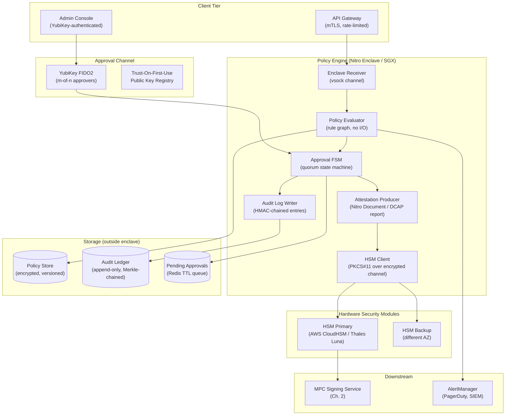
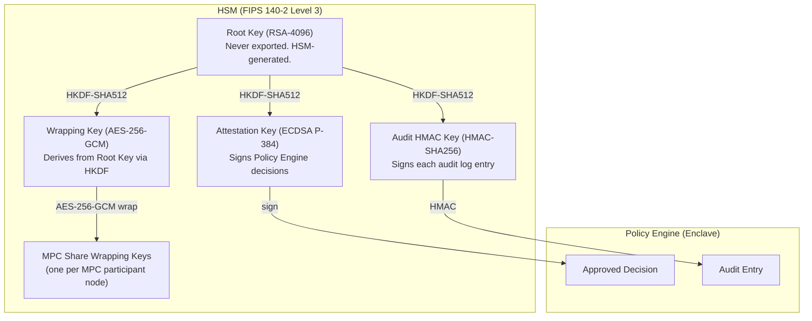
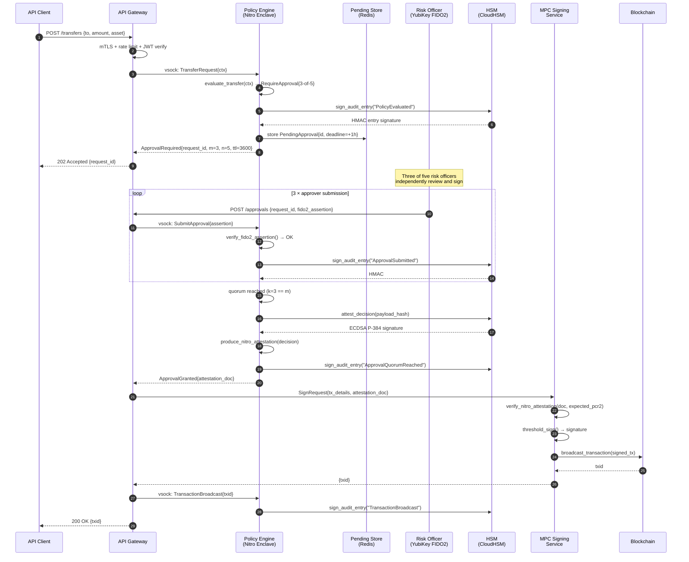
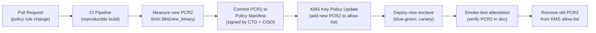

# 5. The Policy Engine and Hardware Security Modules (HSMs) 🔴

> **The Problem:** A sophisticated custody platform that correctly implements MPC signing, cold wallet sweeping, and reorg-aware blockchain indexing can still be completely compromised by a single malicious insider with the right database access or a rogue deployment pipeline that patches the signing logic at 3 AM. The cryptographic machinery is sound, but the **governance layer**—who is allowed to authorize what, under which conditions, with what evidence trail—remains a soft target. You need a **Policy Engine** that is tamper-proof by construction: its rules cannot be silently changed, its decisions cannot be forged, and its audit log cannot be erased. This requires moving the enforcement boundary inside hardware: AWS Nitro Enclaves, Intel SGX, or FIPS 140-2 Level 3 HSMs that produce cryptographically verifiable attestations proving what code ran and what decision it made.

---

## 5.1 The Insider Threat Model

Before writing a line of code, understand exactly what you are defending against:

| Threat Actor | Capability | Without Policy Engine | With Attested Policy Engine |
|---|---|---|---|
| Rogue DevOps engineer | Can deploy arbitrary code | Patches signing service; drains hot wallet | New code fails enclave attestation; signing rejected |
| Compromised CI/CD pipeline | Injects malicious binary | Silent exfiltration of private key shares | Binary hash doesn't match signed policy manifest |
| DBA with write access | Modifies approval records | Bypasses m-of-n requirement in DB | Policy Engine reads from append-only attested log |
| Social-engineered approver | Signs off on fake transaction | Single human can authorize any transfer | Quorum of $m$ hardware tokens required; one signature is insufficient |
| Attacker with root on policy server | Full OS access | Reads memory, patches policy rules in-place | Enclave memory is encrypted; OS cannot read or write it |
| Supply chain attack (compromised library) | Malicious dependency | Arbitrary code execution inside signing boundary | Enclave measurement covers full binary; any change invalidates |

The key insight: **security through policy is only meaningful when the policy enforcer itself is in a trusted execution environment (TEE) that the attacker—including OS-level attackers—cannot tamper with.**

---

## 5.2 System Architecture



### Key Architectural Invariants

1. **The Policy Engine runs entirely inside the enclave.** No plaintext policy state, no approval decisions, and no signing keyhandles ever cross the enclave boundary unencrypted.
2. **The HSM holds the master approval key.** Even after the Policy Engine approves a transaction, the actual signing key material is never exported from hardware.
3. **Every decision produces a signed attestation document.** A downstream verifier can prove cryptographically that *exactly this version of the policy code* approved *exactly this transaction*.
4. **The audit log is HMAC-chained.** Deleting or modifying any historical entry breaks the chain—detectable by any verifier with the chain's root HMAC key.

---

## 5.3 Trusted Execution Environments: Nitro vs SGX vs TrustZone

Choosing the right TEE determines your threat model boundary, performance envelope, and operational complexity.

| Property | AWS Nitro Enclave | Intel SGX (DCAP) | ARM TrustZone |
|---|---|---|---|
| **Threat boundary** | Hypervisor + Host OS | Host OS + Ring-0 | Untrusted OS world |
| **Attestation mechanism** | Nitro Attestation Document (signed by AWS root) | DCAP quote (Intel EPID/ECDSA) | Vendor-specific (no standard) |
| **Memory encryption** | Dedicated vCPUs/RAM, no shared memory | Hardware AES-XTS (MEE) | Vendor-specific |
| **Sealing (persistent secrets)** | Not native—use KMS + attestation | `sgx_seal_data` tied to MRENCLAVE | Vendor TEE storage |
| **Remote attestation** | First-class, simple JSON | Complex PCK cert chain | Proprietary |
| **Side-channel resistance** | Strong (separate EC2 instance) | Partial (Spectre/Meltdown mitigations) | Partial |
| **Cold boot attack** | Not applicable (cloud) | Possible on physical hardware | Possible |
| **Programming model** | Standard Linux process | SGX SDK / Fortanix EDP | OP-TEE / TrustZone SDK |
| **Best fit** | Cloud-native custody | On-prem HSM augmentation | IoT key storage |

### 5.3.1 AWS Nitro Enclave: The Cloud-Native Choice

A Nitro Enclave is a separate EC2 microVM with:
- **No network interface** — the only I/O channel is a local `vsock` socket to the parent EC2 instance.
- **No persistent storage** — all secrets are re-derived from KMS on each enclave boot.
- **Cryptographic attestation** — the enclave can call `kms:Decrypt` conditional on its own PCR measurements (SHA-384 hashes of the boot chain, kernel, and application binary).

```
PCR0 = SHA384(boot_firmware)
PCR1 = SHA384(kernel + kernel_cmdline)
PCR2 = SHA384(application_image)
PCR3 = SHA384(IAM_role_arn)   # parent instance role
```

Any change to the application binary changes PCR2, which causes the KMS key policy to reject the `Decrypt` call. The enclave gets no secrets and fails to start.

---

## 5.4 Policy Rule Language

The Policy Engine evaluates a deterministic, sandboxed rule set. Rules are defined in a Rust-compiled DSL, not interpreted scripts—guaranteeing the binary measurement covers the rules themselves.

```rust
// src/policy/rules.rs — compiled INTO the enclave binary
use crate::policy::types::*;

pub fn evaluate_transfer(ctx: &TransferContext) -> PolicyDecision {
    // Rule 1: Velocity limit: max $100k/hour per asset
    if ctx.rolling_volume_1h_usd > 100_000 {
        return PolicyDecision::Deny {
            reason: "velocity_limit_exceeded",
            alert_level: AlertLevel::High,
        };
    }

    // Rule 2: Large transfer: > $1M requires m-of-n human approval
    if ctx.amount_usd > 1_000_000 {
        return PolicyDecision::RequireApproval {
            scheme: ApprovalScheme::MofN { m: 3, n: 5 },
            approver_group: "risk_officers",
            ttl_seconds: 3600,
        };
    }

    // Rule 3: New destination address in last 24h requires 2-of-3 approval
    if ctx.destination_first_seen_hours < 24 {
        return PolicyDecision::RequireApproval {
            scheme: ApprovalScheme::MofN { m: 2, n: 3 },
            approver_group: "operations",
            ttl_seconds: 1800,
        };
    }

    // Rule 4: Sanctioned address (OFAC list compiled into binary)
    if SANCTIONED_ADDRESSES.contains(&ctx.destination_address) {
        return PolicyDecision::Deny {
            reason: "ofac_sanctioned_destination",
            alert_level: AlertLevel::Critical,
        };
    }

    // Rule 5: Time-based: no automated transfers between 22:00–06:00 UTC
    let hour = ctx.utc_hour();
    if hour >= 22 || hour < 6 {
        return PolicyDecision::RequireApproval {
            scheme: ApprovalScheme::MofN { m: 1, n: 3 },
            approver_group: "on_call",
            ttl_seconds: 900,
        };
    }

    PolicyDecision::Allow
}
```

**Critical:** The OFAC sanctions list (`SANCTIONED_ADDRESSES`) is compiled as a frozen `phf::Set` into the binary, not loaded from a database at runtime. This means it is covered by the SGX/Nitro binary measurement—an attacker cannot add or remove addresses without changing the binary hash.

```rust
// src/policy/sanctions.rs — generated build artifact, included at compile time
use phf::phf_set;

pub static SANCTIONED_ADDRESSES: phf::Set<&'static str> = phf_set! {
    "1ASkqdo1hvydosVRc8zMWqGEmYnMVpE79w",   // OFAC SDN entry
    "0x7f268357a8c2552623316e2562d90e642bb538e5",
    // ... thousands of entries compiled in at build time
};
```

---

## 5.5 The Approval State Machine

For transactions requiring human approval, the Policy Engine maintains a finite-state machine inside the enclave. Approval submissions are gated by FIDO2/YubiKey signatures.

```mermaid
stateDiagram-v2
    [*] --> Pending : PolicyDecision::RequireApproval
    Pending --> Collecting : first approval received (k=1)
    Collecting --> Collecting : additional approval (k < m)
    Collecting --> Approved : k == m approvals, all valid FIDO2 sigs
    Collecting --> Expired : TTL elapsed before k == m
    Pending --> Expired : TTL elapsed with zero approvals
    Expired --> [*] : logged as EXPIRED, transfer rejected
    Approved --> Attested : Enclave signs decision with HSM key
    Attested --> Executing : MPC service invoked
    Executing --> Completed : broadcast txid received
    Executing --> Failed : MPC error or broadcast rejection
    Completed --> [*] : audit entry finalized
    Failed --> [*] : audit entry finalized, alert raised
    Pending --> Cancelled : any approver submits CANCEL
    Collecting --> Cancelled : any approver submits CANCEL (resets k)
    Cancelled --> [*] : logged as CANCELLED
```

### 5.5.1 Approval State Machine in Rust

```rust
use std::collections::{HashMap, HashSet};
use chrono::{DateTime, Utc, Duration};

#[derive(Debug, Clone, PartialEq)]
pub enum ApprovalState {
    Pending,
    Collecting { approvals: Vec<ApprovalRecord> },
    Approved { finalized_at: DateTime<Utc>, attestation: Vec<u8> },
    Expired,
    Cancelled { cancelled_by: String },
    Executing { mpc_request_id: uuid::Uuid },
    Completed { txid: String },
    Failed { reason: String },
}

#[derive(Debug, Clone)]
pub struct ApprovalRecord {
    pub approver_id: String,
    pub fido2_credential_id: Vec<u8>,
    pub client_data_json: Vec<u8>,   // contains challenge = request_id
    pub authenticator_data: Vec<u8>,
    pub signature: Vec<u8>,          // ECDSA P-256 over SHA-256(authData || clientDataHash)
    pub approved_at: DateTime<Utc>,
}

pub struct ApprovalMachine {
    request_id: uuid::Uuid,
    tx_context: TransferContext,
    scheme: ApprovalScheme,
    state: ApprovalState,
    deadline: DateTime<Utc>,
    seen_approvers: HashSet<String>, // prevent double-voting
    credential_registry: Arc<FidoCredentialRegistry>,
}

impl ApprovalMachine {
    pub fn submit_approval(
        &mut self,
        record: ApprovalRecord,
    ) -> Result<ApprovalState, PolicyError> {
        // Gate: check TTL
        if Utc::now() > self.deadline {
            self.state = ApprovalState::Expired;
            return Err(PolicyError::ApprovalExpired);
        }

        // Gate: de-duplicate approver
        if self.seen_approvers.contains(&record.approver_id) {
            return Err(PolicyError::DuplicateApproval(record.approver_id.clone()));
        }

        // Verify FIDO2 signature (WebAuthn verification algorithm)
        self.verify_fido2_assertion(&record)?;

        self.seen_approvers.insert(record.approver_id.clone());

        let approvals = match &mut self.state {
            ApprovalState::Pending => {
                self.state = ApprovalState::Collecting { approvals: vec![record] };
                return Ok(self.state.clone());
            }
            ApprovalState::Collecting { approvals } => {
                approvals.push(record);
                approvals.clone()
            }
            other => return Err(PolicyError::InvalidStateTransition(format!("{:?}", other))),
        };

        let ApprovalScheme::MofN { m, .. } = self.scheme;
        if approvals.len() >= m as usize {
            // Build attestation document before transitioning
            let attestation = self.produce_attestation(&approvals)?;
            self.state = ApprovalState::Approved {
                finalized_at: Utc::now(),
                attestation,
            };
        }

        Ok(self.state.clone())
    }

    fn verify_fido2_assertion(&self, record: &ApprovalRecord) -> Result<(), PolicyError> {
        use sha2::{Sha256, Digest};
        use p256::ecdsa::{VerifyingKey, signature::Verifier, Signature};

        // Step 1: Verify challenge matches request_id
        let client_data: serde_json::Value =
            serde_json::from_slice(&record.client_data_json)
                .map_err(|_| PolicyError::InvalidFido2Data)?;
        let challenge_b64 = client_data["challenge"]
            .as_str()
            .ok_or(PolicyError::InvalidFido2Data)?;
        let challenge = base64::decode_config(challenge_b64, base64::URL_SAFE_NO_PAD)
            .map_err(|_| PolicyError::InvalidFido2Data)?;
        let expected_challenge = self.request_id.as_bytes();
        if challenge != expected_challenge {
            return Err(PolicyError::ChallengeMismatch);
        }

        // Step 2: Verify rpId hash in authenticatorData
        let rp_id_hash = &record.authenticator_data[..32];
        let expected_rp_hash = Sha256::digest(b"custody.example.com");
        if rp_id_hash != expected_rp_hash.as_slice() {
            return Err(PolicyError::RpIdMismatch);
        }

        // Step 3: Verify signature: ECDSA-P256 over SHA-256(authData || SHA-256(clientDataJSON))
        let client_data_hash = Sha256::digest(&record.client_data_json);
        let mut signed_data = record.authenticator_data.clone();
        signed_data.extend_from_slice(&client_data_hash);

        let pubkey_bytes = self.credential_registry
            .get(&record.fido2_credential_id)
            .ok_or(PolicyError::UnknownCredential)?;
        let verifying_key = VerifyingKey::from_sec1_bytes(pubkey_bytes)
            .map_err(|_| PolicyError::InvalidPublicKey)?;
        let sig = Signature::from_der(&record.signature)
            .map_err(|_| PolicyError::InvalidSignature)?;

        verifying_key
            .verify(&signed_data, &sig)
            .map_err(|_| PolicyError::SignatureVerificationFailed)
    }
}
```

---

## 5.6 Hardware Security Modules: Key Operations

### 5.6.1 HSM Key Hierarchy

The HSM is the root of trust for the entire platform. It stores no transaction data—only cryptographic keys.



### 5.6.2 PKCS#11 Integration in Rust

The de facto standard for HSM interaction is PKCS#11. We use the `cryptoki` crate to drive it from inside the enclave.

```rust
use cryptoki::context::{CInitializeArgs, Pkcs11};
use cryptoki::mechanism::Mechanism;
use cryptoki::object::{Attribute, AttributeType, KeyType, ObjectClass};
use cryptoki::session::UserType;
use cryptoki::types::AuthPin;

pub struct HsmClient {
    pkcs11: Pkcs11,
    slot: cryptoki::slot_token::Slot,
    pin: AuthPin,
}

impl HsmClient {
    pub fn new(module_path: &str, pin: &str) -> Result<Self, HsmError> {
        let pkcs11 = Pkcs11::new(module_path)?;
        pkcs11.initialize(CInitializeArgs::OsThreads)?;

        let slots = pkcs11.get_slots_with_token()?;
        let slot = slots.into_iter().next().ok_or(HsmError::NoSlotAvailable)?;

        Ok(Self {
            pkcs11,
            slot,
            pin: AuthPin::new(pin.into()),
        })
    }

    /// Sign a policy decision attestation using the HSM's ECDSA P-384 attestation key.
    pub fn sign_attestation(&self, payload: &[u8]) -> Result<Vec<u8>, HsmError> {
        let session = self.pkcs11.open_rw_session(self.slot)?;
        session.login(UserType::User, Some(&self.pin))?;

        // Find the Attestation Key by label
        let key_template = vec![
            Attribute::Class(ObjectClass::PRIVATE_KEY),
            Attribute::KeyType(KeyType::EC),
            Attribute::Label(b"policy_engine_attestation_key".to_vec()),
        ];
        let keys = session.find_objects(&key_template)?;
        let attest_key = keys.into_iter().next().ok_or(HsmError::KeyNotFound)?;

        // Hash payload with SHA-384 then sign with ECDSA
        use sha2::{Sha384, Digest};
        let digest = Sha384::digest(payload);

        let signature = session.sign(
            &Mechanism::EcdsaSha384,
            attest_key,
            digest.as_slice(),
        )?;

        Ok(signature)
    }

    /// Wrap an MPC key share with an AES-256-GCM key from the HSM.
    pub fn wrap_mpc_share(
        &self,
        participant_label: &str,
        plaintext_share: &[u8],
    ) -> Result<Vec<u8>, HsmError> {
        let session = self.pkcs11.open_rw_session(self.slot)?;
        session.login(UserType::User, Some(&self.pin))?;

        let wrapping_key_template = vec![
            Attribute::Class(ObjectClass::SECRET_KEY),
            Attribute::KeyType(KeyType::AES),
            Attribute::Label(format!("mpc_wrap_{}", participant_label).into_bytes()),
        ];
        let wrapping_keys = session.find_objects(&wrapping_key_template)?;
        let wrapping_key = wrapping_keys.into_iter().next().ok_or(HsmError::KeyNotFound)?;

        // C_WrapKey: encrypts plaintext key material under the wrapping key
        // Note: plaintext_share must be a key object handle in practice;
        // here we use the AES-GCM mechanism to wrap raw bytes.
        let wrapped = session.wrap_key(
            &Mechanism::AesGcm(cryptoki::mechanism::aes::GcmParams::new(
                &[0u8; 12],  // 96-bit IV — use random in production
                &[],          // AAD
                128,          // tag bits
            )),
            wrapping_key,
            // In production: import plaintext_share as a session key object first
            // For illustration, we show the session-import pattern:
            self.import_as_session_key(&session, plaintext_share)?,
        )?;

        Ok(wrapped)
    }
}
```

### 5.6.3 Generating the Attestation Document (Nitro)

```rust
use aws_nitro_enclaves_nsm_api::api::{Request, Response};
use aws_nitro_enclaves_nsm_api::driver::{nsm_init, nsm_process_request};
use serde_cbor;

pub struct NitroAttestationProducer {
    nsm_fd: i32,
}

impl NitroAttestationProducer {
    pub fn new() -> Result<Self, AttestationError> {
        let fd = nsm_init();
        if fd < 0 {
            return Err(AttestationError::NsmInitFailed);
        }
        Ok(Self { nsm_fd: fd })
    }

    /// Produces a Nitro Attestation Document embedding the policy decision.
    /// The document is signed by the AWS Nitro Attestation CA and includes
    /// PCR0..PCR8 — cryptographic measurements of the enclave binary.
    pub fn attest(&self, decision_payload: &[u8]) -> Result<Vec<u8>, AttestationError> {
        // The `user_data` field is included verbatim in the signed document.
        // We embed a SHA-256 of the decision so the verifier can bind it.
        use sha2::{Sha256, Digest};
        let payload_hash = Sha256::digest(decision_payload);

        let request = Request::Attestation {
            user_data: Some(payload_hash.to_vec().into()),
            nonce: None,
            public_key: None,
        };

        let response = nsm_process_request(self.nsm_fd, request);

        match response {
            Response::Attestation { document } => Ok(document.to_vec()),
            _ => Err(AttestationError::UnexpectedNsmResponse),
        }
    }
}

/// Verification (runs outside the enclave, e.g., auditor or MPC service)
pub fn verify_nitro_attestation(
    document_bytes: &[u8],
    expected_pcr2: &[u8],   // SHA-384 of the expected enclave binary
    decision_payload: &[u8],
) -> Result<(), AttestationError> {
    use aws_nitro_enclaves_cose::CoseSign1;
    use x509_parser::prelude::*;
    use sha2::{Sha256, Digest};

    // 1. Parse COSE_Sign1 envelope
    let cose: CoseSign1 = serde_cbor::from_slice(document_bytes)
        .map_err(|_| AttestationError::ParseFailed)?;

    // 2. Verify Nitro root CA chain (pinned in binary)
    let cert_chain = extract_cert_chain(&cose)?;
    verify_cert_chain(&cert_chain, NITRO_ROOT_CA_PEM)?;

    // 3. Verify COSE signature with the leaf cert's public key
    let leaf_pubkey = extract_leaf_pubkey(&cert_chain)?;
    cose.verify_signature(&leaf_pubkey)
        .map_err(|_| AttestationError::SignatureInvalid)?;

    // 4. Parse the CBOR document payload
    let doc: AttestationDocument = serde_cbor::from_slice(cose.payload())
        .map_err(|_| AttestationError::ParseFailed)?;

    // 5. Verify PCR2 matches the expected enclave binary
    let pcr2 = doc.pcrs.get(&2).ok_or(AttestationError::MissingPcr(2))?;
    if pcr2.as_slice() != expected_pcr2 {
        return Err(AttestationError::PcrMismatch {
            index: 2,
            expected: expected_pcr2.to_vec(),
            got: pcr2.clone(),
        });
    }

    // 6. Verify user_data matches SHA-256(decision_payload)
    let expected_user_data = Sha256::digest(decision_payload);
    if doc.user_data.as_deref() != Some(expected_user_data.as_slice()) {
        return Err(AttestationError::UserDataMismatch);
    }

    Ok(())
}
```

---

## 5.7 The Cryptographically Verifiable Audit Log

### 5.7.1 HMAC-Chained Log Design

Every entry is HMAC'd and includes the HMAC of the previous entry—forming a chain where any deletion or modification to any entry is detectable.

```
Entry₁ = {data: D₁, hmac: HMAC(K, "0"‖D₁)}
Entry₂ = {data: D₂, hmac: HMAC(K, hmac₁‖D₂)}
Entry₃ = {data: D₃, hmac: HMAC(K, hmac₂‖D₃)}
  ...
Entryₙ = {data: Dₙ, hmac: HMAC(K, hmacₙ₋₁‖Dₙ)}
```

The HMAC key `K` lives exclusively in the HSM. Running a verification scan requires presenting each entry to the HSM's HMAC function—an auditor with read access to the database cannot forge or verify chains without HSM access.

```rust
use hmac::{Hmac, Mac};
use sha2::Sha256;
use serde::{Deserialize, Serialize};
use uuid::Uuid;

type HmacSha256 = Hmac<Sha256>;

#[derive(Debug, Clone, Serialize, Deserialize)]
pub struct AuditEntry {
    pub entry_id: Uuid,
    pub sequence: u64,
    pub timestamp: chrono::DateTime<chrono::Utc>,
    pub actor_id: String,
    pub event_type: AuditEventType,
    pub payload: serde_json::Value,
    pub enclave_attestation: Vec<u8>,  // Nitro/SGX attestation doc
    pub previous_hmac: Vec<u8>,        // HMAC of prior entry (zeros for first)
    pub entry_hmac: Vec<u8>,           // HMAC(K, previous_hmac || canonical_json(self_without_hmac))
}

#[derive(Debug, Clone, Serialize, Deserialize)]
pub enum AuditEventType {
    TransferRequested,
    PolicyEvaluated { decision: String },
    ApprovalSubmitted { approver_id: String },
    ApprovalQuorumReached { m: usize, n: usize },
    AttestationProduced,
    MpcSigningInvoked,
    TransactionBroadcast { txid: String },
    TransactionConfirmed { confirmations: u64 },
    PolicyViolation { rule: String },
    SanctionedAddressBlocked,
    VelocityLimitExceeded,
    ApprovalExpired,
    ApprovalCancelled,
}

pub struct AuditLogWriter {
    hsm: Arc<HsmClient>,
    db: Arc<dyn AuditDatabase>,
    last_hmac: Vec<u8>,
    sequence: u64,
}

impl AuditLogWriter {
    pub async fn append(
        &mut self,
        actor_id: &str,
        event_type: AuditEventType,
        payload: serde_json::Value,
        attestation: Vec<u8>,
    ) -> Result<AuditEntry, AuditError> {
        let mut entry = AuditEntry {
            entry_id: Uuid::new_v4(),
            sequence: self.sequence,
            timestamp: chrono::Utc::now(),
            actor_id: actor_id.to_string(),
            event_type,
            payload,
            enclave_attestation: attestation,
            previous_hmac: self.last_hmac.clone(),
            entry_hmac: vec![],  // computed below
        };

        // Canonical JSON of entry sans entry_hmac
        let canonical = serde_json::to_vec(&entry)
            .map_err(|_| AuditError::SerializationFailed)?;

        // Compute HMAC inside HSM: HMAC(K_audit, previous_hmac || canonical)
        let mut hmac_input = self.last_hmac.clone();
        hmac_input.extend_from_slice(&canonical);
        entry.entry_hmac = self.hsm.hmac_sha256("audit_hmac_key", &hmac_input)?;

        self.db.insert(&entry).await?;

        self.last_hmac = entry.entry_hmac.clone();
        self.sequence += 1;

        Ok(entry)
    }
}

/// Audit chain verification (run by compliance auditor with HSM read access)
pub async fn verify_audit_chain(
    db: &dyn AuditDatabase,
    hsm: &HsmClient,
) -> Result<(), AuditVerificationError> {
    let entries = db.read_all_ordered().await?;
    let mut prev_hmac = vec![0u8; 32]; // genesis: 32 zero bytes

    for entry in entries {
        let mut entry_without_hmac = entry.clone();
        entry_without_hmac.entry_hmac = vec![];

        let canonical = serde_json::to_vec(&entry_without_hmac)?;
        let mut hmac_input = prev_hmac.clone();
        hmac_input.extend_from_slice(&canonical);

        let expected_hmac = hsm.hmac_sha256("audit_hmac_key", &hmac_input)?;

        if expected_hmac != entry.entry_hmac {
            return Err(AuditVerificationError::ChainBroken {
                at_sequence: entry.sequence,
                entry_id: entry.entry_id,
            });
        }

        prev_hmac = entry.entry_hmac;
    }

    Ok(())
}
```

---

## 5.8 End-to-End Request Flow



The MPC service in step 17 independently verifies the attestation document before releasing the threshold signature. If the policy engine binary has been tampered with (PCR2 mismatch), the MPC service rejects the request—**even if someone tricks the policy engine into producing an "approved" decision.**

---

## 5.9 Policy Versioning and Deployment

Updating policy rules requires changing the enclave binary—which changes its PCR2 measurement. The rollout procedure must be atomic and auditable:



**Rollback** is safe: old PCR2 is re-added to the KMS policy, new enclave is stopped, old enclave restarts. The HSM's audit HMAC key is unchanged—chain continuity is preserved.

### 5.9.1 KMS Key Policy (JSON)

```json
{
  "Version": "2012-10-17",
  "Statement": [
    {
      "Sid": "AllowPolicyEngineDecryption",
      "Effect": "Allow",
      "Principal": { "AWS": "arn:aws:iam::123456789012:role/policy-engine-parent" },
      "Action": "kms:Decrypt",
      "Resource": "*",
      "Condition": {
        "StringEqualsIgnoreCase": {
          "kms:RecipientAttestation:PCR0": "a1b2c3d4...sha384_boot",
          "kms:RecipientAttestation:PCR1": "e5f6a7b8...sha384_kernel",
          "kms:RecipientAttestation:PCR2": "deadbeef...sha384_appbinary_v1_2_0"
        }
      }
    }
  ]
}
```

The `kms:RecipientAttestation:PCR2` condition is the cryptographic pin. Only the exact binary that was measured during the CI build can call `kms:Decrypt`—and therefore only that binary can retrieve secrets and operate as the Policy Engine.

---

## 5.10 Operational Runbook: HSM HA and Disaster Recovery

| Scenario | RPO | RTO | Procedure |
|---|---|---|---|
| Single HSM appliance failure | 0 | < 5 min | Automatic failover to backup HSM (same key material, cloned via secure channel) |
| Full AZ outage | 0 | 15–30 min | Cross-AZ CloudHSM cluster; quorum maintained across 3 AZs |
| HSM key compromise suspected | 0 | 4–8 hours | Rotate all derived keys; re-wrap MPC shares; re-issue attestation key; notify regulators per policy |
| Enclave binary compromise | 0 | 1–2 hours | Revoke PCR2 from KMS; stop all enclaves; emergency patch; reproducible rebuild + re-measure |
| OFAC list update required | — | < 1 hour | PR → CI build → new PCR2 → blue-green deploy (standard versioning flow) |
| Audit log gap detected | — | Immediate | Alert CISO; halt withdrawals; forensic chain verification from last known-good entry |
| Network partition (policy DB unreachable) | — | — | Enclave fails-closed: all transfers denied until DB reconnects |

### Fails-Closed Design

The Policy Engine is coded to **deny by default**:

```rust
impl PolicyEvaluator {
    pub fn evaluate(&self, ctx: &TransferContext) -> PolicyDecision {
        // If policy DB is unreachable, we cannot load dynamic rules
        match self.load_dynamic_rules() {
            Err(_) => {
                self.emit_alert(AlertLevel::Critical, "policy_db_unreachable");
                return PolicyDecision::Deny {
                    reason: "policy_db_unavailable",
                    alert_level: AlertLevel::Critical,
                };
            }
            Ok(rules) => self.apply_rules(rules, ctx),
        }
    }
}
```

Any infrastructure failure—enclave crash, DB unreachable, HSM timeout—results in the transfer being blocked, not approved. This is the opposite of "fail-open," which is the most common and most catastrophic mistake in custody policy implementations.

---

## 5.11 Compliance and Regulatory Mapping

| Regulation | Requirement | Implementation |
|---|---|---|
| **SOC 2 Type II** | Audit log completeness and integrity | HMAC-chained audit log; 7-year retention; quarterly chain verification |
| **MiCA (EU)** | Transaction approval records | Each approval stored with FIDO2 assertion; attestation doc proves enclave ran the check |
| **NYDFS Part 200** | Key management policy | Keys in FIPS 140-2 Level 3 HSM; no plaintext export; documented rotation schedule |
| **FATF Travel Rule** | KYC data on transfers > $3,000 | Policy Engine integrates KYC check as a rule; decision logged with verified identity claim |
| **OFAC SDN Compliance** | Block sanctioned addresses | SDN list compiled into binary (PCR2-protected); cannot be bypassed at runtime |
| **ISO 27001** | Change management for security controls | Policy version manifest signed by two officers; KMS PCR2 pin enforced |

---

> **Key Takeaways**
>
> - **Move the enforcement boundary into hardware.** A Policy Engine that runs as a normal OS process can be patched, memory-scraped, or bypassed by anyone with root. A Nitro Enclave or SGX enclave cannot be read or modified even by the cloud provider—the cryptographic measurements prove it.
>
> - **Encode rules into the binary, not the database.** The OFAC sanction list and core transfer limits live in the compiled artifact. The PCR2 measurement in the attestation document proves which ruleset was active for each decision—forever.
>
> - **Verification must be independent.** The MPC signing service verifies the attestation document before releasing any threshold signature. Even a fully compromised Policy Engine cannot obtain a signature without a matching PCR2—the cryptographic chain of trust runs end-to-end.
>
> - **The audit log is a chain, not a table.** HMAC chaining means any deletion, modification, or reordering of audit entries breaks the chain. Re-creating a valid chain requires the HSM's HMAC key—which never leaves hardware.
>
> - **Fail closed, always.** Every failure mode—DB unreachable, HSM timeout, enclave crash, invalid attestation—must result in a denied transfer. Fail-open "availability" in a custody system is not a feature; it is a catastrophic vulnerability.
>
> - **Policy deployment is a cryptographic act.** Changing a rule means changing the binary, which changes PCR2, which requires updating the KMS key policy with two-officer authorization. There is no silent rule change. There is no emergency override. This is the point.
