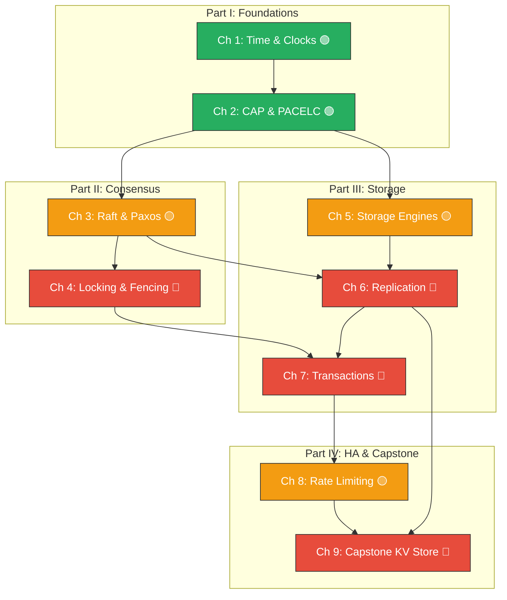

# Hardcore Distributed Systems: Designing for Failure at Hyper-Scale

## Speaker Intro

- **Principal Distributed Systems Architect** with 18+ years designing stateful, globally replicated infrastructure at hyper-scale cloud providers, CDNs, and financial-exchange platforms.
- Led the design of a multi-region consensus layer serving 11 million linearizable writes/second across five continents with p99 latency under 9 ms.
- Built storage engines, replication pipelines, and coordination services in C++, Go, Java, and Rust—from bare-metal kernel-bypass networking to managed Kubernetes clusters.
- Authored internal training curricula on consensus protocols, failure injection, and distributed transaction design at two Fortune 50 companies.
- Believes that **every distributed system is a study in partial failure**, and that the only honest engineering posture is **paranoid correctness**: assume the network will partition, the disk will corrupt, and the clock will lie—then prove your design survives anyway.

> **This is the guide I wish someone had handed me before my first 3 AM pager storm caused by a split-brain incident.** It covers the exact mental models, algorithms, and trade-offs that separate a service that "works on my laptop" from one that survives arbitrary failure at planetary scale.

---

## Who This Is For

This book is designed for:

- **Senior and Staff engineers** building stateful services (databases, caches, queues, coordination layers) who need to reason precisely about consistency, availability, and partition tolerance.
- **Engineers preparing for L7+ (Staff/Principal) System Design interviews** at companies where "design a distributed key-value store" is the warm-up question.
- **Backend developers** who have hit the limits of single-node PostgreSQL and need to understand sharding, replication, and consensus before choosing a distributed database.
- **SREs and platform engineers** who debug split-brain incidents, replication lag alerts, and clock-skew anomalies in production and want first-principles understanding of *why* these failures happen.

If you have ever written `SELECT ... FOR UPDATE` and wondered what happens when two datacenters disagree about who holds the lock—this book is for you.

---

## Prerequisites

| Concept | Where to learn it |
|---|---|
| Ownership, borrowing, lifetimes | [Rust Memory Management](../memory-management-book/src/SUMMARY.md) |
| Async Rust with Tokio | [Async Rust](../async-book/src/SUMMARY.md) |
| Basic networking (TCP, HTTP, DNS) | Any computer networking course or *Computer Networking: A Top-Down Approach* |
| Relational databases (SQL, indexes, transactions) | Any database fundamentals course or *Database Internals* by Alex Petrov |
| Threading and concurrency primitives | [Concurrency in Rust](../concurrency-book/src/SUMMARY.md) |
| Data structures (hash maps, trees, linked lists) | Any algorithms & data structures course |

---

## How to Use This Book

| Emoji | Meaning in this book |
|-------|------|
| 🟢 | **Staff Foundational** — Core mental models every distributed systems engineer must internalize. |
| 🟡 | **Principal Applied** — Protocol internals and design patterns used in production systems. |
| 🔴 | **Architect Internals** — Deep implementation details, correctness proofs, and capstone design. |

Every chapter follows a consistent structure:

1. **"What you'll learn"** — a concise list of outcomes.
2. **Core content** — with comparison tables, mermaid diagrams, and annotated pseudocode.
3. **"The Naive Monolith Way vs. The Distributed Fault-Tolerant Way"** — broken designs shown first (`// 💥 SPLIT-BRAIN HAZARD`), then the fix (`// ✅ FIX`).
4. **Exercise** — a system design challenge with a hidden architectural solution.
5. **Key Takeaways** — the non-negotiable lessons.
6. **See also** — cross-references to related material.

---

## Pacing Guide

| Part | Chapters | Estimated Time | Key Outcome |
|------|----------|---------------|-------------|
| **I — Fallacies & Foundations** | 1–2 | 5–7 hours | You understand why clocks lie, why CAP is insufficient, and how PACELC frames real trade-offs. |
| **II — Consensus & Coordination** | 3–4 | 8–10 hours | You can trace a Raft leader election step-by-step and explain why Redlock is unsafe for strict mutual exclusion. |
| **III — Database Internals & Storage** | 5–7 | 10–14 hours | You understand B-Tree vs LSM-Tree trade-offs, can design a replication topology, and can reason about isolation levels and MVCC. |
| **IV — HA Patterns & Capstone** | 8–9 | 8–12 hours | You can design a globally distributed key-value store from scratch, defending every decision under adversarial questioning. |

**Total: ~35–45 hours** for a senior engineer working through every exercise and building the capstone.

---

## Table of Contents

### Part I — The Fallacies and Foundations

| # | Chapter | Difficulty | Description |
|---|---------|-----------|-------------|
| 1 | [Time, Clocks, and Ordering](ch01-time-clocks-and-ordering.md) | 🟢 | Why NTP lies. Physical clock drift. Lamport timestamps and vector clocks for causal ordering. Google TrueTime and strict serializability via bounded uncertainty. |
| 2 | [CAP Theorem and PACELC](ch02-cap-theorem-and-pacelc.md) | 🟢 | Moving beyond "pick two." The CAP theorem's actual proof and its limits. PACELC: under normal operation, do you trade latency for consistency? Real-world system classification. |

### Part II — Consensus and Coordination

| # | Chapter | Difficulty | Description |
|---|---------|-----------|-------------|
| 3 | [Raft and Paxos Internals](ch03-raft-and-paxos-internals.md) | 🟡 | How distributed nodes agree on a single value. Raft leader election, log replication, and the safety proof. Paxos prepare/accept phases. Multi-Paxos optimization. Handling network partitions. |
| 4 | [Distributed Locking and Fencing](ch04-distributed-locking-and-fencing.md) | 🔴 | Why naive distributed locks cause data corruption. Martin Kleppmann's critique of Redlock. Lease-based locking with etcd/ZooKeeper. Fencing tokens to prevent zombie writes. |

### Part III — Database Internals and Storage

| # | Chapter | Difficulty | Description |
|---|---------|-----------|-------------|
| 5 | [Storage Engines: B-Trees vs LSM-Trees](ch05-storage-engines.md) | 🟡 | How databases persist data to disk. Write-Ahead Logs. B-Tree page splits and their read optimization. LSM-Trees, SSTables, and compaction strategies. RocksDB, LevelDB, Cassandra internals. |
| 6 | [Replication and Partitioning](ch06-replication-and-partitioning.md) | 🔴 | Single-leader, multi-leader, and leaderless (Dynamo-style) replication. Write conflict resolution: LWW vs CRDTs. Consistent hashing for data distribution. Virtual nodes and rebalancing. |
| 7 | [Transactions and Isolation Levels](ch07-transactions-and-isolation-levels.md) | 🔴 | ACID under the microscope. Dirty reads, non-repeatable reads, phantom reads. Snapshot Isolation and MVCC internals. Distributed transactions: Two-Phase Commit (2PC) vs the Saga pattern. Serializable Snapshot Isolation (SSI). |

### Part IV — High-Availability Patterns and Capstone

| # | Chapter | Difficulty | Description |
|---|---------|-----------|-------------|
| 8 | [Rate Limiting, Load Balancing, and Backpressure](ch08-rate-limiting-load-balancing-backpressure.md) | 🟡 | Protecting systems from thundering herds. Token Bucket vs Leaky Bucket. Consistent hashing for load distribution. Circuit breakers, bulkheads, and exponential backoff with jitter. |
| 9 | [Capstone: Design a Global Key-Value Store](ch09-capstone-global-kv-store.md) | 🔴 | Full System Design interview simulation. Consistent hashing ring, leaderless quorum replication (W+R>N), hinted handoff, Merkle tree anti-entropy, vector clock conflict resolution, and capacity planning. |

### Appendices

| # | Chapter | Description |
|---|---------|-------------|
| A | [Distributed Systems Reference Card](appendix-a-reference-card.md) | Cheat sheet: isolation levels, CAP/PACELC classification, latency numbers every programmer should know, consistency models hierarchy. |

---

---

## Companion Guides

This book focuses on distributed systems theory and architecture. For related Rust-specific topics, see:

- [**Async Rust**](../async-book/src/SUMMARY.md) — Tokio runtime, futures, streams, and cancellation safety.
- [**Concurrency in Rust**](../concurrency-book/src/SUMMARY.md) — Threads, atomics, locks, and `Send`/`Sync`.
- [**Tokio Internals**](../tokio-internals-book/src/SUMMARY.md) — mio, epoll, work-stealing scheduler, timer wheels.
- [**Zero-Copy Architecture**](../zero-copy-book/src/SUMMARY.md) — io_uring, rkyv, thread-per-core, shared-nothing I/O.
- [**Enterprise Rust**](../enterprise-rust-book/src/SUMMARY.md) — OpenTelemetry, security hardening, supply chain integrity.
- [**Rust Error Handling Mastery**](../error-handling-book/src/SUMMARY.md) — Result/Try internals, error propagation, panic hooks.
