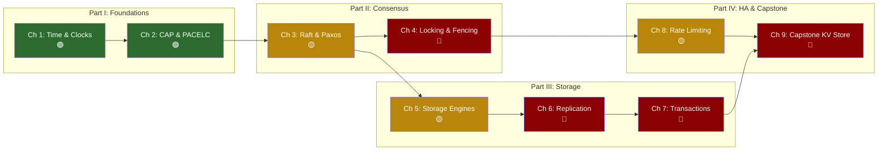

# Hardcore Distributed Systems: Designing for Failure at Hyper-Scale# Hardcore Distributed Systems: Designing for Failure at Hyper-Scale


> — Leslie Lamport> *"A distributed system is one in which the failure of a computer you didn't even know existed can render your own computer unusable."*---- [**Rust Microservices**](../microservices-book/src/SUMMARY.md) — Axum, Tonic, Tower, SQLx — the frameworks for building the networked services this book designs- [**Enterprise Rust**](../enterprise-rust-book/src/SUMMARY.md) — OpenTelemetry, security, supply chain hygiene — the observability and operational practices for running distributed systems in production- [**Rust Architecture & Design Patterns**](../architecture-book/src/SUMMARY.md) — Typestate, Actors, ECS, Hexagonal Architecture — patterns for structuring the services that participate in distributed protocols- [**Concurrency in Rust**](../concurrency-book/src/SUMMARY.md) — OS threads, atomics, lock-free data structures — the concurrency primitives underneath every node in a distributed system- [**Async Rust**](../async-book/src/SUMMARY.md) — Tokio, futures, and cancellation safety — the runtime you'll use to *implement* distributed protocolsThis book is a standalone deep-dive into distributed systems theory and architecture. It pairs well with these other books in the series:## Companion Guides```    style I fill:#8b0000,color:#fff    style H fill:#b8860b,color:#fff    style G fill:#8b0000,color:#fff    style F fill:#8b0000,color:#fff    style E fill:#b8860b,color:#fff    style D fill:#8b0000,color:#fff    style C fill:#b8860b,color:#fff    style B fill:#2d6a2d,color:#fff    style A fill:#2d6a2d,color:#fff    A --> B --> C --> D --> E --> F --> G --> H --> I    end        I["Ch 9: Capstone<br/>KV Store 🔴"]        H["Ch 8: Rate Limiting &<br/>Backpressure 🟡"]    subgraph "Part IV: HA & Capstone"    end        G["Ch 7: Transactions &<br/>Isolation 🔴"]        F["Ch 6: Replication &<br/>Partitioning 🔴"]        E["Ch 5: Storage<br/>Engines 🟡"]    subgraph "Part III: Storage"    end        D["Ch 4: Locks &<br/>Fencing 🔴"]        C["Ch 3: Raft &<br/>Paxos 🟡"]    subgraph "Part II: Consensus"    end        B["Ch 2: CAP &<br/>PACELC 🟢"]        A["Ch 1: Time &<br/>Clocks 🟢"]    subgraph "Part I: Foundations"graph LR```mermaid## Book Flow- [Summary and Reference Card](appendix-a-reference-card.md) — Cheat sheets for isolation levels, CAP/PACELC, latency numbers, and consensus algorithms### Appendices- [9. Capstone Project: Design a Global Key-Value Store 🔴](ch09-capstone-global-key-value-store.md) — A complete end-to-end system design: consistent hashing, quorum replication, hinted handoff, Merkle trees, and vector clocks- [8. Rate Limiting, Load Balancing, and Backpressure 🟡](ch08-rate-limiting-load-balancing-backpressure.md) — Protecting systems from thundering herds with token buckets, circuit breakers, and exponential backoff with jitter### Part IV: High-Availability Patterns and Capstone- [7. Transactions and Isolation Levels 🔴](ch07-transactions-and-isolation-levels.md) — The reality of ACID, MVCC internals, and distributed transactions with Sagas and Two-Phase Commit- [6. Replication and Partitioning 🔴](ch06-replication-and-partitioning.md) — Leader-based vs leaderless topologies, conflict resolution with CRDTs, and consistent hashing for data distribution- [5. Storage Engines: B-Trees vs LSM-Trees 🟡](ch05-storage-engines.md) — How databases write to disk, the Write-Ahead Log, and why read-optimized and write-optimized engines make fundamentally different trade-offs### Part III: Database Internals and Storage- [4. Distributed Locking and Fencing 🔴](ch04-distributed-locking-and-fencing.md) — Why naive distributed locks are broken, and how fencing tokens prevent zombie processes from corrupting state- [3. Raft and Paxos Internals 🟡](ch03-raft-and-paxos-internals.md) — How distributed nodes agree on a single value, leader election, log replication, and split-brain prevention### Part II: Consensus and Coordination- [2. CAP Theorem and PACELC 🟢](ch02-cap-theorem-and-pacelc.md) — The real constraints on distributed system design, and the latency-consistency trade-off most engineers overlook- [1. Time, Clocks, and Ordering 🟢](ch01-time-clocks-and-ordering.md) — Why physical clocks lie, how logical clocks establish causality, and how Google TrueTime enables strict serializability### Part I: The Fallacies and Foundations## Table of Contents4. Note any failure modes you missed — these are your growth areas3. Click to reveal the solution and compare your trade-off analysis2. Identify which failure modes apply (network partition? clock skew? coordinator crash?)1. Read the prompt and sketch your approach on paper or a whiteboardEvery content chapter has an inline exercise styled as a system design challenge. The exercises are cumulative — the capstone (Chapter 9) synthesizes techniques from every preceding chapter. Treat each exercise as a 45-minute design session:## Working Through Exercises**Total estimated time: 26–37 hours** across 2–4 weeks.| Appendix | Reference card | — | Quick-reference during interviews or design reviews || 9 | Capstone: Global KV store | 4–6 hours | Can whiteboard a Dynamo-style system end-to-end || 8 | Rate limiting & backpressure | 3–4 hours | Can design a distributed rate limiter || 5–7 | Storage engines, replication, transactions | 8–12 hours | Can compare B-Tree vs LSM-Tree; design a replication topology; explain MVCC || 3–4 | Consensus & distributed locks | 6–8 hours | Can trace a Raft election; explain fencing tokens || 1–2 | Time, ordering, CAP/PACELC | 4–6 hours | Can explain why NTP is insufficient; classify systems on CAP/PACELC || 0 | Introduction & orientation | 30 min | Understand the failure-first mindset ||----------|-------|----------------|------------|| Chapters | Topic | Suggested Time | Checkpoint |## Pacing Guide- **Cross-references** to related chapters- **Key Takeaways** summarizing core ideas- An **inline exercise** with hidden solution (click to expand)- Failure annotations: `// 💥 SPLIT-BRAIN HAZARD:` and `// ✅ FIX:` markers- **"The Naive Monolith Way" vs "The Distributed Fault-Tolerant Way"** architecture comparisons- **Mermaid diagrams** for protocol flows, topologies, and data structures- A **"What you'll learn"** block at the topEach chapter includes:| 🔴 | **Architect Internals** — deep internals, edge cases, and design trade-offs at the bleeding edge || 🟡 | **Principal Applied** — algorithms and protocols you'll implement or evaluate in production || 🟢 | **Staff Foundational** — core theory every distributed systems engineer must know cold ||--------|---------|| Symbol | Meaning |**Read linearly the first time.** Each chapter builds on concepts introduced earlier. Part I establishes the foundational impossibility results that constrain every design in Parts II–IV.## How to Use This BookThis book uses **pseudocode with Rust-flavored syntax** for algorithms and **architecture diagrams** (Mermaid) for system topologies. You do not need to be a Rust expert, but you should be able to read function signatures and follow control flow.| Comfort reading pseudocode or Rust-like syntax | [The Rust Programming Language](https://doc.rust-lang.org/book/) Ch. 1–6 || Concurrency primitives (threads, mutexes, channels) | [Concurrency in Rust](../concurrency-book/src/SUMMARY.md) || Relational databases (SQL, indexes, transactions) | *Designing Data-Intensive Applications* Ch. 1–2 || Basic networking (TCP, HTTP, DNS) | Any networking fundamentals course ||---------|----------------|| Concept | Where to Learn |## Prerequisites- **Anyone who has been burned by a distributed systems bug** — a cache that served stale data for hours, a distributed lock that didn't actually lock, a "exactly-once" guarantee that turned out to be "at-least-twice"- **Infrastructure and platform engineers** — you operate Kafka, etcd, CockroachDB, or DynamoDB and want to understand the algorithms underneath so you can reason about failure modes instead of guessing- **Backend engineers scaling a monolith into distributed services** — you're hitting the walls of a single-node database and need to understand partitioning, replication, and the consistency trade-offs that come with them- **Senior engineers preparing for Staff/Principal-level (L7+) System Design interviews** — you need to go beyond "just use a load balancer" and articulate *why* quorum writes prevent stale reads, *how* Raft leader election converges, and *what* happens to your Saga when the coordinator crashes## Who This Is ForWe will not hand-wave. Every claim is backed by the algorithm, the protocol diagram, or the failure mode that proves it necessary.**The central thesis is simple: everything fails.** Networks partition. Disks corrupt silently. Clocks drift. Processes pause for garbage collection at the worst possible moment. Your job as a distributed systems engineer is not to prevent failure — it is to *design for it* so that the system delivers correct results despite partial failure.This book is a masterclass in the theory and practice of distributed systems engineering. It takes you from the fundamental impossibility results (why clocks lie, why networks partition, why consistency has a price) through the internal mechanics of consensus algorithms, storage engines, and replication protocols, to the high-availability patterns that keep planet-scale systems running.---- **First-principles thinker** — believes you cannot operate a system you do not understand at the wire-protocol level; every abstraction leaks, and the leaks will find you in production- **Battle-scarred veteran of production incidents** — has debugged split-brain clusters at 3 AM, traced phantom reads across sharded databases, and watched carefully engineered systems fail in ways no whiteboard session predicted- **Principal Infrastructure Architect** — 15+ years building and operating distributed storage, consensus, and coordination systems at hyper-scale (hundreds of thousands of nodes, petabytes of state, millions of requests per second)## Speaker Intro
## Speaker Intro

- **Principal Infrastructure Architect** — 15+ years building and operating planet-scale stateful systems: consensus clusters, globally-replicated databases, and low-latency trading platforms
- **Production war stories** — survived split-brain incidents at 3 AM, debugged clock skew that silently corrupted financial ledgers, and redesigned replication topologies under regulatory deadline pressure
- **Philosophy** — *"If you haven't designed for the failure, you've designed the failure."* Every diagram in this book was born from a postmortem

---

This book is the guide I wish I had when I graduated from building single-node monoliths to operating stateful, distributed infrastructure across dozens of regions and thousands of nodes. It strips away hand-wavy abstractions and teaches you what actually happens on the wire, on disk, and inside the consensus state machine — from first principles.

We will break things deliberately, reason about why they break, and then build them back with correctness guarantees. By the end, you will be able to whiteboard a complete distributed key-value store — the kind of design that earns a "strong hire" at L7+ system design interviews — and, more importantly, actually build one that survives production.

## Who This Is For

- **Senior engineers preparing for Staff+ / L7+ system design interviews** — you need to go beyond "use a load balancer" and reason about quorum semantics, isolation anomalies, and clock drift
- **Backend engineers scaling stateful systems** — your monolith hit the ceiling and you're adding replication, sharding, or consensus for the first time
- **Infrastructure and platform engineers** — you operate etcd, ZooKeeper, Kafka, or CockroachDB and want to understand *why* they behave the way they do under partition
- **Architects evaluating trade-offs** — "should we go CP or AP?" is the wrong question; this book teaches you the right one

## Prerequisites

| Concept | Where to Learn |
|---------|----------------|
| Basic networking (TCP, DNS, HTTP) | Any networking fundamentals course |
| Relational databases (SQL, indexes, transactions) | PostgreSQL documentation or a database intro course |
| Threading and concurrency primitives | [Concurrency in Rust](../concurrency-book/src/SUMMARY.md) or equivalent |
| Comfortable reading pseudocode / Rust-flavored snippets | [The Rust Programming Language](https://doc.rust-lang.org/book/) Ch 1–10 |

## How to Use This Book

**Read Parts I and II linearly.** They establish the vocabulary — clocks, CAP, consensus — that every subsequent chapter assumes. Parts III and IV can be read in any order, but the Capstone (Chapter 9) synthesizes everything.

| Symbol | Meaning |
|--------|---------|
| 🟢 | **Staff Foundational** — core distributed systems vocabulary everyone must know |
| 🟡 | **Principal Applied** — protocol internals and design patterns for system designers |
| 🔴 | **Architect Internals** — deep implementation details, correctness proofs, production war stories |

Each chapter includes:

- A **"What you'll learn"** block at the top
- **Mermaid diagrams** for protocol flows, topologies, and data structures
- **"The Naive Monolith Way" vs "The Distributed Fault-Tolerant Way"** architecture comparisons
- Failure annotations: `// 💥 SPLIT-BRAIN HAZARD:` and `// ✅ FIX:` patterns
- An **inline exercise** with a hidden solution
- **Key Takeaways** summarizing the chapter
- **Cross-references** to related chapters and companion books

## Pacing Guide

| Chapters | Topic | Suggested Time | Checkpoint |
|----------|-------|----------------|------------|
| 0 | Introduction & orientation | 30 min | Understand the threat model |
| 1–2 | Time, CAP, PACELC | 3–4 hours | Can explain why NTP is insufficient and classify systems on PACELC |
| 3–4 | Consensus & Coordination | 4–6 hours | Can trace a Raft election and explain fencing tokens |
| 5–7 | Storage, Replication, Transactions | 6–8 hours | Can compare B-Tree vs LSM, design a replication topology, reason about isolation anomalies |
| 8 | HA Patterns | 2–3 hours | Can design a distributed rate limiter with backpressure |
| 9 | Capstone | 3–4 hours | Can whiteboard a complete Dynamo-style KV store |
| Appendix | Reference Card | Reference | Quick-lookup cheat sheet |

**Total estimated time: 19–26 hours**

## Working Through Exercises

Every content chapter ends with a system design exercise inside a collapsible block. Try to sketch the architecture on paper (or a whiteboard) *before* expanding the solution. The exercises are designed to be interview-realistic — 35–45 minutes each.

## Table of Contents

### Part I: The Fallacies and Foundations

- [1. Time, Clocks, and Ordering 🟢](ch01-time-clocks-and-ordering.md) — Why you cannot trust `System.currentTimeMillis()`. Physical clocks, Lamport timestamps, vector clocks, and Google TrueTime.
- [2. CAP Theorem and PACELC 🟢](ch02-cap-theorem-and-pacelc.md) — Moving beyond the CAP bumper sticker. The PACELC framework for reasoning about latency-consistency trade-offs during normal operation.

### Part II: Consensus and Coordination

- [3. Raft and Paxos Internals 🟡](ch03-raft-and-paxos-internals.md) — How distributed nodes agree on a single value. Leader election, log replication, and safety under network partitions.
- [4. Distributed Locking and Fencing 🔴](ch04-distributed-locking-and-fencing.md) — Why Redlock is dangerous for strict correctness. Lease-based locks, fencing tokens, and zombie process prevention.

### Part III: Database Internals and Storage

- [5. Storage Engines: B-Trees vs LSM-Trees 🟡](ch05-storage-engines.md) — How databases actually write to disk. WAL, B-Tree page splits, LSM compaction strategies, and the read-write-space amplification trade-off.
- [6. Replication and Partitioning 🔴](ch06-replication-and-partitioning.md) — Single-leader, multi-leader, and leaderless topologies. Consistent hashing, conflict resolution with CRDTs and vector clocks.
- [7. Transactions and Isolation Levels 🔴](ch07-transactions-and-isolation-levels.md) — The reality of ACID. Dirty reads, phantom reads, MVCC internals, and distributed transactions with Sagas vs 2PC.

### Part IV: High-Availability Patterns and Capstone

- [8. Rate Limiting, Load Balancing, and Backpressure 🟡](ch08-rate-limiting-load-balancing-backpressure.md) — Protecting the system from thundering herds. Token bucket, leaky bucket, load shedding, and exponential backoff with jitter.
- [9. Capstone Project: Design a Global Key-Value Store 🔴](ch09-capstone-global-key-value-store.md) — A complete system design exercise building an Amazon Dynamo-style store from first principles.

### Appendices

- [Summary and Reference Card](appendix-a-reference-card.md) — Cheat sheets for isolation levels, CAP/PACELC, latency numbers, and consensus algorithm comparison.



## Companion Guides

This book is a deep-dive companion to several other books in the Rust Training series:

- [**Async Rust: From Futures to Production**](../async-book/src/SUMMARY.md) — The runtime mechanics (Tokio, epoll, wakers) that underpin the network I/O in every distributed system
- [**Concurrency in Rust**](../concurrency-book/src/SUMMARY.md) — Threads, atomics, and lock-free data structures — the single-node concurrency primitives that consensus implementations are built on
- [**Rust Architecture & Design Patterns**](../architecture-book/src/SUMMARY.md) — Hexagonal architecture, actor model, and ECS patterns used in large-scale system design
- [**Enterprise Rust: OpenTelemetry, Security, and Supply Chain Hygiene**](../enterprise-rust-book/src/SUMMARY.md) — Observability, distributed tracing, and security hardening for production distributed systems
- [**Rust Microservices: Axum, Tonic, Tower, and SQLx**](../microservices-book/src/SUMMARY.md) — The practical Rust frameworks for building the services described in this book

---

> *"A distributed system is one in which the failure of a computer you didn't even know existed can render your own computer unusable."* — Leslie Lamport
