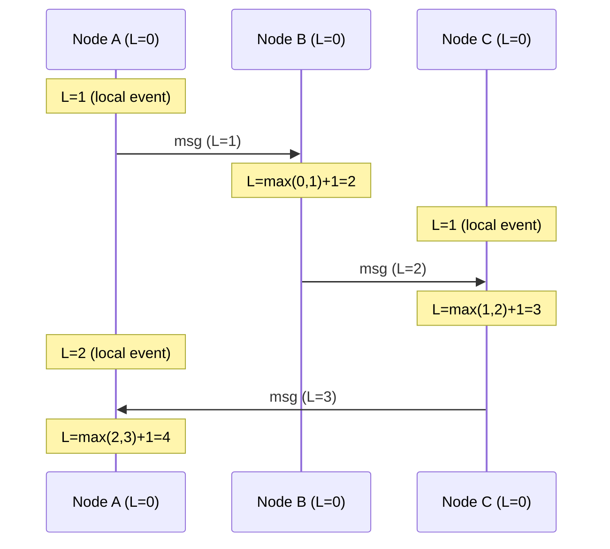
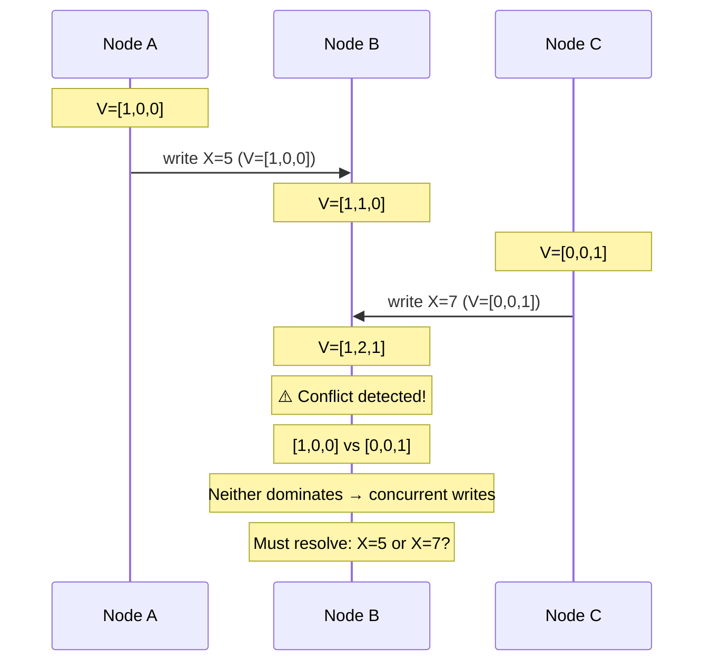

# 1. Time, Clocks, and Ordering 🟢

> **What you'll learn:**
> - Why physical clocks (NTP, system time) are fundamentally unreliable in distributed systems and the specific failure modes that make them dangerous.
> - How Lamport timestamps establish a *happened-before* partial order without any clock synchronization.
> - How vector clocks detect concurrent events that Lamport timestamps cannot distinguish.
> - How Google's TrueTime uses GPS and atomic clocks to achieve strict serializability with bounded uncertainty.

**Cross-references:** This chapter is the foundation for all subsequent chapters. Understanding causal ordering is prerequisite for consensus (Ch. 3), replication conflict resolution (Ch. 6), and MVCC transaction isolation (Ch. 7).

---

## Why You Cannot Trust Your Clock

Every programmer's first instinct when ordering events is to use wall-clock time: `SystemTime::now()`, `System.currentTimeMillis()`, `time.time()`. This works on a single machine. It is **catastrophically wrong** in a distributed system.

### Physical Clock Failure Modes

| Failure Mode | Cause | Impact | Real Incident |
|---|---|---|---|
| **Clock drift** | Quartz oscillators drift 10–200 ppm (0.86–17.28 seconds/day) | Events ordered incorrectly across nodes | Cassandra LWW data loss when node clocks diverged by 3 seconds |
| **NTP step adjustment** | NTP daemon corrects large drift by jumping the clock forward or backward | Duplicate timestamps, negative durations, timers firing early/late | Cloudflare leap-second bug (2017) caused `time.Now()` to return negative durations, crashing DNS servers |
| **Clock skew across DCs** | WAN latency to NTP stratum-1 servers varies by datacenter | Node A thinks event happened before Node B's event; Node B disagrees | Amazon DynamoDB split-brain during NTP stratum-2 server outage |
| **Leap seconds** | UTC inserts a 61st second (23:59:60) | Software that assumes 60 seconds/minute crashes or loops | Linux kernel `hrtimer` panic on 2012 leap second took down Reddit, Mozilla, Yelp |
| **VM clock stall** | Hypervisor pauses guest VM for live migration or scheduling | After unpause, guest clock is minutes behind | Production Raft leader elections triggered by VM stall during AWS maintenance window |

### The Core Problem

```
Node A timestamp: 1711900000.123
Node B timestamp: 1711900000.119

Question: Did A's event happen after B's event?
Answer:   UNKNOWABLE. Node B's clock could be 50ms ahead of true time.
```

**You cannot establish a total order of events across machines using physical clocks alone.** This is not an engineering limitation—it is a consequence of special relativity and the finite speed of light. There is no "global now."

---

## Logical Clocks: Ordering Without Physics

Leslie Lamport's 1978 paper *"Time, Clocks, and the Ordering of Events in a Distributed System"* solved this by abandoning physical time entirely.

### The Happened-Before Relation (→)

Three rules define causal ordering:

1. **Process order:** If event `a` occurs before event `b` on the same process, then `a → b`.
2. **Message order:** If event `a` is the sending of a message and event `b` is the receipt of that message, then `a → b`.
3. **Transitivity:** If `a → b` and `b → c`, then `a → c`.

If neither `a → b` nor `b → a`, the events are **concurrent** (`a ‖ b`). They are causally independent—no information from one could have influenced the other.

### Lamport Timestamps

Each process maintains a single integer counter `L`:

```
On local event:           L = L + 1
On send(message):         L = L + 1; attach L to message
On receive(message, L'):  L = max(L, L') + 1
```



**Lamport's guarantee:** If `a → b`, then `L(a) < L(b)`.

**Lamport's limitation:** If `L(a) < L(b)`, you **cannot** conclude `a → b`. The events may be concurrent. Lamport timestamps give you a *consistent total order*, but they cannot detect concurrency.

### The Naive Monolith Way

```rust
use std::time::SystemTime;

/// 💥 SPLIT-BRAIN HAZARD: Using wall-clock time to order events across nodes.
/// If Node B's clock is 200ms ahead of Node A's clock, B's "earlier" events
/// will appear to happen "after" A's events. In a Last-Write-Wins register,
/// this silently drops the *actually* later write.
fn timestamp_event() -> u64 {
    SystemTime::now()
        .duration_since(SystemTime::UNIX_EPOCH)
        .unwrap()
        .as_millis() as u64
    // 💥 This timestamp is only meaningful on THIS machine.
    // Comparing it with timestamps from other machines is undefined behavior
    // at the distributed systems level.
}
```

### The Distributed Fault-Tolerant Way

```rust
use std::cmp;

/// A Lamport clock that provides causal ordering guarantees across nodes.
/// If event A causally precedes event B, then A's timestamp < B's timestamp.
struct LamportClock {
    counter: u64,
}

impl LamportClock {
    fn new() -> Self {
        Self { counter: 0 }
    }

    /// ✅ FIX: Increment on every local event. No wall-clock dependency.
    fn tick(&mut self) -> u64 {
        self.counter += 1;
        self.counter
    }

    /// ✅ FIX: On send, increment and attach the timestamp to the message.
    fn send_timestamp(&mut self) -> u64 {
        self.tick()
    }

    /// ✅ FIX: On receive, merge the remote timestamp with local state.
    /// This guarantees the receiver's clock is always ahead of the sender's
    /// at the time of sending — preserving happened-before ordering.
    fn receive(&mut self, remote_timestamp: u64) -> u64 {
        self.counter = cmp::max(self.counter, remote_timestamp) + 1;
        self.counter
    }
}
```

---

## Vector Clocks: Detecting Concurrency

Lamport timestamps cannot distinguish "event A happened before B" from "events A and B are concurrent." For conflict detection in distributed databases (Chapter 6), we need **vector clocks**.

### How Vector Clocks Work

Each process maintains a vector of counters—one slot per process in the system:

```
Node A's vector: [A:3, B:1, C:0]
Meaning: "A has seen 3 of its own events, knows about B's event 1,
          and has not heard from C."
```

**Rules:**

```
On local event at node i:       V[i] = V[i] + 1
On send(message) at node i:     V[i] = V[i] + 1; attach V to message
On receive(message, V') at i:   V[j] = max(V[j], V'[j]) for all j; V[i] = V[i] + 1
```

**Comparison rules:**

```
V(a) ≤ V(b)  iff  V(a)[i] ≤ V(b)[i]  for ALL i    →  a happened-before b (or same)
V(a) < V(b)  iff  V(a) ≤ V(b) AND V(a) ≠ V(b)     →  a strictly happened-before b
Otherwise: a ‖ b (concurrent — CONFLICT!)
```



### Vector Clock Conflict Detection in Rust

```rust
use std::collections::HashMap;

/// A vector clock for detecting concurrent events across distributed nodes.
/// Each entry tracks the latest known event count for a given node.
#[derive(Clone, Debug)]
struct VectorClock {
    entries: HashMap<String, u64>,
}

impl VectorClock {
    fn new() -> Self {
        Self { entries: HashMap::new() }
    }

    /// Increment this node's own counter (local event or send).
    fn increment(&mut self, node_id: &str) {
        let counter = self.entries.entry(node_id.to_string()).or_insert(0);
        *counter += 1;
    }

    /// Merge a remote vector clock into this one (on receive).
    /// Takes the element-wise maximum, then increments our own counter.
    fn merge(&mut self, other: &VectorClock, my_node_id: &str) {
        for (node, &count) in &other.entries {
            let local = self.entries.entry(node.clone()).or_insert(0);
            *local = (*local).max(count);
        }
        self.increment(my_node_id);
    }

    /// Determine the causal relationship between two vector clocks.
    fn compare(&self, other: &VectorClock) -> Ordering {
        let all_keys: std::collections::HashSet<&String> =
            self.entries.keys().chain(other.entries.keys()).collect();

        let mut self_le_other = true; // true if self ≤ other on all components
        let mut other_le_self = true; // true if other ≤ self on all components

        for key in all_keys {
            let s = self.entries.get(key).copied().unwrap_or(0);
            let o = other.entries.get(key).copied().unwrap_or(0);
            if s > o { self_le_other = false; }
            if o > s { other_le_self = false; }
        }

        match (self_le_other, other_le_self) {
            (true, true)   => Ordering::Equal,      // identical
            (true, false)  => Ordering::Before,      // self happened-before other
            (false, true)  => Ordering::After,       // other happened-before self
            (false, false) => Ordering::Concurrent,  // ⚠️ CONFLICT
        }
    }
}

#[derive(Debug, PartialEq)]
enum Ordering {
    Before,
    After,
    Equal,
    Concurrent, // Neither happened-before the other — conflict!
}
```

---

## Google TrueTime: Bounded Uncertainty

Google's Spanner database (2012) asked: what if we could make physical clocks *reliable enough*?

### The Insight

TrueTime does not return a single timestamp. It returns an **interval**: `TT.now() → [earliest, latest]`. The actual time is guaranteed to be within this interval.

```
TT.now() → TTinterval { earliest: t - ε, latest: t + ε }
```

Where `ε` is the clock uncertainty, typically 1–7 ms thanks to GPS receivers and atomic clocks in every datacenter.

### How Spanner Uses TrueTime for Strict Serializability

The **commit-wait** rule: after assigning a timestamp `s` to a transaction, Spanner waits until `TT.after(s)` is true—i.e., until the uncertainty interval has passed. This guarantees that no other transaction can be assigned a timestamp that overlaps.

```mermaid
gantt
    title Spanner Commit-Wait Protocol
    dateFormat X
    axisFormat %s

    section Transaction T1
    Acquire locks        :t1lock, 0, 2
    Assign ts=10         :t1ts, 2, 3
    Commit-wait (2ε)     :crit, t1wait, 3, 7
    Release locks        :t1rel, 7, 8

    section Transaction T2
    Acquire locks        :t2lock, 5, 7
    Assign ts=18         :t2ts, 7, 8
    Commit-wait (2ε)     :crit, t2wait, 8, 12
    Release locks        :t2rel, 12, 13

    section Guarantee
    T1 visible globally  :milestone, 7, 7
    T2 sees T1's writes  :milestone, 8, 8
```



### Comparison: Ordering Mechanisms

| Mechanism | Detects concurrency? | Requires sync? | Typical use | Overhead |
|---|---|---|---|---|
| **Wall clock (NTP)** | No | Yes (NTP) | Logging only | Low, but incorrect |
| **Lamport timestamp** | No | No | Total ordering, log sequence numbers | 1 integer per message |
| **Vector clock** | ✅ Yes | No | Conflict detection (Dynamo, Riak) | O(N) integers per message, N = node count |
| **TrueTime** | N/A (serializable) | Yes (GPS + atomic) | Google Spanner strict serializability | Commit-wait latency (1–7 ms) |
| **Hybrid Logical Clock (HLC)** | Partial | No (uses NTP as hint) | CockroachDB, YugabyteDB | 1 physical + 1 logical integer |

---

## Hybrid Logical Clocks (HLC): A Pragmatic Middle Ground

Not everyone has GPS receivers in their datacenters. CockroachDB, YugabyteDB, and other systems use **Hybrid Logical Clocks** (Kulkarni et al., 2014). An HLC is a pair `(physical, logical)`:

```
On local event or send:
    l' = max(local_physical_time, hlc.physical)
    if l' == hlc.physical:
        hlc.logical += 1
    else:
        hlc.physical = l'
        hlc.logical = 0

On receive(remote_hlc):
    l' = max(local_physical_time, hlc.physical, remote_hlc.physical)
    if l' == hlc.physical == remote_hlc.physical:
        hlc.logical = max(hlc.logical, remote_hlc.logical) + 1
    elif l' == hlc.physical:
        hlc.logical += 1
    elif l' == remote_hlc.physical:
        hlc.logical = remote_hlc.logical + 1
    else:
        hlc.logical = 0
    hlc.physical = l'
```

**Key property:** HLC timestamps are always ≥ the physical clock, are monotonically increasing, and maintain the happened-before property. They stay close to real time (bounded by NTP drift), giving you "near-real-time" ordering without GPS hardware.

---

<details>
<summary><strong>🏋️ Exercise: The Split-Brain Clock</strong> (click to expand)</summary>

### Scenario

You have three database replicas: A, B, C. They use Last-Write-Wins (LWW) with wall-clock timestamps for conflict resolution. At `T=100`:

1. Node A receives `SET key=1` and timestamps it `T_A=100`.
2. Node C receives `SET key=2` and timestamps it `T_C=103` (C's clock is 3 seconds ahead due to NTP drift).
3. Both writes replicate to Node B.

**Questions:**
1. Under LWW, which value does Node B keep?
2. Which value *should* B keep if C's clock is wrong?
3. Redesign this system using vector clocks. Show the vector clock state after both writes arrive at B. Can B detect that the writes are concurrent?
4. What resolution strategy would you use once B detects the conflict?

<details>
<summary>🔑 Solution</summary>

**1. Under LWW:** Node B keeps `key=2` because `T_C=103 > T_A=100`. The "later" timestamp wins.

**2. In reality:** Both writes were concurrent (neither causally depended on the other). There is no correct "last" write. LWW silently discards `key=1` based on a clock error—**this is data loss**.

**3. Vector clock analysis:**

```
Initial state: A=[0,0,0], B=[0,0,0], C=[0,0,0]

Node A: SET key=1 → A increments: VA=[1,0,0]
Node C: SET key=2 → C increments: VC=[0,0,1]

Both arrive at B:
  Compare VA=[1,0,0] and VC=[0,0,1]:
    VA[0]=1 > VC[0]=0  → VA is NOT ≤ VC
    VC[2]=1 > VA[2]=0  → VC is NOT ≤ VA
  Result: CONCURRENT ⚠️
```

Yes, B detects the conflict. Neither vector clock dominates the other.

**4. Resolution strategies:**

| Strategy | Approach | Trade-off |
|---|---|---|
| **Application-level merge** | Return both values to the client; let application logic merge (e.g., union of sets) | Most correct, but pushes complexity to the application |
| **Read-repair with quorum** | Return both conflicting values on read; client picks the winner and writes back | Requires client awareness of conflicts |
| **CRDT** | Use a conflict-free replicated data type (e.g., LWW-Register with causal context, G-Counter, OR-Set) | Automatic merge, but limits data model expressiveness |

The key insight: **vector clocks make conflicts visible**. LWW hides them behind a lie (the "later" clock value). Visible conflicts can be resolved correctly; hidden conflicts are permanent data loss.

</details>
</details>

---

> **Key Takeaways**
>
> 1. **Physical clocks are untrustworthy.** NTP drift, leap seconds, VM stalls, and step adjustments make wall-clock timestamps unreliable for ordering events across machines.
> 2. **Lamport timestamps** provide a consistent total order. If `a → b`, then `L(a) < L(b)`. But the converse is not true—they cannot detect concurrent events.
> 3. **Vector clocks** detect concurrency. If neither `V(a) ≤ V(b)` nor `V(b) ≤ V(a)`, the events are concurrent—a conflict that must be resolved.
> 4. **TrueTime** bounds clock uncertainty with GPS/atomic hardware, enabling strict serializability via commit-wait. Not available outside Google (but CockroachDB approximates with HLCs).
> 5. **Last-Write-Wins is silent data loss** whenever clocks disagree. Always prefer causal ordering or explicit conflict detection.

---

> **See also:**
> - [Chapter 2: CAP Theorem and PACELC](ch02-cap-theorem-and-pacelc.md) — how clock behavior intersects with consistency guarantees.
> - [Chapter 6: Replication and Partitioning](ch06-replication-and-partitioning.md) — vector clocks in Dynamo-style leaderless replication.
> - [Chapter 7: Transactions and Isolation Levels](ch07-transactions-and-isolation-levels.md) — MVCC uses timestamps for snapshot isolation.
