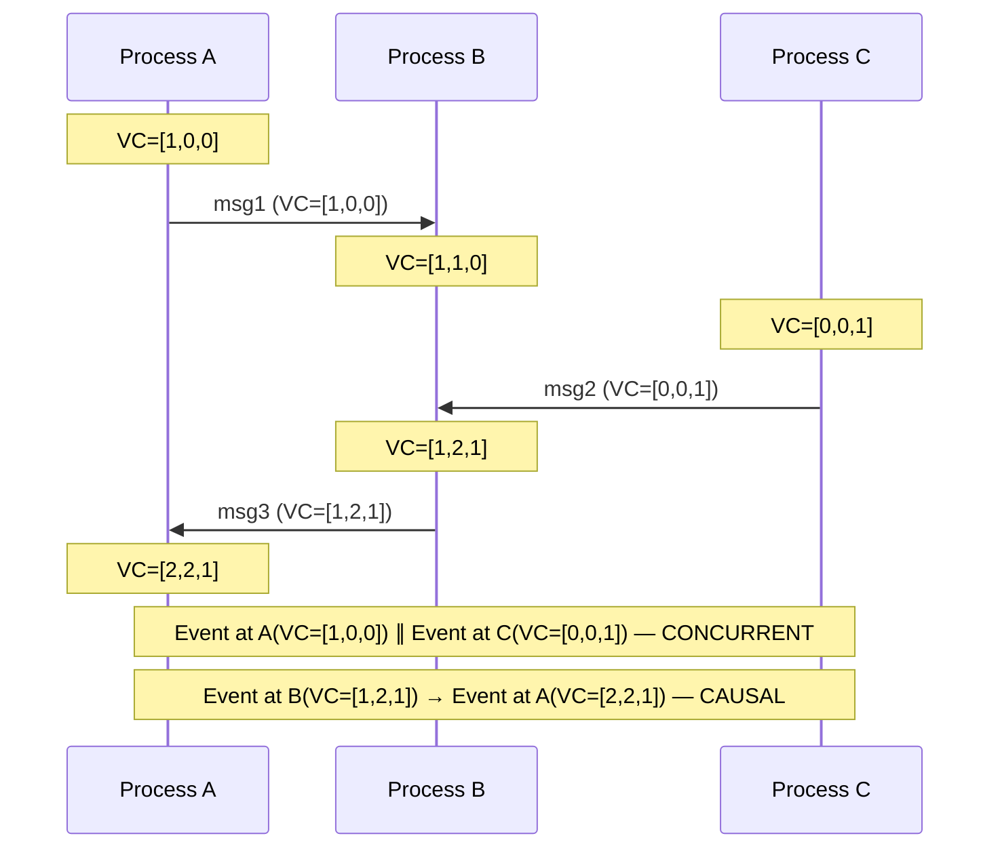

# 1. Time, Clocks, and Ordering 🟢

> **What you'll learn:**
> - Why physical clocks (NTP, system clocks) are fundamentally unreliable in distributed systems — and exactly how much they drift
> - How Lamport Timestamps establish a *happened-before* partial ordering without any clock synchronization
> - How Vector Clocks detect concurrent events that Lamport timestamps cannot distinguish
> - How Google's TrueTime uses GPS + atomic clocks to bound uncertainty and enable strict serializability

---

## The Lie Every Programmer Believes

Every programmer starts with the same assumption: *time is a global, monotonically increasing quantity that all computers agree on.* This assumption is so deeply baked into our mental models that most codebases are riddled with it:

```
// 💥 SPLIT-BRAIN HAZARD: System.currentTimeMillis() on two machines
// can disagree by hundreds of milliseconds — or even seconds after
// an NTP step correction. This "last-write-wins" check can silently
// discard the NEWER write.

if (incoming_write.timestamp > stored_record.timestamp) {
    stored_record = incoming_write;   // Which write is actually newer?
}
```

This is the **most common correctness bug in distributed systems**, and it is invisible in testing because your test machines share a single system clock.

## Physical Clocks: How Bad Is the Drift?

Every computer has a **quartz crystal oscillator** that ticks at a nominal frequency. These crystals drift:

| Clock Source | Typical Drift | Worst Case | Notes |
|-------------|---------------|------------|-------|
| Commodity quartz | ±10–20 ppm | ±200 ppm (temperature extremes) | 1 ppm ≈ 86 ms/day |
| NTP-synchronized | ±1–10 ms | ±100+ ms (network jitter, step corrections) | Depends on stratum and RTT |
| PTP (IEEE 1588) | ±1 µs | ±10 µs | Requires hardware timestamping NICs |
| GPS receiver | ±10–100 ns | ±1 µs | Requires antenna with sky view |
| Atomic clock (Cs/Rb) | ±1 ns/day | ±10 ns/day | $5,000–$50,000 per unit |

### NTP: Better Than Nothing, Worse Than You Think

NTP (Network Time Protocol) synchronizes clocks by exchanging packets with upstream servers. It estimates the offset as:

$$
\text{offset} = \frac{(t_2 - t_1) + (t_3 - t_4)}{2}
$$

where $t_1, t_4$ are client-side timestamps and $t_2, t_3$ are server-side timestamps. This formula **assumes symmetric network delay** — an assumption that is routinely violated by:

- Asymmetric routing (different paths for request vs response)
- Queuing delays at switches (traffic bursts affect one direction)
- Virtualization (hypervisor scheduling delays are not symmetric)

**Real-world NTP accuracy**: 1–10 ms on a well-configured LAN, 10–100 ms across the public internet. After an NTP step correction (when drift exceeds the slew threshold), the clock can **jump backward** — breaking any code that assumes monotonicity.

```
// 💥 SPLIT-BRAIN HAZARD: NTP step correction
let start = Instant::now();  // Actually using system clock underneath
// ... do work ...
let elapsed = Instant::now() - start;
// If NTP stepped the clock backward between these two calls,
// elapsed could be NEGATIVE (or wrapped to a huge positive value).

// ✅ FIX: Use a monotonic clock for measuring durations.
// In Rust, std::time::Instant is guaranteed monotonic.
// For wall-clock ordering across machines, you need logical clocks.
```

## Logical Clocks: Ordering Without Synchronization

Since physical clocks cannot be trusted, we need a different approach to establish ordering. Leslie Lamport's 1978 paper *"Time, Clocks, and the Ordering of Events in a Distributed System"* introduced the **happened-before** relation.

### The Happened-Before Relation (→)

For events $a$ and $b$:

1. If $a$ and $b$ are on the same process and $a$ occurs before $b$, then $a → b$
2. If $a$ is a message send and $b$ is the corresponding receive, then $a → b$
3. **Transitivity:** if $a → b$ and $b → c$, then $a → c$

If neither $a → b$ nor $b → a$, the events are **concurrent** ($a \| b$). This is not a bug — it is a fundamental property of distributed systems where information propagates at finite speed.

### Lamport Timestamps

Each process maintains a counter $C$:

```
// Lamport Clock Algorithm (pseudocode)
on_local_event():
    C = C + 1
    attach C to event

on_send(message):
    C = C + 1
    send(message, timestamp=C)

on_receive(message, sender_timestamp):
    C = max(C, sender_timestamp) + 1
    deliver message
```

**Property:** If $a → b$, then $L(a) < L(b)$. But the converse is **NOT** true — $L(a) < L(b)$ does NOT imply $a → b$. Lamport timestamps establish a **total order** consistent with causality, but they cannot distinguish causally related events from concurrent events.

| Guarantee | Lamport Timestamps |
|-----------|-------------------|
| If $a → b$ then $L(a) < L(b)$ | ✅ Yes |
| If $L(a) < L(b)$ then $a → b$ | ❌ No — could be concurrent |
| Detects concurrency ($a \| b$) | ❌ No |

### Vector Clocks: Detecting Concurrency

A **Vector Clock** is an array of $N$ counters (one per process in the system). Process $i$ maintains $VC[i]$:

```
// Vector Clock Algorithm (pseudocode, N processes)
on_local_event(process_i):
    VC[i] = VC[i] + 1

on_send(process_i, message):
    VC[i] = VC[i] + 1
    send(message, vector_clock=VC)

on_receive(process_i, message, sender_vc):
    for j in 0..N:
        VC[j] = max(VC[j], sender_vc[j])
    VC[i] = VC[i] + 1
    deliver message
```

**Comparison rules:**

- $VC_a ≤ VC_b$ iff $∀i: VC_a[i] ≤ VC_b[i]$
- $VC_a < VC_b$ (a happened-before b) iff $VC_a ≤ VC_b$ and $VC_a ≠ VC_b$
- $a \| b$ (concurrent) iff neither $VC_a < VC_b$ nor $VC_b < VC_a$



### The Cost of Vector Clocks

| Aspect | Lamport Timestamps | Vector Clocks |
|--------|-------------------|---------------|
| Space per event | $O(1)$ — single integer | $O(N)$ — one integer per process |
| Detects causality | Partial (one direction) | Complete (both directions) |
| Detects concurrency | ❌ No | ✅ Yes |
| Scalability | Excellent — fixed size | Poor — grows with number of processes |
| Used by | Raft log index, Kafka offsets | Amazon Dynamo, Riak |

**The scalability problem is real.** In a system with 1,000 nodes, every message carries a vector of 1,000 integers. Solutions include:
- **Dotted Version Vectors** — compress the vector by tracking only active nodes
- **Interval Tree Clocks** — dynamic processes without fixed node IDs
- **Hybrid Logical Clocks (HLCs)** — combine physical time with a logical component

## Google TrueTime: Bounded Uncertainty

Google's Spanner database takes a radically different approach. Instead of abandoning physical clocks entirely, it **bounds the uncertainty**:

Each TrueTime call returns an interval $[earliest, latest]$ instead of a single timestamp:

```
// TrueTime API (conceptual)
fn now() -> TimeInterval {
    TimeInterval {
        earliest: physical_clock - epsilon,
        latest:   physical_clock + epsilon,
    }
}
// epsilon is typically 1–7 ms, bounded by GPS + atomic clock synchronization
```

**The key insight:** if $TT.now().latest_A < TT.now().earliest_B$, then event A **definitely** happened before event B. Spanner enforces this by **waiting out the uncertainty** — a commit waits $2ε$ before reporting success, guaranteeing that any future transaction will see its writes.

| Clock System | Ordering Guarantee | Latency Cost | Infrastructure Cost |
|-------------|-------------------|-------------|-------------------|
| NTP | ~10 ms uncertainty, no guarantees | None | Minimal |
| Lamport Timestamps | Causal (one direction only) | None | Minimal |
| Vector Clocks | Full causal ordering + concurrency detection | None | $O(N)$ space per message |
| TrueTime | Real-time ordering with bounded uncertainty | Wait $2ε$ per commit (~14 ms) | GPS antennas + atomic clocks in every datacenter |

### How Spanner Uses TrueTime for Strict Serializability

```
// Spanner commit protocol (simplified pseudocode)
fn commit_transaction(writes):
    // 1. Acquire locks on all rows
    acquire_locks(writes)

    // 2. Get a commit timestamp
    let s = TrueTime::now().latest   // Pick the LATEST bound

    // 3. WAIT until we are sure the timestamp is in the past
    //    for ALL nodes in the system
    wait_until(TrueTime::now().earliest > s)
    //    This wait is called "commit-wait" and lasts at most 2*epsilon

    // 4. Apply writes and release locks
    apply(writes, timestamp=s)
    release_locks(writes)
    // Any transaction that starts AFTER this point is guaranteed
    // to see these writes, because its start timestamp > s
```

This is why Google famously said: *"We have the clocks. We have GPS with atomic clock fallback in every datacenter. So we can just use real time."* The rest of the industry, which does NOT have this infrastructure, must use logical clocks.

## The Naive Way vs The Distributed Way

| Aspect | The Naive Monolith Way | The Distributed Fault-Tolerant Way |
|--------|----------------------|-----------------------------------|
| Ordering | `System.currentTimeMillis()` | Vector Clocks or HLCs |
| "Which write is newer?" | Compare wall-clock timestamps | Compare vector clocks; detect and resolve conflicts for concurrent writes |
| Duration measurement | `end_time - start_time` | Monotonic clock (`Instant`) for durations; logical clocks for cross-node ordering |
| "Did A happen before B?" | "A has an earlier timestamp" (WRONG if clocks are skewed) | Compare vector clocks: if $VC_A < VC_B$ then yes; otherwise they may be concurrent |
| Conflict resolution | Last-Write-Wins using wall clock (silently drops writes) | Detect concurrent writes via vector clocks, present conflicts to application or use CRDTs |

---

<details>
<summary><strong>🏋️ Exercise: Design a Causal Message Ordering System</strong> (click to expand)</summary>

**Problem:** You are building a distributed chat application with 5 servers. Users send messages that are replicated to all servers. Design a system that guarantees **causal ordering** — if user A sees message M1 and then sends message M2, every server must deliver M1 before M2.

**Constraints:**
- Network delays between servers are variable (10–500 ms)
- Servers may temporarily lose connectivity to each other
- You cannot rely on synchronized physical clocks
- The system must continue accepting messages during network partitions

**Design your solution considering:**
1. What clock mechanism will you use?
2. How does a server decide when it is safe to deliver a message?
3. What happens when a server reconnects after a partition and has a backlog?
4. What is the worst-case delivery latency?

<details>
<summary>🔑 Solution</summary>

**Clock mechanism:** Vector Clocks (one component per server).

**Architecture:**

```
on_user_sends_message(server_i, text):
    VC[i] += 1
    msg = Message { text, vc: VC.clone(), origin: i }
    deliver_locally(msg)           // Deliver immediately on origin server
    broadcast(msg)                 // Replicate to all other servers

on_receive(server_j, msg):
    // Buffer the message until all causally preceding messages
    // have been delivered
    buffer.insert(msg)
    try_deliver_buffered()

fn try_deliver_buffered(server_j):
    loop:
        // Find a buffered message whose causal dependencies are satisfied
        deliverable = buffer.find(|msg|
            // msg is deliverable if:
            // 1. msg.vc[msg.origin] == delivered_vc[msg.origin] + 1
            //    (it's the NEXT message from that origin)
            // 2. For all k != msg.origin: msg.vc[k] <= delivered_vc[k]
            //    (we've already seen everything it has seen)
            msg.vc[msg.origin] == delivered_vc[msg.origin] + 1
            && for_all(k != msg.origin, msg.vc[k] <= delivered_vc[k])
        )
        match deliverable:
            Some(msg) =>
                deliver_locally(msg)
                delivered_vc[msg.origin] = msg.vc[msg.origin]
                // Merge the full vector clock
                for k in 0..N:
                    VC[k] = max(VC[k], msg.vc[k])
                buffer.remove(msg)
            None => break   // No more messages can be delivered yet
```

**Partition handling:** Messages buffered during a partition are delivered in causal order once connectivity restores. The buffer grows unboundedly during long partitions — implement a bounded buffer with backpressure and persistent spillover to disk.

**Worst-case delivery latency:** Unbounded (a message is blocked until all causal ancestors arrive). In practice, add a timeout and deliver with a "gap detected" warning, or use the CRDT approach where messages are always delivered but the UI sorts by vector clock.

**Trade-off:** This guarantees causal delivery but NOT total ordering — two concurrent messages may be delivered in different orders on different servers. If you need total ordering, you need a consensus algorithm (Chapter 3).

</details>
</details>

---

> **Key Takeaways:**
> - **Never use physical wall clocks for ordering events across machines.** NTP provides millisecond-scale accuracy at best, and clocks can jump backward during step corrections.
> - **Lamport timestamps are cheap** (O(1) per message) and guarantee that causally related events are ordered, but they *cannot detect concurrency*.
> - **Vector clocks detect concurrency** — essential for conflict detection in eventually consistent systems — but they grow as O(N) per message.
> - **Google TrueTime** bounds clock uncertainty using GPS + atomic clocks, enabling strict serializability at the cost of commit-wait latency and significant infrastructure investment.
> - **The right clock choice depends on your system's consistency requirements and infrastructure budget.** Most systems outside Google should use Hybrid Logical Clocks (HLCs) — a practical middle ground.

> **See also:** [Chapter 2: CAP Theorem and PACELC](ch02-cap-theorem-and-pacelc.md) — why the choice between consistency models directly affects which clock mechanism you need | [Chapter 6: Replication and Partitioning](ch06-replication-and-partitioning.md) — how Amazon Dynamo uses vector clocks for conflict detection in leaderless replication
