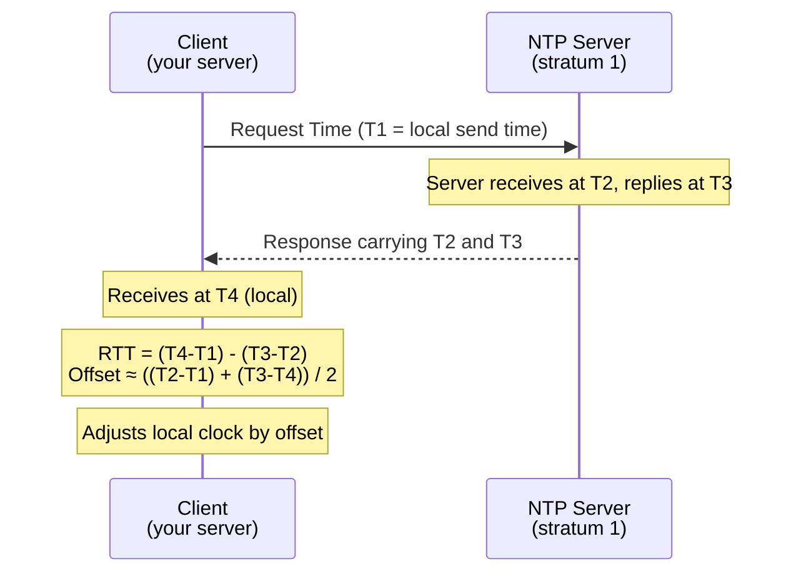
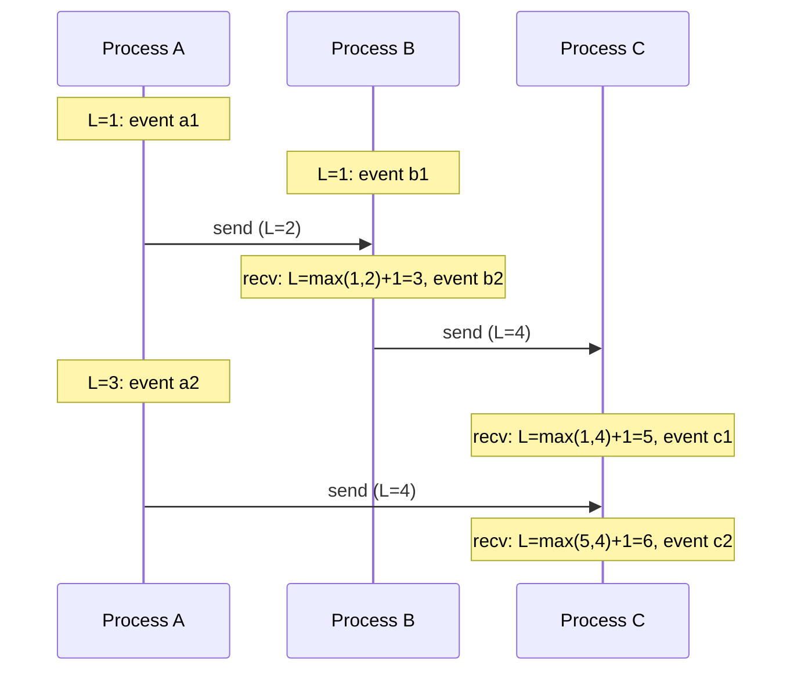
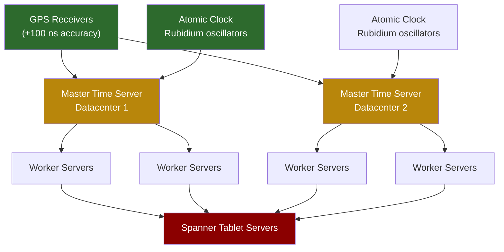

# 1. Time, Clocks, and Ordering 🟢

> **What you'll learn:**
> - Why physical clocks (including NTP) are fundamentally untrustworthy for distributed ordering
> - How Lamport timestamps provide a logical ordering without synchronized clocks
> - How Vector Clocks extend Lamport timestamps to detect *concurrent* events and causality
> - How Google TrueTime uses atomic clocks and GPS receivers to establish strict serializability with bounded uncertainty

---

## The Fundamental Problem: You Cannot Know "Now"

Here is a statement that should unsettle you: **two machines in the same datacenter cannot agree on what time it is.**

Not because we lack good clocks. Modern servers have crystal oscillators accurate to within a few microseconds per second under ideal conditions. The problem is deeper: every clock drifts, every clock is set by an imperfect protocol, and the act of reading a network-synchronized clock introduces at least one round-trip of latency that cannot be accounted for with certainty.

Consider this apparently innocent code:

```python
# 💥 SPLIT-BRAIN HAZARD: Using wall-clock time for event ordering
import time

def write_record(key, value):
    timestamp = time.time()     # What does "now" mean on Node A vs Node B?
    db.put(key, value, timestamp=timestamp)

# Two nodes write the same key simultaneously:
# Node A (clock says 10:00:00.100): write("user:42", "Alice")
# Node B (clock says 10:00:00.098): write("user:42", "Bob")
#
# Node B's clock is 2ms behind. "Bob" wins because it has the LOWER timestamp.
# But Node A wrote AFTER Node B — this is inverted causality.
```

This is **Last-Write-Wins (LWW) with wall-clock timestamps**, and it is one of the most common sources of silent data corruption in distributed systems. The write that happened last in real time can get a *smaller* timestamp if the writing node's clock is slightly behind — and the "older" value survives.

## Physical Clocks: Why NTP Isn't Enough

Network Time Protocol (NTP) is how most servers synchronize their clocks. It works by measuring round-trip time to a set of stratum-0 reference clocks (atomic clocks, GPS receivers) and adjusting the local clock accordingly.



The NTP estimation assumes symmetric round-trip times. In reality:

| Problem | Effect | Magnitude |
|---------|--------|-----------|
| Asymmetric network routes | NTP offset calculation wrong | 1–100 ms |
| Clock crystal frequency drift | Clocks diverge between syncs | 10–100 μs/s |
| NTP slewing (gradual adjustment) | Clock rate temporarily distorted | Variable |
| Leap seconds | Clock jumps or smears | ±1 second |
| VM clock steal | Hypervisor pauses inflate perceived time | Unbounded |
| Leap second bugs | Software crashes or hangs | Up to hours |

A well-configured datacenter NTP setup achieves **~1-10 ms accuracy**. Google's internal infrastructure with stratum-0 hardware achieves ~200 μs. But *accuracy* is not the same as *precision across nodes simultaneously* — you can have two nodes each within 1 ms of "true time" and still have their timestamps **2 ms apart** in opposite directions.

### The Quartz Crystal Problem

A typical server CPU uses a quartz crystal oscillator that resonates at approximately 32,768 Hz (or multiples thereof). The deviation from ideal frequency is called *clock skew* and is typically measured in **parts per million (ppm)**:

> A 50 ppm drift means the clock gains or loses 50 microseconds per second, or **4.32 seconds per day.**

Temperature changes, voltage fluctuations, aging, and manufacturing variation all contribute to drift. NTP continuously corrects for this, but between correction intervals (typically 64–1024 seconds), the clock is on its own.

**The bottom line:** Do not use `System.currentTimeMillis()`, `time.time()`, or any wall-clock timestamp as a distributed ordering mechanism. You'll get it wrong, it will be subtle, and you'll find out about it in a postmortem.

## Lamport Timestamps: Logical Ordering Without Synchronized Clocks

Leslie Lamport's 1978 paper "Time, Clocks, and the Ordering of Events in a Distributed System" introduced the concept of **logical time** — a counter that captures causal ordering without ever consulting a wall clock.

### Happens-Before Relation (→)

Lamport defined the **happens-before** relation `→`:

1. If events `a` and `b` are in the **same process** and `a` occurs before `b`, then `a → b`
2. If event `a` is the **sending of a message** and `b` is the **receipt of that message**, then `a → b`
3. **Transitivity:** If `a → b` and `b → c`, then `a → c`

If neither `a → b` nor `b → a`, events `a` and `b` are **concurrent** (written `a ∥ b`). Neither caused the other.

### The Lamport Clock Algorithm

Each process maintains a counter `L`:

```
On any local event:
    L = L + 1
    Attach L to the event

On sending a message:
    L = L + 1
    Send message with timestamp L

On receiving a message with timestamp T:
    L = max(L, T) + 1
```

### Worked Example



After this exchange:
- `a1(1) → a2(3) → ...` — strictly ordered within A
- `b1(1) → b2(3)` — because A's message caused b2
- `b2(3) → c1(5)` — causally linked
- `a1` vs `b1`: both have timestamp 1, but they're concurrent — Lamport timestamps **cannot distinguish concurrent events**

### The Critical Limitation

If `a → b`, then `L(a) < L(b)`. This is guaranteed. But the **converse is not true:**
- `L(a) < L(b)` does **not** mean `a → b`; they could be concurrent

Lamport timestamps give you a **total order consistent with causality** but cannot tell you which events are causally independent. For that, you need Vector Clocks.

## Vector Clocks: Detecting Causality and Concurrency

A Vector Clock is a vector of integers, one per process. Each process tracks not just its own logical time, but its *knowledge* of other processes' logical times.

### The Vector Clock Algorithm

Each process `Pi` maintains a vector `VC[1..N]` where `N` is the number of processes:

```
On any local event at Pi:
    VC[i] = VC[i] + 1

On sending a message from Pi:
    VC[i] = VC[i] + 1
    Attach current VC to message

On receiving a message at Pj with vector timestamp VT:
    VC[k] = max(VC[k], VT[k]) for all k
    VC[j] = VC[j] + 1
```

### Comparing Vector Clocks

Given `VC_a` and `VC_b`:
- `VC_a = VC_b` iff all components equal
- `VC_a ≤ VC_b` iff every component of `a` ≤ corresponding component of `b`
- `a → b` iff `VC_a ≤ VC_b` AND `VC_a ≠ VC_b` (a happened before b)
- `a ∥ b` (concurrent) iff neither `VC_a ≤ VC_b` nor `VC_b ≤ VC_a`

### Worked Example: Detecting a Conflict

```
Initial: A=[0,0,0], B=[0,0,0], C=[0,0,0]

A writes key "x":      A=[1,0,0]  → replicates to B and C
B writes key "x":      B=[0,1,0]  → B doesn't yet have A's write!
  (B's write is concurrent with A's)
C receives A's write:  C=[1,0,1]
C receives B's write:  C=[1,1,2]  → C detects CONFLICT because
                                     A=[1,0,0] ∥ B=[0,1,0]
```

This is exactly how **Amazon Dynamo** implements conflict detection. When a read returns multiple versions with incomparable vector clocks, the conflict is surfaced to the application for resolution (or auto-resolved with semantic merge logic).

### The Cost of Vector Clocks

| Property | Lamport Timestamp | Vector Clock |
|----------|------------------|--------------|
| Size | O(1) — single integer | O(N) — one counter per node |
| Detects causality | ✅ If `a→b`, then `L(a) < L(b)` | ✅ If `a→b`, then `VC(a) < VC(b)` |
| Detects concurrency | ❌ Cannot distinguish | ✅ Concurrent if incomparable |
| Overhead at 1000 nodes | 8 bytes | 8,000 bytes per message |

For large clusters, **Dotted Version Vectors** and **Interval Tree Clocks** provide more compact representations while preserving concurrent detection.

## Google TrueTime: Bounding Uncertainty

Google's Spanner database uses a radically different approach: instead of pretending clocks are synchronized, it **quantifies the uncertainty** and reasons about it explicitly.

### The TrueTime API

```
TT.now()    → returns TTinterval [earliest, latest]
TT.after(t) → returns true if t has definitely passed
TT.before(t)→ returns true if t has definitely not passed
```

`TT.now()` returns an interval `[t - ε, t + ε]` where `ε` is the current clock uncertainty (typically 1–7 ms), not a single timestamp. The true current time is guaranteed to be within this interval.



### Commit Wait: The Key Insight

Spanner achieves **external consistency** (strict serializability across the globe) using TrueTime through a protocol called **Commit Wait**:

```
transaction.commit():
    s = TT.now().latest          # Assign commit timestamp = upper bound of current interval
    wait until TT.after(s)       # Wait until we're SURE no future transaction can get s
    # By the time we return, all clocks in the world have advanced past s
    # Any subsequent transaction will start AFTER s — guaranteed
```

The maximum wait is `2ε` (twice the clock uncertainty). At Google's datacenter timescale, this is typically 1–14 ms — acceptable for external reads, invisible for the write hot path.

### Why This Achieves Serializability

Despite being spread across multiple datacenters with physically different clocks, Spanner guarantees that **if transaction T2 starts after T1 commits, then T2's commit timestamp is strictly greater than T1's**. This means the global commit history is a valid serial execution order — the holy grail of distributed transactions.

| System | Clock Mechanism | Uncertainty | Serializability |
|--------|----------------|-------------|-----------------|
| Generic datacenter | NTP | 1–10 ms | Not achievable |
| Google Spanner | TrueTime (GPS + atomic) | 1–7 ms + commit wait | ✅ External consistency |
| CockroachDB | HLC (Hybrid Logical Clocks) | ~0 (logical advancement) | ✅ Linearizability per range |
| Amazon DynamoDB | Vector clocks per item | N/A | Eventual only |

### Hybrid Logical Clocks (HLC): A Practical Middle Ground

TrueTime requires expensive GPS and atomic clock hardware. For most organizations, **Hybrid Logical Clocks** provide a practical compromise:

```
HLC = (physical_time, logical_counter)

On event:
    now = wall_clock()
    if now > HLC.physical:
        HLC = (now, 0)
    else:
        HLC = (HLC.physical, HLC.logical + 1)

On receive(message with timestamp m):
    now = wall_clock()
    max_physical = max(now, m.physical, HLC.physical)
    if max_physical = HLC.physical = m.physical:
        HLC = (max_physical, max(HLC.logical, m.logical) + 1)
    elif max_physical = HLC.physical:
        HLC = (max_physical, HLC.logical + 1)
    elif max_physical = m.physical:
        HLC = (max_physical, m.logical + 1)
    else:
        HLC = (max_physical, 0)
```

HLC timestamps are comparable like wall-clock times (they use physical time as the primary component), but the logical counter breaks ties when physical times are equal — giving you Lamport-clock causality tracking without requiring hardware TrueTime infrastructure. CockroachDB uses HLC for exactly this reason.

<details>
<summary><strong>🏋️ Exercise: Diagnosing a Clock Skew Incident</strong> (click to expand)</summary>

**Scenario:** Your team runs a multi-region key-value store using Last-Write-Wins with NTP-synchronized wall-clock timestamps. Users in different regions are reporting that writes are being "lost" — a user updates their profile, the update appears briefly, then reverts to an older value.

**System setup:**
- 3 regions: US-West, EU-Central, AP-Southeast
- Writes go to the local region, replicated asynchronously
- Replication uses the wall-clock timestamp at write time for conflict resolution
- Your monitoring shows NTP offsets of up to 8 ms between regions

**Your task:**
1. Explain precisely why this data loss occurs using the concepts from this chapter
2. Propose two architectural fixes with different trade-off profiles
3. Describe what observability you would add to detect and quantify this problem

<details>
<summary>🔑 Solution</summary>

**Root Cause Analysis:**

The data loss occurs due to the combination of NTP clock skew and LWW conflict resolution:

1. User writes profile update to US-West at wall-clock T=100ms
2. Replication lag means EU-Central hasn't received this write yet
3. A background process on EU-Central writes to the same key at T=95ms (its clock is 8ms behind US-West: real time ~103ms, local clock says 95ms)
4. US-West receives EU-Central's replication with T=95ms
5. US-West compares: local has T=100ms, incoming has T=95ms → local timestamp wins → **EU-Central's background write is discarded** ✅ in this case
6. But then EU-Central receives US-West's write with T=100ms, compares with its own record T=95ms → US-West wins, drops its own write ✅
7. HOWEVER: If the EU write was slightly later in real time but earlier in clock time (EU clock drifts +8ms ahead rather than behind), the EU write wins and the US write — which happened later in real time — is silently dropped

**Fix Option A: Vector Clocks for Per-Key Causality Tracking**

```
Each write carries a vector clock:
    write("profile:user42", newValue, VectorClock.increment(nodeId))

On conflict detection:
    if VCs are comparable → apply the later one
    if VCs are concurrent (∥) → surface conflict to application
        → application merges (e.g., take newest by field, or user-facing disambiguation)
```

*Trade-offs:* Requires per-key vector clock storage; conflict resolution logic needed; higher write cost (carry the full VC); works with eventual consistency.

**Fix Option B: Single-Region Write Coordination**

```
All writes worldwide route to a designated primary region.
Primary assigns a monotonically increasing sequence number.
Replicas only apply writes in sequence number order.
```

*Trade-offs:* Eliminates clock issues entirely; adds cross-region write latency (+50–150ms for non-primary region users); primary region is a write bottleneck; need failover for primary region loss.

**Observability to Add:**

```
metric: ntp_offset_seconds{region, server}   → alert if |offset| > 5ms
metric: lww_conflict_rate{key_space}          → spikes indicate clock skew events  
metric: replication_lag_seconds{from, to}     → helps correlate with conflict windows
log: CONFLICT_DETECTED key=X ts_local=A ts_remote=B winner=C  → postmortem forensics
```

The right fix depends on your consistency requirements: if LWW conflicts are semantically acceptable (e.g., social media "likes"), vector clocks with eventual consistency are sufficient. If the writes represent financial transactions or critical configuration, single-primary or consensus-based writes are required.
</details>
</details>

---

> **Key Takeaways**
> - Physical clocks drift and NTP gives you at best millisecond-level accuracy — never use wall-clock timestamps for strict distributed ordering
> - **Lamport timestamps** give a total order consistent with causality (`a → b` implies `L(a) < L(b)`) but cannot detect concurrency
> - **Vector clocks** extend Lamport timestamps to detect concurrent events; if VCs are incomparable, the events are causally independent
> - **Google TrueTime** bounds clock uncertainty using GPS and atomic clocks, enabling commit-wait protocols that achieve global external consistency
> - **Hybrid Logical Clocks** are the practical industry middle ground: physical time for real-world ordering, logical counter for causality tracking

> **See also:**
> - [Chapter 2: CAP Theorem and PACELC](ch02-cap-theorem-and-pacelc.md) — How consistency guarantees relate to clock trust
> - [Chapter 7: Transactions and Isolation Levels](ch07-transactions-and-isolation-levels.md) — How MVCC uses timestamps for snapshot reads
> - [Chapter 6: Replication and Partitioning](ch06-replication-and-partitioning.md) — Last-Write-Wins and CRDT-based conflict resolution
