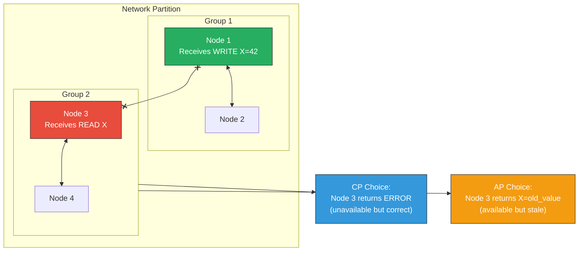
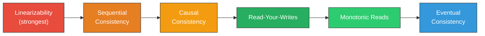
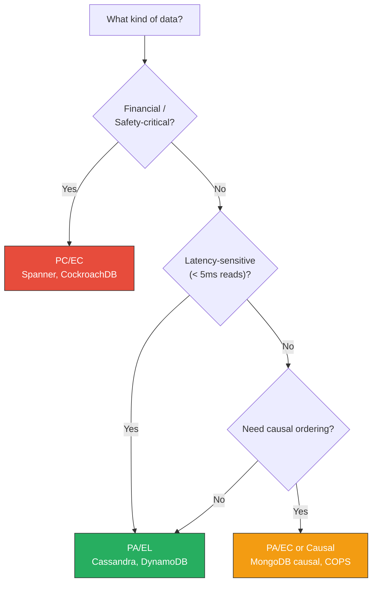

# 2. CAP Theorem and PACELC 🟢

> **What you'll learn:**
> - The precise statement and proof sketch of Brewer's CAP theorem—and the common misunderstandings that lead engineers astray.
> - Why "pick two out of three" is a misleading oversimplification: partition tolerance is not optional.
> - The PACELC framework: what trade-off does your system make when there is *no* partition (latency vs. consistency)?
> - How to classify real-world systems (PostgreSQL, Cassandra, Spanner, DynamoDB) on the CAP/PACELC spectrum.

**Cross-references:** Builds on clock and ordering foundations from [Chapter 1](ch01-time-clocks-and-ordering.md). Essential context for understanding replication trade-offs in [Chapter 6](ch06-replication-and-partitioning.md).

---

## The CAP Theorem: What It Actually Says

Eric Brewer conjectured in 2000 (proved by Gilbert & Lynch in 2002) that any distributed data store can provide at most **two of three** guarantees simultaneously:

| Property | Definition |
|---|---|
| **Consistency (C)** | Every read receives the most recent write or an error. (This is *linearizability*, not ACID consistency.) |
| **Availability (A)** | Every request to a non-failing node receives a (non-error) response—without guaranteeing it reflects the latest write. |
| **Partition tolerance (P)** | The system continues to operate despite arbitrary network partitions between nodes. |

### The Proof Sketch (Gilbert & Lynch, 2002)

Assume a network partition splits the cluster into two groups. A write arrives at Group 1. A read arrives at Group 2.

- **If the system is Consistent (C):** Group 2 must return the latest write, but it cannot reach Group 1 to confirm. It must either block (sacrificing Availability) or return an error.
- **If the system is Available (A):** Group 2 must return *some* response. But since it cannot see Group 1's write, it may return stale data (sacrificing Consistency).
- **Partition tolerance is not a choice.** Networks partition. Cables get cut, switches fail, BGP routes flap. You cannot opt out of `P`.



### Common Misunderstandings

| Myth | Reality |
|---|---|
| "You pick two of C, A, P" | You pick between C and A **during a partition**. P is not optional. |
| "CA systems exist" | A single-node PostgreSQL is "CA" only because it has no partition to tolerate. The moment you add replication, you must choose. |
| "CAP means you can't have consistency and availability" | During **normal operation** (no partition), you can have both. CAP only constrains behavior **during partitions**. |
| "Consistency in CAP = ACID consistency" | CAP's C is **linearizability** (a specific recency guarantee). ACID's C is application-invariant preservation. Completely different concepts with the same word. |
| "AP systems have no consistency at all" | AP systems can still offer **eventual consistency**, causal consistency, or read-your-writes. "Available" ≠ "chaotic." |

---

## Beyond CAP: The PACELC Framework

Daniel Abadi (2012) observed that CAP only describes behavior during partitions. Most of the time, your cluster is healthy. **What trade-off does your system make when there is no partition?**

### PACELC: The Full Framework

```
If (P)artition:
    Choose between (A)vailability and (C)onsistency
Else (normal operation):
    Choose between (L)atency and (C)onsistency
```

| System | If Partition (PA or PC) | Else (EL or EC) | Classification |
|---|---|---|---|
| **PostgreSQL** (single-leader) | PC — rejects writes to followers | EC — synchronous replication | PC/EC |
| **Cassandra** (tunable) | PA — allows writes to any node | EL — async replication, fast reads | PA/EL |
| **Google Spanner** | PC — waits for majority quorum | EC — TrueTime commit-wait for linearizability | PC/EC |
| **Amazon DynamoDB** | PA — sloppy quorum, hinted handoff | EL — eventually consistent reads by default | PA/EL |
| **CockroachDB** | PC — Raft-based, rejects minority partition | EC — serializable by default | PC/EC |
| **MongoDB** (default) | PA — can read from secondaries | EL — async replication | PA/EL |
| **etcd / ZooKeeper** | PC — only majority partition serves reads | EC — linearizable reads via Raft | PC/EC |

### The Latency vs. Consistency Trade-off

Even without network partitions, strong consistency has a latency cost:

```
Linearizable read (Spanner):
  Client → Leader → Confirm quorum has latest data → Respond
  Latency: ~5–15 ms (cross-datacenter)

Eventually consistent read (DynamoDB):
  Client → Nearest replica → Respond immediately
  Latency: ~1–3 ms (same AZ)
```

For a shopping cart, eventual consistency is fine—duplicate items are annoying, not catastrophic. For a bank balance, linearizability is non-negotiable.

---

## Consistency Models Spectrum

CAP's binary "consistent or not" hides a rich spectrum:



| Model | Guarantee | Cost | Example System |
|---|---|---|---|
| **Linearizability** | Every operation appears to execute at a single instant between invocation and response. Real-time ordering preserved. | Highest latency; requires coordination | Spanner, etcd, ZooKeeper |
| **Sequential consistency** | All operations appear in *some* total order consistent with each process's program order. No real-time guarantee. | High; global sequencing needed | ZooKeeper writes |
| **Causal consistency** | If operation A causally precedes B, all nodes see A before B. Concurrent operations may be seen in any order. | Moderate; vector clocks or dependency tracking | MongoDB causal sessions, COPS |
| **Read-your-writes** | A process always sees its own prior writes. Other processes' writes may be delayed. | Low | DynamoDB consistent reads, most session-sticky caches |
| **Monotonic reads** | If a process reads value X at time T, subsequent reads will never return a value older than X. | Low | Most replicated databases with session affinity |
| **Eventual consistency** | If no new writes occur, all replicas will *eventually* converge to the same value. No ordering guarantees during convergence. | Lowest latency | Cassandra, DynamoDB (default), DNS |

---

## The Naive Monolith Way vs. The Distributed Way

### The Naive Way: Ignoring Partitions

```rust
/// 💥 SPLIT-BRAIN HAZARD: This API assumes the database is always reachable.
/// During a network partition between the app server and the DB, this will
/// either hang forever (no timeout) or return a connection error that the
/// caller interprets as "data doesn't exist" — leading to silent data loss.
async fn get_user(db: &Database, user_id: &str) -> Option<User> {
    // 💥 No timeout, no retry, no fallback.
    // 💥 No distinction between "user not found" and "database unreachable."
    let row = db.query("SELECT * FROM users WHERE id = $1", &[user_id])
        .await
        .ok()?;  // 💥 Converts network error into None — SILENT DATA LOSS
    row.map(|r| User::from(r))
}
```

### The Distributed Fault-Tolerant Way

```rust
/// ✅ FIX: Explicit error handling that distinguishes "not found" from
/// "partition / timeout." Uses a deadline, classifies failures, and
/// allows the caller to decide the consistency/availability trade-off.
async fn get_user(
    db: &Database,
    user_id: &str,
    consistency: ReadConsistency,
) -> Result<Option<User>, ReadError> {
    let timeout = match consistency {
        // ✅ FIX: Linearizable reads go through the leader and confirm quorum.
        // Higher latency, but guaranteed to reflect all committed writes.
        ReadConsistency::Linearizable => Duration::from_millis(500),
        // ✅ FIX: Eventually consistent reads go to the nearest replica.
        // Lower latency, but may return stale data.
        ReadConsistency::EventuallyConsistent => Duration::from_millis(50),
    };

    match tokio::time::timeout(timeout, db.query_with_consistency(
        "SELECT * FROM users WHERE id = $1",
        &[user_id],
        consistency,
    )).await {
        Ok(Ok(Some(row))) => Ok(Some(User::from(row))),
        Ok(Ok(None)) => Ok(None),  // User genuinely not found
        Ok(Err(e)) => Err(ReadError::DatabaseError(e)),
        Err(_) => Err(ReadError::Timeout),  // ✅ Partition or overload — caller decides
    }
}

enum ReadConsistency {
    Linearizable,
    EventuallyConsistent,
}

enum ReadError {
    DatabaseError(DbError),
    Timeout,  // Could be a partition — the caller must decide how to handle this
}
```

---

## Choosing Your Trade-off: A Decision Framework



| Question | If Yes → | If No → |
|---|---|---|
| Will data loss cause financial or safety harm? | PC/EC (linearizable) | Continue ↓ |
| Do you need sub-5ms read latency globally? | PA/EL (eventually consistent) | Continue ↓ |
| Do users need to see their own writes immediately? | Read-your-writes with session stickiness | Eventually consistent is sufficient |
| Do you need cross-user causal ordering? | Causal consistency (vector clocks, causal sessions) | Eventual consistency |

---

<details>
<summary><strong>🏋️ Exercise: Classify the System</strong> (click to expand)</summary>

### Scenario

You are designing a global ride-sharing platform. You have three services:

1. **Payment Service** — authorizes charges, deducts from user wallets.
2. **Driver Location Service** — stores GPS coordinates of 2 million active drivers, updated every 3 seconds.
3. **Chat Service** — in-app messaging between rider and driver.

For each service, answer:

- **During a partition**, should it favor availability or consistency? Why?
- **During normal operation**, should it favor latency or consistency? Why?
- What is the PACELC classification (PA/EL, PA/EC, PC/EC, PC/EL)?
- Name a real database or architecture that fits this choice.

<details>
<summary>🔑 Solution</summary>

**1. Payment Service: PC/EC**

- **During partition:** Consistency. A double-charge or lost charge is unacceptable. If the partition means we can't confirm the charge, we must reject the request (return an error to the user). This is the "C" choice under partition.
- **Normal operation:** Consistency. Serializable isolation for wallet balances. We accept higher latency (5–15 ms) to guarantee correctness.
- **System fit:** Google Spanner, CockroachDB, or a single-leader PostgreSQL with synchronous replication.

**2. Driver Location Service: PA/EL**

- **During partition:** Availability. Showing a driver at their position from 6 seconds ago is better than showing no drivers at all. Stale location data degrades the experience but doesn't corrupt anything.
- **Normal operation:** Latency. 2 million updates every 3 seconds = ~667K writes/sec. We need the lowest-latency writes possible. Eventual consistency is fine—the data is ephemeral and self-correcting (next GPS update overwrites it).
- **System fit:** Redis Cluster (in-memory, PA/EL), Cassandra with CL=ONE, or a custom in-memory geo-index with async replication.

**3. Chat Service: PA/EC (or Causal)**

- **During partition:** Availability. Users should still be able to send messages even if some replicas are unreachable. Messages can be queued and delivered later.
- **Normal operation:** Causal consistency. Messages must appear in the order they were sent (causal ordering). If Alice says "Where are you?" and Bob replies "At the airport," those must appear in order. But we don't need linearizability—slight delays between replicas are fine.
- **System fit:** MongoDB with causal consistency sessions, or a Kafka-backed message store with per-conversation partitioning (preserves ordering within a conversation).

</details>
</details>

---

> **Key Takeaways**
>
> 1. **Partition tolerance is not optional.** Networks will partition. CAP forces a binary choice between consistency and availability *during that partition*.
> 2. **PACELC extends CAP** to cover normal operation. Most systems spend 99.99%+ of their time without partitions—the latency/consistency trade-off matters far more in practice than the partition behavior.
> 3. **"Consistency" in CAP means linearizability**, not ACID consistency. Don't conflate them.
> 4. **There is a spectrum** between linearizability and eventual consistency. Most systems don't need the strongest guarantee—causal consistency, read-your-writes, or monotonic reads are often sufficient and dramatically cheaper.
> 5. **The right trade-off depends on the data.** Financial data needs PC/EC. Ephemeral telemetry needs PA/EL. One size does not fit all—classify each service independently.

---

> **See also:**
> - [Chapter 1: Time, Clocks, and Ordering](ch01-time-clocks-and-ordering.md) — clocks affect which consistency models are achievable.
> - [Chapter 3: Raft and Paxos Internals](ch03-raft-and-paxos-internals.md) — consensus algorithms implement the "PC" side of the spectrum.
> - [Chapter 6: Replication and Partitioning](ch06-replication-and-partitioning.md) — replication topology determines where your system sits on PACELC.
