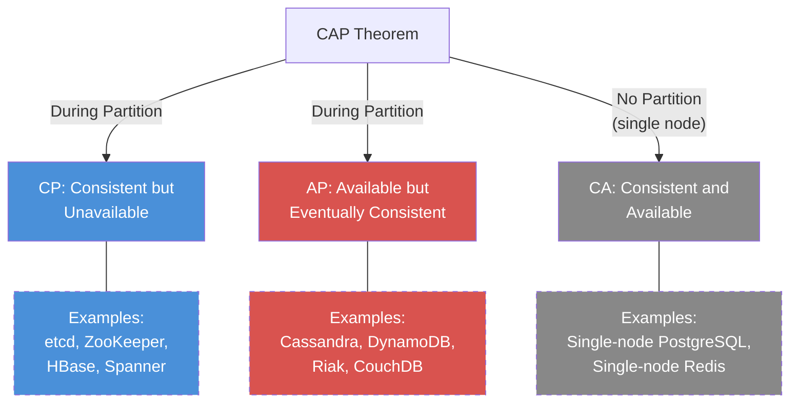
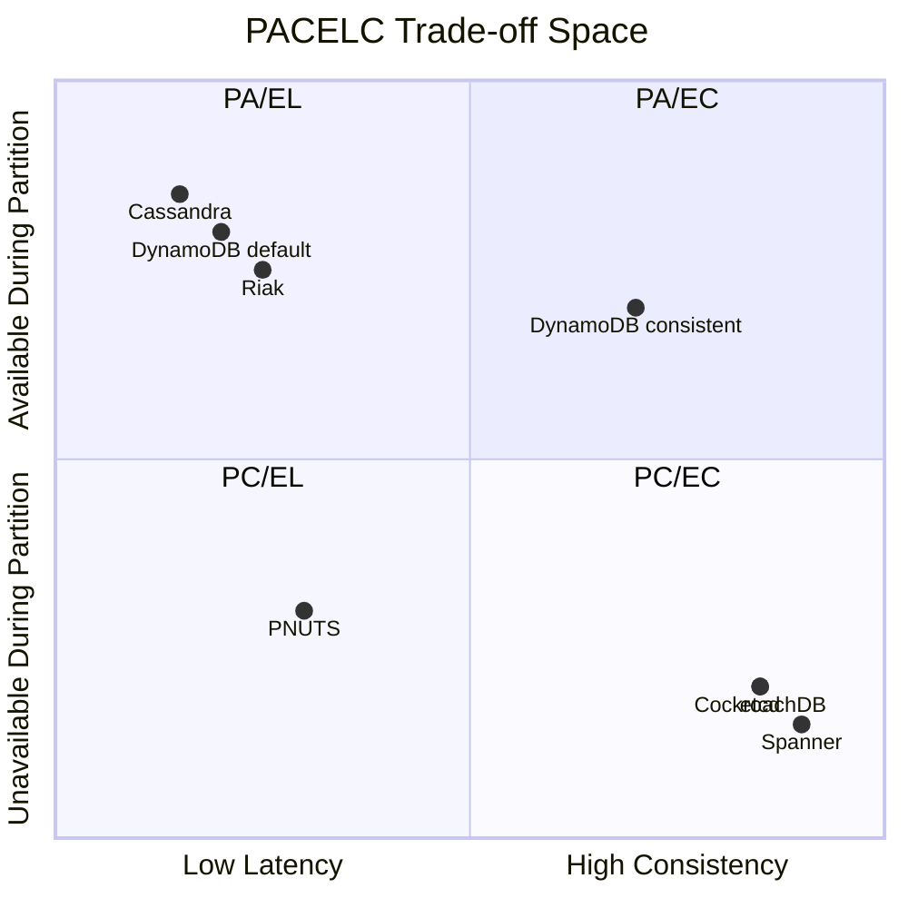

# 2. CAP Theorem and PACELC 🟢

> **What you'll learn:**
> - The precise statement of the CAP theorem and why the popular "pick two out of three" framing is misleading
> - How to classify real-world systems (PostgreSQL, Cassandra, DynamoDB, Spanner) on the CAP spectrum
> - The PACELC extension: what trade-off does the system make during *normal operation* (when there is no partition)?
> - Why "AP vs CP" is the wrong question — and what the right question is

---

## The CAP Theorem: What It Actually Says

In 2000, Eric Brewer conjectured — and in 2002 Seth Gilbert and Nancy Lynch proved — that a distributed data store can provide at most **two** of three guarantees simultaneously:

| Property | Definition |
|----------|-----------|
| **Consistency (C)** | Every read receives the most recent write or an error. All nodes see the same data at the same time. (This is *linearizability*, not ACID consistency.) |
| **Availability (A)** | Every request to a non-failing node receives a response — no timeouts, no errors. (The response must be non-trivial: returning an error code does NOT count as available.) |
| **Partition Tolerance (P)** | The system continues to operate despite an arbitrary number of messages being dropped (or delayed indefinitely) between nodes. |

### Why "Pick Two" Is Misleading

The popular "pick two out of C, A, P" framing suggests three equal choices: CA, CP, AP. But **partitions are not optional.** In any distributed system, the network *will* partition — switches fail, cables get cut, cloud availability zones lose connectivity. As per the theorem:

> **You must tolerate partitions (P). The only real choice is: during a partition, do you sacrifice Consistency or Availability?**

```
// 💥 SPLIT-BRAIN HAZARD: A "CA" system that ignores partitions
// When the network partitions, this system will either:
// 1. Return stale data (violating C), or
// 2. Refuse to respond (violating A)
// There is no third option. "CA" only works on a single node.

fn handle_read(key):
    value = local_storage.get(key)
    return value  // Is this the latest value? If a partition
                  // isolated the leader, this could be stale.
                  // You've unknowingly chosen AP (eventual consistency).
```



## Real-World System Classifications

| System | During Partition | Normal Operation | Classification | Notes |
|--------|-----------------|------------------|---------------|-------|
| **Single-node PostgreSQL** | N/A (no partition possible) | Strong consistency + available | CA* | *Not distributed — CAP doesn't apply |
| **etcd / ZooKeeper** | Minority partition rejects writes (unavailable) | Linearizable reads/writes | CP | Raft/ZAB consensus; minority nodes refuse service |
| **HBase** | Region servers on partition side without master are unavailable | Strong consistency via single master per region | CP | Leader-based; no split-brain |
| **Cassandra** | Continues serving at reduced consistency | Tunable: ONE → eventual, QUORUM → linearizable | AP (tunable) | Can be configured CP per-query with `QUORUM` |
| **Amazon DynamoDB** | Eventually consistent reads always available | Eventually consistent by default; strongly consistent reads optional | AP (tunable) | Consistent reads cost 2× DynamoDB RCUs |
| **Riak** | Continues serving; conflict resolution via siblings | Eventually consistent; CRDTs or vector clocks for conflicts | AP | Application resolves conflicts |
| **Google Spanner** | Minority partitions become unavailable | Externally consistent (strongest guarantee) | CP | Relies on TrueTime for tight commit-wait bounds |
| **CockroachDB** | Leaseholder failover; minority unavailable | Serializable isolation via Raft consensus per range | CP | Uses HLC instead of TrueTime |

## PACELC: The Trade-Off You're *Actually* Making

CAP only describes behavior **during a partition**. But partitions are (hopefully) rare. What trade-off does the system make during **normal operation**?

Daniel Abadi's PACELC framework extends CAP:

> **If there is a Partition (P), the system trades off Availability (A) vs Consistency (C). Else (E), during normal operation, the system trades off Latency (L) vs Consistency (C).**

This is the trade-off that matters day-to-day. A CP system that has terrible latency during normal operation is not useful. An AP system that takes seconds to converge is also problematic.

```
PACELC Classification:

    During Partition          Normal Operation
    ┌──────────────┐         ┌──────────────┐
    │ A or C ?     │         │ L or C ?     │
    └──────────────┘         └──────────────┘

    PA/EL → Prioritizes availability AND latency (eventual consistency)
    PA/EC → Available during partition, consistent when running normally
    PC/EL → Consistent during partition, low-latency normally
    PC/EC → Maximum consistency, always (highest latency)
```

### PACELC Classification Table

| System | P: A or C? | E: L or C? | PACELC | Practical Implication |
|--------|-----------|-----------|--------|----------------------|
| **Cassandra** (default) | PA | EL | PA/EL | Always fast, eventually consistent |
| **DynamoDB** (default) | PA | EL | PA/EL | Eventually consistent reads are 2× cheaper and faster |
| **Riak** | PA | EL | PA/EL | Low-latency with conflict resolution |
| **DynamoDB** (consistent read) | PA | EC | PA/EC | Available under partition, but consistent reads have higher latency |
| **PNUTS (Yahoo!)** | PC | EL | PC/EL | Consistent during partition (master per record), but low-latency reads from nearby replicas |
| **etcd / ZooKeeper** | PC | EC | PC/EC | Always linearizable, 1 RTT to leader for every operation |
| **Google Spanner** | PC | EC | PC/EC | Externally consistent + commit-wait latency, but TrueTime keeps ε small |
| **CockroachDB** | PC | EC | PC/EC | Serializable, but cross-region transactions are limited by network RTT |



## Why "AP vs CP" Is the Wrong Question

When someone asks "Is your system AP or CP?", the right response is: **"At what granularity, for which operations, and what are the latency requirements?"**

### Systems Are Not Monolithic

Most production systems are **neither purely AP nor purely CP**. They offer tunable consistency per operation:

```
// Cassandra: tunable consistency per query
// ✅ FIX: Choose consistency level based on the operation's requirements,
//         not a system-wide setting

// User profile reads — can tolerate staleness (AP)
SELECT * FROM users WHERE id = ? USING CONSISTENCY ONE;

// Financial balance check — must see latest state (CP)
SELECT balance FROM accounts WHERE id = ? USING CONSISTENCY QUORUM;

// Write that must not be lost (CP)
INSERT INTO transactions (...) VALUES (...) USING CONSISTENCY ALL;
// ⚠️ CONSISTENCY ALL means write fails if ANY replica is down
```

### The Right Questions to Ask

| Instead of asking... | Ask this |
|---------------------|----------|
| "Is it AP or CP?" | "What consistency guarantee does this *specific operation* need?" |
| "Is it consistent?" | "What *kind* of consistency? Linearizable? Sequential? Causal? Eventual?" |
| "How fast is it?" | "What is the p99 latency for a consistent read? An eventually consistent read?" |
| "Is it available?" | "What is the availability SLA? What happens to in-flight requests during a regional failover?" |

## Consistency Models: A Hierarchy

Not all consistency isn't created equal. Systems can offer different strengths:

| Model | Guarantee | Latency Cost | Used By |
|-------|-----------|-------------|---------|
| **Strict Serializability** (External Consistency) | All operations appear in a single total order matching real-time | Highest (commit-wait + consensus) | Spanner, FaunaDB |
| **Linearizability** | Each operation appears instantaneous between invocation and response | High (consensus per op) | etcd, ZooKeeper |
| **Sequential Consistency** | All operations appear in *some* total order consistent with each process's order | Medium | ZooKeeper reads (session guarantee) |
| **Causal Consistency** | Causally related operations are seen in the correct order; concurrent operations may differ across nodes | Low-Medium | MongoDB (causal sessions), COPS |
| **Eventual Consistency** | All replicas converge *eventually* if writes stop | Lowest | DynamoDB (default), Cassandra (CL=ONE) |

```
Strongest ─────────────────────────────────────────── Weakest
Strict           Lineariz-    Sequential    Causal      Eventual
Serializability  ability      Consistency   Consistency  Consistency
(Spanner)       (etcd)       (ZooKeeper)   (MongoDB)   (DynamoDB)
     │               │             │            │           │
     └── Implies ────┘── Implies ──┘── Implies ─┘── Implies┘
```

Every stronger model implies all weaker ones. Moving left costs more latency and infrastructure. Moving right risks application-level inconsistency bugs.

## The Practical Decision Framework

When designing a new distributed system, walk through this checklist:

1. **What are your durability requirements?** (Can you lose acknowledged writes?)
2. **What operations need strong consistency?** (Financial transactions, leader election, inventory counts)
3. **What operations can tolerate eventual consistency?** (User profiles, recommendation feeds, analytics)
4. **What is your latency budget?** (p50, p99, p99.9 for consistent operations)
5. **How many regions?** (Single-region CP is cheap; multi-region CP is expensive)
6. **What is your partition tolerance requirement?** (Must the system remain available during a full region outage?)

| Requirement | Recommendation |
|-------------|----------------|
| All ops need strong consistency, single region | CP with Raft consensus (etcd, CockroachDB) |
| All ops need strong consistency, multi-region | Spanner (if you can afford TrueTime) or CockroachDB (accept higher cross-region latency) |
| Mixed consistency needs | Per-query tunable consistency (Cassandra QUORUM, DynamoDB consistent reads) |
| Maximum availability, can tolerate staleness | AP with eventual consistency and application-level conflict resolution (Dynamo-style) |
| Low-latency reads, infrequent writes | CQRS: CP write path + AP read path with read replicas |

---

<details>
<summary><strong>🏋️ Exercise: Classify Your System on PACELC</strong> (click to expand)</summary>

**Problem:** You are the tech lead for a global e-commerce platform. You have three microservices, each with different requirements. Classify each on PACELC and justify your choice:

1. **Product Catalog Service** — serves product descriptions, images, and prices to users worldwide. Prices update every 15 minutes. Reads: 100,000 RPS. Writes: 50 RPS.

2. **Inventory Service** — tracks the count of each item in each warehouse. Must not oversell. Reads: 10,000 RPS. Writes: 5,000 RPS. Users in NA, EU, and APAC regions.

3. **User Session Service** — stores shopping cart contents and session tokens. Sessions are read/written by the same user, usually from the same region. Reads: 50,000 RPS. Writes: 20,000 RPS.

For each service, specify:
- PACELC classification
- Recommended system (e.g., DynamoDB, CockroachDB, Redis Cluster, Cassandra)
- Replication topology (single-leader, multi-leader, leaderless)
- How you handle the partition scenario

<details>
<summary>🔑 Solution</summary>

**1. Product Catalog Service → PA/EL**

- **Reasoning:** Read-heavy, infrequent writes, stale data is acceptable (prices update every 15 minutes, so reading a 30-second-old price is fine). Availability and latency dominate.
- **System:** DynamoDB Global Tables or Cassandra with `CONSISTENCY ONE` reads.
- **Topology:** Leaderless (multi-region) or multi-leader replication. Every region has a full replica.
- **Under partition:** Continue serving from local replica. Price data may be up to 15 minutes stale — negligible compared to the update frequency. Reconcile on partition heal.

**2. Inventory Service → PC/EC**

- **Reasoning:** MUST NOT oversell. An incorrect inventory count causes real business harm (cancelled orders, customer refunds, regulatory issues for some products). Consistency wins over latency. During a partition, reject writes rather than risk double-selling.
- **System:** CockroachDB (serializable isolation, Raft-based) or PostgreSQL with synchronous replication.
- **Topology:** Single-leader per partition key (item × warehouse). Raft consensus across 3–5 nodes, majority in the primary region.
- **Under partition:** Minority partition becomes read-only (or totally unavailable). Majority partition continues serving. Inventory writes require quorum.
- **Latency mitigation:** Keep replicas within the same region to minimize consensus RTT (~1–5 ms intra-region vs 50–200 ms cross-region). For multi-region, partition inventory by warehouse region — each region's stock is managed by the local consensus group.

**3. User Session Service → PA/EL**

- **Reasoning:** Sessions are user-scoped (natural partitioning by user ID). Losing a session is annoying but not catastrophic (user re-logs in). Sessions are read/write by the same user, usually from the same region — conflicts are extremely rare.
- **System:** Redis Cluster or DynamoDB with eventually consistent reads.
- **Topology:** Leaderless or multi-leader. Each region has a local replica. Sessions pin to the user's region via geo-routing.
- **Under partition:** Serve from local replica. If user switches regions mid-session (rare), they may get an empty cart — mitigate with a secondary lookup to the home region on cache miss.
- **Optimization:** Short TTL (24 hours). No need for strong consistency — the user's own writes are immediately visible locally (read-your-writes guarantee via sticky routing).

</details>
</details>

---

> **Key Takeaways:**
> - **Partitions are not optional** in a distributed system. The only real CAP choice is: during a partition, sacrifice Consistency or Availability?
> - **PACELC extends CAP** to capture the trade-off that matters day-to-day: Latency vs Consistency during normal operation.
> - **No production system is purely AP or purely CP.** The best systems offer tunable consistency per operation — strong consistency for critical paths, eventual consistency for latency-sensitive or read-heavy paths.
> - **"Which consistency model?" is really five questions:** What operations need what guarantees, at what latency, across how many regions, with what availability SLA?
> - **Consistency is a spectrum.** Strict Serializability → Linearizability → Sequential → Causal → Eventual. Every step right buys latency but risks correctness bugs.

> **See also:** [Chapter 1: Time, Clocks, and Ordering](ch01-time-clocks-and-ordering.md) — vector clocks enable conflict detection in AP systems | [Chapter 3: Raft and Paxos Internals](ch03-raft-and-paxos-internals.md) — the machinery that makes CP systems work | [Chapter 6: Replication and Partitioning](ch06-replication-and-partitioning.md) — implementing the topologies described here
