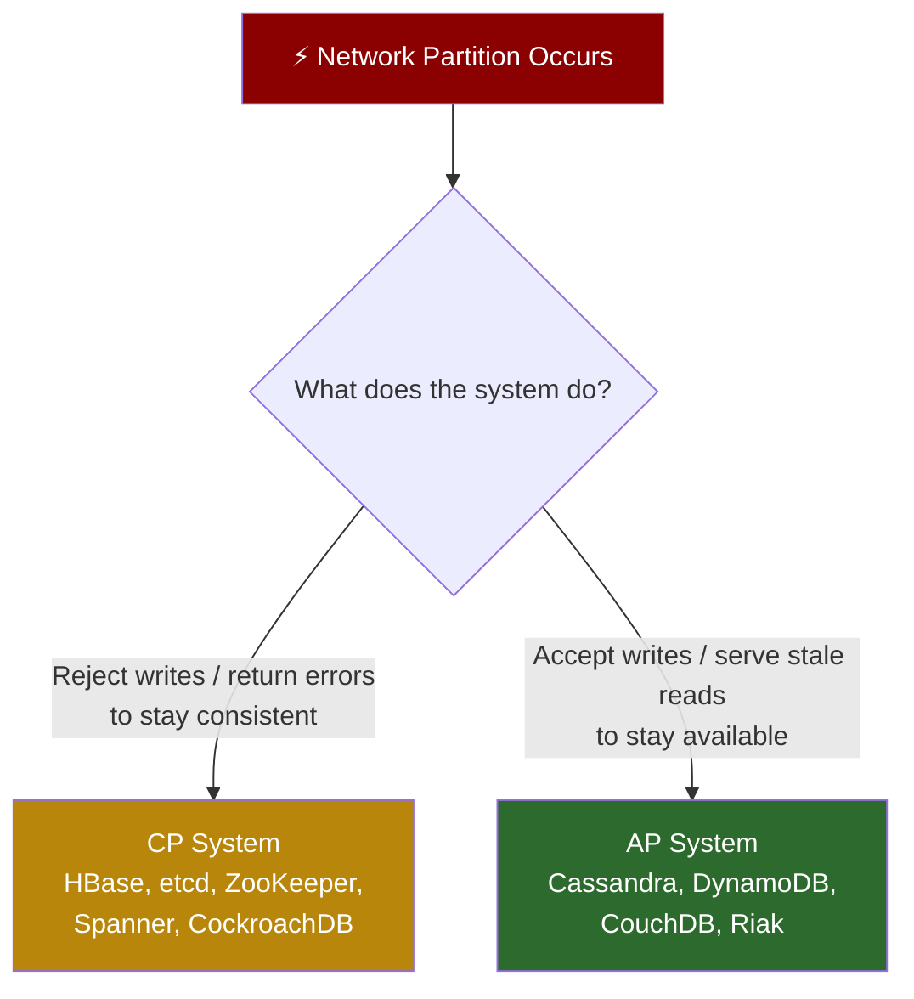
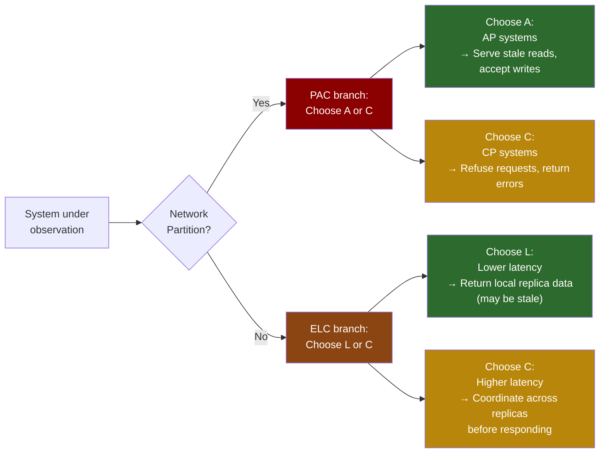
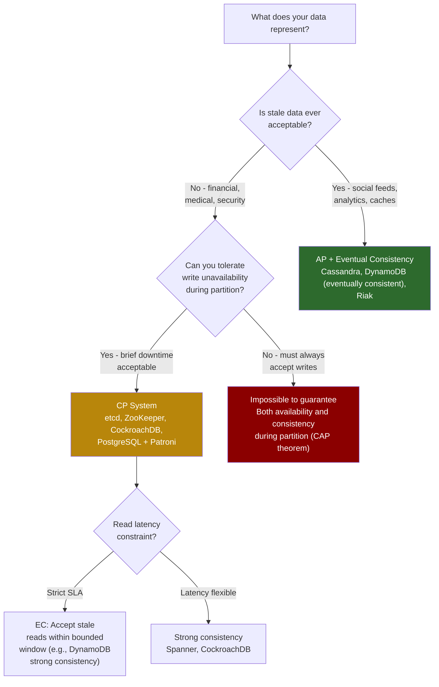

# 2. CAP Theorem and PACELC 🟢

> **What you'll learn:**
> - The precise meaning of the CAP theorem's three properties— and the exact conditions under which CP or AP applies
> - Why CAP is widely misunderstood and what it actually means for database selection
> - The PACELC theorem: what your system trades off even when there is **no** partition
> - How to map real-world databases (PostgreSQL, Cassandra, etcd, DynamoDB, Spanner) onto the CAP/PACELC grid

---

## CAP Theorem: The Precise Statement

Eric Brewer's CAP theorem (formalized by Gilbert and Lynch in 2002) states:

> **A distributed data store cannot simultaneously provide all three of the following guarantees during a network partition:**
> - **C — Consistency:** Every read receives the most recent write or an error (linearizability)
> - **A — Availability:** Every request receives a response (not necessarily the most recent write)
> - **P — Partition Tolerance:** The system continues operating despite network partitions

The theorem's key insight is that during a partition, you **must choose** between C and A. The choice of P is not optional — network partitions happen in any real distributed system. Assuming P is optional is assuming your network is perfect. It is not.



### The Three Properties in Depth

**Consistency (Linearizability)**

CAP's "C" specifically means **linearizability** — not the weaker "C" from ACID. In a linearizable system:

- Every operation appears to occur atomically at some point between its invocation and response
- The apparent order of operations matches real time — if A finishes before B starts, A appears before B to all observers
- There is a single, globally agreed-upon view of "the current value" at any instant

This is stronger than what most databases call "consistency." A database with Read-Committed isolation is *not* CAP-C. A database with Sequential Consistency is close but not quite.

**Availability**

CAP's "A" means **every request to a non-failing node returns a response** — not a timeout, not an error. The response may not contain the latest write. This is a strong requirement that rules out systems that use majority quorums: if any quorum cannot be assembled, the request fails, which violates availability.

**Partition Tolerance**

**You cannot choose to sacrifice partition tolerance.** Network partitions are not theoretical:

- A switch firmware update causes connectivity loss for 15 seconds
- A misconfigured firewall rule drops traffic on a specific VLAN
- BGP route instability causes intermittent packet loss between availability zones
- A GC pause causes a node to appear unresponsive for 30 seconds (it's not partitioned, but it looks like it)

The real choice is always **CP vs AP** when a partition happens.

## The Common Misuses of CAP

### Misuse 1: "We chose CP, so we're always consistent"

CAP only applies **during a partition**. Between partitions, CP systems can still expose weaker consistency if they choose to (Read-Your-Writes, Monotonic Read, etc. are all weaker than linearizability). A CP system is consistent during partitions; it makes no promises about consistency modes during normal operation.

### Misuse 2: "CAP means you choose two of three"

The theorem says: *during a partition, you choose C or A*. Partition tolerance is not "chosen" — it is assumed. The choice space isn't a triangle; it's a binary decision at one point in time.

### Misuse 3: Applying CAP to non-partitioned operation

CAP says nothing about latency, throughput, or what your system does when the network is healthy. This gap is exactly what PACELC was designed to address.

## PACELC: Extending CAP to Normal Operation

Daniel Abadi's PACELC theorem (2012) adds the critical missing dimension:

> **If there is a Partition (P), you choose between Availability (A) and Consistency (C); Else (E) — even when the system is running normally — you choose between Latency (L) and Consistency (C).**



### Why ELC Matters: The Latency-Consistency Trade-off

Consider a single data item replicated across 3 nodes in different availability zones, with ~1ms network RTT between them. Under normal (non-partitioned) operation:

**Low-latency path (favors L):** A read returns immediately from the local replica without coordinating with others. If the local replica has a slightly stale value (1ms behind), the read returns stale data. Latency: 0 extra RTTs.

**Consistent path (favors C):** A read contacts at least a majority (2 of 3) replicas to confirm the local value is up-to-date (or fetches the latest). Latency: +1 RTT minimum.

For 1ms inter-AZ latency this sounds trivial. But at tail latencies (p99), for a system making 100,000 reads/s where every read requires coordination, the cumulative latency increase can make the difference between hitting SLA and violating it.

## CAP/PACELC Classification of Real Systems

| System | CAP (during partition) | PACELC (normal ops) | Notes |
|--------|----------------------|---------------------|-------|
| **etcd** | CP | EC | Uses Raft; minority partitions reject all writes. Favors consistency over latency. |
| **ZooKeeper** | CP | EC | Like etcd: Zab consensus; minority partitions refuse writes |
| **PostgreSQL (single-node)** | N/A (not distributed) | N/A | Single-node DB; no partition behavior defined |
| **PostgreSQL + Patroni** | CP | EC | Patroni uses etcd/Consul for leader election; minority partitions fail over |
| **Cassandra** | AP (configurable) | EL (configurable) | Default: eventual consistency. Can tune toward C with `QUORUM` reads |
| **DynamoDB** | AP (eventually consistent reads) / CP (strong reads) | EL (eventual) / EC (strong) | Configurable per-request |
| **CockroachDB** | CP | EC | Raft per-range; serializable isolation; cross-range transactions via 2PC |
| **Google Spanner** | CP | EC | TrueTime + Paxos; external consistency; highest latency for strongest guarantees |
| **Riak** | AP | EL | Vector clocks for conflict detection; tunable quorum |
| **MongoDB** | CP (with writeConcern majority) | EC | Pre-3.0 defaults were notoriously unsafe; modern defaults are CP |
| **Redis Cluster** | AP | EL | Async replication; data loss possible on failover |

### The Cassandra Tuning Continuum

Cassandra's configurability makes it worth examining in detail. The consistency level is set **per-operation**:

```
              EVENTUAL                           STRONG
              ◄────────────────────────────────────────►
ONE    TWO    QUORUM   LOCAL_QUORUM   ALL
 AP     AP      CP          CP        CP
 ↓      ↓       ↓           ↓         ↓
Fast  Faster  Balanced  Region-safe  Slow
              reads/     (avoids    (all nodes
              writes     cross-dc)   must ack)
```

With `QUORUM` reads and writes (W + R > N, where N=3, W=2, R=2), Cassandra provides strong consistency *during normal operation*. But during a partition, a node in the minority partition will refuse `QUORUM` writes — making it partition-intolerant (CP behavior). With `ONE`, partitioned nodes happily accept writes — AP behavior.

**The PACELC implication:** `QUORUM` requires 2 round-trips to remote replicas; `ONE` requires 0. Under normal operation, `QUORUM` trades latency for consistency. This is the ELC branch of PACELC.

## Practical Decision Framework

When choosing a database or designing a distributed component, use this decision tree:



### Consistency Level Vocabulary

Beyond CAP's binary, a spectrum of consistency models exists:

| Model | Guarantee | Example |
|-------|-----------|---------|
| **Linearizability** | Operations appear atomic; order consistent with real-time | etcd, Spanner |
| **Sequential Consistency** | All nodes see operations in same order (not necessarily real-time) | Multi-Leader with sync replication |
| **Causal Consistency** | Causally related writes are seen in order; concurrent writes may differ | Riak w/ VCs, some NewSQL |
| **Read-Your-Writes** | A client always sees its own writes | Most relational DBs |
| **Monotonic Reads** | Once a client sees a value, it never sees an older one | Session guarantees |
| **Eventual Consistency** | Given no new writes, all replicas converge to the same value | Cassandra with ONE, DynamoDB eventual |

<details>
<summary><strong>🏋️ Exercise: Choosing a Storage Backend</strong> (click to expand)</summary>

**Scenario:** You are designing backend storage for the following three services. For each one, choose the appropriate CAP/PACELC position and a specific database, justifying your decision.

1. **Payment ledger service** — Records debit/credit transactions. Business rule: a user's balance can never go negative; we'd rather return an error than allow an overdraw. Zero tolerance for stale reads on balance checks. Millions of transactions per day globally.

2. **User activity feed** — Stores "User X liked post Y" events. Shown on a social dashboard. A few seconds of staleness is acceptable. High write volume (10K writes/s peak). Requires horizontal write scalability.

3. **Distributed configuration store** — Stores feature flags and rate limit configs read by 500 microservices. Writes are rare (a few per hour). Reads are extremely frequent (1M reads/s). The config must be consistent across services — two services must never see different values for the same flag at the same time.

<details>
<summary>🔑 Solution</summary>

**Service 1: Payment Ledger — CP + EC**

- **CAP:** CP. We must refuse writes during partition rather than allow stale reads that permit overdrafts.
- **PACELC:** EC. We pay the latency cost to guarantee fresh reads.
- **Choice:** **CockroachDB** or **Spanner** (if on GCP).
  - CockroachDB: Serializable isolation (SSI), Raft consensus per-range, linearizable reads by default.
  - SQL interface; supports multi-row ACID transactions for debit/credit atomicity.
  - Balance validation happens inside a single serializable transaction — no race conditions.
- **Why not Cassandra?** Even `QUORUM` consistency in Cassandra doesn't support multi-row ACID transactions needed for fund-transfer atomicity.

**Service 2: User Activity Feed — AP + EL**

- **CAP:** AP. A user briefly not seeing their own "like" is acceptable. Rejecting writes during partition is not — we don't want the app to appear broken during AZ outages.
- **PACELC:** EL. Low-latency writes are critical for perceived responsiveness. Stale reads (seconds) are fine.
- **Choice:** **Cassandra** with consistency level ONE for writes, LOCAL_ONE for reads.
  - Time-series data model: partition key = (user_id, month), clustering key = (timestamp, event_id)
  - Append-only writes (no conflict risk from concurrent writes to same row)
  - Horizontal write scalability via consistent hashing
- **Conflict handling:** Because writes are immutable events (not updates), LWW doesn't cause logical data loss — a missed replication just causes brief feed delays.

**Service 3: Configuration Store — CP + EC, Optimized for Read**

- **CAP:** CP. All 500 services must see the same feature flag values. A split-brain where half the services see old rate limits and half see new ones could cause cascading failures.
- **PACELC:** EC, but with local read optimization to handle the 1M reads/s.
- **Choice:** **etcd** with a local caching layer.
  - etcd is the gold standard for configuration: Raft-based, linearizable by default, proven in Kubernetes.
  - For 1M reads/s: services watch etcd via gRPC Watch streams and cache locally. The cache is invalidated on change notification — **not** on a TTL.
  - This gives linearizable writes (etcd) + effectively zero-latency reads (local in-process cache) + immediate invalidation on change.
- **Why not ZooKeeper?** etcd has a simpler operational model, native gRPC API, and better watch notification semantics for this use case.
</details>
</details>

---

> **Key Takeaways**
> - CAP's partition tolerance is not optional — choose between C (refuse requests to stay consistent) and A (serve requests, possibly stale) during partitions
> - CAP says nothing about normal operation: PACELC fills the gap — during normal operation, every distributed system trades off **Latency vs. Consistency**
> - The consistency spectrum from linearizability → sequential → causal → eventual is not binary; systems expose multiple levels (Cassandra, DynamoDB)
> - Choose CP for financial, medical, and security-critical systems; AP for high-volume, tolerance-for-staleness workloads

> **See also:**
> - [Chapter 3: Raft and Paxos Internals](ch03-raft-and-paxos-internals.md) — How CP consensus protocols actually guarantee consistency during partitions
> - [Chapter 6: Replication and Partitioning](ch06-replication-and-partitioning.md) — How AP systems (Dynamo-style) handle partition and convergence
> - [Chapter 7: Transactions and Isolation Levels](ch07-transactions-and-isolation-levels.md) — The ACID "C" is different from CAP "C"
