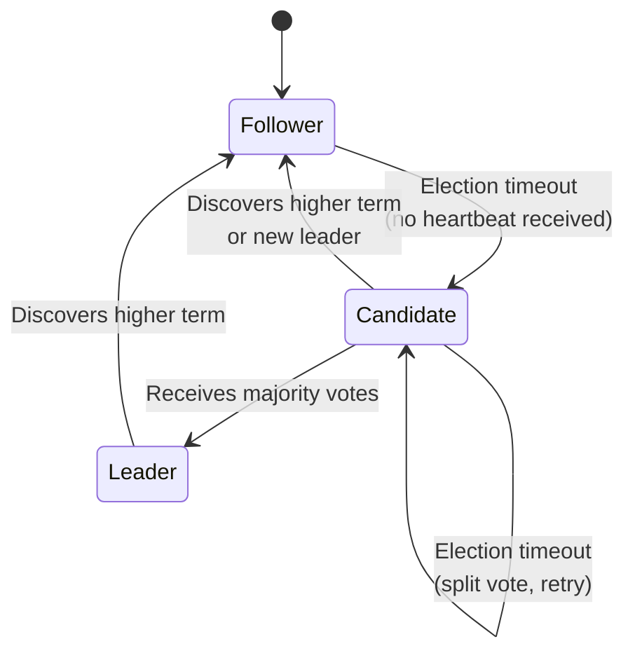
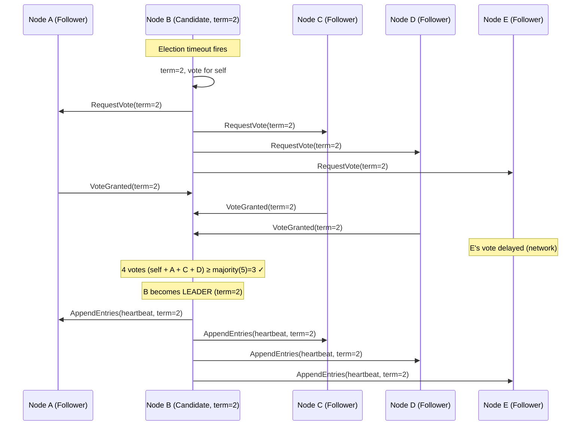
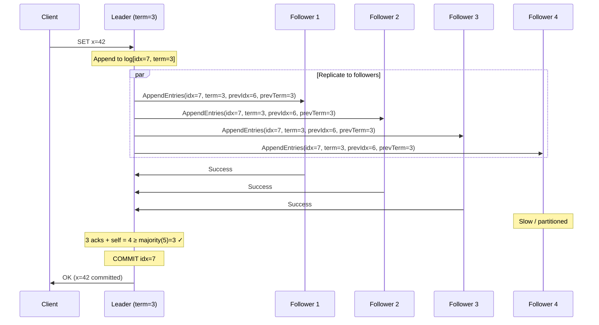

# 3. Raft and Paxos Internals 🟡

> **What you'll learn:**
> - The consensus problem: how N distributed nodes agree on a single value despite failures and partitions.
> - The Raft consensus algorithm in full detail: leader election (terms, votes, split-brain prevention), log replication (AppendEntries, commitment), and the safety invariants that guarantee correctness.
> - Classical Paxos (prepare/accept phases) and Multi-Paxos optimization.
> - Head-to-head comparison of Raft vs. Paxos: understandability, performance, and real-world adoption.

**Cross-references:** Builds on the ordering foundations from [Chapter 1](ch01-time-clocks-and-ordering.md) and the CAP/PACELC consistency model from [Chapter 2](ch02-cap-theorem-and-pacelc.md). Consensus is used by the distributed locking mechanisms in [Chapter 4](ch04-distributed-locking-and-fencing.md) and underpins the CP replication topologies in [Chapter 6](ch06-replication-and-partitioning.md).

---

## The Consensus Problem

**Definition:** Given a cluster of N nodes where up to F nodes may crash (and later recover), have all non-crashed nodes agree on the same sequence of commands, even if messages are delayed, reordered, or lost.

**Requirements:**

| Property | Definition |
|---|---|
| **Agreement** | All non-faulty nodes decide on the same value. |
| **Validity** | The decided value was proposed by some node (no "made-up" values). |
| **Termination** | Every non-faulty node eventually decides. |
| **Integrity** | Every node decides at most once. |

**FLP Impossibility (Fischer, Lynch, Paterson, 1985):** In a purely asynchronous system (no clock, no timeout), there is *no* deterministic protocol that solves consensus if even one node can crash. Every practical consensus algorithm (Paxos, Raft, Viewstamped Replication) circumvents FLP by using timeouts—introducing a notion of time to detect failures.

---

## Raft: Consensus Made Understandable

Raft (Ongaro & Ousterhout, 2014) was designed explicitly for understandability, decomposing consensus into three sub-problems:

1. **Leader election** — select one node to coordinate.
2. **Log replication** — the leader distributes commands to followers.
3. **Safety** — guarantee that committed entries are never lost.

### Node States

Every Raft node is in exactly one of three states:



### Terms: The Logical Clock of Raft

Raft divides time into **terms**—monotonically increasing integers. Each term has at most one leader. Terms act as a logical clock for detecting stale leaders:

```
Term 1: Leader=A,  A serves requests, replicates logs
Term 2: A crashes. B wins election. B is leader.
Term 3: A recovers, sees term 3, steps down to follower.
```

**Rule:** If a node receives a message with a higher term than its own, it immediately updates its term and converts to follower. This is how stale leaders are dethroned.

---

## Leader Election: Step by Step

### The Happy Path

```
1. Follower B hasn't heard from the leader in [150ms, 300ms] (randomized election timeout).
2. B increments its term (term = 2) and converts to Candidate.
3. B votes for itself and sends RequestVote RPCs to all other nodes.
4. Each node votes for at most ONE candidate per term (first-come-first-served).
5. If B receives votes from a majority (⌈N/2⌉ + 1), B becomes Leader.
6. B immediately sends heartbeat AppendEntries RPCs to establish authority.
```

### Split Vote and Randomized Timeouts

If two candidates start an election simultaneously and split the vote, neither gets a majority. Both time out and start a new election with incremented terms. **Randomized election timeouts** (e.g., 150–300ms) make split votes rare:



### The Naive Monolith Way

```rust
/// 💥 SPLIT-BRAIN HAZARD: Electing a leader using wall-clock "first to start."
/// Two nodes starting within the same millisecond both think they're leader.
/// No quorum, no term numbers, no fencing. Both serve writes. Data diverges.
fn elect_leader(nodes: &[Node]) -> &Node {
    // 💥 Race condition: two nodes can both win simultaneously.
    // 💥 No mechanism to detect or resolve the split-brain.
    nodes.iter()
        .filter(|n| n.is_alive())
        .min_by_key(|n| n.startup_time) // 💥 Based on physical clock!
        .expect("at least one node alive")
}
```

### The Distributed Fault-Tolerant Way

```rust
/// ✅ FIX: Raft-style leader election with terms, quorum votes,
/// and randomized timeouts to prevent split-brain.
struct RaftNode {
    id: NodeId,
    current_term: u64,
    voted_for: Option<NodeId>,
    state: NodeState,
    log: Vec<LogEntry>,
    election_timeout: Duration, // Randomized [150ms, 300ms]
}

impl RaftNode {
    /// ✅ FIX: Start an election. Increment term, vote for self, request votes.
    fn start_election(&mut self) -> Vec<RequestVote> {
        self.current_term += 1;
        self.voted_for = Some(self.id);
        self.state = NodeState::Candidate;

        // Send RequestVote to all peers. Need majority to win.
        self.peers.iter().map(|peer| RequestVote {
            term: self.current_term,
            candidate_id: self.id,
            last_log_index: self.log.len() as u64,
            last_log_term: self.log.last().map(|e| e.term).unwrap_or(0),
        }).collect()
    }

    /// ✅ FIX: Grant vote only if candidate's term >= ours AND candidate's
    /// log is at least as up-to-date as ours (the Election Restriction).
    fn handle_request_vote(&mut self, req: &RequestVote) -> VoteResponse {
        // Step down if we see a higher term.
        if req.term > self.current_term {
            self.current_term = req.term;
            self.state = NodeState::Follower;
            self.voted_for = None;
        }

        let vote_granted = req.term >= self.current_term
            && self.voted_for.map_or(true, |v| v == req.candidate_id)
            && self.is_log_up_to_date(req.last_log_index, req.last_log_term);

        if vote_granted {
            self.voted_for = Some(req.candidate_id);
        }

        VoteResponse { term: self.current_term, vote_granted }
    }

    /// The Election Restriction: only vote for candidates whose log
    /// contains all committed entries.
    fn is_log_up_to_date(&self, last_index: u64, last_term: u64) -> bool {
        let my_last_term = self.log.last().map(|e| e.term).unwrap_or(0);
        let my_last_index = self.log.len() as u64;
        // ✅ Compare by term first, then by index length.
        (last_term, last_index) >= (my_last_term, my_last_index)
    }
}
```

---

## Log Replication

Once elected, the leader accepts client commands and replicates them:

```
1. Client sends command to leader.
2. Leader appends command to its local log (uncommitted).
3. Leader sends AppendEntries RPC to all followers with the new entry.
4. Each follower appends the entry to its log and responds.
5. When the leader receives acknowledgment from a majority, it COMMITS the entry.
6. Leader applies the committed entry to its state machine and responds to client.
7. Followers learn about the commitment via subsequent AppendEntries and apply it.
```

### Log Matching Property

Raft guarantees:
- If two entries in different logs have the same index and term, they store the same command.
- If two entries in different logs have the same index and term, all preceding entries are identical.

This is enforced by the **consistency check** in AppendEntries: each RPC includes the index and term of the entry *immediately preceding* the new entries. If the follower doesn't have a matching entry, it rejects the RPC, and the leader decrements its `nextIndex` for that follower and retries.



---

## Safety: Why Committed Entries Are Never Lost

The **Leader Completeness Property** guarantees that if a log entry is committed in a given term, that entry will be present in the logs of all leaders for all higher-numbered terms.

This is ensured by two mechanisms:

1. **Election Restriction:** A candidate cannot win an election unless its log is at least as up-to-date as a majority of nodes. Since committed entries exist on a majority, any new leader must have all committed entries.

2. **Commitment Rule:** A leader only commits entries from its current term. Entries from previous terms are committed indirectly when a current-term entry that comes after them is committed. This prevents a subtle edge case where a leader commits a previous-term entry that is then overwritten by a competing leader.

---

## Paxos: The Original Consensus Algorithm

Paxos (Lamport, 1989/1998) predates Raft and solves the same problem with two phases:

### Single-Decree Paxos (Agreeing on One Value)

**Roles:** Proposers, Acceptors, Learners (a node may play multiple roles).

**Phase 1: Prepare**
```
Proposer selects a unique proposal number N.
Proposer sends Prepare(N) to a majority of acceptors.

Each acceptor:
  If N > highest_prepare_seen:
    highest_prepare_seen = N
    Reply: Promise(N, last_accepted_value, last_accepted_N)
  Else:
    Reject (or ignore).
```

**Phase 2: Accept**
```
If proposer receives Promise from a majority:
  If any acceptor already accepted a value:
    Proposer must propose THAT value (the one with highest N).
  Else:
    Proposer proposes its own value.
  Proposer sends Accept(N, value) to all acceptors.

Each acceptor:
  If N >= highest_prepare_seen:
    Accept the value. Store (N, value).
    Reply: Accepted(N, value)
  Else:
    Reject.

When a learner sees Accepted from a majority → value is CHOSEN.
```

### Multi-Paxos: From Single Value to a Log

Repeatedly running single-decree Paxos for each log slot is expensive (2 round trips per entry). Multi-Paxos elects a stable leader who skips Phase 1 for subsequent slots, achieving 1 round trip per entry—essentially converging to Raft's steady-state performance.

---

## Raft vs. Paxos: Head-to-Head

| Dimension | Raft | Paxos |
|---|---|---|
| **Understandability** | Explicit leader, clear state machine | Notoriously difficult; "Paxos Made Simple" is still hard |
| **Leader election** | Built-in (terms, randomized timeouts) | Not specified in basic Paxos; Multi-Paxos adds it as optimization |
| **Log replication** | Core part of the protocol | Must be layered on top (Multi-Paxos, Viewstamped Replication) |
| **Safety proof** | Straightforward; relies on Election Restriction | More subtle; relies on promise/accept quorum intersection |
| **Reconfiguration** | Joint consensus or single-step membership change | Complex; different variants handle it differently |
| **Performance** | 1 round trip in steady state (leader → majority → commit) | Multi-Paxos: 1 round trip. Basic Paxos: 2 round trips. |
| **Real-world users** | etcd, CockroachDB, TiKV, Consul, InfluxDB | Google Chubby, Google Spanner, Apache Zookeeper (ZAB ≈ Paxos variant) |
| **Failure tolerance** | Tolerates ⌊(N-1)/2⌋ failures in N-node cluster | Same |

### Why Raft Won Industry Adoption

Raft is not theoretically stronger than Paxos—they solve the same problem with the same fault tolerance. Raft won because:

1. **Leader is explicit and always known.** Paxos allows multiple concurrent proposers, creating livelock if they duel. Raft's mandatory leader prevents this.
2. **The protocol specification maps directly to implementation.** The Raft paper includes pseudocode that translates to real code. Paxos papers describe abstract properties that engineers must interpret.
3. **Log management is built in.** Paxos leaves log compaction, snapshotting, and membership changes as exercises for the implementor.

---

## Handling Network Partitions

### Scenario: Leader in the Minority Partition

```
5-node cluster: [A(Leader), B, C, D, E]

Partition: {A, B} | {C, D, E}

A (term=5) continues to receive client writes but cannot replicate to a majority.
  → A's new entries remain UNCOMMITTED.
  
C, D, or E notices no heartbeat. One wins election (term=6).
  → New leader in {C, D, E} serves reads and writes with majority quorum.

When partition heals:
  → A discovers term 6, steps down to follower.
  → A's uncommitted entries from term 5 are OVERWRITTEN by the new leader's log.
  → Clients that sent writes to A during the partition get NO acknowledgment
     (A could not commit). They must retry.
```

**Key insight:** Raft *never* acknowledges a write until it is replicated to a majority. Clients that did not receive an acknowledgment can safely retry—the write either committed (idempotent retry) or was lost (retry applies it fresh).

---

<details>
<summary><strong>🏋️ Exercise: The Brain-Split Election</strong> (click to expand)</summary>

### Scenario

You have a 5-node Raft cluster `[A, B, C, D, E]`. Node A is the leader in term 3. A network partition occurs:

- **Group 1:** `{A, B}` (A is the current leader)
- **Group 2:** `{C, D, E}`

1. Can A continue to commit new entries? Why or why not?
2. What happens in Group 2? Walk through the election step by step (who becomes candidate, what term, who votes for whom).
3. After the partition heals, what happens to entries that clients sent to A during the partition?
4. A client retries a write that it sent to A during the partition. The write is `SET balance=100`. Is this safe? What if the write was `SET balance = balance - 50`?

<details>
<summary>🔑 Solution</summary>

**1. Can A commit?**

No. A is in a partition with only 2 nodes (A, B). A majority of 5 is 3. A can append entries to its own log and replicate to B, but with only 2 acknowledgments, it cannot commit. All entries written to A during the partition remain uncommitted.

**2. Election in Group 2:**

```
- C, D, E stop receiving heartbeats from A.
- One of them (say C, whose randomized timeout fires first) starts an election.
- C increments term to 4, votes for itself, sends RequestVote to D and E.
- D and E haven't voted in term 4, and C's log contains all committed entries
  (anything committed in term 3 was on a majority, which includes at least
  one of {C, D, E}).
- D and E grant their votes.
- C becomes leader of term 4 with 3 votes (majority of 5).
- C begins serving reads and writes for Group 2.
```

**3. After partition heals:**

- A receives an AppendEntries or heartbeat from C with term=4.
- A sees term 4 > its term 3, steps down to follower.
- A's uncommitted entries (appended during the partition) are overwritten by C's log via the AppendEntries consistency check.
- These entries are **permanently lost**. But since A never acknowledged them to clients, no client was told the write succeeded.

**4. Idempotent retry safety:**

- `SET balance=100` (absolute write): **Safe to retry.** The command is idempotent. Applying it once or twice yields the same result.
- `SET balance = balance - 50` (relative write): **Unsafe to retry blindly.** If the write actually committed before the partition (A returned an ack, then partitioned), retrying would deduct $50 twice. You need an **idempotency key** — a unique ID for each operation. The server checks: "Have I already applied operation X?" If yes, skip it.

**Key lesson:** Design your write operations to be idempotent, or use idempotency keys. In a distributed system, "at-least-once delivery with idempotent operations" is the standard pattern for achieving exactly-once semantics.

</details>
</details>

---

> **Key Takeaways**
>
> 1. **Consensus requires a majority quorum.** In a cluster of N nodes, you can tolerate ⌊(N-1)/2⌋ failures. A 5-node cluster tolerates 2 failures.
> 2. **Raft decomposes consensus into leader election, log replication, and safety.** The mandatory leader simplifies reasoning about the protocol.
> 3. **Terms are Raft's logical clock.** Any message with a higher term causes the recipient to step down. This prevents stale leaders from causing split-brain.
> 4. **The Election Restriction** ensures that any new leader has all committed entries. Combined with the commitment rule, this guarantees committed data is never lost.
> 5. **Uncommitted entries can be lost.** If a leader is partitioned from the majority before committing, those entries are silently dropped. This is correct—the client was never told the write succeeded.
> 6. **Paxos and Raft have equivalent power** but Raft is the de facto industry standard because it maps cleanly to implementation.

---

> **See also:**
> - [Chapter 4: Distributed Locking and Fencing](ch04-distributed-locking-and-fencing.md) — uses consensus (etcd/ZooKeeper) as the foundation for distributed locks.
> - [Chapter 6: Replication and Partitioning](ch06-replication-and-partitioning.md) — Raft-based replication in CockroachDB and TiKV.
> - [Chapter 7: Transactions and Isolation Levels](ch07-transactions-and-isolation-levels.md) — consensus underpins distributed transaction commit protocols.
