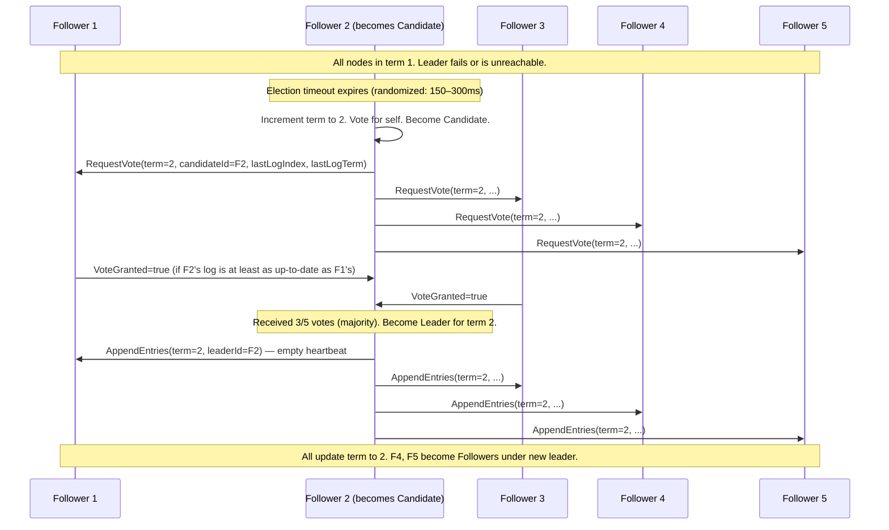

# 3. Raft and Paxos Internals 🟡

> **What you'll learn:**
> - The core problem of distributed consensus and why it is provably hard (FLP Impossibility)
> - Raft's three sub-problems: Leader Election, Log Replication, and Safety — in enough detail to trace a cluster through a network partition
> - How Paxos solves the same problem with a different role structure, and why Raft's comparative understandability is a design feature, not a coincidence
> - Split-brain scenarios: how they arise, how consensus algorithms prevent them, and what happens when they don't

---

## The Fundamental Problem: Agreement Under Failure

Distributed consensus is the problem of getting a group of nodes to agree on a single value (or a sequence of values) in the presence of node failures and network partitions. This seems simple but is provably hard:

**The FLP Impossibility Result (Fischer, Lynch, Paterson, 1985):** In an asynchronous network (where you cannot distinguish a slow node from a failed one), no consensus algorithm can guarantee termination *and* safety simultaneously if even one process may fail.

This is not an engineering limitation — it is a mathematical proof. Practical systems escape FLP by making timing assumptions (timeouts, heartbeats) that turn "may not terminate" into "will terminate eventually with high probability."

## Paxos: The Original Consensus Algorithm

Paxos (Lamport, 1998) was the first widely-adopted consensus algorithm. It uses three roles:

| Role | Count | Responsibility |
|------|-------|---------------|
| **Proposer** | Any node can be a proposer | Initiate proposals with a ballot number; drive consensus |
| **Acceptor** | Typically all nodes | Accept or reject proposals; remember the highest ballot seen |
| **Learner** | Typically all nodes | Learn the agreed-upon value from a quorum of acceptors |

**Classic Paxos (Single-Decree)** runs in two phases:

```
Phase 1a — Prepare(n):
  Proposer sends Prepare(n) to a quorum of Acceptors
  n must be higher than any ballot this Proposer has used before

Phase 1b — Promise(n, accepted_ballot, accepted_value):
  Acceptor promises NOT to accept any ballot < n
  Reports back the highest ballot it has previously accepted, and the value

Phase 2a — Accept(n, v):
  If a quorum promised, Proposer picks v:
    - If any Acceptor reported an accepted value, v MUST be that value
      (safety: respect any previously chosen value)
    - Otherwise, Proposer can pick any value
  Sends Accept(n, v) to all Acceptors

Phase 2b — Accepted(n, v):
  Acceptor accepts if n >= largest Promise it has made
  Notifies all Learners

A value is CHOSEN when a quorum of Acceptors has accepted it.
```

**Paxos's problems in practice:**
- **Multi-Paxos** (for a sequence of values) requires significant additional engineering not described in the original paper
- **Liveness is fragile:** two proposers with different ballot numbers can endlessly pre-empt each other (livelock)
- **Reconfiguration** (changing the set of nodes) is extremely complex
- **Hard to implement correctly:** Chubby (Google's production Paxos) reportedly required significant institutional knowledge to build and maintain

## Raft: Consensus for Understandability

Diego Ongaro's PhD dissertation *"Consensus: Bridging Theory and Practice"* (2014) introduced Raft, designed explicitly to be more understandable than Paxos while providing equivalent correctness guarantees.

Raft decomposes consensus into three sub-problems:

1. **Leader Election** — elect exactly one leader at any time
2. **Log Replication** — the leader accepts log entries and replicates them to followers
3. **Safety** — entries committed by a leader are never overwritten

### Raft State: Every Node Plays One of Three Roles

```
States:
  Follower  — passive; responds to RPCs from leaders and candidates
  Candidate — initiates an election; can become leader
  Leader    — active; handles all client requests; replicates log entries

State Machine:
  All nodes start as Followers.
  If a Follower receives no heartbeat within the election timeout → become Candidate.
  A Candidate that receives a majority of votes → becomes Leader.
  Any node that sees a higher term → immediately reverts to Follower.
```

### Term: Raft's Logical Clock

Raft uses a **term** counter as its logical clock. Each election starts a new term. Terms prevent stale leaders from interfering with newer elections:

```
Term: a monotonically increasing integer
  - Each term begins with an election attempt
  - If a candidate wins, it leads for the rest of the term
  - If no winner (split vote), a new term begins

RPC Rule: If any node receives a message with term T > its own current term,
  it updates its term to T and immediately converts to Follower.
  Messages with term T < current term are rejected.
```

### Leader Election



**Vote granting rules (safety-critical):** A follower grants a vote if:
1. It has not voted for anyone else in this term, AND
2. The candidate's log is at least as up-to-date (by term and index) as the follower's log

The second rule is the **Log Matching Property** that makes Raft's leader election safe.

**Randomized timeouts prevent livelock:** Each node picks a random election timeout (e.g., 150–300 ms). The node that times out first has a head start and usually wins before others start their own elections.

### Log Replication

```
// ✅ FIX: Leader-based replication with write-ahead log
// All writes go through the leader. The leader never applies a
// command until it is committed (replicated to a majority).

Client → Leader: Append(command)
Leader:
  1. Append entry to local log: (term=T, index=N, command)
  2. Send AppendEntries RPC to all followers in parallel
  3. Wait for majority acknowledgment (quorum)
  4. Mark entry as COMMITTED (advance commitIndex)
  5. Apply command to state machine
  6. Return result to client
  7. In next heartbeat/AppendEntries, include new commitIndex
     so followers can advance their own commit index

Follower on AppendEntries:
  - Verify term (reject if stale)
  - Check that the preceding entry in leader's log matches our log
    (Log Consistency Check — ensures no gaps or overwrites)
  - Append new entries
  - If leader's commitIndex > our commitIndex, advance ours and apply
```

**The Log Consistency Check** is the key to Raft's correctness. It ensures the Logs on all nodes that agree up to index N are identical:

```
AppendEntries(term, leaderId, prevLogIndex, prevLogTerm, entries, leaderCommit):
  // Consistency check:
  if log[prevLogIndex].term != prevLogTerm:
    return Failure  // Leader will decrement nextIndex and retry
  // Delete conflicting entries and append new ones
  ...
```

### Why This Prevents Split-Brain

```
// 💥 SPLIT-BRAIN HAZARD: Without consensus, two nodes can both think
//    they are the leader and accept conflicting writes.
//    This is called "split-brain" and leads to data corruption.

// Scenario: 5-node cluster, network partition separates {A, B} from {C, D, E}
// Both sides might elect a leader and accept client writes.
// When partition heals: two divergent histories, data loss or corruption.

// ✅ FIX: Raft's quorum requirement prevents split-brain.
//    A leader can only commit entries when a MAJORITY (>N/2) of nodes
//    acknowledge. In a 5-node cluster, both {A,B} and {C,D,E} cannot
//    simultaneously form a majority (3). Only the larger partition wins.
//    The {A,B} partition cannot commit any new entries — it stalls.
//    When the partition heals, {A,B} see the higher term from {C,D,E}'s
//    leader and revert to followers, replaying the committed log.
```

```
// Quorum table:
// N=3: majority = 2. Can tolerate 1 failure.
// N=5: majority = 3. Can tolerate 2 failures.
// N=7: majority = 4. Can tolerate 3 failures.
// Formula: majority = floor(N/2) + 1, tolerates floor((N-1)/2) failures.
```

### Handling a Network Partition: A Full Trace

Consider a 5-node cluster {A B C D E} with A as leader in term 1:

```
t=0: Leader A in term 1. All logs: [..., (1,10,cmd_x)]
t=1: Network partition: {A, B} isolated from {C, D, E}
t=2: C, D, E: no heartbeat from A. Election timeout fires on C.
t=3: C votes for itself, sends RequestVote to D and E.
t=4: D and E grant votes. C becomes leader for term 2.
t=5: Client sends write to the {A,B} partition.
     A accepts the entry locally (1, 11, cmd_y).
     A sends AppendEntries to B. B acknowledges.
     A waits for majority (needs 3 of 5). Only 2/5 ACKed.
     cmd_y is NEVER COMMITTED. A stalls, cannot return to client.
t=6: Another client sends write to C (the real leader).
     C appends (2, 11, cmd_z). D and E ACK. 3/5 reached. COMMITTED.
t=7: Partition heals. A receives heartbeat from C with term=2.
     A sees term 2 > term 1. A immediately steps down (becomes Follower).
     C sends the authoritative log to A and B.
     A and B discover that their uncommitted entry (1, 11, cmd_y)
     conflicts with committed (2, 11, cmd_z). They truncate and overwrite.
     Uncommitted writes in {A,B} are LOST. This is correct — no client
     was told these writes succeeded.
```

## Raft vs Paxos vs ZAB: Comparison

| Property | Raft | Multi-Paxos | Zab (ZooKeeper) |
|----------|------|-------------|-----------------|
| Leader-based | Yes | Yes (optional, but common) | Yes (primary-backup) |
| Log ordering | Strong (log entries in order) | Flexible (holes allowed) | Strong |
| Understandable spec | ✅ Very (40-page paper) | ❌ No (many implicit assumptions) | Medium |
| Reconfiguration | Joint consensus or single-server changes | Complex, many extensions | Dynamic reconfiguration |
| Liveness mechanism | Randomized election timeouts | Competing proposers (livelock risk) | Leader re-election |
| Snapshot/log compaction | Built-in | Application responsibility | Built-in (fuzzy snapshots) |
| Used by | etcd, CockroachDB, TiKV, Consul | Google Chubby, Spanner, many others | ZooKeeper, Kafka (KRaft) |

## Performance Characteristics

```
Normal operation (no failure):
  Write latency  = 1 RTT (leader → followers → commit → leader responds to client)
  Read latency   = 0 RTT if reading from committed state on leader
                   Without precautions, followers can serve stale reads (use leader reads
                   or ReadIndex to prevent this)
  Throughput     = Bottlenecked by leader's network bandwidth and fsync rate

Under leader failure:
  Downtime       = election timeout + 2-3 RTTs ≈ 150-500ms typically
  Write loss     = 0 (uncommitted entries are cleaned up on partition heal)
  Read anomalies = Possible if serving reads from followers during leader change

Cluster sizes:
  3 nodes  = tolerate 1 failure, 2 RTTs for quorum
  5 nodes  = tolerate 2 failures, 2 RTTs for quorum (across 3 of 5)
  7 nodes  = tolerate 3 failures, 2 RTTs for quorum
  > 7 nodes = diminishing returns; performance degrades before safety improves
```

---

<details>
<summary><strong>🏋️ Exercise: Trace a Raft Election Through a Partition</strong> (click to expand)</summary>

**Problem:** You have a 5-node Raft cluster running in a single datacenter: nodes {N1, N2, N3, N4, N5}. N1 is the leader in term 3. The log has 20 committed entries and 1 uncommitted entry (N1 sent it but only N2 acknowledged before the partition).

**Scenario:** A network partition occurs, causing {N1, N2} to become isolated from {N3, N4, N5}.

Answer the following:

1. What happens to the uncommitted entry in {N1, N2}'s log?
2. How does {N3, N4, N5} elect a new leader? Which node is preferred?
3. N4 wins the election in term 4. A client sends a write to the original leader N1. What happens?
4. The partition heals 5 minutes later. Describe precisely how the cluster reconciles.
5. An engineer suggests adding N6 to the cluster while the partition is ongoing. What dangers does this introduce?

<details>
<summary>🔑 Solution</summary>

**1. The uncommitted entry in {N1, N2}:**

The entry (term=3, index=21) is on N1 and N2's logs but was never committed (only 2 of 5 nodes have it — not a majority). N1 continues sending AppendEntries to N3/N4/N5 but receives no response. After the election timeout fires on the other side, N1 receives no heartbeat acknowledgments from a majority and stops committing new entries. The uncommitted entry **lingers** on N1 and N2's logs during the partition. It will be cleaned up on partition heal.

**2. Election in {N3, N4, N5}:**

After the election timeout (150–300 ms), one of N3/N4/N5 starts an election. **The node with the most up-to-date log is preferred** — it will be the first to get votes. Since all three have the same committed log (index 20, term 3) and none have the uncommitted entry (it was only on N1 and N2), any of them can win. The first to time out sends RequestVote with (term=4, lastLogIndex=20, lastLogTerm=3). They need 2 of the other 2 votes — a majority of 3 — so whichever fires first wins (assuming no concurrent elections).

**3. Client write to N1 during partition:**

N1 believes it is still the leader (it hasn't seen a higher term). It accepts the write, appends it to the log, and sends AppendEntries to all nodes. It only hears back from N2 (1 follower + 1 leader = 2 of 5). Since 2 < majority(3), **the write is never committed**. N1 will not return a success to the client. If the client uses a timeout and retries, it should route to the current leader (discovery via cluster membership). The client will eventually time out waiting for N1.

**4. Partition heals — reconciliation:**

- N4 (term=4 leader) sends a heartbeat to all nodes.
- N1 receives a heartbeat with term=4. Since 4 > 3, N1 immediately steps down to Follower and updates its term to 4.
- N2 does the same.
- N4 discovers that N1 and N2 have entries at index 21 (with term=3) that conflict with or follow the committed log (index 20). N4's log: committed up to index Z (whatever was committed during the partition window), all entries in term 4.
- N4 sends AppendEntries to N1 and N2 with prevLogIndex and prevLogTerm. The consistency check fails (N1/N2 have a stale entry). N4 decrements `nextIndex[N1]` and retries until finding the divergence point (index 20).
- N1 and N2 **truncate their logs** at the divergence point (they delete the uncommitted entry at index 21 with term=3) and replay N4's entries from index 21 onward.
- Clients whose writes were stuck on N1 receive no response (timeout) and should retry via the new leader. **No committed writes are lost. Only uncommitted writes are discarded — and the clients were never told they succeeded.**

**5. Adding N6 during the partition — dangers:**

This is extremely dangerous for two reasons:
- **Changing quorum size during a partition:** If N6 joins the {N3, N4, N5} partition, it changes the cluster size from 5 to 6. Majority of 6 = 4. Now {N3, N4, N5} + N6 have only 4 of 6 nodes — barely a majority. One more failure loses quorum entirely.
- **Joint consensus is required:** Raft's safe configuration change algorithm requires a joint consensus phase where BOTH the old configuration and the new configuration must agree before switching. If this is bypassed (directly switching to 6-node config while partitioned), you risk two leaders in different configurations simultaneously.
- **Recommendation:** Pause configuration changes during partitions. Wait for full cluster health before adding nodes.

</details>
</details>

---

> **Key Takeaways:**
> - **Consensus is provably hard (FLP).** Practical systems use randomized timeouts to escape the FLP impossibility with high probability.
> - **Raft decomposes consensus** into Leader Election, Log Replication, and Safety — three independently understandable sub-problems. The Leader Election uses randomized timeouts; Log Replication uses a quorum write; Safety is guaranteed by the log matching property.
> - **Quorum prevents split-brain.** In a 5-node cluster, both sides of a partition cannot simultaneously form a majority (3). The smaller side stalls; the larger side elects a new leader and continues.
> - **Uncommitted writes are always safe to discard** — by definition, no client was told they succeeded. Only committed writes (majority-acknowledged) are durable.
> - **Raft's performance bottleneck is the leader.** All writes go through one node (the leader). Horizontal write scaling requires partitioning the keyspace across multiple Raft groups (which is exactly what etcd, CockroachDB, and TiKV do).

> **See also:** [Chapter 2: CAP Theorem and PACELC](ch02-cap-theorem-and-pacelc.md) — Raft makes a system CP (consistent but unavailable during partition) | [Chapter 4: Distributed Locking and Fencing](ch04-distributed-locking-and-fencing.md) — how Raft-based systems like etcd are used to implement distributed locks safely
