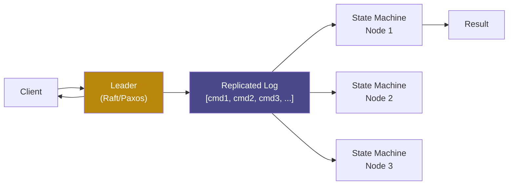
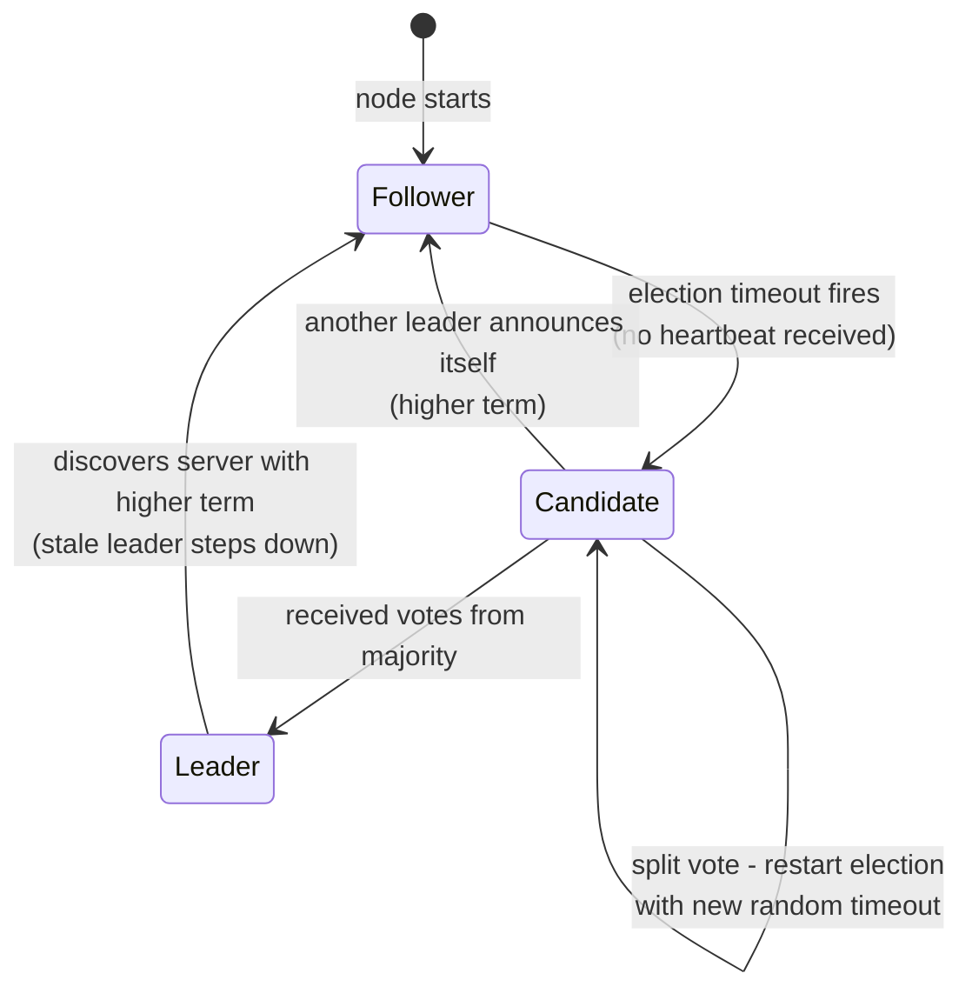
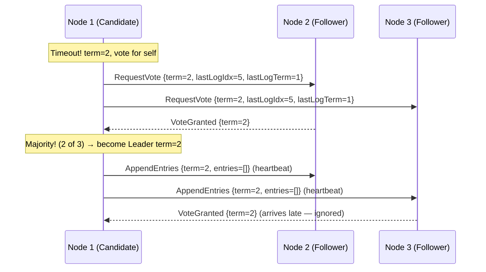
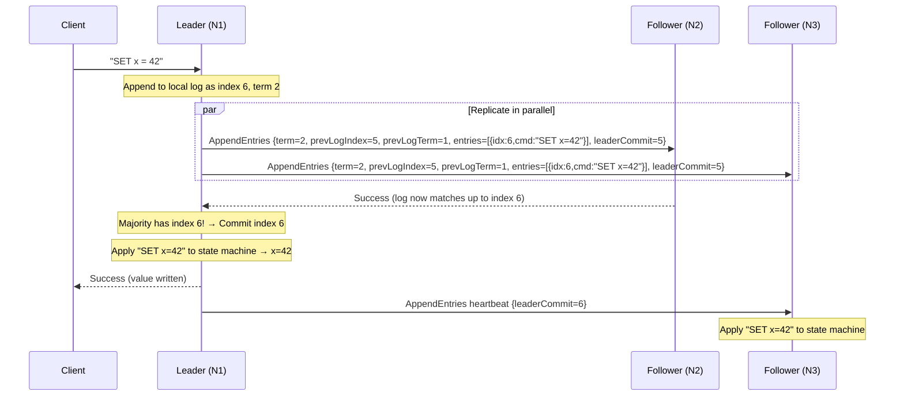
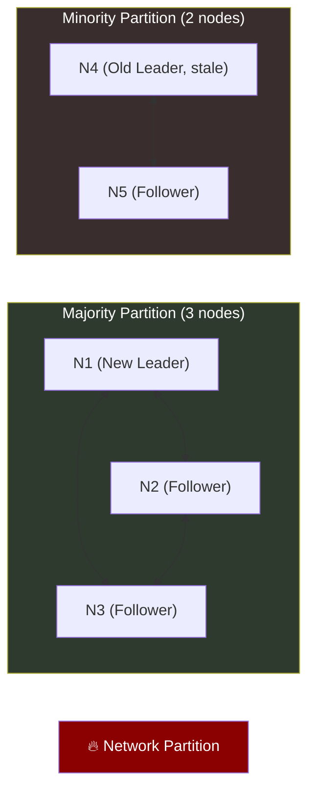

# 3. Raft and Paxos Internals 🟡

> **What you'll learn:**
> - The fundamental problem of distributed consensus and why it's non-trivial
> - The complete Raft algorithm: leader election, log replication, and the safety properties that make it correct
> - How Raft handles network partitions, split votes, and leader crashes without data loss
> - Where Paxos came first and why Raft is preferred for implementations — and where they differ structurally

---

## The Consensus Problem

**Consensus** is the problem of getting a group of nodes to agree on a single value, even when some nodes fail or messages are lost. This may sound simple, but it carries enormous implications:

- A **replicated state machine** (the foundation of every CP database) requires consensus on the order of operations
- A **distributed lock** requires consensus on who holds it
- A **leader election** requires consensus on who is the leader
- A **distributed transaction** requires consensus that all participants committed

The FLP impossibility theorem (Fischer, Lynch, Paterson, 1985) proves that in a purely asynchronous system, no deterministic algorithm can guarantee consensus if even one node may crash. Real-world consensus algorithms work around this by introducing **randomized timeouts** (Raft) or **using partial synchrony assumptions** (Paxos).

## Replicated State Machines: The Architecture

Both Raft and Paxos are typically used to build **Replicated State Machines (RSM)**:



The key invariant: **if every node starts in the same state and applies the same sequence of commands, they will end in the same state.** The consensus algorithm ensures all nodes agree on the log entries in the same order.

## Raft: The Understandable Consensus Algorithm

Raft was designed with a single explicit goal: understandability. It decomposes consensus into three relatively independent sub-problems:

1. **Leader election** — selecting exactly one leader per term
2. **Log replication** — the leader accepts log entries and replicates them
3. **Safety** — ensuring no two nodes ever apply different commands for the same log index

### Raft State Machine

Every Raft node is always in one of three states:



### Persistent State on Every Node

```
currentTerm  — latest term server has seen (incremented on election start)
votedFor     — candidateId this server voted for in current term (null if none)
log[]        — log entries; each has (index, term, command)
```

These three fields **must be written to stable storage before responding** to any RPC. If a node crashes mid-election or mid-replication and these aren't persisted, it could vote twice in the same term or forget committed entries.

### Phase 1: Leader Election

**Election mechanics:**

```
Leader sends periodic heartbeats (empty AppendEntries RPCs).
If a Follower receives no heartbeat within [150ms, 300ms] (random):
    1. Follower increments currentTerm
    2. Transitions to Candidate
    3. Votes for itself
    4. Sends RequestVote RPCs to all other nodes:
       RequestVote { term, candidateId, lastLogIndex, lastLogTerm }
```

**Vote granting rules (a node grants its vote if ALL are true):**

```
1. candidate.term >= voter.currentTerm
2. voter.votedFor is null OR voter.votedFor == candidate.id (in this term)
3. candidate's log is at least as up-to-date as voter's log:
   - candidate.lastLogTerm > voter.lastLogTerm, OR
   - candidate.lastLogTerm == voter.lastLogTerm AND
     candidate.lastLogIndex >= voter.lastLogIndex
```

Rule 3 is the **Election Restriction** — it ensures the winner always has the most complete log. Without it, a candidate with a stale log could win the election and overwrite committed entries when it becomes leader.



**Split Vote and Randomized Timeouts:**

If two nodes start elections simultaneously, neither may achieve majority. Raft resolves this by making each candidate wait a **new random timeout** before restarting. Typically, one candidate's timeout fires first, they get votes before the other candidate restarts, and a leader is elected within one or two rounds.

```
// 💥 SPLIT-BRAIN HAZARD: Fixed election timeout
timeout = 150ms  // Both nodes time out at exactly the same time → infinite split votes

// ✅ FIX: Randomized timeout within a range
timeout = 150ms + random(0, 150ms)  // Statistically, one node fires first in each round
```

### Phase 2: Log Replication

Once a leader is elected, it processes client requests:



**AppendEntries rejection and log correction:**

When a follower's log doesn't match the leader's, `AppendEntries` is rejected and the leader decrements `nextIndex` for that follower, trying earlier entries until finding the point of agreement. The leader then sends all missing entries in a catch-up sequence.

```
// Leader state per follower:
nextIndex[node]  — index of next log entry to send to this node (optimistic, starts at leader's last + 1)
matchIndex[node] — highest log index known to be replicated at this node (confirmed)
```

### Safety: The Raft Guarantees

**Log Matching Property:** If two logs contain an entry with the same index and term, they are identical in all entries up through that index. This is guaranteed because `AppendEntries` includes `prevLogIndex` and `prevLogTerm` — a follower only appends if these match, creating an inductive invariant.

**Leader Completeness:** A leader always contains all committed entries. This follows from the Election Restriction — a candidate can only win if their log is at least as complete as a majority, and a majority always has all committed entries.

**State Machine Safety:** If a server applies log entry N to its state machine, no other server will apply a different entry for index N. Follows from Log Matching + Leader Completeness.

### Handling Network Partitions

Consider a 5-node cluster split into groups of 3 and 2:



What happens:

1. N4 was elected leader in term 1 before the partition
2. N4 can no longer reach a majority → **its writes will never commit** (AppendEntries never gets majority acknowledgment)
3. After election timeout, N1, N2, or N3 starts a new election in term 2
4. The winner (say N1) becomes leader of the majority partition
5. Clients connected to N4 try to write → N4 accepts the entries locally but **cannot commit them** without majority acknowledgment → N4 must return an error or time out to clients
6. When the partition heals, N4 receives AppendEntries from N1 (term 2 > term 1) → N4 immediately steps down → its uncommitted entries are overwritten

```
// 💥 SPLIT-BRAIN HAZARD: Old leader accepts writes during partition
N4 returns "success" to clients for uncommitted writes
These writes are later overwritten when partition heals → SILENT DATA LOSS

// ✅ FIX: Raft's commit rule
A leader ONLY commits an entry after it is replicated to a majority.
If majority cannot be reached, the entry is NOT committed and the client gets no success response.
The client must retry (ideally against the new leader discovered via redirect).
```

### Leader Leases: Optimizing Reads

By default, Raft reads require contacting a majority (or going through the leader, who must confirm leadership with a heartbeat round). This adds latency. Raft can be optimized with **leader leases**:

```
Leader tracks: last time a majority acknowledged its heartbeat.
If (now - last_majority_heartbeat) < election_timeout:
    Leader is GUARANTEED to be the only leader (no other could have been elected yet)
    → Can serve reads directly without quorum round-trip
```

This is valid because other nodes can only elect a new leader after their election timeout, which is longer than the lease window. etcd uses leader leases (called "read linearizability via leader") for this optimization.

## Paxos vs. Raft: The Key Differences

| Dimension | Paxos (Multi-Paxos) | Raft |
|-----------|---------------------|------|
| **Origin** | Lamport, 1989 (published 1998) | Ongaro & Ousterhout, 2014 |
| **Design goal** | Theoretical correctness | Understandability + implementation |
| **Log holes** | Allowed (gaps in the log) | Not allowed (strictly sequential) |
| **Leader election** | Implicit in Phase 1; any node can propose | Explicit; only one leader per term |
| **Log replication** | Phase 1: Prepare, Phase 2: Accept | AppendEntries RPC |
| **Membership changes** | Not specified; left to implementer | Joint consensus or single-server changes |
| **Implementation guidance** | Minimal; many details underspecified | Full algorithm specified |
| **Notable users** | Google Chubby, some internal Google systems | etcd, TiKV, CockroachDB, RethinkDB |

**Paxos Phase 1 + Phase 2 (Single Decree Paxos):**

```
Phase 1 - Prepare:
    Proposer sends Prepare(n) to majority acceptors
    Acceptors: if n > any_promised_n, reply Promise(n, last_accepted_value)
               else: ignore

Phase 2 - Accept:
    If Proposer receives promises from majority:
        If any promise included an accepted value, use highest-numbered one
        Else: use own proposed value
        Send Accept(n, value) to majority
    Acceptors: if n >= promised_n, accept and reply Accepted(n)
```

The "use highest-numbered accepted value" rule is Paxos's safety mechanism — it ensures a value that was previously accepted by a majority is not overwritten.

**Why Raft became dominant for new systems:**

1. Paxos leaves too many implementation details unspecified (leader election strategy, log compaction, client interaction, membership changes)
2. Different Paxos implementations diverge significantly, making them hard to reason about
3. Raft's strict leader-based model makes reasoning about safety much simpler
4. Raft's paper includes a complete TLA+ specification and was designed with correctness proofs alongside the algorithm

<details>
<summary><strong>🏋️ Exercise: Raft Election Failure Analysis</strong> (click to expand)</summary>

**Scenario:** You operate a 5-node Raft cluster (N1–N5). The current leader is N3 (term=4). The following events occur simultaneously:

1. N3 crashes (hard crash — no graceful shutdown)
2. A network partition isolates N4 and N5 from N1, N2, and N3's last-known state
3. N1 and N2 have log indices up to 100 (all committed)
4. N4 has log indices up to 97 (last 3 entries not yet replicated to N4)
5. N5 has log indices up to 100

After the crash, elections begin. Assume election timeouts:
- N1: 210ms
- N2: 280ms
- N4: 175ms (fires first in minority partition)
- N5: 195ms

**Questions:**
1. Can N4 become the new leader of the full cluster?
2. What happens in the minority partition (N4+N5)?
3. Which node wins the election in the majority partition (N1+N2+N5)?
4. What happens to N4 when the partition heals?
5. Describe what a client should do if it was writing to N3 when it crashed.

<details>
<summary>🔑 Solution</summary>

**Q1: Can N4 become the new leader of the full cluster?**

No. N4 can win the minority partition election, but it cannot win a global election because:
- N4 has log indices up to 97, N1/N2/N5 have up to 100
- For N4 to receive votes from N1 or N2, its log must be at least as up-to-date as theirs
- N4's lastLogIndex (97) < N1's lastLogIndex (100) → N1 and N2 will reject N4's RequestVote
- Without N1 or N2's vote, N4 can win at most 2 votes (itself + N5) — not a majority of 5

**Q2: What happens in the minority partition (N4+N5)?**

N4 times out first (175ms), starts election in term 5:
- N4 votes for itself
- N4 sends RequestVote to N5: {term=5, lastLogIndex=97, lastLogTerm=?}
- N5 has lastLogIndex=100, so N5's log is more up-to-date → N5 **rejects** N4's vote request
- N4 cannot get majority (needs 3 of 5 total, only has itself)
- N5 times out (195ms), starts election in term 5 (or 6 if N4 already used 5):
  - N5 votes for itself, requests vote from N4
  - N4's log (97) is less up-to-date than N5's (100) → N4 might grant vote (if N5's log is better)
  - Even if N4 votes for N5, N5 only has 2 votes — not a majority of 5
- **Result:** No new leader elected in minority partition. Both nodes repeatedly time out and restart elections without achieving majority.

**Q3: Which node wins the majority partition (N1+N2+N5)?**

N5 times out at 195ms (after N4 at 175ms, but N4 is isolated):
- Actually, in the majority partition (N1+N2+N5), the timeouts are N1=210ms, N2=280ms, N5=195ms
- N5 times out first at 195ms in term 5
- N5's log (index=100) is as up-to-date as N1's (100) and N2's (100) → all will grant vote
- N5 receives votes from N1 and N2 → 3 votes (majority of 5)
- **N5 becomes the new leader in term 5**

**Q4: What happens to N4 when the partition heals?**

1. N5 (now leader, term 5) sends heartbeat AppendEntries to N4 with term=5
2. N4 sees term 5 > its current term → immediately reverts to Follower
3. N5 discovers N4's log ends at index 97 → sends entries 98, 99, 100 to N4
4. N4 appends the missing entries and acknowledges
5. N4 is now fully caught up and participating as a follower

Note: Any entries N4 accepted during the partition that weren't committed (N4 couldn't form a majority even in the partition) are simply overwritten by N5's catch-up replication.

**Q5: What should the client do after N3 crashes?**

The client should implement **idempotent retry with leader discovery:**

```
On request timeout or connection error:
    1. Wait a brief jitter period (50-100ms)
    2. Query all known cluster members for current leader via RedirectToLeader response
    3. Retry the request against the new leader, with the same idempotency key
    4. If the request was "already committed" (idempotency check succeeds), return success
    5. If not committed, the new leader processes it fresh
```

Key: The write to N3 was NOT committed (N3 crashed before sending it to a majority). The client should receive a timeout or error. The idempotency key ensures that if the client retried against N3 just before the crash AND the write actually made it to a majority before the crash (edge case), the new leader will detect the duplicate and not re-apply the operation.
</details>
</details>

---

> **Key Takeaways**
> - Raft decomposes consensus into leader election, log replication, and safety — each independently analyzable
> - The Election Restriction (vote only for candidates whose log is at least as complete) is the key safety invariant
> - A Raft leader only commits entries replicated to a majority — minority partition leaders cannot commit writes, preventing split-brain data corruption
> - Paxos and Raft solve the same problem; Raft is preferred for new implementations because it is fully specified and more understandable
> - Leader leases enable read optimization by eliminating quorum round-trips for linearizable reads

> **See also:**
> - [Chapter 2: CAP Theorem and PACELC](ch02-cap-theorem-and-pacelc.md) — Why consensus-based systems (CP) refuse requests during partitions
> - [Chapter 4: Distributed Locking and Fencing](ch04-distributed-locking-and-fencing.md) — Using etcd (Raft-backed) for distributed coordination
> - [Chapter 6: Replication and Partitioning](ch06-replication-and-partitioning.md) — Leaderless replication as an AP alternative to Raft
