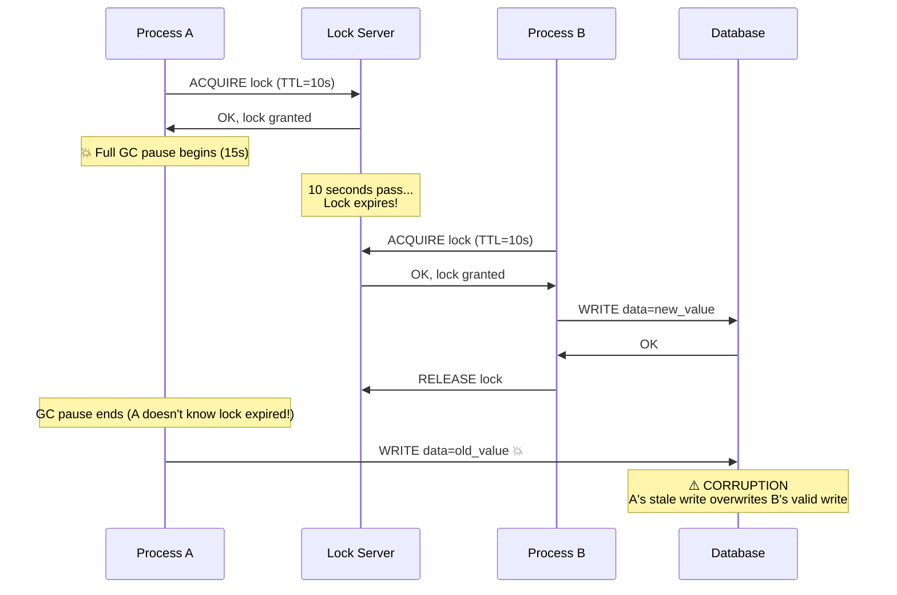
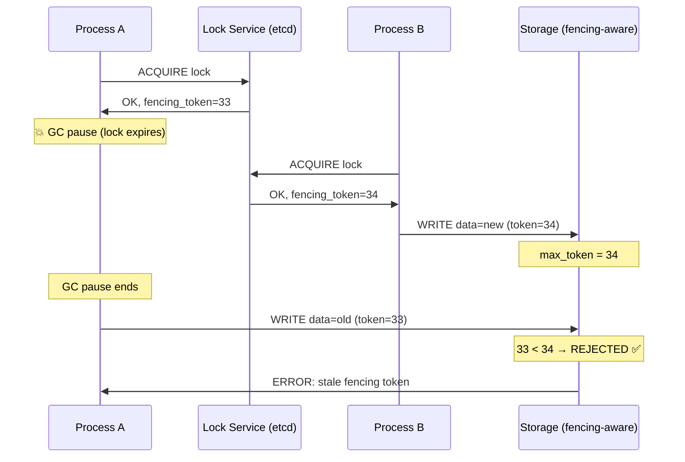

# 4. Distributed Locking and Fencing 🔴

> **What you'll learn:**
> - Why distributed locks are fundamentally harder than local mutexes—and the specific failure modes (GC pauses, process stalls, clock drift) that break them.
> - Martin Kleppmann's devastating critique of the Redlock algorithm and why Redis-based locks are unsafe for strict correctness.
> - How lease-based locking with etcd or ZooKeeper provides linearizable mutual exclusion via consensus.
> - The **fencing token** pattern: the only reliable way to prevent "zombie" processes from corrupting shared resources after their lock has expired.

**Cross-references:** Depends on consensus from [Chapter 3](ch03-raft-and-paxos-internals.md). Fencing tokens are critical for distributed transactions in [Chapter 7](ch07-transactions-and-isolation-levels.md). The capstone project in [Chapter 9](ch09-capstone-global-kv-store.md) uses these patterns for metadata coordination.

---

## Why Distributed Locks Are Hard

A local mutex protects shared memory within a single process. If the process crashes, the OS reclaims everything—the lock, the protected resource, the corrupt state. Clean, simple, safe.

A distributed lock protects a shared resource across multiple processes on multiple machines. The failure modes are fundamentally different:

| Failure Mode | What Happens | Why Local Mutexes Don't Have This Problem |
|---|---|---|
| **Process pause (GC, VM stall)** | Process A holds the lock, gets paused for 30 seconds by a GC storm. Lock expires. Process B acquires the lock and writes. Process A resumes and writes—**without knowing the lock expired**. | Local mutexes don't expire. |
| **Network partition** | Process A holds the lock but is partitioned from the lock server. Lock expires on the server. Process B acquires it. A still thinks it holds the lock. | No network between thread and mutex. |
| **Clock drift** | Lock TTL is 10 seconds. Process A's clock is 3 seconds slow. A thinks it has 7 seconds remaining; the server thinks it expired 3 seconds ago. | No TTL on local mutexes. |
| **Split-brain lock server** | Two Redis primaries (after failover) both think they're authoritative. Both grant the same lock to different processes. | Single memory space. |



---

## The Redlock Controversy

Redis's creator (Salvatore Sanfilippo) proposed **Redlock**: acquire locks on N/2+1 independent Redis instances. If a majority grants the lock within a short window, you hold it.

### How Redlock Works

```
1. Get current time T1.
2. Try to acquire the lock on all N Redis instances sequentially (short timeout per instance).
3. Compute elapsed time: elapsed = now() - T1.
4. Lock is acquired iff:
   a. Majority (N/2 + 1) granted the lock, AND
   b. Remaining TTL (lock_ttl - elapsed) is still positive.
5. If lock fails, release it on all instances.
```

### Kleppmann's Critique (2016): "How to Do Distributed Locking"

Martin Kleppmann identified fundamental problems:

**Problem 1: Process pauses defeat the TTL.**
Even if the lock is valid when acquired, a GC pause between acquiring the lock and using the protected resource can cause the TTL to expire. The process doesn't know.

**Problem 2: Redlock depends on synchronized clocks.**
The algorithm assumes that N/2+1 Redis instances have clocks that agree within bounds. If one instance's clock jumps forward (NTP step correction), it will expire the lock early, breaking the majority guarantee.

**Problem 3: No fencing mechanism.**
Redlock returns a lock token (a random string), but there is no mechanism to use this token to *prevent* a stale lock-holder from writing. The storage system doesn't know about Redlock.

### When Is Redis Locking Acceptable?

| Use case | Redis lock safe? | Why |
|---|---|---|
| **Efficiency** — preventing duplicate work (idempotent operations) | ✅ Yes | If two processes accidentally do the same work, the result is correct (just wasteful). |
| **Correctness** — preventing data corruption (financial transactions, overwriting shared state) | ❌ No | A process with an expired lock can corrupt data, and Redlock provides no fencing to prevent this. |

---

## Lease-Based Locking with Consensus (etcd / ZooKeeper)

The correct approach for distributed mutual exclusion is to use a **consensus-backed** lock service:

### etcd Leases

etcd runs Raft internally, so its state is linearizable. An etcd lease:

1. Client creates a lease with a TTL: `lease = client.lease_grant(ttl=10s)`.
2. Client creates a key with that lease attached: `client.put("/locks/my-resource", "holder-A", lease=lease)`.
3. Client keeps the lease alive by periodically sending `lease_keep_alive` heartbeats.
4. If the client crashes or is partitioned, heartbeats stop, the lease expires, and the key is deleted.
5. Other clients watch the key and acquire the lock when it disappears.

**Why this is safe:** etcd's Raft consensus ensures that only one key exists for a given lock path. The linearizable read guarantee means clients can trust the lock state. But **this alone is still not sufficient against process pauses**—we still need fencing.

### ZooKeeper Ephemeral Nodes and Sequential Locks

ZooKeeper provides ephemeral (session-linked) sequential znodes for lock ordering:

```
1. Client creates an ephemeral sequential node:
   /locks/my-resource/lock-0000000042

2. Client reads all children of /locks/my-resource/:
   [lock-0000000040, lock-0000000041, lock-0000000042]

3. If our node is the SMALLEST, we hold the lock.

4. If not, we set a WATCH on the node immediately before ours
   (lock-0000000041) and wait for it to be deleted.

5. When the preceding node's session expires (client crash/disconnect),
   ZooKeeper deletes it, our watch fires, and we check again.
```

This creates a **fair, ordered lock queue** without thundering herd (only the next waiter is woken).

---

## Fencing Tokens: The Real Solution

**Fencing tokens** are the pattern that makes distributed locks actually safe for correctness.

### The Idea

Every time a lock is granted, the lock service issues a **monotonically increasing token** (e.g., the Raft log index, ZooKeeper zxid, or etcd revision). The client includes this token with every write to the protected resource. The resource **rejects writes with tokens lower than the highest token it has seen**.



### Implementing Fencing Tokens

```rust
/// ✅ FIX: A storage client that enforces fencing tokens.
/// Every write must carry a fencing token from the lock service.
/// The storage rejects any write whose token is older than the
/// highest token it has previously accepted.
struct FencedStorage {
    data: HashMap<String, String>,
    max_token: HashMap<String, u64>,
}

impl FencedStorage {
    /// Write a value, but only if the fencing token is valid.
    /// This prevents zombie processes from corrupting data after their
    /// lock has expired and been granted to another process.
    fn write(
        &mut self,
        key: &str,
        value: String,
        fencing_token: u64,
    ) -> Result<(), FencingError> {
        let current_max = self.max_token.get(key).copied().unwrap_or(0);

        if fencing_token < current_max {
            // ✅ Stale token — this process's lock has been superseded.
            return Err(FencingError::StaleToken {
                provided: fencing_token,
                current_max,
            });
        }

        // ✅ Valid token — update the data and record the new max.
        self.max_token.insert(key.to_string(), fencing_token);
        self.data.insert(key.to_string(), value);
        Ok(())
    }
}

#[derive(Debug)]
enum FencingError {
    StaleToken { provided: u64, current_max: u64 },
}
```

### The Naive Monolith Way

```rust
/// 💥 SPLIT-BRAIN HAZARD: Lock-then-write without fencing.
/// If the lock expires between acquire and write (GC pause, slow network),
/// another process can acquire the lock and write first.
/// Our stale write then silently overwrites valid data.
async fn update_balance(redis: &Redis, db: &Database, amount: i64) {
    let lock = redis.set_nx("lock:balance", "me", 10).await; // 💥 No fencing token
    if lock {
        let balance = db.get("balance").await; // 💥 Lock may expire during this call
        db.set("balance", balance + amount).await; // 💥 Stale write if lock expired
        redis.del("lock:balance").await;
    }
}
```

### The Distributed Fault-Tolerant Way

```rust
/// ✅ FIX: Lock with fencing token and conditional write.
async fn update_balance(
    etcd: &EtcdClient,
    db: &FencedDatabase,
    amount: i64,
) -> Result<(), Box<dyn std::error::Error>> {
    // ✅ Acquire lock via etcd lease. The revision acts as fencing token.
    let lease = etcd.lease_grant(10).await?;
    let put_resp = etcd.put_with_lease("/locks/balance", "me", lease.id()).await?;
    let fencing_token = put_resp.header().revision() as u64;

    // Even if we pause here and the lease expires, the fencing token
    // will protect the database from our stale write.
    let balance = db.get("balance", fencing_token).await?;

    // ✅ Conditional write: DB rejects this if a higher token has been seen.
    db.write("balance", (balance + amount).to_string(), fencing_token).await?;

    // Best-effort release. If we crash here, the lease expires automatically.
    let _ = etcd.lease_revoke(lease.id()).await;
    Ok(())
}
```

---

## Comparison: Distributed Lock Approaches

| Approach | Correctness for mutual exclusion | Performance | Operational complexity | When to use |
|---|---|---|---|---|
| **Single Redis `SET NX`** | ❌ No fencing, failover loses locks | Very fast (~1ms) | Low | Efficiency locks (dedup, rate limiting) |
| **Redlock (N Redis instances)** | ❌ Unsafe under clock drift, GC pauses | Fast (~5ms) | Medium (N instances) | Debated; some argue it's sufficient for efficiency |
| **etcd lease + fencing token** | ✅ Linearizable lock, fencing prevents zombies | Moderate (~10–20ms) | Medium (etcd cluster) | Correctness-critical locks |
| **ZooKeeper ephemeral + sequential** | ✅ Linearizable, fair ordering, fencing via zxid | Moderate (~10–30ms) | High (ZK is operationally complex) | Correctness-critical, needs fair ordering |
| **Database advisory lock (`pg_advisory_lock`)** | ✅ Within single DB; fenced by transaction | Low latency (local) | Low | Locks scoped to a single database |

---

<details>
<summary><strong>🏋️ Exercise: The Zombie Writer</strong> (click to expand)</summary>

### Scenario

You are running a distributed cron scheduler. Only one instance should execute each cron job at a time. You use Redis `SET NX` with a 30-second TTL as the lock:

```
Instance A: SET job:daily-report NX EX 30 → OK (lock acquired)
Instance A: Begins running daily-report (expected duration: 10 seconds)
Instance A: Full GC pause lasting 45 seconds begins at T=5s
```

1. What happens at T=35s (lock TTL expires)?
2. What happens when Instance A's GC pause ends at T=50s?
3. Design a solution using fencing tokens. What component must be fencing-aware?
4. What if the cron job writes to an external API (e.g., sends emails) that does NOT support fencing tokens? How do you prevent duplicate emails?

<details>
<summary>🔑 Solution</summary>

**1. At T=35s:** The Redis lock expires. Instance B runs `SET job:daily-report NX EX 30` and succeeds. B begins running the daily report.

**2. At T=50s:** Instance A resumes from GC. It does not know the lock expired. It continues executing the daily report *concurrently* with B. If the job writes to a database, both A and B are writing—potential data corruption. If it sends emails, users get duplicate emails.

**3. Fencing token solution:**

```
- Use etcd (or ZooKeeper) instead of Redis for the lock.
- When acquiring the lock, record the etcd revision as the fencing token.
- The job execution pipeline passes the fencing token to every write operation.
- The DATABASE must be fencing-aware: reject writes with tokens < max_seen_token.

Timeline with fencing:
  A acquires lock, fencing_token=100
  A pauses (GC)
  Lock expires, B acquires lock, fencing_token=101
  B writes to DB with token=101. DB records max_token=101.
  A resumes, writes to DB with token=100.
  DB rejects: 100 < 101. ✅ Data safe.
```

**4. External APIs without fencing support:**

When the downstream system cannot enforce fencing (email APIs, payment gateways), use the **idempotency key** pattern:

```
- Before executing the job, write an idempotency record to a fencing-aware database:
    INSERT INTO executed_jobs (job_id, run_id, fencing_token)
    VALUES ('daily-report', 'run-2024-01-15', 100)
    IF fencing_token >= current_max

- If the insert succeeds, proceed with the external API call.
- If the insert fails (stale token), abort.
- The external API call should also carry the run_id as an idempotency key
  (most payment APIs and well-designed email services support this).
```

This converts the "unfenceable" external operation into a fenceable one by gating it behind a fenced database write. The key insight: **move the fencing check to the earliest possible point, before the unfenceable side effect occurs.**

</details>
</details>

---

> **Key Takeaways**
>
> 1. **Distributed locks must account for process pauses, network partitions, and clock drift.** A lock that expires while the holder is paused is the most common source of distributed data corruption.
> 2. **Redis locks (including Redlock) are unsafe for correctness.** They are fine for efficiency (deduplication, rate limiting) but cannot guarantee mutual exclusion under adversarial conditions.
> 3. **Use consensus-backed lock services** (etcd, ZooKeeper) for correctness-critical mutual exclusion. Their linearizable guarantees come from Raft or ZAB consensus.
> 4. **Fencing tokens are mandatory** for correctness. The lock service issues a monotonically increasing token; the protected resource rejects writes with outdated tokens.
> 5. **If the downstream resource doesn't support fencing**, gate the unfenceable operation behind a fenced database write using an idempotency key.

---

> **See also:**
> - [Chapter 3: Raft and Paxos Internals](ch03-raft-and-paxos-internals.md) — the consensus algorithms that make etcd/ZooKeeper locks linearizable.
> - [Chapter 7: Transactions and Isolation Levels](ch07-transactions-and-isolation-levels.md) — distributed transactions use similar coordination primitives.
> - [Chapter 8: Rate Limiting, Load Balancing, and Backpressure](ch08-rate-limiting-load-balancing-backpressure.md) — Redis locks for efficiency (not correctness) in rate limiting.
