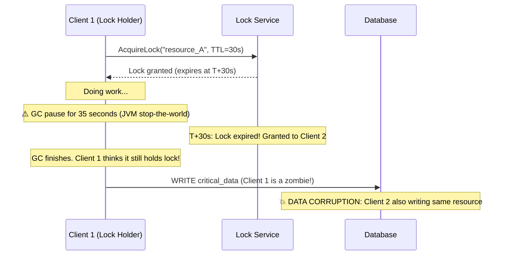
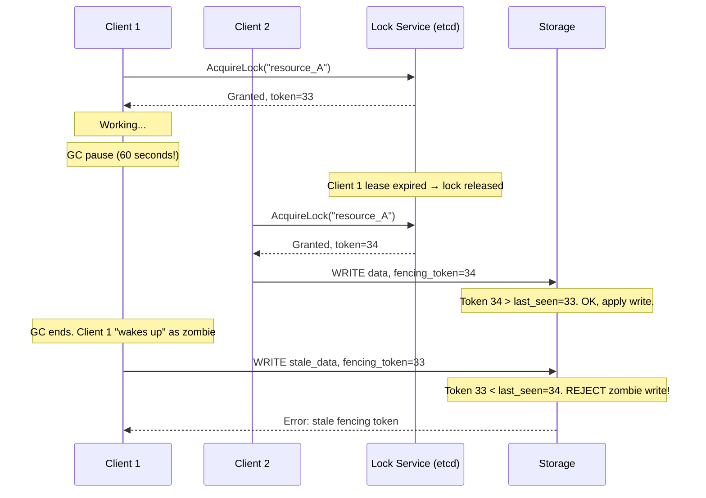

# 4. Distributed Locking and Fencing 🔴

> **What you'll learn:**
> - Why distributed locks are fundamentally harder than single-process locks — and the failure modes that make them dangerous
> - Why Redlock (Redis-based distributed locking) is insufficient for strict safety guarantees
> - How fencing tokens prevent "zombie" processes from corrupting data even when locks are held by crashed nodes
> - How to implement safe distributed coordination using etcd and ZooKeeper leases and leader election primitives

---

## The Problem: Distributed Locks Cannot Rely on Timeouts

In a single-process program, a mutex either grants a lock or blocks. The lock holder either releases it or the process dies, and the OS releases it. There is no ambiguity.

In a distributed system, a "lock" is held by a node that communicates its status via a network. The lock service and the lock holder can disagree about whether the lock is held. Consider:



The root problem: **a process can be paused for longer than its lock TTL** due to:
- JVM/Go GC stop-the-world pauses
- Linux CPU scheduler pre-emption (another process gets the core)
- VM hypervisor pausing the guest for migration
- Network timeout causing the lock holder to not receive its own lease renewal acknowledgment

No lock TTL is safe from this. Even a 100ms lock TTL can be violated by a 101ms GC pause.

## Redlock: The Widely Deployed, Widely Misunderstood Algorithm

Redis's `SET key value NX PX ttl` provides a simple single-node lock. To tolerate a Redis node failure, Salvatore Sanfilippo proposed **Redlock** — acquiring the lock on N independent Redis masters (typically 5):

```
Algorithm:
1. Get current time T1
2. Try to SET lock_key value NX PX ttl on all N masters in parallel
3. Get current time T2
4. Lock is acquired if:
   - Lock was set on N/2+1 masters (majority)
   - (T2 - T1) < TTL (lock validity time not expired)
5. Valid lock window = TTL - (T2 - T1) - clock_drift_margin
6. On failure: DELETE lock_key on all masters

Release: DELETE lock_key on all masters (value must match to prevent deleting another holder's lock)
```

### Why Redlock Is Insufficient for Strict Safety

Martin Kleppmann's thorough analysis (2016) identified several correctness problems:

**Problem 1: Clock Drift Assumption**

Redlock's safety depends on clocks across the 5 Redis masters drifting less than the TTL. But as we established in Chapter 1, NTP provides only millisecond-level accuracy. A lock with a 10-second TTL on a Redis master with an NTP jump forward of 10 seconds can expire immediately after being set.

```
// 💥 SPLIT-BRAIN HAZARD: Redis master clock jumps forward
Client 1 acquires lock on masters 1,2,3 at T=0 with TTL=10s.
Master 2's NTP sync causes it to jump its clock forward by 11s.
Master 2's lock immediately expires (it thinks 11s have passed).
Client 2 acquires lock on masters 2,4,5 — masters 1 and 3 still have Client 1's lock.
Now BOTH Client 1 and Client 2 hold locks on different majorities.
// ✅ FIX: Use a lock service with consensus (etcd/ZooKeeper) not timing
```

**Problem 2: The GC Pause Window Still Exists**

Even if the Redlock algorithm is perfectly implemented, the acquired lock can expire while the process is paused before using it:

```
T=0:   Client acquires Redlock for TTL=30s
T=1:   Client begins critical section preparation
T=32:  JVM GC pause of 31 seconds
T=32:  Lock expired! Another client held the lock from T=30 to now
T=32:  GC finishes. Client thinks lock is held. Corrupts data.
```

No TTL-based lock can prevent this. The solution requires **not relying on the lock expiry** for safety.

**Problem 3: Retrying on Partial Failure Can Violate Mutual Exclusion**

If a client acquires the lock on 3 of 5 masters and then one master crashes and reboots before the TTL expires (forgetting the lock), a second client can acquire the lock on that same master plus others, achieving majority.

By contrast, with consensus-based systems (etcd, ZooKeeper), the lock state is replicated via Raft/Zab — a master that crashes and reboots **does not forget** the lock state, because it is persisted in the replicated log.

## The Correct Solution: Fencing Tokens

A **fencing token** (also called **epoch token** or **monotonic lock token**) is a monotonically increasing integer returned by the lock service each time a lock is granted. The resource being protected validates the token on every write:



The storage layer tracks `max_token_seen` and rejects any write with a token ≤ max. This provides **first-class safety even when the lock holder is a zombie.**

### Implementing Fencing Tokens with etcd

etcd's transaction API provides exactly this via the concept of **revisions** (etcd's global monotonic transaction counter):

```
// Acquire a lock using etcd's STM (Software Transactional Memory)
// or the /v3/lock endpoint:

PUT /lock/resource_A       (with a lease)
→ Revision: 42            (this is our fencing token)

// Every write to storage:
// Include etcd revision 42 as a header / field
// Storage layer validates: revision > last_applied_revision
```

etcd's built-in `/v3/lock` gRPC API returns the key's creation revision, which is guaranteed monotonically increasing — perfect for use as a fencing token.

```rust
// Conceptual fencing token flow in Rust using etcd client
use etcd_client::{Client, LockOptions};

async fn critical_section(client: &mut Client) -> Result<(), Box<dyn std::error::Error>> {
    // Acquire lock — returns a lock key with a monotonically increasing revision
    let lock_resp = client.lock("resource_A", None).await?;
    let fencing_token = lock_resp.header().unwrap().revision();

    // Pass fencing_token to the storage operation
    // Storage MUST reject writes with token <= its last_seen_token
    write_to_storage(data, fencing_token).await?;

    // Always unlock in a finally-equivalent block
    client.unlock(lock_resp.key()).await?;
    Ok(())
}
```

## ZooKeeper: The Consensus-Backed Coordination Service

ZooKeeper uses **Zab** (ZooKeeper Atomic Broadcast), a protocol similar to Raft. It provides a hierarchical namespace of **znodes** (nodes similar to file system entries):

```
/locks
  /locks/resource_A-0000000001   (Client 1's ephemeral sequential node)
  /locks/resource_A-0000000002   (Client 2's ephemeral sequential node)
  /locks/resource_A-0000000003   (Client 3's ephemeral sequential node)
```

**ZooKeeper Lock Recipe:**

```
1. Create ephemeral sequential node: /locks/resource_A-{seq_number}
2. List all children of /locks/resource_A
3. If your node has the LOWEST sequence number → you hold the lock
4. Else: watch the node with the next-lower sequence number
5. When that node is deleted (prior holder released/died) → go to step 2
```

**Why ephemeral nodes?** ZooKeeper automatically deletes ephemeral nodes when the client session expires (due to network partition or process crash). This provides automatic lock release without relying on TTL accuracy.

**Why sequential nodes?** The monotonically increasing sequence number is the fencing token. Writes to protected resources include this number; the resource validates it is the highest seen.

### etcd vs. ZooKeeper: Practical Comparison

| Feature | etcd | ZooKeeper |
|---------|------|-----------|
| **Consensus** | Raft | Zab (similar to Paxos) |
| **API** | gRPC, HTTP/2 | Custom TCP protocol |
| **Watch semantics** | Range watches, version-based | Node watches (one-shot, must re-register) |
| **Language** | Go (single binary) | Java (JVM operational overhead) |
| **Human-readable** | Yes (string keys/values) | Byte arrays |
| **Kubernetes integration** | Native (etcd is K8s store) | Not native |
| **Transactions** | Yes (STM-style compare-and-swap) | Yes (multi-operation zk transactions) |
| **Operational complexity** | Lower | Higher (JVM tuning, GC pauses) |
| **Throughput** | ~10K ops/s | ~10-50K ops/s (ZK has optimised reads) |

**Choose etcd** if you're in a Kubernetes environment or want simpler operations.  
**Choose ZooKeeper** if you need the mature ecosystem (Apache Kafka, HBase, Hadoop rely on it) or need very high read throughput with watch semantics.

## Building a Correct Distributed Lock Library

Pulling together everything above, here's the template for a production-safe distributed lock:

```rust
// ✅ Production-safe distributed lock: fencing tokens + consensus backing

pub struct DistributedLock {
    etcd_client: Client,
    lock_key: String,
    lease_ttl: Duration,
}

pub struct LockGuard {
    lock_key: Bytes,
    fencing_token: i64,    // etcd revision — monotonically increasing
    etcd_client: Client,
}

impl DistributedLock {
    pub async fn acquire(&mut self) -> Result<LockGuard, LockError> {
        // 1. Create a lease with a conservative TTL (consider GC pause worst-case)
        let lease = self.etcd_client
            .lease_grant(self.lease_ttl.as_secs() as i64, None)
            .await?;

        // 2. Acquire lock with the lease — lock is auto-released if we die
        let lock_resp = self.etcd_client
            .lock(&self.lock_key, Some(LockOptions::new().with_lease(lease.id())))
            .await?;

        // 3. The creation revision IS the fencing token
        let fencing_token = lock_resp.header().unwrap().revision();

        // 4. Start async lease keepalive in background
        let (_, keepalive_stream) = self.etcd_client
            .lease_keep_alive(lease.id())
            .await?;
        tokio::spawn(async move {
            // Send keepalive every TTL/3 seconds
            // If this task dies (process crash), lease expires → lock released
        });

        Ok(LockGuard {
            lock_key: lock_resp.key().to_owned().into(),
            fencing_token,
            etcd_client: self.etcd_client.clone(),
        })
    }
}

impl LockGuard {
    pub fn fencing_token(&self) -> i64 {
        self.fencing_token
    }
}

impl Drop for LockGuard {
    fn drop(&mut self) {
        // Attempt async unlock — best-effort, lease will expire anyway
        let client = self.etcd_client.clone();
        let key = self.lock_key.clone();
        tokio::spawn(async move { let _ = client.unlock(key).await; });
    }
}
```

**The storage side (pseudocode):**

```
// Storage server validates every write:
fn write(key, value, fencing_token):
    current_max = db.get_meta("max_fencing_token_" + key)
    if fencing_token <= current_max:
        return Error::StaleFencingToken { got: fencing_token, expected_min: current_max + 1 }
    db.transact {
        db.set_meta("max_fencing_token_" + key, fencing_token)
        db.put(key, value)
    }
```

<details>
<summary><strong>🏋️ Exercise: Designing a Leader Election Service</strong> (click to expand)</summary>

**Scenario:** You need to add leader election to a fleet of 20 identical worker services. These workers process jobs from a queue. You need exactly one "master" worker at a time to run maintenance tasks (defragmentation, garbage collection, scheduled cache warmup). If the master crashes, a new one must be elected within 10 seconds. 

Requirements:
- No two workers should ever simultaneously believe they are the master
- After a master failure, new master election must complete within 10 seconds
- The worker fleet scales from 5 to 100 workers
- Java workers with up to 3-second GC pauses (worst case observed)

Design the leader election mechanism, including:
1. The election algorithm
2. How you prevent split-brain (two simultaneous masters)
3. How you handle GC pauses longer than the lease TTL
4. The fencing token scheme for the maintenance tasks

<details>
<summary>🔑 Solution</summary>

**1. Election Algorithm: etcd Lease-Based Leader Election**

```
Each worker:
1. Creates an etcd lease with TTL=15 seconds
2. Attempts atomic PUT: key="/master-lock", value=my_worker_id, lease=my_lease
   (using etcd transactions: IF key not exists THEN PUT)
3. If success: worker is now master
4. If failure: someone else is master
   → watch "/master-lock" for deletion
   → when deleted: go back to step 2 (race to acquire)
5. Master sends lease keepalive every 5 seconds (TTL/3)
```

**2. Preventing Split-Brain**

Split-brain is prevented by etcd's Raft consensus:
- The PUT is only accepted if etcd has a quorum (majority of etcd nodes)
- A partitioned etcd minority cannot accept writes → cannot grant lock to a second master
- etcd's linearizable writes mean at most one worker's PUT succeeds per term

The fencing token = the etcd creation revision of "/master-lock":
```
PUT /master-lock → revision=1047   ← this is the fencing token for Worker A
DELETE /master-lock
PUT /master-lock → revision=1089   ← this is the fencing token for Worker B
```
Revision is strictly monotonically increasing. Worker A (zombie) presents token 1047 to storage; Worker B has 1089. Storage rejects A's writes.

**3. Handling GC Pauses > Lease TTL**

Key insight: the lease TTL must be > worst-case GC pause, but that conflicts with fast failover.

Tiered approach:
- Lease TTL = 30 seconds (must be > 3s GC pause with substantial margin)
- Keepalive interval = 10 seconds (TTL/3)
- Failover time ≤ TTL = 30 seconds (not 10s as desired — trade-off!)
- For the 10-second requirement: reduce TTL to 12s, accept risk of false failover on 3s GC pauses

OR: eliminate JVM GC pauses with ZGC/Shenandoah (sub-millisecond pauses) and use TTL=5s:
```
-XX:+UseZGC -XX:SoftMaxHeapSize=4g
```
With ZGC observed worst-case pauses <1ms, TTL=5s is safe and gives 5s failover.

**4. Fencing Token for Maintenance Tasks**

Each maintenance task writer includes the current master's fencing token:

```java
public void runMaintenance(DatabaseClient db) {
    long fencingToken = etcdLease.getRevision();  // master lock's creation revision
    
    db.executeWithFence("""
        BEGIN;
        -- Validate we're still the rightful master
        IF current_master_token() >= ? THEN ABORT; END IF;
        UPDATE master_metadata SET token=? WHERE token < ?;
        -- Run maintenance work
        DELETE FROM expired_cache WHERE expiry < NOW();
        COMMIT;
    """, fencingToken, fencingToken, fencingToken);
}
```

The database stores `current_master_token` and only executes writes from the current token holder. A zombie master with a stale token gets an ABORT.

**Summary of the complete design:**
```
etcd (3-node cluster) ← provides consensus + monotonic tokens
   ↓ lease + lock
Worker fleet (5-100 nodes) ← race to acquire "/master-lock"
   ↓ fencing token included in every write
Database / Storage ← validates token on every maintenance operation
```
</details>
</details>

---

> **Key Takeaways**
> - Distributed locks based on timeouts (including Redlock) cannot guarantee mutual exclusion because lock holders can be paused longer than their TTL
> - **Fencing tokens** (monotonically increasing integers from a consensus service) are the correct mechanism: storage rejects writes from stale token holders
> - etcd and ZooKeeper provide lock services backed by consensus (Raft/Zab), making them safe for coordination even during network partitions
> - Ephemeral nodes (ZooKeeper) and leases (etcd) provide automatic lock release on process death without relying on the process to explicitly unlock
> - The TTL must be set conservatively (> worst-case GC pause) — this directly determines your failover time

> **See also:**
> - [Chapter 3: Raft and Paxos Internals](ch03-raft-and-paxos-internals.md) — The consensus algorithm that makes etcd/ZooKeeper safe
> - [Chapter 7: Transactions and Isolation Levels](ch07-transactions-and-isolation-levels.md) — Fencing tokens combined with MVCC for distributed transaction safety
> - [Chapter 9: Capstone: Global Key-Value Store](ch09-capstone-global-key-value-store.md) — Leader election in the context of a Dynamo-style system
