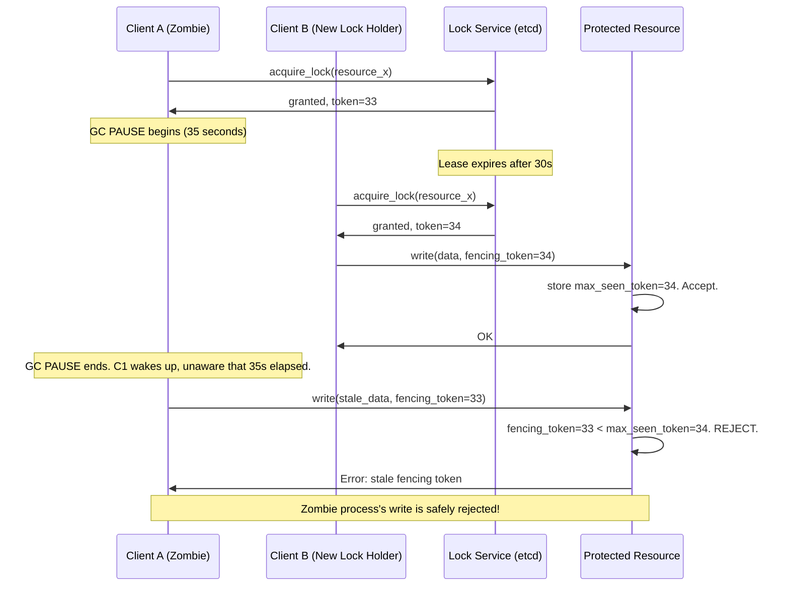

# 4. Distributed Locking and Fencing 🔴

> **What you'll learn:**
> - Why the most popular distributed lock implementation (Redlock) fails under the exact scenarios where locks are most needed
> - How lease-based distributed locks (etcd, ZooKeeper) provide stronger guarantees
> - The **fencing token** pattern that makes distributed locks safe even when clients are paused by GC or preempted by the OS
> - How to design a distributed lock service that remains correct under all failure modes

---

## Why Distributed Locking Is Harder Than It Looks

In a single process, mutexes work simply: lock, do work, unlock. The OS guarantees that only one thread holds the lock at a time, and if the process dies, the lock is released automatically.

Distributed locking breaks all three of these guarantees:

1. **"Only one holds the lock"** — a process can be paused (GC, VM migration) and *think* it still holds the lock while the lease has expired and another process has acquired it
2. **"Lock is released on death"** — a zombie process (paused, not dead) will not release the lock; a crashed lock server may lose lock state
3. **"Atomicity"** — acquiring and using a lock involves at least two network round trips; a network partition can occur between them

```
// 💥 SPLIT-BRAIN HAZARD: The classic lock-then-write pattern
//    in a distributed setting.

let lock = redis.set("lock:resource_x", my_id, NX, PX, 30000)?;
// ... now do something important with resource_x ...
// Meanwhile: GC pauses this process for 35 seconds.
// Lock expires after 30 seconds. Another process acquires it.
// THIS process wakes up, STILL THINKS it holds the lock.
resource_x.write(my_data);  // 💥 TWO PROCESSES WRITING SIMULTANEOUSLY
redis.del("lock:resource_x");  // Deletes the OTHER process's lock!
```

This scenario is not theoretical. GC pauses of 30+ seconds occur in JVM applications. VM live-migration can pause a process. The kernel can preempt a process at any instruction boundary.

## Redlock: Why It Is Not Safe for Strong Correctness

Redlock, proposed by Redis's creator Salvatore Sanfilippo, is the most widely used distributed lock algorithm. It uses multiple Redis instances to avoid single-point-of-failure:

```
// Redlock Algorithm (pseudocode)
const N_REDIS = 5;     // must be odd, independent Redis instances
const QUORUM = 3;      // ceil(N/2) + 1

fn acquire(resource, ttl):
    let start = now_ms()
    let acquired = 0
    
    for redis in all_redis_instances:
        // NX = only set if not exists (atomic)
        if redis.set(resource, unique_id, NX, PX=ttl):
            acquired += 1
    
    let elapsed = now_ms() - start
    let validity = ttl - elapsed - clock_drift_margin
    
    if acquired >= QUORUM and validity > 0:
        return Lock { validity, unique_id }
    else:
        // Failed: release on any instance that was acquired
        for redis in all_redis_instances:
            if redis.get(resource) == unique_id:
                redis.del(resource)
        return None
```

### Redlock's Fatal Flaw: Clock Drift and Process Pauses

Martin Kleppmann's critique (2016) identified the core problem. Even with 5 Redis nodes, Redlock is unsafe because:

**Scenario 1: GC Pause**
```
t=0:  Process A acquires Redlock successfully. Validity = 30s.
t=1:  Process A begins writing to storage.
t=25: GC pause begins on Process A.
t=33: GC pause ends. Process A resumes.
      But the Redlock EXPIRED at t=30!
t=33: Process B acquires Redlock (Validity = 30s from t=33).
t=33: BOTH A and B believe they hold the lock simultaneously.
      // 💥 SPLIT-BRAIN
```

**Scenario 2: Redis Node Crash + Restart**
```
t=0:  A acquires lock on R1, R2, R3 (3 of 5). Quorum achieved.
t=1:  R3 crashes immediately after acknowledging.
t=2:  R3 restarts. (Default: Redis fsync=everysec, so last second lost.)
      R3 has forgotten the lock.
t=2:  B tries to acquire lock: gets R3 (forgot!), R4, R5. Quorum!
      // 💥 SPLIT-BRAIN: A thinks it has R1, R2, R3. B thinks it has R3, R4, R5.
```

The fundamental issue is that **Redlock uses time for safety** (relying on lock TTLs to prevent zombie locks), but the entire system (GC, kernel scheduling, clock drift) can conspire to invalidate the time assumption.

> **Verdict:** Use Redlock for **advisory locking** where the worst case is a duplicate operation (idempotent operations, cache warming). Never use it when the lock must prevent **mutual exclusion with strict correctness** (financial debits, inventory decrements, once-only operations).

## etcd and ZooKeeper: Consensus-Based Leases

The correct approach uses consensus (Raft or Zab) to grant leases. The key property: **the lock state is stored in a linearizable** (CP) **state machine.** A lock granted by etcd will not appear to be held by two clients simultaneously — the consensus algorithm prevents it.

```
// ✅ FIX: etcd-based distributed lease (using etcd's gRPC API)

// Acquire a lease with a 30-second TTL
let lease_id = etcd.lease_grant(ttl=30)

// Create the lock key only if it does NOT exist (atomic compare-and-swap)
// The key is automatically deleted when lease expires
let success = etcd.put_if_not_exists(
    key = "/locks/resource_x",
    value = my_unique_id,
    lease = lease_id
)

if success:
    // Start a background goroutine to renew the lease
    spawn_task(renew_lease(lease_id, interval=10s))
    // ...do work...
    etcd.delete("/locks/resource_x")
    etcd.lease_revoke(lease_id)
else:
    // Watch for the key to be deleted (previous holder released or expired)
    etcd.watch("/locks/resource_x", on_delete: try_acquire_again)
```

**Why etcd is safer:**
- Lock state is stored in the Raft log — a consensus algorithm that requires a quorum to commit
- A network partition that isolates the client from the etcd quorum causes the lease renewal to fail, and the lease expires, releasing the lock
- The client cannot talk to a minority partition and erroneously believe it still holds the lock

**But etcd does NOT fully solve the problem.** A GC-paused client can still wake up after its lease expired and continue using the "lock":

```
t=0:  Client A acquires etcd lease (30s TTL).
t=28: Lease renewal succeeds. Reset to 30s.
t=29: GC pause begins on Client A.
t=35: etcd: Client A's renewal failed (GC paused the renewal goroutine).
      Lease expires at t=60 (30s from last renewal at t=28).
t=62: GC pause ends. Client A resumes. Lease has EXPIRED.
t=62: Client B acquires the lease.
t=63: Client A (zombie) continues writing to the resource.
      // 💥 Still possible to have split-brain!
```

## Fencing Tokens: The Complete Solution

A **fencing token** is a monotonically increasing integer returned by the lock server when a lock is granted. The protected resource **validates** the fencing token on every request and **rejects** any request with a stale token.



**Key insight:** The fencing token validation happens in the protected resource, not in the lock service. This means the resource must be able to:
1. Accept a fencing token alongside each write
2. Persist the maximum fencing token it has seen
3. Reject any write with a token less than or equal to the persisted maximum

This is straightforward to implement in any database (store the token in a column checked by a constraint), message queue (use the token as a sequence number), or blob store (use etag/conditional writes).

## Implementing Fencing in Practice

```
// ✅ FIX: Complete distributed lock pattern with fencing tokens

// Lock acquisition (one-time at startup or before critical section)
struct DistributedLock {
    lease_id: u64,
    fencing_token: u64,
    _renew_task: JoinHandle<()>,
}

async fn acquire_lock(etcd: &Etcd, resource: &str, ttl: Duration)
    -> Result<DistributedLock>
{
    let lease = etcd.lease_grant(ttl).await?;
    let token = etcd.put_if_not_exists(
        key = format!("/locks/{resource}"),
        value = hostname(),
        lease = lease.id,
    ).await?;
    
    // token is the etcd cluster's revision number at the time of the write —
    // guaranteed monotonically increasing globally
    let fencing_token = token.header.revision;
    
    // Background renewal with jitter to avoid thundering herd
    let renew_task = spawn(renew_loop(etcd.clone(), lease.id, ttl / 3));
    
    Ok(DistributedLock { lease_id: lease.id, fencing_token, renew_task })
}

// Every operation against the protected resource includes the fencing token
async fn write_to_resource(
    resource: &Resource,
    data: Vec<u8>,
    lock: &DistributedLock,
) -> Result<()>
{
    // The resource validates: is this token >= my stored max_token?
    resource.conditional_write(data, lock.fencing_token).await
}

// In the resource/database:
fn conditional_write(data: Vec<u8>, token: u64) -> Result<()> {
    let mut state = self.state.lock();
    if token <= state.max_seen_token {
        return Err(Error::StaleFencingToken {
            provided: token,
            required: state.max_seen_token,
        });
    }
    state.max_seen_token = token;
    state.data = data;
    Ok(())
}
```

## Comparing Approaches

| Approach | Split-Brain Safe? | GC-Safe? | Failure Recovery | Operational Complexity |
|----------|------------------|----------|-----------------|----------------------|
| **Single Redis `SET NX`** | ❌ SPOF | ❌ No | Restart Redis | Very Low |
| **Redlock (5 Redis nodes)** | ❌ Unsafe under failure | ❌ No | Complex (5 nodes) | Medium |
| **etcd/ZooKeeper lease** | ✅ Yes (Raft/Zab) | ❌ No (client pause) | Leader election | Medium |
| **etcd + Fencing Token** | ✅ Yes | ✅ Yes | Leader election | Medium |
| **Database advisory lock (SELECT FOR UPDATE)** | ✅ Yes (DB transaction) | ✅ Yes (tx rollbacks) | DB failover | Low (uses existing DB) |

**Recommendation:**
- For **advisory coordination** (ensuring only one cron job runs): Redlock is fine
- For **mutual exclusion around non-idempotent operations**: etcd/ZooKeeper lease
- For **correctness in the presence of slow clients**: etcd + fencing tokens
- For **simple low-volume locking**: Database row-level locking (free if you already have a DB)

---

<details>
<summary><strong>🏋️ Exercise: Design a Distributed Lock Service with Fencing</strong> (click to expand)</summary>

**Problem:** You are building a payment processing system that writes to a financial ledger. Multiple worker processes may attempt to process the same payment (due to at-least-once message delivery). The ledger does NOT have native transaction support — it is an append-only log service (similar to Apache Kafka, but for financial records).

**Requirements:**
1. Exactly-once write semantics — a payment must appear in the ledger exactly once, even if the worker crashes mid-write
2. Worker crashes should be recovered within 5 seconds
3. Up to 500 concurrent workers processing different payments
4. Each payment lock must not be held for more than 10 seconds (worker SLA)

**Design questions:**
1. Which lock service will you use and why?
2. What is your fencing token strategy for an append-only log?
3. How does the deduplication of already-processed payments work?
4. What happens if the lock service itself becomes unavailable?

<details>
<summary>🔑 Solution</summary>

**1. Lock service choice: etcd with Raft consensus**

Requirements: raft-consistent (financial ledger correctness), sub-5-second failure detection (election timeout ~300ms + lease TTL ~5s), support for 500 concurrent leases (etcd handles thousands). ZooKeeper is also suitable. Redlock is explicitly ruled out for financial operations.

```
lease_ttl = 8s   (must be written within 10s SLA; 2s buffer)
renewal_interval = 2s
election_timeout = 300ms–1s (etcd default)
expected_failover = election_timeout + renew_interval = ~3s (within 5s recovery SLA)
```

**2. Fencing token strategy for an append-only log:**

The append-only ledger needs to differentiate duplicate writes from different lock holders. Strategy:
- Each payment has a `payment_id` (UUID, globally unique)
- The etcd fencing token (Raft revision number) is stored alongside each ledger entry
- Before each append, query the ledger: "has `payment_id` been written with fencing_token >= mine?"
  - If yes: this is a duplicate, skip (idempotent check)
  - If no: append with `{ payment_id, fencing_token, data }`

Because etcd revision numbers are globally monotonically increasing, if worker A had token=100 and zombie A (after lease expiry) tries to write again, worker B has token=101. The ledger's idempotency check sees "payment_id already written with token=101 > 100" and rejects zombie A's write.

**3. Deduplication scheme:**

```
fn process_payment(payment_id, amount):
    lock = acquire_etcd_lock(
        key = "/locks/payment/{payment_id}",
        ttl = 8s
    )
    
    // Check idempotency FIRST (read-before-write, under the lock)
    if ledger.find_by_payment_id(payment_id).exists():
        lock.release()
        return AlreadyProcessed
    
    // Write with fencing token
    ledger.append(LedgerEntry {
        payment_id,
        amount,
        fencing_token: lock.fencing_token,
        worker_id: hostname(),
    })
    
    lock.release()
    return Success
```

**4. Lock service unavailability:**

If etcd becomes unavailable (etcd cluster loses quorum), the payment workers **must stop processing**. This is the CP trade-off: correctness over availability. Concretely:
- Each `acquire_lock` call has a timeout (e.g., 2 seconds)
- If lock cannot be acquired in 2 seconds, the worker returns the payment to the message queue with `nack()` and a backoff
- The message queue (e.g., Kafka, SQS) delivers the payment to another worker once the lease window expires and payment can be reprocessed
- **This is correct:** no payment is marked as processed unless it was provably written to the ledger under a lock. The system stalls but does not corrupt.

Do NOT implement a fallback to "process without a lock if etcd is down" — this destroys the correctness guarantee entirely.

</details>
</details>

---

> **Key Takeaways:**
> - **Distributed locks are hard because time is unreliable.** A process can be paused by GC, VM migration, or the kernel for longer than the lock TTL, creating zombie lock holders.
> - **Redlock is unsafe for strict mutual exclusion.** It fails under GC pauses and Redis node crash+restart scenarios. Use it only for advisory locking over idempotent operations.
> - **Consensus-backed locks (etcd, ZooKeeper)** are safe against split-brain but still vulnerable to zombie clients that hold the lock conceptually after the lease expires.
> - **Fencing tokens are the complete solution:** the lock service issues monotonically increasing tokens; the protected resource rejects writes with stale tokens. This makes the system correct even under GC pauses.
> - **The "right" lock service is the one already in your stack** — if you have etcd (for Kubernetes), use etcd leases. If you have a relational database, use `SELECT FOR UPDATE`. Don't add a new system if you don't need to.

> **See also:** [Chapter 3: Raft and Paxos Internals](ch03-raft-and-paxos-internals.md) — the consensus algorithm that makes etcd's leases safe | [Chapter 9: Capstone](ch09-capstone-global-key-value-store.md) — how hinted handoff uses leases to coordinate node recovery
