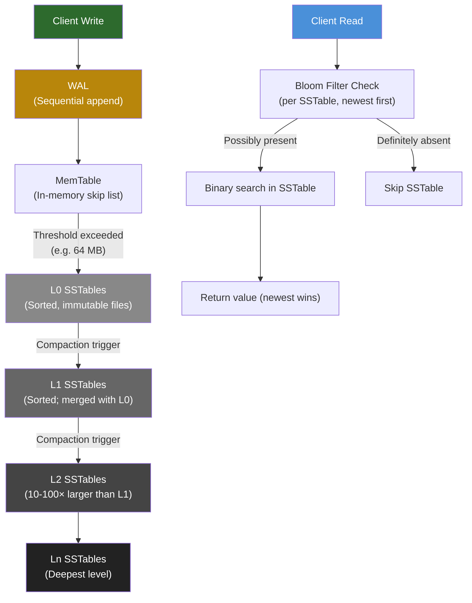

# 5. Storage Engines: B-Trees vs LSM-Trees 🟡

> **What you'll learn:**
> - How databases actually write to disk — the Write-Ahead Log (WAL) and crash recovery
> - B-Tree internals: page splits, the read-optimized design, and why random writes are expensive on spinning disks and flash
> - LSM-Tree internals: the MemTable → SSTable pipeline, compaction strategies, and how they achieve sequential write throughput
> - The three amplification factors (read, write, space) and how to use them to choose the right storage engine for your workload

---

## The Fundamental Problem: Durability Without Losing Performance

Every database faces the same fundamental challenge: **how do you make writes durable (on disk) while keeping them fast?**

The naive approach — write directly to the final data structure on disk — is catastrophically slow:

```
// 💥 NAIVE WAY: Direct update-in-place (no WAL, no buffering)
fn update_record(id, new_value):
    page = read_from_disk(page_containing(id))  // Random I/O read
    page.update(id, new_value)                   // Modify in memory
    write_to_disk(page)                          // Random I/O write
    // If process crashes BETWEEN read and write: DATA LOSS
    // If we crash MID-WRITE: DATA CORRUPTION (partial page write)
```

Two problems: **atomicity** (partial writes corrupt data) and **performance** (random I/O is 100–1000× slower than sequential I/O on both spinning disks and SSDs).

## The Write-Ahead Log (WAL)

Every production storage engine — B-Tree or LSM — uses a **Write-Ahead Log** as its crash recovery mechanism.

**Invariant:** *Before any data structure change is reflected on disk, the change must be recorded in the WAL.*

```
// ✅ FIX: WAL-based crash recovery

fn write_record(id, value):
    // Step 1: Append to WAL (sequential write — fast)
    wal.append(LogRecord { op: Update, id, value })
    wal.fsync()  // flush to disk — DURABLE NOW
    
    // Step 2: Update in-memory data structure
    memtable.insert(id, value)
    
    // Step 3: Eventually flush memtable to disk (batched, sequential)
    if memtable.size() > threshold:
        flush_to_disk(memtable)  // Can be done asynchronously

// On crash recovery:
fn recover():
    // Read WAL from last known-good checkpoint
    for record in wal.read_from(checkpoint):
        replay(record)  // Rebuild in-memory state
    // Discard any partially-written WAL tail (corrupted last record)
```

WALs write **sequentially** — always appending to the end of a file. Sequential writes are dramatically faster than random writes:

| Storage Medium | Sequential Write | Random Write | Ratio |
|---------------|-----------------|-------------|-------|
| 7200 RPM HDD | 150 MB/s | 1–2 MB/s | ~100× |
| SATA SSD | 500 MB/s | 100–200 MB/s | ~3× |
| NVMe SSD | 3,500 MB/s | 500–1,000 MB/s | ~4× |

Even on NVMe SSDs, sequential writes are faster because they avoid seek latency, benefit from the drive's internal write combining, and generate fewer small scattered writes that wear out flash cells unevenly.

## B-Trees: The Read-Optimized Classic

B-Trees (and their variant B+-Trees, used by virtually all production databases) have been the dominant storage structure since the 1970s. They organize data into **pages** (typically 4–16 KB) arranged in a balanced tree.

```
B+-Tree Structure:
  - Root node: holds separator keys, pointers to children
  - Internal nodes: same as root, hold up to (order-1) keys and order children
  - Leaf nodes: hold actual key-value pairs (or key + pointer to row)
  - Linked list: leaf nodes are linked for efficient range scans

Example (order 4, simplified):
            [30 | 60]
           /    |    \
      [10|20] [40|50] [70|80]
      (leaf)  (leaf)  (leaf)

When inserting key=35:
  1. Traverse from root → leaf [30|50] (wrong, actual [40|50])
     (actually: root says 35 < 60, go left middle: [40|50])
  2. Insert 35 into [40|50] → [35|40|50] (page full at order 4)
  3. SPLIT the leaf: [35|40] [50], push separator 50 up to parent
  4. Parent may also need to split (cascading) → O(log N) disk writes
```

### B-Tree Write Amplification

The problem with B-Trees is **write amplification**: a single logical write causes many physical writes.

- **Page read + modify + write:** Even a tiny update must read the entire 16 KB page, modify a few bytes, and write the entire page back
- **Page splits:** Full pages require reading and writing multiple pages, plus updating parent nodes
- **WAL write:** The change is written to the WAL *before* the page update — so the same data is written at least twice

**B-Tree write amplification factor (WAF) is typically 3–10×** for SSDs, higher for spinning disks.

### B-Tree Read Amplification

B-Trees excel at reads:

- **Point lookups:** O(log N) page reads, typically 3–5 (height of the tree for millions of records)
- **Range scans:** Walk the leaf linked list — O(k) page reads for k results
- **Hot pages stay in buffer pool** (OS page cache or DB buffer pool)

```
// B-Tree is the right choice when:
// - Reads dominate (OLTP with read-heavy skew)
// - Range queries are common
// - In-place updates are needed (UPDATE query changes a field)
// - Buffer pool can hold working set (memory is plentiful relative to data)
// Used by: PostgreSQL, MySQL/InnoDB, Oracle, SQLite
```

## LSM-Trees: The Write-Optimized Modern Approach

The Log-Structured Merge-Tree (LSM-Tree) was introduced by O'Neil et al. in 1996 and popularized by Google's Bigtable (2006) and LevelDB. The core insight: **all writes go to sequential structures; reads handle the merge**.

### The MemTable → SSTable Pipeline

```
Write Path (ALL sequential):

  Client Write ──→ WAL append ──→ MemTable update
                   (sequential)   (in-memory, typically a skip list
                                   or red-black tree for O(log N) ops)

  When MemTable exceeds threshold (e.g., 64 MB):
    ──→ Flush to disk as SSTable (Sorted String Table)
        SSTable: immutable, sorted file of key-value pairs
        WITH a Bloom filter (to quickly answer "is key K absent?")
                                   
  Multiple SSTables accumulate ──→ Compaction merges them
```



### The SSTable Format

An SSTable is a sorted, immutable file:

```
SSTable File Layout:
┌─────────────────────────────────────────────┐
│  Data Blocks (sorted key-value pairs)        │
│  Block 0: key_0001..key_1000 (4 KB)         │
│  Block 1: key_1001..key_2000 (4 KB)         │
│  ...                                        │
├─────────────────────────────────────────────┤
│  Index Block (key → block offset)           │
│  key_0001 → offset 0                        │
│  key_1001 → offset 4096                     │
│  ...                                        │
├─────────────────────────────────────────────┤
│  Bloom Filter (probabilistic membership)    │
│  10 bits/key, ~1% false positive rate       │
├─────────────────────────────────────────────┤
│  Metadata (compression, checksum, version)  │
└─────────────────────────────────────────────┘
```

### Compaction: Merging SSTables

As SSTables accumulate, reads get slower (more files to check) and space grows (stale versions of the same key exist in multiple files). **Compaction** solves this by merging SSTables:

```
Compaction (merge N SSTables into 1):
  Open N SSTables simultaneously (one iterator each)
  Perform N-way merge (like merge sort):
    - At each step, pick the key with the smallest value across all iterators
    - If the same key appears in multiple SSTables:
        Keep only the NEWEST version (by SSTable level / creation time)
        Discard older versions (they are now unreachable)
    - Write the merged output as a new SSTable
    - Delete the old SSTables

Compaction strategies:
  Size-tiered: Group SSTables of similar size; merge when a group is full
    Pro: Low write amplification (few compactions)
    Con: High space amplification (multiple stale versions coexist)
  Leveled (LevelDB style): Each level has a size limit; L→L+1 compaction when limit exceeded
    Pro: Low space amplification (1.1×)
    Con: Higher write amplification (overlapping key ranges across levels)
  FIFO: Discard oldest SSTables when space limit hit (metrics/time-series only)
```

### Tombstones: Deleting from an Immutable Structure

You cannot modify an existing SSTable. Deletes are recorded as **tombstones** — special marker values written to the MemTable:

```
// Delete in LSM-Tree (pseudocode)
fn delete(key):
    wal.append(LogRecord { op: Delete, key })
    memtable.insert(key, TOMBSTONE_MARKER)
    // Later, during compaction, the tombstone and ALL older versions
    // of the key are dropped — key is truly deleted.
```

**Tombstone pitfall:** If a tombstone is compacted away before all SSTables containing the original key are also compacted away, the key can **resurrect** during a subsequent read. This is a real bug in LSM-Tree implementations. RocksDB avoids it by never discarding a tombstone until all files that could contain the original key have been compacted past it.

## The Amplification Trilemma

Every storage engine makes three amplification trade-offs. You can optimize at most two:

| Amplification | Definition | B-Tree | LSM-Tree (Leveled) | LSM-Tree (Tiered) |
|--------------|-----------|--------|-------------------|-------------------|
| **Read Amplification (RAF)** | Physical reads per logical read | Low (log N pages) | Medium-High (bloom filters help, but multiple SSTables on read miss) | Higher (more files) |
| **Write Amplification (WAF)** | Physical writes per logical write | Medium (3–10×, page + WAL + splits) | Medium (5–30× due to compaction rewrites) | Low (2–10×) |
| **Space Amplification (SAF)** | Physical space / logical data size | Low (~1.3× with fragmentation) | Low (~1.1× leveled) | High (~2–10× tiered) |

```
Pick 2 of 3:
  ┌─────────────────────────────────────────┐
  │   Low Read    Low Write   Low Space     │
  │   Amp (RAF)   Amp (WAF)   Amp (SAF)    │
  │      ○             ○           ○        │
  │    ╱   ╲         ╱   ╲       ╱   ╲     │
  │  B-Tree   Tiered  Leveled               │
  │ (RAF+SAF) (WAF+RAF) (WAF+SAF)          │
  └─────────────────────────────────────────┘
```

| Workload | Recommended Engine | Reasoning |
|----------|------------------|-----------|
| OLTP reads (SELECT by PK) | B-Tree (PostgreSQL, MySQL) | Low RAF; frequent updates benefit from in-place writes |
| Write-heavy time series / logs | LSM with tiered compaction (InfluxDB, Cassandra) | Low WAF; stale versions are tolerable |
| Write-heavy with low space budget | LSM with leveled compaction (RocksDB, LevelDB) | Low SAF; bounded space growth |
| Mixed OLTP | B-Tree with good buffer pool tuning | Proven, predictable performance at all scales |
| Analytical (OLAP) | Columnar (Parquet, Arrow) | SAF doesn't apply; max read bandwidth per column |

---

<details>
<summary><strong>🏋️ Exercise: Design a Storage Engine for a Time-Series Database</strong> (click to expand)</summary>

**Problem:** You are building a time-series database that ingests sensor data from 500,000 IoT devices. Each device writes one data point per second. Data must be queryable for the last 90 days. Older data is archived to cold storage and discarded from the live engine.

**Workload characteristics:**
- Write rate: 500,000 writes/second
- Write pattern: always monotonically increasing timestamp (newest data first)
- Read pattern: range queries ("give me CPU usage for device X from T-1h to T")
- Delete pattern: data older than 90 days is discarded (TTL eviction)
- Data size: 50 bytes per data point × 500,000/s × 86,400 s/day × 90 days ≈ **195 TB**

**Design questions:**
1. Which storage structure (B-Tree or LSM) will you use and why?
2. How do you handle TTL eviction efficiently?
3. How do you partition the data across multiple nodes?
4. What compaction strategy is optimal here?

<details>
<summary>🔑 Solution</summary>

**1. Storage structure: LSM with FIFO or tiered compaction**

The workload is write-dominated (500K/s) with monotonically increasing keys (timestamps). This is ideal for LSM:
- All writes are sequential appends (timestamp always increases → MemTable always sees new keys → SSTables are naturally sorted and non-overlapping by time range)
- Bloom filters are effective: "is device X's data in [T1, T2]?" maps cleanly to SSTable time ranges
- B-Tree's random I/O is disastrous at 500K writes/second; the constant page splits would saturate disk I/O

**2. TTL eviction:**

Since data is monotonically time-ordered, entire SSTables go stale at once (all data in an SSTable from 91 days ago can be deleted). Use **FIFO compaction**:
- Each SSTable is annotated with its time range
- A background job discards SSTables whose entire time range is older than 90 days
- No merge-sort needed! Just `unlink(old_sstable_file)` — O(1) eviction
- This is zero write amplification for deletes — a massive advantage over tombstones

**3. Data partitioning:**

Partition by `device_id` using consistent hashing (see Chapter 6). Each node owns a shard of devices. Within a node, data for all owned devices is stored in a single LSM-Tree (or per-device MemTables if memory permits). Time-range queries for a device always go to the same node (single-node range scan, no distributed query coordination needed).

**4. Compaction strategy: FIFO with time-range-based flushing**

```
MemTable flush policy:
  Flush when ANY of:
    - MemTable reaches 64 MB threshold
    - MemTable is older than 10 minutes (ensures timely durability)

SSTable naming: sstable_{start_ts}_{end_ts}.sst

Compaction:
  Do NOT use leveled or size-tiered compaction.
  Use FIFO: when total SSTable size > 195 TB budget,
  delete the oldest SSTable (those with smallest start_ts).
  
  Optional: minor compaction to merge small SSTables
  within the same hour window (reduce file count for range queries).
```

**Estimated storage node design:**
- 1 SSTable per ~10 minutes of data per node → 9 × 24 × 90 = 19,440 SSTables per node
- With 10-node cluster: each node handles 50,000 devices, ~19.5 TB of live data
- NVMe SSD with 3.5 GB/s sequential write = 3.5M 1KB writes/s >> 50K/s per node — we are far from saturating the storage

</details>
</details>

---

> **Key Takeaways:**
> - **All production storage engines use a Write-Ahead Log (WAL)** for crash recovery. The WAL must be fsynced before returning a write acknowledgment.
> - **B-Trees are read-optimized:** low read amplification via tree traversal, but medium write amplification due to random page updates and splits.
> - **LSM-Trees are write-optimized:** all writes are sequential (WAL + MemTable + sorted flush), at the cost of read amplification (potentially checking multiple SSTables) and compaction write amplification.
> - **Neither is universally better.** B-Trees win for read-heavy OLTP workloads. LSM-Trees win for write-heavy workloads like logging, time-series, and key-value stores.
> - **Compaction strategy is a critical tuning decision:** leveled compaction (RocksDB default) minimizes space amplification; tiered/size-tiered compaction minimizes write amplification.

> **See also:** [Chapter 6: Replication and Partitioning](ch06-replication-and-partitioning.md) — how storage engines are replicated across nodes | [Chapter 7: Transactions and Isolation Levels](ch07-transactions-and-isolation-levels.md) — how MVCC uses LSM-like versioning to implement snapshot isolation
