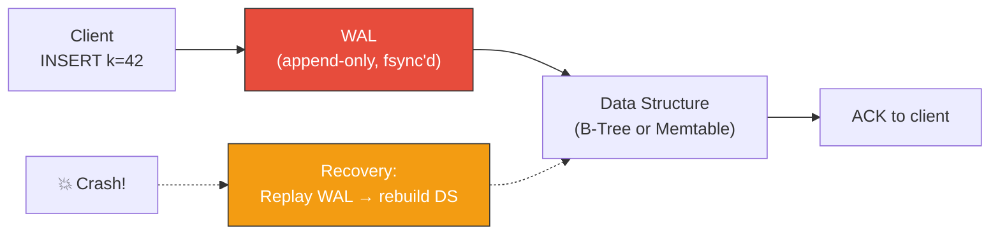
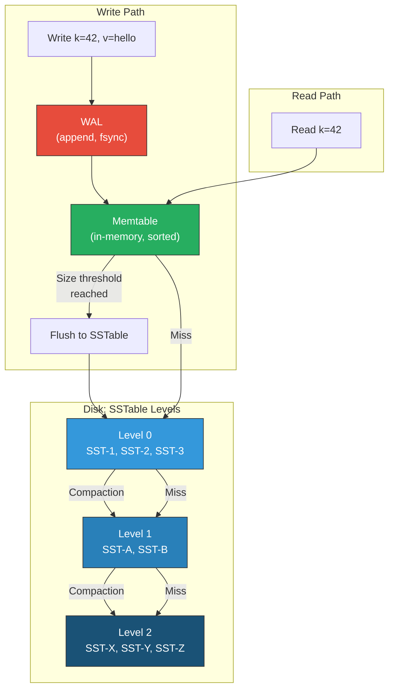

# 5. Storage Engines: B-Trees vs LSM-Trees 🟡

> **What you'll learn:**
> - How databases physically write and read data on disk, and why the choice of storage engine determines everything about performance characteristics.
> - The Write-Ahead Log (WAL): the single most important durability mechanism in database engineering.
> - B-Tree internals: page structure, splits, read-optimized design, and write amplification costs.
> - LSM-Tree internals: memtables, SSTables, compaction strategies (leveled vs. size-tiered), and how they trade read performance for write throughput.
> - When to choose which: a principled framework for selecting B-Tree-based (PostgreSQL, MySQL/InnoDB) vs. LSM-Tree-based (RocksDB, LevelDB, Cassandra, ScyllaDB) engines.

**Cross-references:** Storage engine choice directly affects replication and partitioning strategies in [Chapter 6](ch06-replication-and-partitioning.md) and transaction isolation implementations in [Chapter 7](ch07-transactions-and-isolation-levels.md). The capstone KV store in [Chapter 9](ch09-capstone-global-kv-store.md) uses an LSM-Tree design.

---

## Why Storage Engines Matter

Every database is, at its core, a program that translates logical operations (`INSERT`, `SELECT`, `UPDATE`) into physical I/O on durable storage. The **storage engine** is the component that decides *how* data is organized on disk.

This choice is not academic—it determines:

| Property | B-Tree optimized | LSM-Tree optimized |
|---|---|---|
| Point read latency | ✅ O(log N) with ~3–4 disk seeks | ⚠️ May check multiple levels |
| Range scan speed | ✅ Data sorted and contiguous on disk | ⚠️ Must merge across levels |
| Write throughput | ⚠️ Random I/O (page updates in place) | ✅ Sequential I/O (append-only) |
| Write amplification | Moderate (1 page write per update) | Higher (compaction rewrites data) |
| Space amplification | Low (data stored once) | Higher (same key may exist in multiple levels during compaction) |
| SSD friendliness | ⚠️ Random writes wear flash cells | ✅ Sequential writes are SSD-optimal |

---

## The Write-Ahead Log (WAL): Durability First

Before discussing either engine, we need the WAL. **Every durable database uses a WAL.**

### The Problem

If the database crashes mid-write (power failure, kernel panic), partially written data structures (B-Tree pages, memtable entries) are corrupted. The database is now in an inconsistent state.

### The Solution

Before modifying any data structure, write the operation to a sequential, append-only log on disk:

```
1. Receive operation: INSERT (key=42, value="hello")
2. APPEND to WAL: [seq=1001, INSERT, key=42, value="hello"]
3. fsync the WAL to disk. (The operation is now DURABLE.)
4. Apply the operation to the in-memory data structure.
5. Acknowledge to the client.
```

On crash recovery:
```
1. Read the WAL from the last checkpoint.
2. Replay all operations into the data structure.
3. The data structure is now consistent with all acknowledged operations.
```



**Key insight:** The WAL converts random writes (updating pages in a B-Tree) into sequential writes (appending to a log). Sequential writes on spinning disks are 100–1000x faster than random writes. On SSDs, the ratio is smaller but still significant.

---

## B-Trees: Read-Optimized, Update-in-Place

B-Trees (and their variant B+Trees) have been the dominant storage engine since the 1970s. PostgreSQL, MySQL/InnoDB, SQLite, SQL Server, and Oracle all use B-Tree variants.

### Structure

A B-Tree is a balanced tree where:
- Each node is a fixed-size **page** (typically 4KB–16KB, matching the OS page size).
- Internal nodes contain keys and pointers to child pages.
- Leaf nodes contain keys and values (or pointers to row data).
- All leaves are at the same depth → O(log N) access for any key.

```
                    [Page 100: Root]
                  /        |        \
         [Page 200]   [Page 201]   [Page 202]
         keys<100     100≤keys<200  keys≥200
        /    \          /    \        /    \
    [Leaf]  [Leaf]  [Leaf]  [Leaf] [Leaf]  [Leaf]
```

A typical B-Tree with a branching factor of 500 and 4 levels can address 500⁴ = **62.5 billion** keys—with only 4 page reads.

### Write Path: Update in Place

```
1. Traverse from root to the correct leaf page (3-4 reads).
2. If the key exists: update the value in the leaf page.
3. If the key is new and the page has space: insert into the page.
4. If the page is full: SPLIT the page into two, and insert a new key in the parent.
   (Splits can cascade up to the root.)
5. Write the modified page(s) back to disk.
```

### The Naive Monolith Way

```rust
/// 💥 SPLIT-BRAIN HAZARD: Writing directly to the data file without a WAL.
/// If the process crashes between writing the leaf page and updating the
/// parent pointer, the tree is permanently corrupted—orphaned pages,
/// dangling pointers, lost data.
fn btree_insert(file: &mut File, key: u64, value: &[u8]) {
    let leaf_page = find_leaf(file, key);
    // 💥 Write the new leaf page to disk
    write_page(file, leaf_page.offset, &leaf_page.with_insert(key, value));
    // 💥 CRASH HERE = CORRUPTION: parent still points to old page layout
    if leaf_page.needs_split() {
        let (left, right) = leaf_page.split();
        write_page(file, left.offset, &left);
        write_page(file, right.offset, &right);
        // 💥 CRASH HERE = CORRUPTION: parent doesn't know about right page
        update_parent(file, leaf_page.parent, left.max_key, right.offset);
    }
}
```

### The Distributed Fault-Tolerant Way

```rust
/// ✅ FIX: WAL-protected B-Tree write. All modifications are logged
/// to the WAL before touching the tree pages. On crash, replay the WAL
/// to restore consistency.
fn btree_insert_safe(
    wal: &mut WriteAheadLog,
    tree: &mut BTreeFile,
    key: u64,
    value: &[u8],
) -> Result<(), StorageError> {
    // ✅ Step 1: Write the operation to the WAL FIRST.
    let lsn = wal.append(WalEntry::Insert { key, value: value.to_vec() })?;
    wal.fsync()?; // ✅ Durable on disk before we touch the tree.

    // ✅ Step 2: Now modify the B-Tree pages.
    // If we crash here, WAL replay will redo this operation.
    let leaf = tree.find_leaf_mut(key);
    if leaf.has_space() {
        leaf.insert(key, value);
        tree.write_page(leaf)?;
    } else {
        let (left, right) = leaf.split_and_insert(key, value);
        tree.write_page(&left)?;
        tree.write_page(&right)?;
        tree.update_parent(leaf.parent_id, left.max_key(), right.page_id())?;
    }

    // ✅ Step 3: Advance the WAL checkpoint.
    wal.checkpoint(lsn)?;
    Ok(())
}
```

---

## LSM-Trees: Write-Optimized, Append-Only

Log-Structured Merge-Trees (O'Neil et al., 1996) are the engine behind RocksDB, LevelDB, Cassandra, ScyllaDB, HBase, and InfluxDB. They optimize for write throughput by converting *all* writes to sequential I/O.

### Write Path

```
1. Write the operation to the WAL (sequential append, fsync).
2. Insert the key-value pair into an in-memory sorted structure (the "memtable",
   typically a red-black tree or skip list).
3. When the memtable reaches a size threshold (e.g., 64MB):
   a. Freeze the current memtable (make it immutable).
   b. Create a new empty memtable for incoming writes.
   c. Flush the frozen memtable to disk as a sorted, immutable file: an SSTable
      (Sorted String Table).
```

### Read Path

```
1. Check the current (mutable) memtable.
2. Check the frozen (immutable) memtable (if any).
3. Check SSTables on disk, from newest to oldest.
   Use Bloom Filters to skip SSTables that definitely don't contain the key.
4. Return the first match found (newest wins).
```

### Compaction: The LSM-Tree's Achilles Heel

Over time, many SSTables accumulate on disk. Reads slow down because they must check multiple files. Compaction merges SSTables, removing duplicates and deleted entries (tombstones).



### Compaction Strategies

| Strategy | How it works | Write amplification | Read amplification | Space amplification | Used by |
|---|---|---|---|---|---|
| **Size-tiered** | Merge SSTables of similar size. Multiple SSTables per level. | Lower | Higher (more files to check) | Higher (temporary duplicates during compaction) | Cassandra (default), HBase |
| **Leveled** | Each level is 10x the size of the previous. At most one SSTable per key range per level. | Higher (rewrites entire levels) | Lower (one file per range per level) | Lower (tighter dedup) | LevelDB, RocksDB (default) |
| **FIFO** | Simply drop the oldest SSTables when disk is full. | None | N/A | Fixed | Time-series data (TTL-based expiry) |

---

## B-Tree vs. LSM-Tree: Head-to-Head

| Dimension | B-Tree | LSM-Tree |
|---|---|---|
| **Write pattern** | Random I/O (update pages in place) | Sequential I/O (append to log, flush SSTables) |
| **Read pattern** | O(log N) — traverse tree | O(L × log N) — check L levels, mitigated by Bloom filters |
| **Write throughput** | Limited by random IOPS | 5–10x higher on SSDs, 10–100x on HDDs |
| **Read latency (point)** | Predictable, low | Variable (best case: memtable hit; worst case: scan all levels) |
| **Range scans** | Excellent (data sorted and contiguous) | Good after compaction, poor during heavy writes |
| **Write amplification** | ~2–3x (WAL + page write) | ~10–30x (WAL + flush + multi-level compaction) |
| **Space amplification** | ~1x (data stored once) | ~1.1–2x (duplicates across levels during compaction) |
| **Concurrency** | Complex (page-level locking, latching) | Simple (memtable is the only mutable structure) |
| **Crash recovery** | WAL replay + page checksums | WAL replay (memtable rebuild from WAL) |

### When to Use Which

| Use case | Best engine | Why |
|---|---|---|
| OLTP with balanced reads/writes | B-Tree (PostgreSQL, MySQL) | Predictable latency for both reads and writes |
| Write-heavy ingestion (logs, metrics, IoT) | LSM-Tree (RocksDB, Cassandra) | Sequential writes maximize throughput |
| Key-value store with high write rate | LSM-Tree (RocksDB) | Primary design goal of LSM-Trees |
| Analytical range scans on sorted data | B-Tree | Contiguous data layout is ideal for sequential reads |
| SSD-optimized workload | LSM-Tree | Sequential writes extend SSD lifespan and performance |
| Low-latency point reads (cache-like) | B-Tree | One tree traversal vs. multi-level search |

---

## Bloom Filters: Making LSM-Tree Reads Fast

A Bloom filter is a probabilistic data structure that answers: "Is key X *definitely not* in this SSTable?"

```
- False positives: possible (says "maybe yes" when key is absent → extra disk read)
- False negatives: IMPOSSIBLE (if it says "no", the key is guaranteed absent)
```

Each SSTable has an associated Bloom filter. Before reading the SSTable from disk, check the Bloom filter. If it says "no," skip that SSTable entirely.

With a well-tuned Bloom filter (10 bits per key, 3 hash functions), the false positive rate is ~1%. This means a point read in an LSM-Tree with 7 levels only touches 1–2 SSTables on average, not all 7.

---

<details>
<summary><strong>🏋️ Exercise: Choose the Storage Engine</strong> (click to expand)</summary>

### Scenario

You are building three different services. For each, recommend a storage engine (B-Tree or LSM-Tree) and justify your choice:

1. **User Profile Service** — 50 million users, 1000 reads/sec, 100 writes/sec, complex queries with secondary indexes, read latency SLO: p99 < 5ms.

2. **Time-Series Metrics Store** — 200,000 sensors reporting every second, 200K writes/sec, reads are batch analytics queries scanning entire time ranges, data expires after 30 days.

3. **Distributed Key-Value Cache** — 10 billion keys, uniform random access pattern, 500K reads/sec, 100K writes/sec, value sizes 100 bytes to 10KB, latency SLO: p99 < 2ms for reads.

<details>
<summary>🔑 Solution</summary>

**1. User Profile Service: B-Tree (PostgreSQL / MySQL InnoDB)**

- Read-dominated workload (10:1 read:write ratio) → B-Tree's O(log N) reads with predictable latency.
- Complex queries with secondary indexes → B-Tree databases have mature query planners and index support.
- p99 < 5ms reads → B-Tree point reads are deterministic (3–4 page reads). LSM-Tree reads can spike during compaction.
- 100 writes/sec is trivially low — no need for LSM-Tree's write optimization.

**2. Time-Series Metrics Store: LSM-Tree (Cassandra / InfluxDB / custom RocksDB)**

- 200K writes/sec → LSM-Tree's sequential write path handles this efficiently. B-Tree would bottleneck on random page updates.
- Time-ordered ingestion → Data naturally arrives in sorted order, which is ideal for SSTable organization (minimal compaction needed within a time window).
- Batch analytics (range scans) → After compaction, LSM-Tree data within a level is sorted and contiguous. Acceptable for batch processing.
- 30-day TTL expiry → FIFO compaction strategy simply drops old SSTables. No tombstone overhead.

**3. Distributed Key-Value Cache: LSM-Tree (RocksDB) with Bloom filters**

- 100K writes/sec → Significant write load favors LSM-Tree's sequential I/O.
- 500K reads/sec with p99 < 2ms → This is the hardest constraint. Mitigation:
  - Use large Bloom filters (16 bits per key, ~0.01% false positive rate).
  - Keep hot data in block cache (RocksDB's in-memory cache).
  - Use leveled compaction to minimize the number of SSTables per key range.
  - Pin Level 0 in memory to eliminate the most variable source of read latency.
- 10 billion keys → LSM-Tree's compaction handles large datasets well. B-Tree's page splits at this scale create significant write amplification.
- Uniform random access → No benefit from B-Tree's range scan optimization.

The key insight: for the cache, **tuning the LSM-Tree** (Bloom filters, block cache, leveled compaction, pinned L0) is critical. An untuned LSM-Tree would miss the 2ms SLO. A well-tuned one comfortably meets it while handling 100K writes/sec.

</details>
</details>

---

> **Key Takeaways**
>
> 1. **The WAL is non-negotiable.** Every durable storage engine writes to a WAL before modifying data structures. Without it, any crash corrupts data.
> 2. **B-Trees optimize for reads.** O(log N) point reads with predictable latency, contiguous range scans, and low space amplification. But writes are random I/O.
> 3. **LSM-Trees optimize for writes.** All writes are sequential (memtable + SSTable flush). But reads must check multiple levels, and compaction creates write and space amplification.
> 4. **Bloom filters** are essential for LSM-Tree read performance. They turn O(L × log N) reads into O(1 × log N) reads in practice.
> 5. **Compaction strategy matters.** Leveled compaction favors reads (fewer files). Size-tiered compaction favors writes (less rewriting). Match the strategy to your workload.
> 6. **There is no universally "better" engine.** The right choice depends on your read/write ratio, latency SLOs, and access patterns.

---

> **See also:**
> - [Chapter 6: Replication and Partitioning](ch06-replication-and-partitioning.md) — storage engines operate within each replica; replication distributes data across nodes.
> - [Chapter 7: Transactions and Isolation Levels](ch07-transactions-and-isolation-levels.md) — MVCC is often layered on top of the storage engine (LSM-Trees naturally support multi-version data).
> - [Chapter 9: Capstone: Design a Global Key-Value Store](ch09-capstone-global-kv-store.md) — the capstone uses an LSM-Tree engine (RocksDB) per node.
