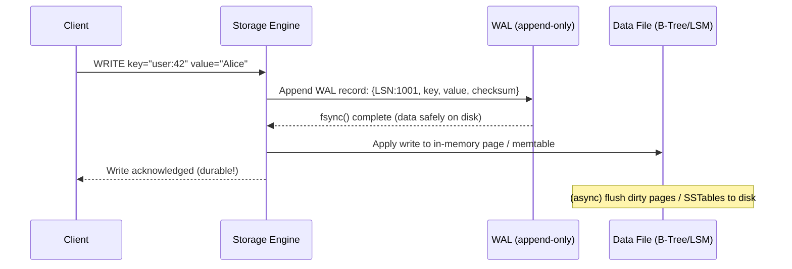
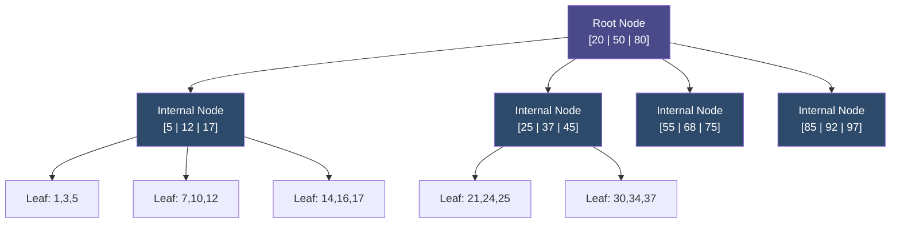
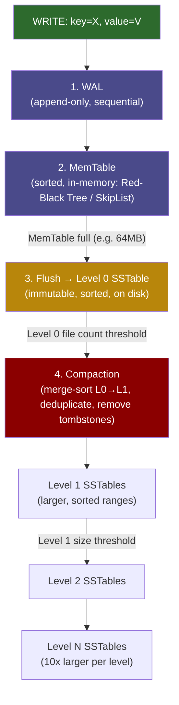
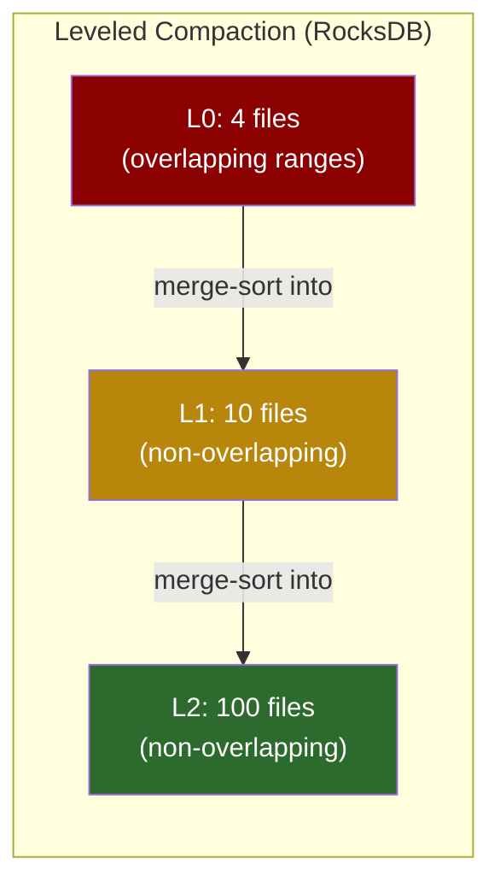

# 5. Storage Engines: B-Trees vs LSM-Trees 🟡

> **What you'll learn:**
> - How the Write-Ahead Log (WAL) guarantees durability before data reaches its final on-disk location
> - Why B-Trees dominate OLTP workloads and how they handle random writes (and why this is expensive)
> - How Log-Structured Merge-Trees (LSM-Trees) trade read amplification for dramatically higher write throughput using SSTables and compaction
> - When to choose RocksDB (LSM) vs PostgreSQL (B-Tree) for a new service — and what the wrong choice costs you

---

## The Durability Problem: Why Writing to Disk Is Hard

A database faces a fundamental adversarial reality: the disk is not an atomic commit surface. Writing 8KB to a file requires many individual sector writes. A power failure mid-write can leave the data in an indeterminate state — some sectors written, some not.

Without protection, a power failure during a write invalidates any consistency guarantee. The solution universally employed by storage engines is the **Write-Ahead Log (WAL)**.

### The Write-Ahead Log (WAL)

The WAL is an append-only log file written to disk **before** any data modification is applied to the actual data structures:



The WAL record includes:
- **LSN (Log Sequence Number)** — monotonically increasing identifier
- **The operation** — INSERT/UPDATE/DELETE + key + value
- **Checksum** — CRC32 or CRC64 to detect torn writes

On crash recovery, the engine replays all WAL records from the last known good checkpoint, restoring memory state. Because the WAL is append-only, partial writes at the tail can be detected by checksum mismatch and discarded — the rest of the WAL is intact.

```
// 💥 SPLIT-BRAIN HAZARD: Writing data BEFORE the WAL
async fn naive_write(key: &str, value: &[u8]) {
    page_cache.write(key, value);    // Modify in-memory page
    wal.append(key, value).await;    // Write WAL after
    // If crash between these two lines: the page cache write is lost
    // but WAL has no record — SILENT DATA LOSS
}

// ✅ FIX: WAL-first protocol
async fn safe_write(key: &str, value: &[u8]) {
    wal.append_and_fsync(key, value).await; // WAL written and fsynced FIRST
    page_cache.write(key, value);           // In-memory update after
    // On crash: replay WAL → data is recovered
}
```

## B-Trees: The OLTP Workhorse

B-Trees (and their B+Tree variants, universally used in practice) are the backbone of PostgreSQL, MySQL/InnoDB, SQLite, LMDB, and most relational databases.

### B+Tree Structure



Key B+Tree properties:
- **Fixed-size pages** (typically 4KB–16KB, aligned to OS page size for efficient I/O)
- **Fan-out of 100–1000** (each internal node holds hundreds of keys → tree depth ≤ 4 for 1 billion rows)
- **Leaf pages contain the actual data** (in B+Trees, internal nodes only hold keys)
- **Leaf pages are doubly-linked** → range scans are O(1) sequential I/O after finding the start

### The B-Tree Write Problem: Write Amplification

Updating a B-Tree record requires:
1. **Read the page** containing the key into the buffer pool (page cache)
2. **Modify the record** in the page  
3. **Write the modified page** back to disk (dirty page flush)

For a small update (changing one 8-byte integer), you write an entire **4KB–16KB page** — a **write amplification** of 512–2048x.

Worse, if the update causes a page split (the page is full), you write 2 new pages plus update the parent page — potentially cascading up the tree.

```
Write Amplification (B-Tree) = page_size / record_size
= 16KB / 8 bytes = 2,048x

For a 1MB/s actual data change rate:
Actual I/O = 1MB/s × 2,048 = 2 GB/s disk writes

Modern NVMe SSDs: ~2-7 GB/s sequential write
Modern HDDs: ~100-200 MB/s sequential write
→ A HDD-backed B-Tree database can saturate disk I/O at just 50-100 KB/s of logical writes!
```

This is why high-write-throughput workloads (time-series ingestion, audit logs, event streams) that run on spinning disks often hit B-Tree write bottlenecks long before the CPU or memory becomes the constraint.

### B-Tree Strengths

Despite write amplification, B-Trees dominate OLTP because:

| Advantage | Explanation |
|-----------|-------------|
| **Point reads are O(log N)** | Follow the tree — typically 3-4 I/Os for billion-row tables |
| **Range scans are efficient** | Sequential leaf page reads after finding start |
| **In-place updates** | No read amplification for updates (read 1 page, update, write 1 page) |
| **Predictable performance** | No compaction pauses; latency is consistent |
| **Mature, proven** | PostgreSQL's B-Tree is 30 years old; extremely well-optimized |
| **Easy crash recovery** | WAL + page-level redo logging is simple and proven |

## LSM-Trees: Optimized for Write-Heavy Workloads

Log-Structured Merge-Trees (LSM-Trees) flip the B-Tree trade-off. Instead of modifying data in place, **all writes go to a sequential log (the memtable), then are periodically sorted and flushed to immutable files (SSTables)**.

### The LSM-Tree Write Path



### SSTables: Sorted String Tables

An SSTable (Sorted String Table) is an immutable, sorted file of key-value pairs:

```
SSTable File Layout:
┌──────────────────────────────────┐
│ Data Blocks                      │
│   [key1:val1, key2:val2, ...]    │  ← Sorted key-value pairs (compressed)
│   [key100:val100, ...]           │
├──────────────────────────────────┤
│ Index Block                      │
│   [key=key1, offset=0]           │  ← One entry per data block
│   [key=key100, offset=4096]      │
├──────────────────────────────────┤
│ Bloom Filter                     │  ← Probabilistic set membership test
├──────────────────────────────────┤
│ Footer                           │
│   [index_offset, filter_offset]  │
└──────────────────────────────────┘
```

**Bloom filters** are a critical optimization: before reading any SSTable data blocks, the engine checks the Bloom filter to determine if the key *might* be in this file. If the Bloom filter says no, skip the file entirely without any disk I/O. False positive rate is configurable (typically 1%) — a 1% FPR means only 1% of negative lookups require unnecessary disk reads.

### LSM Compaction Strategies

| Strategy | How It Works | Write Amp | Read Amp | Space Amp | Best For |
|----------|-------------|-----------|----------|-----------|---------|
| **Leveled** (RocksDB default) | L0 files sorted into L1; L1 files into L2 etc. Each level is 10x larger. Files within a level have non-overlapping key ranges | ~10-30x | ~1-2x | ~1.1x | Read-heavy + space efficiency |
| **Tiered/Size-Tiered** (Cassandra default) | Group SSTables by size, compact groups when ≥4 similarly-sized files exist | ~1-5x | ~50x | ~3-10x | Write-heavy, space OK |
| **FIFO** | New SSTables added; oldest deleted when space limit reached | 1x | O(N) | 1x | Time-series/expiring data only |



### LSM Read Path: The Amplification Cost

Reading a key from an LSM-Tree requires checking:
1. **MemTable** (in-memory hash lookup, O(1))
2. **L0 SSTables** (all of them — L0 files can overlap! Check each one)
3. **L1 SSTables** (binary search → at most 1 file at each level)
4. **L2...LN** (same — at most 1 file per level)

In the worst case (key doesn't exist), you check *every* level after memtable miss. **Bloom filters** reduce this to O(1) I/O for non-existent keys with >99% probability.

**Read amplification = number of SSTables read in worst case:**

For leveled compaction with 7 levels, worst case = 1 (memtable) + L0_files + 6 (one per L1-L7) = in practice ~10-20 I/Os for a miss.

```
// 💥 SPLIT-BRAIN HAZARD: Reading from LSM without Bloom filters
Point read for non-existent key:
    Miss in memtable
    Read L0 SSTable 1... miss
    Read L0 SSTable 2... miss
    Read L0 SSTable 3... miss
    Read L0 SSTable 4... miss
    Read L1 file... miss
    Read L2 file... miss
    ...
// High read I/O for non-existent keys

// ✅ FIX: Bloom filter check before any SSTable read
For each SSTable:
    if !bloom_filter.might_contain(key): continue  // Skip file entirely (99% of the time for misses)
    read_data_block(key)  // Only if Bloom filter says "maybe"
```

## B-Tree vs LSM-Tree: The Decision Matrix

| Property | B-Tree | LSM-Tree |
|----------|--------|----------|
| **Write amplification** | High (512-2000x for small updates) | Lower (10-30x leveled) |
| **Read amplification** | Low (3-4 I/Os) | Medium (1-20 I/Os with Bloom) |
| **Space amplification** | Low (in-place updates) | Medium-High (multiple versions until compaction) |
| **Compaction pauses** | None (flushes are bounded) | Yes (background compaction spikes p99 latency) |
| **Random write throughput** | Limited by disk seek (HDD) / IOPS (SSD) | Very high (writes are sequential) |
| **Sequential read** | Good (leaf page links) | Very good (SSTables are sorted) |
| **Range scans** | Excellent | Good (multiple SSTables merged) |
| **Point reads** | Excellent | Good with Bloom filters |
| **Crash recovery** | WAL replay (straightforward) | WAL replay + SSTable manifest |
| **Best workload** | OLTP, low-latency point reads | High-write ingestion, time-series, event logs |

### Real-World System Choices

| System | Storage Engine | Why |
|--------|---------------|-----|
| PostgreSQL | B+Tree (heap + index) | General-purpose OLTP; read performance critical |
| MySQL InnoDB | B+Tree (clustered primary key) | Same; InnoDB uses primary key as the tree |
| SQLite | B+Tree | Embedded, low-concurrency; optimized for reads |
| RocksDB | LSM-Tree (leveled) | Meta/Facebook's high-write KV; YouTube for metadata |
| LevelDB | LSM-Tree (leveled) | Google's embedded KV; precursor to RocksDB |
| Cassandra | LSM-Tree (tiered) | Append-heavy time-series at massive scale |
| Apache HBase | LSM-Tree (leveled, via MemStore+HFile) | Hadoop-backed, write-heavy OLAP |
| WiredTiger (MongoDB) | B+Tree | MongoDB ≥3.2; balanced OLTP performance |
| LMDB | B+Tree (copy-on-write) | Embedded; zero-copy reads via mmap; OpenLDAP |

<details>
<summary><strong>🏋️ Exercise: Storage Engine Selection and Compaction Tuning</strong> (click to expand)</summary>

**Scenario:** You are designing the storage tier for two different services at a streaming platform.

**Service A — Event Ingestion:** Receives 500,000 events/second (each ~200 bytes) from IoT devices. Events are immutable once written. Queries are rare range scans by device ID and time range. The data retention is 90 days, after which events are deleted.

**Service B — User Session Store:** 50,000 concurrent users; each session record is ~2KB. Sessions are read on every API request (~200,000 reads/s). Sessions are updated when users navigate (approximately 1 write per 5 reads). Sessions expire after 30 minutes of inactivity.

For each service:
1. Choose B-Tree or LSM-Tree and justify
2. Select a specific compaction strategy (if LSM)
3. Identify the key tuning knobs you'd adjust and what trade-offs they make
4. Describe the failure mode you're most worried about and how you'd detect it

<details>
<summary>🔑 Solution</summary>

**Service A: Event Ingestion → LSM-Tree with FIFO/Tiered Compaction**

**Why LSM:** 500K × 200B = 100 MB/s of logical writes. With B-Tree write amplification of ~1000x for small records, this would require 100 GB/s of disk I/O — impossible. With LSM tiered compaction (~5x write amp), at 500 MB/s actual disk writes, a modern NVMe RAID array handles this comfortably.

**Compaction Strategy: FIFO (with time-to-live)**

- Events are immutable and expire after 90 days
- FIFO compaction just adds new SSTables and drops the oldest when size threshold or TTL exceeded
- Write amplification = ~1x (near-zero compaction CPU cost)
- Read access: rare range scans use SSTable indexes + Bloom filters efficiently
- Concern: FIFO doesn't reclaim space mid-tier; need to tune `max_table_files_size` to prevent disk fill

**Tuning Knobs:**

```
MemTable size:       256MB (large → fewer flushes → less L0 file count)
L0 file count limit: 20 (high → more L0 files before triggering compaction → write spikes)
Block cache:         4GB (few reads, but important for range scan warm-up)
Bloom filter bits:   10 bits/key (1% FPR — few reads, so Bloom is mostly unused)
Compression:         LZ4 (fast, 3-4x compression ratio; IoT data compresses well)
TTL:                 90 days on SSTable level (RocksDB supports per-key TTL with FIFO)
```

**Failure Mode to Watch:** Compaction falling behind ingestion rate → L0 file count grows → reads slow exponentially.

```
metric: rocksdb_l0_file_count  → alert if > 50
metric: rocksdb_compaction_pending_bytes → alert if > 10GB
metric: write_stall_duration   → alert on any stalls (write stall = disaster for ingestion)
```

**Service B: User Session Store → B-Tree with Page Compression**

**Why B-Tree:** 200,000 reads/s with individual session lookups (point reads). LSM point reads with Bloom filters are fine, but B-Tree offers lower read amplification and more predictable p99 latency — critical when every API request requires a session read.

The write rate (40,000 writes/s — 1 per 5 reads) is manageable for a B-Tree with an NVMe SSD and sufficient buffer pool.

**Storage: PostgreSQL/WiredTiger or LMDB**

- PostgreSQL with `fillfactor=80` on the sessions table (leave 20% free space in pages for in-place updates — reduces page splits and WAL volume for hot sessions)
- Connection pooling with PgBouncer to avoid 200K PostgreSQL connections
- Sessions table: `CLUSTER`ed on (user_id, last_active) for cache-friendly range deletes of expired sessions

**Tuning Knobs:**

```
shared_buffers:      16GB (fit most active sessions in buffer pool)
effective_cache_size: 48GB (hint to planner)
work_mem:            4MB (low; queries are simple point lookups)
fillfactor:          80 (reduces HOT updates → fewer page splits)
autovacuum_scale_factor: 0.05 (vacuum more aggressively for 30-min expiry)
checkpoint_completion_target: 0.9 (spread WAL flushing to reduce I/O spikes)
```

**Failure Mode to Watch:** Table bloat from expired sessions not being vacuumed.

```
metric: n_dead_tup on sessions table → alert if bloat > 10%  
metric: last_autovacuum timestamp → alert if > 5 minutes ago
metric: buffer_hit_rate → alert if < 95% (working set doesn't fit in buffer pool)
```
</details>
</details>

---

> **Key Takeaways**
> - The WAL is non-negotiable for durability: write the log record with fsync *before* modifying data structures
> - **B-Trees** excel at reads and OLTP patterns; their weakness is write amplification on highly random updates to small records
> - **LSM-Trees** move all writes to a sequential log (MemTable → SSTable), dramatically reducing write amplification at the cost of read amplification and compaction pauses
> - **Bloom filters** make LSM point reads practical by eliminating unnecessary SSTable I/O for keys that don't exist
> - Compaction strategy is the most important LSM tuning decision: Leveled favors reads and space efficiency; Tiered/FIFO favors writes

> **See also:**
> - [Chapter 6: Replication and Partitioning](ch06-replication-and-partitioning.md) — How storage engines integrate with replication
> - [Chapter 7: Transactions and Isolation Levels](ch07-transactions-and-isolation-levels.md) — How MVCC layers on top of storage engines (especially B-Trees)
> - [Chapter 9: Capstone: Global Key-Value Store](ch09-capstone-global-key-value-store.md) — Choosing a storage engine for a production KV store
