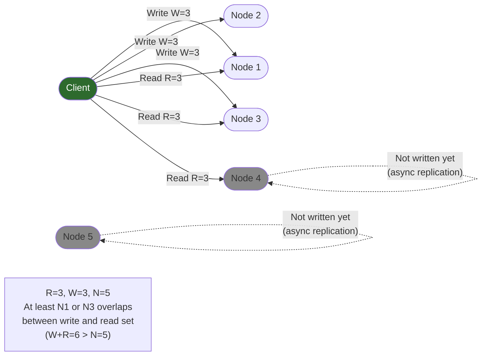
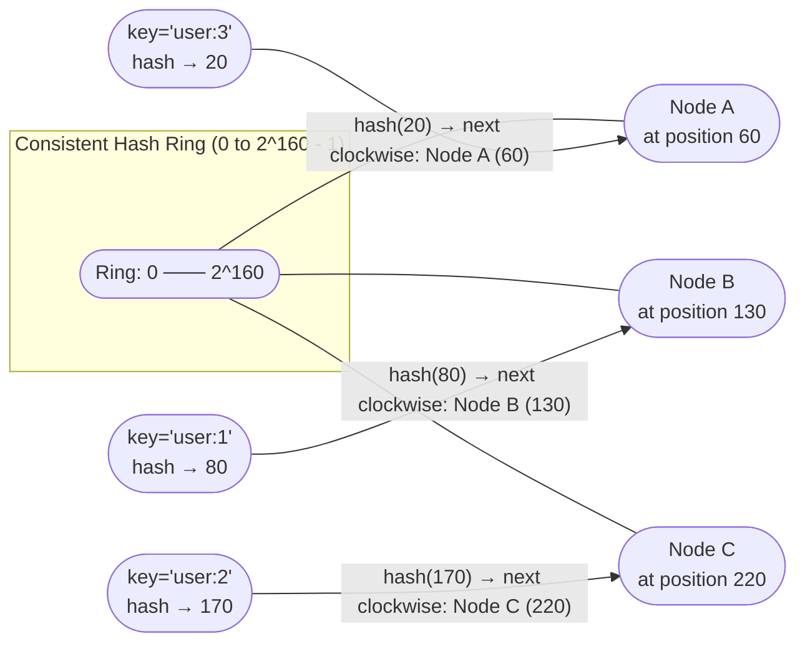

# 6. Replication and Partitioning 🔴

> **What you'll learn:**
> - The three fundamental replication topologies (single-leader, multi-leader, leaderless) and when each is appropriate
> - How to resolve write conflicts in multi-leader and leaderless systems — Last-Write-Wins (LWW), vector clocks, and CRDTs
> - Consistent hashing: how data is distributed across nodes, why virtual nodes are essential, and what happens during rebalancing
> - Hinted handoff and anti-entropy: maintaining availability and consistency when nodes go down

---

## What Replication Is (and Isn't)

**Replication** means keeping identical copies of data on multiple machines. The goals are:

1. **High availability** — serve reads even when some nodes fail
2. **Fault tolerance** — survive hardware failures without data loss
3. **Read throughput** — serve reads from multiple replicas in parallel
4. **Geographic distribution** — serve reads from a datacenter close to the user

Replication does NOT automatically give you consistency. In fact, replication is the primary source of **consistency challenges** in distributed systems.

## Replication Topology 1: Single-Leader (Leader-Follower)

All writes go to one designated node (the leader). The leader replicates changes to followers. Reads can go to any replica.

```
// Single-leader replication (conceptual)
Client (write) → Leader → [WAL/Replication Log] → Followers
Client (read)  → Any replica (leader or follower)

Modes of follower replication:
  Synchronous: Leader waits for follower ACK before returning success.
    Pro: Follower has the data before client is told it's written.
    Con: Leader is blocked if follower is slow or unavailable.
  Asynchronous: Leader returns success immediately; follower catches up.
    Pro: No latency penalty; leader not blocked by slow followers.
    Con: If leader crashes before replication, data is lost.
  Semi-synchronous: Wait for 1 follower, rest are async.
    Pro: At least 2 copies before acknowledging write.
    Con: That 1 follower becomes a bottleneck if it is slow.
```

### Replication Lag and Its Consequences

Asynchronous followers always have **replication lag** — they lag behind the leader by milliseconds to seconds (or more during heavy load):

```
// 💥 SPLIT-BRAIN HAZARD: Reading from a lagging replica
fn get_user_profile(user_id):
    replica = pick_any_replica()  // WRONG — may be lagging
    return replica.select(user_id)

// Scenario: User updates their email at T=0 (write to leader).
//           Replica lag is 500ms.
//           User immediately reads profile from lagging replica.
//           Replica still shows OLD email. User thinks update failed.
//           User clicks "update" again → DUPLICATE UPDATE.

// ✅ FIX: Read-your-writes guarantee
fn get_user_profile(user_id, is_own_profile: bool):
    if is_own_profile:
        leader.select(user_id)  // Always read your own profile from leader
    else:
        any_replica.select(user_id)  // Others' profiles can be slightly stale

// Alternative: Track last-write timestamp per user, query replica
//              ONLY after replica has advanced past that timestamp.
```

**Replication lag anomalies:**

| Anomaly | Cause | Solution |
|---------|-------|----------|
| **Read-your-writes violation** | User writes to leader, reads lagging replica | Route user's reads to leader after a write |
| **Monotonic reads violation** | User reads from different replicas sequentially, gets time-going-backward effect | Sticky routing: a user always reads from the same replica |
| **Consistent prefix reads** | User sees the effect before the cause (message arrives before the one it replies to) | Causally consistent reads; same partition for related data |

## Replication Topology 2: Multi-Leader (Active-Active)

Multiple nodes accept writes. Changes are asynchronously replicated to all other leaders. This is used for:
- Offline operation (Google Docs, CouchDB)
- Multi-datacenter active-active (each DC has a local leader)

**The fundamental challenge: write conflicts.**

```
// 💥 SPLIT-BRAIN HAZARD: Concurrent writes to the same key
// in a multi-leader (or leaderless) setup.

// DC1 leader receives: user.bio = "Engineer at Acme"  (at T=1)
// DC2 leader receives: user.bio = "Principal at Globex" (at T=1)
// Both apply locally. Both replicate to each other.
// Result: CONFLICT. Who wins?

// Option 1: Last-Write-Wins (LWW)
//   Use wall-clock timestamps. Higher timestamp wins.
//   💥 Problem: Clocks drift! (Chapter 1) The "winner" may
//      have a clock that's 200ms ahead, causing a CONCURRENT
//      write to silently lose. Data loss is real, not a corner case.

// Option 2: Victor requires application-level conflict resolution
//   Expose the conflict to the application; let it merge the values.
//   ✅ Correct, but requires application complexity.

// Option 3: CRDTs (see below) — conflict-free by design
```

### Conflict Resolution Strategies

| Strategy | Mechanism | Safety | Use Case |
|----------|-----------|--------|----------|
| **Last-Write-Wins (LWW)** | Higher timestamp wins | ❌ Silently drops concurrent writes | Analytics (duplicates aren't meaningful), caches |
| **LWW with causal timestamps** | Use Hybrid Logical Clocks to order | ⚠️ Better, but still loses concurrent writes | Eventually consistent stores with infrequent conflicts |
| **On-write conflict detection** | Abort write if concurrent write detected | ✅ No data loss; retries on conflict | Databases with transactions |
| **Vector clock + application merge** | Expose conflict to application | ✅ No silent data loss | Dynamo-style systems (shopping cart, documents) |
| **CRDTs** | Mathematically conflict-free merge | ✅ Always | Counters, sets, presence flags, text collaboration |

### CRDTs: Conflict-Free Replicated Data Types

A CRDT is a data type where every concurrent update can be merged **deterministically** with the same result regardless of order. The merge is:
- **Commutative:** merge(A, B) = merge(B, A)
- **Associative:** merge(A, merge(B, C)) = merge(merge(A, B), C)
- **Idempotent:** merge(A, A) = A

```
// G-Counter CRDT (grow-only counter — never decrements)
// Each node has its own slot in the counter vector.
// The global value is the SUM of all slots.

struct GCounter {
    counts: HashMap<NodeId, u64>,
}

impl GCounter {
    fn increment(&mut self, node: NodeId) {
        *self.counts.entry(node).or_insert(0) += 1;
    }
    
    fn value(&self) -> u64 {
        self.counts.values().sum()
    }
    
    // Merge: take the MAX of each slot (safe because each node
    // only increments its own slot — no conflicts possible)
    fn merge(&self, other: &GCounter) -> GCounter {
        let mut result = self.counts.clone();
        for (node, count) in &other.counts {
            let existing = result.entry(*node).or_insert(0);
            *existing = (*existing).max(*count);
        }
        GCounter { counts: result }
    }
}

// Concurrent increments: Node A: +5, Node B: +3 (simultaneously)
// A's counter: {A:5, B:0}. B's counter: {A:0, B:3}.
// After merge: {A:5, B:3}. Value = 8.  ✅ Correct — no conflict!
```

**Popular CRDTs:**
- **G-Counter / PN-Counter** — increment/decrement-only counters (shopping cart quantities)
- **G-Set / 2P-Set** — grow-only sets / add-remove sets (tags, presence)
- **OR-Set** (Observed-Remove Set) — concurrent add+remove resolved by "add wins"
- **LWW-Register** — last-write-wins register with causal timestamps
- **RGA / Logoot** — text sequences for collaborative editing (Operational Transforms are an alternative)

## Replication Topology 3: Leaderless (Dynamo-Style)

No designated leader. Any node can accept writes. The client (or a coordinator) writes to and reads from multiple nodes simultaneously.

```
// Leaderless replication: Client writes to W nodes, reads from R nodes.
// Total replicas: N.
// Consistency guarantee: W + R > N

// Example: N=5, W=3, R=3 → W+R=6 > 5 → always at least 1 overlap.
//          Every read will hit at least one node that received the write.

// ✅ FIX: Quorum read-write — the basis of Dynamo-style systems

fn write(key, value, version):
    // Write to N nodes; wait for W ACKs
    let acks = Vec::new()
    for node in coordinator.healthy_nodes.choose(N):
        node.write(key, value, version)  // async
    
    wait for W of the above to respond OK
    return Success    // Client is told write succeeded

fn read(key):
    // Read from R nodes; reconcile concurrent/conflicting versions
    let responses = Vec::new()
    for node in coordinator.healthy_nodes.choose(R):
        responses.push(node.read(key))  // async
    
    wait for R responses
    // Reconcile: return value with highest version.
    // For concurrent writes: return multiple versions (siblings)
    // and invoke conflict resolution (vector clocks, application, or LWW)
    return reconcile(responses)
```



**Handling node failures with hinted handoff:**

```
// Hinted Handoff: write to a "sloppy" node when the intended
// replica is temporarily unavailable

fn write_with_hinted_handoff(key, value, intended_nodes):
    for node in intended_nodes:
        if node.is_healthy():
            node.write(key, value)
        else:
            // Pick a "hint" node — another healthy node that is
            // NOT in the original replica set
            hint_node = coordinator.pick_healthy_non_replica()
            hint_node.write(key, value, hint=intended_node)
            // After intended_node recovers, hint_node asynchronously
            // transfers the hinted data back to the intended node
            // and discards its own copy.
```

**Anti-entropy with Merkle Trees:**

When a node recovers from an outage, it may have missed writes. Anti-entropy corrects this:

```
// Merkle Tree Anti-Entropy (simplified)
// Each node maintains a Merkle tree of its keyspace.
// Merkle tree: binary tree where each leaf is a hash of a data block,
//              each internal node is a hash of its children.

Node A (recovering):
  1. Request Merkle tree root hash from Node B (a healthy replica)
  2. Compare: if root hashes match → no synchronization needed
  3. If different → compare left subtree hashes, then right (bisect)
  4. Identify the specific key ranges that differ (O(log N) comparisons)
  5. Sync only the divergent key ranges

// Anti-entropy is more efficient than full resync:
//   Full resync: transfer ALL data (O(data_size))
//   Merkle anti-entropy: compare O(log N) hashes, transfer only diffs
```

## Data Partitioning: Consistent Hashing

With more data than fits on one node, we need to partition it. **Consistent hashing** distributes keys across nodes such that when nodes are added or removed, only $K/N$ keys need to move (where $K$ = total keys, $N$ = total nodes), compared to $K$ keys in naive modular hashing.



**Virtual nodes (vnodes)** solve the problem of uneven distribution:

```
// Without virtual nodes: each physical node occupies ONE position
// on the ring. A node with a slightly unlucky position gets 2× or 0.5×
// the expected load.

// ✅ FIX: With virtual nodes:
//   Each physical node is assigned K virtual node positions (e.g., K=150)
//   The K positions are distributed evenly around the ring.
//   When a node joins/leaves, only K/N virtual nodes are rebalanced.

// Adding Node D to a 3-node cluster:
//   Without vnodes: exactly 1/4 of the ring transfers from each neighbor
//   With vnodes (K=150): 150/4 ≈ 37 virtual nodes scatter across D's
//                        ring positions, distributing the load evenly
//                        across A, B, C (not just from adjacent nodes)
```

**Consistent hashing enables N replicas automatically:**

```
// For each key, place replicas on the NEXT N nodes clockwise.
// If Node A owns key K's primary position, Node B and Node C
// (the next two clockwise) are the replicas.
// When Node A fails, Node B and C still have the data — no rebalancing needed.
```

---

<details>
<summary><strong>🏋️ Exercise: Design a Multi-Region Replication Topology</strong> (click to expand)</summary>

**Problem:** You are designing the replication topology for a social media platform's user database. Requirements:

1. Users are in NA, EU, and APAC regions
2. Profile reads must have p99 latency < 50 ms for users in their home region
3. Profile updates must be visible to the user within 1 second (read-your-writes)
4. The system must remain available during a full single-region outage (RTO < 60 seconds)
5. GDPR compliance: EU users' data must have its primary copy in EU

**Design decisions:**
1. Which replication topology? Single-leader / multi-leader / leaderless?
2. How do you satisfy the GDPR residency requirement and still replicate globally?
3. How do you provide read-your-writes consistency?
4. What happens to EU users during an EU datacenter outage?

<details>
<summary>🔑 Solution</summary>

**1. Topology: Multi-leader (one leader per region)**

- **NA leader, EU leader, APAC leader** — each region accepts writes from local users
- Writes are asynchronously replicated to the other two regions
- Reads are always served from the local leader (same-region, <5 ms for local reads)

**2. GDPR residency with global replication:**

Partition users by their GDPR residency:
- EU users: **primary (leader shard) in EU**. Replica copies in NA and APAC are encrypted with an EU-controlled key. Non-EU operators can store the ciphertext but cannot decrypt it.
- Non-EU users: primary in their home region; replicas in other regions are unencrypted.

Additionally, EU users' data at-rest in NA/APAC is **anonymized/pseudonymized** — the replicas have the user's data (for disaster recovery) but it is only accessible via a decryption key held exclusively in EU. This satisfies GDPR's data transfer requirements under a Schrems II-compliant framework.

**3. Read-your-writes consistency:**

After a user writes their profile (to the local leader), include the **replication position** (e.g., Raft index or WAL LSN) in the response cookie. On the next read request:
- The router checks if the local leader is at or past that position → serve from local leader
- If the local leader is lagging (e.g., after failover), force a read from the source leader with a cross-region call (~100 ms) until the local leader catches up

In practice, "sticky routing to the local leader for 1 second after a write" is simpler and covers 99% of cases.

**4. EU datacenter outage — what happens to EU users:**

Options (sorted by correctness trade-off):

**Option A: EU users become read-only (CP preference for correctness)**
- Write requests route to EU replicas in NA (read-only replica servers configured to accept writes to a special "crisis mode" writer)
- After the outage, the EU-to-NA writes are replicated back to the restored EU leader
- GDPR concern: during the outage, EU user data was momentarily actively mutated in NA. This should be disclosed in the DPA (Data Processing Agreement) as an emergency procedure.

**Option B: Fail open with GDPR operator notification (AP preference for availability)**
- Allow NA to accept EU user writes during the outage (failover mode)
- Automatically alert the GDPR Data Protection Officer (automated runbook)
- Log all writes made in "emergency cross-region mode" with timestamps
- Fully replicate back to EU when it recovers, making EU the authoritative source again

**Option C: EU users become fully unavailable during EU outage (pure CP)**
- Unacceptable for a social media platform (SLA violation)
- Only appropriate for the strictest financial/healthcare systems with regulatory sign-off

**Recommended:** Option B for most social media platforms — availability takes priority, with regulatory notification and an audit trail. Financial GDPR-sensitive fields (payment data) should use Option A.

</details>
</details>

---

> **Key Takeaways:**
> - **Single-leader replication** is the simplest and avoids write conflicts, but creates a write bottleneck and single point of failure. All major RDBMS systems (PostgreSQL, MySQL) use it.
> - **Multi-leader and leaderless replication** enable multi-datacenter active-active and better write availability, but require conflict resolution — the hardest problem in distributed systems.
> - **Last-Write-Wins (LWW) silently drops concurrent writes.** Only use it when data loss is acceptable or when writes are provably non-concurrent (using HLCs).
> - **CRDTs provide conflict-free semantics by design,** at the cost of restricting the data model (not everything can be a CRDT).
> - **Consistent hashing + virtual nodes** distributes data evenly across nodes and minimizes key movement during topology changes. This is the foundation of Cassandra, Dynamo, and Riak.

> **See also:** [Chapter 5: Storage Engines](ch05-storage-engines.md) — how each replica stores its copy of the data | [Chapter 9: Capstone](ch09-capstone-global-key-value-store.md) — consistent hashing and leaderless replication as the core of the Dynamo-style KV store design
