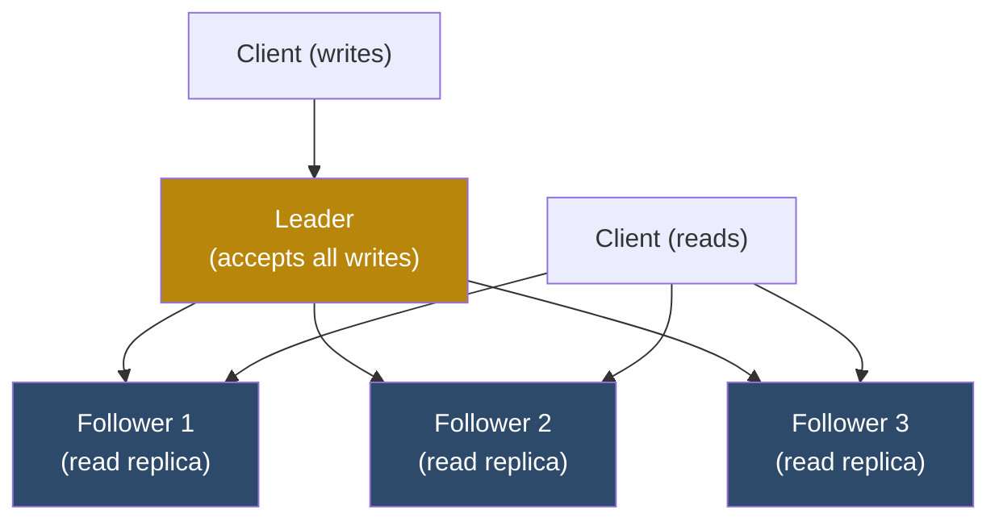
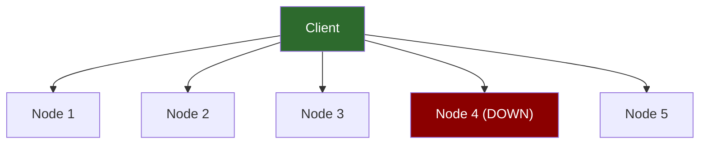
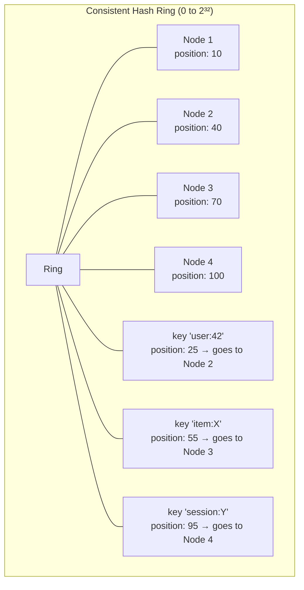

# 6. Replication and Partitioning 🔴

> **What you'll learn:**
> - The three major replication topologies — single-leader, multi-leader, and leaderless — and the precise failure modes of each
> - How to resolve write conflicts without a coordinator using Last-Write-Wins (LWW) and Conflict-Free Replicated Data Types (CRDTs)
> - How consistent hashing distributes data across nodes with minimal rebalancing cost when nodes join or leave
> - How the Dynamo-style W + R > N quorum formula enables tunable availability and consistency

---

## Replication: Why It's Harder Than It Looks

Replication serves two purposes: **fault tolerance** (survive node failures) and **scalability** (read from multiple replicas). Both sound simple. Both are not.

The fundamental problem: if you write data to Node A and Node B is a replica, how do you guarantee that Node B's copy matches Node A's — not just today, but after Node A and Node B both crash independently, after a 10-second network partition, and after someone accidentally writes to Node B directly?

### Single-Leader Replication



**How it works:**
1. All writes go to the leader
2. Leader writes to its WAL, then ships the WAL to followers (or uses row-based binlog replication)
3. Followers apply changes in order; reads can go to any follower

**Replication lag:** The time between a write to the leader and that write becoming visible on a follower. On a healthy LAN, this is microseconds to milliseconds. Under load or across regions, it can be seconds.

**Synchronous vs. Asynchronous Replication:**

```
Synchronous:
    Leader waits for ALL followers to ACK before acknowledging the write to the client.
    Durability: write survives even if leader crashes immediately.
    Trade-off: any slow follower blocks ALL writes → one follower failure = system halt.
    Use case: financial systems requiring zero data loss.

Semi-Synchronous (one sync, rest async):
    Leader waits for exactly ONE follower to ACK; others replicate asynchronously.
    Durability: survives leader crash if sync follower is alive.
    Trade-off: write throughput limited by sync follower latency.
    Use case: most production relational databases (MySQL "semi-sync", PostgreSQL synchronous_standby_names=1).

Asynchronous:
    Leader acknowledges write immediately; replication happens in background.
    Durability: data can be LOST if leader crashes before replication.
    Trade-off: zero write latency overhead.
    Use case: analytics replicas, read-scaling replicas where lag is tolerable.
```

**Critical Failure Mode: Replication Lag and Read-After-Write**

```
// 💥 SPLIT-BRAIN HAZARD: Stale reads after writes
User updates their profile (write goes to leader).
User immediately navigates to profile page (read from follower).
Replication lag = 500ms → follower hasn't received the write yet.
User sees their OLD profile data → "Did my update fail?"

// ✅ FIX: Read-Your-Writes session guarantee
Strategy 1: Read recently-written data from the leader, stale data from followers.
Strategy 2: Track replication positions; only read from a follower if it has caught up
            to the LSN of your most recent write.
Strategy 3: Route all reads for a session to the same follower for 1 minute after a write.
```

**Follower Failure and Catch-Up:**

When a follower restarts after a crash, it uses the **replication offset** (position in the leader's WAL) stored in its own WAL to request all changes it missed. PostgreSQL calls this **WAL shipping**; MySQL calls it the **binlog position**. If the follower falls too far behind (the leader's WAL is rotated away), it must be re-provisioned from a full snapshot.

**Leader Failure: Failover Challenges**

When the leader fails, a new leader must be elected (via consensus, as in Chapter 3, or via an external coordinator like Patroni). Key challenges:

- **The new leader may be behind:** If replication was asynchronous, the new leader may not have all writes the old leader acknowledged. Some clients got success responses for writes that are now lost.
- **Split-brain with the old leader:** The old leader might not be dead — it might just be partitioned. It restarts and tries to serve writes again. Now two nodes think they're leader.

```
// 💥 SPLIT-BRAIN HAZARD: Stale leader accepts writes
Old leader partitioned for 45 seconds.
New leader elected and accepts 1000 new writes.
Old leader partition heals — it doesn't know it's no longer the leader.
Old leader accepts writes → two leaders writing → DIVERGED REPLICAS.

// ✅ FIX: Epoch-based leader validation
Every write includes the current epoch number.
Old leader's epoch = 5. New leader's epoch = 6.
Storage rejects writes with epoch < current max seen epoch.
```

### Multi-Leader Replication

Multi-leader (also called master-master) allows writes to be accepted at multiple nodes simultaneously. Writes are then replicated between leaders asynchronously.

**Use cases:**
- **Multi-datacenter deployments:** Each datacenter has a local leader for low-latency local writes. Cross-datacenter replication is async.
- **Offline-capable clients:** Mobile apps write locally while offline; sync to server when reconnected.
- **Collaborative editing:** Notion, Google Docs internally use variants of multi-leader.

**The inescapable conflict problem:**

```
Leader Europe writes:  key="account:X", balance=1000 → 0 (deducted 1000)
Leader US writes:      key="account:X", balance=1000 → 500 (deducted 500)
Both leaders replicate to each other.
How do we resolve this? The balance cannot simultaneously be 0 and 500.
```

This is the fundamental difficulty of multi-leader: **write conflicts are inevitable** when two leaders accept writes to the same key concurrently, and there is no globally agreed-upon order.

**Conflict Resolution Strategies:**

| Strategy | Mechanism | Safety | Use When |
|----------|-----------|--------|----------|
| **Last Write Wins (LWW)** | Keep the value with the highest timestamp | ❌ Data loss | Values are idempotent; timestamps are trustworthy |
| **Version Vector / Vector Clocks** | Detect concurrent writes; surface conflict | ✅ No loss | Application can merge conflicts; last resort is user intervention |
| **CRDTs** | Mathematically proven merge semantics | ✅ No loss | Counters, sets, sequences where merge is well-defined |
| **Operational Transform** | Transform operations to be commutative | ✅ No loss | Collaborative text editing (Google Docs) |
| **Last Writer Wins (LWW) + Application** | LWW with semantic validation | ⚠️ Application-defined | Append-only or monotonic data |

### Leaderless Replication: The Dynamo Model

Amazon Dynamo (2007) popularized leaderless replication. There is no leader — any node can accept reads and writes. Consistency is achieved through **quorums**.



**The Quorum Formula: W + R > N**

For a cluster of N replicas with write quorum W and read quorum R:

- **W** = number of replicas that must acknowledge a write before success is returned
- **R** = number of replicas that must respond to a read before the result is returned
- **Condition for strong consistency: W + R > N**

Why does this guarantee freshness? If W nodes acknowledged the write, and R nodes must respond to a read, by the pigeonhole principle, at least `W + R - N` nodes responded to both — they have the latest write.

```
Example: N=5, W=3, R=3 → W+R=6 > 5
At least 1 node (W+R-N = 1) must have seen both the write and the read.
→ Reads always see the latest write.

Example: N=5, W=1, R=1 → W+R=2 < 5 → Eventual consistency only
A write is acknowledged after 1 node. A read from a different node may miss it.
```

**Availability under failure:**

```
N=5, W=3, R=3:
If 2 nodes are down:
    Writes: 3 remaining nodes ✅ (exactly W)
    Reads:  3 remaining nodes ✅ (exactly R)
If 3 nodes are down:
    Writes: 2 remaining < W=3 → WRITE FAILURE
    Reads:  2 remaining < R=3 → READ FAILURE
```

### Hinted Handoff: Tolerating Temporary Node Failures

In Dynamo, if a target node is temporarily down during a write, another node stores the data as a **hint** — "I'm holding this on behalf of Node X":

```
Normal write: key → [N1, N2, N3]
N3 is temporarily unavailable:
    Write to [N1, N2, N4_as_hint_for_N3]
    N4 marks the record: "this belongs to N3"
When N3 recovers:
    N4 forwards the hinted data to N3
    N3 acknowledges receipt
    N4 deletes the hint
```

This enables writes to succeed even when their target nodes are down — as long as enough total nodes are alive for the quorum.

**Limitation:** Hinted handoff only works when the node failure is temporary. If N3 is permanently lost and replaced with a fresh node, the new node has none of the data — only a full data transfer from other replicas will populate it.

## Consistent Hashing: Distributing Data Across Nodes

As data grows beyond a single node's capacity, you need to partition (**shard**) it. The simplest approach — `hash(key) % N` — breaks catastrophically when N changes:

```
N=4: key="user:42" → hash("user:42")%4 = 2 → Node 2
Node fails → N=3: hash("user:42")%3 = 0 → Node 0
→ ALL keys remapped! Must migrate 100% of data on any cluster change.
```

**Consistent hashing** solves this by placing both nodes and keys on a conceptual ring [0, 2^32):



**Key assignment rule:** Walk clockwise around the ring from the key's hash position; the first node you encounter is the key's primary node.

**Adding a node:** Insert it on the ring at its hash position. Only the keys between its position and the previous node's position are remapped. On average, `1/N` of keys move.

**Virtual nodes:** A problem with basic consistent hashing: with few physical nodes, the ring is uneven. One node might "own" 50% of the ring, another 10%. Solution: each physical node gets **150–200 virtual node positions** on the ring, spreading ownership more evenly.

```
Physical Node 1 → virtual positions: [3, 19, 47, 83, 110, 156, ...]
Physical Node 2 → virtual positions: [8, 31, 61, 97, 129, 178, ...]
...
```

With virtual nodes, the maximum imbalance between nodes is typically <10% even with small cluster sizes, and rebalancing on node addition/removal distributes evenly across all remaining nodes.

## CRDTs: Mathematically Safe Conflict Resolution

A **Conflict-Free Replicated Data Type (CRDT)** is a data structure with a **merge operation** that is:
- **Commutative:** merge(A, B) = merge(B, A)
- **Associative:** merge(merge(A, B), C) = merge(A, merge(B, C))
- **Idempotent:** merge(A, A) = A

With these properties, any set of updates can be merged in any order, multiple times, and always produce the same result. No coordination or conflict resolution logic needed.

### G-Counter (Grow-Only Counter)

The simplest CRDT — a counter that only increments, distributed across N nodes:

```
State: vector of N counters, one per node
    [Node1_count, Node2_count, ..., NodeN_count]

Increment at Node i:  state[i] += 1
Query (value):        sum(state)
Merge(A, B):          [max(A[0],B[0]), max(A[1],B[1]), ..., max(A[N],B[N])]
```

**Example — two nodes independently increment:**

```
Node 1: [3, 0]   (incremented 3 times)
Node 2: [0, 5]   (incremented 5 times)

Merge: [max(3,0), max(0,5)] = [3, 5]
Value = 3 + 5 = 8
```

This is exactly correct — no conflicts, no coordination. Used by Redis Cluster for distributed counters.

### PN-Counter (Positive/Negative Counter)

Two G-Counters: one for increments (P), one for decrements (N). Value = sum(P) - sum(N).

### LWW-Element-Set (Last-Write-Wins Set)

A set where each element has a timestamp. Merge takes the element with the higher timestamp. Supports both add and remove. Trade-off: data loss if timestamps are not reliable (see Chapter 1).

### OR-Set (Observed-Remove Set)

The correct alternative to LWW-Element-Set — each add operation generates a unique tag. Remove operations remove specific tags. An element is in the set if any of its add-tags are present.

```
Node A adds "Alice" → tag: uuid-1
Node B adds "Alice" → tag: uuid-2
Node A removes "Alice" (removes tag uuid-1) → "Alice" still in set (uuid-2 present)
Merge: {uuid-2: "Alice"} → "Alice" is in the set
```

This correctly handles the case where two nodes concurrently add and remove the same element.

<details>
<summary><strong>🏋️ Exercise: Replication Topology for a Global Social Platform</strong> (click to expand)</summary>

**Scenario:** You are designing the replication architecture for a social platform serving 500 million users across 4 global regions: US-East, EU-West, AP-Southeast, and SA-East.

Requirements:
- Users primarily interact with data in their home region (80% of reads/writes are local)
- User profile updates must be visible globally within 5 seconds
- Post "like" counts must eventually converge — occasional brief inconsistencies are acceptable
- User account deletions (GDPR compliance) must propagate globally within 1 hour and must not be lost
- Write availability is more important than strict consistency for social interactions
- The system handles 2 million writes/second peak globally

Design:
1. Choose a replication topology (single-leader, multi-leader, leaderless) and explain why
2. Describe how you handle write conflicts for profile updates, like counts, and account deletions differently
3. Explain your consistent hashing strategy for sharding user data
4. What is your W+R+N configuration and what consistency level does it provide?

<details>
<summary>🔑 Solution</summary>

**1. Topology: Multi-Leader with Regional Leaders**

Multi-leader is the correct choice here because:
- 80% of reads/writes are local → single-leader across regions would add 100-300ms cross-region RTT to every write
- 5-second global visibility is achievable with async cross-region replication (typical inter-region replication lag is 50-500ms)
- Write availability is prioritized → AP design; conflicts are expected and handled per-data-type

Architecture:
```
Region: US-East    ←→    Region: EU-West
    Leader (US)               Leader (EU)
    3 Followers               3 Followers
        ↕                         ↕
Region: AP-Southeast  ←→   Region: SA-East
    Leader (AP)               Leader (SA)
    3 Followers               3 Followers
```

Within each region: single-leader replication (3-4 followers for read scaling).
Cross-region: asynchronous multi-leader replication. Conflict resolution is per-data-type.

**2. Conflict Resolution by Data Type**

**Profile Updates → Last-Write-Wins with Application-Level Sequencing**

```
Profile struct: { user_id, display_name, bio, avatar_url, updated_at (HLC timestamp), update_sequence }
Conflict rule: keep the record with higher update_sequence
Tie-break: keep the record with higher updated_at (HLC — more reliable than NTP)
```

User can only update their profile from one session at a time (client enforces this). Multi-leader conflicts only arise if user updates profile from two regions simultaneously — rare, and LWW is semantically correct.

**Like Counts → G-Counter CRDT**

```
like_count: {
    "US": 1240,
    "EU": 890,
    "AP": 340,
    "SA": 120
}
value = 1240 + 890 + 340 + 120 = 2590
merge: take max per region component
```

Concurrent like events in different regions auto-merge without conflict. Brief local views differ by at most the sum of likes in-flight across regions (seconds of lag = hundreds of likes at most).

**Account Deletions → Consensus Required**

GDPR requires hard guarantees. Account deletion cannot be lost. Use a separate CP coordination path:

```
1. User requests deletion → sent to all 4 regional leaders via a "deletion coordinato" service
2. Each regional leader writes a deletion tombstone with consensus (Raft within region)
3. Deletion coordinator waits for all 4 regions to ACK the tombstone
4. Only after global ACK does coordinator mark deletion as committed
5. Background job propagates deletion to all followers, CDN caches, etc.
```

This is a 4-region 2PC variant — acceptable because deletions are rare (~10/s globally) and the 1-hour SLA allows for retry on partial failure.

**3. Consistent Hashing for User Sharding**

```
Hash space: MD5(user_id) → 128-bit hash → map to [0, 2^32)
Virtual nodes per physical server: 200
Number of physical shards per region: 256

user_id=12345 → hash → position P → walk clockwise → first virtual node → map to physical shard
```

Each regional leader cluster handles 256 shards of user data:
- Adding a new shard server: only ~1/257 of keys migrate (from the adjacent shard)
- Cross-shard transactions: avoided by design (users don't transact with each other; social interactions are eventually consistent)

**4. Quorum Configuration**

Within a region (single-leader, 4 nodes = 1 leader + 3 followers):
- Writes: W=1 (leader acknowledgment) → async replication to followers
- Reads: R=1 from follower (eventual) or R=1 from leader (read-your-writes)
- N=4: can lose 3 followers and still write; read from leader always available

This is AP within each region with read-your-writes session guarantee (route reads to the leader for 5 seconds after any write).

Cross-region replication: asynchronous (EL trade-off — latency < consistency). Target: < 5 second propagation under normal conditions.
</details>
</details>

---

> **Key Takeaways**
> - Single-leader replication is simple but creates a write bottleneck and requires failover coordination; async replication risks data loss on leader crash
> - Multi-leader replication enables low-latency writes across regions but makes write conflict resolution **mandatory** — design your conflict strategy before choosing multi-leader
> - Leaderless (Dynamo-style) replication with W+R>N quorums provides tunable consistency; hinted handoff handles temporary node failures
> - **Consistent hashing** limits key movement to 1/N of keys when nodes join/leave; virtual nodes ensure load balance
> - **CRDTs** (G-Counter, OR-Set) provide mathematically sound conflict-free merging for specific data types — use them wherever semantics permit

> **See also:**
> - [Chapter 1: Time, Clocks, and Ordering](ch01-time-clocks-and-ordering.md) — Why LWW timestamp-based conflict resolution is unreliable
> - [Chapter 2: CAP Theorem and PACELC](ch02-cap-theorem-and-pacelc.md) — The consistency/availability position of each replication topology
> - [Chapter 9: Capstone: Global Key-Value Store](ch09-capstone-global-key-value-store.md) — Applying leaderless replication with quorums end-to-end
