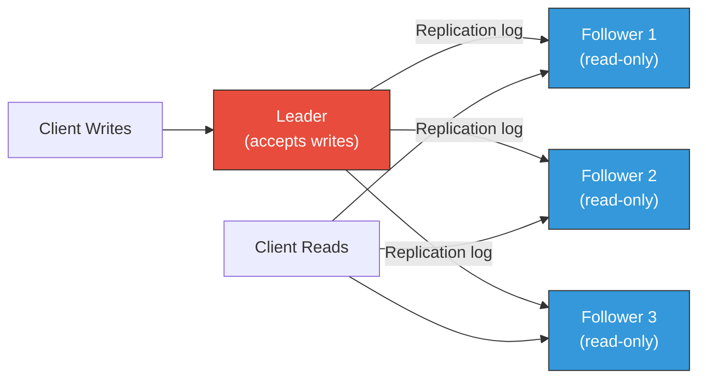
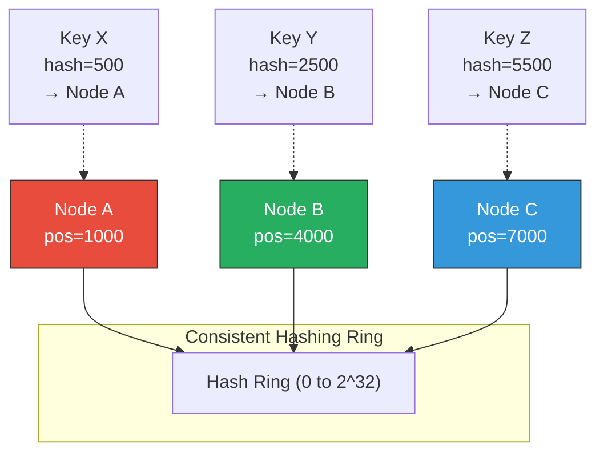

# 6. Replication and Partitioning 🔴

> **What you'll learn:**
> - The three replication topologies — single-leader, multi-leader, and leaderless (Dynamo-style) — and the consistency, availability, and conflict trade-offs of each.
> - How to resolve write conflicts in replicated systems: Last-Write-Wins, version vectors, and Conflict-free Replicated Data Types (CRDTs).
> - **Consistent hashing** for data partitioning: how it works, why naive hashing fails during rebalancing, and how virtual nodes solve hot-spot problems.
> - Anti-entropy mechanisms: read repair, Merkle trees, and hinted handoff for eventually consistent systems.

**Cross-references:** Builds on ordering from [Chapter 1](ch01-time-clocks-and-ordering.md) (vector clocks for conflict detection), CAP/PACELC from [Chapter 2](ch02-cap-theorem-and-pacelc.md), and consensus from [Chapter 3](ch03-raft-and-paxos-internals.md). Directly feeds the capstone design in [Chapter 9](ch09-capstone-global-kv-store.md).

---

## Why Replicate?

| Goal | How replication achieves it |
|---|---|
| **High availability** | If one replica crashes, others serve requests. |
| **Low latency** | Serve reads from the geographically closest replica. |
| **Read scalability** | Distribute read load across N replicas. |
| **Durability** | Data survives disk failure if copies exist on other nodes. |

The fundamental tension: **keeping replicas in sync while remaining available and fast.** Every replication topology makes a different trade-off.

---

## Topology 1: Single-Leader Replication

One node (the **leader/primary**) accepts all writes. It replicates changes to **followers/replicas** that serve reads.



### Synchronous vs. Asynchronous Replication

| Mode | Guarantee | Latency | Risk |
|---|---|---|---|
| **Synchronous** | Write acknowledged only after all followers confirm | High (waits for slowest follower) | One slow follower blocks all writes |
| **Semi-synchronous** | Write acknowledged after leader + 1 follower | Medium | Better trade-off; at least 2 durable copies |
| **Asynchronous** | Write acknowledged after leader writes locally | Low | Data loss if leader crashes before replication |

**Replication lag** in async replication creates read anomalies:

- **Reading your own writes:** User writes to the leader, then reads from a follower that hasn't received the write yet. Fix: route reads to the leader for data the user recently wrote.
- **Monotonic reads:** User reads from Follower A (up-to-date), then from Follower B (lagging). Data appears to "go backwards in time." Fix: pin each user to a specific follower.

### Leader Failover

When the leader crashes:
1. **Detect failure** — followers notice missing heartbeats (timeout-based).
2. **Elect new leader** — usually the follower with the most up-to-date replication log (or use Raft/consensus).
3. **Reconfigure** — clients redirect writes to the new leader. Old leader, if it recovers, becomes a follower.

**Failover dangers:**
- If the old leader had unreplicated writes, those are **permanently lost** in async replication.
- If the old leader comes back unaware of the failover, **split-brain**: two nodes accept writes.
- Auto-increment IDs or external systems (Redis, Elasticsearch) that were synced with the old leader now have dangling references.

---

## Topology 2: Multi-Leader Replication

Multiple nodes accept writes (typically one leader per datacenter). Writes are asynchronously replicated between leaders.

**Use case:** Multi-datacenter deployments where each DC needs local write latency.

### The Conflict Problem

If two leaders accept concurrent writes to the same key, the writes conflict:

```
DC-West Leader: SET user.email = "alice@west.com"   (T1)
DC-East Leader: SET user.email = "alice@east.com"   (T1)
```

Both are valid writes. Which one wins?

### Conflict Resolution Strategies

| Strategy | How it works | Trade-off |
|---|---|---|
| **Last-Write-Wins (LWW)** | Assign each write a timestamp; highest timestamp wins | Simple, but **silently drops data** if clocks skew (Ch. 1) |
| **Custom merge function** | Application-defined logic (e.g., union of sets, longest string) | Most correct, but pushes complexity to the application |
| **CRDTs** | Use data structures that mathematically guarantee conflict-free merging | Automatic, but limits the data model (counters, sets, registers) |
| **Operational transformation** | Transform conflicting operations against each other (Google Docs) | Complex to implement; proven in collaborative editing |

---

## Topology 3: Leaderless Replication (Dynamo-Style)

No designated leader. **Any node can accept reads and writes.** The client sends requests to multiple replicas and uses quorum rules for consistency.

This is the model used by Amazon DynamoDB, Apache Cassandra, Riak, and Voldemort.

### Quorum Reads and Writes

For a key replicated to **N** nodes:
- **W** = number of nodes that must acknowledge a write.
- **R** = number of nodes that must respond to a read.

**If W + R > N**, at least one node in the read set participated in the latest write → the read is guaranteed to see the latest value (assuming no concurrent writes).

```
N=3, W=2, R=2:
  Write goes to all 3 replicas, succeeds when 2 acknowledge.
  Read queries all 3 replicas, returns when 2 respond.
  At least 1 node is in both sets → read sees latest write.

N=3, W=1, R=1:
  Fast but NO consistency guarantee. Read might hit the one node
  that hasn't received the write yet.
```

### The Naive Monolith Way

```rust
/// 💥 SPLIT-BRAIN HAZARD: Writing to a single replica without quorum.
/// If this node is isolated (network partition), the write is lost when
/// the partition heals and the node is overwritten by the majority.
async fn write_to_store(node: &Node, key: &str, value: &[u8]) {
    // 💥 No quorum. No replication. Single point of failure.
    node.put(key, value).await;
    // 💥 If this node crashes, the data is gone forever.
}
```

### The Distributed Fault-Tolerant Way

```rust
/// ✅ FIX: Quorum write to N replicas. Wait for W acknowledgments.
/// Includes a vector clock for conflict detection on concurrent writes.
async fn quorum_write(
    replicas: &[NodeClient],
    key: &str,
    value: &[u8],
    context: &VectorClock, // Causal context from the last read
    n: usize,
    w: usize,
) -> Result<WriteResult, QuorumError> {
    // ✅ Increment the vector clock for this write.
    let mut new_clock = context.clone();
    new_clock.increment(&local_node_id());

    // ✅ Send the write to ALL N replicas concurrently.
    let futures: Vec<_> = replicas.iter().map(|node| {
        node.put(key, value, &new_clock)
    }).collect();

    let results = futures::future::join_all(futures).await;
    let ack_count = results.iter().filter(|r| r.is_ok()).count();

    if ack_count >= w {
        // ✅ Quorum achieved. Write is durable on W nodes.
        Ok(WriteResult { clock: new_clock, acks: ack_count })
    } else {
        // ✅ Quorum NOT achieved. Report failure — client must retry.
        Err(QuorumError::InsufficientAcks { required: w, received: ack_count })
    }
}

/// ✅ FIX: Quorum read from N replicas. Wait for R responses.
/// Return the value with the highest vector clock. Trigger read-repair
/// for stale replicas.
async fn quorum_read(
    replicas: &[NodeClient],
    key: &str,
    n: usize,
    r: usize,
) -> Result<ReadResult, QuorumError> {
    let futures: Vec<_> = replicas.iter().map(|node| {
        node.get(key)
    }).collect();

    let results = futures::future::join_all(futures).await;
    let mut responses: Vec<_> = results.into_iter().filter_map(|r| r.ok()).collect();

    if responses.len() < r {
        return Err(QuorumError::InsufficientResponses { required: r, received: responses.len() });
    }

    // ✅ Find the response with the newest vector clock.
    responses.sort_by(|a, b| b.clock.partial_cmp(&a.clock).unwrap_or(std::cmp::Ordering::Equal));
    let newest = &responses[0];

    // ✅ Read-repair: send the newest value to stale replicas.
    for resp in &responses[1..] {
        if resp.clock < newest.clock {
            // Background: update this stale replica with the newest value.
            tokio::spawn(repair_replica(resp.node_id, key, newest.clone()));
        }
    }

    Ok(newest.clone())
}
```

---

## Consistent Hashing: Distributing Data Across Nodes

### The Problem with Naive Hashing

```
node = hash(key) % num_nodes
```

If `num_nodes` changes (a node joins or leaves), **almost every key** maps to a different node. This triggers a massive data migration storm.

```
num_nodes = 3: hash("user:42") % 3 = 1 → Node 1
num_nodes = 4: hash("user:42") % 4 = 2 → Node 2  ← MOVED!
```

With N nodes, adding one node remaps ~(N-1)/N of all keys. For 100 nodes, that's 99% of data moved.

### Consistent Hashing: The Ring

Place nodes on a circular hash ring at positions `hash(node_id)`. A key is stored on the first node encountered clockwise from `hash(key)`.



When Node D joins between A and B:
- Only keys between A and D are remapped (from B to D).
- All other keys stay put.
- On average, only 1/N of keys move — instead of (N-1)/N.

### Virtual Nodes (Vnodes)

Physical nodes are rarely distributed uniformly on the ring. A node placed at a single point might own a disproportionate slice and become a hot spot.

**Solution:** Each physical node owns many *virtual nodes* scattered around the ring (e.g., 256 vnodes per physical node). This smooths out the distribution and allows heterogeneous hardware—a more powerful machine gets more vnodes.

```
Physical Node A → vnodes: A-1 (pos=200), A-2 (pos=3500), A-3 (pos=8100), ...
Physical Node B → vnodes: B-1 (pos=1100), B-2 (pos=5200), B-3 (pos=9400), ...
```

---

## Anti-Entropy: Keeping Replicas in Sync

In leaderless systems, replicas can drift apart (missed writes due to temporary failures). Three mechanisms bring them back in sync:

### 1. Read Repair

On a quorum read, if some replicas return stale data, the coordinator sends the newest value to the stale replicas. This is "repair on read"—only keys that are actively read get repaired.

### 2. Hinted Handoff

If a replica is temporarily down during a write, the coordinator writes to another available node (a "hint"). When the failed node recovers, the hint is forwarded to it. This keeps writes available during transient failures without violating quorum.

### 3. Merkle Tree Anti-Entropy

For background synchronization (repairing keys that are never read), replicas periodically compare **Merkle trees** — hash trees where each leaf is the hash of a key range:

```
                     Root Hash
                    /          \
           Hash(left)      Hash(right)
           /      \         /       \
     H(0-25%)  H(25-50%)  H(50-75%)  H(75-100%)
```

Two replicas exchange root hashes. If they match, the replicas are in sync. If they differ, they recursively compare subtrees to find the exact key ranges that need synchronization. This minimizes the amount of data transferred.

---

## Conflict-free Replicated Data Types (CRDTs)

CRDTs are data structures designed to be merged automatically and always converge to the same state, regardless of the order of operations. They eliminate the need for conflict resolution logic.

| CRDT | Type | Merge rule | Example use |
|---|---|---|---|
| **G-Counter** (Grow-only counter) | State-based | Element-wise max | Page view counts |
| **PN-Counter** (Positive-Negative counter) | State-based | Max of positive + max of negative | Like/dislike counts |
| **G-Set** (Grow-only set) | State-based | Union | Tags, labels (add-only) |
| **OR-Set** (Observed-Remove set) | Operation-based | Unique tags per add; remove removes specific tags | Shopping cart (add/remove items) |
| **LWW-Register** | State-based | Highest timestamp wins | User profile fields (with causal timestamps) |

### G-Counter Example

```rust
use std::collections::HashMap;

/// A grow-only counter CRDT. Each node maintains its own increment counter.
/// The total value is the sum of all entries. Merging takes the element-wise max.
#[derive(Clone, Debug)]
struct GCounter {
    counts: HashMap<String, u64>,
}

impl GCounter {
    fn new() -> Self { Self { counts: HashMap::new() } }

    /// Increment this node's counter.
    fn increment(&mut self, node_id: &str) {
        *self.counts.entry(node_id.to_string()).or_insert(0) += 1;
    }

    /// Total value across all nodes.
    fn value(&self) -> u64 {
        self.counts.values().sum()
    }

    /// Merge with another replica's counter.
    /// Take the element-wise maximum — this is commutative, associative,
    /// and idempotent, guaranteeing convergence.
    fn merge(&mut self, other: &GCounter) {
        for (node, &count) in &other.counts {
            let local = self.counts.entry(node.clone()).or_insert(0);
            *local = (*local).max(count);
        }
    }
}
```

---

<details>
<summary><strong>🏋️ Exercise: Design a Multi-Region Shopping Cart</strong> (click to expand)</summary>

### Scenario

You are designing a shopping cart service for a global e-commerce platform with datacenters in US-East, EU-West, and AP-Southeast. Requirements:

- Users can add and remove items from their cart from any region.
- Cart should be available even during inter-region network partitions.
- After the partition heals, carts must converge to the correct state.
- Users should see their own recent changes immediately (read-your-writes).

Design the replication topology, data model, and conflict resolution strategy.

<details>
<summary>🔑 Solution</summary>

**Replication topology: Leaderless with per-region quorum**

- Cart data is replicated to N=3 nodes per region (9 total across 3 regions).
- Reads and writes within a region use local quorum: W=2, R=2 (out of 3 local replicas).
- Cross-region replication is asynchronous — each region gossips its state to other regions.
- During an inter-region partition, each region operates independently (AP behavior).

**Data model: OR-Set CRDT**

The shopping cart is modeled as an **Observed-Remove Set (OR-Set)**:
- Each `add(item)` generates a unique tag: `(item, unique_id)`.
- `remove(item)` removes all tags for that item that the client has *observed*.
- Merge: union of all tags. Items appear in the cart if they have at least one surviving tag.

```
US-East:  add("shirt") → {(shirt, tag-1)}
EU-West:  add("shirt") → {(shirt, tag-2)}     (independent add)
US-East:  remove("shirt") → removes tag-1

After merge:
  US-East sees: {(shirt, tag-2)}  → shirt is in the cart (EU-West's add survives)
```

This matches user intent: if one device adds an item and another device (unaware) also adds it, the item should remain after a local remove. The OR-Set captures this correctly.

**Read-your-writes guarantee:**

- Route each user's reads to the same region they write to (geo-affinity via DNS or edge routing).
- Within the region, use W=2 for writes and R=2 for reads. Since W+R (4) > N (3), reads within the same region will always see the user's latest write.
- Optionally, include a session token containing the last-write vector clock. The read handler waits until the local replica has caught up past this vector clock before responding.

**Key trade-offs:**

| Dimension | Choice | Rationale |
|---|---|---|
| Consistency model | Eventual (OR-Set convergence) | Shopping cart correctness ≠ financial correctness |
| Partition behavior | PA (available) | Users must be able to modify carts during partition |
| Normal latency | EL (low latency, local quorum) | Cart operations should feel instantaneous |
| PACELC classification | PA/EL | |

</details>
</details>

---

> **Key Takeaways**
>
> 1. **Single-leader replication is simplest** but creates a write bottleneck and requires careful failover. Async replication risks data loss; sync replication risks availability.
> 2. **Multi-leader replication enables multi-DC writes** but introduces write conflicts that must be resolved (LWW, custom merge, CRDTs).
> 3. **Leaderless replication (Dynamo-style)** uses quorum rules (W+R>N) to balance consistency and availability. It tolerates individual node failures gracefully.
> 4. **Consistent hashing** distributes data evenly across nodes and minimizes data movement when nodes join or leave. Virtual nodes smooth out the distribution.
> 5. **CRDTs are the gold standard for automatic conflict resolution** in eventually consistent systems. They trade data model expressiveness for guaranteed convergence.
> 6. **Anti-entropy** (read repair, hinted handoff, Merkle trees) is essential for keeping replicas synchronized in leaderless systems.

---

> **See also:**
> - [Chapter 1: Time, Clocks, and Ordering](ch01-time-clocks-and-ordering.md) — vector clocks for conflict detection in leaderless replication.
> - [Chapter 3: Raft and Paxos Internals](ch03-raft-and-paxos-internals.md) — consensus-based single-leader replication.
> - [Chapter 5: Storage Engines](ch05-storage-engines.md) — each replica runs its own storage engine.
> - [Chapter 9: Capstone: Design a Global Key-Value Store](ch09-capstone-global-kv-store.md) — applies all replication and partitioning concepts.
