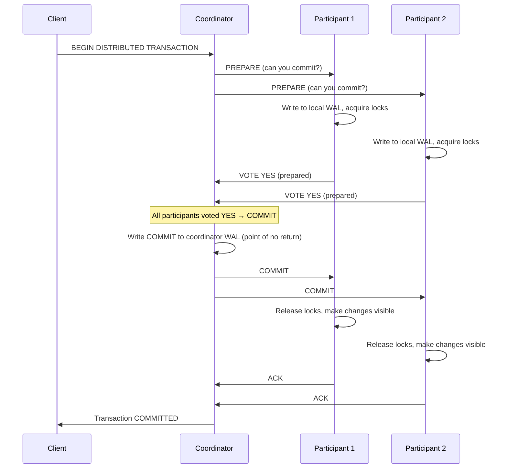

# 7. Transactions and Isolation Levels 🔴

> **What you'll learn:**
> - What ACID actually means in practice — and where each property is commonly violated
> - The three canonical read anomalies (dirty reads, non-repeatable reads, phantom reads) and which isolation levels prevent them
> - How Multi-Version Concurrency Control (MVCC) achieves snapshot isolation without locking readers
> - How to implement distributed transactions: the Saga pattern vs Two-Phase Commit (2PC), and why each is used in different contexts

---

## ACID: What It Actually Means

**ACID** is the most overloaded acronym in databases. Every database vendor claims it; almost no two databases implement it the same way.

| Property | Common Understanding | What It Actually Means |
|----------|---------------------|----------------------|
| **Atomicity** | "All or nothing" | If a transaction aborts, ALL its writes are rolled back. No partial state. |
| **Consistency** | "Data is always valid" | The database transitions from one valid state to another. (This is mostly an *application* invariant — the DB enforces constraints, but business rules are your problem.) |
| **Isolation** | "Transactions don't interfere" | **This is the complex one.** See below — there is a *spectrum* of isolation, not a binary. |
| **Durability** | "Committed writes persist" | A committed write survives a crash. Typically means WAL fsynced to disk before ACK. |

**The critical insight:** different databases implement **different levels** of isolation under the "I" in ACID. PostgreSQL's default is **Read Committed**; CockroachDB's default is **Serializable**. These are not the same thing.

## The Read Anomaly Spectrum

Three canonical anomalies can occur when isolation is weaker than perfect:

### Dirty Read

A transaction reads data written by a **not-yet-committed** transaction. If that transaction aborts, the read data was "phantomware" — it never officially existed.

```
// 💥 DIRTY READ HAZARD (Read Uncommitted isolation)
Transaction A:          Transaction B:
  BEGIN;
  UPDATE accounts
    SET balance = 1000   -- Not yet committed
    WHERE id = 42;
                           BEGIN;
                           SELECT balance          -- Reads 1000 (DIRTY!)
                             FROM accounts
                             WHERE id = 42;
                           -- Makes a decision based on 1000
  ROLLBACK;              -- A aborts! Balance is still 500.
                           -- B made a decision based on data
                           -- that NEVER EXISTED. 💥
```

### Non-Repeatable Read

A transaction reads the same row twice and gets different values because another committed transaction modified it between the reads.

```
// 💥 NON-REPEATABLE READ HAZARD (Read Committed isolation)
Transaction A (audit report):   Transaction B (balance update):
  BEGIN;
  SELECT balance FROM accounts
    WHERE id = 42;              -- Returns 1000
                                  BEGIN;
                                  UPDATE accounts
                                    SET balance = 500
                                    WHERE id = 42;
                                  COMMIT;   -- Committed!
  SELECT balance FROM accounts
    WHERE id = 42;              -- Returns 500 (CHANGED!)
  -- Report is INCONSISTENT: first read said 1000, second said 500.
  -- Same transaction, same query, different answer. 💥
```

### Phantom Read

A transaction re-executes a query and gets a different *set of rows* because another committed transaction inserted or deleted rows matching the query's predicate.

```
// 💥 PHANTOM READ HAZARD (Repeatable Read isolation, some DBs)
Transaction A:                  Transaction B:
  BEGIN;
  SELECT COUNT(*) FROM orders
    WHERE user_id = 7;          -- Returns 3
                                  BEGIN;
                                  INSERT INTO orders
                                    (user_id, ...) VALUES (7, ...);
                                  COMMIT;   -- New row inserted!
  SELECT COUNT(*) FROM orders
    WHERE user_id = 7;          -- Returns 4 (PHANTOM ROW!)
  INSERT INTO order_summaries
    (user_id, count) VALUES (7, SELECT COUNT(*) ...);
  -- Summary now has 4, but business logic assumed 3. 💥
```

## Isolation Levels: The Standard and Reality

SQL92 defines four isolation levels. Most databases add **Snapshot Isolation** as a practical middle ground:

| Isolation Level | Dirty Read | Non-Repeatable Read | Phantom Read | Notes |
|----------------|-----------|--------------------|--------------|----|
| **Read Uncommitted** | ❌ Possible | ❌ Possible | ❌ Possible | Almost never used; dangerous |
| **Read Committed** | ✅ Prevented | ❌ Possible | ❌ Possible | PostgreSQL, Oracle default |
| **Repeatable Read** | ✅ Prevented | ✅ Prevented | ❌ Possible (in standard) | MySQL InnoDB default (also prevents phantoms via gap locks) |
| **Snapshot Isolation** | ✅ Prevented | ✅ Prevented | ✅ Prevented | Not in SQL92; used by PostgreSQL 9.1+ "Repeatable Read" |
| **Serializable** | ✅ Prevented | ✅ Prevented | ✅ Prevented | Transactions appear serial; highest isolation |

> **PostgreSQL quirk:** PostgreSQL's "REPEATABLE READ" is actually Snapshot Isolation (MVCC-based). PostgreSQL's "SERIALIZABLE" uses SSI (Serializable Snapshot Isolation). MySQL InnoDB's "REPEATABLE READ" uses gap locks to prevent phantoms. Read the docs, not the SQL92 labels.

## MVCC: How Snapshot Isolation Works

Most production databases implement Snapshot Isolation (and often full Serializability) using **Multi-Version Concurrency Control (MVCC)**. The key insight: **instead of locking rows, keep multiple versions of each row simultaneously.**

```
// MVCC row storage (conceptual, PostgreSQL-style)
// Each row has: xmin (created by transaction ID), xmax (deleted by transaction ID)

Row versions:
  accounts.id=42: [
    { balance: 500, xmin: 100, xmax: 200 },  -- Created by tx 100, deleted by tx 200
    { balance: 1000, xmin: 200, xmax: NULL }, -- Created by tx 200, not yet deleted
  ]

Transaction A starts with snapshot at transaction ID = 201:
  "I see committed transactions up to ID 200. I ignore 201+."
  
  SELECT balance FROM accounts WHERE id = 42;
  -- Scan both versions:
  -- Version (xmin=100, xmax=200): xmax=200 is committed AND visible
  --   (tx 200 committed before my snapshot). This version was DELETED.
  -- Version (xmin=200, xmax=NULL): xmin=200 is committed AND visible.
  --   xmax=NULL = not yet deleted. This is the CURRENT version.
  -- Returns: 1000  ✅

Transaction B (running at the SAME TIME, snapshot at ID = 201 too):
  UPDATE accounts SET balance = 2000 WHERE id = 42;
  -- Creates new row version:
  -- { balance: 2000, xmin: 201 (my tx ID), xmax: NULL }
  -- Marks old version as deleted: sets xmax = 201 on the 1000 row
  COMMIT; -- Tx 201 commits

Transaction A re-reads:
  SELECT balance FROM accounts WHERE id = 42;
  -- Still using snapshot at ID = 201.
  -- Tx 201 committed AFTER our snapshot → we IGNORE it.
  -- Still sees: balance = 1000  ✅  (Repeatable Read achieved via MVCC!)
```

**MVCC advantages:**
- **Readers never block writers, writers never block readers** — massive concurrency improvement
- **Queries get a consistent snapshot** without acquiring any read locks
- **Point-in-time queries** are possible: `SELECT * AS OF timestamp '2024-01-01 00:00:00'`

**MVCC disadvantages:**
- **Garbage collection (VACUUM):** Old row versions must be cleaned up periodically (PostgreSQL VACUUM, Oracle undo segments). Autovacuum failure is a common cause of bloat.
- **Write-write conflicts still require locking:** Two transactions updating the same row use row-level locks (the second UPDATE waits for the first to commit or abort).
- **Does NOT guarantee Serializability by itself:** MVCC with snapshot isolation can still exhibit write skew anomalies.

### Write Skew: The MVCC Trap

```
// 💥 WRITE SKEW under Snapshot Isolation
// (two non-conflicting writes that together violate an invariant)

// Invariant: At least one doctor must be on-call at all times.
// Alice and Bob are both on-call. Both want to take the night off.

Transaction A (Alice):          Transaction B (Bob):
  BEGIN (snapshot: all 2 on-call)
                                  BEGIN (snapshot: all 2 on-call)
  SELECT COUNT(*) FROM on_call;   SELECT COUNT(*) FROM on_call;
  -- Returns 2                    -- Returns 2
  
  -- "Safe to take off" (2 > 1)   -- "Safe to take off" (2 > 1)
  UPDATE on_call
    SET status = 'off'
    WHERE doctor = 'Alice';
  COMMIT;                         UPDATE on_call
                                    SET status = 'off'
                                    WHERE doctor = 'Bob';
                                  COMMIT;
  
  -- Result: 0 doctors on-call! INVARIANT VIOLATED. 💥
  -- MVCC saw no conflict (different rows), but both reads were stale.
  -- ✅ FIX: Use SERIALIZABLE isolation, which detects this read-write dependency.
```

## Distributed Transactions: The Two Approaches

Within a single node, transactions work well. Across multiple nodes with independent storage engines, the problem becomes dramatically harder.

### Approach 1: Two-Phase Commit (2PC)

2PC coordinates an atomic operation across multiple participants. It gives ACID guarantees but at high cost:



**2PC failure modes:**

```
// 💥 COORDINATOR CRASH HAZARD: If the coordinator crashes AFTER
//    writing COMMIT to its WAL but BEFORE sending COMMIT to participants,
//    participants are stuck in PREPARED state — locks held, cannot proceed.

// Recovery: Coordinator restarts, replays WAL, re-sends COMMIT.
// But if coordinator disk is lost: participants are stuck INDEFINITELY
// (blocking 2PC problem). Can't abort (coordinator said commit).
// Can't commit without coordinator.

// ✅ FIX: Use a highly available coordinator (Raft-based, like CockroachDB's
//    transaction coordinator) so coordinator crash does not lose the WAL.
```

**2PC characteristics:**

| Property | Value |
|----------|-------|
| **Consistency guarantee** | Strong (atomic, ACID) |
| **Availability during coordinator failure** | None — blocks until coordinator recovers |
| **Latency cost** | 2 × RTT minimum (2 phases) + fsync at coordinator |
| **Scalability** | Poor — all participants lock during both phases |
| **Used by** | XA transactions, CockroachDB, Spanner, PostgreSQL distributed extensions |

### Approach 2: The Saga Pattern

A Saga decomposes a multi-step distributed transaction into a sequence of local transactions, each with a compensating transaction that undoes its effect if a later step fails.

```
// Saga for a hotel booking system
// Steps: charge card → reserve hotel → reserve flight → confirm all

// Forward transactions:
fn charge_card(amount) -> Result<ChargeId, Error>
fn reserve_hotel(dates) -> Result<ReservationId, Error>
fn reserve_flight(dates) -> Result<BookingId, Error>

// Compensating transactions (undo):
fn refund_card(charge_id) -> Result<(), Error>
fn cancel_hotel(reservation_id) -> Result<(), Error>
fn cancel_flight(booking_id) -> Result<(), Error>

// Saga execution:
fn book_trip():
    let charge_id = charge_card(total_amount)?;
    // On failure from here: refund_card(charge_id)
    
    let reservation_id = match reserve_hotel(dates) {
        Ok(id) => id,
        Err(e) => {
            refund_card(charge_id);  // Compensate
            return Err(e);
        }
    };
    
    let booking_id = match reserve_flight(dates) {
        Ok(id) => id,
        Err(e) => {
            cancel_hotel(reservation_id);  // Compensate
            refund_card(charge_id);         // Compensate
            return Err(e);
        }
    };
    
    confirm_all(charge_id, reservation_id, booking_id)
```

**Saga choreography vs orchestration:**

```
// Orchestrated Saga: A central coordinator (Saga Orchestrator)
//   drives the saga steps and compensation.
//   Pro: Explicit control flow, easy to audit.
//   Con: Single point of failure (mitigated by making orchestrator stateful/durable).

// Choreographed Saga: Each service reacts to events from the previous step.
//   Pro: No central coordinator, more resilient.
//   Con: Implicit control flow, harder to trace (requires distributed tracing).
//   con: Compensations must handle out-of-order events gracefully.
```

### 2PC vs Saga: When to Use Which

| Dimension | Two-Phase Commit (2PC) | Saga Pattern |
|-----------|----------------------|-------------|
| **Consistency** | Strong ACID (atomic) | Eventual (steps are individually committed) |
| **Isolation** | Full isolation (peer participants lock) | None — intermediate states are visible |
| **Failure handling** | Coordinator recovers and finishes | Compensating transactions roll back effect |
| **Performance** | 2 RTTs minimum; all participants lock | Each step independent; no cross-service locking |
| **Availability** | Blocks if coordinator fails | Individual steps can fail independently and retry |
| **Best for** | Short, latency-tolerant financial transactions | Long-running business workflows (booking, order fulfillment) |
| **Examples** | Bank transfer within one system, CockroachDB transactions | E-commerce checkout, trip booking, HR onboarding |

---

<details>
<summary><strong>🏋️ Exercise: Design a Distributed Payment System</strong> (click to expand)</summary>

**Problem:** You are building a cross-bank payment system. A user at Bank A wants to transfer $500 to a user at Bank B. The banks have independent databases (different PostgreSQL clusters). The system must process 50,000 transfers per day with:
- Exactly-once processing (no double debits or double credits)
- Eventual consistency acceptable (settle within minutes, not milliseconds)
- The system must remain functional if either bank's database is temporarily unavailable

**Design:**
1. Should you use 2PC or Sagas? Justify.
2. Design the saga steps and compensating transactions.
3. How do you handle exactly-once processing?
4. What isolation level do you need within each bank's database?

<details>
<summary>🔑 Solution</summary>

**1. Saga, not 2PC**

2PC requires the coordinator to hold locks across BOTH bank databases simultaneously. If Bank B's database is slow or partitioned, ALL payment processing stalls. This is unacceptable for a 50,000/day volume and the availability requirement. Saga also aligns with real-world banking: ACH and SWIFT are Saga-based (they acknowledge each step independently; reversals are compensating transactions).

**2. Saga steps:**

```
// Forward steps:
Step 1: Debit $500 from Bank A user. Status: DEBIT_PENDING → DEBITED
  Idempotency key = payment_id
  Bank A local transaction: UPDATE balance -= 500 WHERE idempotency_key NOT EXISTS

Step 2: Credit $500 to Bank B user. Status: DEBITED → CREDITED
  Idempotency key = payment_id
  Bank B local transaction: UPDATE balance += 500 WHERE idempotency_key NOT EXISTS

Step 3: Mark payment complete. Status: CREDITED → SETTLED
  Payment service DB: UPDATE payment SET status = 'settled'

// Compensating transactions (if Step 2 fails after Step 1):
Compensate Step 1: Reverse debit at Bank A. Status: FAILED → REFUNDED
  Bank A: UPDATE balance += 500, INSERT INTO reversal_log (payment_id)
  This must be idempotent: check reversal_log before applying.
```

**3. Exactly-once processing:**

- Each step uses an **idempotency key** (the `payment_id`) stored alongside the balance change in the same local transaction. If the step is retried, the DB check `WHERE idempotency_key NOT EXISTS` prevents double application.
- The Saga orchestrator is **stateful** (stores saga state in a durable database). If the orchestrator crashes, it restarts and re-reads the saga state, re-delivering only the un-ACKed step.
- Bank API endpoints are idempotent: `POST /debit {payment_id, amount}` returns the same result if called multiple times with the same `payment_id`.

**4. Isolation level within each bank's DB:**

- **Read Committed** is sufficient for the balance update (it is a single-row UPDATE — no read anomalies apply to a point write).
- **Serializable** is needed if the logic reads the balance first to check for sufficient funds:
  ```sql
  -- Must be serializable to prevent overdraft during concurrent transfers:
  BEGIN ISOLATION LEVEL SERIALIZABLE;
  SELECT balance FROM accounts WHERE id = $1;
  -- If balance >= 500:
  UPDATE accounts SET balance = balance - 500 WHERE id = $1;
  INSERT INTO payment_log (payment_id) VALUES ($2);
  COMMIT;
  ```
- Alternatively, use a **constraint** (balance >= 0) so the DB enforces the invariant at Read Committed level — the UPDATE fails with a constraint violation if balance would go negative.

**RTO consideration:** If Bank B is unavailable for 4 hours, the saga is stuck in DEBITED state. The orchestrator retries Step 2 with exponential backoff. Bank A's user sees "payment in progress" status. After a configurable timeout (e.g., 24 hours), trigger the compensating transaction automatically.

</details>
</details>

---

> **Key Takeaways:**
> - **ACID's "Isolation" is a spectrum,** not a binary. Most databases default to Read Committed or Snapshot Isolation, NOT full Serializability — weaker guarantees than developers often assume.
> - **MVCC enables high-concurrency snapshot reads** without locking, but does NOT automatically achieve Serializability. Write skew is still possible under Snapshot Isolation.
> - **2PC gives atomic distributed transactions** but blocks if the coordinator fails and couples the availability of all participants together — use it only for short, latency-tolerant operations with a HA coordinator.
> - **Sagas trade ACID isolation for availability and independence.** Each step is individually committed; failures are compensated. This matches how real-world long-running business processes work.
> - **Exactly-once processing requires idempotency keys** at each step, not just at the saga entry point. Assume every step can be retried.

> **See also:** [Chapter 3: Raft and Paxos Internals](ch03-raft-and-paxos-internals.md) — Raft is the HA coordinator that makes 2PC safe in systems like CockroachDB | [Chapter 5: Storage Engines](ch05-storage-engines.md) — MVCC implemented on top of LSM-Trees (RocksDB uses a version column in the SSTable key format)
