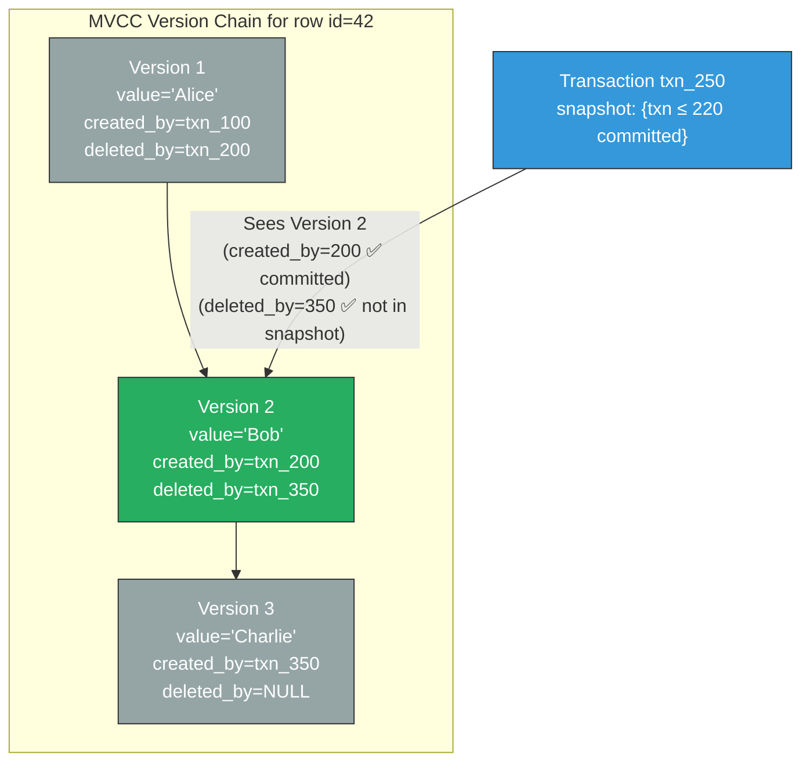
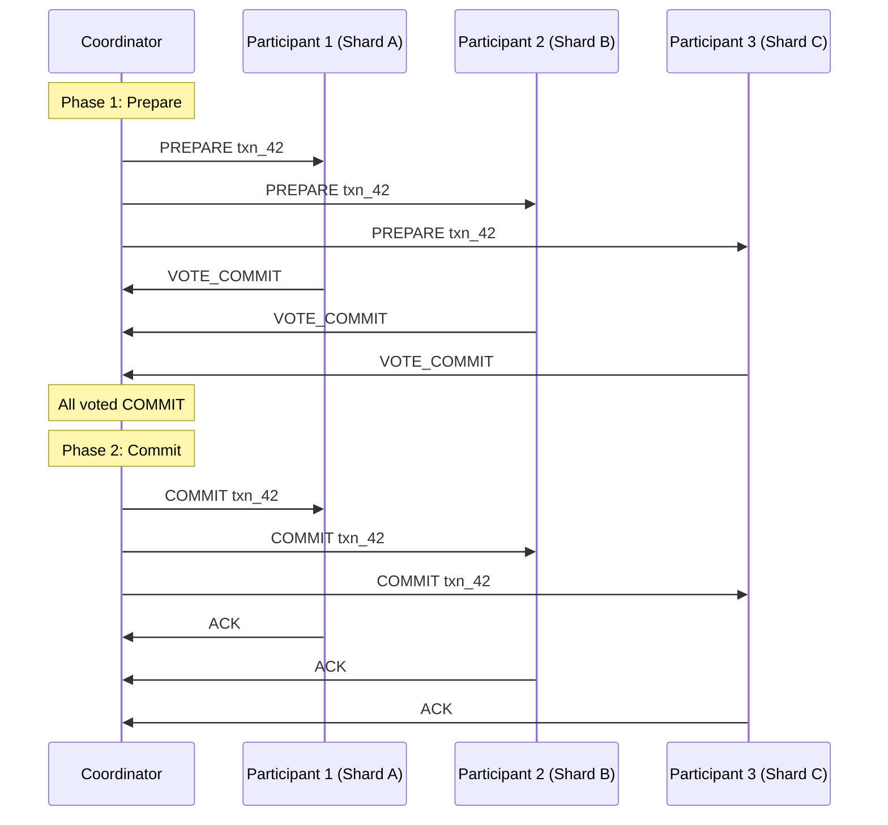

# 7. Transactions and Isolation Levels 🔴

> **What you'll learn:**
> - The reality of ACID guarantees in distributed systems — what "Atomicity," "Consistency," "Isolation," and "Durability" actually mean (and don't mean) at scale.
> - Isolation level anomalies: dirty reads, non-repeatable reads, phantom reads, and write skew — with concrete examples of data corruption for each.
> - How **Multi-Version Concurrency Control (MVCC)** works internally: version chains, snapshot reads, visibility rules, and garbage collection.
> - Distributed transactions: **Two-Phase Commit (2PC)** for atomic cross-shard writes and the **Saga pattern** for long-lived workflows. When to use each.
> - **Serializable Snapshot Isolation (SSI)**: achieving serializable transactions without the performance cost of true serial execution.

**Cross-references:** Builds on storage engine internals from [Chapter 5](ch05-storage-engines.md) (WAL, B-Trees, LSM-Trees support MVCC), consensus from [Chapter 3](ch03-raft-and-paxos-internals.md) (2PC coordinator uses consensus), and locking from [Chapter 4](ch04-distributed-locking-and-fencing.md). Critical for the capstone in [Chapter 9](ch09-capstone-global-kv-store.md).

---

## ACID Under the Microscope

| Property | What it actually means | Common misconception |
|---|---|---|
| **Atomicity** | All writes in a transaction either all commit or all abort. No partial results. | Not about concurrency — about crash recovery. |
| **Consistency** | The database transitions between valid states (application invariants hold). | This is the **application's** job, not the database's. The database enforces constraints you define. |
| **Isolation** | Concurrent transactions don't see each other's intermediate writes. | Doesn't mean serial execution. Most databases use *weaker* isolation than serializable. |
| **Durability** | Committed data survives crashes (WAL + fsync). | On a single node, yes. Across replicas, durability depends on replication mode (Ch. 6). |

**The dirty secret:** Most databases default to **Read Committed** or **Snapshot Isolation**, NOT serializable. Developers assume serializable behavior and write code with race conditions that silently corrupt data.

---

## Isolation Level Anomalies

### Dirty Read

Transaction T2 reads data that T1 has written but **not yet committed**. If T1 aborts, T2 has acted on data that never existed.

```
T1: BEGIN
T1: UPDATE accounts SET balance = 0 WHERE id = 'alice'   ← Not yet committed
T2: SELECT balance FROM accounts WHERE id = 'alice'       ← Reads balance=0 💥
T1: ROLLBACK                                               ← Alice's balance was never 0!
T2: Makes a decision based on balance=0                    ← 💥 Incorrect
```

### Non-Repeatable Read (Read Skew)

Transaction T2 reads the same row twice and gets different values because T1 committed between the reads.

```
T2: SELECT balance FROM accounts WHERE id = 'alice'       ← Reads $1000
T1: UPDATE accounts SET balance = 500 WHERE id = 'alice'
T1: COMMIT
T2: SELECT balance FROM accounts WHERE id = 'alice'       ← Reads $500 💥
T2: The world changed mid-transaction
```

### Phantom Read

Transaction T2 runs the same range query twice and gets different *sets of rows* because T1 inserted or deleted rows.

```
T2: SELECT COUNT(*) FROM orders WHERE status = 'pending'  ← Returns 5
T1: INSERT INTO orders (status) VALUES ('pending')
T1: COMMIT
T2: SELECT COUNT(*) FROM orders WHERE status = 'pending'  ← Returns 6 💥
```

### Write Skew

Two transactions read the same data, make decisions based on that data, and write non-conflicting rows—but the combination violates an invariant.

```
Invariant: At least 1 doctor must be on call at all times.
Currently on call: Alice, Bob.

T1: SELECT COUNT(*) FROM on_call WHERE shift = 'night'    ← Returns 2
T1: Decides it's safe for Alice to go off-call.

T2: SELECT COUNT(*) FROM on_call WHERE shift = 'night'    ← Returns 2
T2: Decides it's safe for Bob to go off-call.

T1: DELETE FROM on_call WHERE doctor = 'alice' AND shift = 'night'
T2: DELETE FROM on_call WHERE doctor = 'bob' AND shift = 'night'
T1: COMMIT
T2: COMMIT

Result: 0 doctors on call 💥 (invariant violated)
```

### Isolation Levels vs. Anomalies

| Isolation Level | Dirty Read | Non-repeatable Read | Phantom Read | Write Skew |
|---|---|---|---|---|
| **Read Uncommitted** | ⚠️ Possible | ⚠️ Possible | ⚠️ Possible | ⚠️ Possible |
| **Read Committed** | ✅ Prevented | ⚠️ Possible | ⚠️ Possible | ⚠️ Possible |
| **Snapshot Isolation (SI)** | ✅ Prevented | ✅ Prevented | ✅ Prevented | ⚠️ **Possible** |
| **Serializable** | ✅ Prevented | ✅ Prevented | ✅ Prevented | ✅ Prevented |

**Critical warning:** Snapshot Isolation (used by PostgreSQL's "REPEATABLE READ", MySQL's "REPEATABLE READ," Oracle's default) does **not** prevent write skew. It looks safe but isn't.

---

## Multi-Version Concurrency Control (MVCC)

MVCC is the engine behind Snapshot Isolation. Instead of locking rows, the database keeps **multiple versions** of each row. Readers see a consistent snapshot without blocking writers.

### How MVCC Works

```
Every row version has:
  - created_by_txn:  the transaction ID that created this version
  - deleted_by_txn:  the transaction ID that deleted (or updated) this version (NULL if live)

Every transaction has:
  - txn_id:  a unique, monotonically increasing ID
  - snapshot: the set of transaction IDs that were committed when this transaction started
```

**Visibility rule:** A row version is visible to transaction T if:
1. `created_by_txn` is in T's snapshot (the creating transaction committed before T started), AND
2. `deleted_by_txn` is NOT in T's snapshot (the deleting transaction hadn't committed when T started), OR `deleted_by_txn` is NULL.



### MVCC in Rust (Conceptual)

```rust
/// A simplified MVCC store demonstrating snapshot isolation.
/// Each key has a chain of versions, each tagged with the transaction
/// that created and (optionally) deleted it.
struct MvccStore {
    versions: HashMap<String, Vec<RowVersion>>,
    next_txn_id: u64,
    committed: HashSet<u64>,
}

struct RowVersion {
    value: Vec<u8>,
    created_by: u64,
    deleted_by: Option<u64>,
}

struct Transaction {
    txn_id: u64,
    /// Snapshot: set of txn IDs that were committed when this transaction began.
    snapshot: HashSet<u64>,
}

impl MvccStore {
    /// Read a key under snapshot isolation.
    /// Returns the newest version that is visible to this transaction.
    fn read(&self, txn: &Transaction, key: &str) -> Option<Vec<u8>> {
        let versions = self.versions.get(key)?;
        // Walk the version chain from newest to oldest.
        versions.iter().rev().find(|v| {
            // ✅ Created by a committed transaction in our snapshot
            txn.snapshot.contains(&v.created_by)
            // ✅ Not yet deleted, OR deleted by a transaction NOT in our snapshot
            && v.deleted_by.map_or(true, |d| !txn.snapshot.contains(&d))
        }).map(|v| v.value.clone())
    }

    /// Write a key. Creates a new version and marks the old one as deleted.
    fn write(&mut self, txn: &Transaction, key: &str, value: Vec<u8>) {
        let versions = self.versions.entry(key.to_string()).or_default();

        // Mark the current visible version as deleted by this transaction.
        if let Some(v) = versions.iter_mut().rev().find(|v| {
            txn.snapshot.contains(&v.created_by) && v.deleted_by.is_none()
        }) {
            v.deleted_by = Some(txn.txn_id);
        }

        // Create a new version.
        versions.push(RowVersion {
            value,
            created_by: txn.txn_id,
            deleted_by: None,
        });
    }
}
```

---

## Distributed Transactions: 2PC vs. Sagas

When a transaction spans multiple database shards or services, we need a protocol to ensure atomicity across them.

### Two-Phase Commit (2PC)

A **coordinator** drives the protocol:

**Phase 1: Prepare (Vote)**
```
Coordinator → All participants: "Can you commit transaction T?"
Each participant:
  - Acquires locks, writes to WAL.
  - Responds: VOTE_COMMIT or VOTE_ABORT.
```

**Phase 2: Commit (Decision)**
```
If ALL participants voted COMMIT:
  Coordinator → All participants: "COMMIT"
  Each participant commits and releases locks.
Else:
  Coordinator → All participants: "ABORT"
  Each participant rolls back and releases locks.
```



### 2PC's Fatal Flaw: The Blocking Problem

If the coordinator crashes after sending PREPARE but before sending the COMMIT/ABORT decision:
- Participants have voted COMMIT and hold locks.
- They **cannot proceed** without the coordinator's decision.
- They **cannot abort** because the coordinator might have decided to commit.
- Result: **locks are held indefinitely**, blocking all other transactions on those rows.

This is why 2PC is called a **blocking protocol**. In production, coordinator crash recovery (logging the decision to a WAL before sending it) mitigates this, but the vulnerability window remains.

### The Saga Pattern: Compensating Transactions

For long-lived workflows spanning multiple services (especially microservices), 2PC is impractical—you can't hold locks across HTTP calls for minutes. The Saga pattern replaces atomicity with **eventual consistency via compensating transactions.**

```
Saga: Book a trip (flight + hotel + car)

Step 1: Reserve flight         → on failure: no compensation needed
Step 2: Reserve hotel          → on failure: cancel flight
Step 3: Reserve car            → on failure: cancel hotel, cancel flight

If Step 3 fails:
  Execute compensations in reverse order:
    Compensate Step 2: cancel hotel
    Compensate Step 1: cancel flight
```

### 2PC vs. Saga

| Dimension | 2PC | Saga |
|---|---|---|
| **Atomicity** | True atomicity — all or nothing | Eventual consistency — intermediate states visible |
| **Latency** | High (locks held across all participants for the entire protocol) | Lower (no distributed locks; each step commits independently) |
| **Failure handling** | Coordinator crash blocks all participants | Each step has a compensating action; no blocking |
| **Isolation** | Full isolation (locks prevent concurrent access) | No isolation — concurrent transactions may see partial sagas |
| **Scope** | Within a single database system (cross-shard) | Across microservices, external APIs |
| **When to use** | Database-internal cross-shard transactions (Spanner, CockroachDB) | Cross-service business workflows (order processing, trip booking) |

---

## Serializable Snapshot Isolation (SSI)

SSI (Cahill, Röhm, Fekete, 2008; used by PostgreSQL SERIALIZABLE, CockroachDB) provides true serializability without the performance cost of strict two-phase locking.

### How SSI Works

1. Transactions run under normal Snapshot Isolation (MVCC snapshots, no read locks).
2. The database tracks **read-write dependencies** between concurrent transactions.
3. At commit time, the database checks for dangerous patterns (specifically, a cycle in the serialization graph that would indicate a non-serializable schedule).
4. If a dangerous pattern is detected, the database **aborts one of the transactions** (serialization failure). The application retries.

**Key insight:** SSI is *optimistic concurrency control*. It lets transactions run freely and checks at commit time. In workloads with low contention, very few transactions are aborted. In high-contention workloads, the abort rate increases—but correctness is always guaranteed.

### The Naive Monolith Way

```rust
/// 💥 SPLIT-BRAIN HAZARD: Using Snapshot Isolation and assuming it prevents
/// write skew. This code checks a constraint (at least 1 doctor on call)
/// under SI, but two concurrent transactions can both pass the check
/// and both commit, violating the invariant.
async fn go_off_call(db: &Database, doctor: &str) -> Result<(), Error> {
    let txn = db.begin_snapshot_isolation().await?;
    let count = txn.query("SELECT COUNT(*) FROM on_call WHERE shift = 'night'").await?;
    if count > 1 {
        // 💥 Another transaction is checking the same condition right now!
        // Under SI, both see count=2, both proceed, both delete. Result: 0.
        txn.execute("DELETE FROM on_call WHERE doctor = $1 AND shift = 'night'", &[doctor]).await?;
    }
    txn.commit().await?;  // 💥 SI allows this commit. Write skew occurs.
    Ok(())
}
```

### The Distributed Fault-Tolerant Way

```rust
/// ✅ FIX: Use Serializable isolation (SSI). The database detects the
/// read-write dependency cycle and aborts one of the conflicting transactions.
/// The application MUST handle serialization failures with retry logic.
async fn go_off_call(db: &Database, doctor: &str) -> Result<(), Error> {
    loop {
        let txn = db.begin_serializable().await?;  // ✅ SSI, not just SI
        let count = txn.query(
            "SELECT COUNT(*) FROM on_call WHERE shift = 'night'"
        ).await?;

        if count > 1 {
            txn.execute(
                "DELETE FROM on_call WHERE doctor = $1 AND shift = 'night'",
                &[doctor],
            ).await?;
        }

        match txn.commit().await {
            Ok(_) => return Ok(()),
            Err(e) if e.is_serialization_failure() => {
                // ✅ SSI detected a dangerous read-write dependency.
                // Retry the entire transaction with a fresh snapshot.
                continue;
            }
            Err(e) => return Err(e),
        }
    }
}
```

---

<details>
<summary><strong>🏋️ Exercise: The Double-Spending Problem</strong> (click to expand)</summary>

### Scenario

You are building a payment service. Users have wallets with balances. The `transfer` operation reads the sender's balance, checks it's sufficient, and writes two rows (debit sender, credit receiver).

The database uses Snapshot Isolation. Two concurrent transfers are initiated:

```
T1: Transfer $80 from Alice (balance=$100) to Bob
T2: Transfer $70 from Alice (balance=$100) to Charlie
```

1. Under Snapshot Isolation, can both transactions commit? Show the step-by-step execution.
2. What is Alice's final balance if both commit? Is money created from nothing?
3. How would you fix this under (a) pessimistic locking, (b) Serializable Snapshot Isolation (SSI), and (c) application-level design?

<details>
<summary>🔑 Solution</summary>

**1. Under Snapshot Isolation, both can commit:**

```
T1: BEGIN (snapshot at time S1)
T2: BEGIN (snapshot at time S2, same as S1 since no commits yet)

T1: SELECT balance FROM wallets WHERE user='alice' → $100 (from snapshot)
T2: SELECT balance FROM wallets WHERE user='alice' → $100 (from snapshot)

T1: balance ($100) >= $80 ✓ → proceeds
T2: balance ($100) >= $70 ✓ → proceeds

T1: UPDATE wallets SET balance=20 WHERE user='alice'
    INSERT INTO transactions (from, to, amount) VALUES ('alice', 'bob', 80)
T1: COMMIT ✅ (no write-write conflict with T2 yet because T2 hasn't written)

T2: UPDATE wallets SET balance=30 WHERE user='alice'  ← writes to same row
```

**At this point, T2's write conflicts with T1's committed write.** Under strict SI with first-committer-wins, T2 would abort. But under weaker SI implementations (or if the implementation checks write-write conflict per-column), T2 might overwrite T1's balance.

In practice, most SI implementations detect this **write-write conflict** and abort T2. But this is implementation-dependent and not guaranteed by the SI specification.

**However**, if the design uses separate rows per ledger entry (append-only ledger), there's no write-write conflict and SI allows both:

```
T1: INSERT INTO ledger (user, delta) VALUES ('alice', -80)
T2: INSERT INTO ledger (user, delta) VALUES ('alice', -70)
Both commit. Alice's effective balance: 100 - 80 - 70 = -$50 💥
```

**2. Alice's final balance if both commit:** -$50. Money is created from nothing (Alice had $100 but $150 was withdrawn). This is **write skew** — both transactions read the same balance, made independent decisions, and wrote non-conflicting rows.

**3. Fixes:**

**(a) Pessimistic locking (`SELECT ... FOR UPDATE`):**
```sql
-- T1 acquires a row-level lock on Alice's wallet
SELECT balance FROM wallets WHERE user='alice' FOR UPDATE;
-- T2 blocks here until T1 commits or aborts
```
This serializes both transactions. T2 sees Alice's updated balance ($20) and correctly rejects the $70 transfer.

**(b) Serializable Snapshot Isolation (SSI):**
Use `BEGIN TRANSACTION ISOLATION LEVEL SERIALIZABLE`. The database detects the read-write dependency cycle (both transactions read Alice's balance, then write to it) and aborts one. The aborted transaction retries with a fresh snapshot and sees the updated balance.

**(c) Application-level design (idempotent, compare-and-swap):**
```sql
UPDATE wallets SET balance = balance - 80
WHERE user = 'alice' AND balance >= 80;
-- Returns row_count: 1 if successful, 0 if insufficient funds.
```
This is an atomic conditional update. The database's own row-level locking ensures only one concurrent update succeeds. The application checks `rows_affected` and retries or rejects accordingly. No need for manual `SELECT ... FOR UPDATE`.

</details>
</details>

---

> **Key Takeaways**
>
> 1. **Most databases do NOT default to serializable isolation.** Read Committed or Snapshot Isolation is the default. You must explicitly request serializable if your application has write-skew hazards.
> 2. **MVCC provides efficient snapshot reads** without blocking writers. But it doesn't prevent write skew by itself.
> 3. **2PC provides atomic cross-shard commits** but is blocking if the coordinator fails. Use it within a single database system, not across microservices.
> 4. **The Saga pattern** replaces atomicity with compensating transactions for cross-service workflows. It trades isolation for availability and simplicity.
> 5. **SSI gives you serializable isolation with MVCC performance.** It's optimistic — transactions run freely and abort only when a dangerous pattern is detected.
> 6. **Always handle serialization failures with retry logic.** SSI aborts are not errors — they are the system working correctly.

---

> **See also:**
> - [Chapter 5: Storage Engines](ch05-storage-engines.md) — WAL and storage structures that implement MVCC.
> - [Chapter 4: Distributed Locking and Fencing](ch04-distributed-locking-and-fencing.md) — fencing tokens as an alternative to distributed locks for correctness.
> - [Chapter 6: Replication and Partitioning](ch06-replication-and-partitioning.md) — replication determines which isolation levels are achievable across replicas.
