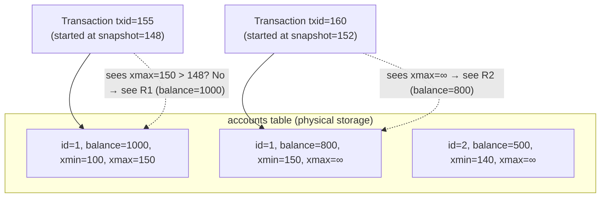
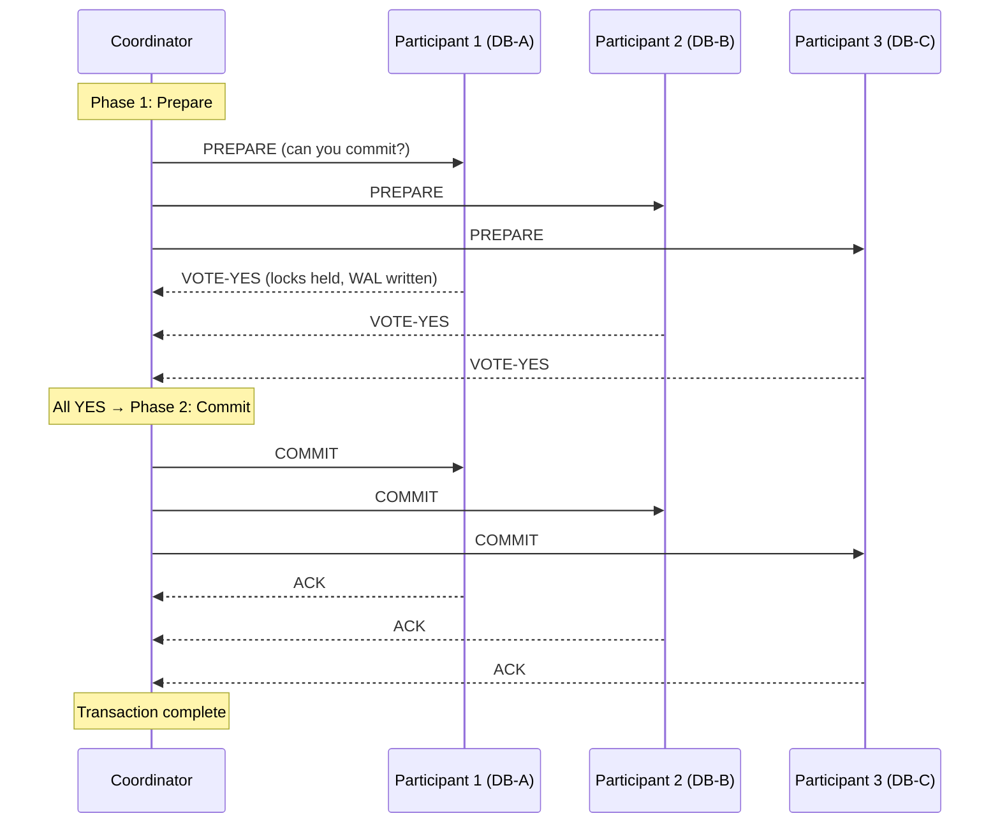

# 7. Transactions and Isolation Levels 🔴

> **What you'll learn:**
> - The precise meaning of ACID and why "C" in ACID is not the same as "C" in CAP
> - The anomalies that each isolation level permits: dirty reads, non-repeatable reads, phantom reads, and write skew
> - How Multi-Version Concurrency Control (MVCC) enables non-blocking reads and snapshot isolation without holding locks
> - When to use the Saga pattern vs. Two-Phase Commit (2PC) for distributed transactions — and why 2PC is a blocking protocol

---

## ACID: The Reality Behind the Acronym

ACID is the most misused term in databases. Let's be precise:

| Letter | Property | What It Actually Means | Common Misunderstanding |
|--------|----------|----------------------|------------------------|
| **A** | Atomicity | A transaction either fully commits or fully aborts — no partial writes are visible | "Atomic operations" (that's a different concept) |
| **C** | Consistency | After a commit, database constraints are satisfied (foreign keys, unique constraints, check constraints hold) | "Consistent" reads — C in ACID is about *your application's data invariants*, enforced by the DB |
| **I** | Isolation | Concurrent transactions behave as if executed serially | "Isolated" from hardware failures — that's Durability |
| **D** | Durability | Committed data survives crashes (WAL + fsync) | "Data is replicated" — durability is about persistence, not replication |

**The "C" mismatch:** CAP's "C" is **linearizability** — a property of *distributed systems*. ACID's "C" is *application-level consistency* — whether foreign keys are intact, balances don't go negative, unique constraints hold. These are entirely different concepts. A system can be CAP-consistent but ACID-inconsistent (e.g., a linearizable key-value store with no constraint enforcement), or ACID-consistent but CAP-available (a single-node RDBMS that doesn't participate in a distributed protocol).

## Isolation Anomalies: What Can Go Wrong

The SQL standard defines isolation levels in terms of which anomalies are permitted. Understanding the anomalies is essential:

### Dirty Read

Reading uncommitted data from another transaction:

```
T1: BEGIN
T1: UPDATE accounts SET balance = 0 WHERE id=1    (not yet committed)

T2: BEGIN
T2: SELECT balance FROM accounts WHERE id=1       ← reads 0 (T1's uncommitted write)
T2: COMMIT

T1: ROLLBACK    ← T1 rolls back! Balance is NOT 0.
T2 made a decision based on data that never existed.
```

### Non-Repeatable Read

A row's value changes between two reads in the same transaction:

```
T1: BEGIN
T1: SELECT balance FROM accounts WHERE id=1   ← returns 1000

T2: BEGIN
T2: UPDATE accounts SET balance = 500 WHERE id=1
T2: COMMIT

T1: SELECT balance FROM accounts WHERE id=1   ← returns 500 (!!)
T1: COMMIT
T1 saw different values for the same row within one transaction.
```

### Phantom Read

A query returns different rows between two executions in the same transaction:

```
T1: BEGIN
T1: SELECT * FROM accounts WHERE balance > 1000   ← returns 5 rows

T2: BEGIN
T2: INSERT INTO accounts (id, balance) VALUES (99, 5000)
T2: COMMIT

T1: SELECT * FROM accounts WHERE balance > 1000   ← returns 6 rows (!!)
T1: COMMIT
New rows appeared (phantoms) between T1's two range queries.
```

### Write Skew

Two transactions read an overlapping dataset and make decisions based on what they read, leading to a constraint violation after both commit:

```
Invariant: "At least one doctor must be on-call at all times"
Currently: Doctor A and Doctor B are both on-call.

T1 (Doctor A): SELECT count(*) FROM on_call WHERE day='today'   ← returns 2
              "2 doctors on call, safe to leave"
              UPDATE on_call SET status='off' WHERE doctor='A'

T2 (Doctor B): SELECT count(*) FROM on_call WHERE day='today'   ← returns 2
              "2 doctors on call, safe to leave"
              UPDATE on_call SET status='off' WHERE doctor='B'

Both commit → 0 doctors on call! Invariant violated!
```

Write skew is the hardest anomaly to protect against. It requires **Serializable** isolation (no isolation level below Serializable prevents it).

## The SQL Isolation Level Matrix

| Isolation Level | Dirty Read | Non-Repeatable Read | Phantom Read | Write Skew |
|-----------------|-----------|--------------------|-----------|-----------| 
| **Read Uncommitted** | ✅ Possible | ✅ Possible | ✅ Possible | ✅ Possible |
| **Read Committed** | ❌ Prevented | ✅ Possible | ✅ Possible | ✅ Possible |
| **Repeatable Read** | ❌ Prevented | ❌ Prevented | ✅ Possible (SQL) / ❌ (MVCC) | ✅ Possible |
| **Snapshot Isolation (SI)** | ❌ Prevented | ❌ Prevented | ❌ Prevented | ✅ Possible |
| **Serializable (SSI)** | ❌ Prevented | ❌ Prevented | ❌ Prevented | ❌ Prevented |

**Important:** PostgreSQL's "Repeatable Read" is actually Snapshot Isolation — stronger than the SQL standard's definition. MySQL InnoDB's "Repeatable Read" uses gap locks to prevent phantoms but does not prevent write skew in all cases.

## MVCC: Multi-Version Concurrency Control

MVCC is the implementation technique that makes Snapshot Isolation and Serializable Snapshot Isolation (SSI) possible without reader-writer blocking.

**Core idea:** Instead of overwriting a row in place, the database keeps **multiple versions** of each row, tagged with the transaction ID that created them:



**MVCC Visibility Rules (PostgreSQL model):**

A transaction `T` with snapshot taken at `txid=S` sees a row version if:
- `xmin <= S` (the row was created before T's snapshot), **AND**
- `xmax = ∞` OR `xmax > S` (the row hasn't been deleted/updated before T's snapshot)

**Key properties:**
- **Reads never block writes:** Readers see their snapshot's version, writers create new versions
- **Writes never block reads:** New versions are written alongside old ones
- **Single-transaction view:** T never sees uncommitted changes from concurrent transactions

### MVCC and Write Conflicts

MVCC doesn't prevent write-write conflicts on its own. When two transactions update the same row, the database uses **First Committer Wins**:

```
T1 reads row X (sees version xmin=100, balance=1000)
T2 reads row X (sees version xmin=100, balance=1000)
T1 updates X → creates new version (xmin=155, balance=800, xmax=∞) → COMMIT ✅
T2 updates X → tries to update row X
   PostgreSQL: detects T2's read row has been superseded by T1's commit → ABORT T2 ❌
```

This is correct — T2 must restart and re-read the new value.

### Serializable Snapshot Isolation (SSI)

SSI (PostgreSQL ≥9.1) extends SI to prevent write skew by tracking **read-write dependencies** between concurrent transactions:

```
If T2 reads data that T1 wrote (or will write),
AND T1 reads data that T2 wrote (or will write),
→ This is a dangerous read-write anti-dependency cycle → one of them must abort.

The doctor on-call example:
T1 reads on_call (count=2), T2 reads on_call (count=2) → both read same data
T1 updates on_call (sets A off), T2 updates on_call (sets B off) → both write to on_call
→ Anti-dependency cycle detected → T2 is aborted → must retry with the new count
```

SSI achieves **full Serializability** with very low lock contention — only read-write anti-dependencies are tracked, reads don't block writes.

## Distributed Transactions: 2PC vs. Sagas

When a transaction spans multiple databases or services, neither single-node MVCC nor a lock manager helps. Two families of solutions exist:

### Two-Phase Commit (2PC)

2PC coordinates an atomic commit across multiple participants using a coordinator:



**The Blocking Problem:**

After a participant votes YES in Phase 1, it **holds locks** on all modified rows and **cannot unilaterally abort** — it must wait for the coordinator's Phase 2 decision. If the coordinator fails between Phase 1 and Phase 2, the participants are **blocked indefinitely**, holding locks on crucial rows.

```
// 💥 SPLIT-BRAIN HAZARD: 2PC coordinator failure during Phase 2
Coordinator crashes after sending COMMIT to P1 but before sending to P2 and P3.
P1: committed, released locks.
P2, P3: holding locks forever, waiting for coordinator to recover.
P2, P3 cannot serve reads or writes to those rows until coordinator recovers.
Recovery: coordinator reads its WAL on restart, resends COMMIT to P2 and P3.
If coordinator's WAL is lost: P2 and P3 are permanently stuck (only manual intervention).

// ✅ FIX: Use a consensus-based coordinator (e.g., etcd or Spanner)
Coordinator durably writes commit decision to Raft log BEFORE sending to participants.
On coordinator crash: another coordinator reads Raft log and resumes Phase 2.
"3PC" (Three-Phase Commit) doesn't solve this without synchrony assumptions either.
```

**Where 2PC is used:**
- PostgreSQL's `PREPARE TRANSACTION` / `COMMIT PREPARED` (rarely used directly)
- XA transactions in Java EE application servers
- CockroachDB uses a variant internally (parallel commits) for cross-range transactions
- Spanner uses 2PC with Paxos-replicated coordinators for global transactions

### The Saga Pattern: Distributed Transactions Without Locking

Sagas replace a single atomic distributed transaction with a **sequence of local transactions**, each with a **compensating transaction** that undoes its effect if a subsequent step fails:

```mermaid
graph LR
    S1["Step 1: Charge Payment<br/>(local tx on PaymentDB)"] --> S2["Step 2: Reserve Inventory<br/>(local tx on InventoryDB)"]
    S2 --> S3["Step 3: Create Order<br/>(local tx on OrderDB)"]
    S3 --> S4["Step 4: Schedule Delivery<br/>(local tx on ShippingDB)"]

    S4 -->|"FAIL!"| C3["Compensate Step 3:<br/>Cancel Order"]
    C3 --> C2["Compensate Step 2:<br/>Release Inventory"]
    C2 --> C1["Compensate Step 1:<br/>Refund Payment"]

    style S4 fill:#8b0000,color:#fff
    style C1 fill:#8b4513,color:#fff
    style C2 fill:#8b4513,color:#fff
    style C3 fill:#8b4513,color:#fff
```



**Saga Orchestration vs. Choreography:**

| Model | How It Works | Pros | Cons |
|-------|-------------|------|------|
| **Orchestration** | Central saga orchestrator calls each service | Single view of saga state; easy debugging | Orchestrator is a bottleneck; coupling |
| **Choreography** | Each service emits events; others react | Decoupled; no bottleneck | Hard to trace; emergent behavior hard to reason |

**Saga Trade-offs vs. 2PC:**

| Property | 2PC | Saga |
|----------|-----|------|
| **Isolation** | Full (ACID) — no intermediate states visible | None — intermediate states visible between steps |
| **Locking** | Holds locks across all participants during prepare | No cross-service locks |
| **Failure handling** | Coordinator handles atomically | Application implements compensating transactions |
| **Blocking** | Yes — coordinator failure blocks participants | No — each step is independent |
| **Complexity** | Coordinator protocol complexity | Compensating transaction design complexity |
| **Best for** | Same database cluster, low latency, small N | Cross-service, high availability, large N |

```rust
// Conceptual Saga orchestrator in Rust

enum SagaStep {
    ChargePayment { amount: u64, order_id: Uuid },
    ReserveInventory { items: Vec<Item>, order_id: Uuid },
    CreateOrder { order: Order },
    ScheduleDelivery { order_id: Uuid },
}

enum CompensatingStep {
    RefundPayment { amount: u64, order_id: Uuid },
    ReleaseInventory { items: Vec<Item>, order_id: Uuid },
    CancelOrder { order_id: Uuid },
    // CancelDelivery not needed if ScheduleDelivery was the failing step
}

async fn execute_order_saga(order: Order) -> Result<(), SagaError> {
    let mut completed: Vec<CompensatingStep> = Vec::new();

    // Execute steps sequentially; track compensation for each successful step
    payment_service.charge(order.total).await
        .map_err(|e| compensate_and_fail(&mut completed, e))?;
    completed.push(CompensatingStep::RefundPayment { amount: order.total, order_id: order.id });

    inventory_service.reserve(order.items.clone()).await
        .map_err(|e| compensate_and_fail(&mut completed, e))?;
    completed.push(CompensatingStep::ReleaseInventory { items: order.items.clone(), order_id: order.id });

    order_db.create(order.clone()).await
        .map_err(|e| compensate_and_fail(&mut completed, e))?;
    completed.push(CompensatingStep::CancelOrder { order_id: order.id });

    shipping_service.schedule(order.id).await
        .map_err(|e| compensate_and_fail(&mut completed, e))?;

    Ok(())
}

async fn compensate_and_fail(completed: &mut Vec<CompensatingStep>, error: impl Error) -> SagaError {
    // Execute compensating transactions in reverse order
    for step in completed.iter().rev() {
        if let Err(comp_err) = execute_compensation(step).await {
            // Compensation failed — needs human intervention or retry queue
            tracing::error!("Compensation failed: {:?}", comp_err);
        }
    }
    SagaError::from(error)
}
```

**The "Lost Update" Problem in Sagas:**

Since intermediate saga states are visible, another saga can read partially-applied state:

```
Saga A (charging user): sets balance = 0
Saga B (applying bonus): reads balance = 0 → applies bonus → balance = 100
Saga A compensation (refund): sets balance = original + refund
→ B's bonus was applied to the wrong balance!
```

Solutions: Semantic locks (reserve the resource before beginning), pessimistic ordering (run sagas sequentially per user), or countermeasures (check current state before compensation).

<details>
<summary><strong>🏋️ Exercise: Isolation Level Incident Analysis</strong> (click to expand)</summary>

**Scenario:** You operate an e-commerce platform. The following bug report comes in: "Customers are occasionally seeing products with negative stock levels. The inventory system is supposed to prevent this."

The inventory update code (simplified):

```sql
-- Each purchase runs this transaction (READ COMMITTED isolation):
BEGIN;
SELECT stock FROM products WHERE id = $1;        -- Step 1: read current stock
-- (application checks: if stock < quantity, return error)
UPDATE products SET stock = stock - $2 WHERE id = $1 AND stock >= $2; -- Step 2: update
SELECT changes(); -- if 0 rows updated, rollback
COMMIT;
```

Questions:
1. Identify the exact race condition causing negative stock
2. Name the isolation anomaly
3. Provide three different fixes with increasing levels of correctness guarantees
4. Explain what isolation level each fix effectively achieves

<details>
<summary>🔑 Solution</summary>

**Root Cause: Lost Update / Write Skew at Read Committed**

The race condition:

```
Time | Transaction A (buying 5 units)    | Transaction B (buying 5 units)
-----|-----------------------------------|----------------------------------
T1   | BEGIN                             |
T2   | SELECT stock → 8                 | BEGIN
T3   |   (app checks: 8 >= 5, proceed)   | SELECT stock → 8
T4   |                                   |   (app checks: 8 >= 5, proceed)
T5   | UPDATE ... SET stock = 8-5 = 3   |
T6   | COMMIT (stock=3)                  |
T7   |                                   | UPDATE ... SET stock = 8-5 = 3
T8   |                                   | COMMIT (stock=3 again!)
```

Wait — step 7: `UPDATE products SET stock = stock - 5 WHERE stock >= 5`. At T7, stock=3 (already updated by A). Condition `stock >= 5` is FALSE → 0 rows updated → Transaction B should detect this and rollback.

But there's still a race if the application's `changes()` check fails:

Actually, the root cause is step 2's condition: `AND stock >= $2`. If both transactions read stock=8 and both execute the UPDATE before either commits, at T7 stock=3 (A committed), 3 >= 5 is false — B's UPDATE correctly affects 0 rows. So the example code as written actually prevents negatives.

The real bug must be in one of these cases:
- The application doesn't check `changes()` (no rows updated) and commits anyway
- High concurrency with a longer gap between SELECT and UPDATE
- The system uses Read Uncommitted and sees T5's uncommitted write (stock=3) then T5 rolls back

Let's assume the classic version: no `AND stock >= $2` in the UPDATE:

```sql
-- BUGGY VERSION:
BEGIN;
SELECT stock FROM products WHERE id = $1;                -- reads 8
-- application checks stock >= quantity
UPDATE products SET stock = stock - $2 WHERE id = $1;   -- no guard!
COMMIT;
```

Here, both A and B read stock=8, both check 8>=5=true, both execute UPDATE:
- A: stock = 8-5 = 3
- B: stock = 3-5 = -2 ← NEGATIVE!

**Anomaly: Lost Update / TOCTOU (Time-of-check-to-time-of-use)**

**Fix 1: Predicate in UPDATE (Application-Level Guard) — Effectively Read Committed**

```sql
BEGIN;
UPDATE products SET stock = stock - $2 
WHERE id = $1 AND stock >= $2;    -- atomic check-and-update
GET DIAGNOSTICS rows_affected = ROW_COUNT;
IF rows_affected = 0 THEN ROLLBACK; RAISE EXCEPTION 'Insufficient stock'; END IF;
COMMIT;
```

The `AND stock >= $2` predicate is evaluated atomically during the UPDATE with a row-level write lock. No separate SELECT needed. This works at Read Committed because the UPDATE takes a row lock that prevents concurrent updates from both succeeding with a negative result.

**Fix 2: SELECT FOR UPDATE (Pessimistic Locking) — Effectively Serializable for this row**

```sql
BEGIN;
SELECT stock FROM products WHERE id = $1 FOR UPDATE;   -- acquires row-level write lock
-- application checks
IF stock < quantity THEN ROLLBACK; RAISE EXCEPTION; END IF;
UPDATE products SET stock = stock - $2 WHERE id = $1;
COMMIT;
```

`FOR UPDATE` locks the row at SELECT time. Transaction B blocks at its `SELECT ... FOR UPDATE` until A commits, then re-reads the new stock value (3) and correctly returns "insufficient stock" (3 < 5).

Correct, but more lock contention — B is blocked for the duration of A's transaction. Under high concurrency for hot products, this creates a write serialization bottleneck.

**Fix 3: Serializable Isolation (SSI) — Database-Level Prevention**

```sql
SET TRANSACTION ISOLATION LEVEL SERIALIZABLE;
BEGIN;
SELECT stock FROM products WHERE id = $1;    -- no FOR UPDATE needed
IF stock < quantity THEN ROLLBACK; END IF;
UPDATE products SET stock = stock - $2 WHERE id = $1;
COMMIT;
```

With SSI, the database detects the read-write anti-dependency cycle (A reads stock, B reads stock, A updates, B updates same row) and aborts one transaction. The aborted transaction must retry. No explicit locking needed; the database handles it.

SSI is lower contention than pessimistic locking but requires application-level retry logic on serialization errors (`SQLSTATE 40001`).

**Recommendation:** Fix 1 for this specific case (most efficient — completely avoids concurrent scans by making check and update atomic). Fix 3 (SSI) for complex multi-table invariants where adding predicates to every UPDATE is impractical.
</details>
</details>

---

> **Key Takeaways**
> - ACID's "C" is application-level constraint satisfaction, not CAP-C (linearizability) — the terms refer to entirely different properties
> - Isolation levels are defined by which anomalies they *permit*: Serializable prevents all anomalies (including write skew), Read Committed permits non-repeatable reads and write skew
> - **MVCC** enables concurrent reads and writes without blocking by storing multiple row versions; readers see a snapshot, writers create new versions
> - **2PC** provides full atomicity across nodes but is a blocking protocol — coordinator failure leaves participants holding locks indefinitely
> - **Sagas** achieve distributed "transactions" through compensating actions — appropriate when intermediate state visibility is acceptable and blocking is not

> **See also:**
> - [Chapter 5: Storage Engines](ch05-storage-engines.md) — How WAL and MVCC are implemented at the storage level
> - [Chapter 3: Raft and Paxos Internals](ch03-raft-and-paxos-internals.md) — How consensus-based coordinators make 2PC durable
> - [Chapter 6: Replication and Partitioning](ch06-replication-and-partitioning.md) — How replication interacts with transaction isolation
