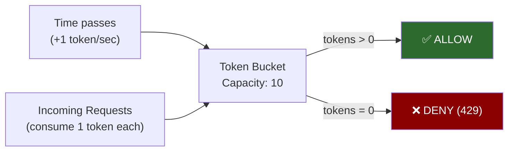
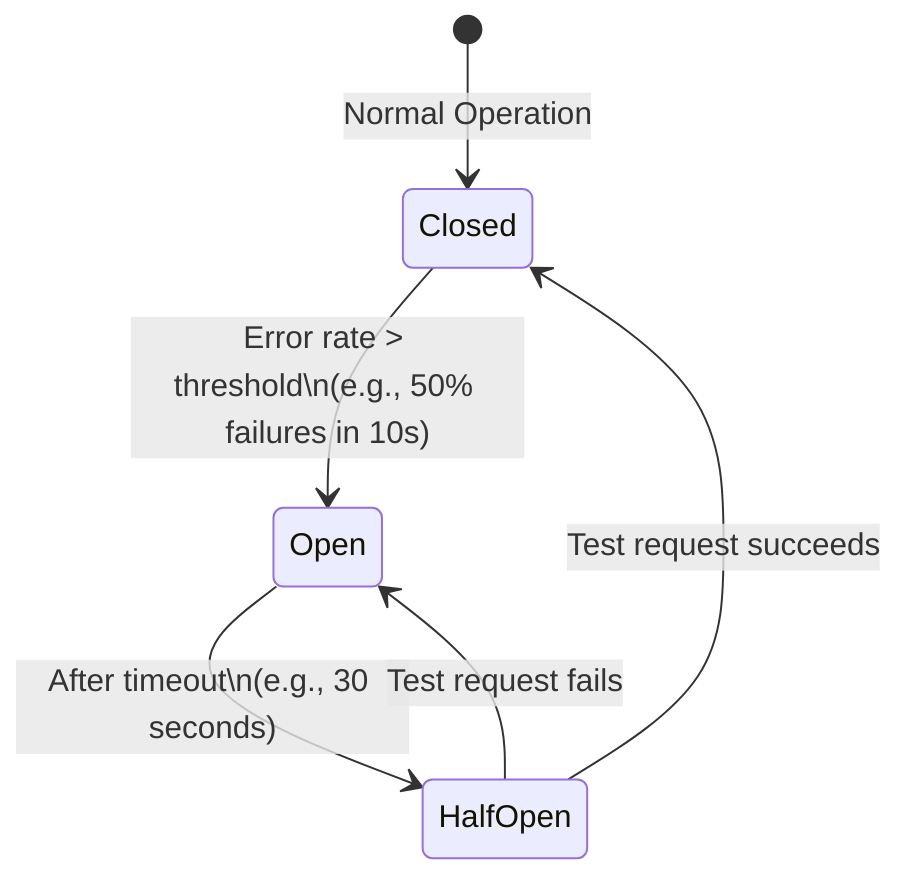

# 8. Rate Limiting, Load Balancing, and Backpressure 🟡

> **What you'll learn:**
> - The Token Bucket and Leaky Bucket algorithms and when to use each for rate limiting
> - How to implement fair, distributed rate limiting across a cluster without a single bottleneck
> - Load balancing algorithms (Round Robin, Least Connections, Power of Two Choices) and how to handle slow backends
> - The thundering herd problem and how exponential backoff with jitter prevents it

---

## The Overload Problem: Why Systems Fail Under Load

A well-designed system should degrade *gracefully* under overload — not catastrophically. The failure mode of most systems without explicit rate limiting or backpressure is:

1. Load increases beyond capacity
2. Queues fill up, latency climbs
3. Clients time out and retry — **adding more load**
4. System completely stops serving requests (zero throughput, infinite latency)
5. Operators intervene manually, load gradually recovers

This is the **thundering herd** — a cascade where the system's failure triggers more load from retries, making the failure worse. Preventing this requires deliberate design at multiple levels.

## The Naive Approach: Count Per Second

```python
# 💥 SPLIT-BRAIN HAZARD: Simple per-second counter
class NaiveLimiter:
    def __init__(self, max_rps):
        self.max_rps = max_rps
        self.requests_this_second = 0
        self.window_start = time.time()

    def is_allowed(self):
        now = time.time()
        if now - self.window_start > 1.0:
            # New second — reset counter
            self.window_start = now
            self.requests_this_second = 0
        if self.requests_this_second >= self.max_rps:
            return False   # Reject
        self.requests_this_second += 1
        return True

# Problem: At 11:59:59.9, client sends 1000 requests (all allowed up to max_rps).
# At 12:00:00.0, new second starts — client sends another 1000 requests (all allowed).
# In the 100ms window spanning the second boundary: 2000 requests processed!
# This is 2x the intended rate — FIXED WINDOW ALLOWS BURST AT BOUNDARIES.
```

## Token Bucket: Allowing Controlled Bursts

The Token Bucket algorithm is the most widely deployed rate limiting algorithm. It models a bucket filled at a steady rate with "tokens" — each request consumes one token:

```
State:
    tokens: float         (current token count)
    max_tokens: int       (bucket capacity)
    refill_rate: float    (tokens added per second)
    last_refill: float    (timestamp of last refill)

Algorithm:
    refill():
        now = current_time()
        elapsed = now - last_refill
        tokens = min(max_tokens, tokens + refill_rate * elapsed)
        last_refill = now

    is_allowed(cost=1):
        refill()
        if tokens >= cost:
            tokens -= cost
            return ALLOW
        else:
            return DENY (with retry_after = (cost - tokens) / refill_rate)
```

**Key properties:**
- **Allows bursts:** Up to `max_tokens` requests can be served instantaneously if the bucket is full
- **Sustainable rate:** The long-term average is capped at `refill_rate` tokens/second
- **Self-healing:** If a client is quiet, tokens accumulate (up to `max_tokens`), allowing a future burst



**Choosing parameters:**

```
API endpoint with:
    Sustained rate: 100 requests/minute = 1.67 req/s
    Burst allowance: up to 20 requests in a burst

Configuration:
    refill_rate = 1.67 tokens/second
    max_tokens  = 20
```

With these parameters, a client that hasn't made any requests for 10 seconds has accumulated `min(20, 1.67 × 10) = 16.7` tokens — they can burst 16 requests immediately, then return to 1.67/s.

## Leaky Bucket: Enforcing Constant Output Rate

The Leaky Bucket enforces a **strictly constant output rate** — no bursts allowed. Requests go into a queue (the "bucket"); they are processed at a fixed rate:

```
State:
    queue: Deque[Request]    (in-progress and pending requests)
    processing_rate: float   (requests processed per second)

Algorithm:
    on_request(req):
        if len(queue) >= max_queue_size:
            return DENY   # Bucket "overflows"
        queue.append(req)

    process_loop():
        while True:
            sleep(1.0 / processing_rate)   # Leak one request per interval
            if queue:
                process(queue.popleft())
```

**Leaky Bucket vs. Token Bucket:**

| Property | Token Bucket | Leaky Bucket |
|----------|-------------|-------------|
| **Burst behavior** | Allows short bursts (up to bucket capacity) | No bursts — strict constant rate |
| **Output rate** | Variable (up to max tokens) | Fixed (processing_rate) |
| **Queue** | No queue (deny if no tokens) | Queue (up to max_queue_size) |
| **Use case** | API rate limiting with burst allowance | Traffic shaping for network egress |
| **Example** | AWS API Gateway, Nginx limit_req | Network interface rate limiting, QoS |

**When to use each:**

- **Token Bucket:** You want to allow clients to "save up" for occasional bursts (typical for user-facing APIs)
- **Leaky Bucket:** You want to protect a backend service from variable-rate input by smoothing it to a constant rate of processing

## Distributed Rate Limiting: The Cluster Problem

A single-service rate limiter is easy. A distributed rate limiter across 100 pod replicas is not.

**Problem:** If each pod has its own local token bucket for a 1000 req/s limit, 100 pods collectively allow 100,000 req/s — 100x the intended limit.

### Solution 1: Centralized Redis Rate Limiter

```
For each request:
    lua_script = """
        local tokens = redis.call('GET', key) or max_tokens
        local now = redis.call('TIME')[1]  -- server-side time (avoid clock skew)
        tokens = math.min(max_tokens, tokens + refill_rate * elapsed)
        if tokens >= 1 then
            redis.call('SET', key, tokens - 1, 'EX', ttl)
            return 1   -- allow
        else
            return 0   -- deny
        end
    """
    allowed = redis_client.eval(lua_script, ...)
```

The Lua script executes atomically on Redis — no race conditions. Redis handles up to ~1M ops/s per node.

**Problem:** Redis becomes a bottleneck and single point of failure. If Redis is down, all rate limiting breaks (and you must decide: fail open or fail closed).

```
// 💥 SPLIT-BRAIN HAZARD: Blocking on Redis for every request
All 100 pods call Redis for EVERY request →
    Redis fails → no rate limiting → unprotected backend
    Redis slows to 10ms RTT → every request adds 10ms latency at p99

// ✅ FIX: Local + Global Hybrid Rate Limiting
Each pod maintains a local token bucket at (global_limit / num_pods).
Every 100ms, pods sync with Redis to reconcile actual usage.
Local bucket prevents hot-path Redis dependency.
Global sync prevents sustained abuse above the limit.
```

### Solution 2: Token Bucket with Sliding Window Log

A more accurate approach uses a **sliding window** rather than a fixed reset:

```
Store per-client: SortedSet of request timestamps (in Redis)

is_allowed(client_id, limit, window=1s):
    now = current_timestamp_ms()
    window_start = now - window_ms
    # Remove old requests outside window
    redis.zremrangebyscore(client_id, 0, window_start)
    # Count requests in window
    count = redis.zcard(client_id)
    if count < limit:
        redis.zadd(client_id, {now: now})  # Record this request
        redis.expire(client_id, window_seconds * 2)
        return ALLOW
    return DENY
```

This provides exact counting within any sliding 1-second window — no boundary burst problem. Cost: O(log N) per request due to sorted set operations, and O(requests in window) memory per client.

## Load Balancing Algorithms

Rate limiting controls *inbound* load to a service. Load balancing distributes requests across multiple backend instances.

### Round Robin

```
servers = [A, B, C, D]
current = 0
def next_server():
    s = servers[current % len(servers)]
    current += 1
    return s
```

Simple, stateless, excellent under uniform request cost. Breaks down when requests have highly variable processing times — a slow server accumulates a queue while others have no work.

### Least Connections

```
def next_server():
    return min(servers, key=lambda s: s.active_connections)
```

Routes to the server with the fewest active connections. Excellent for variable-length jobs — naturally avoids slow servers without explicit slow-server detection.

**Problem:** Requires a centralized connection counter or gossip protocol to stay accurate across load balancer replicas. Under very high throughput, contention on the counter becomes a bottleneck.

### Power of Two Choices (P2C)

A simple, highly effective algorithm that eliminates the need for centralized state:

```
def next_server():
    s1 = random.choice(servers)
    s2 = random.choice(servers)
    return s1 if s1.active_connections <= s2.active_connections else s2
```

Pick 2 random servers, choose the less loaded one. **Provably:** P2C achieves the same max load as Least Connections (O(log log N)) while requiring no centralized coordination. This is the algorithm used by Nginx's `random two least connections` and Envoy proxy.

### Slow Server Detection and Health Degradation

All algorithms above assume all servers are equal. In practice, a "slow" server (high GC pause, network issues, CPU throttling) can accumulate requests while appearing healthy to the load balancer.

**Circuit Breaker Pattern:**



```
State: CLOSED (all requests pass through)
    → Track error rate over rolling window
    → If error_rate > 50% in last 10s:
        Transition to OPEN

State: OPEN (reject all requests immediately)
    → Return error without calling backend
    → After 30 seconds: Transition to HALF-OPEN

State: HALF-OPEN (let one test request through)
    → If test request succeeds: Transition to CLOSED
    → If test request fails: Back to OPEN
```

Used by Netflix Hystrix, Resilience4j, and Tokio's `tower::Buffer` + `tower::RateLimit` stack in Rust.

## Backpressure: Signaling Overload Upstream

Rate limiting and circuit breaking protect individual services. **Backpressure** is the mechanism by which a downstream service signals overload to upstream callers, allowing them to reduce their send rate rather than flooding the downstream.

### Little's Law: The Fundamental Constraint

John Little's law (1961) states:

$$L = \lambda \times W$$

Where:
- $L$ = average number of requests in the system (queue + in-service)
- $\lambda$ = average arrival rate (requests/second)
- $W$ = average time a request spends in the system (queue time + service time)

**Implication:** If your service processes requests at rate $\mu$ (service capacity), and arrivals $\lambda > \mu$, the queue grows without bound. The only resolution: **either reduce $\lambda$ (rate limit or backpressure) or increase $\mu$ (scale out).**

### Exponential Backoff with Jitter

When a request fails due to overload (429 Too Many Requests, 503 Service Unavailable), naive retry immediately makes the problem worse — all clients retry simultaneously (the thundering herd):

```
# 💥 SPLIT-BRAIN HAZARD: Synchronized retry without jitter
On failure at time T:
    retry after 1 second
All N clients failed at T → all N clients retry at T+1 → same overload spike → same failure

# ✅ FIX: Exponential backoff with FULL JITTER
def retry_delay(attempt: int, base_delay_ms=100, max_delay_ms=30_000) -> float:
    # Exponential: 100ms, 200ms, 400ms, 800ms, ...
    exp_delay = min(base_delay_ms * (2 ** attempt), max_delay_ms)
    # Full jitter: randomize within [0, exp_delay]
    return random.uniform(0, exp_delay)

# Client 1 retries at T + 73ms
# Client 2 retries at T + 412ms
# Client 3 retries at T + 891ms
# → Retries spread over time → overloaded system recovers gradually
```

**Jitter strategies (AWS's analysis):** Full jitter (uniform random in [0, cap]) provides the best performance under sustained overload. "Decorrelated jitter" (each retry uses previous delay: `random(base, prev_delay * 3)`) provides slightly better throughput at the cost of less predictable timing.

### Load Shedding: Preserve Core Functionality

When a service is genuinely overloaded and cannot serve all requests, **load shedding** deliberately drops low-priority requests to preserve capacity for high-priority ones:

```
Priority classes (example):
    CRITICAL: health checks, auth verification, payments → never shed
    HIGH:     user-facing API reads → shed at 80% load
    MEDIUM:   background sync, analytics events → shed at 60% load
    LOW:      non-essential background jobs → shed at 40% load

Load detection:
    cpu_usage > 80% → enter degraded mode
    queue_depth > target_queue_depth → enter degraded mode
    p99_latency > 2× target → enter degraded mode

On incoming request:
    if in degraded mode and request.priority < threshold:
        return 503 Service Unavailable (with Retry-After header)
```

Netflix's **adaptive concurrency limiting** (used in Concurrency Limiter middleware) dynamically adjusts the concurrency limit based on observed gradient of RTT vs. baseline — automatically shedding load when the system shows signs of entering the "latency cliff."

<details>
<summary><strong>🏋️ Exercise: Rate Limiter Design for a Multi-Tenant API</strong> (click to expand)</summary>

**Scenario:** You run a public API platform with three customer tiers:
- **Free:** 60 requests/minute, burst up to 10 simultaneous requests
- **Pro:** 1,000 requests/minute, burst up to 100 simultaneous requests
- **Enterprise:** 100,000 requests/minute, custom burst limits

The API is served by 50 pods globally across 3 regions (US, EU, AP). You have Redis Cluster (3 nodes) available per region. A customer in the EU should only be rate-limited against their EU usage, but an enterprise customer has a global limit applied across all regions.

Design a rate limiting architecture that:
1. Supports per-tier rate limits with burst allowance
2. Works correctly across 50 pods without a per-request Redis call on the hot path
3. Implements global limits for Enterprise customers
4. Handles Redis Cluster failure gracefully
5. Provides rate limit headers (X-RateLimit-Remaining, X-RateLimit-Reset)

<details>
<summary>🔑 Solution</summary>

**Architecture: Hybrid Local + Regional + Global Rate Limiting**

```
Request Flow:
    Incoming request
        → Pod local rate limit check (in-memory, fast path)
            → If local bucket allows: proceed
            → Every 100ms or if local bucket exhausted: sync with Redis

Tier mapping:
    Free:       local_limit = 60 req/min / 50 pods = 1.2 req/min per pod
                burst: max_tokens = 10 / 50 pods = 0.2 ≈ 1 token per pod
    Pro:        local_limit = 1000/50 = 20 req/min per pod
                burst: max_tokens = 100/50 = 2 per pod
    Enterprise: local_limit = 0 (no local limit — global only)
                global_limit: sync every request to Redis (justified by their contract)
```

**Free/Pro: Local Bucket with Periodic Redis Sync**

```rust
struct HybridRateLimiter {
    local_bucket: TokenBucket,
    redis_client: RedisClient,
    last_sync: Instant,
    sync_interval: Duration,    // 100ms
    customer_id: String,
    tier: Tier,
}

async fn is_allowed(&mut self) -> (bool, RateLimitHeaders) {
    // Fast path: local bucket
    if self.local_bucket.consume(1) {
        // Async sync if interval elapsed (don't block the request)
        if self.last_sync.elapsed() > self.sync_interval {
            tokio::spawn(self.sync_with_redis());
        }
        return (true, self.build_headers());
    }

    // Local bucket exhausted: sync with Redis for accurate count
    let global_remaining = self.redis_sync_now().await?;
    if global_remaining > 0 {
        self.local_bucket.refill(global_remaining / num_pods);
        return (true, self.build_headers());
    }
    (false, self.build_headers())
}
```

**Redis Sync (Lua script for atomicity):**

```lua
-- Sliding window counter per customer
local key = KEYS[1]  -- "ratelimit:{customer_id}:{minute}"
local limit = ARGV[1]
local now_minute = ARGV[2]

redis.call('HINCRBY', key, now_minute, ARGV[3])  -- add local pod's usage
redis.call('EXPIRE', key, 120)  -- keep 2 minutes of data
local total = 0
for _, v in ipairs(redis.call('HVALS', key)) do
    total = total + v
end
return math.max(0, limit - total)
```

**Enterprise: Global Synchronous Rate Limiting**

Enterprise customers pay for guaranteed throughput and accurate limits. Per-request Redis call is acceptable:

```
For Enterprise:
    Rate limit check: redis.call('INCRBY', key, 1) → atomic increment, check against limit
    Use regional Redis for EU/AP/US
    Cross-region replication: async, with a tolerance of 1% overage for propagation lag
```

**Redis Failure Handling:**

```
Redis unavailable:
    → Switch to "fail open" for Free/Pro (allow requests using local bucket only)
    → Alert on-call: "Redis rate limiter degraded — using local buckets only"
    → Local buckets use (global_limit / num_pods * 3) as temporary local limit
      (3x normal local limit to absorb the missing global coordination)
    → For Enterprise: fail to a separate in-memory atomic counter (floor(global_limit/50))
      with a warning header: "X-RateLimit-Accuracy: degraded"
```

**Rate Limit Response Headers:**

```
X-RateLimit-Limit: 1000
X-RateLimit-Remaining: 847
X-RateLimit-Reset: 1711929660    (Unix timestamp of next window reset)
X-RateLimit-Window: 60           (window size in seconds)
Retry-After: 13                  (on 429: seconds until at least 1 token available)
```

`Retry-After` = `(1 - remaining_tokens) / refill_rate_per_second`, rounded up.

This architecture handles peak load (50 pods × 1 Redis call per 100ms = 500 Redis ops/s for Pro tier, well within Redis's 1M ops/s capacity), provides burst tolerance, and degrades gracefully on Redis failure.
</details>
</details>

---

> **Key Takeaways**
> - **Token Bucket** allows controlled bursts by accumulating tokens during quiet periods; **Leaky Bucket** enforces a strictly constant processing rate
> - Fixed-window counters allow 2× the intended rate at window boundaries; use sliding window logs or token buckets instead
> - Distributed rate limiting requires a trade-off between accuracy (centralized Redis) and performance (local + periodic sync hybrid)
> - **P2C (Power of Two Choices)** load balancing achieves near-optimal distribution without centralized state by randomly sampling 2 servers and picking the less loaded
> - **Exponential backoff with full jitter** prevents thundering herds by spreading retries randomly over an exponentially growing window; synchronized retries make overload worse

> **See also:**
> - [Chapter 2: CAP Theorem and PACELC](ch02-cap-theorem-and-pacelc.md) — The latency/consistency trade-off of centralized vs. local rate limiting
> - [Chapter 9: Capstone: Global Key-Value Store](ch09-capstone-global-key-value-store.md) — How backpressure and load shedding protect the coordination layer
> - [Chapter 4: Distributed Locking and Fencing](ch04-distributed-locking-and-fencing.md) — Redis as a coordination primitive (and its limitations)
