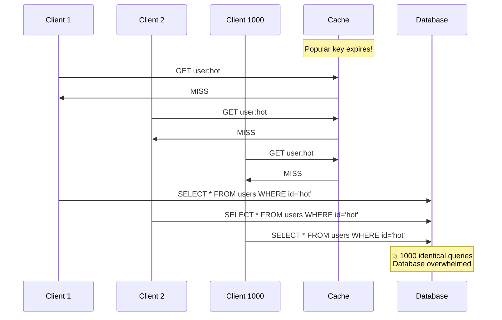
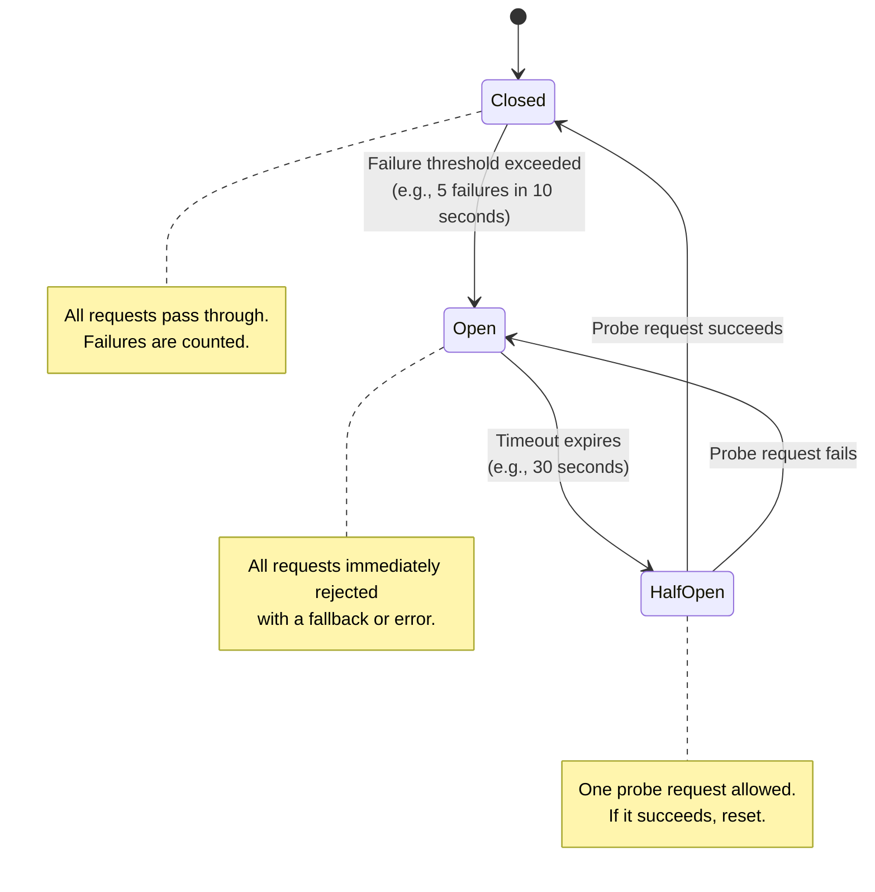

# 8. Rate Limiting, Load Balancing, and Backpressure 🟡

> **What you'll learn:**
> - How thundering herds, retry storms, and cascading failures destroy distributed systems — and the architectural patterns that prevent them.
> - Rate limiting algorithms in depth: Token Bucket vs. Leaky Bucket, sliding window counters, and distributed rate limiting across multiple nodes.
> - Load balancing strategies: round-robin, least-connections, consistent hashing, and the power of two random choices.
> - Backpressure mechanisms: circuit breakers, bulkheads, load shedding, and exponential backoff with jitter.

**Cross-references:** Complements the consistency and availability trade-offs from [Chapter 2](ch02-cap-theorem-and-pacelc.md). Rate limiting protects the storage engines from [Chapter 5](ch05-storage-engines.md) and the replication pipelines from [Chapter 6](ch06-replication-and-partitioning.md). Essential for the capstone's capacity planning in [Chapter 9](ch09-capstone-global-kv-store.md).

---

## The Thundering Herd Problem

A **thundering herd** occurs when a large number of clients simultaneously issue requests — often triggered by:

- **Cache expiration:** A popular cache key expires, and 10,000 concurrent requests hit the database simultaneously.
- **Service recovery:** A failed service comes back online, and all backed-up retries flood it at once.
- **Clock-aligned cron jobs:** Thousands of instances all fire their scheduled tasks at exactly :00 seconds.
- **Deploy recovery:** A new deployment brings up fresh instances that all cold-start their caches simultaneously.



**Fix:** Use a **singleflight** pattern (only the first request queries the DB; others wait for its result) and **jittered cache TTLs** (add random seconds to TTLs so keys don't expire simultaneously).

---

## Rate Limiting Algorithms

### Token Bucket

The most widely used algorithm. A bucket holds tokens. Each request consumes one token. Tokens are added at a fixed rate. If the bucket is empty, the request is rejected (or queued).

```
Parameters:
  - bucket_capacity: Maximum burst size (e.g., 100 tokens)
  - refill_rate: Tokens added per second (e.g., 10/sec)

On request:
  1. Calculate tokens to add since last check: elapsed * refill_rate
  2. tokens = min(tokens + added, bucket_capacity)
  3. If tokens >= 1: tokens -= 1; ALLOW
  4. Else: REJECT (429 Too Many Requests)
```

**Properties:**
- Allows bursts up to `bucket_capacity`.
- Long-term average rate is capped at `refill_rate`.
- Simple, fast, constant memory.

```rust
use std::time::Instant;

/// Token bucket rate limiter.
/// Allows bursts up to `capacity`, with a sustained rate of `refill_rate` tokens/sec.
struct TokenBucket {
    capacity: f64,
    tokens: f64,
    refill_rate: f64, // tokens per second
    last_refill: Instant,
}

impl TokenBucket {
    fn new(capacity: f64, refill_rate: f64) -> Self {
        Self {
            capacity,
            tokens: capacity, // Start full
            refill_rate,
            last_refill: Instant::now(),
        }
    }

    /// Try to consume one token. Returns true if allowed, false if rate-limited.
    fn try_acquire(&mut self) -> bool {
        let now = Instant::now();
        let elapsed = now.duration_since(self.last_refill).as_secs_f64();
        self.tokens = (self.tokens + elapsed * self.refill_rate).min(self.capacity);
        self.last_refill = now;

        if self.tokens >= 1.0 {
            self.tokens -= 1.0;
            true
        } else {
            false // ✅ Rate limited. Return 429 to client.
        }
    }
}
```

### Leaky Bucket

Requests enter a queue (the bucket) and are processed at a fixed rate. If the queue is full, new requests are dropped. Unlike Token Bucket, Leaky Bucket enforces a **perfectly smooth** outflow rate—no bursts.

| Dimension | Token Bucket | Leaky Bucket |
|---|---|---|
| **Burst handling** | Allows bursts up to capacity | No bursts — strict constant rate |
| **Throughput** | Variable (up to bucket_capacity instantaneously) | Constant (always refill_rate) |
| **Use case** | API rate limiting (allow reasonable bursts) | Traffic shaping, network QoS |
| **Implementation** | Counter + timestamp | Queue + drain timer |

### Sliding Window Counter

Combines the accuracy of a sliding window with the efficiency of fixed windows:

```
Current window count: 8 requests
Previous window count: 12 requests
Window overlap ratio: 30% (we are 70% through the current window)

Effective count: 8 + 12 * 0.30 = 11.6

If limit is 15: ALLOW (11.6 < 15)
```

This provides a smoother rate limit without storing per-request timestamps.

---

## Distributed Rate Limiting

On a single node, a rate limiter is an in-memory counter. Across N nodes behind a load balancer, you need coordination:

### Approach 1: Local Rate Limit / N

Each node enforces `global_limit / N` locally. Simple but inaccurate when load is unevenly distributed.

### Approach 2: Centralized Counter (Redis)

All nodes check and increment a shared counter in Redis. Accurate but adds a network round-trip to every request.

```rust
/// ✅ FIX: Distributed rate limiting using Redis as a shared counter.
/// Uses a Lua script for atomic check-and-increment.
async fn is_rate_limited(
    redis: &RedisClient,
    key: &str,
    limit: u64,
    window_seconds: u64,
) -> Result<bool, RedisError> {
    // Atomic check-and-increment using a Lua script.
    // This avoids TOCTOU race conditions between GET and INCR.
    let script = r#"
        local current = redis.call('INCR', KEYS[1])
        if current == 1 then
            redis.call('EXPIRE', KEYS[1], ARGV[1])
        end
        return current
    "#;

    let count: u64 = redis.eval(script, &[key], &[&window_seconds.to_string()]).await?;
    Ok(count > limit)
}
```

### Approach 3: Gossip-Based Approximate Rate Limiting

Each node maintains a local counter and periodically gossips its count to other nodes. Each node estimates the global rate as the sum of all known counters. Approximate but no centralized bottleneck.

---

## Load Balancing Strategies

| Strategy | How it works | Best for | Weakness |
|---|---|---|---|
| **Round-robin** | Rotate through servers sequentially | Homogeneous servers, stateless requests | Ignores server load; slow servers get same traffic |
| **Weighted round-robin** | Assign weights proportional to server capacity | Heterogeneous hardware | Static weights; doesn't adapt to runtime load |
| **Least connections** | Route to the server with fewest active connections | Long-lived connections (WebSockets, gRPC streams) | Requires connection tracking; slow to react |
| **Consistent hashing** | Hash the request key to a position on the ring (Ch. 6) | Stateful routing (cache affinity, session stickiness) | Hot keys can overwhelm a single node |
| **Power of two random choices** | Pick 2 random servers, route to the one with fewer connections | Large clusters, low-overhead balancing | Slightly less optimal than least-connections |

### The Power of Two Random Choices

This deceptively simple algorithm (Mitzenmacher, 2001) achieves near-optimal load distribution:

```
1. Pick 2 servers at random.
2. Route the request to whichever has fewer pending requests.
```

Why this works: choosing the *best of 2 random choices* reduces the maximum load from O(log N / log log N) to O(log log N) — an exponential improvement over purely random selection. Used in Envoy proxy, Nginx, and HAProxy.

---

## Backpressure: Protecting Upstream from Downstream

### Circuit Breaker

When a downstream service starts failing, stop sending it requests temporarily:



### Exponential Backoff with Jitter

When retrying failed requests, use exponential backoff to avoid overwhelming the recovering service. Add **jitter** to prevent synchronized retry storms:

```rust
use rand::Rng;
use std::time::Duration;

/// Calculate retry delay with exponential backoff and full jitter.
/// Without jitter, all clients retry at the same time = thundering herd.
/// Full jitter spreads retries uniformly across the backoff window.
fn retry_delay(attempt: u32, base_ms: u64, max_ms: u64) -> Duration {
    let exp_backoff = base_ms.saturating_mul(2u64.saturating_pow(attempt));
    let capped = exp_backoff.min(max_ms);
    // ✅ Full jitter: uniform random between 0 and capped.
    // This distributes retries evenly, preventing retry storms.
    let jittered = rand::thread_rng().gen_range(0..=capped);
    Duration::from_millis(jittered)
}

// Usage:
// Attempt 0: random(0, 100ms)
// Attempt 1: random(0, 200ms)
// Attempt 2: random(0, 400ms)
// Attempt 3: random(0, 800ms)
// ...capped at max_ms
```

### The Naive Monolith Way

```rust
/// 💥 SPLIT-BRAIN HAZARD: Retry without backoff or jitter.
/// If the downstream service is overloaded, immediate retries make it worse.
/// 1000 clients all retrying simultaneously = the service never recovers.
async fn call_with_retry(client: &HttpClient, url: &str) -> Result<Response, Error> {
    for _ in 0..5 {
        match client.get(url).await {
            Ok(resp) => return Ok(resp),
            Err(_) => {
                // 💥 No delay. No backoff. No jitter.
                // All clients retry simultaneously = thundering herd.
                continue;
            }
        }
    }
    Err(Error::MaxRetriesExceeded)
}
```

### The Distributed Fault-Tolerant Way

```rust
/// ✅ FIX: Retry with exponential backoff, jitter, and circuit breaker.
async fn call_with_resilience(
    client: &HttpClient,
    url: &str,
    circuit_breaker: &CircuitBreaker,
) -> Result<Response, Error> {
    for attempt in 0..5u32 {
        // ✅ Check circuit breaker before making the call.
        if !circuit_breaker.allow_request() {
            return Err(Error::CircuitOpen);
        }

        match client.get(url).await {
            Ok(resp) if resp.status().is_success() => {
                circuit_breaker.record_success();
                return Ok(resp);
            }
            Ok(resp) if resp.status() == 429 => {
                // ✅ Server explicitly told us to back off.
                let retry_after = resp.headers()
                    .get("Retry-After")
                    .and_then(|v| v.to_str().ok())
                    .and_then(|v| v.parse::<u64>().ok())
                    .unwrap_or(1);
                tokio::time::sleep(Duration::from_secs(retry_after)).await;
            }
            _ => {
                circuit_breaker.record_failure();
                // ✅ Exponential backoff with jitter.
                let delay = retry_delay(attempt, 100, 10_000);
                tokio::time::sleep(delay).await;
            }
        }
    }
    Err(Error::MaxRetriesExceeded)
}
```

### Load Shedding

When a service is at capacity, it's better to reject some requests quickly (503 Service Unavailable) than to accept all of them and respond slowly to everyone. **Load shedding** drops low-priority requests when the system detects overload:

```
Signals for overload:
  - Request queue depth > threshold
  - CPU utilization > 80%
  - p99 latency > 2x normal
  - Memory usage approaching OOM

Response: Reject new requests with 503, preserving quality for in-flight requests.
```

### Bulkhead Pattern

Isolate different workloads into independent resource pools (thread pools, connection pools, memory regions). If one workload spikes, it can't consume resources needed by other workloads:

```
Without bulkhead:
  All requests share 1 thread pool (100 threads).
  A flood of analytics queries takes all 100 threads.
  User-facing API requests have 0 available threads → timeout.

With bulkhead:
  API thread pool: 60 threads (reserved for user requests)
  Analytics pool: 30 threads (reserved for analytics)
  Admin pool: 10 threads (reserved for health checks, ops)
  Analytics flood only consumes 30 threads. API continues serving.
```

---

<details>
<summary><strong>🏋️ Exercise: Design a Distributed Rate Limiter</strong> (click to expand)</summary>

### Scenario

You are building a global API gateway that serves 50,000 requests/second across 10 edge nodes in 5 regions. Each API customer has a rate limit (e.g., 1000 requests/minute). Requirements:

1. Rate limits must be enforced globally — a customer cannot exceed their limit by sending requests to different regions.
2. Latency overhead of the rate limiter must be < 2ms (p99).
3. The rate limiter must be available even if some nodes are partitioned from others.
4. It's acceptable to slightly over-allow (up to 10% above the limit) during partitions, but never significantly.

Design the rate limiting architecture. Address:
- Where is the state stored?
- How do nodes synchronize?
- What happens during a network partition between regions?

<details>
<summary>🔑 Solution</summary>

**Architecture: Local counting with gossip synchronization and quota allocation**

**1. Quota Allocation (pre-partitioned budget):**

A central coordinator (or gossip protocol) allocates each edge node a fraction of each customer's rate limit:

```
Customer limit: 1000 req/min
10 nodes → each node gets 100 req/min initially

Adaptive: if Node A is receiving 80% of the customer's traffic,
reallocate: A=600, others=50 each.
```

Each node enforces its local quota using a Token Bucket — zero network overhead for the common case.

**2. Gossip Synchronization (periodic reconciliation):**

Every 1–2 seconds, nodes gossip their per-customer counters to neighbors. Each node estimates the global count as the sum of the latest known counters from all nodes.

```
Node A:  local_count=85,  known_counts=[A:85, B:12, C:8, ...]
Node A:  estimated_global = sum(known_counts) = 350
Node A:  global_limit = 1000, remaining ≈ 650
```

If the estimated global count approaches the limit, nodes can proactively reduce their local quota.

**3. During network partition:**

- Each node continues enforcing its local quota (100 req/min). In the worst case (all 10 nodes max out their quotas independently), total throughput is 10 × 100 = 1000 req/min — exactly the limit.
- With adaptive allocation (Node A has 600), a partition could allow up to 600 + 9×50 = 1050 req/min (5% over). This falls within the 10% tolerance.
- When the partition heals, gossip resynchronizes and rebalances quotas.

**4. Latency analysis:**

| Operation | Latency |
|---|---|
| Token Bucket check (in-memory) | < 100ns |
| Gossip send (async, non-blocking) | 0ms (background) |
| Redis counter check (if needed for exact mode) | ~1–2ms |

For p99 < 2ms, the Token Bucket check is the primary path. Gossip runs in the background and doesn't add to request latency.

**Key design decisions:**

| Decision | Choice | Rationale |
|---|---|---|
| Primary enforcement | Local Token Bucket | Sub-microsecond latency |
| Synchronization | Gossip protocol (2s interval) | Eventual consistency, partition-tolerant |
| Partition behavior | Continue with local quota | AP choice — prefer allowing some traffic over blocking all |
| Over-limit tolerance | ~5–10% during partitions | Acceptable for API rate limiting; financial systems would need PC |

</details>
</details>

---

> **Key Takeaways**
>
> 1. **Thundering herds are the #1 cause of cascading failures.** Use singleflight, jittered TTLs, and circuit breakers to prevent them.
> 2. **Token Bucket** is the standard rate limiting algorithm: allows bursts, simple to implement, constant memory. Leaky Bucket is for strict smoothing.
> 3. **Distributed rate limiting** requires a trade-off: centralized counters (accurate, adds latency) vs. gossip-based (approximate, no latency overhead).
> 4. **Exponential backoff with jitter** is mandatory for retries. Without jitter, synchronized retries create new thundering herds.
> 5. **Circuit breakers** prevent a failing downstream from cascading upward. Fail fast, shed load, and try again later.
> 6. **Load shedding and bulkheads** protect critical workloads when the system is at capacity, preventing total collapse.

---

> **See also:**
> - [Chapter 2: CAP Theorem and PACELC](ch02-cap-theorem-and-pacelc.md) — rate limiters make the same PA/PC trade-off during partitions.
> - [Chapter 6: Replication and Partitioning](ch06-replication-and-partitioning.md) — consistent hashing for load balancing and data distribution.
> - [Chapter 9: Capstone: Design a Global Key-Value Store](ch09-capstone-global-kv-store.md) — applies rate limiting and backpressure in the capstone architecture.
