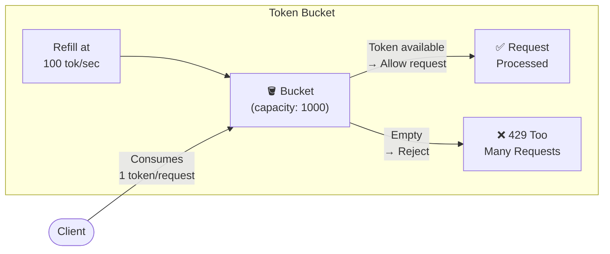

# 8. Rate Limiting, Load Balancing, and Backpressure 🟡

> **What you'll learn:**
> - Why rate limiting is a first-class distributed systems concern, not an afterthought
> - The Token Bucket and Leaky Bucket algorithms: mechanics, trade-offs, and distributed implementation
> - How load shedding and circuit breakers prevent cascading failures during traffic spikes
> - Exponential backoff with jitter: the correct retry pattern that prevents thundering herds

---

## The Problem: Thundering Herds and Cascading Failures

A distributed system that does not protect itself from excess load will fail predictably and catastrophically. The failure mode has a name: **thundering herd**.

```
// 💥 THUNDERING HERD HAZARD: Database restart after maintenance window.
// All 10,000 connections retry immediately at the same second.

fn on_db_connection_error(err):
    sleep(1.0)       // Fixed 1-second retry for all clients
    connect_to_db()  // Simultaneously for all 10,000 clients

// The database just restarted. It has 1,000 connection limit.
// 10,000 simultaneous connection attempts → 9,000 are rejected.
// All 9,000 retry after 1 second → same pile-up.
// The database never recovers because the load wave never dissipates.

// ✅ FIX: Exponential backoff with full jitter (see below).
// ✅ FIX: Rate limiting the number of retry attempts.
// ✅ FIX: Circuit breaker to stop sending requests when the downstream is unhealthy.
```

## Rate Limiting Algorithms

Rate limiting controls the rate at which requests are processed, protecting a server from overload and preventing abusive clients from monopolizing resources.

### Algorithm 1: Token Bucket

The **Token Bucket** algorithm models a bucket that:
- Fills with tokens at a constant rate (the "refill rate")
- Has a maximum capacity (the "burst limit")
- Each request consumes one (or more) tokens
- Requests are rejected if the bucket is empty

```
// Token Bucket implementation (pseudocode)
struct TokenBucket {
    capacity: f64,         // Maximum tokens (burst size)
    tokens: f64,           // Current tokens
    refill_rate: f64,      // Tokens added per second
    last_refill: Instant,
}

impl TokenBucket {
    fn try_consume(&mut self, tokens_needed: f64) -> bool {
        // Refill: add tokens based on elapsed time
        let elapsed = self.last_refill.elapsed().as_secs_f64();
        self.tokens = (self.tokens + elapsed * self.refill_rate)
                        .min(self.capacity);  // Cap at max capacity
        self.last_refill = Instant::now();

        if self.tokens >= tokens_needed {
            self.tokens -= tokens_needed;
            true   // Request allowed
        } else {
            false  // Rate limited — reject or queue
        }
    }
}

// Configuration for an API endpoint:
let limiter = TokenBucket {
    capacity: 1000.0,     // Allow bursts up to 1000 requests
    tokens: 1000.0,       // Start full
    refill_rate: 100.0,   // Sustained rate: 100 requests/second
    last_refill: Instant::now(),
};
```



**Key property:** Token bucket **allows bursts** up to the bucket capacity. After a quiet period, the bucket fills up and can absorb a sudden spike. This is better than a rigid rate for API consumers with bursty traffic patterns.

### Algorithm 2: Leaky Bucket

The **Leaky Bucket** algorithm processes requests at a strict, constant rate regardless of arrival pattern. It is typically implemented as a bounded FIFO queue:

```
// Leaky Bucket (as a queue)
struct LeakyBucket {
    queue: VecDeque<Request>,
    capacity: usize,          // Maximum queue depth
    drain_rate: f64,          // Requests processed per second (constant)
}

impl LeakyBucket {
    fn on_request(&mut self, req: Request) -> Result<(), Rejected> {
        if self.queue.len() >= self.capacity {
            Err(Rejected)  // Queue full: shed load
        } else {
            self.queue.push_back(req);
            Ok(())
        }
    }
    
    // Called at regular intervals (drain_rate times per second)
    fn drain_one(&mut self) -> Option<Request> {
        self.queue.pop_front()
    }
}
```

**Key property:** Leaky bucket produces a **smooth output rate** regardless of bursty input. Requests are queued (up to capacity) and processed one by one. This is ideal for protecting downstream systems that cannot handle bursts.

### Algorithm 3: Sliding Window Counter

More accurate than fixed-window counters (which allow 2× the limit at window boundaries):

```
// Sliding window rate limiter (conceptual)
// For each request, compute: interpolated count
//   = count_in_previous_window * (1 - elapsed_fraction)
//     + count_in_current_window

fn is_allowed(client_id, window_size=60s, limit=100):
    let now = current_time_seconds()
    let current_window = now / window_size        // Integer division
    let prev_window = current_window - 1
    
    let prev_count = get_count(client_id, prev_window)
    let curr_count = get_count(client_id, current_window)
    let elapsed_fraction = (now % window_size) / window_size
    
    let estimated_count = prev_count * (1.0 - elapsed_fraction) + curr_count
    
    if estimated_count < limit:
        increment(client_id, current_window)
        true
    else:
        false
```

### Algorithm Comparison

| Algorithm | Burst Handling | Output Smoothness | Implementation Complexity | Best For |
|-----------|---------------|------------------|--------------------------|---------|
| **Fixed Window Counter** | ❌ 2× at boundaries | ❌ Bursty | Very Simple | Coarse-grained limits (daily quotas) |
| **Token Bucket** | ✅ Burst up to capacity | ❌ Can burst | Simple | API rate limiting (allow bursts) |
| **Leaky Bucket** | ✅ Smooths bursts | ✅ Constant output | Simple | QoS, protecting downstream services |
| **Sliding Window Counter** | ✅ Accurate | ✅ Smooth | Moderate | Strict per-client rate limiting |
| **Sliding Window Log** | ✅ Exact | ✅ Exact | High (per-request timestamps) | Low-volume strict limiting |

## Distributed Rate Limiting

A single-node rate limiter is easy. Distributed rate limiting (across 100 API servers) requires consensus on the request count:

```
// ✅ FIX: Centralized rate limiter with Redis (token bucket, Redis-backed)
// This is accurate but adds ~1 ms latency per request for the Redis call.

fn check_rate_limit(client_id, redis):
    let key = "ratelimit:{client_id}"
    
    // Atomic Lua script to refill and check (single Redis round trip)
    let script = r#"
        local tokens = redis.call('GET', KEYS[1])
        local now = tonumber(ARGV[1])
        local refill_rate = tonumber(ARGV[2])
        local capacity = tonumber(ARGV[3])
        local last_refill = redis.call('HGET', KEYS[1], 'last_refill') or now
        local elapsed = now - last_refill
        tokens = math.min(capacity, tokens + elapsed * refill_rate)
        if tokens >= 1 then
            tokens = tokens - 1
            redis.call('HSET', KEYS[1], 'tokens', tokens, 'last_refill', now)
            return 1  -- allowed
        else
            return 0  -- rate limited
        end
    "#;
    
    redis.eval(script, [key], [unix_ts_ms(), 100.0, 1000.0]) == 1
```

**Trade-off consideration:** Centralized rate limiting adds latency (Redis call on every request). For high-throughput APIs, use **approximate distributed rate limiting**:

```
// Approximate: Each server maintains local token bucket.
// Periodically sync with neighbors or a coordinator.
// Allows up to N * limit QPS if sync intervals are long (where N = servers).
// Good enough for: abuse prevention, DDoS protection.
// Not good enough for: billing enforcement, strict quotas.
```

## Load Shedding

Rate limiting says "you are going too fast." Load shedding says "we are overwhelmed — REJECT requests now to protect the system."

```
// ✅ FIX: Adaptive load shedding based on queue depth or latency

fn handle_request(req):
    let queue_depth = work_queue.len()
    
    // Adaptive shed threshold based on observed latency
    let shedding_threshold = if p99_latency_ms > 2000 {
        0.50   // Already slow: shed 50% of requests
    } else if p99_latency_ms > 1000 {
        0.25   // Getting slow: shed 25%
    } else if queue_depth > MAX_QUEUE_DEPTH {
        0.75   // Queue backing up: shed 75%
    } else {
        0.0    // Normal: shed nothing
    };
    
    if random::f64() < shedding_threshold {
        return Response::ServiceUnavailable("Load shedding — try again");
    }
    
    process(req)

// Priorities: Never shed:
// - Health check endpoints (needed by load balancers to route away)
// - Admin/emergency endpoints (needed to reduce the load!)
// - In-flight requests already being processed
```

## Circuit Breaker Pattern

A circuit breaker prevents cascading failures by detecting when a downstream dependency is unhealthy and **stopping calls entirely** for a cooling-off period:

```
// Circuit Breaker state machine
enum CircuitState { Closed, Open, HalfOpen }

struct CircuitBreaker {
    state: CircuitState,
    failure_count: u32,
    failure_threshold: u32,   // e.g., 5 failures in 60 seconds
    timeout: Duration,        // How long to stay Open before trying
    last_failure_time: Instant,
}

fn call_with_breaker(cb: &mut CircuitBreaker, operation: fn() -> Result):
    match cb.state:
        Closed:
            match operation():
                Ok(result):
                    cb.failure_count = 0   // Reset on success
                    return Ok(result)
                Err(e):
                    cb.failure_count += 1
                    if cb.failure_count >= cb.failure_threshold:
                        cb.state = Open     // TRIP the breaker
                        cb.last_failure_time = Instant::now()
                    return Err(e)
        
        Open:
            if Instant::now() - cb.last_failure_time > cb.timeout:
                cb.state = HalfOpen   // Let ONE probe through
                call_with_breaker(cb, operation)  // Try again
            else:
                return Err(CircuitOpen)  // Fast-fail — no call made

        HalfOpen:
            match operation():
                Ok(result):
                    cb.state = Closed     // Reset! Downstream is healthy.
                    cb.failure_count = 0
                    return Ok(result)
                Err(e):
                    cb.state = Open       // Still broken. Back to Open.
                    cb.last_failure_time = Instant::now()
                    return Err(e)
```

## Exponential Backoff with Full Jitter

**Exponential backoff** doubles the retry wait time on each failure, preventing a thundering herd. **Jitter** adds randomness to spread retry attempts over time:

```
// 💥 BAD: Fixed retry with no jitter
fn retry_with_fixed_backoff(operation):
    for attempt in 0..5:
        match operation():
            Ok(v) => return Ok(v),
            Err(_) => sleep(Duration::from_secs(1)),  // All retriers wake up together!
    Err("max retries exceeded")

// 💥 BAD: Exponential backoff without jitter
fn retry_with_exp_backoff_no_jitter(operation):
    for attempt in 0..5:
        match operation():
            Ok(v) => return Ok(v),
            Err(_) => sleep(Duration::from_secs(2u64.pow(attempt))),
    // 1s, 2s, 4s, 8s, 16s — but ALL clients wake up at EXACTLY the same times.
    // Still a thundering herd! Just slower.

// ✅ FIX: Full Jitter — the AWS recommended approach
fn retry_with_full_jitter<F, T, E>(operation: F) -> Result<T, E>
where F: Fn() -> Result<T, E>
{
    let base_delay = Duration::from_millis(100);
    let max_delay = Duration::from_secs(30);
    let max_attempts = 7;
    
    for attempt in 0..max_attempts {
        match operation() {
            Ok(v) => return Ok(v),
            Err(e) if attempt == max_attempts - 1 => return Err(e),
            Err(_) => {
                let cap = (base_delay * 2u32.pow(attempt)).min(max_delay);
                // Full jitter: sleep for a RANDOM value in [0, cap]
                let sleep_time = Duration::from_millis(
                    rand::gen_range(0..=cap.as_millis() as u64)
                );
                sleep(sleep_time);
            }
        }
    }
    unreachable!()
}
```

**Why full jitter beats exponential backoff alone:** AWS's research on retry storms showed that full jitter (uniform random in [0, cap]) distributes retry attempts smoothly over time, preventing the synchronized retry walls that exponential backoff alone still creates.

---

<details>
<summary><strong>🏋️ Exercise: Design a Distributed Rate Limiter</strong> (click to expand)</summary>

**Problem:** You are building a public API gateway for a SaaS platform. Requirements:

1. **Per-client rate limiting:** Each API key gets a sustained rate of 1,000 RPS with bursts up to 5,000 RPS
2. **Global rate limiting:** Total system capacity is 500,000 RPS
3. **Low latency:** Rate limit check must add < 1 ms to request latency (p99)
4. **100 API gateway nodes** in a single region (auto-scaling 50–200 nodes)
5. **Clients are mobile apps** that will hammer the API on reconnect (thundering herd risk)

**Design your solution addressing:**
1. Which rate limiting algorithm and why?
2. How do you distribute the state across 100 nodes with < 1 ms overhead?
3. How do you handle gateway node failures?
4. How do you prevent the thundering herd on client reconnect?

<details>
<summary>🔑 Solution</summary>

**1. Algorithm: Token Bucket (per-client) + Leaky Bucket (global)**

Per-client: Token bucket with capacity=5,000 (burst) and refill_rate=1,000/s. Allows the burst the requirements specify.

Global: Leaky bucket or simple counter at global level, capped at 500,000 RPS. When the global limit is hit, enforce absolute shedding (no queueing — just 429).

**2. Distributed state with < 1 ms overhead:**

Three-tier approach:
- **Tier 1: Local token bucket per gateway node** (pure in-memory, 0 ms overhead). Each node maintains a local bucket that approximates 1/100th of the global rate (1,000 RPS / 100 nodes = 10 RPS local). This handles the common case instantly.
- **Tier 2: Redis Cluster for authoritative per-client counts** (async sync every 100 ms). Each gateway periodically pushes its consumed tokens to Redis and pulls the global available balance. The local bucket is only allowed to run down to 0 (it cannot go negative without Redis confirmation).
- **Tier 3: Redis Lua script for burst handling** (when local bucket hits 0, make a Redis call to "borrow" more tokens). This call adds ~0.5 ms. Since bursts are infrequent, p50 stays 0 ms overhead; p99 stays ~0.5 ms.

```
Global state in Redis (per client_id):
  HASH rate_limit:{client_id}:
    tokens: f64          // Remaining tokens in shared pool
    last_refill: u64     // Unix timestamp ms
    total_consumed: u64  // For billing/analytics

Local state per gateway node:
  local_tokens: AtomicF64  // Local token bucket
  local_limit: f64         // = min(client_allocation / num_nodes, 5000)
```

**3. Gateway node failure:**

Since local state is not persisted, a gateway failure loses only the local token bucket state. On restart, the node requests a fresh allocation from Redis. Clients routed to the new node get a fresh local bucket — they cannot consume more than their global allocation allows (enforced by Redis).

For client stickiness (session affinity), use consistent hashing at the load balancer layer. When a gateway node fails, the consistent hashing ring reassigns clients to adjacent nodes — a partial bucket transfer, not a complete reset.

**4. Thundering herd prevention:**

For mobile app reconnects, implement **retry-after headers** with jitter:

```
When returning 429:
  retry_after = base_delay_seconds + random_jitter
  Return: HTTP 429, Retry-After: {retry_after}

base_delay = 1.0  // 1 second base
jitter = random_f64(0.0..1.0) * 2.0  // Up to 2 extra seconds
// Different clients wait 1.0–3.0 seconds before retrying
// This spreads 100,000 simultaneous reconnects over 2 seconds
// = 50,000 RPS (within burst capacity of 5,000/client but manageable globally)
```

Additionally, implement **exponential backoff** in the mobile SDK: after a 429, the client uses full jitter with cap=30s. After a network reconnect event, the client waits initial_jitter = random(0, 5s) before any API call.

</details>
</details>

---

> **Key Takeaways:**
> - **Token Bucket is the standard rate limiting algorithm** for API gateways: it allows bursts up to the configured capacity while enforcing a sustained rate.
> - **Leaky Bucket smooths output**, protecting downstream systems from bursty traffic. Use it at the boundary between external and internal services.
> - **Load shedding is not failure** — it is a deliberate, controlled mechanism to prevent uncontrolled failure. A service that sheds 30% of load is healthier than one that crashes under 110% load.
> - **Circuit breakers prevent cascading failure.** When a dependency is unhealthy, stop sending it requests before the timeout storm propagates up your call chain.
> - **Always use exponential backoff with full jitter.** Synchronized retries (fixed delay or pure exponential) create thundering herds that are as destructive as the original failure. Full jitter is the AWS-validated minimum.

> **See also:** [Chapter 9: Capstone](ch09-capstone-global-key-value-store.md) — how the KV store uses quorum (a form of controlled degradation) to stay available under failure | [Chapter 3: Raft and Paxos Internals](ch03-raft-and-paxos-internals.md) — leader election recovery time influences how long circuit breakers should remain open after a consensus cluster failover
