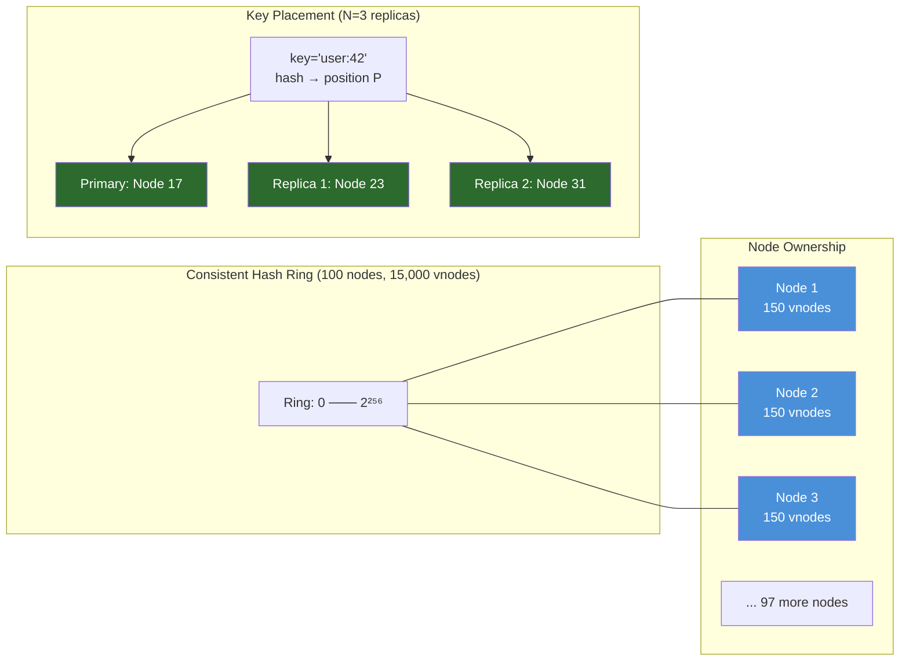
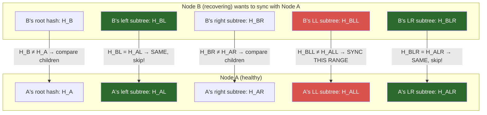
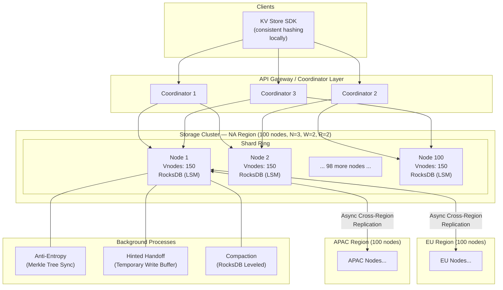

# 9. Capstone Project: Design a Global Key-Value Store 🔴

> **What you'll learn:**
> - How to structure a complete large-scale system design from first principles
> - How to apply consistent hashing, leaderless replication, quorum reads/writes, hinted handoff, and vector clocks together as a coherent system
> - The tensions and trade-offs that the Amazon Dynamo paper (2007) resolved — and how they apply to your own design decisions
> - How to reason about latency, throughput, durability, and availability SLAs simultaneously

---

## The Design Brief

> **System Design Challenge:** Design a globally distributed, highly available Key-Value store similar to Amazon DynamoDB or Apache Cassandra. The system must support:
>
> - `get(key) → Option<Value>`
> - `put(key, value) → Result<(), Error>`
> - `delete(key) → Result<(), Error>`
> - 99.9% availability SLA (8.7 hours/year downtime)
> - p99 read latency < 10 ms, p99 write latency < 20 ms
> - 1 million read RPS and 200,000 write RPS (global peak)
> - Data must survive simultaneous failure of any 2 nodes in a cluster
> - Multi-region: NA, EU, APAC (3 active regions, no hot-standby)

This is the kind of question you will face in a Principal/Staff-level system design interview. Take 45 minutes to sketch your own solution before reading on.

## Step 1: API Design and Capacity Estimation

### API Surface

```
// Core Key-Value API
put(key: String, value: Bytes, options: PutOptions) -> Result<PutResult>
  options: {
    consistency: ConsistencyLevel,  // ONE | QUORUM | ALL
    ttl: Option<Duration>,
    condition: Option<Condition>,   // Conditional write (CAS)
  }

get(key: String, options: GetOptions) -> Result<Option<GetResult>>
  options: {
    consistency: ConsistencyLevel,  // ONE (eventual) | QUORUM (strong)
  }

delete(key: String, options: DeleteOptions) -> Result<()>

// Bulk operations
batch_get(keys: Vec<String>) -> Result<Vec<Option<Value>>>
scan(prefix: String, limit: usize) -> Result<Vec<(String, Value)>>
```

### Capacity Estimation

| Metric | Estimate | Calculation |
|--------|----------|-------------|
| Total QPS | 1.2M | 1M reads + 200K writes |
| Per-region QPS | 400K | 1.2M / 3 regions |
| Avg key size | 200 bytes | Typical user-facing key |
| Avg value size | 1 KB | Small document, typical |
| Data per write | ~1.2 KB | key + value + metadata |
| Write bandwidth | 240 MB/s | 200K writes × 1.2 KB |
| Data growth per day | ~20 TB | 200K × 1.2KB × 86,400s |
| 3-year data retention | ~22 PB | 20TB/day × 3 years × 365 |
| Replication factor = 3 | 3× data on disk | ~66 PB total raw disk |
| With 3:1 compression | ~22 PB effective disk | Values often compressible |

```
Cluster sizing (per region):
  Nodes: 100 nodes (NVMe SSD, 8 TB each = 800 TB raw per region)
  Network: 25 Gbps inter-node, 100 Gbps to internet
  RAM: 256 GB per node (for MemTable, bloom filters, block cache)
  CPUs: 64 cores (for concurrent request handling, compaction)
```

## Step 2: Data Partitioning with Consistent Hashing

As designed in Chapter 6, we distribute data across 100 nodes per region using consistent hashing with virtual nodes.

```
Hash Space: SHA-256 → 2^256 positions

Virtual Nodes (vnodes):
  Each physical node: 150 vnodes
  Total vnodes per cluster: 100 × 150 = 15,000
  Each vnode is responsible for a range of the hash space
  
Replication:
  Each key's primary vnode + next 2 clockwise vnodes on DIFFERENT physical nodes
  (replication factor N = 3 — always on 3 different physical nodes)

Key Assignment:
  partition_key = hash(key) % 2^256
  primary_node = ring.find_node_for(partition_key)
  replica_nodes = ring.next_2_distinct_physical_nodes(partition_key)
```



### Coordinator Node

Clients do not need to know the hash ring. A **coordinator** (any KV store node, or a dedicated gateway) routes requests:

```
// Client request routing
fn on_get(client_request):
    let key = client_request.key
    let target_nodes = ring.get_replicas(key, n=3)
    // Send read to R=2 nodes (for QUORUM), fanout in parallel
    let responses = parallel_read(target_nodes, r=2, key)
    let value = reconcile(responses)
    return value

fn on_put(client_request):
    let key, value = client_request.key, client_request.value
    let target_nodes = ring.get_replicas(key, n=3)
    // Send write to all 3 nodes; wait for W=2 ACKs
    let acks = parallel_write(target_nodes, w=2, key, value)
    return if acks.len() >= 2 { Ok(()) } else { Err(WriteTimeout) }
```

## Step 3: Leaderless Replication with Quorum

With N=3 replicas, W=2 writers, R=2 readers:

**W + R > N → 2 + 2 > 3 → 3 > 3? No — 4 > 3. YES.**

Wait: 2+2=4 > 3. At least 1 node participates in both the write set and the read set, guaranteeing the read sees the latest write.

```
// Quorum guarantees consistency:
// N=3, R=2, W=2

// STRONG CONSISTENCY scenario:
// Write to nodes {A, B, C}: A and B ACK (W=2 satisfied).
// Read from nodes {A, B, C}: A and C respond (R=2 satisfied).
// At least one of {A,B} ∩ {A,C} = {A} → A has the latest value. ✅

// AVAILABILITY TUNING:
//   N=3, R=1, W=1: High availability, eventual consistency (W+R ≤ N)
//   N=3, R=2, W=2: Balanced (our default)
//   N=3, R=3, W=3: Strong (unavailable if any replica is down)
//   N=3, R=1, W=3: Write quorum ensures durability; reads may be stale
```

### Read Repair

When a read returns responses from multiple replicas that differ, the coordinator performs **read repair**:

```
fn reconcile(responses: Vec<NodeResponse>) -> Value {
    // Find the response with the highest version (vector clock comparison)
    let (latest_value, latest_version, stale_nodes) = find_latest(responses);
    
    // Asynchronously repair the stale nodes
    for node in stale_nodes {
        spawn(async move {
            node.repair_write(key, latest_value, latest_version)
        });
    }
    
    latest_value
}
```

Read repair is **on the critical path** only if you return the result to the client *after* repair completes (synchronous). Use **asynchronous** read repair to avoid adding repair latency to the read.

## Step 4: Handling Node Failures

### Sloppy Quorum and Hinted Handoff

When a replica node is temporarily unavailable:

```
// Sloppy Quorum: expand the replica set to maintain availability
fn write_with_hinted_handoff(key, value, target_nodes):
    let available = target_nodes.filter(|n| n.is_reachable())
    let missing_count = N - available.len()
    
    if available.len() < W:
        // Can't reach quorum even with handoff — return error
        return Err(InsufficientReplicas);
    
    // Write to available intended replicas
    write_to_replicas(available, key, value)
    
    // Find "hint" nodes for missing replicas
    for _ in 0..missing_count {
        let hint_node = ring.next_healthy_non_replica(key)
        hint_node.write(key, value, hint_for=missing_node_id)
        // hint_node stores: (key, value, hint_for=Node_X)
        // When Node_X recovers, hint_node pushes the data to Node_X
        // and removes its own hint copy
```

### Anti-Entropy with Merkle Trees

When a node recovers from a long outage, hinted handoff may have missed some writes (hinted nodes don't keep hints forever). Anti-entropy synchronizes the full keyspace:



```
// Merkle Tree Anti-Entropy Protocol
fn anti_entropy_sync(local_node, peer_node):
    let local_tree = build_merkle_tree(local_node.keyspace)
    let peer_root_hash = peer_node.get_merkle_root()
    
    if local_tree.root_hash == peer_root_hash:
        return  // Perfectly in sync — nothing to do
    
    // Binary search for divergent ranges
    let divergent_ranges = compare_subtrees(local_tree, peer_node)
    
    // For each divergent range: sync with the peer (send missing keys)
    for range in divergent_ranges:
        let my_keys = local_node.scan(range)
        let peer_keys = peer_node.scan(range)
        sync_diff(my_keys, peer_keys, local_node, peer_node)
```

## Step 5: Conflict Resolution with Vector Clocks

When the same key is written concurrently in a leaderless system, multiple versions may exist on different replicas:

```
// Vector clock per key-value entry
struct Value {
    data: Bytes,
    version: VectorClock,  // { NodeId → sequence_number }
    timestamp: HLC,        // Hybrid Logical Clock (for tie-breaking)
}

fn reconcile_versions(versions: Vec<Value>) -> ReconcileResult {
    let mut dominant = versions[0];
    let mut siblings = Vec::new();
    
    for version in &versions[1..] {
        match compare_vector_clocks(&dominant.version, &version.version) {
            Ordering::Happens_Before => dominant = version.clone(),
            Ordering::Happens_After => {}  // dominant is newer, keep it
            Ordering::Concurrent => {
                // BOTH versions are valid! Return as siblings.
                siblings.push(version.clone());
            }
        }
    }
    
    if siblings.is_empty() {
        ReconcileResult::Resolved(dominant)
    } else {
        // Return all concurrent versions: application must resolve
        // Most applications use LWW (pick highest HLC) or automatic CRDTs
        ReconcileResult::Conflict { versions: once(dominant).chain(siblings).collect() }
    }
}
```

**Conflict resolution policies:**

| Policy | Mechanism | Good For | Bad For |
|---------|-----------|---------|---------|
| **Last-Write-Wins (LWW)** | Pick highest HLC timestamp | Caches, sessions | Inventory (silent data loss) |
| **Application-level merge** | Return siblings; app merges them | Shopping carts | Latency-sensitive paths |
| **CRDT automatic merge** | Commutative data type | Counters, sets, presence | Arbitrary schemas |
| **Vector clock + LWW fallback** | Use VC for causal ordering; LWW only for true concurrency | Most reasonable default | |

## Step 6: Complete Architecture Diagram



## Step 7: Putting It All Together — The Write Path

```
CLIENT → COORDINATOR → STORAGE NODES

1. Client: put("user:42:profile", profile_data, consistency=QUORUM)

2. Coordinator (Gateway):
   a. Compute hash(key) → position on ring → 3 target nodes {N17, N23, N31}
   b. Check availability: N17 ✅, N23 ✅, N31 ❌ (unresponsive)
   c. Sloppy quorum: find hint node N45 (4th node clockwise, not a replica)
   d. Attach vector clock: increment coordinator's VC component

3. Parallel write to N17, N23, N45 (hint_for=N31):
   a. Each node: append to WAL, insert into MemTable with VC
   b. N17 → ACK, N23 → ACK (W=2 satisfied ✅)
   c. N45 stores hinted write locally (will push to N31 when it recovers)

4. Coordinator returns SUCCESS to client after 2 ACKs

5. Background: N45 polls N31 health. When N31 recovers,
   N45 pushes hinted write to N31 and deletes its hint copy.
```

## Step 8: The Read Path

```
CLIENT → COORDINATOR → STORAGE NODES

1. Client: get("user:42:profile", consistency=QUORUM)

2. Coordinator:
   a. ring.get_replicas("user:42:profile") → {N17, N23, N31}
   b. Fire parallel reads to all 3 (don't wait to know N31 is down)

3. N17 responds: { value: V1, vc: {N17:5, N23:3} }
   N23 responds: { value: V1, vc: {N17:5, N23:3} }
   N31: Timeout (still recovering)
   → R=2 achieved after N17 and N23 ✅

4. Reconcile:
   Both replies have same VC → Same value → No conflict
   Return V1 to client

5. Asynchronous: read repair for N31 after it recovers (via anti-entropy)
```

---

<details>
<summary><strong>🏋️ Exercise: Extend the Design for Cross-Region Replication</strong> (click to expand)</summary>

**Problem:** Extend the single-region design to support all three regions (NA, EU, APAC) with the following requirements:

1. A write acknowledged in NA must be durable even if NA goes fully offline (region-level durability)
2. EU users must read p99 < 10 ms (can only be served from EU region)
3. Cross-region write propagation must complete within 5 seconds (eventual consistency target)
4. During a full NA region outage, EU and APAC must continue serving reads AND writes

**Design decisions:**
1. How do you handle cross-region replication (synchronous or asynchronous)?
2. With 3 regions, how do you define N, W, R globally?
3. What happens to writes during a full region outage (NA)?
4. How does EU continue serving writes for data "owned" by NA?

<details>
<summary>🔑 Solution</summary>

**1. Asynchronous cross-region replication (not synchronous)**

Synchronous cross-region replication would add NA→EU RTT (~90 ms) to every write. This violates the p99 < 20 ms write latency requirement. Cross-region replication must be **asynchronous** — commit locally, replicate in the background.

**2. Global N, W, R:**

```
Per-region:    N=3, W=2, R=2 (same as single-region design)
Global quorum: Not used on the write path (would be too slow)

Durability strategy:
  Local W=2 → write is durable in primary region (survives 1 node failure)
  Cross-region async → write is durable in ALL 3 regions after ~5 seconds
  Combined: After 5s, the write can survive loss of any entire region

To satisfy "durable even if NA goes fully offline":
  Cross-region replication must complete before the write's S3 backup window
  OR implement "region quorum" for writes requiring cross-region durability:
    W_global = W_local + W_crossregion (write to 1 cross-region replica synchronously)
    → NA writes to EU replica before ACKing (adds ~90ms latency)
    → Accept this for "durable across regions" tier; offer cheaper "local durability only" tier
```

**3. Full NA region outage:**

The consistent hashing ring is **per-region**, not global. Each region has its own full copy of all data (via async replication). During NA outage:
- EU and APAC each have all data (replicated within 5s RTO from last NA write)
- EU clients continue reading from EU — unaffected (EU never route to NA for data they own locally)
- NA-originated clients must be re-routed (by the global load balancer / GeoDNS) to EU or APAC

**4. Writes for "NA-owned" data during NA outage:**

In a pure consistent hash model, every key has primary replicas in ALL regions — there is no "NA-owned" key (all 3 regions have all N_global = 9 replicas: 3 per region). During NA outage, EU and APAC have 6 of 9 replicas. If W_global = 4 (global majority of 9), 6 available replicas can form a write quorum.

Architecture: **Global Virtual Ring** (separate from per-region rings):
```
Global N = 9 (3 replicas × 3 regions)
Global W = 5 (majority of 9, required for global strong consistency)
Global R = 5 (majority)

Normal operation: Write locally (W=2), async replicate to other regions.
During NA outage: Global writes can still achieve quorum with EU(3) + APAC(3) = 6 > 5. ✅
During 2-region outage: Only 3 replicas available — below global W=5 quorum. STALL.
```

This gives 99.9999% region-level fault tolerance (survives any 1-region outage, stalls on any 2 simultaneous region outages — an extremely rare event).

</details>
</details>

---

> **Key Takeaways:**
> - **Capacity estimation is not optional in a system design interview.** Numbers anchor every architectural decision: node count, network bandwidth, storage tier, replication cost.
> - **Consistent hashing is the core of horizontal scalability.** Virtual nodes ensure even load distribution; clockwise traversal enables N replicas without explicit assignment tables.
> - **Leaderless replication with W+R>N gives tunable consistency.** Lower W and R gives lower latency and higher availability; higher values give stronger consistency.
> - **Hinted handoff + Merkle tree anti-entropy** is the operational backbone of a Dynamo-style system — these mechanisms ensure that "eventually consistent" actually means "eventually correct," not "eventually garbage."
> - **Vector clocks detect concurrent writes.** In a leaderless system, conflicts are inevitable during partitions. The correct response is to detect them (via VCs), not silently discard one (LWW) unless your application explicitly tolerates it.

> **See also:** [Chapter 1: Time, Clocks, and Ordering](ch01-time-clocks-and-ordering.md) — vector clock semantics | [Chapter 3: Raft and Paxos Internals](ch03-raft-and-paxos-internals.md) — the alternative to leaderless: consensus-based coordination | [Chapter 6: Replication and Partitioning](ch06-replication-and-partitioning.md) — deep dive into each replication component used here
