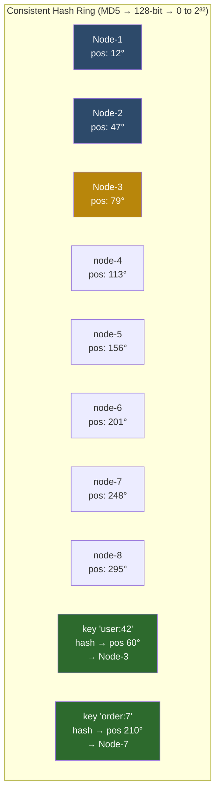
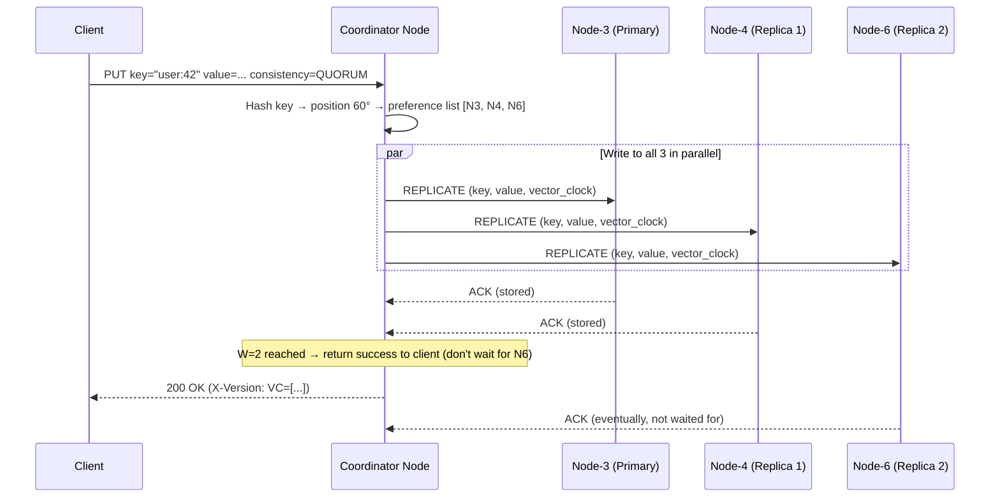
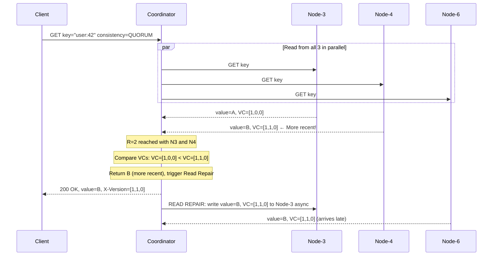
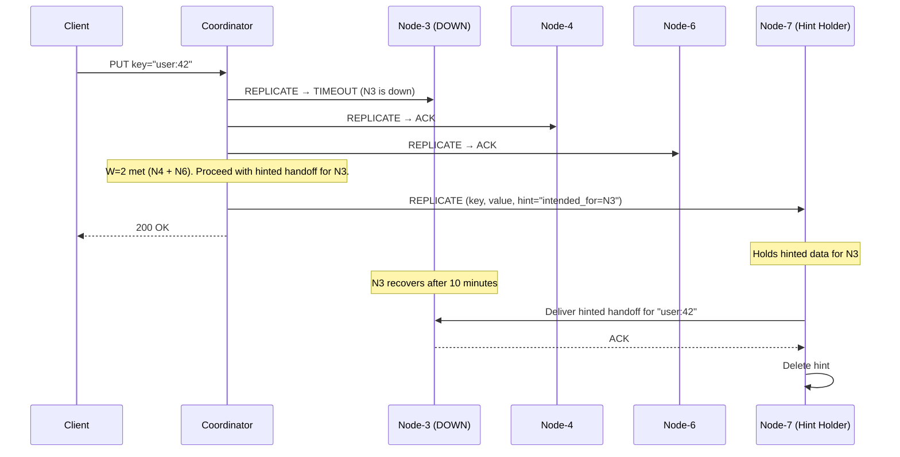
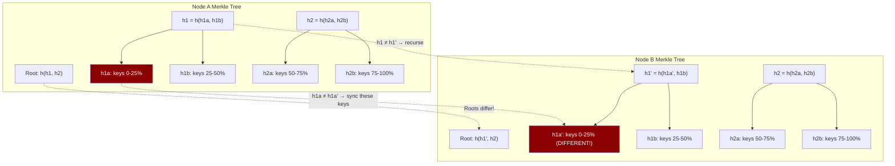
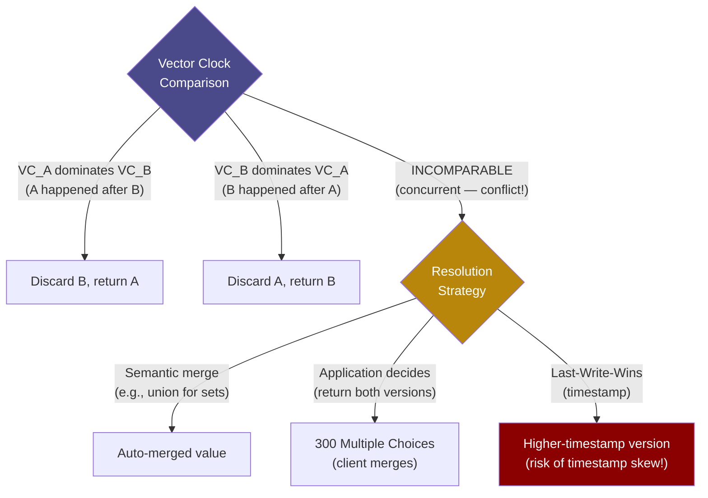
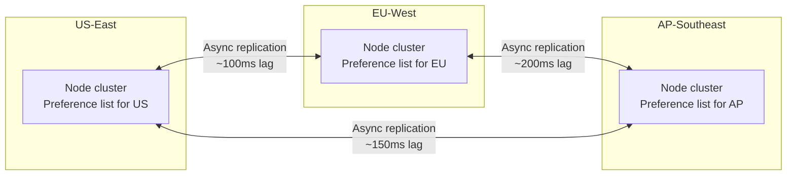
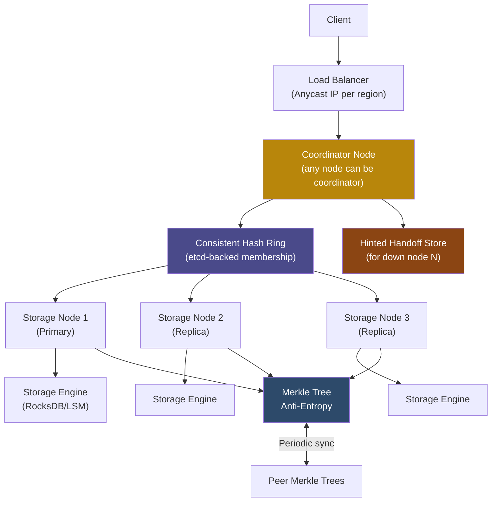

# 9. Capstone: Design a Global Key-Value Store 🔴

> **What you'll learn:**
> - How to approach a full system design interview question as a Principal/Staff engineer
> - How to translate requirements into capacity estimates, partitioning strategies, and replication topologies
> - How all concepts from this book (consistent hashing, quorum replication, hinted handoff, Merkle trees, vector clocks) combine into one coherent system
> - The real trade-offs made by Amazon Dynamo and how to reason about them in an interview or architectural review

---

## Interview Framing

This chapter simulates a full system design interview. You have 45 minutes. The interviewer says:

> *"Design a highly available, distributed key-value store similar to Amazon Dynamo. It needs to serve global traffic, tolerate multi-node failures, and prioritize availability over strong consistency. Walk me through your design."*

We will solve this in 6 steps, each of which corresponds to concepts from earlier chapters.

**Before touching any design:** Clarify requirements.

---

## Step 1: Requirements and Constraints

### Functional Requirements

- `get(key) → value | not_found`
- `put(key, value) → ok | error`
- `delete(key) → ok | not_found`
- Keys: up to 256 bytes. Values: up to 1 MB.

### Non-Functional Requirements

- **Availability:** 99.999% uptime (5.26 minutes downtime/year). Prioritize writes even during partition.
- **Latency:** p50 < 5ms, p99 < 50ms for both reads and writes.
- **Durability:** Once a write is acknowledged, data must survive the simultaneous failure of any 2 nodes in a region.
- **Consistency:** Eventual consistency is acceptable. Conflicts must be detectable and resolvable.
- **Scale:** 10 million requests/second globally (70% reads, 30% writes).
- **Data volume:** 100 TB total; grows at 10 TB/year.

### Capacity Estimates

```
Global RPS:       10M req/s
Read RPS:         7M req/s
Write RPS:        3M req/s

Average value:    10 KB (mix of small and large)
Write throughput: 3M × 10KB = 30 GB/s
Storage:          100 TB current; 200 TB planning horizon (2 years)

Regions:  3 (US-East, EU-West, AP-Southeast)
Nodes per region: target ~100 storage nodes per region

Per-node write:   30 GB/s ÷ 100 nodes = 300 MB/s per node
→ NVMe SSD (3 GB/s sequential) ✅ — but must account for replication factor 3:
  300 MB/s × 3 (replicas) = 900 MB/s per node on inbound replication
→ 900 MB/s is within NVMe capability but requires network bandwidth:
  100 nodes × 900 MB/s = 86 Tbps internal bandwidth
→ Reduce by batching and compression: assume 5x compression → ~17 Tbps
→ Datacenter networking at this scale (100G per node × 100 nodes = 10 Tbps per switch tier)
→ Need multi-tier Clos network; each node gets 25 Gbps dedicated
```

This capacity math tells us we need **~100 storage nodes per region**, **25 Gbps networking per node**, and **NVMe SSDs**.

---

## Step 2: API Design

```
HTTP-Compatible API (or custom binary protocol for internal use):

PUT /keys/{key}
    Body: binary value (up to 1MB)
    Headers: X-Consistency-Level: ONE|QUORUM|ALL (default: QUORUM)
    Response: 200 OK
              Headers: X-Version: <vector-clock base64>

GET /keys/{key}
    Headers: X-Consistency-Level: ONE|QUORUM|ALL (default: QUORUM)
    Response: 200 OK, Body: value
              Headers: X-Version: <vector-clock base64>
           OR 404 Not Found
           OR 300 Multiple Choices (conflict detected — body contains all versions)

DELETE /keys/{key}
    Response: 200 OK (tombstone written)
           OR 404 Not Found

Internal replication API:
    REPLICATE /internal/replicate
        Body: { key, value, vector_clock, hinted_for_node? }
```

---

## Step 3: Consistent Hashing Ring



**Implementation details:**

```
Virtual nodes: 200 per physical node (ensures ±5% load variance)
Replication factor: N = 3 (3 consecutive nodes clockwise on ring own each key)
    key "user:42" at position 60° → owned by Node-3, Node-4, Node-5

Ring membership: stored in etcd (consensus-backed)
    Nodes register on startup: PUT /ring/nodes/{node-id} {address, vnode_positions}
    Coordinator nodes watch for changes and update routing table
```

**Why 200 virtual nodes?**

With only 100 physical nodes and 200 VNs each, we have 20,000 ring positions. Expected standard deviation of load between nodes is `O(1/√(N_vnodes)) ≈ 1/√200 ≈ 7%`. Acceptable.

On node addition/removal, only data in the affected ring segments migrates — approximately `N_keys / N_nodes` keys, or 1% per node removal in a 100-node cluster.

---

## Step 4: Replication with Quorum

### Preference List

For key K at position P, the **preference list** is the list of the N=3 next physical nodes clockwise from P, skipping virtual node duplicates of the same physical node:

```
key "user:42" → position 60° → preference list: [Node-3, Node-4, Node-6]
(Node-5 is a virtual node duplicate of Node-3 — skipped)
```

### Write Path (W=2)



**W=2, R=2, N=3:** W + R = 4 > 3 = N → at least 1 node overlaps between any write quorum and any read quorum → reads always see the latest write (in the absence of network partition).

### Read Path (R=2) with Read Repair



**Read Repair** — when a coordinator detects divergent versions among replicas during a read, it asynchronously writes the most recent version back to the stale replicas. This is Dynamo's primary anti-entropy mechanism for frequently-accessed keys.

---

## Step 5: Failure Handling

### Hinted Handoff (Temporary Failures)



Each node periodically scans for hints it holds and attempts to deliver them. Hint expiry: 24 hours (after that, assume the node failed permanently and trigger full data transfer instead).

### Anti-Entropy with Merkle Trees

For persistent data divergence (network partition lasted hours, node replaced after failure), **read repair** only fixes keys that are actively read. Unmread keys can remain stale indefinitely. **Merkle Tree Anti-Entropy** finds all divergent keys without transferring all data:



**Algorithm:**
1. Node A and Node B exchange Merkle tree root hashes
2. If roots differ → recurse into left and right subtrees
3. Recursion terminates when subtree hashes match (no sync needed) or we reach leaf level
4. Sync only the leaf ranges where hashes differ

For 100 TB with 1 KB average key, that's 10^11 keys. With a 4-level Merkle tree: at most 16 leaf nodes to compare at step 3 before finding the divergent range. Compare 16 hashes instead of 100 billion keys.

**Anti-entropy schedule:** Run between each node pair every 1 hour. Each run compares Merkle roots and syncs divergent ranges.

---

## Step 6: Conflict Resolution with Vector Clocks

When two clients write the same key concurrently to different replicas (during partition), the coordinator detects a conflict on read:

```
Client A → Node-3: PUT key="user:42" value="v1", VC=[A:1]
During partition, Node-4 is isolated:
Client B → Node-4: PUT key="user:42" value="v2", VC=[B:1]

Partition heals. Node-3 sends VC=[A:1], Node-4 sends VC=[B:1].
[A:1] and [B:1] are INCOMPARABLE (concurrent writes — neither happened-before the other).
→ CONFLICT!
```

**Resolution options:**



**Best practice:** Return both conflicting versions to the client (HTTP 300 Multiple Choices), along with their vector clocks. The application performs semantic merge (e.g., a shopping cart merges by unioning items — the Dynamo paper's example). The client PUTs the merged value back with a new vector clock that dominates both.

---

## Step 7: Cross-Region Replication



Cross-region replication is **asynchronous** by default (EL choice from PACELC — we favor latency over strong consistency). Options:

- **Global reads at QUORUM:** Route to the nearest region; reads return local data
- **Global writes at QUORUM:** Write to local region quorum; async propagate globally
- **Strong global consistency (opt-in):** Write quorum = W_global must include replicas from ≥2 regions — adds 100ms cross-region RTT

---

## Complete Architecture Diagram



---

## Key Design Decisions Summary

| Decision | Choice | Rationale |
|----------|--------|-----------|
| **Consistency model** | Eventual (AP) with tunable quorum | Availability > consistency per requirements |
| **Partitioning** | Consistent hashing with 200 VNs/node | Minimal rebalancing on membership change |
| **Replication factor** | N=3 per region | Survives 2 simultaneous node failures |
| **Write quorum** | W=2 | Survives 1 node failure during write |
| **Read quorum** | R=2 | Ensures W+R>N for quorum consistency |
| **Conflict detection** | Vector clocks per key | Detects concurrent writes; CRDTs where possible |
| **Conflict resolution** | Application-level merge | Semantically correct; avoids silent data loss |
| **Temporary failure** | Hinted handoff + 24h expiry | Transparent recovery for short outages |
| **Permanent failure** | Merkle tree anti-entropy (hourly) | Finds stale keys without full scan |
| **Storage engine** | RocksDB (LSM) | Write-optimized; sequential I/O for replication |
| **Coordinator** | Any ring node | No single point of failure |
| **Membership** | etcd (Raft-backed) | Consistent view of ring; AP nodes don't need consensus |
| **Cross-region** | Async replication | Favors local latency; conflicts handled by VCs |

---

## Interview Deeper-Dive Questions

Your interviewer will probe:

**"What happens if the coordinator crashes mid-write?"**

The client receives no response (or a timeout). The write may or may not have been replicated to some nodes. The client's idempotency key (included in the request) allows safe retry — if the write reached W nodes, re-sending it with the same VC will be detected as a duplicate and no-opped. If it reached fewer, the retry completes it.

**"How do you handle key hotspots?"**

A celebrity's profile key is accessed by millions but lives on 3 nodes. Solutions:
1. **Local caching:** CDN/edge cache for read-heavy keys (invalidated on PUT)
2. **Read-ahead replication:** Detect hot keys (>1000 QPS) and temporarily replicate to more nodes (10-20) automatically
3. **Key range splitting:** Hot key gets promoted to its own consistent hash range served by a dedicated node subset

**"How does your system behave during a regional failure?"**

US-East goes completely dark:
- EU and AP clients continue normally (their regions are unaffected)
- US clients: DNS Anycast reroutes to the nearest healthy region
- Writes destined for US-East go to EU-West using hinted handoff ("intended for US-East")
- Hints accumulate for up to 24 hours; on US-East recovery, hints are delivered
- If US-East is down >24 hours: Merkle tree anti-entropy on recovery finds and syncs all divergent keys

**"What's your biggest operational risk?"**

**Concurrent partition + compaction spike.** If a network partition isolates 2 nodes, those nodes accumulate writes diverging from the majority. When the partition heals, Merkle tree sync kicks in at the same time as RocksDB compaction (triggered by accumulated Level-0 files). This can cause write stalls and latency spikes at exactly the wrong time. Mitigation: throttle compaction during partition recovery; use RocksDB's `rate_limiter` API.

<details>
<summary><strong>🏋️ Exercise: Extend the KV Store with TTL and Multi-Region Strong Consistency</strong> (click to expand)</summary>

**Part 1: Add TTL support**

The product team wants to add `put(key, value, ttl_seconds)` support so that entries expire automatically. Design how you would implement TTL in your KV store.

Consider:
- How does TTL interact with replication (do all replicas need to expire at the same time)?
- How does TTL interact with Merkle tree anti-entropy (don't sync expired keys)?
- How do you handle clock skew between replica nodes at expiry time?

**Part 2: Strong global consistency for one key family**

The security team needs `session:{session_id}` keys to be strongly consistent globally — a session invalidated in EU must be immediately unreadable in AP (within 100ms). All other keys remain eventually consistent.

Design the routing and replication changes. You may use a global etcd cluster as part of your solution.

<details>
<summary>🔑 Solution</summary>

**Part 1: TTL Implementation**

**Storage Level:**

RocksDB natively supports per-key TTL via `CompactionFilterFactory`:
```
Put(key, value, ColumnFamilyOptions{ttl_secs})
→ RocksDB marks the key with an expiry timestamp
→ During compaction, values past expiry are deleted (compaction filter)
```

For a custom engine, attach TTL to the value metadata:
```
value_on_disk = { data: ..., written_at: unixtime_secs, ttl_secs: N }
on_read: if (now - written_at) > ttl_secs → treat as deleted (return not_found)
```

**TTL and Replication:**

Clock skew between replicas means Replica A might expire a key that Replica B still returns (if B's clock is slightly behind). Solutions:

1. **Expiry at write time + grace period:** Store absolute expiry timestamp (written_at + ttl). On read, accept up to 2 seconds of grace (`if now < expiry + grace_seconds → return value`). This handles ±1s of NTP skew.

2. **Expiry-aware Merkle trees:** Exclude keys where `expiry_timestamp < now - 5m` from Merkle tree hashing. Anti-entropy doesn't attempt to sync expired keys.

3. **Delete propagation:** When a node notices a key has expired, it can issue a DELETE (tombstone) and replicate it — turning expiry into an explicit delete that propagates via normal replication paths.

**Part 2: Strong Consistency for Session Keys**

**Architecture: Separate Session Namespace with Global etcd**

```
global-etcd:
    3-region etcd cluster (etcd supports multi-region Raft with geo-distributed voters)
    Write: W across all 3 region representatives (strong consistency, ~200ms cross-region RTT)
    Read: leader reads only (read from the global Raft leader)

Routing logic:
    if key starts with "session:":
        → route to global-etcd
    else:
        → route to local region's Dynamo-style KV cluster (as designed)
```

For session invalidation:
```
DELETE session:{session_id} → goes to global-etcd
etcd commits via Raft with majority across regions
All regions see the deletion when they next read from etcd leader
→ Session is unreadable globally within 1 RTT (~50-200ms)
```

For session reads, all services must query etcd (not a local cache) for session keys. This adds ~50ms (intra-region) or ~150ms (cross-region leader reads) per API call that requires session validation. Buffer this with an in-process cache with very short TTL (500ms) and event-driven invalidation via etcd Watch:

```
Service A:
    on startup: etcd.watch("/sessions/")
    on invalidation event: delete from local 500ms cache immediately
    on read: check 500ms local cache first → if miss, read from etcd leader
```

After invalidation, affected session is unreadable globally within 500ms (cache TTL) + event propagation time (~tens of milliseconds). Total: well within the 100ms requirement for active sessions not in cache.
</details>
</details>

---

> **Key Takeaways**
> - A Dynamo-style KV store combines consistent hashing (partitioning), quorum replication N=3/W=2/R=2 (consistency/availability trade-off), hinted handoff (temporary failure tolerance), and Merkle tree anti-entropy (permanent divergence repair)
> - Vector clocks detect conflicts precisely; application-level merge (or CRDT semantics) handles conflicts without data loss
> - Cross-region eventual consistency is the default for availability; a separate consensus-backed path (etcd) handles the rare cases requiring global strong consistency
> - Every design decision is a trade-off: N=3/W=2/R=2 gives strong consistency when all nodes are healthy, but reverts to eventual during partition — this is intentional

> **See also:**
> - [Chapter 1: Time, Clocks, and Ordering](ch01-time-clocks-and-ordering.md) — Vector clock fundamentals, why LWW timestamps are unsafe
> - [Chapter 6: Replication and Partitioning](ch06-replication-and-partitioning.md) — Consistent hashing, quorum mechanics, hinted handoff details
> - [Chapter 5: Storage Engines](ch05-storage-engines.md) — Why RocksDB (LSM) is the right choice for the storage layer
> - [Appendix A: Reference Card](appendix-a-reference-card.md) — Quick-reference for all formulas, trade-off tables, and latency numbers used in this design
