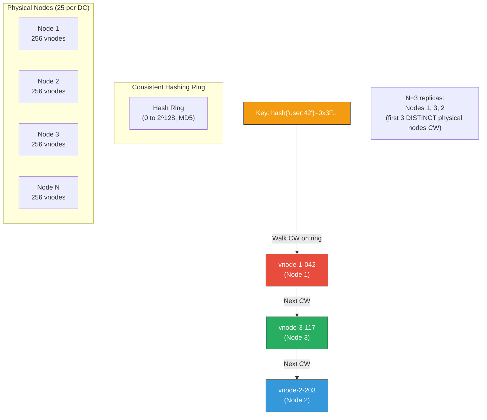
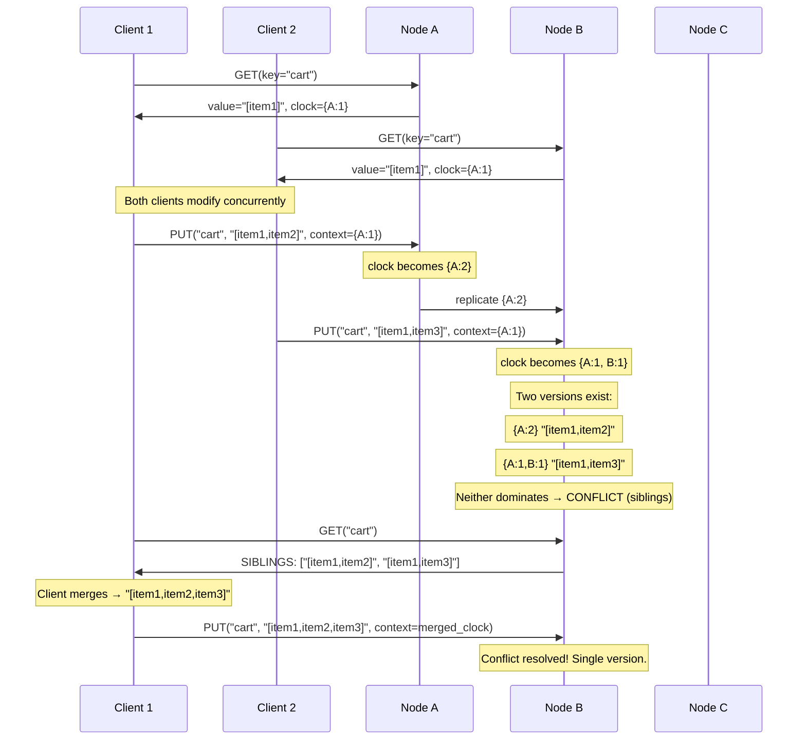
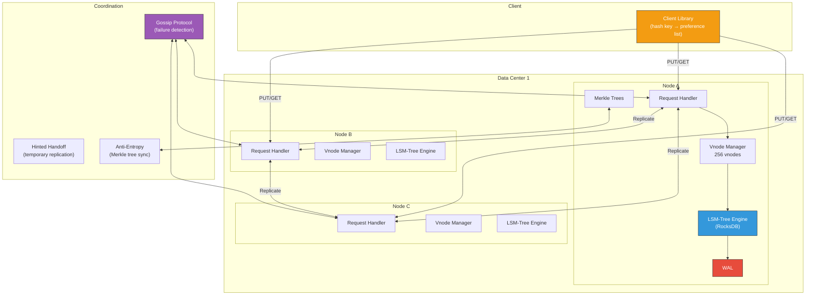

# 9. Capstone: Design a Global Key-Value Store 🔴

> **What you'll learn:**
> - How to synthesize *every concept from this book* into a complete, production-grade system design — the kind expected in Staff/Principal-level interviews and architecture reviews.
> - How to define APIs, calculate capacity, and choose data models for a globally distributed key-value store (similar to Amazon Dynamo / DynamoDB).
> - How to combine consistent hashing, leaderless quorum replication, hinted handoff, Merkle tree anti-entropy, and vector clock conflict resolution into a coherent architecture.
> - How to defend every design decision under adversarial questioning ("What happens if...?").

This chapter is structured as a **system design interview simulation**. We present the problem, walk through the design step-by-step, and at each stage show the trade-offs and failure modes.

---

## The Problem Statement

> **Design a highly available, globally distributed key-value store that supports:**
> - `PUT(key, value, context)` — write a value for a key.
> - `GET(key)` → `(value, context)` — read the latest value for a key.
> - Horizontal scalability to billions of keys across hundreds of nodes.
> - Targeting 99.9th percentile read latency < 10ms and write latency < 20ms.
> - Continued availability during network partitions (AP system per PACELC).
> - Eventual consistency with conflict detection and resolution.
>
> **Non-functional requirements:**
> - Data replicated across 3 datacenters for durability.
> - No single point of failure.
> - Automatic failure detection and recovery.

This is, at its core, the **Amazon Dynamo** problem (DeCandia et al., 2007).

---

## Step 1: API Design and Capacity Estimation

### API

```rust
/// The public API of our distributed key-value store.
trait KvStore {
    /// Write a value. The `context` carries the vector clock from the last GET.
    /// On first write, context is empty (fresh write).
    async fn put(&self, key: &[u8], value: &[u8], context: VectorClock)
        -> Result<PutResponse, KvError>;

    /// Read a value. Returns potentially multiple conflicting values
    /// (siblings) with their vector clocks. The client must resolve conflicts.
    async fn get(&self, key: &[u8])
        -> Result<GetResponse, KvError>;
}

struct PutResponse {
    clock: VectorClock, // Updated vector clock to include with subsequent PUTs
}

struct GetResponse {
    values: Vec<SiblingValue>, // One entry if no conflicts; multiple if concurrent writes
}

struct SiblingValue {
    value: Vec<u8>,
    clock: VectorClock,
}
```

### Capacity Estimation

| Parameter | Assumption |
|---|---|
| Total keys | 10 billion |
| Average key size | 64 bytes |
| Average value size | 1 KB |
| Read:Write ratio | 10:1 |
| Peak read throughput | 1,000,000 reads/sec |
| Peak write throughput | 100,000 writes/sec |
| Replication factor (N) | 3 |
| Storage per node | 2 TB usable |

```
Total data: 10B × (64B + 1KB) ≈ 10 TB (before replication)
With N=3 replication: 30 TB

Nodes needed (storage): 30 TB / 2 TB = 15 nodes (minimum)
Nodes provisioned (with headroom): 20–25 nodes per datacenter × 3 DCs = 60–75 nodes total

Write bandwidth per node: 100K writes/sec × 1KB / 25 nodes ≈ 4K writes/sec/node ≈ 4 MB/s
Read bandwidth per node: 1M reads/sec × 1KB / 75 nodes ≈ 13K reads/sec/node ≈ 13 MB/s
```

---

## Step 2: Data Partitioning with Consistent Hashing

We use a consistent hashing ring with virtual nodes (Chapter 6):



**Key decisions:**

| Decision | Choice | Rationale |
|---|---|---|
| Hash function | MD5 (or murmur3) of the key | Uniform distribution; not cryptographic (no security need here) |
| Virtual nodes per physical node | 256 | Smooths load distribution; allows heterogeneous hardware |
| Replica selection | First N *distinct physical nodes* clockwise on the ring | Prevents replicas from landing on the same physical node |
| Preference list | Ordered list of N nodes responsible for a key | The first node is the "coordinator" for that key |

### Node Join/Leave

When Node X joins:
1. X claims its vnodes on the ring.
2. Neighboring nodes transfer their key ranges that now belong to X's vnodes.
3. Only 1/N of the data moves (consistent hashing property).

When Node X leaves:
1. The next node clockwise inherits X's key ranges.
2. Anti-entropy (Merkle trees) ensures data is fully replicated to the new owner.

---

## Step 3: Replication with Quorum

Every key is replicated to N=3 nodes (the preference list). We use **sloppy quorum** for availability:

```
N = 3  (replicas)
W = 2  (write quorum)
R = 2  (read quorum)
W + R = 4 > N = 3  →  ✅ Guaranteed overlap (strong quorum)
```

### Write Path

```
1. Client hashes the key to find the preference list: [Node A, Node B, Node C].
2. Client (or a coordinator node) sends PUT to all 3 nodes concurrently.
3. Each node:
   a. Appends to its local WAL.
   b. Inserts into the LSM-Tree memtable.
   c. Returns ACK.
4. Coordinator waits for W=2 ACKs.
5. If 2+ ACKs received: return success to client (with updated vector clock).
6. If < 2 ACKs within timeout: return failure (client retries).
```

### Read Path

```
1. Client hashes the key to find the preference list: [Node A, Node B, Node C].
2. Coordinator sends GET to all 3 nodes concurrently.
3. Each node looks up the key in its local store (memtable → SSTables).
4. Coordinator waits for R=2 responses.
5. Coordinator compares vector clocks:
   a. If one dominates: return that value. Trigger read-repair for stale nodes.
   b. If concurrent (conflict): return ALL conflicting values (siblings).
      Client must resolve and write back the merged result.
```

### Sloppy Quorum and Hinted Handoff

If one of the N=3 nodes is down, the coordinator writes to the **next healthy node clockwise** on the ring (a "hint"). This maintains availability:

```
Preference list for key K: [A, B, C]
Node C is down.

Coordinator writes to [A, B, D] (D is the next healthy node after C on the ring).
D stores the data with a hint: "This belongs to C. Forward when C recovers."

When C comes back:
  D sends the hinted data to C.
  D deletes its local copy.
```

**This is a "sloppy quorum" — W=2 out of any 3 healthy nodes, not necessarily the 3 designated replicas.** It favors availability over strict consistency.

---

## Step 4: Conflict Detection with Vector Clocks

When concurrent writes occur (two clients write the same key without seeing each other's writes), we need to detect and surface the conflict:



### Vector Clock Management

**Vector clock pruning:** Over time, vector clocks grow (one entry per node that has ever written a key). To bound their size:
- Limit to the last T entries (e.g., T=10 most recent node entries).
- Drop entries older than a configurable age (e.g., 24 hours).
- Accept that pruning may cause spurious conflicts (false siblings), which are annoying but not incorrect.

---

## Step 5: Anti-Entropy and Failure Recovery

### Merkle Trees for Background Synchronization

Each node maintains a **Merkle tree** per key range (per vnode). The tree's leaves are hashes of individual key-value pairs:

```
                     Root: H(left || right)
                    /                       \
         H(0-50%):abc123            H(50-100%):def456
         /         \                 /           \
   H(0-25%):...  H(25-50%):...  H(50-75%):...  H(75-100%):...
```

**Synchronization protocol:**

```
1. Node A and Node B (both replicas for the same key range) exchange root hashes.
2. If roots match: in sync. Done.
3. If roots differ: recursively exchange subtree hashes.
4. Identify the specific key ranges that differ.
5. Transfer only the differing keys. Resolve conflicts using vector clocks.
```

This minimizes bandwidth—only divergent keys are transferred.

### Failure Detection: Gossip Protocol

Nodes use a **gossip protocol** to detect failures:

```
Every 1 second:
  Pick a random peer.
  Exchange membership lists: {node_id → (heartbeat_counter, timestamp)}.
  If a node's heartbeat hasn't incremented in T seconds (e.g., 10s), mark it "suspected."
  If suspected for 2T seconds (e.g., 20s), mark it "failed."
  Inform the consistent hashing ring to redistribute that node's key ranges.
```

---

## Step 6: Complete Architecture



---

## Design Decision Summary

| Component | Decision | Chapter Reference | Alternative Considered | Why Not |
|---|---|---|---|---|
| Partitioning | Consistent hashing + 256 vnodes | Ch. 6 | Range partitioning | Hot spots on sequential key ranges |
| Replication | Leaderless, N=3, sloppy quorum | Ch. 6 | Single-leader Raft | Need multi-DC availability during partitions (PA/EL) |
| Consistency | W=2, R=2, eventual with vector clocks | Ch. 1, 2 | Linearizable (Raft) | Latency budget (< 10ms reads) requires local responses |
| Conflict detection | Vector clocks per key | Ch. 1 | LWW timestamps | LWW silently drops concurrent writes (data loss) |
| Storage engine | LSM-Tree (RocksDB) per node | Ch. 5 | B-Tree (PostgreSQL) | Write-heavy workload; LSM sequential I/O |
| Failure detection | Gossip protocol (1s interval) | — | Centralized heartbeat | No SPOF, partition-tolerant |
| Anti-entropy | Merkle trees + read repair + hinted handoff | Ch. 6 | Full data sync | Merkle trees minimize transfer bandwidth |
| Rate limiting | Token Bucket per client, gossip sync | Ch. 8 | Centralized Redis counter | Latency budget prohibits round-trip to Redis on every request |
| Conflict resolution | Client-side merge (siblings returned on GET) | Ch. 6 | Server-side LWW | Application knows the correct merge semantics |

---

## Failure Scenario Walkthrough

### Scenario: Node C Dies During a Write

```
1. Client sends PUT(key=K, value=V) to coordinator (Node A).
2. A forwards to preference list [A, B, C].
3. A writes locally → ACK.
4. B writes locally → ACK.
5. C is unreachable (timeout after 500ms).
6. Coordinator has W=2 ACKs (A + B) → returns success to client.
7. A writes a hint for C to the next available node (D): "Forward V to C for key K."
8. When C recovers, D's hinted handoff delivers the data.
9. If C stays down beyond a threshold, Merkle tree anti-entropy ensures
   the new replica (D or another reassigned node) has all of C's data.
```

### Scenario: Network Partition Between DCs

```
DC-West: [A₁, A₂, A₃, ...]     DC-East: [B₁, B₂, B₃, ...]

Partition: DC-West cannot reach DC-East.

Client in DC-West: PUT(key=K1, value=V1) → succeeds (local quorum within DC-West).
Client in DC-East: PUT(key=K1, value=V2) → succeeds (local quorum within DC-East).

When partition heals:
  Merkle tree anti-entropy detects K1 has diverged.
  Vector clocks: V_west={A₁:5}, V_east={B₁:3} → CONCURRENT.
  Next GET returns both as siblings.
  Client merges and writes back the resolved value.
```

---

<details>
<summary><strong>🏋️ Exercise: Extend the Design</strong> (click to expand)</summary>

### Challenge

Your global KV store is wildly successful. Product has three new requirements:

1. **Range queries:** Retrieve all keys in a range `[start_key, end_key)`. The current consistent hashing scheme scatters keys across the ring. How do you support efficient range queries?

2. **Time-to-Live (TTL):** Keys should automatically expire after a configurable duration. How do you implement TTL without periodic scans of all data?

3. **Stronger consistency for some keys:** Some keys (e.g., user account balances) need linearizable reads. The rest can remain eventually consistent. How do you support per-key consistency levels?

<details>
<summary>🔑 Solution</summary>

**1. Range Queries: Hybrid Partitioning**

Consistent hashing is inherently hostile to range queries because adjacent keys are scattered. Options:

- **Option A: Secondary index with range partitioning.** Maintain a separate, range-partitioned index alongside the primary hash-partitioned data. Range queries go to the index, which returns the key list, and individual key lookups go to the primary store. Adds complexity and write overhead (update both index and data).

- **Option B: Order-preserving hash function.** Use an order-preserving hash so `hash(key_a) < hash(key_b)` iff `key_a < key_b`. But this destroys load balancing — sequential keys land on the same node, creating hot spots.

- **Option C (recommended): Table-level partitioning strategy.** Allow users to create "tables" with a declared partitioning strategy — either hash-partitioned (default) or range-partitioned. Range-partitioned tables use a B-Tree-like splitting strategy (like CockroachDB or TiKV). Each range is replicated using Raft consensus. This is more complex but provides true distributed range scans.

**2. TTL: Per-SSTable Expiry + Tombstones**

- On PUT with TTL, store the expiration timestamp alongside the value.
- During compaction (Chapter 5), the LSM-Tree engine drops entries whose TTL has expired. No separate garbage collection scan is needed.
- For memtable entries, a background timer marks expired keys as tombstones.
- Bloom filters and SSTable metadata include min/max expiry timestamps, allowing entire SSTables to be dropped without reading their contents.
- The FIFO compaction strategy is ideal for TTL workloads: entire SSTables are dropped when all entries have expired.

**3. Per-Key Consistency: Multi-Protocol Approach**

- **Default (eventually consistent):** Leaderless quorum as designed (W=2, R=2, sloppy quorum). Fast, available, AP.

- **Linearizable (opt-in per key or key prefix):** For keys requiring linearizability:
  - Route reads and writes through a **Raft consensus group** instead of leaderless quorum.
  - The key's preference list elects a Raft leader. Reads go through the leader (or use `ReadIndex` for stale-free follower reads).
  - This converts those keys from AP/EL to CP/EC. Writes are slower (Raft log replication), reads are slower (leader confirmation), but correctness is guaranteed.
  - The consistency level is specified by the client: `PUT(key, value, context, consistency=Linearizable)`.

- **Implementation:** The coordinator inspects the requested consistency level and routes to the appropriate protocol path. The storage layer is shared — both leaderless-quorum keys and Raft-consensus keys use the same LSM-Tree engine.

| Requirement | Solution | Trade-off |
|---|---|---|
| Range queries | Table-level partitioning strategy: hash (default) or range (opt-in with Raft) | Range tables require Raft, adding complexity |
| TTL | SSTable-level expiry during compaction + tombstones | Slight delay before expired data is physically reclaimed |
| Per-key consistency | Dual-protocol: leaderless quorum (default) + Raft consensus (opt-in) | Raft keys have higher latency and lower availability during partitions |

</details>
</details>

---

> **Key Takeaways**
>
> 1. **Start with requirements and capacity estimation.** The numbers drive every architectural decision — number of nodes, replication factor, storage engine choice.
> 2. **Consistent hashing + virtual nodes** provides uniform data distribution with minimal rebalancing on topology changes.
> 3. **Leaderless quorum (W+R>N)** gives the best availability/latency trade-off for eventually consistent workloads. Use sloppy quorum for partition tolerance.
> 4. **Vector clocks detect concurrent writes** that LWW would silently discard. Return siblings to the client and let the application merge correctly.
> 5. **Three anti-entropy mechanisms** work together: read repair (on read), hinted handoff (on write failure), and Merkle trees (background sync).
> 6. **Every design decision is a trade-off.** The interviewer doesn't want The Perfect System — they want to see you understand and articulate the trade-offs.
> 7. **Be prepared to extend.** Real systems evolve. Range query support, TTLs, and per-key consistency are common follow-up requirements.

---

> **See also:**
> - [Chapter 1: Time, Clocks, and Ordering](ch01-time-clocks-and-ordering.md) — vector clocks for conflict detection.
> - [Chapter 2: CAP Theorem and PACELC](ch02-cap-theorem-and-pacelc.md) — this system is PA/EL by design.
> - [Chapter 5: Storage Engines](ch05-storage-engines.md) — LSM-Tree internals powering each node.
> - [Chapter 6: Replication and Partitioning](ch06-replication-and-partitioning.md) — consistent hashing, quorum, hinted handoff.
> - [Chapter 8: Rate Limiting, Load Balancing, and Backpressure](ch08-rate-limiting-load-balancing-backpressure.md) — protecting the system under load.
> - [Appendix A: Reference Card](appendix-a-reference-card.md) — quick-reference for all concepts used in this capstone.
