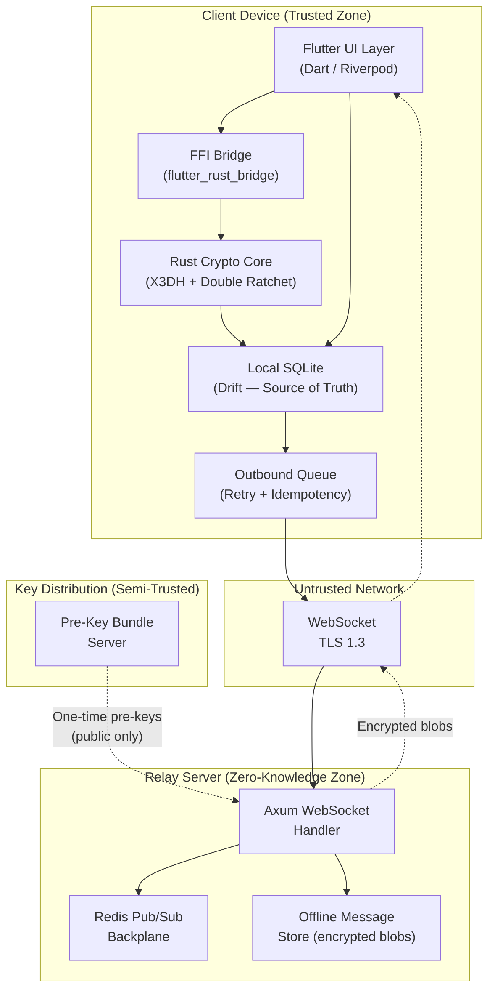

# System Design: The E2E Encrypted Omni-Platform Messenger

## Speaker Intro

This handbook is written from the perspective of a **Principal Full-Stack Architect** who has designed, shipped, and operated end-to-end encrypted messaging systems across mobile, desktop, and web platforms at scale. The content draws from first-hand experience bridging **Rust cryptographic cores** with **Flutter presentation layers**, operating stateless relay infrastructure, and navigating the relentless adversarial landscape of real-time encrypted communications.

## Who This Is For

- **Mobile / Flutter engineers** who want to understand what happens *beneath* the chat bubble — key exchange, ratcheting, and local-first persistence.
- **Rust systems programmers** looking for a concrete cross-platform project that compiles to iOS, Android, Desktop, and Web from a single codebase.
- **Security-conscious architects** evaluating whether the Signal Protocol can be implemented in a memory-safe language without sacrificing performance or auditability.
- **Backend engineers** who need to build a relay server that handles millions of WebSocket connections while knowing *nothing* about the plaintext content it routes.
- **Anyone who has used Signal, WhatsApp, or iMessage** and wondered how forward secrecy, offline delivery, and cross-device sync actually work under the hood.

## Prerequisites

| Concept | Where to Learn |
|---|---|
| Intermediate Rust (ownership, traits, `async`) | [Async Rust](../async-book/src/SUMMARY.md) |
| Flutter fundamentals (widgets, state management) | [The Omni-Platform Flutter Architect](../flutter-omni-book/src/SUMMARY.md) |
| Basic cryptography (symmetric vs. asymmetric, HMAC) | Any introductory cryptography course |
| Networking fundamentals (TCP, WebSockets) | [Tokio Internals](../tokio-internals-book/src/SUMMARY.md) |
| SQLite basics | [The SQL Rosetta Stone](../sql-rosetta-book/src/SUMMARY.md) |

## How to Use This Book

| Emoji | Meaning |
|---|---|
| 🟢 | **Architecture** — foundational protocol design and data structures |
| 🟡 | **Implementation** — production-grade cross-platform code with FFI integration |
| 🔴 | **Advanced** — distributed relay infrastructure, cryptographic edge cases, delivery guarantees |

Each chapter solves **one specific layer of the messenger stack** in sequence. Read them in order — later chapters assume the crypto core, FFI bridge, and local database from earlier chapters exist.

## The Problem We Are Solving

> Design a **secure, local-first, cross-platform encrypted messenger** (comparable to Signal) that provides **end-to-end encryption with forward secrecy**, offline-first operation, and delivery guarantees across iOS, Android, Desktop, and Web — all from a single codebase.

The system we will build has these non-negotiable requirements:

| Requirement | Target |
|---|---|
| Encryption | E2E with X3DH key agreement + Double Ratchet (forward secrecy) |
| Platforms | iOS, Android, macOS, Windows, Linux, Web — single Dart/Rust codebase |
| Offline-first | Full read/write capability with no network; sync when reconnected |
| Server trust model | Zero-knowledge relay — server cannot decrypt any message content |
| Delivery guarantee | Exactly-once semantics with idempotency keys |
| Latency (online→online) | < 200 ms end-to-end for message delivery |
| Key rotation | New symmetric key every single message (Double Ratchet) |

## Pacing Guide

| Chapter | Topic | Time | Checkpoint |
|---|---|---|---|
| Ch 0 | Introduction & Architecture Overview | 30 min | Understand the full system canvas |
| Ch 1 | The Signal Protocol & Rust Core | 8–10 hours | Working X3DH + Double Ratchet library with tests |
| Ch 2 | The FFI Boundary (Flutter + Rust) | 5–7 hours | Dart calling Rust crypto on all target platforms |
| Ch 3 | Local-First Flutter Architecture | 6–8 hours | Reactive Drift-backed chat UI with Riverpod |
| Ch 4 | Rust WebSocket Relay Server | 6–8 hours | Axum relay with Redis Pub/Sub backplane |
| Ch 5 | Offline Queues & Delivery Guarantees | 5–7 hours | Retry queue with exactly-once delivery proven |

**Total: ~31–40 hours** of focused study.

## Table of Contents

### Part I: Cryptographic Foundation
- **Chapter 1 — The Signal Protocol & The Rust Core 🟢** — Architecting the crypto engine. Implementing X3DH (Extended Triple Diffie-Hellman) and the Double Ratchet algorithm in a pure Rust library (`no_std` compatible). Why Rust's type system makes cryptographic state machines safer to implement than C.

### Part II: Cross-Platform Bridge
- **Chapter 2 — The FFI Boundary (Flutter + Rust) 🟡** — Compiling the Rust core into native libraries (`.so`, `.dylib`, `.dll`). Using `flutter_rust_bridge` to seamlessly pass encrypted byte arrays and keys between Dart and Rust without massive serialization overhead.
- **Chapter 3 — The Local-First Flutter Architecture 🟡** — Designing the offline experience. Using local SQLite (Drift) as the single source of truth. Using Riverpod to reactively update the UI when the local database changes, completely decoupling the UI from the network.

### Part III: Server & Reliability
- **Chapter 4 — The Rust WebSocket Relay Server 🔴** — Building a hyper-scalable, stateless WebSocket relay using `axum` and `tokio`. How the server routes encrypted blobs to connected clients using a Redis Pub/Sub backplane, knowing absolutely nothing about the message contents.
- **Chapter 5 — Offline Queues and Message Delivery Guarantees 🔴** — Handling mobile network drops. Implementing a robust retry queue in Flutter that guarantees message ordering and exactly-once delivery semantics using idempotency keys.

## Architecture Overview

The system divides cleanly into **four trust zones**:

### Trust Model Summary

| Zone | Sees Plaintext? | Stores Keys? | Can Forge Messages? |
|---|---|---|---|
| Client Device | ✅ Yes | ✅ Private keys | ❌ No (signed) |
| Network (TLS) | ❌ No (double-encrypted) | ❌ No | ❌ No |
| Relay Server | ❌ No (encrypted blobs) | ❌ Only public pre-keys | ❌ No |
| Key Server | ❌ No | ❌ Only public pre-keys | ❌ No |

**The golden rule:** The relay server is a *dumb pipe*. It stores and forwards opaque byte arrays. Even a fully compromised server reveals **zero** plaintext.

## Companion Guides

| Book | Relevance |
|---|---|
| [Async Rust](../async-book/src/SUMMARY.md) | Tokio runtime fundamentals for the relay server |
| [The Omni-Platform Flutter Architect](../flutter-omni-book/src/SUMMARY.md) | Flutter widget tree, Isolates, platform channels |
| [Unsafe Rust & FFI](../unsafe-ffi-book/src/SUMMARY.md) | Raw pointer handling at the Dart↔Rust boundary |
| [Rust Microservices](../microservices-book/src/SUMMARY.md) | Axum, Tower middleware, and production server patterns |
| [Tokio Internals](../tokio-internals-book/src/SUMMARY.md) | Work-stealing runtime driving the WebSocket relay |
| [Enterprise Rust](../enterprise-rust-book/src/SUMMARY.md) | OpenTelemetry, supply chain security, SBOM |
