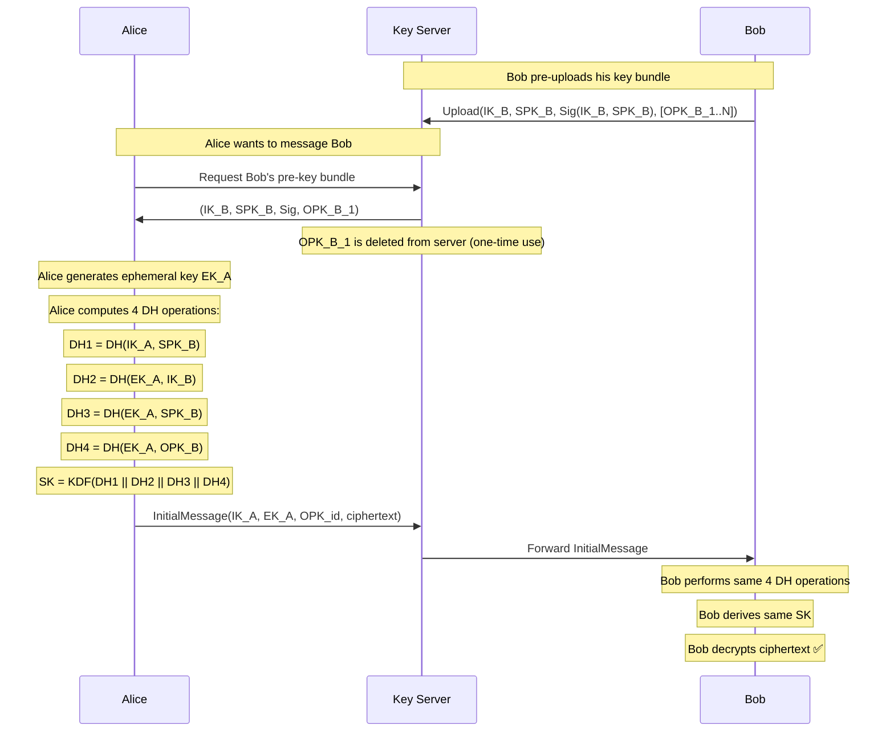
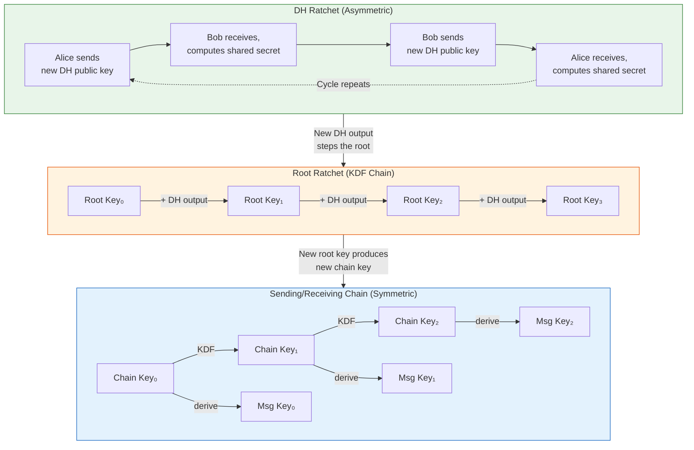
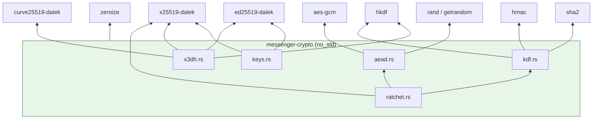

# 1. The Signal Protocol & The Rust Core 🟢

> **The Problem:** Most messaging apps encrypt data in transit (TLS) but store it in plaintext on the server. A compromised server — or a rogue employee, or a government subpoena — exposes every conversation in history. We need an encryption scheme where (a) the server *never* sees plaintext, (b) compromising a single key does not reveal past messages (*forward secrecy*), and (c) compromising a single key does not reveal future messages (*future secrecy / break-in recovery*). The Signal Protocol — used by Signal, WhatsApp, and Google Messages — solves all three. We will implement it in Rust.

---

## Why the Signal Protocol?

The Signal Protocol is the gold standard for asynchronous encrypted messaging. It combines two sub-protocols:

| Sub-Protocol | Purpose | When It Runs |
|---|---|---|
| **X3DH** (Extended Triple Diffie-Hellman) | Initial key agreement between two parties who may never be online simultaneously | Once, at conversation start |
| **Double Ratchet** | Ongoing key derivation that produces a new symmetric key for every single message | Every message send/receive |

### Comparison with Alternatives

| Property | TLS Only | PGP / GPG | Signal Protocol |
|---|---|---|---|
| Server sees plaintext | ✅ Yes | ❌ No | ❌ No |
| Forward secrecy | ❌ No | ❌ No | ✅ Yes (per-message) |
| Future secrecy | ❌ No | ❌ No | ✅ Yes (DH ratchet) |
| Asynchronous setup | N/A | ✅ Yes | ✅ Yes (pre-key bundles) |
| Deniability | ❌ No | ❌ No (signatures) | ✅ Yes (no long-term signatures on messages) |
| Key rotation frequency | Per-session | Manual | **Every message** |

---

## X3DH: The Initial Key Exchange

X3DH allows Alice to establish a shared secret with Bob even when Bob is offline. The key insight: Bob pre-uploads a bundle of ephemeral public keys to the server so anyone can initiate a session without Bob being online.

### Key Types

| Key | Owner | Lifetime | Purpose |
|---|---|---|---|
| **IK** (Identity Key) | Both | Permanent | Long-term identity proof |
| **SPK** (Signed Pre-Key) | Bob | Weeks–Months | Medium-term DH key, signed by IK |
| **OPK** (One-Time Pre-Key) | Bob | Single use | Consumed per session for forward secrecy |
| **EK** (Ephemeral Key) | Alice | Single use | Generated fresh for each new session |

### The X3DH Handshake



### Why Four DH Operations?

Each DH operation provides a different security property:

| DH Operation | Inputs | Property Provided |
|---|---|---|
| DH1: `DH(IK_A, SPK_B)` | Both long-term-ish keys | Mutual authentication |
| DH2: `DH(EK_A, IK_B)` | Alice ephemeral × Bob identity | Bob authenticates Alice's session |
| DH3: `DH(EK_A, SPK_B)` | Both ephemeral-ish keys | Forward secrecy (even without OPK) |
| DH4: `DH(EK_A, OPK_B)` | Both fully ephemeral keys | One-time forward secrecy guarantee |

If the server runs out of one-time pre-keys, DH4 is simply omitted. The protocol degrades gracefully — you lose *one layer* of forward secrecy but the session is still secure.

---

## Implementing X3DH in Rust

### Crate Structure

```
messenger-crypto/
├── Cargo.toml
├── src/
│   ├── lib.rs          # Public API surface
│   ├── x3dh.rs         # X3DH key agreement
│   ├── ratchet.rs      # Double Ratchet state machine
│   ├── keys.rs         # Key types and serialization
│   ├── kdf.rs          # HKDF-based key derivation
│   ├── aead.rs         # AES-256-GCM encryption/decryption
│   └── error.rs        # Typed error hierarchy
```

### Key Type Definitions

```rust,ignore
//! keys.rs — Strongly-typed key wrappers using Curve25519

use x25519_dalek::{PublicKey, StaticSecret, EphemeralSecret};
use ed25519_dalek::{SigningKey, VerifyingKey, Signature};
use zeroize::Zeroize;

/// Identity key pair — long-lived, used for authentication.
/// The signing key (Ed25519) proves identity.
/// The agreement key (X25519) participates in DH exchanges.
pub struct IdentityKeyPair {
    pub signing_key: SigningKey,           // Ed25519 — for signing SPKs
    pub agreement_key: StaticSecret,      // X25519 — for DH operations
}

/// Signed pre-key — medium-lived, rotated every few weeks.
pub struct SignedPreKey {
    pub key_id: u32,
    pub key_pair: StaticSecret,
    pub public_key: PublicKey,
    pub signature: Signature, // Signed by identity key
}

/// One-time pre-key — single use, deleted after consumption.
pub struct OneTimePreKey {
    pub key_id: u32,
    pub key_pair: StaticSecret,
    pub public_key: PublicKey,
}

/// Ephemeral key — generated fresh for each new session by the initiator.
pub struct EphemeralKeyPair {
    secret: EphemeralSecret,
    pub public_key: PublicKey,
}

/// Pre-key bundle that Bob uploads to the server.
/// Contains ONLY public keys — private keys never leave the device.
pub struct PreKeyBundle {
    pub identity_key: VerifyingKey,          // Bob's public identity
    pub signed_pre_key: PublicKey,           // Bob's signed pre-key (public)
    pub signed_pre_key_id: u32,
    pub signed_pre_key_signature: Signature, // Proof it's Bob's
    pub one_time_pre_key: Option<PublicKey>,  // May be exhausted
    pub one_time_pre_key_id: Option<u32>,
}

// ✅ Critical: Zeroize secrets on drop to prevent memory leaks of key material
impl Drop for IdentityKeyPair {
    fn drop(&mut self) {
        self.signing_key.as_mut_bytes().zeroize();
    }
}
```

### Naive Key Agreement (INSECURE)

```rust,ignore
use x25519_dalek::{PublicKey, StaticSecret};

fn naive_key_exchange(
    my_secret: &StaticSecret,
    their_public: &PublicKey,
) -> [u8; 32] {
    // 💥 HAZARD: Using raw DH output directly as encryption key.
    // - No domain separation (same key for different protocols)
    // - No key stretching
    // - DH output may have biased bits on certain curves
    let shared = my_secret.diffie_hellman(their_public);
    *shared.as_bytes()
}
```

### Production X3DH Implementation

```rust,ignore
//! x3dh.rs — Extended Triple Diffie-Hellman Key Agreement

use hkdf::Hkdf;
use sha2::Sha256;
use x25519_dalek::{PublicKey, StaticSecret, EphemeralSecret};
use ed25519_dalek::VerifyingKey;
use zeroize::Zeroize;
use crate::keys::PreKeyBundle;
use crate::error::ProtocolError;

/// Salt for HKDF — 32 bytes of 0xFF as specified by X3DH.
const HKDF_SALT: [u8; 32] = [0xFF; 32];

/// Info string for domain separation.
const HKDF_INFO: &[u8] = b"OmniMessenger_X3DH_SharedSecret";

/// The result of a successful X3DH key agreement.
pub struct X3DHResult {
    /// The shared secret — input to the Double Ratchet.
    pub shared_secret: [u8; 32],
    /// Alice's ephemeral public key — sent to Bob in the initial message.
    pub ephemeral_public: PublicKey,
    /// The ID of the one-time pre-key consumed (if any).
    pub one_time_pre_key_id: Option<u32>,
}

impl Drop for X3DHResult {
    fn drop(&mut self) {
        self.shared_secret.zeroize();
    }
}

/// Alice initiates a session with Bob using his pre-key bundle.
///
/// # Security invariants
/// - Verifies Bob's signed pre-key signature before use.
/// - Concatenates 4 (or 3) DH outputs before KDF.
/// - Zeroizes intermediate DH outputs immediately.
pub fn initiate_x3dh(
    alice_identity: &StaticSecret,
    alice_identity_pub: &PublicKey,
    bob_bundle: &PreKeyBundle,
) -> Result<X3DHResult, ProtocolError> {
    // ✅ Step 1: Verify Bob's signed pre-key is authentic
    let spk_bytes = bob_bundle.signed_pre_key.as_bytes();
    bob_bundle
        .identity_key
        .verify_strict(spk_bytes, &bob_bundle.signed_pre_key_signature)
        .map_err(|_| ProtocolError::InvalidSignature)?;

    // ✅ Step 2: Generate Alice's ephemeral key pair
    let ephemeral_secret = EphemeralSecret::random();
    let ephemeral_public = PublicKey::from(&ephemeral_secret);

    // ✅ Step 3: Perform the DH operations
    // DH1: IK_A × SPK_B (mutual authentication)
    let dh1 = alice_identity.diffie_hellman(&bob_bundle.signed_pre_key);

    // DH2: EK_A × IK_B (Alice's session → Bob's identity)
    // Note: We need Bob's identity as X25519, converted from Ed25519
    let bob_x25519_identity = ed25519_to_x25519_public(&bob_bundle.identity_key);
    let dh2 = ephemeral_secret.diffie_hellman(&bob_x25519_identity);

    // DH3: EK_A × SPK_B (ephemeral × ephemeral-ish)
    let dh3 = ephemeral_secret.diffie_hellman(&bob_bundle.signed_pre_key);

    // ✅ Step 4: Concatenate DH outputs (with optional DH4)
    let mut dh_concat = Vec::with_capacity(128);
    dh_concat.extend_from_slice(dh1.as_bytes());
    dh_concat.extend_from_slice(dh2.as_bytes());
    dh_concat.extend_from_slice(dh3.as_bytes());

    let one_time_pre_key_id = if let Some(opk) = &bob_bundle.one_time_pre_key {
        // DH4: EK_A × OPK_B (full ephemeral × ephemeral)
        let dh4 = ephemeral_secret.diffie_hellman(opk);
        dh_concat.extend_from_slice(dh4.as_bytes());
        bob_bundle.one_time_pre_key_id
    } else {
        None
    };

    // ✅ Step 5: Derive shared secret via HKDF
    let hkdf = Hkdf::<Sha256>::new(Some(&HKDF_SALT), &dh_concat);
    let mut shared_secret = [0u8; 32];
    hkdf.expand(HKDF_INFO, &mut shared_secret)
        .map_err(|_| ProtocolError::KdfFailure)?;

    // ✅ Step 6: Zeroize intermediate material
    dh_concat.zeroize();

    Ok(X3DHResult {
        shared_secret,
        ephemeral_public,
        one_time_pre_key_id,
    })
}

/// Convert an Ed25519 VerifyingKey to an X25519 PublicKey.
/// This is a standard birational map between the two curve forms.
fn ed25519_to_x25519_public(ed_key: &VerifyingKey) -> PublicKey {
    use curve25519_dalek::edwards::CompressedEdwardsY;
    let compressed = CompressedEdwardsY::from_slice(ed_key.as_bytes())
        .expect("Valid Ed25519 public key");
    let edwards = compressed.decompress().expect("Valid point");
    let montgomery = edwards.to_montgomery();
    PublicKey::from(*montgomery.as_bytes())
}
```

---

## The Double Ratchet Algorithm

X3DH gives us a *single* shared secret to start a conversation. But using the same key for every message is a disaster — compromise that key and every message (past and future) is exposed. The Double Ratchet ensures that **every message is encrypted with a unique key** and that keys constantly evolve forward.

### The Three Ratchets

The algorithm combines three interlocking ratchets:



### How the Ratchets Interlock

1. **DH Ratchet** (green): Each time a party sends a message, they *may* include a fresh DH public key. When the other party replies with *their* new DH key, a new DH shared secret is computed. This is what provides **future secrecy** — even if the current state is compromised, the next DH exchange generates an entirely new root of trust.

2. **Root Ratchet** (orange): Every time the DH ratchet steps, its output is fed into a KDF along with the current root key. This produces a new root key and a new **chain key** for the sending/receiving direction.

3. **Symmetric Chain Ratchet** (blue): Between DH ratchet steps, each message advances the chain: `ChainKey_n → ChainKey_{n+1}` via KDF, and derives a **message key** for encrypting that specific message. Message keys are deleted after use — this is what provides **forward secrecy**.

### Key Lifecycle

| Key | Created When | Deleted When | Compromise Impact |
|---|---|---|---|
| Root Key | DH ratchet step | Replaced by next step | Reveals current chain keys only |
| Chain Key | Root ratchet derives it | After deriving next chain key | Reveals remaining keys in this chain |
| Message Key | Chain ratchet derives it | **Immediately after encrypt/decrypt** | Reveals only this ONE message |
| DH Ratchet Key | Embedded in each message | After next DH step received | Triggers new root/chain derivation |

---

## Implementing the Double Ratchet in Rust

### State Machine

```rust,ignore
//! ratchet.rs — The Double Ratchet state machine

use x25519_dalek::{PublicKey, StaticSecret, EphemeralSecret};
use aes_gcm::{Aes256Gcm, Key, Nonce};
use aes_gcm::aead::{Aead, KeyInit};
use hkdf::Hkdf;
use sha2::Sha256;
use hmac::{Hmac, Mac};
use zeroize::Zeroize;
use std::collections::HashMap;

type HmacSha256 = Hmac<Sha256>;

/// Maximum number of skipped message keys we'll store.
/// Prevents memory exhaustion from a malicious sender claiming huge gaps.
const MAX_SKIP: usize = 1000;

/// The complete Double Ratchet session state for one peer.
pub struct RatchetSession {
    // DH ratchet state
    dh_self: StaticSecret,               // Our current DH ratchet key pair
    dh_self_pub: PublicKey,
    dh_remote: Option<PublicKey>,         // Their current DH public key

    // Root chain
    root_key: [u8; 32],

    // Sending chain
    send_chain_key: Option<[u8; 32]>,
    send_message_number: u32,

    // Receiving chain
    recv_chain_key: Option<[u8; 32]>,
    recv_message_number: u32,

    // Previous sending chain length (for header)
    previous_send_count: u32,

    // Skipped message keys: (ratchet_pub, msg_number) → message_key
    // Handles out-of-order delivery
    skipped_keys: HashMap<(Vec<u8>, u32), [u8; 32]>,
}

/// Header sent with each encrypted message.
#[derive(Clone, Debug)]
pub struct MessageHeader {
    pub dh_public: PublicKey,    // Sender's current DH ratchet public key
    pub previous_count: u32,     // Number of messages in the PREVIOUS sending chain
    pub message_number: u32,     // Index within the CURRENT sending chain
}

/// An encrypted message ready for transport.
pub struct EncryptedMessage {
    pub header: MessageHeader,
    pub ciphertext: Vec<u8>,     // AES-256-GCM ciphertext + tag
    pub nonce: [u8; 12],         // Unique per message
}

impl RatchetSession {
    /// Initialize as the session initiator (Alice) after X3DH.
    pub fn init_alice(
        shared_secret: [u8; 32],
        bob_signed_pre_key: PublicKey,
    ) -> Self {
        let dh_self = StaticSecret::random();
        let dh_self_pub = PublicKey::from(&dh_self);

        // Perform initial DH with Bob's SPK and derive first sending chain
        let dh_output = dh_self.diffie_hellman(&bob_signed_pre_key);
        let (root_key, send_chain_key) = kdf_root(&shared_secret, dh_output.as_bytes());

        RatchetSession {
            dh_self,
            dh_self_pub,
            dh_remote: Some(bob_signed_pre_key),
            root_key,
            send_chain_key: Some(send_chain_key),
            send_message_number: 0,
            recv_chain_key: None,
            recv_message_number: 0,
            previous_send_count: 0,
            skipped_keys: HashMap::new(),
        }
    }

    /// Initialize as the session responder (Bob) after X3DH.
    pub fn init_bob(shared_secret: [u8; 32], signed_pre_key: StaticSecret) -> Self {
        let dh_self_pub = PublicKey::from(&signed_pre_key);
        RatchetSession {
            dh_self: signed_pre_key,
            dh_self_pub,
            dh_remote: None,
            root_key: shared_secret,
            send_chain_key: None,
            send_message_number: 0,
            recv_chain_key: None,
            recv_message_number: 0,
            previous_send_count: 0,
            skipped_keys: HashMap::new(),
        }
    }

    /// Encrypt a plaintext message, advancing the sending chain.
    pub fn encrypt(&mut self, plaintext: &[u8]) -> EncryptedMessage {
        // ✅ Derive message key from sending chain
        let chain_key = self.send_chain_key.as_ref()
            .expect("Sending chain must be initialized");
        let (new_chain_key, message_key) = kdf_chain(chain_key);
        self.send_chain_key = Some(new_chain_key);

        let header = MessageHeader {
            dh_public: self.dh_self_pub,
            previous_count: self.previous_send_count,
            message_number: self.send_message_number,
        };
        self.send_message_number += 1;

        // ✅ Encrypt with AES-256-GCM using derived message key
        let (ciphertext, nonce) = aead_encrypt(&message_key, plaintext, &header);

        EncryptedMessage { header, ciphertext, nonce }
    }

    /// Decrypt a received message, advancing or stepping the receiving chain.
    pub fn decrypt(&mut self, msg: &EncryptedMessage) -> Result<Vec<u8>, ProtocolError> {
        // ✅ Check if this is a skipped message we already cached a key for
        let key_lookup = (msg.header.dh_public.as_bytes().to_vec(), msg.header.message_number);
        if let Some(mk) = self.skipped_keys.remove(&key_lookup) {
            return aead_decrypt(&mk, &msg.ciphertext, &msg.nonce, &msg.header);
        }

        // ✅ Check if we need to step the DH ratchet
        let need_dh_step = self.dh_remote.as_ref()
            .map(|r| r.as_bytes() != msg.header.dh_public.as_bytes())
            .unwrap_or(true);

        if need_dh_step {
            // Skip any remaining messages in the old receiving chain
            if let Some(ref ck) = self.recv_chain_key {
                self.skip_message_keys(ck.clone(), self.recv_message_number, msg.header.previous_count)?;
            }

            // ✅ DH Ratchet step: derive new receiving chain
            self.dh_remote = Some(msg.header.dh_public);
            let dh_output = self.dh_self.diffie_hellman(&msg.header.dh_public);
            let (new_root, recv_chain) = kdf_root(&self.root_key, dh_output.as_bytes());
            self.root_key = new_root;
            self.recv_chain_key = Some(recv_chain);
            self.recv_message_number = 0;

            // ✅ DH Ratchet step: derive new sending chain
            self.previous_send_count = self.send_message_number;
            self.send_message_number = 0;
            let new_dh = StaticSecret::random();
            self.dh_self_pub = PublicKey::from(&new_dh);
            let dh_output2 = new_dh.diffie_hellman(&msg.header.dh_public);
            self.dh_self = new_dh;
            let (new_root2, send_chain) = kdf_root(&self.root_key, dh_output2.as_bytes());
            self.root_key = new_root2;
            self.send_chain_key = Some(send_chain);
        }

        // ✅ Skip message keys if there's a gap (out-of-order delivery)
        let ck = self.recv_chain_key.as_ref().unwrap().clone();
        self.skip_message_keys(ck, self.recv_message_number, msg.header.message_number)?;

        // ✅ Derive the message key for this specific message
        let chain_key = self.recv_chain_key.as_ref().unwrap();
        let (new_chain_key, message_key) = kdf_chain(chain_key);
        self.recv_chain_key = Some(new_chain_key);
        self.recv_message_number = msg.header.message_number + 1;

        aead_decrypt(&message_key, &msg.ciphertext, &msg.nonce, &msg.header)
    }

    /// Cache message keys for skipped messages (out-of-order handling).
    fn skip_message_keys(
        &mut self,
        mut chain_key: [u8; 32],
        start: u32,
        until: u32,
    ) -> Result<(), ProtocolError> {
        let skip_count = (until - start) as usize;
        if skip_count > MAX_SKIP {
            return Err(ProtocolError::TooManySkippedMessages);
        }

        let dh_pub = self.dh_remote.as_ref().unwrap().as_bytes().to_vec();
        for i in start..until {
            let (new_ck, mk) = kdf_chain(&chain_key);
            self.skipped_keys.insert((dh_pub.clone(), i), mk);
            chain_key = new_ck;
        }
        self.recv_chain_key = Some(chain_key);
        Ok(())
    }
}
```

### KDF Functions

```rust,ignore
//! kdf.rs — HKDF-based key derivation for root and chain ratchets

use hkdf::Hkdf;
use hmac::{Hmac, Mac};
use sha2::Sha256;
use zeroize::Zeroize;

type HmacSha256 = Hmac<Sha256>;

/// Root KDF: Takes current root key + DH output → (new_root_key, chain_key).
/// This is the "root ratchet step."
pub fn kdf_root(root_key: &[u8; 32], dh_output: &[u8]) -> ([u8; 32], [u8; 32]) {
    let hkdf = Hkdf::<Sha256>::new(Some(root_key), dh_output);
    let mut output = [0u8; 64];
    hkdf.expand(b"OmniMessenger_DoubleRatchet_Root", &mut output)
        .expect("64 bytes is valid HKDF-SHA256 output length");
    let mut new_root = [0u8; 32];
    let mut chain_key = [0u8; 32];
    new_root.copy_from_slice(&output[..32]);
    chain_key.copy_from_slice(&output[32..]);
    output.zeroize();
    (new_root, chain_key)
}

/// Chain KDF: Takes current chain key → (new_chain_key, message_key).
/// This is the "symmetric ratchet step."
///
/// We use HMAC with different constants to derive the two outputs:
/// - Chain key = HMAC(ck, 0x02) — feeds the next chain step
/// - Message key = HMAC(ck, 0x01) — used for AES-256-GCM encryption
pub fn kdf_chain(chain_key: &[u8; 32]) -> ([u8; 32], [u8; 32]) {
    // Derive message key
    let mut mac = HmacSha256::new_from_slice(chain_key)
        .expect("HMAC accepts any key size");
    mac.update(&[0x01]);
    let message_key: [u8; 32] = mac.finalize().into_bytes().into();

    // Derive next chain key
    let mut mac = HmacSha256::new_from_slice(chain_key)
        .expect("HMAC accepts any key size");
    mac.update(&[0x02]);
    let new_chain_key: [u8; 32] = mac.finalize().into_bytes().into();

    (new_chain_key, message_key)
}
```

### AEAD Encryption

```rust,ignore
//! aead.rs — AES-256-GCM authenticated encryption with associated data

use aes_gcm::{Aes256Gcm, Key, Nonce};
use aes_gcm::aead::{Aead, KeyInit, Payload};
use rand::RngCore;
use crate::ratchet::MessageHeader;
use crate::error::ProtocolError;

/// Encrypt plaintext with AES-256-GCM.
/// The message header is included as Associated Data (AD) to prevent tampering.
pub fn aead_encrypt(
    message_key: &[u8; 32],
    plaintext: &[u8],
    header: &MessageHeader,
) -> (Vec<u8>, [u8; 12]) {
    let key = Key::<Aes256Gcm>::from_slice(message_key);
    let cipher = Aes256Gcm::new(key);

    // ✅ Generate a random 96-bit nonce — never reuse with the same key
    let mut nonce_bytes = [0u8; 12];
    rand::thread_rng().fill_bytes(&mut nonce_bytes);
    let nonce = Nonce::from_slice(&nonce_bytes);

    // ✅ Bind the header as Associated Data so it cannot be tampered with
    let ad = serialize_header(header);
    let ciphertext = cipher
        .encrypt(nonce, Payload { msg: plaintext, aad: &ad })
        .expect("AES-256-GCM encryption should not fail with valid key/nonce");

    (ciphertext, nonce_bytes)
}

/// Decrypt ciphertext with AES-256-GCM.
pub fn aead_decrypt(
    message_key: &[u8; 32],
    ciphertext: &[u8],
    nonce: &[u8; 12],
    header: &MessageHeader,
) -> Result<Vec<u8>, ProtocolError> {
    let key = Key::<Aes256Gcm>::from_slice(message_key);
    let cipher = Aes256Gcm::new(key);
    let nonce = Nonce::from_slice(nonce);

    let ad = serialize_header(header);
    cipher
        .decrypt(nonce, Payload { msg: ciphertext, aad: &ad })
        .map_err(|_| ProtocolError::DecryptionFailed)
}

fn serialize_header(header: &MessageHeader) -> Vec<u8> {
    let mut buf = Vec::with_capacity(40);
    buf.extend_from_slice(header.dh_public.as_bytes());
    buf.extend_from_slice(&header.previous_count.to_le_bytes());
    buf.extend_from_slice(&header.message_number.to_le_bytes());
    buf
}
```

### Error Types

```rust,ignore
//! error.rs — Typed errors for the crypto core

use core::fmt;

#[derive(Debug)]
pub enum ProtocolError {
    /// The signed pre-key's signature does not verify against the identity key.
    InvalidSignature,
    /// HKDF expand failed (should not happen with correct output length).
    KdfFailure,
    /// AES-256-GCM decryption failed — tampered or wrong key.
    DecryptionFailed,
    /// Sender claims a message gap larger than MAX_SKIP.
    TooManySkippedMessages,
    /// Session not initialized for the requested operation.
    UninitializedSession,
}

impl fmt::Display for ProtocolError {
    fn fmt(&self, f: &mut fmt::Formatter<'_>) -> fmt::Result {
        match self {
            Self::InvalidSignature => write!(f, "Pre-key signature verification failed"),
            Self::KdfFailure => write!(f, "Key derivation failed"),
            Self::DecryptionFailed => write!(f, "AEAD decryption failed: tampered or wrong key"),
            Self::TooManySkippedMessages => write!(f, "Too many skipped messages (possible attack)"),
            Self::UninitializedSession => write!(f, "Session not initialized"),
        }
    }
}
```

---

## Making the Crate `no_std` Compatible

Why `no_std`? The crypto core must run on:
- **iOS / Android** via FFI (no Rust stdlib required)
- **WebAssembly** for the web client
- Potentially **embedded HSMs** for key management

```toml
# Cargo.toml for messenger-crypto
[package]
name = "messenger-crypto"
version = "0.1.0"
edition = "2021"

[features]
default = ["std"]
std = ["alloc"]
alloc = []

[dependencies]
x25519-dalek = { version = "2", default-features = false, features = ["static_secrets"] }
ed25519-dalek = { version = "2", default-features = false }
curve25519-dalek = { version = "4", default-features = false }
aes-gcm = { version = "0.10", default-features = false, features = ["aes", "alloc"] }
hkdf = { version = "0.12", default-features = false }
sha2 = { version = "0.10", default-features = false }
hmac = { version = "0.12", default-features = false }
rand = { version = "0.8", default-features = false, features = ["getrandom"] }
zeroize = { version = "1", default-features = false, features = ["derive"] }
```

```rust,ignore
//! lib.rs — Crate root, no_std compatible

#![cfg_attr(not(feature = "std"), no_std)]

#[cfg(feature = "alloc")]
extern crate alloc;

pub mod keys;
pub mod x3dh;
pub mod ratchet;
pub mod kdf;
pub mod aead;
pub mod error;
```

---

## Testing the Full Protocol Roundtrip

```rust,ignore
#[cfg(test)]
mod tests {
    use super::*;

    #[test]
    fn test_x3dh_and_double_ratchet_roundtrip() {
        // === Bob generates and uploads his pre-key bundle ===
        let bob_identity = StaticSecret::random();
        let bob_identity_pub = PublicKey::from(&bob_identity);

        let bob_spk = StaticSecret::random();
        let bob_spk_pub = PublicKey::from(&bob_spk);

        let bob_opk = StaticSecret::random();
        let bob_opk_pub = PublicKey::from(&bob_opk);

        // (In production, Bob signs SPK with Ed25519 identity key)

        // === Alice initiates X3DH ===
        let alice_identity = StaticSecret::random();
        let alice_identity_pub = PublicKey::from(&alice_identity);

        // Alice performs X3DH and initializes her ratchet session
        // (simplified — full version uses PreKeyBundle struct)
        let mut alice_session = RatchetSession::init_alice(
            /* shared_secret from X3DH */ [0xAB; 32],
            bob_spk_pub,
        );

        // Bob initializes his ratchet session
        let mut bob_session = RatchetSession::init_bob(
            /* same shared_secret */ [0xAB; 32],
            bob_spk,
        );

        // === Alice sends a message ===
        let msg1 = alice_session.encrypt(b"Hello Bob!");
        let plaintext1 = bob_session.decrypt(&msg1).unwrap();
        assert_eq!(plaintext1, b"Hello Bob!");

        // === Bob replies ===
        let msg2 = bob_session.encrypt(b"Hi Alice!");
        let plaintext2 = alice_session.decrypt(&msg2).unwrap();
        assert_eq!(plaintext2, b"Hi Alice!");

        // === Multiple messages — each uses a different key ===
        for i in 0..100 {
            let msg = alice_session.encrypt(format!("Message {i}").as_bytes());
            let pt = bob_session.decrypt(&msg).unwrap();
            assert_eq!(pt, format!("Message {i}").as_bytes());
        }
    }

    #[test]
    fn test_out_of_order_delivery() {
        let mut alice = RatchetSession::init_alice([0xCD; 32], /* bob_spk */ PublicKey::from([0; 32]));
        let mut bob = RatchetSession::init_bob([0xCD; 32], StaticSecret::random());

        // Alice sends 3 messages
        let msg0 = alice.encrypt(b"first");
        let msg1 = alice.encrypt(b"second");
        let msg2 = alice.encrypt(b"third");

        // Bob receives them out of order: 2, 0, 1
        let pt2 = bob.decrypt(&msg2).unwrap();
        assert_eq!(pt2, b"third");

        let pt0 = bob.decrypt(&msg0).unwrap();
        assert_eq!(pt0, b"first");

        let pt1 = bob.decrypt(&msg1).unwrap();
        assert_eq!(pt1, b"second");
    }
}
```

---

## Cargo.toml Dependency Graph



---

## Security Audit Checklist

Before shipping the crypto core to production, verify:

| Check | Status | Why |
|---|---|---|
| All `StaticSecret` / `EphemeralSecret` values zeroized on drop | 🔲 | Prevents key recovery from process memory dumps |
| Message keys deleted immediately after use | 🔲 | Forward secrecy — past messages stay encrypted |
| `MAX_SKIP` limit enforced | 🔲 | Prevents OOM from malicious skip counts |
| AEAD nonces are never reused with the same key | 🔲 | AES-GCM nonce reuse = catastrophic key recovery |
| Ed25519→X25519 conversion uses constant-time operations | 🔲 | Side-channel resistance |
| No key material in log output or error messages | 🔲 | Prevents accidental exposure in production logs |
| `getrandom` backend verified per target platform | 🔲 | iOS/Android/WASM each need different entropy sources |

---

> **Key Takeaways**
>
> 1. **X3DH enables asynchronous key agreement** — Alice can start a conversation with Bob even when Bob is offline, using pre-uploaded public key bundles.
> 2. **The Double Ratchet provides per-message keys** — compromising any single key reveals only that one message, not the entire conversation.
> 3. **Forward secrecy comes from the symmetric chain** — old chain keys are deleted, so old messages cannot be decrypted even if the current state is compromised.
> 4. **Future secrecy comes from the DH ratchet** — each new DH exchange resets the root of trust, recovering from any state compromise.
> 5. **Rust's type system prevents key misuse** — distinct types for `IdentityKeyPair`, `SignedPreKey`, `EphemeralKeyPair` make it impossible to accidentally swap key roles at compile time.
> 6. **`no_std` compatibility ensures portability** — the same crypto library compiles for native mobile, desktop, and WebAssembly with zero code changes.
> 7. **`zeroize` is non-negotiable** — every secret key must be zeroed on drop. Rust's `Drop` trait makes this automatic and reliable.
