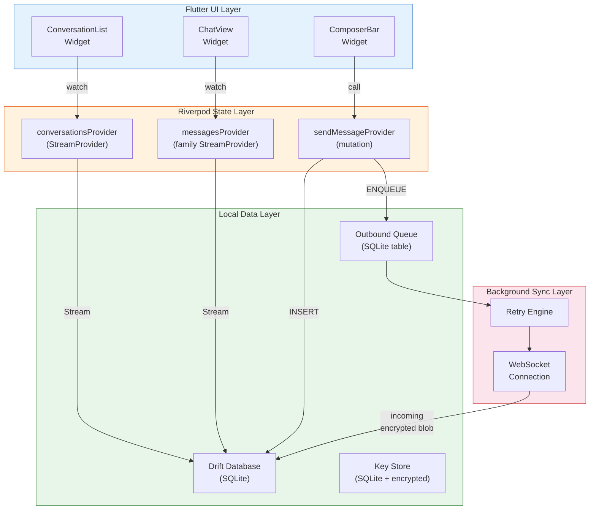
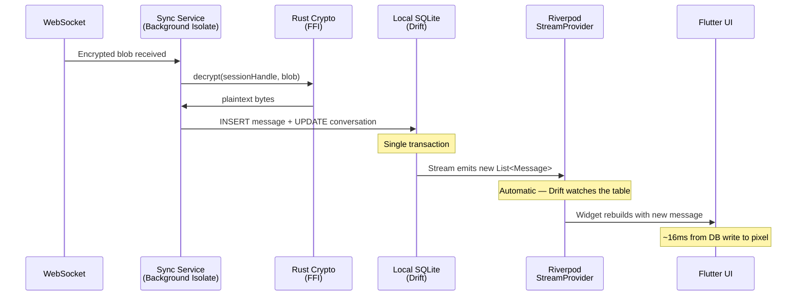

# 3. The Local-First Flutter Architecture 🟡

> **The Problem:** Most chat apps treat the server as the source of truth — the UI is essentially a thin shell that renders whatever the server sends. When the network drops (subway, airplane, rural areas), the app becomes useless: messages can't be read, drafts are lost, and the empty spinner mocks you. For an E2E encrypted messenger, this is doubly absurd: the server *can't even read* the messages it's storing. The device must be the source of truth. We need a local-first architecture where the local SQLite database is the canonical state, the UI reacts to database changes, and the network layer is just a sync pipe that runs independently.

---

## Local-First Principles

| Principle | What It Means | How We Implement It |
|---|---|---|
| **Local writes are instant** | Sending a message writes to the local DB immediately — no network round-trip | Drift `INSERT` → Riverpod watch → UI updates in < 16 ms |
| **UI reads from local DB** | The widget tree never fetches data from the network | Riverpod providers watch Drift `Stream<List<Message>>` |
| **Network is a background sync** | WebSocket is a fire-and-forget delivery pipe | Outbound queue drains independently on a background isolate |
| **Conflict resolution is deterministic** | Two devices sending at the same time produce the same final state | Lamport timestamps + server-assigned ordering |
| **Offline = full functionality** | Read all messages, compose replies, manage contacts — all without network | Everything is in the local encrypted SQLite database |

---

## The Data Architecture



---

## Drift Database Schema

[Drift](https://drift.simonbinder.eu/) is the most mature SQLite library for Dart — it provides compile-time SQL verification, reactive streams, and type-safe queries.

### Schema Definition

```dart
// lib/src/database/schema.dart

import 'package:drift/drift.dart';

/// Conversations (1:1 or group)
class Conversations extends Table {
  IntColumn get id => integer().autoIncrement()();
  TextColumn get remoteId => text().unique()();           // Server-assigned UUID
  TextColumn get title => text().nullable()();             // Group name or null for 1:1
  IntColumn get type => intEnum<ConversationType>()();     // dm, group
  DateTimeColumn get createdAt => dateTime()();
  DateTimeColumn get updatedAt => dateTime()();

  // Denormalized for fast list rendering:
  TextColumn get lastMessagePreview => text().withDefault(const Constant(''))();
  DateTimeColumn get lastMessageAt => dateTime().nullable()();
  IntColumn get unreadCount => integer().withDefault(const Constant(0))();
}

enum ConversationType { dm, group }

/// Messages — the core table
class Messages extends Table {
  IntColumn get id => integer().autoIncrement()();
  TextColumn get remoteId => text().unique()();            // UUID for idempotency
  IntColumn get conversationId => integer()
      .references(Conversations, #id)();
  TextColumn get senderUserId => text()();
  BlobColumn get ciphertextBlob => blob()();               // Raw encrypted bytes
  TextColumn get plaintextCache => text().nullable()();    // Decrypted text (local only)
  IntColumn get status => intEnum<MessageStatus>()();      // sending, sent, delivered, read
  DateTimeColumn get sentAt => dateTime()();               // Client-side timestamp
  DateTimeColumn get serverTimestamp => dateTime().nullable()(); // Server-assigned ordering
  IntColumn get localSequence => integer()();              // Lamport clock for ordering

  @override
  List<Set<Column>> get uniqueKeys => [{remoteId}];

  @override
  List<String> get customConstraints => [
    'FOREIGN KEY (conversation_id) REFERENCES conversations(id) ON DELETE CASCADE',
  ];
}

enum MessageStatus { sending, sent, delivered, read, failed }

/// Outbound queue — messages waiting to be sent
class OutboundQueue extends Table {
  IntColumn get id => integer().autoIncrement()();
  IntColumn get messageId => integer()
      .references(Messages, #id)();
  BlobColumn get encryptedPayload => blob()();             // Ready-to-send bytes
  TextColumn get idempotencyKey => text()();               // Prevents double-send
  IntColumn get retryCount => integer().withDefault(const Constant(0))();
  DateTimeColumn get nextRetryAt => dateTime()();
  DateTimeColumn get createdAt => dateTime()();
}

/// Crypto sessions — per-conversation Double Ratchet state
class CryptoSessions extends Table {
  IntColumn get id => integer().autoIncrement()();
  TextColumn get peerUserId => text()();
  IntColumn get rustSessionHandle => integer()();          // Opaque handle to Rust memory
  BlobColumn get serializedState => blob()();              // Periodic checkpoint for backup
  DateTimeColumn get lastActive => dateTime()();

  @override
  List<Set<Column>> get uniqueKeys => [{peerUserId}];
}
```

### Database Class

```dart
// lib/src/database/database.dart

import 'package:drift/drift.dart';
import 'package:drift/native.dart';
import 'schema.dart';

part 'database.g.dart';

@DriftDatabase(tables: [Conversations, Messages, OutboundQueue, CryptoSessions])
class AppDatabase extends _$AppDatabase {
  AppDatabase(QueryExecutor executor) : super(executor);

  @override
  int get schemaVersion => 1;

  // ── Conversation Queries ──────────────────────────────

  /// Watch all conversations, ordered by most recent message.
  Stream<List<Conversation>> watchConversations() {
    return (select(conversations)
          ..orderBy([(t) => OrderingTerm.desc(t.lastMessageAt)]))
        .watch();
  }

  // ── Message Queries ───────────────────────────────────

  /// Watch messages for a conversation, ordered by local sequence.
  Stream<List<Message>> watchMessages(int conversationId) {
    return (select(messages)
          ..where((m) => m.conversationId.equals(conversationId))
          ..orderBy([(m) => OrderingTerm.asc(m.localSequence)]))
        .watch();
  }

  /// Insert a new outgoing message + enqueue for delivery.
  /// This is a SINGLE transaction — atomic write.
  Future<int> sendMessage({
    required int conversationId,
    required String remoteId,
    required String senderUserId,
    required Uint8List ciphertext,
    required String plaintext,
    required String idempotencyKey,
    required Uint8List encryptedPayload,
  }) async {
    return transaction(() async {
      final now = DateTime.now();

      // ✅ Step 1: Insert the message as "sending"
      final msgId = await into(messages).insert(MessagesCompanion.insert(
        remoteId: remoteId,
        conversationId: conversationId,
        senderUserId: senderUserId,
        ciphertextBlob: ciphertext,
        plaintextCache: Value(plaintext),
        status: MessageStatus.sending,
        sentAt: now,
        localSequence: await _nextLocalSequence(conversationId),
      ));

      // ✅ Step 2: Enqueue for outbound delivery
      await into(outboundQueue).insert(OutboundQueueCompanion.insert(
        messageId: msgId,
        encryptedPayload: encryptedPayload,
        idempotencyKey: idempotencyKey,
        nextRetryAt: now, // Send immediately
        createdAt: now,
      ));

      // ✅ Step 3: Update conversation preview (denormalized)
      await (update(conversations)
            ..where((c) => c.id.equals(conversationId)))
          .write(ConversationsCompanion(
        lastMessagePreview: Value(plaintext.length > 100
            ? '${plaintext.substring(0, 100)}...'
            : plaintext),
        lastMessageAt: Value(now),
        updatedAt: Value(now),
      ));

      return msgId;
    });
  }

  Future<int> _nextLocalSequence(int conversationId) async {
    final result = await (selectOnly(messages)
          ..addColumns([messages.localSequence.max()])
          ..where(messages.conversationId.equals(conversationId)))
        .getSingleOrNull();
    return (result?.read(messages.localSequence.max()) ?? 0) + 1;
  }
}
```

---

## Riverpod State Management

### Why Riverpod (not BLoC, not GetX)?

| Feature | BLoC | GetX | Riverpod |
|---|---|---|---|
| Compile-time safety | ⚠️ Partial | ❌ No | ✅ Full |
| Testability | ✅ Good | ⚠️ Weak | ✅ Excellent |
| Dependency injection | Manual | Global | ✅ Built-in (provider graph) |
| Stream support | ✅ Native | ⚠️ Rx-based | ✅ `StreamProvider` |
| Dispose lifecycle | Manual | Fragile | ✅ Automatic (ref.onDispose) |
| Code generation | Optional | None | ✅ `riverpod_generator` |

### Provider Graph

```dart
// lib/src/providers/providers.dart

import 'package:riverpod_annotation/riverpod_annotation.dart';
import '../database/database.dart';
import '../bridge_generated.dart';

part 'providers.g.dart';

/// The singleton database instance.
@Riverpod(keepAlive: true)
AppDatabase database(DatabaseRef ref) {
  final db = AppDatabase(NativeDatabase.memory()); // Or file-backed
  ref.onDispose(() => db.close());
  return db;
}

/// The Rust crypto bridge (singleton, keep alive).
@Riverpod(keepAlive: true)
MessengerCrypto cryptoBridge(CryptoBridgeRef ref) {
  final lib = RustLibrary.open('libmessenger_crypto');
  return MessengerCrypto(lib);
}

/// Watch all conversations — reactive stream from SQLite.
@riverpod
Stream<List<Conversation>> conversations(ConversationsRef ref) {
  final db = ref.watch(databaseProvider);
  return db.watchConversations();
}

/// Watch messages for a specific conversation.
@riverpod
Stream<List<Message>> messages(MessagesRef ref, int conversationId) {
  final db = ref.watch(databaseProvider);
  return db.watchMessages(conversationId);
}

/// The crypto session manager (handles session lifecycle).
@Riverpod(keepAlive: true)
CryptoSessionManager cryptoSessionManager(CryptoSessionManagerRef ref) {
  final crypto = ref.watch(cryptoBridgeProvider);
  final manager = CryptoSessionManager(crypto);
  ref.onDispose(() => manager.destroyAll());
  return manager;
}
```

### The Send Message Flow

```dart
// lib/src/services/message_service.dart

import 'dart:convert';
import 'dart:typed_data';
import 'package:uuid/uuid.dart';
import '../database/database.dart';
import '../providers/providers.dart';

class MessageService {
  final AppDatabase _db;
  final CryptoSessionManager _crypto;
  static const _uuid = Uuid();

  MessageService(this._db, this._crypto);

  /// Send a message: encrypt → write to local DB → enqueue for delivery.
  /// The UI updates INSTANTLY because Riverpod watches the DB stream.
  Future<void> send({
    required int conversationId,
    required String conversationRemoteId,
    required String text,
    required String myUserId,
  }) async {
    // ✅ Step 1: Generate unique IDs
    final messageId = _uuid.v4();
    final idempotencyKey = _uuid.v4();

    // ✅ Step 2: Encrypt via Rust (background isolate)
    final ciphertext = await _crypto.encrypt(
      conversationId: conversationRemoteId,
      plaintext: text,
    );

    // ✅ Step 3: Build the wire-format envelope
    final envelope = _buildEnvelope(
      messageId: messageId,
      conversationId: conversationRemoteId,
      ciphertext: ciphertext,
      idempotencyKey: idempotencyKey,
    );

    // ✅ Step 4: Atomic write to local DB + outbound queue
    await _db.sendMessage(
      conversationId: conversationId,
      remoteId: messageId,
      senderUserId: myUserId,
      ciphertext: ciphertext,
      plaintext: text,
      idempotencyKey: idempotencyKey,
      encryptedPayload: envelope,
    );

    // UI is already updated! The Riverpod StreamProvider watching
    // db.watchMessages() fires immediately after the INSERT.
    // No setState, no manual notify — pure reactive data flow.
  }

  Uint8List _buildEnvelope({
    required String messageId,
    required String conversationId,
    required Uint8List ciphertext,
    required String idempotencyKey,
  }) {
    // Simple binary envelope: lengths + fields
    // In production, use protobuf or flatbuffers
    final msgIdBytes = utf8.encode(messageId);
    final convBytes = utf8.encode(conversationId);
    final idempBytes = utf8.encode(idempotencyKey);

    final buf = BytesBuilder();
    buf.addByte(0x01); // Version
    _writeField(buf, msgIdBytes);
    _writeField(buf, convBytes);
    _writeField(buf, idempBytes);
    _writeField(buf, ciphertext);
    return buf.toBytes();
  }

  void _writeField(BytesBuilder buf, List<int> data) {
    // 4-byte big-endian length prefix
    buf.add([
      (data.length >> 24) & 0xFF,
      (data.length >> 16) & 0xFF,
      (data.length >> 8) & 0xFF,
      data.length & 0xFF,
    ]);
    buf.add(data);
  }
}
```

---

## The Widget Layer

### Naive Approach: Fetching Data in Widgets

```dart
// 💥 HAZARD: Fetching from network inside build().
// - Blocks UI on network latency.
// - Fails completely when offline.
// - No caching — re-fetches on every rebuild.

class ChatScreen extends StatefulWidget {
  @override
  _ChatScreenState createState() => _ChatScreenState();
}

class _ChatScreenState extends State<ChatScreen> {
  List<Message>? _messages;

  @override
  void initState() {
    super.initState();
    // 💥 Network-dependent — useless offline
    _loadMessages();
  }

  Future<void> _loadMessages() async {
    final response = await http.get('/api/messages/${widget.conversationId}');
    setState(() {
      _messages = parseMessages(response.body);
    });
  }

  @override
  Widget build(BuildContext context) {
    if (_messages == null) return CircularProgressIndicator(); // 💥 Spinner hell
    return ListView.builder(/* ... */);
  }
}
```

### Production Approach: Reactive DB Streams

```dart
// ✅ FIX: UI watches the local database. No network dependency.
// Messages appear instantly (from DB) whether online or offline.

import 'package:flutter/material.dart';
import 'package:flutter_riverpod/flutter_riverpod.dart';
import '../providers/providers.dart';

class ChatScreen extends ConsumerWidget {
  final int conversationId;
  const ChatScreen({required this.conversationId, super.key});

  @override
  Widget build(BuildContext context, WidgetRef ref) {
    // ✅ Watches the local SQLite stream — instant updates, works offline
    final messagesAsync = ref.watch(messagesProvider(conversationId));

    return Scaffold(
      appBar: _buildAppBar(context, ref),
      body: Column(
        children: [
          // ✅ Message list — reactive, no loading spinner for local data
          Expanded(
            child: messagesAsync.when(
              data: (messages) => _MessageList(messages: messages),
              loading: () => const _MessageListSkeleton(),
              error: (e, _) => Center(child: Text('DB error: $e')),
            ),
          ),

          // ✅ Composer bar — always functional, even offline
          _ComposerBar(conversationId: conversationId),
        ],
      ),
    );
  }

  PreferredSizeWidget _buildAppBar(BuildContext context, WidgetRef ref) {
    return AppBar(
      title: const Text('Chat'),
      // ✅ Show connection status as a subtle indicator, not a blocker
      bottom: const _ConnectionStatusBar(),
    );
  }
}

/// The message list — a reverse ListView for chat UX.
class _MessageList extends StatelessWidget {
  final List<Message> messages;
  const _MessageList({required this.messages});

  @override
  Widget build(BuildContext context) {
    return ListView.builder(
      reverse: true, // Latest message at the bottom
      itemCount: messages.length,
      itemBuilder: (context, index) {
        final msg = messages[messages.length - 1 - index];
        return _MessageBubble(message: msg);
      },
    );
  }
}

/// Individual message bubble with delivery status.
class _MessageBubble extends StatelessWidget {
  final Message message;
  const _MessageBubble({required this.message});

  @override
  Widget build(BuildContext context) {
    final isMe = message.senderUserId == currentUserId;
    return Align(
      alignment: isMe ? Alignment.centerRight : Alignment.centerLeft,
      child: Container(
        margin: const EdgeInsets.symmetric(horizontal: 12, vertical: 4),
        padding: const EdgeInsets.all(12),
        decoration: BoxDecoration(
          color: isMe ? Colors.blue[100] : Colors.grey[200],
          borderRadius: BorderRadius.circular(16),
        ),
        child: Column(
          crossAxisAlignment: CrossAxisAlignment.end,
          children: [
            Text(message.plaintextCache ?? '[encrypted]'),
            const SizedBox(height: 4),
            // ✅ Delivery status indicator
            Row(
              mainAxisSize: MainAxisSize.min,
              children: [
                Text(
                  _formatTime(message.sentAt),
                  style: Theme.of(context).textTheme.bodySmall,
                ),
                if (isMe) ...[
                  const SizedBox(width: 4),
                  _StatusIcon(status: message.status),
                ],
              ],
            ),
          ],
        ),
      ),
    );
  }
}

/// Delivery status: ⏳ sending → ✓ sent → ✓✓ delivered → ✓✓ read (blue)
class _StatusIcon extends StatelessWidget {
  final MessageStatus status;
  const _StatusIcon({required this.status});

  @override
  Widget build(BuildContext context) {
    return switch (status) {
      MessageStatus.sending => const Icon(Icons.schedule, size: 14, color: Colors.grey),
      MessageStatus.sent => const Icon(Icons.check, size: 14, color: Colors.grey),
      MessageStatus.delivered => const Icon(Icons.done_all, size: 14, color: Colors.grey),
      MessageStatus.read => const Icon(Icons.done_all, size: 14, color: Colors.blue),
      MessageStatus.failed => const Icon(Icons.error_outline, size: 14, color: Colors.red),
    };
  }
}

/// Connection status bar — subtle, non-blocking indicator.
class _ConnectionStatusBar extends ConsumerWidget implements PreferredSizeWidget {
  const _ConnectionStatusBar();

  @override
  Size get preferredSize => const Size.fromHeight(24);

  @override
  Widget build(BuildContext context, WidgetRef ref) {
    final status = ref.watch(connectionStatusProvider);

    return AnimatedContainer(
      duration: const Duration(milliseconds: 300),
      height: status == ConnectionStatus.connected ? 0 : 24,
      color: status == ConnectionStatus.connecting
          ? Colors.orange[100]
          : Colors.red[100],
      child: Center(
        child: Text(
          status == ConnectionStatus.connecting
              ? 'Reconnecting...'
              : 'No connection — messages will send when online',
          style: const TextStyle(fontSize: 12),
        ),
      ),
    );
  }
}
```

---

## Incoming Message Flow

When a message arrives from the WebSocket, it flows through the decrypt → store → notify pipeline:



### Sync Service Implementation

```dart
// lib/src/services/sync_service.dart

import 'dart:async';
import 'dart:convert';
import 'package:web_socket_channel/web_socket_channel.dart';
import '../database/database.dart';

class SyncService {
  final AppDatabase _db;
  final CryptoSessionManager _crypto;
  WebSocketChannel? _channel;
  StreamSubscription? _subscription;

  SyncService(this._db, this._crypto);

  /// Connect to the relay server and start processing incoming messages.
  void connect(String wsUrl, String authToken) {
    _channel = WebSocketChannel.connect(
      Uri.parse(wsUrl),
      protocols: ['messenger-v1'],
    );

    _subscription = _channel!.stream.listen(
      _onMessage,
      onError: _onError,
      onDone: _onDisconnect,
    );

    // Send auth token as first frame
    _channel!.sink.add(utf8.encode(authToken));
  }

  Future<void> _onMessage(dynamic data) async {
    final bytes = data as List<int>;
    final envelope = _parseEnvelope(bytes);

    try {
      // ✅ Decrypt via Rust FFI (background isolate)
      final plaintext = await _crypto.decrypt(
        conversationId: envelope.conversationId,
        ciphertext: envelope.ciphertext,
      );

      // ✅ Atomic write to local DB
      await _db.receiveMessage(
        remoteId: envelope.messageId,
        conversationId: envelope.conversationId,
        senderUserId: envelope.senderUserId,
        ciphertext: envelope.ciphertext,
        plaintext: plaintext,
        serverTimestamp: envelope.serverTimestamp,
      );

      // ✅ Send delivery receipt back to the server
      _sendReceipt(envelope.messageId, ReceiptType.delivered);

    } on CryptoException catch (e) {
      // Session may be out of sync — request re-key
      _requestSessionReset(envelope.conversationId);
    }
  }

  void _onDisconnect() {
    // ✅ Exponential backoff reconnection
    _scheduleReconnect();
  }

  void _onError(Object error) {
    _scheduleReconnect();
  }

  Timer? _reconnectTimer;
  int _reconnectAttempt = 0;

  void _scheduleReconnect() {
    final delay = Duration(
      milliseconds: (1000 * (1 << _reconnectAttempt.clamp(0, 6))),
    );
    _reconnectTimer?.cancel();
    _reconnectTimer = Timer(delay, () {
      _reconnectAttempt++;
      connect(_lastUrl!, _lastToken!);
    });
  }

  void dispose() {
    _reconnectTimer?.cancel();
    _subscription?.cancel();
    _channel?.sink.close();
  }
}
```

---

## Encrypted Local Storage

The local SQLite database itself must be encrypted — if someone accesses the device's file system, they should not be able to read message history.

### Approach: SQLCipher

```dart
// ✅ Use SQLCipher (encrypted SQLite) instead of plain SQLite.
// The encryption key is derived from the user's device passcode
// via the platform keychain (Keychain on iOS, Keystore on Android).

import 'package:drift/drift.dart';
import 'package:sqlcipher_flutter_libs/sqlcipher_flutter_libs.dart';
import 'package:sqlite3/open.dart';

QueryExecutor openEncryptedDatabase(String path, String encryptionKey) {
  return NativeDatabase.createInBackground(
    File(path),
    setup: (db) {
      // ✅ SQLCipher pragma to set the encryption key
      db.execute("PRAGMA key = '$encryptionKey'");
      // ✅ Performance: use WAL mode for concurrent reads
      db.execute('PRAGMA journal_mode = WAL');
      // ✅ Verify the database is accessible
      db.execute('SELECT count(*) FROM sqlite_master');
    },
  );
}
```

### Key Derivation from Platform Keychain

```dart
// lib/src/security/key_manager.dart

import 'package:flutter_secure_storage/flutter_secure_storage.dart';
import 'dart:convert';
import 'dart:math';

class DatabaseKeyManager {
  static const _storage = FlutterSecureStorage();
  static const _keyAlias = 'omni_messenger_db_key';

  /// Get or create the database encryption key.
  /// The key is stored in the platform's secure enclave:
  /// - iOS: Keychain (hardware-backed on devices with Secure Enclave)
  /// - Android: Keystore (hardware-backed on devices with StrongBox)
  static Future<String> getDatabaseKey() async {
    var key = await _storage.read(key: _keyAlias);
    if (key == null) {
      key = _generateKey();
      await _storage.write(key: _keyAlias, value: key);
    }
    return key;
  }

  static String _generateKey() {
    final random = Random.secure();
    final bytes = List<int>.generate(32, (_) => random.nextInt(256));
    return base64Url.encode(bytes);
  }
}
```

---

## Data Flow Summary

| Event | Source | Flow | Latency |
|---|---|---|---|
| User sends message | ComposerBar tap | Encrypt → DB INSERT → Queue → UI stream fires | < 20 ms to UI |
| Message delivered | Server ACK via WebSocket | DB UPDATE (status) → UI stream fires | < 5 ms to UI |
| Message received | WebSocket incoming | Decrypt → DB INSERT → UI stream fires | < 30 ms to UI |
| App opened offline | Cold start | DB read → Stream fires → UI renders | < 100 ms to UI |
| Network restored | Connectivity change | Queue drains → Server ACKs → DB updates → UI updates | Depends on queue depth |

---

## Testing the Local-First Architecture

```dart
// test/database_test.dart

import 'package:drift/native.dart';
import 'package:test/test.dart';
import '../lib/src/database/database.dart';

void main() {
  late AppDatabase db;

  setUp(() {
    db = AppDatabase(NativeDatabase.memory());
  });

  tearDown(() async {
    await db.close();
  });

  test('messages stream updates when a new message is inserted', () async {
    // Create a conversation
    final convId = await db.into(db.conversations).insert(
      ConversationsCompanion.insert(
        remoteId: 'conv-1',
        type: ConversationType.dm,
        createdAt: DateTime.now(),
        updatedAt: DateTime.now(),
      ),
    );

    // ✅ Set up a stream listener BEFORE inserting
    final stream = db.watchMessages(convId);
    final expectation = expectLater(
      stream,
      emitsInOrder([
        hasLength(0),  // Initial empty state
        hasLength(1),  // After first insert
        hasLength(2),  // After second insert
      ]),
    );

    // Insert messages
    await db.into(db.messages).insert(MessagesCompanion.insert(
      remoteId: 'msg-1',
      conversationId: convId,
      senderUserId: 'alice',
      ciphertextBlob: Uint8List(0),
      status: MessageStatus.sent,
      sentAt: DateTime.now(),
      localSequence: 1,
    ));

    await db.into(db.messages).insert(MessagesCompanion.insert(
      remoteId: 'msg-2',
      conversationId: convId,
      senderUserId: 'bob',
      ciphertextBlob: Uint8List(0),
      status: MessageStatus.sent,
      sentAt: DateTime.now(),
      localSequence: 2,
    ));

    await expectation;
  });

  test('send message is atomic — message + queue entry in one transaction', () async {
    final convId = await _createConversation(db);

    await db.sendMessage(
      conversationId: convId,
      remoteId: 'msg-atomic',
      senderUserId: 'me',
      ciphertext: Uint8List.fromList([1, 2, 3]),
      plaintext: 'Hello',
      idempotencyKey: 'idem-1',
      encryptedPayload: Uint8List.fromList([4, 5, 6]),
    );

    // Both tables must have the entry
    final msgs = await db.select(db.messages).get();
    final queue = await db.select(db.outboundQueue).get();
    expect(msgs, hasLength(1));
    expect(queue, hasLength(1));
    expect(msgs.first.status, MessageStatus.sending);
  });
}
```

---

> **Key Takeaways**
>
> 1. **The local SQLite database is the single source of truth** — the UI reads from it, writes go to it first, and the network layer is just a background sync mechanism.
> 2. **Riverpod `StreamProvider` + Drift `watch()`** creates a reactive pipeline where database changes appear in the UI within one frame (~16 ms), with zero manual state management.
> 3. **Sending a message is an atomic local write** — the message and its queue entry are inserted in a single SQLite transaction. The UI updates instantly; network delivery happens asynchronously.
> 4. **Offline is a non-event** — because the UI never depends on the network, there's no "offline mode." The app works the same way whether the network is up or not.
> 5. **SQLCipher encrypts the database at rest** — the encryption key lives in the platform's secure enclave (iOS Keychain / Android Keystore), so even a rooted device can't trivially read message history.
> 6. **Denormalized `lastMessagePreview` on `Conversations`** avoids a JOIN on the hot path (conversation list rendering). This is a deliberate trade-off: slightly more write work for much faster reads.
> 7. **The connection status bar is cosmetic, not functional** — it informs the user, but nothing in the app *depends* on being connected. This is the hallmark of a true local-first architecture.
