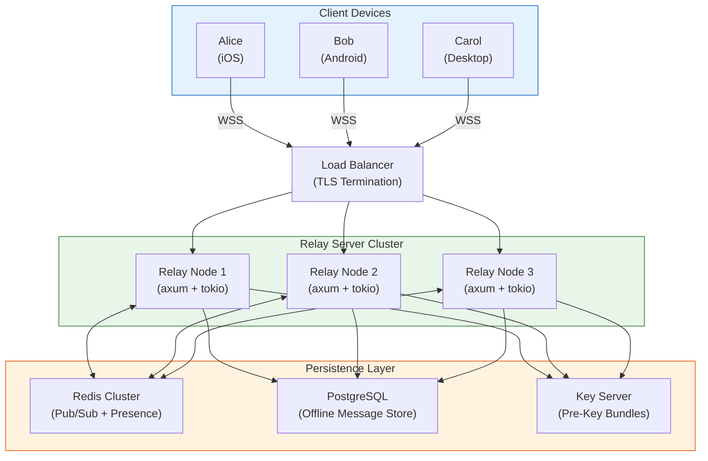
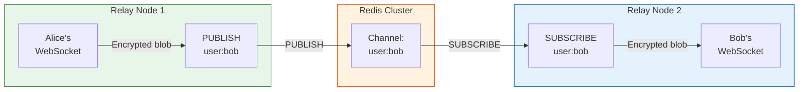

# 4. The Rust WebSocket Relay Server 🔴

> **The Problem:** We have clients that encrypt locally, store locally, and sync via WebSocket. Now we need the server they sync *through*. But this server is unique: it must route millions of encrypted blobs per second while knowing *nothing* about their contents. It cannot peek inside messages, cannot reorder them based on content, and cannot even tell a text message from an image. It's a dumb pipe — but a dumb pipe that must handle C10M (10 million concurrent connections), survive node failures, and horizontally scale behind a load balancer. The challenge is building infrastructure-grade reliability for a zero-knowledge relay.

---

## Architecture Principles

| Principle | Rationale |
|---|---|
| **Stateless relay nodes** | Any node can serve any client — enables horizontal scaling and zero-downtime deploys |
| **Redis Pub/Sub backplane** | Routes messages between relay nodes when sender and receiver are on different nodes |
| **Encrypted blob passthrough** | Server stores and forwards `Vec<u8>` — never deserializes, never inspects content |
| **Offline message store** | When a recipient is offline, encrypted blobs are persisted to a durable store (PostgreSQL / S3) |
| **Connection-level auth only** | JWT-based authentication at connection setup; no per-message auth overhead |

---

## System Architecture



---

## The Relay Server Core

### Technology Stack

| Layer | Technology | Why |
|---|---|---|
| HTTP + WebSocket | `axum` | Tower-based, composable middleware, first-class WebSocket support |
| Async runtime | `tokio` (multi-threaded) | Work-stealing, io_uring support via `tokio-uring` |
| Serialization | None (raw bytes) | Encrypted blobs are opaque — no deserialization needed |
| Auth | JWT (`jsonwebtoken` crate) | Stateless, verifiable at connection time |
| Pub/Sub | `redis` crate (async) | Routes messages between relay nodes |
| Offline store | `sqlx` (PostgreSQL) | Compile-time checked queries, async |
| Observability | `tracing` + OpenTelemetry | Structured logging, distributed traces |

### Cargo.toml

```toml
[package]
name = "messenger-relay"
version = "0.1.0"
edition = "2021"

[dependencies]
axum = { version = "0.7", features = ["ws"] }
tokio = { version = "1", features = ["full"] }
tower = "0.4"
tower-http = { version = "0.5", features = ["cors", "trace", "compression-gzip"] }
serde = { version = "1", features = ["derive"] }
serde_json = "1"
jsonwebtoken = "9"
redis = { version = "0.25", features = ["tokio-comp", "connection-manager"] }
sqlx = { version = "0.7", features = ["runtime-tokio", "postgres", "uuid", "chrono"] }
uuid = { version = "1", features = ["v4"] }
chrono = { version = "0.4", features = ["serde"] }
tracing = "0.1"
tracing-subscriber = { version = "0.3", features = ["env-filter", "json"] }
dashmap = "5"
bytes = "1"
futures = "0.3"
```

---

## Connection Management

### Naive Approach: One Thread per Connection

```rust,ignore
use std::net::TcpListener;
use std::thread;

fn naive_server() {
    let listener = TcpListener::bind("0.0.0.0:8080").unwrap();

    // 💥 PERFORMANCE HAZARD: One OS thread per connection.
    // At 100K connections, this is 100K threads.
    // Each thread costs ~8 MB stack = 800 GB of virtual memory.
    // Context switching at 100K threads destroys throughput.
    for stream in listener.incoming() {
        thread::spawn(move || {
            handle_websocket(stream.unwrap());
        });
    }
}
```

### Production Approach: Tokio + Axum

```rust,ignore
//! main.rs — The relay server entry point

use axum::{
    Router,
    routing::get,
    extract::{State, WebSocketUpgrade, ws::{Message, WebSocket}},
    response::IntoResponse,
    http::StatusCode,
    middleware,
};
use dashmap::DashMap;
use futures::{SinkExt, StreamExt};
use std::sync::Arc;
use tokio::sync::mpsc;
use uuid::Uuid;

mod auth;
mod pubsub;
mod offline_store;

/// Shared application state — cheaply cloneable via Arc.
#[derive(Clone)]
pub struct AppState {
    /// Active connections: user_id → sender channel
    /// DashMap provides lock-free concurrent reads.
    connections: Arc<DashMap<String, mpsc::Sender<Vec<u8>>>>,

    /// Redis connection for Pub/Sub
    redis: redis::aio::ConnectionManager,

    /// PostgreSQL pool for offline messages
    db: sqlx::PgPool,

    /// JWT decoding key
    jwt_key: jsonwebtoken::DecodingKey,
}

#[tokio::main]
async fn main() -> anyhow::Result<()> {
    // ✅ Initialize structured logging with OpenTelemetry export
    tracing_subscriber::fmt()
        .json()
        .with_env_filter("messenger_relay=debug,tower_http=info")
        .init();

    // ✅ Connect to Redis
    let redis_client = redis::Client::open("redis://redis-cluster:6379")?;
    let redis_conn = redis::aio::ConnectionManager::new(redis_client).await?;

    // ✅ Connect to PostgreSQL
    let db_pool = sqlx::PgPool::connect("postgres://relay:password@db:5432/messenger")
        .await?;
    sqlx::migrate!().run(&db_pool).await?;

    let state = AppState {
        connections: Arc::new(DashMap::new()),
        redis: redis_conn.clone(),
        db: db_pool,
        jwt_key: auth::load_jwt_public_key()?,
    };

    // ✅ Start the Redis Pub/Sub listener (background task)
    let pubsub_state = state.clone();
    tokio::spawn(async move {
        pubsub::subscribe_loop(pubsub_state).await;
    });

    // ✅ Build the Axum router
    let app = Router::new()
        .route("/ws", get(ws_handler))
        .route("/health", get(|| async { "OK" }))
        .route("/api/prekeys/:user_id", get(get_prekeys).post(upload_prekeys))
        .layer(tower_http::trace::TraceLayer::new_for_http())
        .layer(tower_http::compression::CompressionLayer::new())
        .with_state(state);

    // ✅ Bind with SO_REUSEPORT for multi-process scaling
    let listener = tokio::net::TcpListener::bind("0.0.0.0:8080").await?;
    tracing::info!("Relay server listening on :8080");
    axum::serve(listener, app).await?;

    Ok(())
}
```

---

## WebSocket Handler

```rust,ignore
/// WebSocket upgrade handler — authenticates, then enters the message loop.
async fn ws_handler(
    ws: WebSocketUpgrade,
    State(state): State<AppState>,
) -> impl IntoResponse {
    // ✅ The upgrade itself is unauthenticated — auth happens in the first frame
    ws.on_upgrade(move |socket| handle_socket(socket, state))
}

/// Per-connection handler — runs for the lifetime of the WebSocket.
async fn handle_socket(socket: WebSocket, state: AppState) {
    let (mut ws_sender, mut ws_receiver) = socket.split();

    // ✅ Step 1: Authenticate — first message must be a JWT
    let user_id = match authenticate(&mut ws_receiver, &state.jwt_key).await {
        Ok(id) => id,
        Err(e) => {
            tracing::warn!("Auth failed: {e}");
            let _ = ws_sender.send(Message::Close(None)).await;
            return;
        }
    };

    tracing::info!(user_id = %user_id, "Client connected");

    // ✅ Step 2: Create a channel for this connection
    let (tx, mut rx) = mpsc::channel::<Vec<u8>>(256);
    state.connections.insert(user_id.clone(), tx);

    // ✅ Step 3: Deliver any offline messages
    deliver_offline_messages(&user_id, &mut ws_sender, &state).await;

    // ✅ Step 4: Run the bidirectional message loop
    loop {
        tokio::select! {
            // Outbound: relay → client (messages from other users)
            Some(msg) = rx.recv() => {
                if ws_sender.send(Message::Binary(msg)).await.is_err() {
                    break; // Client disconnected
                }
            }

            // Inbound: client → relay (messages to route)
            Some(Ok(msg)) = ws_receiver.next() => {
                match msg {
                    Message::Binary(data) => {
                        route_message(&user_id, data, &state).await;
                    }
                    Message::Close(_) => break,
                    Message::Ping(payload) => {
                        let _ = ws_sender.send(Message::Pong(payload)).await;
                    }
                    _ => {} // Ignore text frames
                }
            }

            else => break, // Both streams closed
        }
    }

    // ✅ Cleanup on disconnect
    state.connections.remove(&user_id);
    tracing::info!(user_id = %user_id, "Client disconnected");
}

/// Authenticate the first WebSocket frame as a JWT.
async fn authenticate(
    receiver: &mut futures::stream::SplitStream<WebSocket>,
    key: &jsonwebtoken::DecodingKey,
) -> Result<String, String> {
    // Wait for the first message (timeout: 5 seconds)
    let first_msg = tokio::time::timeout(
        std::time::Duration::from_secs(5),
        receiver.next(),
    )
    .await
    .map_err(|_| "Auth timeout".to_string())?
    .ok_or("Connection closed before auth")?
    .map_err(|e| format!("WebSocket error: {e}"))?;

    let token_bytes = match first_msg {
        Message::Binary(b) => b,
        Message::Text(t) => t.into_bytes(),
        _ => return Err("First frame must be auth token".into()),
    };

    let token_str = String::from_utf8(token_bytes)
        .map_err(|_| "Invalid UTF-8 token")?;

    let claims = auth::validate_jwt(&token_str, key)?;
    Ok(claims.sub)
}
```

---

## Message Routing: The Zero-Knowledge Core

The relay server's only job: take an opaque encrypted blob from sender, deliver it to the recipient. The routing decision is based on the **unencrypted envelope** — a thin wrapper containing only the recipient's user ID and a message ID.

### Wire Protocol

```
┌──────────────────────────────────────────────────┐
│  Envelope (UNENCRYPTED — visible to relay)        │
├──────────────────────────────────────────────────┤
│  version: u8              (1 byte)                │
│  recipient_id_len: u16    (2 bytes, big-endian)   │
│  recipient_id: [u8]       (UTF-8 user ID)         │
│  message_id: [u8; 16]     (UUID, for idempotency) │
│  conversation_id: [u8; 16](UUID)                  │
│  timestamp: i64           (8 bytes, Unix millis)  │
│  payload_len: u32         (4 bytes, big-endian)   │
├──────────────────────────────────────────────────┤
│  Payload (ENCRYPTED — opaque to relay)            │
├──────────────────────────────────────────────────┤
│  encrypted_blob: [u8]     (payload_len bytes)     │
│  (Contains: Double Ratchet header + AES ciphertext│
│   + nonce — relay cannot read any of this)        │
└──────────────────────────────────────────────────┘
```

### Routing Logic

```rust,ignore
/// Route an incoming message to the recipient.
///
/// The relay NEVER inspects the payload. It reads only the envelope
/// (recipient_id, message_id) and forwards the entire blob.
async fn route_message(sender_id: &str, raw: Vec<u8>, state: &AppState) {
    // ✅ Parse only the envelope — never touch the encrypted payload
    let envelope = match parse_envelope(&raw) {
        Ok(e) => e,
        Err(e) => {
            tracing::warn!(sender = sender_id, "Invalid envelope: {e}");
            return;
        }
    };

    let recipient_id = &envelope.recipient_id;
    let message_id = envelope.message_id;

    tracing::debug!(
        sender = sender_id,
        recipient = recipient_id,
        message_id = %Uuid::from_bytes(message_id),
        payload_size = raw.len(),
        "Routing message"
    );
    // Note: we log payload SIZE but never payload CONTENT

    // ✅ Attempt 1: Direct delivery (recipient on this node)
    if let Some(tx) = state.connections.get(recipient_id) {
        if tx.try_send(raw.clone()).is_ok() {
            return; // Delivered locally
        }
    }

    // ✅ Attempt 2: Cross-node delivery via Redis Pub/Sub
    let channel = format!("user:{recipient_id}");
    let publish_result: Result<(), _> = redis::cmd("PUBLISH")
        .arg(&channel)
        .arg(&raw)
        .query_async(&mut state.redis.clone())
        .await;

    if publish_result.is_ok() {
        // Message published — if recipient is on another node, that node
        // will receive it via its subscription and deliver locally.
        // But we don't know if the recipient IS online anywhere.
        // So we ALSO store it for offline delivery.
    }

    // ✅ Attempt 3: Store for offline delivery
    store_offline_message(
        recipient_id,
        sender_id,
        &message_id,
        &envelope.conversation_id,
        &raw,
        state,
    )
    .await;
}

/// Parse the unencrypted envelope without touching the payload.
fn parse_envelope(raw: &[u8]) -> Result<Envelope, &'static str> {
    if raw.is_empty() {
        return Err("Empty message");
    }
    let version = raw[0];
    if version != 0x01 {
        return Err("Unsupported protocol version");
    }

    let mut cursor = 1;

    // recipient_id
    if raw.len() < cursor + 2 {
        return Err("Truncated recipient_id length");
    }
    let rid_len = u16::from_be_bytes([raw[cursor], raw[cursor + 1]]) as usize;
    cursor += 2;

    if raw.len() < cursor + rid_len {
        return Err("Truncated recipient_id");
    }
    let recipient_id = std::str::from_utf8(&raw[cursor..cursor + rid_len])
        .map_err(|_| "Invalid UTF-8 in recipient_id")?
        .to_string();
    cursor += rid_len;

    // message_id (16 bytes UUID)
    if raw.len() < cursor + 16 {
        return Err("Truncated message_id");
    }
    let mut message_id = [0u8; 16];
    message_id.copy_from_slice(&raw[cursor..cursor + 16]);
    cursor += 16;

    // conversation_id (16 bytes UUID)
    if raw.len() < cursor + 16 {
        return Err("Truncated conversation_id");
    }
    let mut conversation_id = [0u8; 16];
    conversation_id.copy_from_slice(&raw[cursor..cursor + 16]);
    cursor += 16;

    // timestamp
    if raw.len() < cursor + 8 {
        return Err("Truncated timestamp");
    }
    let timestamp = i64::from_be_bytes(raw[cursor..cursor + 8].try_into().unwrap());
    cursor += 8;

    // payload_len
    if raw.len() < cursor + 4 {
        return Err("Truncated payload_len");
    }
    let payload_len = u32::from_be_bytes(raw[cursor..cursor + 4].try_into().unwrap()) as usize;
    cursor += 4;

    if raw.len() < cursor + payload_len {
        return Err("Truncated payload");
    }

    Ok(Envelope {
        recipient_id,
        message_id,
        conversation_id,
        timestamp,
        payload_offset: cursor,
        payload_len,
    })
}

struct Envelope {
    recipient_id: String,
    message_id: [u8; 16],
    conversation_id: [u8; 16],
    timestamp: i64,
    payload_offset: usize,
    payload_len: usize,
}
```

---

## Redis Pub/Sub Backplane

When sender and recipient are connected to *different* relay nodes, Redis Pub/Sub bridges the gap:



### Subscriber Loop

```rust,ignore
//! pubsub.rs — Redis Pub/Sub subscriber for cross-node routing

use futures::StreamExt;
use redis::AsyncCommands;

/// Runs forever, subscribing to channels for all users connected to this node.
pub async fn subscribe_loop(state: AppState) {
    let client = redis::Client::open("redis://redis-cluster:6379")
        .expect("Redis connection");
    let mut pubsub = client.get_async_pubsub().await
        .expect("Redis pubsub connection");

    // ✅ Subscribe to a management channel for dynamic subscription updates
    pubsub.subscribe("relay:subscriptions").await.unwrap();

    let mut stream = pubsub.on_message();

    while let Some(msg) = stream.next().await {
        let channel: String = msg.get_channel_name().to_string();
        let payload: Vec<u8> = msg.get_payload_bytes().to_vec();

        if channel == "relay:subscriptions" {
            // Handle subscribe/unsubscribe commands from connection handlers
            handle_subscription_command(&mut pubsub, &payload).await;
            continue;
        }

        // Channel format: "user:{user_id}"
        if let Some(user_id) = channel.strip_prefix("user:") {
            // ✅ Deliver to this node's local connection
            if let Some(tx) = state.connections.get(user_id) {
                let _ = tx.send(payload).await;
            }
        }
    }
}

/// When a user connects to this node, subscribe to their Redis channel.
/// When they disconnect, unsubscribe.
pub async fn subscribe_user(user_id: &str, redis: &mut redis::aio::ConnectionManager) {
    let _: () = redis::cmd("PUBLISH")
        .arg("relay:subscriptions")
        .arg(format!("+user:{user_id}"))
        .query_async(redis)
        .await
        .unwrap_or_default();
}

pub async fn unsubscribe_user(user_id: &str, redis: &mut redis::aio::ConnectionManager) {
    let _: () = redis::cmd("PUBLISH")
        .arg("relay:subscriptions")
        .arg(format!("-user:{user_id}"))
        .query_async(redis)
        .await
        .unwrap_or_default();
}

async fn handle_subscription_command(
    pubsub: &mut redis::aio::PubSub,
    payload: &[u8],
) {
    let cmd = String::from_utf8_lossy(payload);
    if let Some(channel) = cmd.strip_prefix('+') {
        let _ = pubsub.subscribe(channel).await;
    } else if let Some(channel) = cmd.strip_prefix('-') {
        let _ = pubsub.unsubscribe(channel).await;
    }
}
```

---

## Offline Message Store

When a recipient is not connected to *any* relay node, messages must be durably stored:

```rust,ignore
//! offline_store.rs — PostgreSQL-backed offline message storage

use sqlx::PgPool;
use uuid::Uuid;

/// Store an encrypted blob for later delivery.
/// Uses ON CONFLICT to ensure idempotency — the same message_id
/// will not create duplicate entries.
pub async fn store_offline_message(
    recipient_id: &str,
    sender_id: &str,
    message_id: &[u8; 16],
    conversation_id: &[u8; 16],
    raw_blob: &[u8],
    state: &AppState,
) {
    let msg_uuid = Uuid::from_bytes(*message_id);
    let conv_uuid = Uuid::from_bytes(*conversation_id);

    // ✅ Idempotent insert — duplicate message_ids are silently ignored
    sqlx::query!(
        r#"
        INSERT INTO offline_messages (message_id, conversation_id, recipient_id, sender_id, encrypted_blob, created_at)
        VALUES ($1, $2, $3, $4, $5, NOW())
        ON CONFLICT (message_id) DO NOTHING
        "#,
        msg_uuid,
        conv_uuid,
        recipient_id,
        sender_id,
        raw_blob,
    )
    .execute(&state.db)
    .await
    .unwrap_or_else(|e| {
        tracing::error!("Failed to store offline message: {e}");
        Default::default()
    });
}

/// Deliver all stored offline messages when a user reconnects.
/// Messages are deleted after successful delivery.
pub async fn deliver_offline_messages(
    user_id: &str,
    ws_sender: &mut futures::stream::SplitSink<WebSocket, Message>,
    state: &AppState,
) {
    // ✅ Fetch all pending messages ordered by creation time
    let messages = sqlx::query!(
        r#"
        SELECT id, encrypted_blob
        FROM offline_messages
        WHERE recipient_id = $1
        ORDER BY created_at ASC
        "#,
        user_id,
    )
    .fetch_all(&state.db)
    .await
    .unwrap_or_default();

    let count = messages.len();
    if count > 0 {
        tracing::info!(user_id = user_id, count = count, "Delivering offline messages");
    }

    let mut delivered_ids = Vec::with_capacity(count);

    for msg in messages {
        if ws_sender
            .send(Message::Binary(msg.encrypted_blob))
            .await
            .is_ok()
        {
            delivered_ids.push(msg.id);
        } else {
            break; // Client disconnected during delivery
        }
    }

    // ✅ Batch delete delivered messages
    if !delivered_ids.is_empty() {
        sqlx::query!(
            "DELETE FROM offline_messages WHERE id = ANY($1)",
            &delivered_ids,
        )
        .execute(&state.db)
        .await
        .unwrap_or_else(|e| {
            tracing::error!("Failed to delete offline messages: {e}");
            Default::default()
        });
    }
}
```

### PostgreSQL Schema

```sql
-- migrations/001_offline_messages.sql

CREATE TABLE offline_messages (
    id          BIGSERIAL PRIMARY KEY,
    message_id  UUID NOT NULL UNIQUE,      -- Idempotency key
    conversation_id UUID NOT NULL,
    recipient_id TEXT NOT NULL,
    sender_id   TEXT NOT NULL,
    encrypted_blob BYTEA NOT NULL,          -- Opaque encrypted payload
    created_at  TIMESTAMPTZ NOT NULL DEFAULT NOW(),

    -- Index for efficient per-user retrieval
    CONSTRAINT idx_offline_recipient
        UNIQUE (recipient_id, created_at, id)
);

-- Auto-expire messages after 30 days (prevents unbounded storage)
CREATE INDEX idx_offline_expiry ON offline_messages (created_at);

-- Periodic cleanup job (pg_cron or application-level)
-- DELETE FROM offline_messages WHERE created_at < NOW() - INTERVAL '30 days';
```

---

## Scaling: From 1K to 10M Connections

### Horizontal Scaling Model

```
┌─────────────────────────────────────────────────────┐
│  Load Balancer (HAProxy / AWS NLB)                  │
│  - TLS 1.3 termination                              │
│  - WebSocket-aware sticky sessions (optional)        │
│  - Health check: GET /health → 200                  │
└──────────────┬──────────────────┬───────────────────┘
               │                  │
    ┌──────────┴──────┐ ┌────────┴────────┐
    │  Relay Pod ×N   │ │  Relay Pod ×N   │
    │  (K8s replicas) │ │  (K8s replicas) │
    │  8 vCPU, 16 GB  │ │  8 vCPU, 16 GB  │
    │  ~200K conns     │ │  ~200K conns     │
    └────────┬────────┘ └────────┬────────┘
             │                   │
    ┌────────┴───────────────────┴────────┐
    │  Redis Cluster (6 nodes, 3 primary) │
    │  ~500K channels, ~2M msgs/sec       │
    └────────────────┬────────────────────┘
                     │
    ┌────────────────┴────────────────────┐
    │  PostgreSQL (primary + 2 replicas)  │
    │  Offline message store              │
    └─────────────────────────────────────┘
```

### Capacity Planning

| Metric | Per Relay Node | 50-Node Cluster |
|---|---|---|
| Concurrent connections | ~200,000 | ~10,000,000 |
| Messages routed/sec | ~40,000 | ~2,000,000 |
| Memory usage | ~4 GB (connections + buffers) | ~200 GB total |
| CPU usage | ~2 cores (mostly I/O-bound) | ~100 cores total |
| Bandwidth | ~500 Mbps | ~25 Gbps total |

### Why Rust is Ideal Here

| Metric | Node.js (ws) | Go (gorilla/websocket) | Rust (axum + tokio) |
|---|---|---|---|
| Memory per connection | ~50 KB | ~8 KB | ~2 KB |
| Connections per 16 GB | ~320K | ~2M | ~8M |
| p99 latency (route msg) | ~5 ms | ~1 ms | ~0.2 ms |
| GC pauses | ✅ Yes (V8) | ✅ Yes (Go GC) | ❌ None |
| Tail latency spikes | Frequent | Occasional | Rare |

---

## Observability: Tracing Without Snooping

The relay must be observable without compromising message privacy. We instrument *routing metadata*, never content:

```rust,ignore
use tracing::{instrument, info_span, Instrument};

#[instrument(
    skip(raw, state),               // Never log the raw payload
    fields(
        sender = %sender_id,
        recipient = %envelope.recipient_id,
        message_id = %Uuid::from_bytes(envelope.message_id),
        payload_bytes = raw.len(),   // Log SIZE, not CONTENT
        route = tracing::field::Empty,
    )
)]
async fn route_message(sender_id: &str, raw: Vec<u8>, state: &AppState) {
    let span = tracing::Span::current();

    // ... routing logic ...

    if delivered_locally {
        span.record("route", "local");
    } else if published_to_redis {
        span.record("route", "cross-node");
    } else {
        span.record("route", "offline-store");
    }
}
```

### Metrics Dashboard (Prometheus)

```rust,ignore
// Key metrics to export:
// - messenger_connections_active (gauge) — current WebSocket connections
// - messenger_messages_routed_total (counter) — messages routed by route type
// - messenger_message_latency_seconds (histogram) — routing latency
// - messenger_offline_messages_stored (counter) — messages queued for offline delivery
// - messenger_offline_messages_delivered (counter) — offline messages delivered on reconnect
// - messenger_auth_failures_total (counter) — failed authentication attempts
```

---

## Security Hardening

| Threat | Mitigation |
|---|---|
| Unauthenticated connections | JWT validation on first frame; 5-second timeout |
| Connection flooding (DDoS) | Rate limiting per IP via Tower middleware; connection limits per user |
| Message replay | Idempotency key (`message_id` UUID) — duplicate inserts are no-ops |
| Metadata surveillance | Minimal logging; payload size but never content; optional padding |
| Redis sniffing | Redis TLS; VPC-internal networking |
| Offline store compromise | Data is E2E encrypted — server compromise reveals only encrypted blobs |

```rust,ignore
// ✅ Tower rate limiting middleware
use tower::ServiceBuilder;
use tower_http::limit::RequestBodyLimitLayer;

let app = Router::new()
    .route("/ws", get(ws_handler))
    .layer(
        ServiceBuilder::new()
            // ✅ Maximum 1 MB per WebSocket frame
            .layer(RequestBodyLimitLayer::new(1_048_576))
            // ✅ Maximum 100 connection attempts per IP per minute
            .layer(GovernorLayer::per_ip(100, Duration::from_secs(60)))
    )
    .with_state(state);
```

---

> **Key Takeaways**
>
> 1. **The relay server is a stateless, zero-knowledge router** — it reads the envelope (recipient ID, message ID) and forwards the encrypted blob. It never deserializes, inspects, or transforms the payload.
> 2. **`DashMap` for local connection lookup** — lock-free concurrent reads make connection routing O(1) without contention between WebSocket handler tasks.
> 3. **Redis Pub/Sub bridges relay nodes** — when sender and recipient are on different nodes, Redis routes the message. This enables horizontal scaling to arbitrary node counts.
> 4. **Offline messages are stored, not queued** — if the recipient is offline, the encrypted blob is persisted to PostgreSQL with idempotent upsert. Messages are delivered and deleted on reconnect.
> 5. **Tokio's work-stealing runtime** handles 200K+ connections per node at ~2 KB per connection. No GC pauses, no per-connection thread, no callback hell.
> 6. **Observability without surveillance** — we instrument routing metadata (sender, recipient, message ID, payload *size*) but never log or inspect the encrypted content. The `tracing` crate's `skip` attribute enforces this at the code level.
> 7. **Horizontal scaling is linear** — add relay nodes behind a load balancer. Each node is stateless; Redis is the only shared state. 50 nodes serve 10 million concurrent connections.
