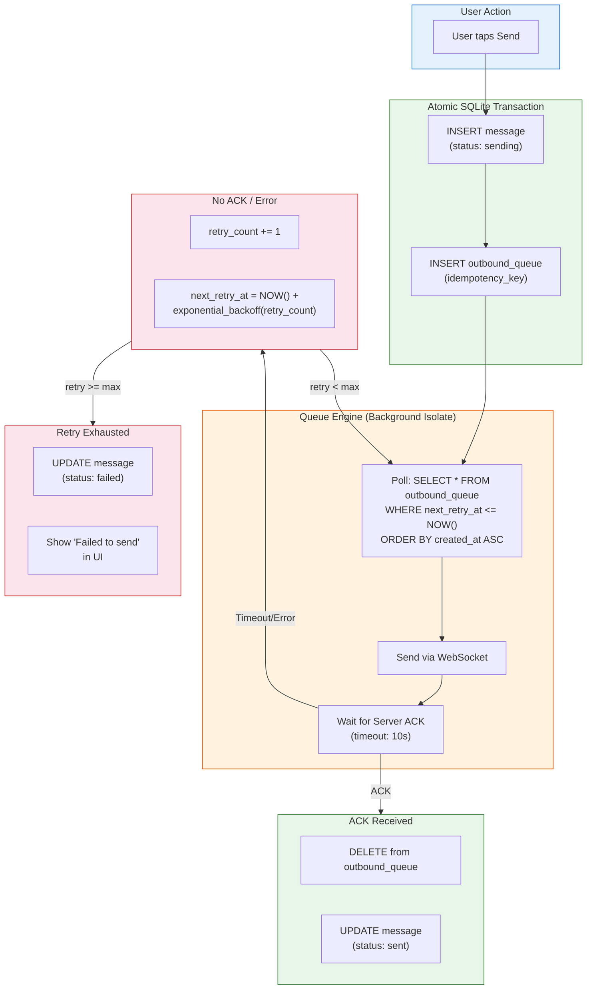
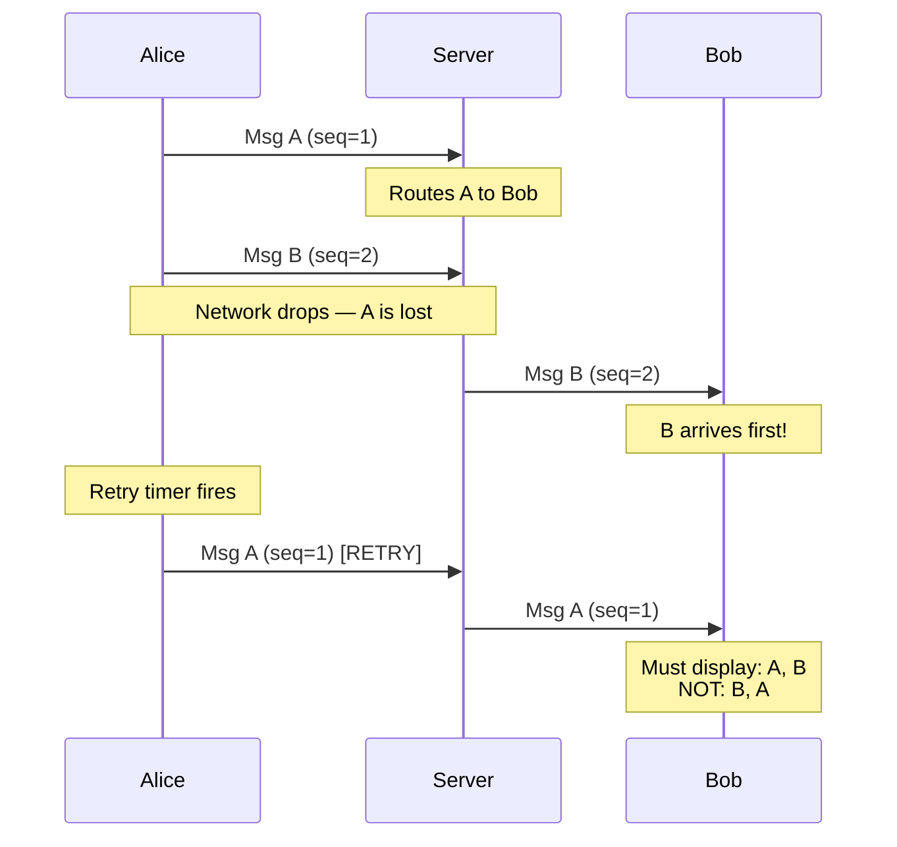
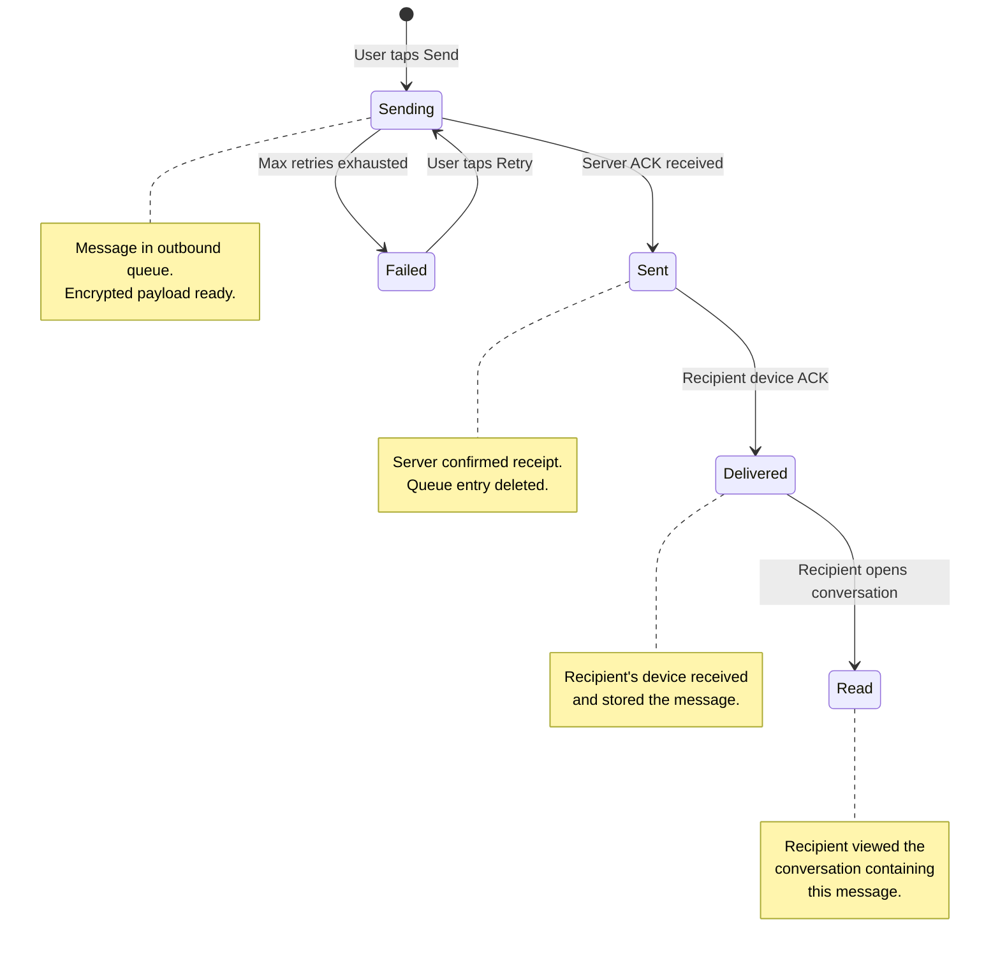
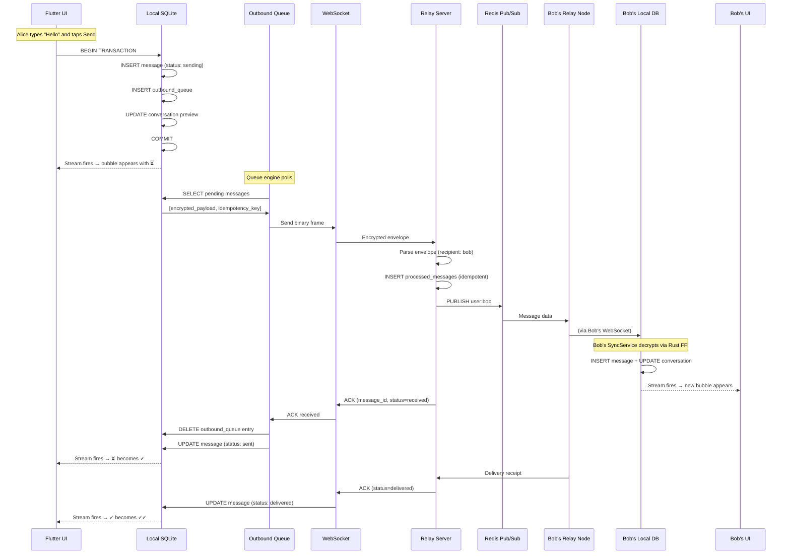

# 5. Offline Queues and Message Delivery Guarantees 🔴

> **The Problem:** Mobile networks are unreliable by nature. A user composes a message on the subway, taps send, and the phone immediately enters a tunnel with zero signal. The message must not be lost. It must not be sent twice when connectivity resumes (recipient sees duplicate messages). It must not arrive out of order relative to other messages in the same conversation. And if the app process is killed by the OS while offline, the message must survive and retry on next app launch. We need an outbound queue with **exactly-once delivery semantics**, **in-order guarantees**, and **crash durability** — all running on a mobile device with constrained memory and battery.

---

## The Delivery Guarantee Spectrum

| Guarantee | Definition | Risk | Our Target |
|---|---|---|---|
| **At-most-once** | Send and forget — no retries | Messages silently lost | ❌ Unacceptable |
| **At-least-once** | Retry until ACK — may duplicate | Recipient sees message twice | ⚠️ Close, but not enough |
| **Exactly-once** | Each message delivered precisely once | Requires idempotency infrastructure | ✅ Our target |

True exactly-once delivery is impossible in a distributed system (see: the Two Generals' Problem). What we implement is **effectively exactly-once**: at-least-once delivery with **server-side idempotency** that deduplicates retries. The recipient sees each message exactly once.

---

## The Outbound Queue Architecture



---

## Idempotency: The Foundation of Exactly-Once

Every outbound message carries a **UUID idempotency key** generated at send time. This key is:
1. Written to the local outbound queue in the same transaction as the message.
2. Included in every retry attempt.
3. Used by the server to deduplicate: `INSERT ... ON CONFLICT (message_id) DO NOTHING`.

### Why UUID v4?

| Property | UUID v4 | Timestamp-based | Auto-increment |
|---|---|---|---|
| Globally unique without coordination | ✅ Yes | ⚠️ Clock skew risk | ❌ Needs central authority |
| Reveals no timing information | ✅ Yes | ❌ No | ❌ No |
| Works across devices | ✅ Yes | ⚠️ Collision risk | ❌ No |
| Size | 16 bytes | 8 bytes | 4–8 bytes |

The 16-byte cost is negligible compared to the encrypted payload, and the collision probability (1 in 2^122) makes conflicts effectively impossible.

### Server-Side Idempotency

```rust,ignore
// ✅ Server: idempotent message handling
// The relay server deduplicates using the message_id UUID.

async fn handle_incoming_message(envelope: &Envelope, state: &AppState) {
    let msg_uuid = Uuid::from_bytes(envelope.message_id);

    // ✅ Check if we've already processed this message
    let already_exists = sqlx::query_scalar!(
        "SELECT EXISTS(SELECT 1 FROM processed_messages WHERE message_id = $1)",
        msg_uuid,
    )
    .fetch_one(&state.db)
    .await
    .unwrap_or(Some(false))
    .unwrap_or(false);

    if already_exists {
        // ✅ Duplicate — send ACK without re-routing
        tracing::debug!(message_id = %msg_uuid, "Duplicate message, sending ACK only");
        send_ack(envelope, state).await;
        return;
    }

    // ✅ Record the message_id atomically with routing
    sqlx::query!(
        r#"
        INSERT INTO processed_messages (message_id, processed_at)
        VALUES ($1, NOW())
        ON CONFLICT (message_id) DO NOTHING
        "#,
        msg_uuid,
    )
    .execute(&state.db)
    .await
    .unwrap_or_default();

    // Route the message
    route_to_recipient(envelope, state).await;

    // Send ACK to sender
    send_ack(envelope, state).await;
}
```

---

## The Queue Engine

The queue engine runs on a background Dart isolate, polling the outbound queue and draining it via WebSocket.

### Naive Approach: Fire-and-Forget

```dart
// 💥 HAZARD: Send and don't wait for ACK.
// - If the network drops mid-send, the message is lost.
// - No retry logic — subway = lost messages.
// - No idempotency — if we add retries naively, duplicates appear.

class NaiveMessageSender {
  void send(String text, String conversationId) {
    final encrypted = crypto.encrypt(text);
    // 💥 Fire and forget — no ACK, no retry, no durability
    websocket.send(encrypted);
    // If this fails silently (which it will on mobile), the message is GONE.
  }
}
```

### Production Approach: Durable Queue with Exponential Backoff

```dart
// lib/src/services/outbound_queue.dart

import 'dart:async';
import 'dart:math';
import 'package:drift/drift.dart';
import '../database/database.dart';

/// The outbound queue engine — drains pending messages via WebSocket.
///
/// Design principles:
/// 1. Messages are durable (SQLite) — survive app kills.
/// 2. Each message has an idempotency key — server deduplicates.
/// 3. Exponential backoff with jitter — prevents thundering herd.
/// 4. Respects conversation ordering — messages in same conversation are FIFO.
class OutboundQueueEngine {
  final AppDatabase _db;
  final WebSocketChannel _ws;
  final Map<String, Completer<void>> _pendingAcks = {};
  Timer? _drainTimer;
  bool _isDraining = false;

  static const _maxRetries = 10;
  static const _baseDelayMs = 1000; // 1 second
  static const _maxDelayMs = 300000; // 5 minutes

  OutboundQueueEngine(this._db, this._ws);

  /// Start the queue engine — polls and drains pending messages.
  void start() {
    // ✅ Listen for ACKs from the server
    _ws.stream.listen(_onServerMessage);

    // ✅ Drain immediately, then poll every 2 seconds
    _drain();
    _drainTimer = Timer.periodic(
      const Duration(seconds: 2),
      (_) => _drain(),
    );
  }

  /// Drain all messages that are due for (re)sending.
  Future<void> _drain() async {
    if (_isDraining) return; // Prevent concurrent drains
    _isDraining = true;

    try {
      final now = DateTime.now();

      // ✅ Fetch messages ready to send, ordered by creation time (FIFO)
      final pending = await (_db.select(_db.outboundQueue)
            ..where((q) => q.nextRetryAt.isSmallerOrEqualValue(now))
            ..orderBy([(q) => OrderingTerm.asc(q.createdAt)])
            ..limit(50)) // Batch size — don't overwhelm the socket
          .get();

      for (final item in pending) {
        await _sendOne(item);
      }
    } finally {
      _isDraining = false;
    }
  }

  /// Send a single queued message and wait for ACK.
  Future<void> _sendOne(OutboundQueueData item) async {
    try {
      // ✅ Create a completer for this message's ACK
      final ackCompleter = Completer<void>();
      _pendingAcks[item.idempotencyKey] = ackCompleter;

      // ✅ Send via WebSocket
      _ws.sink.add(item.encryptedPayload);

      // ✅ Wait for ACK with timeout
      await ackCompleter.future.timeout(
        const Duration(seconds: 10),
        onTimeout: () => throw TimeoutException('ACK timeout'),
      );

      // ✅ ACK received — delete from queue, update message status
      await _db.transaction(() async {
        await (_db.delete(_db.outboundQueue)
              ..where((q) => q.id.equals(item.id)))
            .go();
        await (_db.update(_db.messages)
              ..where((m) => m.id.equals(item.messageId)))
            .write(const MessagesCompanion(
          status: Value(MessageStatus.sent),
        ));
      });
    } on TimeoutException {
      // ✅ No ACK — schedule retry with exponential backoff
      await _scheduleRetry(item);
    } on WebSocketException {
      // ✅ Connection lost — schedule retry
      await _scheduleRetry(item);
    } finally {
      _pendingAcks.remove(item.idempotencyKey);
    }
  }

  /// Schedule a retry with exponential backoff + jitter.
  Future<void> _scheduleRetry(OutboundQueueData item) async {
    final newRetryCount = item.retryCount + 1;

    if (newRetryCount >= _maxRetries) {
      // ✅ Exhausted retries — mark as failed
      await _db.transaction(() async {
        await (_db.delete(_db.outboundQueue)
              ..where((q) => q.id.equals(item.id)))
            .go();
        await (_db.update(_db.messages)
              ..where((m) => m.id.equals(item.messageId)))
            .write(const MessagesCompanion(
          status: Value(MessageStatus.failed),
        ));
      });
      return;
    }

    // ✅ Exponential backoff: 1s, 2s, 4s, 8s, 16s, 32s, 64s, 128s, 256s
    // With ±25% jitter to prevent thundering herd
    final baseDelay = _baseDelayMs * pow(2, newRetryCount);
    final cappedDelay = min(baseDelay, _maxDelayMs);
    final jitter = (Random().nextDouble() * 0.5 - 0.25) * cappedDelay;
    final delay = Duration(milliseconds: (cappedDelay + jitter).toInt());
    final nextRetry = DateTime.now().add(delay);

    await (_db.update(_db.outboundQueue)
          ..where((q) => q.id.equals(item.id)))
        .write(OutboundQueueCompanion(
      retryCount: Value(newRetryCount),
      nextRetryAt: Value(nextRetry),
    ));
  }

  /// Handle server messages — extract ACKs.
  void _onServerMessage(dynamic data) {
    final bytes = data as List<int>;
    final ack = _parseAck(bytes);
    if (ack != null) {
      final completer = _pendingAcks[ack.idempotencyKey];
      if (completer != null && !completer.isCompleted) {
        completer.complete();
      }
    }
  }

  void stop() {
    _drainTimer?.cancel();
  }
}
```

---

## Message Ordering Guarantees

### The Ordering Problem

Messages in the same conversation must appear in the order they were composed, even if they arrive out of order due to retries and network reordering.



### Solution: Local Sequence Numbers

Each conversation maintains a **monotonically increasing local sequence number** (Lamport-style). Messages are ordered by this number, not by arrival time.

```dart
// The message table's localSequence column provides the ordering.
// Even if Msg B arrives before Msg A:
//   Msg A: localSequence = 1
//   Msg B: localSequence = 2
//
// The Drift query orders by localSequence ASC:
Stream<List<Message>> watchMessages(int conversationId) {
  return (select(messages)
        ..where((m) => m.conversationId.equals(conversationId))
        ..orderBy([(m) => OrderingTerm.asc(m.localSequence)]))
      .watch();
}
// Result: [A (seq=1), B (seq=2)] — correct order regardless of arrival time.
```

### Server-Assigned Timestamps

For cross-device ordering (Alice sends from phone and tablet simultaneously), we use the **server-assigned timestamp** as a secondary sort key:

```dart
// Final ordering: localSequence first, serverTimestamp as tiebreaker
Stream<List<Message>> watchMessages(int conversationId) {
  return (select(messages)
        ..where((m) => m.conversationId.equals(conversationId))
        ..orderBy([
          (m) => OrderingTerm.asc(m.localSequence),
          (m) => OrderingTerm.asc(m.serverTimestamp),
        ]))
      .watch();
}
```

---

## Crash Recovery

The outbound queue must survive app kills. On iOS, the system can terminate the app at any time (memory pressure, background limits). On Android, the process can be killed instantly when the user swipes it away.

### The Crash-Safe Design

```
┌─────────────────────────────────────────────────┐
│              SQLite (on disk)                     │
│  ┌──────────────┐  ┌───────────────────────┐    │
│  │   messages    │  │   outbound_queue      │    │
│  │ (status:      │  │ (encrypted_payload,   │    │
│  │  sending)     │  │  idempotency_key,     │    │
│  │              │  │  retry_count,          │    │
│  │              │  │  next_retry_at)        │    │
│  └──────────────┘  └───────────────────────┘    │
│                                                   │
│  Both tables written in a SINGLE TRANSACTION.    │
│  If the app crashes between INSERT and send,     │
│  the queue entry survives on disk.               │
└─────────────────────────────────────────────────┘
```

### Recovery on App Start

```dart
// lib/src/services/app_lifecycle.dart

class AppLifecycleManager {
  final AppDatabase _db;
  final OutboundQueueEngine _queue;

  /// Called on every app start (cold start or resume).
  Future<void> onAppStart() async {
    // ✅ Step 1: Check for messages stuck in "sending" state.
    // These are messages that were being sent when the app was killed.
    // Their outbound_queue entries still exist — the queue engine
    // will pick them up automatically on next drain.

    final stuckMessages = await (_db.select(_db.messages)
          ..where((m) => m.status.equals(MessageStatus.sending.index)))
        .get();

    if (stuckMessages.isNotEmpty) {
      // ✅ Verify each stuck message has a queue entry
      for (final msg in stuckMessages) {
        final hasQueueEntry = await (_db.select(_db.outboundQueue)
              ..where((q) => q.messageId.equals(msg.id)))
            .getSingleOrNull();

        if (hasQueueEntry == null) {
          // Edge case: message was inserted but queue entry
          // was not (crash mid-transaction — shouldn't happen
          // with atomic transactions, but defensive).
          await (_db.update(_db.messages)
                ..where((m) => m.id.equals(msg.id)))
              .write(const MessagesCompanion(
            status: Value(MessageStatus.failed),
          ));
        }
      }
    }

    // ✅ Step 2: Reset any messages with next_retry_at in the far future
    // (e.g., if the app was killed during a long backoff period,
    // and the user restarts, retry immediately)
    final cutoff = DateTime.now().subtract(const Duration(minutes: 5));
    await (_db.update(_db.outboundQueue)
          ..where((q) => q.nextRetryAt.isBiggerThanValue(
              DateTime.now().add(const Duration(minutes: 5)))))
        .write(OutboundQueueCompanion(
      nextRetryAt: Value(DateTime.now()),
    ));

    // ✅ Step 3: Start the queue engine
    _queue.start();
  }
}
```

---

## Delivery Receipts

The server sends ACK frames back to the sender to confirm message receipt. These update the message status through the full pipeline:



### Server ACK Wire Format

```
┌─────────────────────────────────┐
│  type: u8 = 0x02 (ACK)          │
│  message_id: [u8; 16] (UUID)    │
│  status: u8                      │
│    0x01 = received by server     │
│    0x02 = delivered to recipient │
│    0x03 = read by recipient      │
│  server_timestamp: i64           │
└─────────────────────────────────┘
```

### Processing Receipts

```dart
// lib/src/services/receipt_handler.dart

class ReceiptHandler {
  final AppDatabase _db;

  ReceiptHandler(this._db);

  Future<void> handleReceipt(ServerAck ack) async {
    final newStatus = switch (ack.status) {
      0x01 => MessageStatus.sent,
      0x02 => MessageStatus.delivered,
      0x03 => MessageStatus.read,
      _ => null,
    };

    if (newStatus == null) return;

    // ✅ Update message status — Drift stream auto-notifies the UI
    await (_db.update(_db.messages)
          ..where((m) => m.remoteId.equals(ack.messageId)))
        .write(MessagesCompanion(
      status: Value(newStatus),
      serverTimestamp: Value(DateTime.fromMillisecondsSinceEpoch(
        ack.serverTimestamp,
      )),
    ));

    // ✅ If this was a send ACK, also remove from outbound queue
    if (ack.status == 0x01) {
      await (_db.delete(_db.outboundQueue)
            ..where((q) => q.idempotencyKey.equals(ack.messageId)))
          .go();
    }
  }
}
```

---

## The Retry Backoff Strategy

### Exponential Backoff with Jitter

```
Attempt  Base Delay  With Jitter (±25%)   Cumulative
──────── ────────── ──────────────────── ──────────
   1       1 sec      0.75 – 1.25 sec       ~1 sec
   2       2 sec      1.50 – 2.50 sec       ~3 sec
   3       4 sec      3.00 – 5.00 sec       ~7 sec
   4       8 sec      6.00 – 10.0 sec      ~15 sec
   5      16 sec     12.0  – 20.0 sec      ~31 sec
   6      32 sec     24.0  – 40.0 sec      ~63 sec
   7      64 sec     48.0  – 80.0 sec     ~127 sec
   8     128 sec     96.0  – 160  sec     ~255 sec
   9     256 sec    192   – 320  sec      ~511 sec
  10     300 sec    225   – 375  sec    (CAPPED — then FAIL)
```

### Why Jitter?

Without jitter, if 10,000 users lose connectivity simultaneously (e.g., the relay server restarts), all 10,000 retry at exactly the same intervals — creating a thundering herd that DDoSes the server the moment it comes back. Jitter spreads the retries across a time window.

```dart
// ✅ Jittered exponential backoff
int calculateBackoffMs(int retryCount) {
  final baseMs = 1000 * pow(2, retryCount).toInt();
  final cappedMs = min(baseMs, 300000); // Cap at 5 minutes
  // Add ±25% jitter
  final jitterRange = cappedMs * 0.5;
  final jitter = (Random().nextDouble() - 0.5) * jitterRange;
  return (cappedMs + jitter).toInt();
}
```

---

## Handling Network State Changes

```dart
// lib/src/services/connectivity_monitor.dart

import 'package:connectivity_plus/connectivity_plus.dart';

class ConnectivityMonitor {
  final OutboundQueueEngine _queue;
  final SyncService _sync;

  ConnectivityMonitor(this._queue, this._sync);

  void start() {
    Connectivity().onConnectivityChanged.listen((result) {
      if (result != ConnectivityResult.none) {
        // ✅ Network restored — immediately drain the queue
        // Don't wait for the next poll interval
        _queue.drainNow();

        // ✅ Reconnect WebSocket if disconnected
        _sync.reconnectIfNeeded();
      }
    });
  }
}
```

---

## The Complete Message Lifecycle

Putting it all together — from user tap to recipient screen:



---

## Testing Delivery Guarantees

```dart
// test/outbound_queue_test.dart

import 'package:test/test.dart';
import '../lib/src/database/database.dart';
import '../lib/src/services/outbound_queue.dart';

void main() {
  late AppDatabase db;
  late MockWebSocket ws;
  late OutboundQueueEngine queue;

  setUp(() {
    db = AppDatabase(NativeDatabase.memory());
    ws = MockWebSocket();
    queue = OutboundQueueEngine(db, ws);
  });

  tearDown(() async {
    queue.stop();
    await db.close();
  });

  test('message survives app kill and retries on restart', () async {
    // Simulate: user sends a message
    await db.sendMessage(
      conversationId: 1,
      remoteId: 'msg-1',
      senderUserId: 'alice',
      ciphertext: Uint8List.fromList([1, 2, 3]),
      plaintext: 'Hello',
      idempotencyKey: 'idem-1',
      encryptedPayload: Uint8List.fromList([4, 5, 6]),
    );

    // Simulate: app is killed (queue never drains)
    // On next app start, the outbound_queue entry is still there:
    final pending = await db.select(db.outboundQueue).get();
    expect(pending, hasLength(1));
    expect(pending.first.idempotencyKey, 'idem-1');

    // Restart the queue engine
    queue.start();
    await Future.delayed(const Duration(seconds: 3));

    // The queue engine should have attempted to send
    expect(ws.sentMessages, isNotEmpty);
  });

  test('duplicate sends are idempotent on server', () async {
    await db.sendMessage(
      conversationId: 1,
      remoteId: 'msg-dup',
      senderUserId: 'alice',
      ciphertext: Uint8List.fromList([1]),
      plaintext: 'test',
      idempotencyKey: 'idem-dup',
      encryptedPayload: Uint8List.fromList([2]),
    );

    // Send the same message twice (simulating retry)
    ws.simulateAckFor('idem-dup');

    queue.start();
    await Future.delayed(const Duration(seconds: 3));

    // Message should be sent exactly once
    final msgs = await db.select(db.messages).get();
    expect(msgs.first.status, MessageStatus.sent);

    // Queue should be empty
    final queueItems = await db.select(db.outboundQueue).get();
    expect(queueItems, isEmpty);
  });

  test('exponential backoff respects max retries', () async {
    ws.simulateAllSendsFailing(); // Force all sends to fail

    await db.sendMessage(
      conversationId: 1,
      remoteId: 'msg-fail',
      senderUserId: 'alice',
      ciphertext: Uint8List.fromList([1]),
      plaintext: 'doomed',
      idempotencyKey: 'idem-fail',
      encryptedPayload: Uint8List.fromList([2]),
    );

    // Fast-forward through all retries
    for (var i = 0; i < 10; i++) {
      await queue.drainNow();
      // Manually advance next_retry_at to now for testing
      await (db.update(db.outboundQueue))
          .write(OutboundQueueCompanion(
        nextRetryAt: Value(DateTime.now()),
      ));
    }

    // After max retries, message should be marked failed
    final msgs = await db.select(db.messages).get();
    expect(msgs.first.status, MessageStatus.failed);

    // Queue should be empty (entry removed after failure)
    final queueItems = await db.select(db.outboundQueue).get();
    expect(queueItems, isEmpty);
  });

  test('messages in same conversation maintain FIFO order', () async {
    for (var i = 0; i < 5; i++) {
      await db.sendMessage(
        conversationId: 1,
        remoteId: 'msg-$i',
        senderUserId: 'alice',
        ciphertext: Uint8List.fromList([i]),
        plaintext: 'Message $i',
        idempotencyKey: 'idem-$i',
        encryptedPayload: Uint8List.fromList([i]),
      );
    }

    ws.simulateAckForAll(); // ACK everything
    queue.start();
    await Future.delayed(const Duration(seconds: 3));

    // Verify messages were sent in order
    expect(ws.sentOrder, orderedEquals(['idem-0', 'idem-1', 'idem-2', 'idem-3', 'idem-4']));
  });
}
```

---

## Battery and Performance Considerations

| Concern | Mitigation |
|---|---|
| Polling interval drains battery | Use platform push notifications (APNs/FCM) to wake the app instead of polling |
| Background isolate killed by OS | Queue is durable (SQLite) — survives process death |
| Large queue after extended offline | Batch send (50 messages per drain) with backpressure |
| WebSocket keep-alive | Send ping frames every 30 seconds; reconnect on pong timeout |
| Redundant retries | Server-side idempotency deduplicates; no wasted bandwidth |

### Platform Push for Wakeup

```dart
// Instead of keeping the WebSocket alive in the background (which iOS kills),
// use APNs/FCM as a "wake up" signal:
//
// 1. App goes to background → WebSocket closes.
// 2. Alice sends a message to Bob.
// 3. Relay server can't deliver via WebSocket (Bob offline).
// 4. Relay sends a SILENT push notification via APNs/FCM.
// 5. Bob's OS wakes the app briefly.
// 6. App reconnects WebSocket, receives offline messages.
// 7. App goes back to background.
//
// The push notification contains NO message content — just a "wake up" signal.
// E2E encryption is preserved because the push payload is empty.
```

---

> **Key Takeaways**
>
> 1. **Exactly-once delivery = at-least-once + idempotency** — the client retries until ACK, and the server deduplicates using the message_id UUID. The recipient never sees duplicates.
> 2. **The outbound queue is SQLite-backed** — it survives app kills, OS process termination, and device reboots. Messages are never lost once the user taps Send.
> 3. **Exponential backoff with jitter** prevents thundering herd when recovering from outages. The ±25% jitter spreads retries across a time window.
> 4. **Atomic transactions** ensure the message and its queue entry are always in sync. There is no window where a message exists without a queue entry or vice versa.
> 5. **Local sequence numbers** guarantee message ordering within a conversation regardless of arrival order. The UI sorts by sequence number, not by arrival time.
> 6. **Delivery receipts flow through the same reactive pipeline** — `sending → sent → delivered → read` status changes are SQLite UPDATEs that trigger Drift streams, which Riverpod propagates to the UI. The checkmarks appear automatically.
> 7. **Battery-conscious design** uses platform push notifications to wake the app instead of keeping a background WebSocket alive. The push contains zero message content — E2E encryption integrity is maintained.
